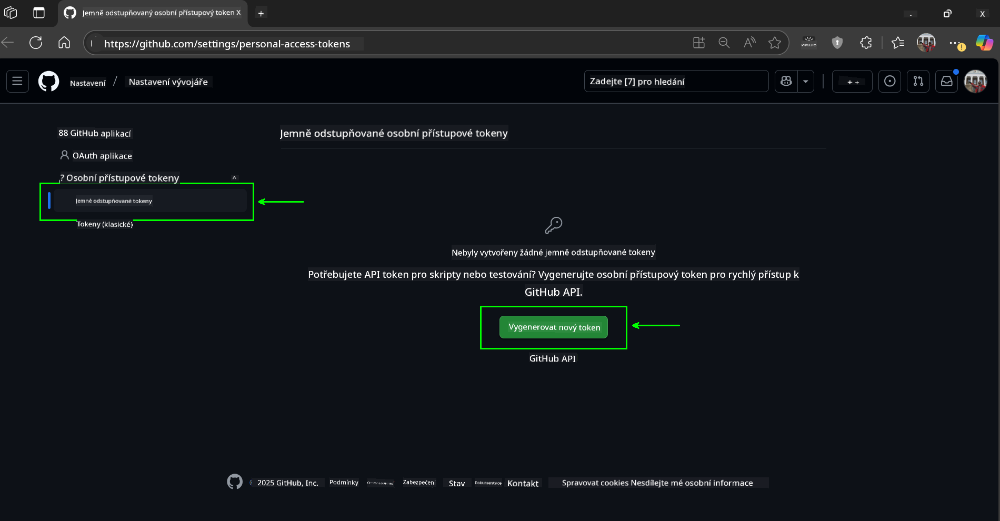
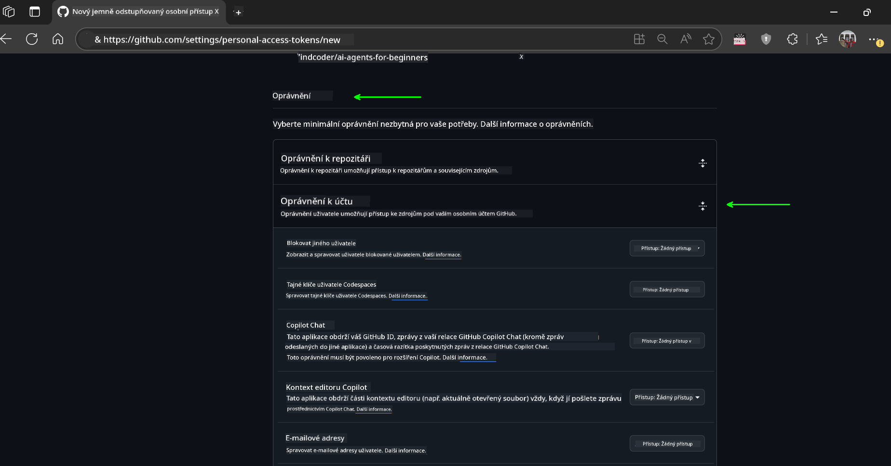

<!--
CO_OP_TRANSLATOR_METADATA:
{
  "original_hash": "c6a79c8f2b56a80370ff7e447765524f",
  "translation_date": "2025-07-24T08:57:30+00:00",
  "source_file": "00-course-setup/README.md",
  "language_code": "cs"
}
-->
# Nastavení kurzu

## Úvod

Tato lekce se zaměřuje na spuštění ukázkového kódu z tohoto kurzu.

## Klonování nebo forkování tohoto repozitáře

Nejprve si prosím naklonujte nebo forkněte GitHub repozitář. Tím získáte vlastní verzi materiálů kurzu, abyste mohli kód spouštět, testovat a upravovat!

To lze provést kliknutím na odkaz na

Měli byste nyní mít vlastní forknutou verzi tohoto kurzu na následujícím odkazu:


## Spuštění kódu

Tento kurz nabízí sérii Jupyter Notebooků, které si můžete spustit a získat praktické zkušenosti s vytvářením AI agentů.

Ukázky kódu využívají jednu z následujících možností:

**Vyžaduje GitHub účet - zdarma**:

1) Semantic Kernel Agent Framework + GitHub Models Marketplace. Označeno jako (semantic-kernel.ipynb)  
2) AutoGen Framework + GitHub Models Marketplace. Označeno jako (autogen.ipynb)  

**Vyžaduje předplatné Azure**:  
3) Azure AI Foundry + Azure AI Agent Service. Označeno jako (azureaiagent.ipynb)  

Doporučujeme vyzkoušet všechny tři typy příkladů, abyste zjistili, který vám nejlépe vyhovuje.

Vaše volba určí, které kroky nastavení budete muset níže následovat:

## Požadavky

- Python 3.12+  
  - **POZNÁMKA**: Pokud nemáte nainstalovaný Python 3.12, ujistěte se, že jej nainstalujete. Poté vytvořte svůj virtuální prostředí (venv) pomocí python3.12, abyste zajistili správnou instalaci verzí z requirements.txt.
- GitHub účet - pro přístup k GitHub Models Marketplace
- Předplatné Azure - pro přístup k Azure AI Foundry
- Azure AI Foundry účet - pro přístup k Azure AI Agent Service

V kořenovém adresáři tohoto repozitáře jsme zahrnuli soubor `requirements.txt`, který obsahuje všechny potřebné Python balíčky pro spuštění ukázek kódu.

Můžete je nainstalovat spuštěním následujícího příkazu v terminálu v kořenovém adresáři repozitáře:

```bash
pip install -r requirements.txt
```  
Doporučujeme vytvořit Python virtuální prostředí, abyste předešli konfliktům a problémům.

## Nastavení VSCode
Ujistěte se, že v VSCode používáte správnou verzi Pythonu.


## Nastavení pro ukázky využívající GitHub Models 

### Krok 1: Získání GitHub Personal Access Token (PAT)

Tento kurz využívá GitHub Models Marketplace, který poskytuje bezplatný přístup k velkým jazykovým modelům (LLMs), které budete používat k vytváření AI agentů.

Pro použití GitHub Models budete muset vytvořit [GitHub Personal Access Token](https://docs.github.com/en/authentication/keeping-your-account-and-data-secure/managing-your-personal-access-tokens).

To lze provést přihlášením do vašeho GitHub účtu.

Dodržujte [Princip minimálních oprávnění](https://docs.github.com/en/get-started/learning-to-code/storing-your-secrets-safely) při vytváření tokenu. To znamená, že byste měli tokenu přidělit pouze ta oprávnění, která jsou nezbytná pro spuštění ukázek kódu v tomto kurzu.

1. Na levé straně obrazovky vyberte možnost `Fine-grained tokens`.

    Poté vyberte `Generate new token`.

    

1. Zadejte popisný název pro váš token, který odráží jeho účel, aby byl později snadno identifikovatelný. Nastavte datum expirace (doporučeno: 30 dní; můžete zvolit kratší období, například 7 dní, pokud preferujete vyšší úroveň zabezpečení).

    

1. Omezte rozsah tokenu na váš fork tohoto repozitáře.

    

1. Omezte oprávnění tokenu: V části **Permissions** přepněte na **Account Permissions**, přejděte na **Models** a povolte pouze přístup pro čtení potřebný pro GitHub Models.

    

    

Zkopírujte nový token, který jste právě vytvořili. Nyní jej přidáte do souboru `.env` zahrnutého v tomto kurzu.

### Krok 2: Vytvoření souboru `.env`

Pro vytvoření souboru `.env` spusťte následující příkaz v terminálu.

```bash
cp .env.example .env
```

Tím zkopírujete příkladový soubor a vytvoříte `.env` ve vašem adresáři, kde vyplníte hodnoty pro proměnné prostředí.

S vaším zkopírovaným tokenem otevřete soubor `.env` ve svém oblíbeném textovém editoru a vložte token do pole `GITHUB_TOKEN`.

Nyní byste měli být schopni spustit ukázky kódu z tohoto kurzu.

## Nastavení pro ukázky využívající Azure AI Foundry a Azure AI Agent Service

### Krok 1: Získání koncového bodu projektu Azure

Postupujte podle kroků pro vytvoření hubu a projektu v Azure AI Foundry, které najdete zde: [Přehled zdrojů hubu](https://learn.microsoft.com/en-us/azure/ai-foundry/concepts/ai-resources)

Jakmile vytvoříte projekt, budete muset získat připojovací řetězec pro váš projekt.

To lze provést na stránce **Overview** vašeho projektu v portálu Azure AI Foundry.


### Krok 2: Vytvoření souboru `.env`

Pro vytvoření souboru `.env` spusťte následující příkaz v terminálu.

```bash
cp .env.example .env
```

Tím zkopírujete příkladový soubor a vytvoříte `.env` ve vašem adresáři, kde vyplníte hodnoty pro proměnné prostředí.

S vaším zkopírovaným tokenem otevřete soubor `.env` ve svém oblíbeném textovém editoru a vložte token do pole `PROJECT_ENDPOINT`.

### Krok 3: Přihlášení do Azure

Jako bezpečnostní nejlepší praxi použijeme [autentizaci bez klíče](https://learn.microsoft.com/azure/developer/ai/keyless-connections?tabs=csharp%2Cazure-cli?WT.mc_id=academic-105485-koreyst) pro přihlášení do Azure OpenAI pomocí Microsoft Entra ID.

Otevřete terminál a spusťte `az login --use-device-code` pro přihlášení do vašeho Azure účtu.

Po přihlášení vyberte v terminálu své předplatné.

## Další proměnné prostředí - Azure Search a Azure OpenAI 

Pro lekci Agentic RAG - Lekce 5 - jsou zde ukázky, které využívají Azure Search a Azure OpenAI.

Pokud chcete tyto ukázky spustit, budete muset přidat následující proměnné prostředí do vašeho souboru `.env`:

### Stránka přehledu (Projekt)

- `AZURE_SUBSCRIPTION_ID` - Zkontrolujte **Project details** na stránce **Overview** vašeho projektu.

- `AZURE_AI_PROJECT_NAME` - Podívejte se na horní část stránky **Overview** vašeho projektu.

- `AZURE_OPENAI_SERVICE` - Najděte to na kartě **Included capabilities** pro **Azure OpenAI Service** na stránce **Overview**.

### Centrum správy

- `AZURE_OPENAI_RESOURCE_GROUP` - Přejděte na **Project properties** na stránce **Overview** v **Management Center**.

- `GLOBAL_LLM_SERVICE` - V části **Connected resources** najděte název připojení **Azure AI Services**. Pokud není uveden, zkontrolujte **Azure portal** ve vaší skupině zdrojů pro název zdroje AI Services.

### Stránka modelů a koncových bodů

- `AZURE_OPENAI_EMBEDDING_DEPLOYMENT_NAME` - Vyberte svůj embedding model (např. `text-embedding-ada-002`) a poznamenejte si **Deployment name** z detailů modelu.

- `AZURE_OPENAI_CHAT_DEPLOYMENT_NAME` - Vyberte svůj chat model (např. `gpt-4o-mini`) a poznamenejte si **Deployment name** z detailů modelu.

### Azure Portal

- `AZURE_OPENAI_ENDPOINT` - Najděte **Azure AI services**, klikněte na něj, poté přejděte na **Resource Management**, **Keys and Endpoint**, sjeďte dolů na "Azure OpenAI endpoints" a zkopírujte ten, který říká "Language APIs".

- `AZURE_OPENAI_API_KEY` - Na stejné obrazovce zkopírujte KLÍČ 1 nebo KLÍČ 2.

- `AZURE_SEARCH_SERVICE_ENDPOINT` - Najděte svůj zdroj **Azure AI Search**, klikněte na něj a podívejte se na **Overview**.

- `AZURE_SEARCH_API_KEY` - Poté přejděte na **Settings** a poté **Keys**, abyste zkopírovali primární nebo sekundární administrátorský klíč.

### Externí webová stránka

- `AZURE_OPENAI_API_VERSION` - Navštivte stránku [API version lifecycle](https://learn.microsoft.com/en-us/azure/ai-services/openai/api-version-deprecation#latest-ga-api-release) pod **Latest GA API release**.

### Nastavení autentizace bez klíče

Místo pevného zakódování vašich přihlašovacích údajů použijeme připojení bez klíče s Azure OpenAI. K tomu importujeme `DefaultAzureCredential` a později zavoláme funkci `DefaultAzureCredential` pro získání přihlašovacích údajů.

```python
from azure.identity import DefaultAzureCredential, InteractiveBrowserCredential
```

## Máte někde problém?

Pokud narazíte na jakékoli problémy při nastavování, připojte se do našeho

## Další lekce

Nyní jste připraveni spustit kód pro tento kurz. Přejeme vám hodně zábavy při objevování světa AI agentů!

[Úvod do AI agentů a jejich využití](../01-intro-to-ai-agents/README.md)

**Upozornění**:  
Tento dokument byl přeložen pomocí služby pro automatický překlad [Co-op Translator](https://github.com/Azure/co-op-translator). I když se snažíme o přesnost, mějte prosím na paměti, že automatické překlady mohou obsahovat chyby nebo nepřesnosti. Původní dokument v jeho původním jazyce by měl být považován za závazný zdroj. Pro důležité informace se doporučuje profesionální lidský překlad. Nezodpovídáme za jakékoli nedorozumění nebo nesprávné interpretace vyplývající z použití tohoto překladu.