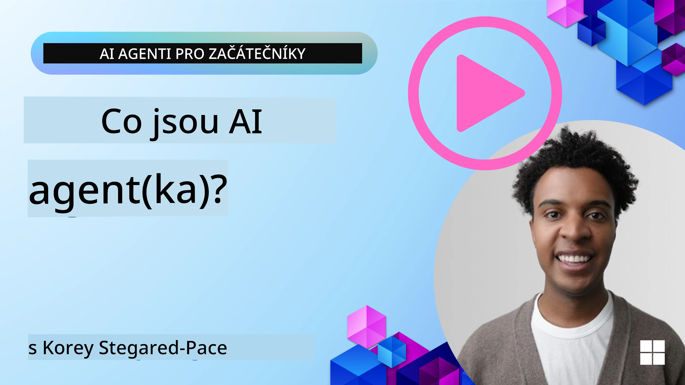
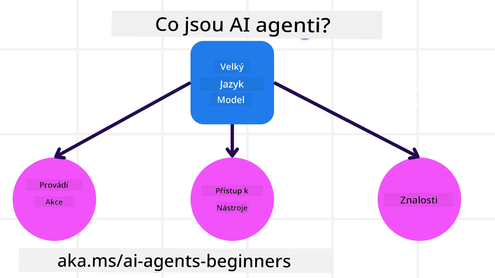
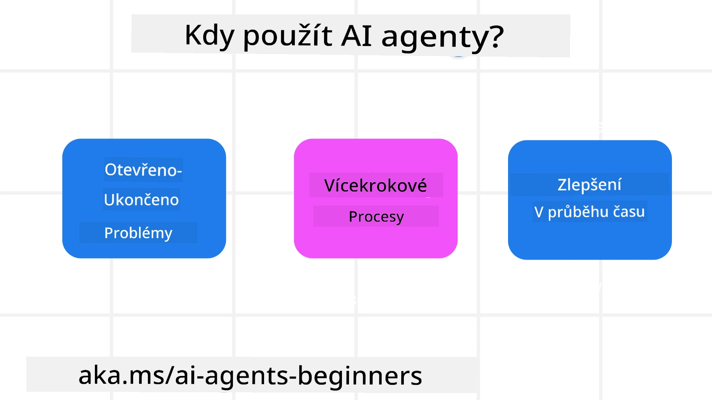

> _(Klikněte na obrázek výše pro zhlédnutí videa této lekce)_

# Úvod do AI agentů a případů použití agentů

Vítejte v kurzu "AI Agents for Beginners"! Tento kurz poskytuje základní znalosti a praktické ukázky pro vytváření AI agentů.

Připojte se k <a href="https://discord.gg/kzRShWzttr" target="_blank">komunitě Azure AI na Discordu</a>, kde potkáte další studenty a tvůrce AI agentů a můžete klást jakékoli dotazy k tomuto kurzu.

Pro začátek kurzu si nejdříve lépe objasníme, co AI agenti jsou a jak je můžeme použít v aplikacích a pracovních postupech, které vytváříme.

## Úvod

Tato lekce pokrývá:

- Co jsou AI agenti a jaké jsou různé typy agentů?
- Jaké případy použití jsou pro AI agenty nejvhodnější a jak nám mohou pomoci?
- Jaké jsou některé základní stavební bloky při navrhování agentických řešení?

## Cíle učení
Po dokončení této lekce byste měli být schopni:

- Porozumět konceptům AI agentů a tomu, jak se liší od jiných AI řešení.
- Efektivně využívat AI agenty.
- Produktivně navrhovat agentická řešení pro uživatele i zákazníky.

## Definice AI agentů a typy AI agentů

### Co jsou AI agenti?

AI agenti jsou **systémy**, které umožňují **velkým jazykovým modelům (LLMs)** **provádět akce** rozšířením jejich schopností tím, že modelům LLM poskytují **přístup k nástrojům** a **znalostem**.

Pojďme si tuto definici rozdělit na menší části:

- **Systém** - Je důležité přemýšlet o agentech ne jen jako o jedné komponentě, ale jako o systému mnoha komponent. Na základní úrovni jsou komponenty AI agenta:
  - **Prostředí** - Definovaný prostor, ve kterém AI agent operuje. Například pokud bychom měli AI agenta pro rezervaci cest, prostředím by mohl být rezervační systém, který agent používá k plnění úkolů.
  - **Senzory** - Prostředí má informace a poskytuje zpětnou vazbu. AI agenti používají senzory k získávání a interpretaci těchto informací o aktuálním stavu prostředí. V příkladu cestovního agenta může rezervační systém poskytovat informace, jako je dostupnost hotelů nebo ceny letů.
  - **Aktuátory** - Jakmile AI agent obdrží aktuální stav prostředí, pro daný úkol určí, jakou akci provést, aby změnil prostředí. Pro cestovního agenta by to mohlo být rezervování dostupného pokoje pro uživatele.

**Velké jazykové modely** - Koncept agentů existoval ještě před vznikem LLM. Výhodou vytváření AI agentů s LLM je jejich schopnost interpretovat lidský jazyk a data. Tato schopnost umožňuje LLM interpretovat informace z prostředí a definovat plán ke změně prostředí.

**Provádět akce** - Mimo systémy AI agentů jsou LLM omezeny na situace, kde akce spočívá ve generování obsahu nebo informací na základě uživatelova promptu. V systémech AI agentů mohou LLM úkoly dokončovat tím, že interpretují uživatelovu žádost a používají nástroje dostupné v jejich prostředí.

**Přístup k nástrojům** - Které nástroje má LLM k dispozici, je definováno 1) prostředím, ve kterém operuje, a 2) vývojářem AI agenta. V případě našeho cestovního agenta jsou nástroje agenta omezeny operacemi dostupnými v rezervačním systému a/nebo vývojář může omezit přístup agenta k nástrojům jen na lety.

**Paměť + Znalosti** - Krátkodobá paměť může být v kontextu konverzace mezi uživatelem a agentem. Dlouhodobě, mimo informace poskytované prostředím, mohou AI agenti také načítat znalosti z jiných systémů, služeb, nástrojů nebo dokonce od jiných agentů. V příkladu cestovního agenta by tyto znalosti mohly být informace o uživatelových preferencích cestování uložené v databázi zákazníků.

### Různé typy agentů

Nyní, když máme obecnou definici AI agentů, podívejme se na některé konkrétní typy agentů a jak by byly aplikovány na AI agenta pro rezervaci cest.

| **Typ agenta**                | **Popis**                                                                                                                            | **Příklad**                                                                                                                                                                                                                   |
| ----------------------------- | ------------------------------------------------------------------------------------------------------------------------------------- | ----------------------------------------------------------------------------------------------------------------------------------------------------------------------------------------------------------------------------- |
| **Jednoduché reflexní agenti**      | Provádějí okamžité akce na základě předdefinovaných pravidel.                                                                                  | Cestovní agent interpretuje kontext e-mailu a přeposílá stížnosti na cestování na zákaznickou podporu.                                                                                                                          |
| **Modelově založení reflexní agenti** | Provádějí akce na základě modelu světa a změn v tomto modelu.                                                              | Cestovní agent upřednostňuje trasy s výraznými změnami cen na základě přístupu k historickým údajům o cenách.                                                                                                             |
| **Agent orientovaný na cíle**         | Vytvářejí plány k dosažení konkrétních cílů tím, že interpretují cíl a určují kroky k jeho dosažení.                                  | Cestovní agent rezervuje cestu tím, že určí nezbytná cestovní opatření (auto, veřejná doprava, lety) z aktuální polohy do cíle.                                                                                |
| **Agent založený na užitku**      | Zvažují preference a číselně hodnotí kompromisy k rozhodnutí, jak dosáhnout cílů.                                               | Cestovní agent maximalizuje užitek tím, že při rezervaci zváží pohodlí versus náklady.                                                                                                                                          |
| **Učící se agenti**           | Zlepšují se v čase tím, že reagují na zpětnou vazbu a podle toho upravují své akce.                                                        | Cestovní agent se zlepšuje pomocí zpětné vazby od zákazníků získané v dotaznících po cestě a upravuje budoucí rezervace.                                                                                                               |
| **Hierarchičtí agenti**       | Mají více agentů v hierarchickém systému, kde vyšší úroveň rozdělí úkoly na dílčí úkoly pro nižší úrovně agentů. | Cestovní agent zruší cestu tím, že rozdělí úkol na dílčí úkoly (například zrušení konkrétních rezervací) a nechá nižší úrovně agentů tyto dílčí úkoly dokončit a nahlásit zpět vyššímu agentovi.                                     |
| **Systémy více agentů (MAS)** | Agenti dokončují úkoly nezávisle, buď kooperativně, nebo soutěživě.                                                           | Kooperativně: Více agentů rezervuje specifické cestovní služby, jako jsou hotely, lety a zábava. Soutěživě: Více agentů spravuje a soutěží o sdílený rezervační kalendář hotelu, aby pro zákazníky rezervovali pobyt v hotelu. |

## Kdy používat AI agenty

V dřívější části jsme použili případ použití cestovního agenta k vysvětlení, jak lze různé typy agentů použít v různých scénářích rezervace cest. Tento příklad budeme v průběhu kurzu nadále používat.

Podívejme se na typy případů použití, pro které jsou AI agenti nejvhodnější:

- **Otevřené problémy** - umožňují LLM určit potřebné kroky k dokončení úkolu, protože to nelze vždy pevně zakódovat do pracovního postupu.
- **Víceetapové procesy** - úkoly, které vyžadují úroveň složitosti, při které AI agent musí používat nástroje nebo informace přes více kroků místo jednorázového získání.  
- **Zlepšování v čase** - úkoly, kde se agent může zlepšovat v čase přijímáním zpětné vazby z prostředí nebo od uživatelů, aby poskytoval větší užitek.

V lekci Budování důvěryhodných AI agentů pokryjeme další úvahy o používání AI agentů.

## Základy agentických řešení

### Vývoj agentů

Prvním krokem při navrhování systému AI agenta je definovat nástroje, akce a chování. V tomto kurzu se zaměřujeme na použití **Azure AI Agent Service** k definování našich agentů. Nabízí funkce jako:

- Výběr otevřených modelů jako OpenAI, Mistral a Llama
- Použití licencovaných dat prostřednictvím poskytovatelů jako Tripadvisor
- Použití standardizovaných nástrojů OpenAPI 3.0

### Agentické vzory

Komunikace s LLM probíhá prostřednictvím promptů. Vzhledem k poloautonomní povaze AI agentů není vždy možné nebo požadované manuálně znovu vyzývat LLM po změně v prostředí. Používáme **agentické vzory**, které nám umožňují promptovat LLM přes více kroků škálovatelnějším způsobem.

Tento kurz je rozdělený do některých aktuálně populárních agentických vzorů.

### Agentické rámce

Agentické rámce umožňují vývojářům implementovat agentické vzory prostřednictvím kódu. Tyto rámce nabízejí šablony, pluginy a nástroje pro lepší spolupráci AI agentů. Tyto výhody poskytují možnosti lepší sledovatelnosti a odstraňování problémů v systémech AI agentů.

V tomto kurzu prozkoumáme Microsoft Agent Framework (MAF) pro budování produkčně připravených AI agentů.

## Ukázkové kódy

- Python: [Agent Framework](./code_samples/01-python-agent-framework.ipynb)
- .NET: [Agent Framework](./code_samples/01-dotnet-agent-framework.md)

## Máte další otázky ohledně AI agentů?

Připojte se k [Microsoft Foundry Discord](https://aka.ms/ai-agents/discord), kde se setkáte s dalšími studenty, navštívíte konzultační hodiny a získáte odpovědi na své otázky ohledně AI agentů.

## Předchozí lekce

[Course Setup](../00-course-setup/README.md)

## Další lekce

[Exploring Agentic Frameworks](../02-explore-agentic-frameworks/README.md)

---

<!-- CO-OP TRANSLATOR DISCLAIMER START -->
**Vyloučení odpovědnosti**:
Tento dokument byl přeložen pomocí služby strojového překladu AI [Co-op Translator](https://github.com/Azure/co-op-translator). Ačkoli usilujeme o přesnost, mějte prosím na paměti, že automatické překlady mohou obsahovat chyby nebo nepřesnosti. Původní dokument v jeho originálním jazyce by měl být považován za autoritativní zdroj. Pro kritické informace doporučujeme profesionální lidský překlad. Nejsme odpovědní za jakákoli nedorozumění nebo chybné výklady vyplývající z používání tohoto překladu.
<!-- CO-OP TRANSLATOR DISCLAIMER END -->