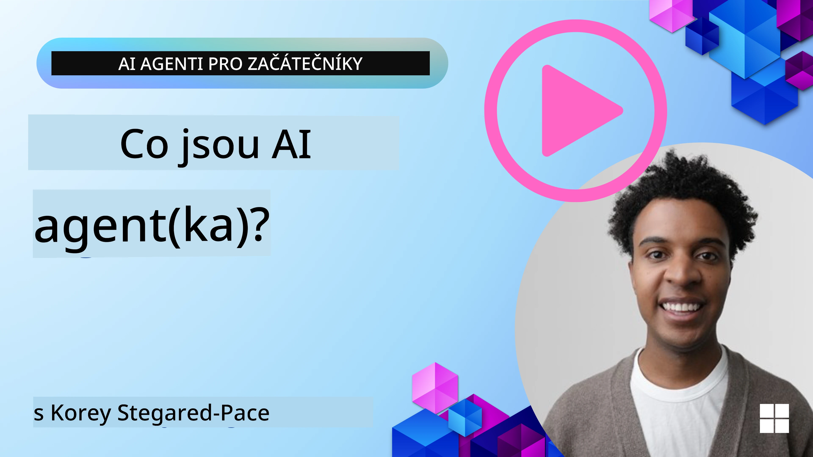
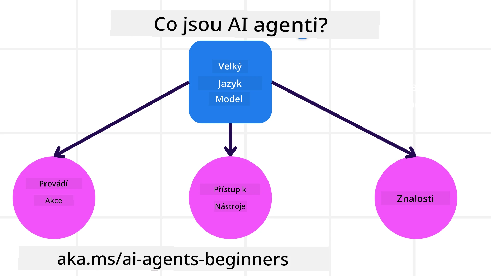
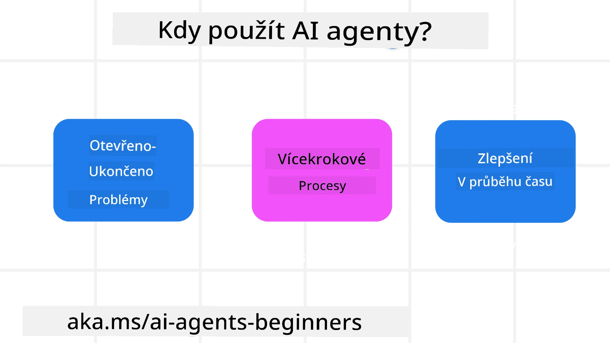

> _(Klikněte na obrázek výše pro zhlédnutí videa k této lekci)_

# Úvod do AI agentů a případů použití agentů

Vítejte v kurzu **AI agenti pro začátečníky**! Tento kurz vám poskytne základní znalosti — a skutečný funkční kód — pro začátek tvorby AI agentů od začátku.

Přijďte se pozdravit do <a href="https://discord.gg/kzRShWzttr" target="_blank">komunity Azure AI na Discordu</a> — je plná studentů a tvůrců AI, kteří rádi odpoví na vaše otázky.

Než se pustíme do stavby, ujistěme se, že skutečně chápeme, co AI agent *je* a kdy má smysl ho použít.

---

## Úvod

Tato lekce pokrývá:

- Co jsou AI agenti a různé typy, které existují
- Pro jaké typy úloh jsou AI agenti nejvhodnější
- Základní stavební bloky, které použijete při návrhu agentického řešení

## Cíle učení

Na konci této lekce byste měli být schopni:

- Vysvětlit, co je AI agent a jak se liší od běžného AI řešení
- Vědět, kdy sáhnout po AI agentovi (a kdy ne)
- Náčrtnout základní návrh agentického řešení pro reálný problém

---

## Definování AI agentů a typy AI agentů

### Co jsou AI agenti?

Tady je jednoduchý způsob, jak o nich přemýšlet:

> **AI agenti jsou systémy, které umožňují velkým jazykovým modelům (LLM) skutečně *něco dělat* — tím, že jim dávají nástroje a znalosti k působení ve světě, nejen reagovat na podněty.**

Rozložme si to trochu:

- **Systém** — AI agent není jen jedna věc. Je to soubor částí, které spolupracují. Každý agent má ve svém jádru tři části:
  - **Prostředí** — Prostor, ve kterém agent pracuje. Pro cestovního agenta by to byla samotná rezervační platforma.
  - **Senzory** — Jak agent čte aktuální stav svého prostředí. Náš cestovní agent může kontrolovat dostupnost hotelů nebo ceny letenek.
  - **Aktuátory** — Jak agent provádí akce. Cestovní agent může objednat pokoj, poslat potvrzení nebo zrušit rezervaci.

- **Velké jazykové modely** — Agent existovali před LLM, ale LLM jsou tím, co dělá moderní agenty tak výkonnými. Rozumí přirozenému jazyku, uvažují o kontextu a z nejasné uživatelské žádosti dokážou sestavit konkrétní plán.

- **Provádění akcí** — Bez agentního systému LLM jen generuje text. V agentním systému může LLM skutečně *vykonávat* kroky — vyhledávat v databázi, volat API, posílat zprávu.

- **Přístup k nástrojům** — Jaké nástroje agent může použít, závisí na (1) prostředí, ve kterém běží, a (2) co mu vývojář poskytl. Cestovní agent může vyhledávat lety, ale nemusí upravovat zákaznické záznamy — záleží na tom, co zapojíte.

- **Paměť + Znalosti** — Agent může mít krátkodobou paměť (aktuální konverzaci) a dlouhodobou paměť (zákaznickou databázi, minulé interakce). Cestovní agent si může "pamatovat", že dáváte přednost sedadlům u okna.

---

### Různé typy AI agentů

Ne všichni agenti jsou postaveni stejně. Tady je rozdělení hlavních typů s příkladem cestovního agenta jako běžnou ukázkou:

| **Typ agenta** | **Co dělá** | **Příklad cestovního agenta** |
|---|---|---|
| **Jednoduchí reflexní agenti** | Řídí se pevně danými pravidly — bez paměti, bez plánování. | Vidí stížnost v e-mailu → přepošle ji zákaznické podpoře. Tedy nic víc. |
| **Modelově založení reflexní agenti** | Udržují vnitřní model světa a aktualizují ho, jak se věci mění. | Sleduje historické ceny letenek a upozorní na trasy, které náhle zdražily. |
| **Agent s cílem** | Má cíl a krok za krokem hledá způsob, jak ho dosáhnout. | Zarezervuje kompletní cestu (letenky, auto, hotel) od vaší současné polohy až na cíl. |
| **Agent založený na užitku** | Nehledá jen *nějaké* řešení — hledá *nejlepší* tím, že váží různé kompromisy. | Vyvažuje cenu a pohodlí, aby našel cestu s nejvyšším skóre podle vašich preferencí. |
| **Učící se agenti** | Zlepšují se v průběhu času učením se z feedbacku. | Přizpůsobuje budoucí doporučení na základě výsledků průzkumu po cestě. |
| **Hierarchičtí agenti** | Vyšší agent rozděluje práci na dílčí úkoly a deleguje je nižším agentům. | Požadavek „zrušit cestu“ se rozdělí na: zrušit let, zrušit hotel, zrušit auto — každý řeší pod-agent. |
| **Systémy více agentů (MAS)** | Více nezávislých agentů spolupracuje (nebo soupeří). | Kooperace: samostatní agenti řeší hotely, lety a zábavu. Soutěž: agenti soupeří o obsazení hotelových pokojů za nejlepší cenu. |

---

## Kdy používat AI agenty

To, že *můžete* použít AI agenta, neznamená, že byste ho měli použít vždy. Tady jsou situace, kde agenti opravdu vynikají:

- **Otevřené problémy** — Když nelze předprogramovat kroky k vyřešení problému. Potřebujete, aby LLM dynamicky našel cestu.
- **Více-krokové procesy** — Úkoly vyžadující použití nástrojů přes několik kol, ne jen jedno vyhledání nebo vygenerování.
- **Zlepšování v čase** — Když chcete, aby se systém stal chytřejším na základě zpětné vazby uživatelů nebo signálů z prostředí.

Hlouběji se podíváme, kdy (a kdy *ne*) používat AI agenty v lekci **Budování důvěryhodných AI agentů** později v kurzu.

---

## Základy agentických řešení

### Vývoj agenta

První věc, kterou při stavbě agenta děláte, je definovat *co může dělat* — jeho nástroje, akce a chování.

V tomto kurzu používáme **Microsoft Foundry Agent Service** jako hlavní platformu. Podporuje:

- Modely od poskytovatelů jako OpenAI, Mistral a Meta (Llama)
- Licencovaná data od poskytovatelů jako Tripadvisor
- Standardizované definice nástrojů OpenAPI 3.0

### Agentické vzory

Komunikujete s LLM prostřednictvím promptů. U agentů nemůžete vždy ručně tvořit každý prompt — agent musí provádět akce přes mnoho kroků. Právě zde přicházejí na řadu **Agentické vzory**. Jsou to znovupoužitelné strategie pro promptování a orchestraci LLM škálovatelně a spolehlivě.

Tento kurz je strukturován kolem nejběžnějších a nejužitečnějších agentických vzorů.

### Agentické rámce

Agentické rámce poskytují vývojářům připravené šablony, nástroje a infrastrukturu pro vývoj agentů. Usnadňují:

- Propojení nástrojů a schopností
- Sledování, co agent dělá (a ladění, když něco selže)
- Spolupráci mezi více agenty

V tomto kurzu se soustředíme na **Microsoft Agent Framework (MAF)** pro vývoj agentů připravených na produkci.

---

## Vzorky kódu

Připraveni vidět to v akci? Tady jsou ukázky kódu k této lekci:

- 🐍 Python: [Agent Framework](./code_samples/01-python-agent-framework.ipynb)
- 🔷 .NET: [Agent Framework](./code_samples/01-dotnet-agent-framework.md)

---

## Máte otázky?

Připojte se k [Microsoft Foundry Discord](https://discord.com/invite/ATgtXmAS5D) a spojte se s dalšími studenty, navštěvujte konzultační hodiny a získejte odpovědi na své dotazy k AI agentům od komunity.

---

## Předchozí lekce

[Nastavení kurzu](../00-course-setup/README.md)

## Další lekce

[Prozkoumání agentických rámců](../02-explore-agentic-frameworks/README.md)

---

<!-- CO-OP TRANSLATOR DISCLAIMER START -->
**Prohlášení o omezení odpovědnosti**:
Tento dokument byl přeložen pomocí AI překladatelské služby [Co-op Translator](https://github.com/Azure/co-op-translator). Přestože usilujeme o co největší přesnost, mějte prosím na paměti, že automatizované překlady mohou obsahovat chyby nebo nepřesnosti. Originální dokument v jeho mateřském jazyce by měl být považován za autoritativní zdroj. Pro kritické informace se doporučuje profesionální lidský překlad. Nejsme odpovědní za jakékoli nedorozumění nebo nesprávné interpretace vzniklé použitím tohoto překladu.
<!-- CO-OP TRANSLATOR DISCLAIMER END -->