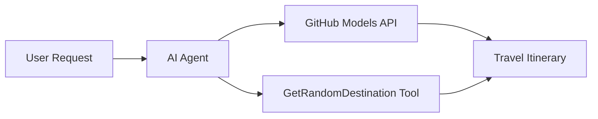

<!--
CO_OP_TRANSLATOR_METADATA:
{
  "original_hash": "23afd9be7b6ba5b69a44c3b6a78e07f6",
  "translation_date": "2025-11-06T10:06:14+00:00",
  "source_file": "01-intro-to-ai-agents/code_samples/01-dotnet-agent-framework.md",
  "language_code": "cs"
}
-->
# 🌍 AI Cestovní Agent s Microsoft Agent Framework (.NET)

## 📋 Přehled Scénáře

Tento notebook ukazuje, jak vytvořit inteligentního cestovního agenta pro plánování výletů pomocí Microsoft Agent Framework pro .NET. Agent dokáže automaticky generovat personalizované itineráře jednodenních výletů do náhodných destinací po celém světě.

**Klíčové schopnosti:**
- 🎲 **Výběr náhodné destinace**: Používá vlastní nástroj pro výběr dovolenkových míst
- 🗺️ **Inteligentní plánování výletů**: Vytváří podrobné itineráře den po dni
- 🔄 **Streamování v reálném čase**: Podporuje okamžité i streamované odpovědi
- 🛠️ **Integrace vlastních nástrojů**: Ukazuje, jak rozšířit schopnosti agenta

## 🔧 Technická Architektura

### Základní technologie
- **Microsoft Agent Framework**: Nejnovější implementace .NET pro vývoj AI agentů
- **Integrace GitHub Models**: Používá službu inferenčního modelu GitHub AI
- **Kompatibilita s OpenAI API**: Využívá klientské knihovny OpenAI s vlastními endpointy
- **Bezpečná konfigurace**: Správa API klíčů na základě prostředí

### Klíčové komponenty
1. **AIAgent**: Hlavní orchestrátor agenta, který řídí tok konverzace
2. **Vlastní nástroje**: Funkce `GetRandomDestination()` dostupná agentovi
3. **Chat Client**: Rozhraní konverzace podporované GitHub Models
4. **Podpora streamování**: Schopnost generovat odpovědi v reálném čase

### Vzor integrace


## 🚀 Začínáme

**Předpoklady:**
- .NET 10.0 nebo vyšší
- Přístupový token k GitHub Models API
- Konfigurované proměnné prostředí v souboru `.env`

**Požadované proměnné prostředí:**
```env
GITHUB_TOKEN=your_github_token
GITHUB_ENDPOINT=https://models.inference.ai.azure.com
GITHUB_MODEL_ID=gpt-4o-mini
```

Spusťte níže uvedený ukázkový kód postupně, abyste viděli cestovního agenta v akci!

---

## .NET Jednosouborová aplikace: Příklad AI Cestovního Agenta

Podívejte se na `01-dotnet-agent-framework.cs` pro kompletní ukázkový kód, který lze spustit.

```bash
dotnet run 01-dotnet-agent-framework.cs
```

### Ukázkový kód

```csharp
static string GetRandomDestination()
{
    var destinations = new List<string>
    {
        "Paris, France",
        "Tokyo, Japan",
        "New York City, USA",
        "Sydney, Australia",
        "Rome, Italy",
        "Barcelona, Spain",
        "Cape Town, South Africa",
        "Rio de Janeiro, Brazil",
        "Bangkok, Thailand",
        "Vancouver, Canada"
    };
    var random = new Random();
    int index = random.Next(destinations.Count);
    return destinations[index];
}

// Extract configuration from environment variables
var github_endpoint = Environment.GetEnvironmentVariable("GITHUB_ENDPOINT") ?? throw new InvalidOperationException("GITHUB_ENDPOINT is not set.");
var github_model_id = Environment.GetEnvironmentVariable("GITHUB_MODEL_ID") ?? "gpt-4o-mini";
var github_token = Environment.GetEnvironmentVariable("GITHUB_TOKEN") ?? throw new InvalidOperationException("GITHUB_TOKEN is not set.");

// Configure OpenAI Client Options
var openAIOptions = new OpenAIClientOptions()
{
    Endpoint = new Uri(github_endpoint)
};

// Initialize OpenAI Client with GitHub Models Configuration
var openAIClient = new OpenAIClient(new ApiKeyCredential(github_token), openAIOptions);

// Create AI Agent with Travel Planning Capabilities
AIAgent agent = openAIClient
    .GetChatClient(github_model_id)
    .CreateAIAgent(
        instructions: "You are a helpful AI Agent that can help plan vacations for customers at random destinations",
        tools: [AIFunctionFactory.Create(GetRandomDestination)]
    );

// Execute Agent: Plan a Day Trip (Non-Streaming)
Console.WriteLine(await agent.RunAsync("Plan me a day trip"));

// Execute Agent: Plan a Day Trip (Streaming Response)
await foreach (var update in agent.RunStreamingAsync("Plan me a day trip"))
{
    Console.Write(update);
}
```

---

**Prohlášení**:  
Tento dokument byl přeložen pomocí služby AI pro překlady [Co-op Translator](https://github.com/Azure/co-op-translator). I když se snažíme o přesnost, mějte prosím na paměti, že automatizované překlady mohou obsahovat chyby nebo nepřesnosti. Původní dokument v jeho původním jazyce by měl být považován za autoritativní zdroj. Pro důležité informace se doporučuje profesionální lidský překlad. Neodpovídáme za žádná nedorozumění nebo nesprávné interpretace vyplývající z použití tohoto překladu.