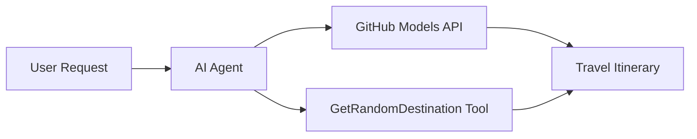

# 🌍 AI Cestovní Agent s Microsoft Agent Framework (.NET)

## 📋 Přehled Scénáře

Tento notebook ukazuje, jak vytvořit inteligentního agenta pro plánování cest pomocí Microsoft Agent Framework pro .NET. Agent dokáže automaticky generovat personalizované itineráře jednodenních výletů do náhodných destinací po celém světě.

**Klíčové schopnosti:**
- 🎲 **Výběr náhodné destinace**: Používá vlastní nástroj pro výběr dovolenkových míst
- 🗺️ **Inteligentní plánování výletů**: Vytváří podrobné itineráře den po dni
- 🔄 **Streamování v reálném čase**: Podporuje okamžité i průběžné odpovědi
- 🛠️ **Integrace vlastních nástrojů**: Ukazuje, jak rozšířit schopnosti agenta

## 🔧 Technická Architektura

### Základní technologie
- **Microsoft Agent Framework**: Nejnovější implementace .NET pro vývoj AI agentů
- **Integrace modelů GitHub**: Používá službu inferencí AI modelů od GitHubu
- **Kompatibilita s OpenAI API**: Využívá klientské knihovny OpenAI s vlastními endpointy
- **Bezpečná konfigurace**: Správa API klíčů na základě prostředí

### Klíčové komponenty
1. **AIAgent**: Hlavní orchestrátor agenta, který řídí tok konverzace
2. **Vlastní nástroje**: Funkce `GetRandomDestination()` dostupná agentovi
3. **Chatovací klient**: Rozhraní konverzace podporované modely GitHub
4. **Podpora streamování**: Schopnost generovat odpovědi v reálném čase

### Vzor integrace


## 🚀 Začínáme

**Předpoklady:**
- .NET 9.0 nebo vyšší
- Přístupový token k GitHub Models API
- Konfigurované proměnné prostředí v souboru `.env`

**Požadované proměnné prostředí:**
```env
GITHUB_TOKEN=your_github_token
GITHUB_ENDPOINT=https://models.inference.ai.azure.com
GITHUB_MODEL_ID=gpt-4o-mini
```

Spusťte níže uvedené buňky postupně, abyste viděli cestovního agenta v akci!

---

## .NET Single File App: AI Travel Agent Example

See `01-dotnet-agent-framework.cs` for the complete runnable code sample.

Spusťte ukázku kódu níže:

```bash
dotnet run 01-dotnet-agent-framework.cs
```

### Sample Code

```csharp
static string GetRandomDestination()
{
    var destinations = new List<string>
    {
        "Paris, France",
        "Tokyo, Japan",
        "New York City, USA",
        "Sydney, Australia",
        "Rome, Italy",
        "Barcelona, Spain",
        "Cape Town, South Africa",
        "Rio de Janeiro, Brazil",
        "Bangkok, Thailand",
        "Vancouver, Canada"
    };
    var random = new Random();
    int index = random.Next(destinations.Count);
    return destinations[index];
}

// Extract configuration from environment variables
var github_endpoint = Environment.GetEnvironmentVariable("GITHUB_ENDPOINT") ?? throw new InvalidOperationException("GITHUB_ENDPOINT is not set.");
var github_model_id = Environment.GetEnvironmentVariable("GITHUB_MODEL_ID") ?? "gpt-4o-mini";
var github_token = Environment.GetEnvironmentVariable("GITHUB_TOKEN") ?? throw new InvalidOperationException("GITHUB_TOKEN is not set.");

// Configure OpenAI Client Options
var openAIOptions = new OpenAIClientOptions()
{
    Endpoint = new Uri(github_endpoint)
};

// Initialize OpenAI Client with GitHub Models Configuration
var openAIClient = new OpenAIClient(new ApiKeyCredential(github_token), openAIOptions);

// Create AI Agent with Travel Planning Capabilities
AIAgent agent = openAIClient
    .GetChatClient(github_model_id)
    .CreateAIAgent(
        instructions: "You are a helpful AI Agent that can help plan vacations for customers at random destinations",
        tools: [AIFunctionFactory.Create(GetRandomDestination)]
    );

// Execute Agent: Plan a Day Trip (Non-Streaming)
Console.WriteLine(await agent.RunAsync("Plan me a day trip"));

// Execute Agent: Plan a Day Trip (Streaming Response)
await foreach (var update in agent.RunStreamingAsync("Plan me a day trip"))
{
    Console.Write(update);
}
```
