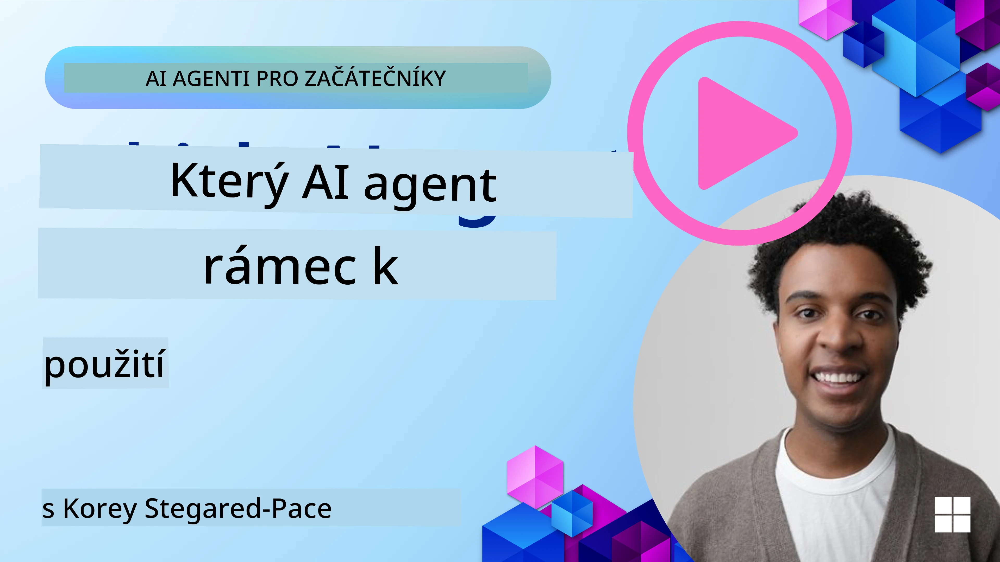

[](https://youtu.be/ODwF-EZo_O8?si=1xoy_B9RNQfrYdF7)

> _(Klikněte na obrázek výše pro zhlédnutí videa této lekce)_

# Explore AI Agent Frameworks

AI agent frameworks jsou softwarové platformy navržené tak, aby zjednodušily vytváření, nasazení a správu AI agentů. Tyto frameworky poskytují vývojářům předpřipravené komponenty, abstrakce a nástroje, které usnadňují vývoj složitých AI systémů.

Tyto frameworky pomáhají vývojářům soustředit se na unikátní aspekty jejich aplikací tím, že nabízejí standardizované přístupy k běžným výzvám ve vývoji AI agentů. Zvyšují škálovatelnost, přístupnost a efektivitu při vytváření AI systémů.

## Introduction 

Tato lekce pokryje:

- Co jsou AI Agent Frameworks a čeho mohou vývojáři dosáhnout?
- Jak mohou týmy využít tyto frameworky k rychlému prototypování, iteraci a zlepšování schopností jejich agentů?
- Jaké jsou rozdíly mezi frameworky a nástroji vytvořenými společností Microsoft (<a href="https://aka.ms/ai-agents-beginners/ai-agent-service" target="_blank">Azure AI Agent Service</a> a the <a href="https://learn.microsoft.com/azure/ai-services/openai/how-to/responses" target="_blank">Microsoft Agent Framework</a>)?
- Mohu integrovat své stávající nástroje v ekosystému Azure přímo, nebo potřebuji samostatná řešení?
- Co je Azure AI Agents service a jak mi to pomáhá?

## Learning goals

Cíle této lekce jsou vám pomoci porozumět:

- Roli AI Agent Frameworks ve vývoji AI.
- Jak využít AI Agent Frameworks k vytváření inteligentních agentů.
- Klíčové schopnosti, které AI Agent Frameworks umožňují.
- Rozdíly mezi Microsoft Agent Framework a Azure AI Agent Service.

## What are AI Agent Frameworks and what do they enable developers to do?

Tradiční AI frameworky vám mohou pomoci integrovat AI do vašich aplikací a zlepšit tyto aplikace následujícími způsoby:

- **Personalizace**: AI může analyzovat chování uživatelů a jejich preference a poskytovat personalizovaná doporučení, obsah a zážitky.
Example: Streamingové služby jako Netflix používají AI k navrhování filmů a pořadů na základě historie sledování, čímž zvyšují zapojení a spokojenost uživatelů.
- **Automatizace a efektivita**: AI může automatizovat opakující se úkoly, zefektivnit pracovní postupy a zlepšit provozní efektivitu.
Example: Aplikace zákaznické podpory používají AI-chatboty k řešení běžných dotazů, což snižuje dobu odezvy a uvolňuje lidské agenty pro složitější otázky.
- **Vylepšený uživatelský zážitek**: AI může zlepšit celkový uživatelský zážitek díky inteligentním funkcím, jako je rozpoznávání hlasu, zpracování přirozeného jazyka a prediktivní text.
Example: Virtuální asistenti jako Siri a Google Assistant používají AI, aby rozuměli a reagovali na hlasové příkazy, což uživatelům usnadňuje interakci s jejich zařízeními.

### That all sounds great right, so why do we need the AI Agent Framework?

AI Agent frameworky představují něco víc než jen AI frameworky. Jsou navrženy tak, aby umožnily vytváření inteligentních agentů, kteří mohou interagovat s uživateli, dalšími agenty a prostředím za účelem dosažení konkrétních cílů. Tito agenti mohou vykazovat autonomní chování, přijímat rozhodnutí a přizpůsobovat se měnícím se podmínkám. Pojďme se podívat na některé klíčové schopnosti, které AI Agent Frameworks umožňují:

- **Spolupráce a koordinace agentů**: Umožňují vytváření více AI agentů, kteří mohou spolupracovat, komunikovat a koordinovat se, aby řešili komplexní úkoly.
- **Automatizace úkolů a management**: Poskytují mechanismy pro automatizaci vícekrokových pracovních postupů, delegování úkolů a dynamické řízení úkolů mezi agenty.
- **Kontextuální porozumění a adaptace**: Vybavují agenty schopností rozumět kontextu, přizpůsobovat se měnícímu se prostředí a rozhodovat se na základě informací v reálném čase.

Shrnuto, agenti vám umožní dělat více, posunout automatizaci na další úroveň a vytvářet inteligentnější systémy, které se dokážou přizpůsobovat a učit se ze svého prostředí.

## How to quickly prototype, iterate, and improve the agent’s capabilities?

Jedná se o rychle se měnící oblast, ale existují některé společné prvky napříč většinou AI Agent Frameworks, které vám mohou pomoci rychle prototypovat a iterovat, konkrétně modulární komponenty, nástroje pro spolupráci a učení v reálném čase. Pojďme se na ně podrobněji podívat:

- **Používejte modulární komponenty**: AI SDK nabízejí předpřipravené komponenty jako AI a Memory konektory, volání funkcí pomocí přirozeného jazyka nebo kódových pluginů, šablony promptů a další.
- **Využívejte nástroje pro spolupráci**: Navrhněte agenty s konkrétními rolemi a úkoly, což jim umožní testovat a vylepšovat kolaborativní pracovní postupy.
- **Učte se v reálném čase**: Implementujte zpětnovazební smyčky, kde se agenti učí z interakcí a dynamicky upravují své chování.

### Use Modular Components

SDK jako Microsoft Agent Framework nabízejí předpřipravené komponenty jako AI konektory, definice nástrojů a správu agentů.

**Jak mohou týmy tyto komponenty využít**: Týmy mohou rychle sestavit tyto komponenty k vytvoření funkčního prototypu bez nutnosti začínat od nuly, což umožňuje rychlé experimentování a iteraci.

**Jak to funguje v praxi**: Můžete použít předpřipravený parser pro extrakci informací z uživatelského vstupu, modul paměti pro ukládání a načítání dat a generátor promptů pro interakci s uživateli — to vše bez potřeby vytvářet tyto komponenty od začátku.

**Example code**. Podívejme se na příklad, jak můžete použít Microsoft Agent Framework s `AzureAIProjectAgentProvider`, aby model odpovídal na uživatelský vstup s voláním nástrojů:

``` python
# Microsoft Agent Framework Python Příklad

import asyncio
import os
from typing import Annotated

from agent_framework.azure import AzureAIProjectAgentProvider
from azure.identity import AzureCliCredential


# Definujte ukázkovou nástrojovou funkci pro rezervaci cesty
def book_flight(date: str, location: str) -> str:
    """Book travel given location and date."""
    return f"Travel was booked to {location} on {date}"


async def main():
    provider = AzureAIProjectAgentProvider(credential=AzureCliCredential())
    agent = await provider.create_agent(
        name="travel_agent",
        instructions="Help the user book travel. Use the book_flight tool when ready.",
        tools=[book_flight],
    )

    response = await agent.run("I'd like to go to New York on January 1, 2025")
    print(response)
    # Ukázkový výstup: Váš let do New Yorku dne 1. ledna 2025 byl úspěšně rezervován. Šťastnou cestu! ✈️🗽


if __name__ == "__main__":
    asyncio.run(main())
```

Co z tohoto příkladu vidíte, je to, jak můžete využít předpřipravený parser k extrakci klíčových informací z uživatelského vstupu, například místo odletu, cíle a data žádosti o rezervaci letu. Tento modulární přístup vám umožní soustředit se na logiku na vyšší úrovni.

### Leverage Collaborative Tools

Frameworky jako Microsoft Agent Framework usnadňují vytváření více agentů, kteří mohou spolupracovat.

**Jak mohou týmy tyto nástroje využít**: Týmy mohou navrhovat agenty s konkrétními rolemi a úkoly, což jim umožní testovat a vylepšovat kolaborativní pracovní postupy a zvyšovat celkovou efektivitu systému.

**Jak to funguje v praxi**: Můžete vytvořit tým agentů, kde každý agent má specializovanou funkci, například získávání dat, analýzu nebo rozhodování. Tito agenti mohou komunikovat a sdílet informace, aby dosáhli společného cíle, například zodpovězení uživatelského dotazu nebo dokončení úkolu.

**Example code (Microsoft Agent Framework)**:

```python
# Vytváření více agentů, kteří spolupracují pomocí Microsoft Agent Framework

import os
from agent_framework.azure import AzureAIProjectAgentProvider
from azure.identity import AzureCliCredential

provider = AzureAIProjectAgentProvider(credential=AzureCliCredential())

# Agent pro získávání dat
agent_retrieve = await provider.create_agent(
    name="dataretrieval",
    instructions="Retrieve relevant data using available tools.",
    tools=[retrieve_tool],
)

# Agent pro analýzu dat
agent_analyze = await provider.create_agent(
    name="dataanalysis",
    instructions="Analyze the retrieved data and provide insights.",
    tools=[analyze_tool],
)

# Spuštění agentů postupně na úkolu
retrieval_result = await agent_retrieve.run("Retrieve sales data for Q4")
analysis_result = await agent_analyze.run(f"Analyze this data: {retrieval_result}")
print(analysis_result)
```

Co vidíte v předchozím kódu, je to, jak můžete vytvořit úkol, do kterého je zapojeno více agentů spolupracujících na analýze dat. Každý agent vykonává specifickou funkci a úkol je proveden koordinací agentů, aby dosáhli požadovaného výsledku. Vytvořením dedikovaných agentů se specializovanými rolemi můžete zlepšit efektivitu a výkon úkolů.

### Learn in Real-Time

Pokročilé frameworky poskytují schopnosti pro porozumění kontextu v reálném čase a adaptaci.

**Jak mohou týmy tyto funkce využít**: Týmy mohou implementovat zpětnovazební smyčky, kde se agenti učí z interakcí a dynamicky upravují své chování, což vede k nepřetržitému zlepšování a dolaďování schopností.

**Jak to funguje v praxi**: Agenti mohou analyzovat uživatelskou zpětnou vazbu, data z prostředí a výsledky úkolů, aby aktualizovali svou znalostní bázi, upravili algoritmy rozhodování a zlepšili výkon v čase. Tento iterativní proces učení umožňuje agentům přizpůsobit se měnícím se podmínkám a preferencím uživatelů, čímž zvyšují celkovou efektivitu systému.

## What are the differences between the Microsoft Agent Framework and Azure AI Agent Service?

Existuje mnoho způsobů, jak tyto přístupy porovnat, ale podívejme se na některé klíčové rozdíly z hlediska jejich návrhu, schopností a cílových případů použití:

## Microsoft Agent Framework (MAF)

Microsoft Agent Framework poskytuje zjednodušené SDK pro vytváření AI agentů pomocí `AzureAIProjectAgentProvider`. Umožňuje vývojářům vytvářet agenty, kteří využívají modely Azure OpenAI s vestavěným voláním nástrojů, správou konverzací a podnikové úrovně zabezpečení prostřednictvím Azure identity.

**Případy použití**: Vytváření produkčně připravených AI agentů s využitím nástrojů, vícekrokových pracovních postupů a scénářů integrace podniku.

Zde jsou některé důležité základní koncepty Microsoft Agent Framework:

- **Agenti**. Agent je vytvořen přes `AzureAIProjectAgentProvider` a nakonfigurován s názvem, instrukcemi a nástroji. Agent může:
  - **Zpracovávat uživatelské zprávy** a generovat odpovědi pomocí modelů Azure OpenAI.
  - **Volat nástroje** automaticky na základě kontextu konverzace.
  - **Udržovat stav konverzace** napříč více interakcemi.

  Zde je ukázka kódu, jak vytvořit agenta:

    ```python
    import os
    from agent_framework.azure import AzureAIProjectAgentProvider
    from azure.identity import AzureCliCredential

    provider = AzureAIProjectAgentProvider(credential=AzureCliCredential())
    agent = await provider.create_agent(
        name="my_agent",
        instructions="You are a helpful assistant.",
    )

    response = await agent.run("Hello, World!")
    print(response)
    ```

- **Nástroje**. Framework podporuje definování nástrojů jako Python funkcí, které může agent automaticky volat. Nástroje jsou registrovány při vytváření agenta:

    ```python
    def get_weather(location: str) -> str:
        """Get the current weather for a location."""
        return f"The weather in {location} is sunny, 72\u00b0F."

    agent = await provider.create_agent(
        name="weather_agent",
        instructions="Help users check the weather.",
        tools=[get_weather],
    )
    ```

- **Koordinace více agentů**. Můžete vytvořit více agentů s různými specializacemi a koordinovat jejich práci:

    ```python
    planner = await provider.create_agent(
        name="planner",
        instructions="Break down complex tasks into steps.",
    )

    executor = await provider.create_agent(
        name="executor",
        instructions="Execute the planned steps using available tools.",
        tools=[execute_tool],
    )

    plan = await planner.run("Plan a trip to Paris")
    result = await executor.run(f"Execute this plan: {plan}")
    ```

- **Integrace Azure Identity**. Framework používá `AzureCliCredential` (nebo `DefaultAzureCredential`) pro bezpečnou autentizaci bez klíčů, čímž eliminuje potřebu spravovat API klíče přímo.

## Azure AI Agent Service

Azure AI Agent Service je novější přírůstek, představený na Microsoft Ignite 2024. Umožňuje vývoj a nasazení AI agentů s flexibilnějšími modely, jako je přímé volání open-source LLM jako Llama 3, Mistral a Cohere.

Azure AI Agent Service poskytuje silnější mechanismy podnikové bezpečnosti a metody ukládání dat, což ho činí vhodným pro podnikové aplikace.

Funguje automaticky s Microsoft Agent Framework pro vytváření a nasazení agentů.

Tato služba je momentálně ve veřejné ukázce (Public Preview) a podporuje Python a C# pro tvorbu agentů.

Pomocí Python SDK Azure AI Agent Service můžeme vytvořit agenta s uživatelem definovaným nástrojem:

```python
import asyncio
from azure.identity import DefaultAzureCredential
from azure.ai.projects import AIProjectClient

# Definujte funkce nástroje
def get_specials() -> str:
    """Provides a list of specials from the menu."""
    return """
    Special Soup: Clam Chowder
    Special Salad: Cobb Salad
    Special Drink: Chai Tea
    """

def get_item_price(menu_item: str) -> str:
    """Provides the price of the requested menu item."""
    return "$9.99"


async def main() -> None:
    credential = DefaultAzureCredential()
    project_client = AIProjectClient.from_connection_string(
        credential=credential,
        conn_str="your-connection-string",
    )

    agent = project_client.agents.create_agent(
        model="gpt-4o-mini",
        name="Host",
        instructions="Answer questions about the menu.",
        tools=[get_specials, get_item_price],
    )

    thread = project_client.agents.create_thread()

    user_inputs = [
        "Hello",
        "What is the special soup?",
        "How much does that cost?",
        "Thank you",
    ]

    for user_input in user_inputs:
        print(f"# User: '{user_input}'")
        message = project_client.agents.create_message(
            thread_id=thread.id,
            role="user",
            content=user_input,
        )
        run = project_client.agents.create_and_process_run(
            thread_id=thread.id, agent_id=agent.id
        )
        messages = project_client.agents.list_messages(thread_id=thread.id)
        print(f"# Agent: {messages.data[0].content[0].text.value}")


if __name__ == "__main__":
    asyncio.run(main())
```

### Core concepts

Azure AI Agent Service má následující základní koncepty:

- **Agent**. Azure AI Agent Service se integruje s Microsoft Foundry. V rámci AI Foundry funguje AI Agent jako „chytrá“ mikroservisa, kterou lze použít k odpovídání na otázky (RAG), provádění akcí nebo kompletní automatizaci pracovních postupů. To dosahuje kombinací síly generativních AI modelů s nástroji, které mu umožňují přistupovat k reálným datovým zdrojům a s nimi interagovat. Zde je příklad agenta:

    ```python
    agent = project_client.agents.create_agent(
        model="gpt-4o-mini",
        name="my-agent",
        instructions="You are helpful agent",
        tools=code_interpreter.definitions,
        tool_resources=code_interpreter.resources,
    )
    ```

    V tomto příkladu je agent vytvořen s modelem `gpt-4o-mini`, názvem `my-agent` a instrukcemi `You are helpful agent`. Agent je vybaven nástroji a zdroji pro provádění úloh interpretace kódu.

- **Vlákno a zprávy**. Vlákno je dalším důležitým konceptem. Představuje konverzaci nebo interakci mezi agentem a uživatelem. Vlákna lze použít k sledování průběhu konverzace, ukládání kontextových informací a správě stavu interakce. Zde je příklad vlákna:

    ```python
    thread = project_client.agents.create_thread()
    message = project_client.agents.create_message(
        thread_id=thread.id,
        role="user",
        content="Could you please create a bar chart for the operating profit using the following data and provide the file to me? Company A: $1.2 million, Company B: $2.5 million, Company C: $3.0 million, Company D: $1.8 million",
    )
    
    # Ask the agent to perform work on the thread
    run = project_client.agents.create_and_process_run(thread_id=thread.id, agent_id=agent.id)
    
    # Fetch and log all messages to see the agent's response
    messages = project_client.agents.list_messages(thread_id=thread.id)
    print(f"Messages: {messages}")
    ```

    V předchozím kódu je vytvořeno vlákno. Poté je do vlákna odeslána zpráva. Voláním `create_and_process_run` je agent požádán o provedení práce na vlákně. Nakonec jsou zprávy načteny a zalogovány, aby bylo vidět agentovo zpracování. Zprávy naznačují průběh konverzace mezi uživatelem a agentem. Je také důležité pochopit, že zprávy mohou být různého typu, například text, obrázek nebo soubor; to znamená, že práce agentů mohla vyústit například v obrázek nebo textovou odpověď. Jako vývojář pak můžete tyto informace dále zpracovat nebo je prezentovat uživateli.

- **Integruje se s Microsoft Agent Framework**. Azure AI Agent Service funguje bezproblémově s Microsoft Agent Framework, což znamená, že můžete vytvářet agenty pomocí `AzureAIProjectAgentProvider` a nasazovat je prostřednictvím Agent Service pro produkční scénáře.

**Případy použití**: Azure AI Agent Service je navržena pro podnikové aplikace, které vyžadují bezpečné, škálovatelné a flexibilní nasazení AI agentů.

## What's the difference between these approaches?
 
Zdá se, že existuje překryv, ale existují některé klíčové rozdíly z hlediska jejich návrhu, schopností a cílových scénářů použití:
 
- **Microsoft Agent Framework (MAF)**: Je produkčně připravené SDK pro vytváření AI agentů. Poskytuje zjednodušené API pro vytváření agentů s voláním nástrojů, správou konverzací a integrací Azure identity.
- **Azure AI Agent Service**: Je platforma a služba nasazení v Azure Foundry pro agenty. Nabízí vestavěné konektivity ke službám jako Azure OpenAI, Azure AI Search, Bing Search a spouštění kódu.
 
Stále si nejste jisti, kterou zvolit?

### Use Cases
 
Pojďme se podívat, jestli vám můžeme pomoci tím, že projdeme některé běžné případy použití:
 
> Q: I'm building production AI agent applications and want to get started quickly
>

>A: The Microsoft Agent Framework is a great choice. It provides a simple, Pythonic API via `AzureAIProjectAgentProvider` that lets you define agents with tools and instructions in just a few lines of code.

>Q: I need enterprise-grade deployment with Azure integrations like Search and code execution
>
> A: Azure AI Agent Service is the best fit. It's a platform service that provides built-in capabilities for multiple models, Azure AI Search, Bing Search and Azure Functions. It makes it easy to build your agents in the Foundry Portal and deploy them at scale.
 
> Q: I'm still confused, just give me one option
>
> A: Start with the Microsoft Agent Framework to build your agents, and then use Azure AI Agent Service when you need to deploy and scale them in production. This approach lets you iterate quickly on your agent logic while having a clear path to enterprise deployment.
 
Shrňme klíčové rozdíly v tabulce:

| Framework | Focus | Core Concepts | Use Cases |
| --- | --- | --- | --- |
| Microsoft Agent Framework | Streamlined agent SDK with tool calling | Agenti, Nástroje, Azure Identity | Building AI agents, tool use, multi-step workflows |
| Azure AI Agent Service | Flexible models, enterprise security, Code generation, Tool calling | Modularity, Collaboration, Process Orchestration | Secure, scalable, and flexible AI agent deployment |

## Can I integrate my existing Azure ecosystem tools directly, or do I need standalone solutions?
Odpověď zní ano — můžete integrovat své stávající nástroje v ekosystému Azure přímo se službou Azure AI Agent Service, protože byla vytvořena tak, aby bezproblémově fungovala s ostatními službami Azure. Můžete například integrovat Bing, Azure AI Search a Azure Functions. Existuje také hluboká integrace s Microsoft Foundry.

Microsoft Agent Framework se také integruje se službami Azure prostřednictvím `AzureAIProjectAgentProvider` a identity Azure, což vám umožňuje volat služby Azure přímo z vašich nástrojů agenta.

## Ukázkové kódy

- Python: [Agent Framework](./code_samples/02-python-agent-framework.ipynb)
- .NET: [Agent Framework](./code_samples/02-dotnet-agent-framework.md)

## Máte další otázky ohledně AI Agent Frameworků?

Připojte se k [Microsoft Foundry Discord](https://aka.ms/ai-agents/discord), abyste se setkali s ostatními studenty, navštívili konzultační hodiny a získali odpovědi na své otázky týkající se AI agentů.

## Reference

- <a href="https://techcommunity.microsoft.com/blog/azure-ai-services-blog/introducing-azure-ai-agent-service/4298357" target="_blank">Služba Azure Agent</a>
- <a href="https://learn.microsoft.com/azure/ai-services/openai/how-to/responses" target="_blank">Microsoft Agent Framework - Odpovědi Azure OpenAI</a>
- <a href="https://learn.microsoft.com/azure/ai-services/agents/overview" target="_blank">Služba Azure AI Agent</a>

## Předchozí lekce

[Úvod do AI agentů a případů použití](../01-intro-to-ai-agents/README.md)

## Další lekce

[Porozumění agentním návrhovým vzorům](../03-agentic-design-patterns/README.md)

---

<!-- CO-OP TRANSLATOR DISCLAIMER START -->
Upozornění:
Tento dokument byl přeložen pomocí služby strojového překladu [Co-op Translator](https://github.com/Azure/co-op-translator). Přestože usilujeme o přesnost, mějte prosím na paměti, že automatizované překlady mohou obsahovat chyby nebo nepřesnosti. Původní dokument v jeho originálním jazyce by měl být považován za závazný zdroj. U zásadních informací doporučujeme využít profesionální lidský překlad. Nejsme odpovědní za žádná nedorozumění nebo chybné výklady vyplývající z použití tohoto překladu.
<!-- CO-OP TRANSLATOR DISCLAIMER END -->