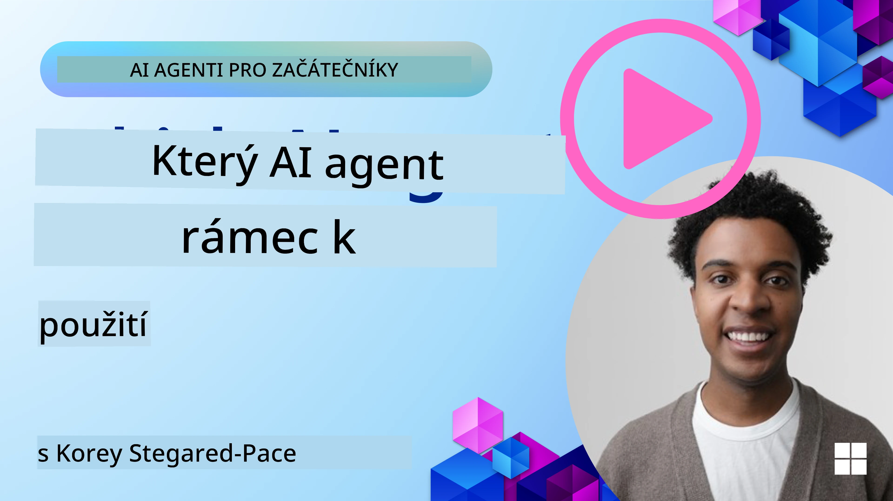

[](https://youtu.be/ODwF-EZo_O8?si=1xoy_B9RNQfrYdF7)

> _(Klikněte na obrázek výše pro zobrazení videa této lekce)_

# Prozkoumejte rámce AI agentů

Rámce AI agentů jsou softwarové platformy navržené k usnadnění tvorby, nasazení a správy AI agentů. Tyto rámce poskytují vývojářům předpřipravené komponenty, abstrakce a nástroje, které zjednodušují vývoj složitých AI systémů.

Tyto rámce pomáhají vývojářům soustředit se na unikátní aspekty jejich aplikací tím, že poskytují standardizované přístupy k běžným výzvám ve vývoji AI agentů. Zvyšují škálovatelnost, přístupnost a efektivitu při budování AI systémů.

## Úvod

Tato lekce pokryje:

- Co jsou rámce AI agentů a čeho umožňují vývojářům dosáhnout?
- Jak mohou týmy tyto rámce použít k rychlé tvorbě prototypů, iteraci a vylepšování schopností jejich agentů?
- Jaké jsou rozdíly mezi rámci a nástroji vytvořenými Microsoftem (<a href="https://aka.ms/ai-agents-beginners/ai-agent-service" target="_blank">Microsoft Foundry Agent Service</a> a <a href="https://learn.microsoft.com/azure/ai-services/openai/how-to/responses" target="_blank">Microsoft Agent Framework</a>)?
- Mohu integrovat své stávající nástroje ekosystému Azure přímo, nebo potřebuji samostatná řešení?
- Co je Microsoft Foundry Agent Service a jak mi pomáhá?

## Cíle učení

Cílem této lekce je pomoci vám porozumět:

- Úloze rámců AI agentů ve vývoji AI.
- Jak využít rámce AI agentů k vytváření inteligentních agentů.
- Klíčovým schopnostem umožněným rámci AI agentů.
- Rozdílům mezi Microsoft Agent Framework a Microsoft Foundry Agent Service.

## Co jsou rámce AI agentů a co umožňují vývojářům dělat?

Tradiční rámce AI vám mohou pomoci integrovat AI do vašich aplikací a zlepšit tyto aplikace následujícími způsoby:

- **Personalizace**: AI může analyzovat chování uživatele a preference a poskytovat personalizovaná doporučení, obsah a zážitky.
Příklad: Streamingové služby jako Netflix používají AI k navrhování filmů a pořadů na základě historie sledování, čímž zvyšují zapojení a spokojenost uživatelů.
- **Automatizace a efektivita**: AI může automatizovat opakující se úkoly, zjednodušit pracovní postupy a zlepšit provozní efektivitu.
Příklad: Aplikace zákaznické podpory používají AI chatboty k řešení běžných dotazů, čímž krátí dobu reakce a uvolňují lidské agenty pro složitější problémy.
- **Vylepšený uživatelský zážitek**: AI může zlepšit celkový uživatelský zážitek poskytováním inteligentních funkcí, jako je rozpoznávání hlasu, zpracování přirozeného jazyka a prediktivní text.
Příklad: Virtuální asistenti jako Siri a Google Assistant používají AI ke chápání a reagování na hlasové příkazy, usnadňující interakci uživatelů se zařízeními.

### To všechno zní skvěle, tak proč potřebujeme rámec AI agentů?

Rámce AI agentů představují něco víc než jen AI rámce. Jsou navrženy tak, aby umožnily tvorbu inteligentních agentů, kteří mohou komunikovat s uživateli, dalšími agenty a prostředím k dosažení specifických cílů. Tito agenti mohou vykazovat autonomní chování, rozhodovat se a přizpůsobovat se měnícím se podmínkám. Pojďme se podívat na klíčové schopnosti umožněné rámci AI agentů:

- **Spolupráce a koordinace agentů**: Umožňují tvorbu více AI agentů, kteří mohou spolupracovat, komunikovat a koordinovat se při řešení složitých úloh.
- **Automatizace úloh a jejich správa**: Poskytují mechanismy pro automatizaci vícekrokových pracovních postupů, delegování úloh a dynamické řízení úkolů mezi agenty.
- **Kontextuální porozumění a přizpůsobení**: Vybavují agenty schopností chápat kontext, přizpůsobovat se měnícím se prostředím a rozhodovat se na základě aktuálních informací.

Shrnutě, agenti vám umožňují dělat více, posunout automatizaci na novou úroveň a vytvořit inteligentnější systémy, které se dokážou přizpůsobovat a učit se ze svého prostředí.

## Jak rychle vytvářet prototypy, iterovat a zlepšovat schopnosti agenta?

Toto prostředí se rychle vyvíjí, ale existují některé společné prvky u většiny rámců AI agentů, které vám pomohou rychle prototypovat a iterovat, a to modulární komponenty, nástroje pro spolupráci a učení v reálném čase. Podívejme se na ně:

- **Používejte modulární komponenty**: AI SDK nabízejí předpřipravené komponenty jako AI a paměťové konektory, volání funkcí pomocí přirozeného jazyka nebo pluginů, šablony výzev a další.
- **Využívejte nástroje pro spolupráci**: Navrhujte agenty se specifickými rolemi a úkoly, což jim umožní testovat a zdokonalovat kooperativní pracovní postupy.
- **Učte se v reálném čase**: Implementujte zpětnovazební smyčky, kde se agenti učí ze interakcí a dynamicky upravují své chování.

### Používejte modulární komponenty

SDK jako Microsoft Agent Framework nabízí předpřipravené komponenty jako AI konektory, definice nástrojů a správu agentů.

**Jak to mohou týmy využít:** Týmy mohou rychle sestavit tyto komponenty a vytvořit funkční prototyp bez nutnosti začínat od nuly, což umožňuje rychlé experimentování a iteraci.

**Jak to funguje v praxi:** Můžete použít předpřipravený parser k extrakci informací ze vstupu uživatele, paměťový modul pro ukládání a získávání dat a generátor výzev pro komunikaci s uživateli, vše bez nutnosti stavět tyto komponenty od základu.

**Ukázkový kód**: Podívejme se na příklad, jak můžete použít Microsoft Agent Framework s `FoundryChatClient` k tomu, aby model reagoval na vstup uživatele s voláním nástrojů:

``` python
# Příklad Microsoft Agent Framework v Pythonu

import asyncio
import os

from agent_framework import tool
from agent_framework.foundry import FoundryChatClient
from azure.identity import AzureCliCredential


# Definujte ukázkovou funkci nástroje pro rezervaci cestování
@tool(approval_mode="never_require")
def book_flight(date: str, location: str) -> str:
    """Book travel given location and date."""
    return f"Travel was booked to {location} on {date}"


async def main():
    provider = FoundryChatClient(
        project_endpoint=os.environ["AZURE_AI_PROJECT_ENDPOINT"],
        model=os.environ["AZURE_AI_MODEL_DEPLOYMENT_NAME"],
        credential=AzureCliCredential(),
    )
    agent = provider.as_agent(
        name="travel_agent",
        instructions="Help the user book travel. Use the book_flight tool when ready.",
        tools=[book_flight],
    )

    response = await agent.run("I'd like to go to New York on January 1, 2025")
    print(response)
    # Příklad výstupu: Váš let do New Yorku dne 1. ledna 2025 byl úspěšně zarezervován. Šťastnou cestu! ✈️🗽


if __name__ == "__main__":
    asyncio.run(main())
```

Z tohoto příkladu můžete vidět, jak lze využít předpřipravený parser k extrakci klíčových informací ze vstupu uživatele, jako je původ, cílové místo a datum žádosti o rezervaci letu. Tento modulární přístup vám umožňuje soustředit se na logiku na vysoké úrovni.

### Využívejte nástroje pro spolupráci

Rámce jako Microsoft Agent Framework usnadňují tvorbu více agentů, kteří mohou spolupracovat.

**Jak to mohou týmy využít:** Týmy mohou navrhnout agenty s konkrétními rolemi a úkoly, což jim umožňuje testovat a zdokonalovat kooperativní pracovní postupy a zlepšit celkovou efektivitu systému.

**Jak to funguje v praxi:** Můžete vytvořit tým agentů, kde každý agent má specializovanou funkci, například získávání dat, analýzu nebo rozhodování. Tito agenti mohou komunikovat a sdílet informace, aby dosáhli společného cíle, například odpovědi na uživatelský dotaz nebo dokončení úkolu.

**Ukázkový kód (Microsoft Agent Framework)**:

```python
# Vytváření více agentů, kteří spolupracují pomocí Microsoft Agent Framework

import os
from agent_framework.foundry import FoundryChatClient
from azure.identity import AzureCliCredential

provider = FoundryChatClient(
    project_endpoint=os.environ["AZURE_AI_PROJECT_ENDPOINT"],
    model=os.environ["AZURE_AI_MODEL_DEPLOYMENT_NAME"],
    credential=AzureCliCredential(),
)

# Agent pro získávání dat
agent_retrieve = provider.as_agent(
    name="dataretrieval",
    instructions="Retrieve relevant data using available tools.",
    tools=[retrieve_tool],
)

# Agent pro analýzu dat
agent_analyze = provider.as_agent(
    name="dataanalysis",
    instructions="Analyze the retrieved data and provide insights.",
    tools=[analyze_tool],
)

# Spuštění agentů postupně při úkolu
retrieval_result = await agent_retrieve.run("Retrieve sales data for Q4")
analysis_result = await agent_analyze.run(f"Analyze this data: {retrieval_result}")
print(analysis_result)
```

V předchozím kódu vidíte, jak vytvořit úkol, který zapojuje více agentů spolupracujících na analýze dat. Každý agent vykonává specifickou funkci a úkol je realizován koordinací agentů k dosažení požadovaného výsledku. Vytvořením dedikovaných agentů se specializovanými rolemi můžete zlepšit efektivitu a výkon úkolu.

### Učte se v reálném čase

Pokročilé rámce poskytují schopnosti pro porozumění kontextu a přizpůsobení v reálném čase.

**Jak to mohou týmy využít:** Týmy mohou implementovat zpětné smyčky, kde se agenti učí z interakcí a dynamicky upravují své chování, což vede k průběžnému zlepšování a zdokonalování schopností.

**Jak to funguje v praxi:** Agenti mohou analyzovat zpětnou vazbu uživatelů, data o prostředí a výsledky úkolů, aby aktualizovali svou znalostní bázi, upravili algoritmy rozhodování a zlepšili výkon v čase. Tento iterativní učební proces umožňuje agentům přizpůsobovat se měnícím se podmínkám a preferencím uživatelů, čímž zvyšují celkovou efektivitu systému.

## Jaké jsou rozdíly mezi Microsoft Agent Framework a Microsoft Foundry Agent Service?

Existuje mnoho způsobů, jak tyto přístupy porovnat, podívejme se na některé klíčové rozdíly v jejich designu, schopnostech a zaměřených použitích:

## Microsoft Agent Framework (MAF)

Microsoft Agent Framework poskytuje zjednodušené SDK pro tvorbu AI agentů pomocí `FoundryChatClient`. Umožňuje vývojářům vytvářet agenty využívající Azure OpenAI modely s integrovaným voláním nástrojů, správou konverzací a bezpečností na úrovni podnikové identity Azure.

**Použití**: Tvorba produkčně připravených AI agentů s využíváním nástrojů, vícekrokových pracovních postupů a scénářů firemní integrace.

Zde jsou některé důležité základní koncepty Microsoft Agent Framework:

- **Agenti**. Agent je vytvořen pomocí `FoundryChatClient` a nakonfigurován s názvem, instrukcemi a nástroji. Agent může:
  - **Zpracovávat uživatelské zprávy** a generovat odpovědi pomocí Azure OpenAI modelů.
  - **Automaticky volat nástroje** podle kontextu konverzace.
  - **Udržovat stav konverzace** přes více interakcí.

  Zde je ukázka kódu, jak vytvořit agenta:

    ```python
    import os
    from agent_framework.foundry import FoundryChatClient
    from azure.identity import AzureCliCredential

    provider = FoundryChatClient(
        project_endpoint=os.environ["AZURE_AI_PROJECT_ENDPOINT"],
        model=os.environ["AZURE_AI_MODEL_DEPLOYMENT_NAME"],
        credential=AzureCliCredential(),
    )
    agent = provider.as_agent(
        name="my_agent",
        instructions="You are a helpful assistant.",
    )

    response = await agent.run("Hello, World!")
    print(response)
    ```

- **Nástroje**. Rámec podporuje definování nástrojů jako Python funkcí, které může agent automaticky vyvolávat. Nástroje se registrují při vytváření agenta:

    ```python
    def get_weather(location: str) -> str:
        """Get the current weather for a location."""
        return f"The weather in {location} is sunny, 72\u00b0F."

    agent = provider.as_agent(
        name="weather_agent",
        instructions="Help users check the weather.",
        tools=[get_weather],
    )
    ```

- **Koordinace více agentů**. Můžete vytvořit více agentů se specifickými specializacemi a koordinovat jejich práci:

    ```python
    planner = provider.as_agent(
        name="planner",
        instructions="Break down complex tasks into steps.",
    )

    executor = provider.as_agent(
        name="executor",
        instructions="Execute the planned steps using available tools.",
        tools=[execute_tool],
    )

    plan = await planner.run("Plan a trip to Paris")
    result = await executor.run(f"Execute this plan: {plan}")
    ```

- **Integrace s Azure identitou**. Rámec využívá `AzureCliCredential` (nebo `DefaultAzureCredential`) pro bezpečnou autentizaci bez klíčů, čímž odstraňuje potřebu spravovat API klíče přímo.

## Microsoft Foundry Agent Service

Microsoft Foundry Agent Service je novější služba, kterou Microsoft představil na Ignite 2024. Umožňuje vývoj a nasazení AI agentů s flexibilnějšími modely, např. přímo volání open-source LLM jako Llama 3, Mistral a Cohere.

Microsoft Foundry Agent Service nabízí silnější mechanismy zabezpečení na podnikové úrovni a metody ukládání dat, díky čemuž je vhodný pro podnikové aplikace.

Funguje ihned s Microsoft Agent Framework pro tvorbu a nasazení agentů.

Tato služba je momentálně v veřejné beta verzi a podporuje Python a C# pro vývoj agentů.

Použitím Python SDK Microsoft Foundry Agent Service můžeme vytvořit agenta s uživatelem definovaným nástrojem:

```python
import asyncio
from azure.identity import DefaultAzureCredential
from azure.ai.projects import AIProjectClient

# Definujte funkce nástroje
def get_specials() -> str:
    """Provides a list of specials from the menu."""
    return """
    Special Soup: Clam Chowder
    Special Salad: Cobb Salad
    Special Drink: Chai Tea
    """

def get_item_price(menu_item: str) -> str:
    """Provides the price of the requested menu item."""
    return "$9.99"


async def main() -> None:
    credential = DefaultAzureCredential()
    project_client = AIProjectClient.from_connection_string(
        credential=credential,
        conn_str="your-connection-string",
    )

    agent = project_client.agents.create_agent(
        model="gpt-4o-mini",
        name="Host",
        instructions="Answer questions about the menu.",
        tools=[get_specials, get_item_price],
    )

    thread = project_client.agents.create_thread()

    user_inputs = [
        "Hello",
        "What is the special soup?",
        "How much does that cost?",
        "Thank you",
    ]

    for user_input in user_inputs:
        print(f"# User: '{user_input}'")
        message = project_client.agents.create_message(
            thread_id=thread.id,
            role="user",
            content=user_input,
        )
        run = project_client.agents.create_and_process_run(
            thread_id=thread.id, agent_id=agent.id
        )
        messages = project_client.agents.list_messages(thread_id=thread.id)
        print(f"# Agent: {messages.data[0].content[0].text.value}")


if __name__ == "__main__":
    asyncio.run(main())
```

### Základní koncepty

Microsoft Foundry Agent Service má následující základní koncepty:

- **Agent**. Microsoft Foundry Agent Service je integrován s Microsoft Foundry. V rámci Microsoft Foundry AI Agent funguje jako „chytrá“ mikroservisa, která může odpovídat na otázky (RAG), provádět akce nebo zcela automatizovat pracovní postupy. Dosahuje toho kombinací generativních AI modelů s nástroji umožňujícími přístup k reálným datovým zdrojům a interakcí s nimi. Zde je příklad agenta:

    ```python
    agent = project_client.agents.create_agent(
        model="gpt-4o-mini",
        name="my-agent",
        instructions="You are helpful agent",
        tools=code_interpreter.definitions,
        tool_resources=code_interpreter.resources,
    )
    ```

    V tomto příkladu je agent vytvořen s modelem `gpt-4o-mini`, názvem `my-agent` a instrukcemi „You are helpful agent“. Agent je vybaven nástroji a zdroji pro provádění úloh interpretace kódu.

- **Vlákna a zprávy**. Vlákno je další důležitý koncept. Reprezentuje konverzaci nebo interakci mezi agentem a uživatelem. Vlákna lze použít k sledování průběhu konverzace, ukládání kontextových informací a správě stavu interakce. Zde je příklad vlákna:

    ```python
    thread = project_client.agents.create_thread()
    message = project_client.agents.create_message(
        thread_id=thread.id,
        role="user",
        content="Could you please create a bar chart for the operating profit using the following data and provide the file to me? Company A: $1.2 million, Company B: $2.5 million, Company C: $3.0 million, Company D: $1.8 million",
    )
    
    # Požádejte agenta, aby provedl práci na vlákně
    run = project_client.agents.create_and_process_run(thread_id=thread.id, agent_id=agent.id)
    
    # Získejte a zaznamenejte všechny zprávy, abyste viděli odpověď agenta
    messages = project_client.agents.list_messages(thread_id=thread.id)
    print(f"Messages: {messages}")
    ```

    V předchozím kódu je vytvořeno vlákno. Poté je do vláka odeslána zpráva. Zavoláním `create_and_process_run` je agent vyzván k provedení práce na vlákně. Nakonec jsou zprávy získány a zapsány pro zobrazení odpovědi agenta. Zprávy ukazují průběh konverzace mezi uživatelem a agentem. Je také důležité chápat, že zprávy mohou mít různé typy jako text, obrázek nebo soubor, tedy práce agentů může být například obrázek nebo textová odpověď. Jako vývojář můžete tyto informace použít dále k zpracování odpovědi nebo její prezentaci uživateli.

- **Integrace s Microsoft Agent Framework**. Microsoft Foundry Agent Service pracuje bez problémů s Microsoft Agent Framework, což znamená, že můžete vytvářet agenty pomocí `FoundryChatClient` a nasazovat je prostřednictvím Agent Service pro produkční scénáře.

**Použití**: Microsoft Foundry Agent Service je navržen pro podnikové aplikace vyžadující bezpečné, škálovatelné a flexibilní nasazení AI agentů.

## Jaký je rozdíl mezi těmito přístupy?
 
Zdá se, že dochází k překryvu, ale existují klíčové rozdíly v designu, schopnostech a cílových použitích:
 
- **Microsoft Agent Framework (MAF)**: Je produkčně připravené SDK pro tvorbu AI agentů. Poskytuje zjednodušené API pro tvorbu agentů s voláním nástrojů, správou konverzací a integrací Azure identity.
- **Microsoft Foundry Agent Service**: Je platforma a služba nasazení v Microsoft Foundry pro agenty. Nabízí vestavěné propojení na služby jako Azure OpenAI, Azure AI Search, Bing Search a vykonávání kódu.
 
Nejste si stále jisti, který vybrat?

### Použití
 
Podívejme se, jestli vám pomůžeme projít některé běžné scénáře použití:
 
> Otázka: Stavím produkční AI agentní aplikace a chci rychle začít
>

> Odpověď: Microsoft Agent Framework je skvělou volbou. Poskytuje jednoduché, pythonické API přes `FoundryChatClient`, které umožňuje definovat agenty s nástroji a instrukcemi během pár řádků kódu.

> Otázka: Potřebuji podnikové nasazení s integracemi Azure jako Search a vykonávání kódu
>
> Odpověď: Microsoft Foundry Agent Service je nejlepší řešení. Je to platformní služba poskytující vestavěné schopnosti pro více modelů, Azure AI Search, Bing Search a Azure Functions. Usnadňuje tvorbu vašich agentů v Foundry Portálu a jejich škálovatelné nasazení.
 
> Otázka: Jsem stále zmatený, prosím dejte mi jen jednu možnost
>
> Odpověď: Začněte s Microsoft Agent Framework pro tvorbu vašich agentů a potom použijte Microsoft Foundry Agent Service, když je budete potřebovat nasadit a škálovat v produkci. Tento přístup vám umožní rychle iterovat na vaší logice agentů a zároveň mít jasnou cestu k podnikové implementaci.
 
Shrňme klíčové rozdíly v tabulce:

| Rámec | Zaměření | Základní koncepty | Použití |
| --- | --- | --- | --- |
| Microsoft Agent Framework | Zjednodušené SDK agentů s voláním nástrojů | Agenti, Nástroje, Azure Identita | Tvorba AI agentů, používání nástrojů, vícekrokové pracovní postupy |
| Microsoft Foundry Agent Service | Flexibilní modely, zabezpečení pro podnik, generování kódu, volání nástrojů | Modularita, Spolupráce, Orchestrace procesů | Bezpečné, škálovatelné a flexibilní nasazení AI agentů |

## Mohu integrovat své stávající nástroje ekosystému Azure přímo, nebo potřebuji samostatná řešení?


Odpověď zní ano, můžete integrovat vaše stávající nástroje ekosystému Azure přímo s Microsoft Foundry Agent Service, zejména protože byl navržen tak, aby plynule spolupracoval s dalšími službami Azure. Můžete například integrovat Bing, Azure AI Search a Azure Functions. Existuje také hluboká integrace s Microsoft Foundry.

Microsoft Agent Framework se také integruje se službami Azure přes `FoundryChatClient` a identitu Azure, což vám umožňuje volat služby Azure přímo z vašich agentních nástrojů.

## Ukázkové kódy

- Python: [Agent Framework (Microsoft Foundry)](./code_samples/02-python-agent-framework.ipynb)
- Python: [Agent Framework (Azure OpenAI Responses API)](./code_samples/02-python-agent-framework-azure-openai.ipynb)
- .NET: [Agent Framework](./code_samples/02-dotnet-agent-framework.md)

## Máte další otázky ohledně AI Agent Frameworků?

Připojte se k [Microsoft Foundry Discord](https://discord.com/invite/ATgtXmAS5D), kde se můžete setkat s dalšími studenty, účastnit se konzultačních hodin a získat odpovědi na své otázky ohledně AI Agentů.

## Odkazy

- <a href="https://techcommunity.microsoft.com/blog/azure-ai-services-blog/introducing-azure-ai-agent-service/4298357" target="_blank">Azure Agent Service</a>
- <a href="https://learn.microsoft.com/azure/ai-services/openai/how-to/responses" target="_blank">Microsoft Agent Framework - Azure OpenAI Responses</a>
- <a href="https://learn.microsoft.com/azure/ai-services/agents/overview" target="_blank">Microsoft Foundry Agent Service</a>

## Předchozí lekce

[Úvod do AI agentů a jejich použití](../01-intro-to-ai-agents/README.md)

## Další lekce

[Pochopení návrhových vzorů agentů](../03-agentic-design-patterns/README.md)

---

<!-- CO-OP TRANSLATOR DISCLAIMER START -->
**Prohlášení o omezení odpovědnosti**:
Tento dokument byl přeložen pomocí AI překladatelské služby [Co-op Translator](https://github.com/Azure/co-op-translator). Přestože usilujeme o co největší přesnost, mějte prosím na paměti, že automatizované překlady mohou obsahovat chyby nebo nepřesnosti. Originální dokument v jeho mateřském jazyce by měl být považován za autoritativní zdroj. Pro kritické informace se doporučuje profesionální lidský překlad. Nejsme odpovědní za jakékoli nedorozumění nebo nesprávné interpretace vzniklé použitím tohoto překladu.
<!-- CO-OP TRANSLATOR DISCLAIMER END -->