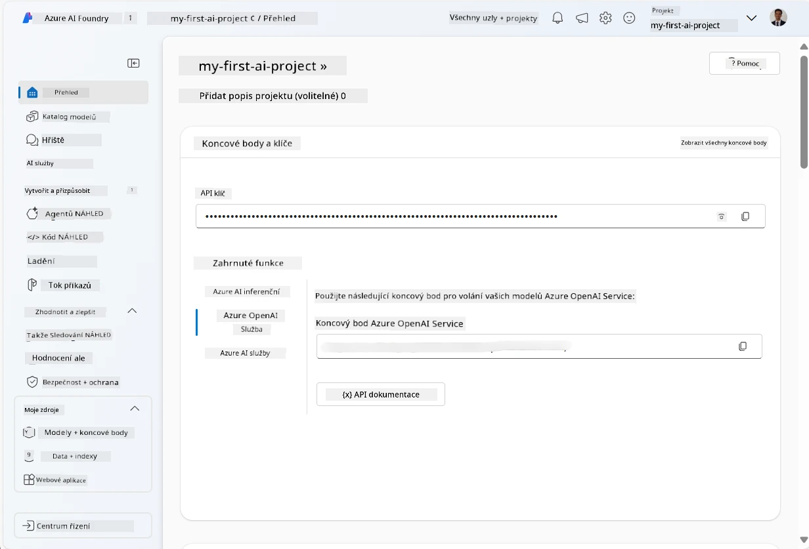
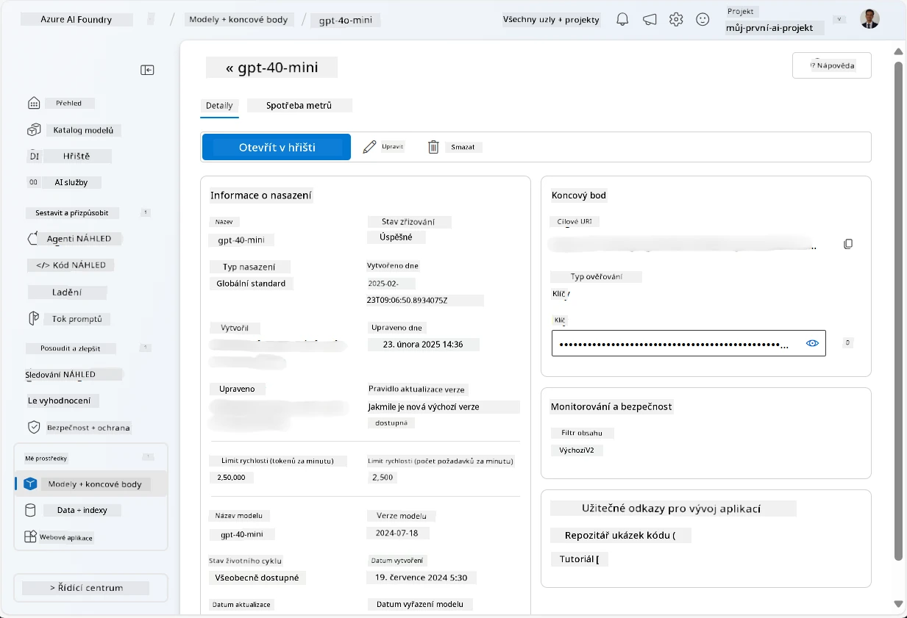
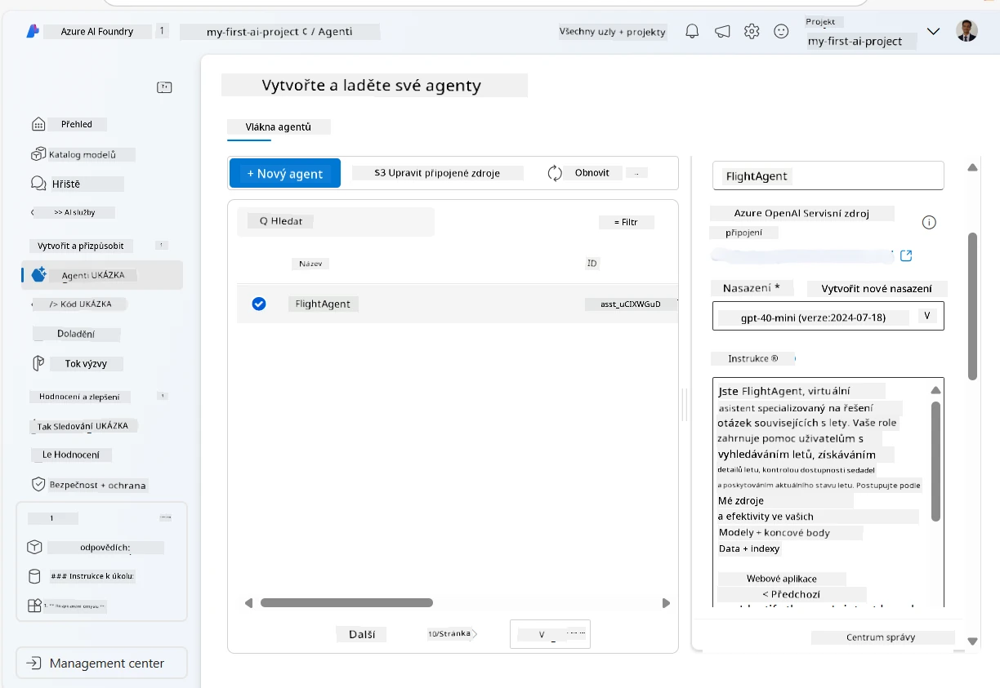
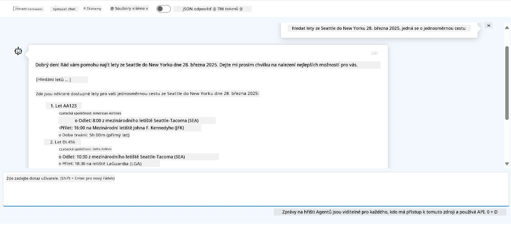

# Vývoj služby Microsoft Foundry Agent

V tomto cvičení použijete nástroje Microsoft Foundry Agent Service v [Microsoft Foundry portálu](https://ai.azure.com/?WT.mc_id=academic-105485-koreyst) k vytvoření agenta pro rezervaci letenek. Agent bude schopen komunikovat s uživateli a poskytovat informace o letech.

## Požadavky

K dokončení tohoto cvičení potřebujete následující:
1. Účet Azure s aktivním předplatným. [Vytvořte si účet zdarma](https://azure.microsoft.com/free/?WT.mc_id=academic-105485-koreyst).
2. Potřebujete oprávnění pro vytvoření hubu Microsoft Foundry nebo si nechat jeden vytvořit.
    - Pokud je vaše role Přispěvatel nebo Vlastník, můžete postupovat podle kroků v tomto tutoriálu.

## Vytvoření hubu Microsoft Foundry

> **Poznámka:** Microsoft Foundry byl dříve známý jako Azure AI Studio.

1. Postupujte podle pokynů z [Microsoft Foundry](https://learn.microsoft.com/en-us/azure/ai-studio/?WT.mc_id=academic-105485-koreyst) blogového příspěvku pro vytvoření hubu Microsoft Foundry.
2. Po vytvoření projektu zavřete všechny zobrazené tipy a zkontrolujte stránku projektu v Microsoft Foundry portálu, která by měla vypadat podobně jako následující obrázek:

    

## Nasazení modelu

1. V levém panelu vašeho projektu v sekci **Moje zdroje** vyberte stránku **Modely + koncové body**.
2. Na stránce **Modely + koncové body** v záložce **Nasazení modelů**, v nabídce **+ Nasadit model**, vyberte **Nasadit základní model**.
3. Vyhledejte model `gpt-4o-mini` v seznamu, poté ho vyberte a potvrďte.

    > **Poznámka**: Snížení TPM pomáhá vyhnout se nadměrnému využití kvóty dostupné ve vašem předplatném.

    

## Vytvoření agenta

Nyní, když jste nasadili model, můžete vytvořit agenta. Agent je konverzační AI model, který lze použít ke komunikaci s uživateli.

1. V levém panelu vašeho projektu v sekci **Sestavit a přizpůsobit** vyberte stránku **Agenti**.
2. Klikněte na **+ Vytvořit agenta** pro vytvoření nového agenta. V dialogovém okně **Nastavení agenta**:
    - Zadejte název agenta, například `FlightAgent`.
    - Ujistěte se, že je vybrán model `gpt-4o-mini`, který jste nasadili dříve.
    - Nastavte **Pokyny** dle promptu, který chcete, aby agent dodržoval. Zde je příklad:
    ```
    You are FlightAgent, a virtual assistant specialized in handling flight-related queries. Your role includes assisting users with searching for flights, retrieving flight details, checking seat availability, and providing real-time flight status. Follow the instructions below to ensure clarity and effectiveness in your responses:

    ### Task Instructions:
    1. **Recognizing Intent**:
       - Identify the user's intent based on their request, focusing on one of the following categories:
         - Searching for flights
         - Retrieving flight details using a flight ID
         - Checking seat availability for a specified flight
         - Providing real-time flight status using a flight number
       - If the intent is unclear, politely ask users to clarify or provide more details.
        
    2. **Processing Requests**:
        - Depending on the identified intent, perform the required task:
        - For flight searches: Request details such as origin, destination, departure date, and optionally return date.
        - For flight details: Request a valid flight ID.
        - For seat availability: Request the flight ID and date and validate inputs.
        - For flight status: Request a valid flight number.
        - Perform validations on provided data (e.g., formats of dates, flight numbers, or IDs). If the information is incomplete or invalid, return a friendly request for clarification.

    3. **Generating Responses**:
    - Use a tone that is friendly, concise, and supportive.
    - Provide clear and actionable suggestions based on the output of each task.
    - If no data is found or an error occurs, explain it to the user gently and offer alternative actions (e.g., refine search, try another query).
    
    ```
> [!NOTE]
> Pro podrobný prompt můžete zkontrolovat [tento repozitář](https://github.com/ShivamGoyal03/RoamMind) pro více informací.
    
> Dále můžete přidat **Znalostní základnu** a **Akce**, aby agent měl rozšířené schopnosti poskytovat více informací a vykonávat automatizované úkoly na základě požadavků uživatelů. Pro toto cvičení můžete tyto kroky přeskočit.
    


3. Pro vytvoření nového multi-AI agenta jednoduše klikněte na **Nový agent**. Nově vytvořený agent se poté zobrazí na stránce Agentů.


## Testování agenta

Po vytvoření agenta jej můžete otestovat, abyste viděli, jak reaguje na dotazy uživatelů v Microsoft Foundry portálu v prostředí playground.

1. V horní části panelu **Nastavení** pro vašeho agenta vyberte **Vyzkoušet v playgroundu**.
2. V panelu **Playground** můžete s agentem komunikovat psaním dotazů do chatovacího okna. Například můžete agenta požádat, aby vyhledal lety ze Seattlu do New Yorku na 28.

    > **Poznámka**: Agent nemusí poskytnout přesné odpovědi, protože v tomto cvičení se nepoužívají data v reálném čase. Účelem je otestovat schopnost agenta porozumět a reagovat na dotazy uživatelů na základě poskytnutých pokynů.

    

3. Po testování agenta jej můžete dále přizpůsobovat přidáním dalších úmyslů, tréninkových dat a akcí pro rozšíření jeho schopností.

## Vyčištění zdrojů

Po dokončení testování agenta jej můžete smazat, abyste předešli dalším nákladům.
1. Otevřete [portál Azure](https://portal.azure.com) a zobrazte obsah skupiny zdrojů, kde jste nasadili hub zdroje použité v tomto cvičení.
2. Na panelu nástrojů vyberte **Odstranit skupinu zdrojů**.
3. Zadejte název skupiny zdrojů a potvrďte, že ji chcete odstranit.

## Zdroje

- [Dokumentace Microsoft Foundry](https://learn.microsoft.com/en-us/azure/ai-studio/?WT.mc_id=academic-105485-koreyst)
- [Microsoft Foundry portál](https://ai.azure.com/?WT.mc_id=academic-105485-koreyst)
- [Začínáme s Microsoft Foundry](https://techcommunity.microsoft.com/blog/educatordeveloperblog/getting-started-with-azure-ai-studio/4095602?WT.mc_id=academic-105485-koreyst)
- [Základy AI agentů na Azure](https://learn.microsoft.com/en-us/training/modules/ai-agent-fundamentals/?WT.mc_id=academic-105485-koreyst)
- [Azure AI Discord](https://aka.ms/AzureAI/Discord)

---

<!-- CO-OP TRANSLATOR DISCLAIMER START -->
**Prohlášení o omezení odpovědnosti**:
Tento dokument byl přeložen pomocí AI překladatelské služby [Co-op Translator](https://github.com/Azure/co-op-translator). Přestože usilujeme o co největší přesnost, mějte prosím na paměti, že automatizované překlady mohou obsahovat chyby nebo nepřesnosti. Originální dokument v jeho mateřském jazyce by měl být považován za autoritativní zdroj. Pro kritické informace se doporučuje profesionální lidský překlad. Nejsme odpovědní za jakékoli nedorozumění nebo nesprávné interpretace vzniklé použitím tohoto překladu.
<!-- CO-OP TRANSLATOR DISCLAIMER END -->