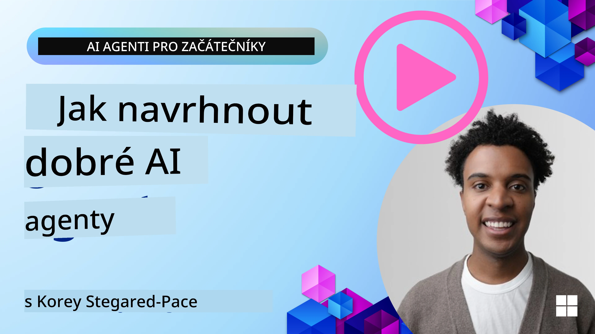
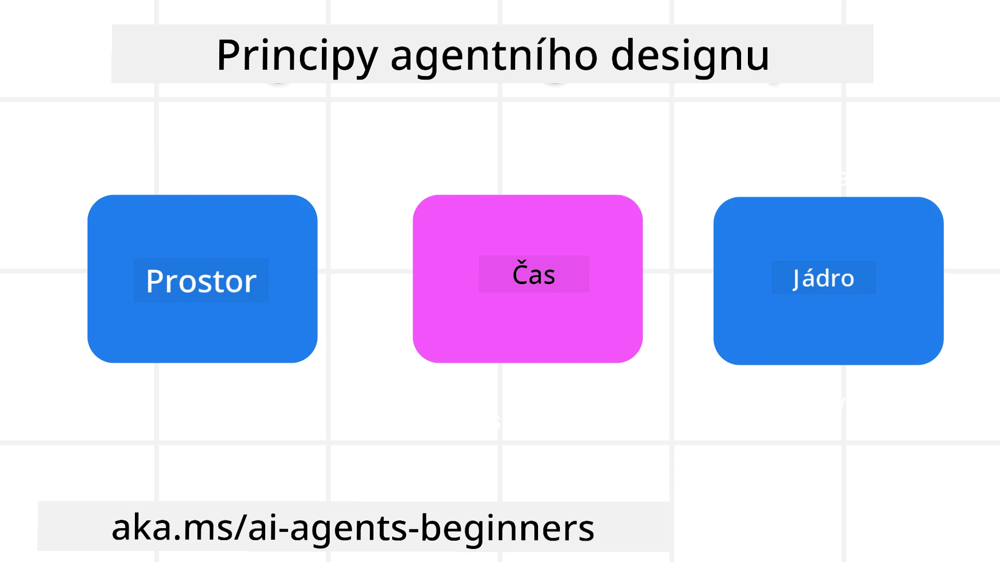

> _(Klikněte na obrázek výše pro zobrazení videa této lekce)_
# Principy agentického designu AI

## Úvod

Existuje mnoho způsobů, jak přemýšlet o vytváření agentických AI systémů. Vzhledem k tomu, že nejednoznačnost je vlastností a ne chybou v návrhu generativní AI, je pro inženýry někdy obtížné určit, kde vůbec začít. Vytvořili jsme soubor principů designu UX zaměřených na člověka, aby vývojáři mohli stavět agentické systémy orientované na zákazníka pro řešení obchodních potřeb. Tyto principy designu nejsou prezcripční architekturou, ale spíše výchozím bodem pro týmy, které definují a budují agentické zkušenosti.

Obecně by agenti měli:

- Rozšiřovat a škálovat lidské schopnosti (brainstorming, řešení problémů, automatizace atd.)
- Vyplňovat znalostní mezery (dostat mě rychle do obrazu v oblastech znalostí, překlady atd.)
- Usnadňovat a podporovat spolupráci způsoby, jakými my jednotlivci preferujeme pracovat s ostatními
- Činit nás lepšími verzemi sebe sama (např. životní kouč/přísný vůdce, pomáhající nám naučit se regulovat emoce a dovednosti všímavosti, budovat odolnost atd.)

## Tato lekce pokryje

- Co jsou agentické designové principy
- Jaké jsou některé pokyny pro implementaci těchto designových principů
- Některé příklady použití designových principů

## Výukové cíle

Po dokončení této lekce budete schopni:

1. Vysvětlit, co jsou agentické designové principy
2. Vysvětlit pokyny pro používání agentických designových principů
3. Rozumět, jak postavit agenta pomocí agentických designových principů

## Agentické designové principy

### Agent (Prostor)

Toto je prostředí, ve kterém agent působí. Tyto principy informují, jak navrhovat agenty pro zapojení do fyzických a digitálních světů.

- **Propojování, nikoli kolaps** – pomáhat propojovat lidi s jinými lidmi, událostmi a použitelnými znalostmi, aby byla možná spolupráce a spojení.
- Agent pomáhá propojit události, znalosti a lidi.
- Agent přibližuje lidi k sobě. Není navržen k nahrazování nebo podceňování lidí.
- **Snadno přístupný, ale občas neviditelný** – agent většinou působí na pozadí a pouze nás jemně upozorňuje, když je to relevantní a vhodné.
  - Agent je snadno objevitelný a přístupný pro autorizované uživatele na jakémkoliv zařízení či platformě.
  - Agent podporuje multimodální vstupy a výstupy (zvuk, hlas, text atd.).
  - Agent může plynule přecházet mezi popředím a pozadím; mezi proaktivním a reaktivním režimem, podle svého vnímání potřeb uživatele.
  - Agent může fungovat v neviditelné podobě, ale jeho procesy na pozadí a spolupráce s ostatními agenty jsou uživateli transparentní a ovladatelné.

### Agent (Čas)

Toto je, jak agent působí v čase. Tyto principy informují, jak navrhnout agenty interagující přes minulost, přítomnost a budoucnost.

- **Minulost**: Reflexe historie zahrnující jak stav, tak kontext.
  - Agent poskytuje relevantnější výsledky na základě analýzy bohatších historických dat, nejen samotných událostí, lidí či stavů.
  - Agent vytváří spojení z minulých událostí a aktivně reflektuje paměť k zapojení do aktuálních situací.
- **Teď**: Jemné pobízení spíše než pouhé upozornění.
  - Agent ztělesňuje komplexní přístup k interakci s lidmi. Když se stane událost, agent jde dál než statické upozornění či jiná formální upozornění. Agent může zjednodušit postupy nebo dynamicky generovat podněty k nasměrování uživatelovy pozornosti ve správný moment.
  - Agent poskytuje informace na základě kontextu okolí, sociálních a kulturních změn a na míru záměru uživatele.
  - Interakce s agentem může být postupná, vyvíjející se a rostoucí v komplexnosti, aby uživatelům poskytla dlouhodobou moc.
- **Budoucnost**: Přizpůsobování a vývoj.
  - Agent se přizpůsobuje různým zařízením, platformám a modalitám.
  - Agent se přizpůsobuje uživatelskému chování, potřebám přístupnosti a je volně přizpůsobitelný.
  - Agent je utvářen a vyvíjí se prostřednictvím kontinuální uživatelské interakce.

### Agent (Jádro)

Toto jsou klíčové prvky v jádru návrhu agenta.

- **Přijměte nejistotu, ale vybudujte důvěru**.
  - Určitá míra nejistoty agenta je očekávaná. Nejistota je klíčovým prvkem designu agenta.
  - Důvěra a transparentnost jsou základními vrstvami designu agenta.
  - Lidé mají kontrolu nad tím, kdy je agent zapnutý/vypnutý a stav agenta je vždy jasně viditelný.

## Pokyny pro implementaci těchto principů

Při používání předchozích designových principů použijte následující pokyny:

1. **Transparentnost**: Informujte uživatele, že je zapojena AI, jak funguje (včetně minulých akcí) a jak podat zpětnou vazbu a systém upravit.
2. **Kontrola**: Umožněte uživateli přizpůsobit, specifikovat preference a personalizovat, a mít kontrolu nad systémem a jeho atributy (včetně možnosti zapomenutí).
3. **Konzistence**: Usilujte o konzistentní multimodální zážitky napříč zařízeními a koncovými body. Používejte známé UI/UX prvky, kde je to možné (např. ikona mikrofonu pro hlasovou interakci) a co nejvíce snižujte kognitivní zátěž zákazníka (např. usilujte o stručné odpovědi, vizuální pomůcky a obsah „Zjistit více“).

## Jak navrhnout cestovního agenta pomocí těchto principů a pokynů

Představte si, že navrhujete cestovního agenta, zde je, jak můžete přemýšlet o využití designových principů a pokynů:

1. **Transparentnost** – Dejte uživateli vědět, že cestovní agent je AI-agenta. Poskytněte základní pokyny, jak začít (např. uvítací zpráva, ukázkové výzvy). Jasně dokumentujte toto na stránce produktu. Zobrazte seznam výzev, které uživatel zadal v minulosti. Jasně uveďte, jak podat zpětnou vazbu (palec nahoru/dolů, tlačítko Odeslat zpětnou vazbu atd.). Jasně formulujte, zda má agent omezení použití nebo témat.
2. **Kontrola** – Ujistěte se, že je jasné, jak může uživatel po vytvoření agenta měnit parametry přes systémovou výzvu. Umožněte uživateli zvolit, jak podrobný agent bude, jaký styl psaní bude používat a jaká omezení má agent dodržovat. Umožněte uživateli zobrazit a smazat související soubory nebo data, výzvy a minulé konverzace.
3. **Konzistence** – Ujistěte se, že ikony pro Sdílení výzvy, přidání souboru či fotografie a označení někoho či něčeho jsou standardní a snadno rozpoznatelné. Použijte ikonu sponky pro nahrávání/sdílení souboru s agentem a ikonu obrázku pro nahrávání grafik.

## Ukázkové kódy

- Python: [Agent Framework](./code_samples/03-python-agent-framework.ipynb)
- .NET: [Agent Framework](./code_samples/03-dotnet-agent-framework.md)

## Máte další otázky ohledně AI agentických designových vzorů?

Připojte se na [Microsoft Foundry Discord](https://discord.com/invite/ATgtXmAS5D), kde se setkáte s dalšími studenty, zúčastníte se konzultací a získáte odpovědi na své otázky o AI agentech.

## Další zdroje

- <a href="https://openai.com" target="_blank">Postupy pro řízení agentických AI systémů | OpenAI</a>
- <a href="https://microsoft.com" target="_blank">Projekt HAX Toolkit - Microsoft Research</a>
- <a href="https://responsibleaitoolbox.ai" target="_blank">Responsible AI Toolbox</a>

## Předchozí lekce

[Prozkoumání agentických rámců](../02-explore-agentic-frameworks/README.md)

## Další lekce

[Vzor používání nástrojů](../04-tool-use/README.md)

---

<!-- CO-OP TRANSLATOR DISCLAIMER START -->
**Prohlášení o omezení odpovědnosti**:
Tento dokument byl přeložen pomocí AI překladatelské služby [Co-op Translator](https://github.com/Azure/co-op-translator). Přestože usilujeme o co největší přesnost, mějte prosím na paměti, že automatizované překlady mohou obsahovat chyby nebo nepřesnosti. Originální dokument v jeho mateřském jazyce by měl být považován za autoritativní zdroj. Pro kritické informace se doporučuje profesionální lidský překlad. Nejsme odpovědní za jakékoli nedorozumění nebo nesprávné interpretace vzniklé použitím tohoto překladu.
<!-- CO-OP TRANSLATOR DISCLAIMER END -->