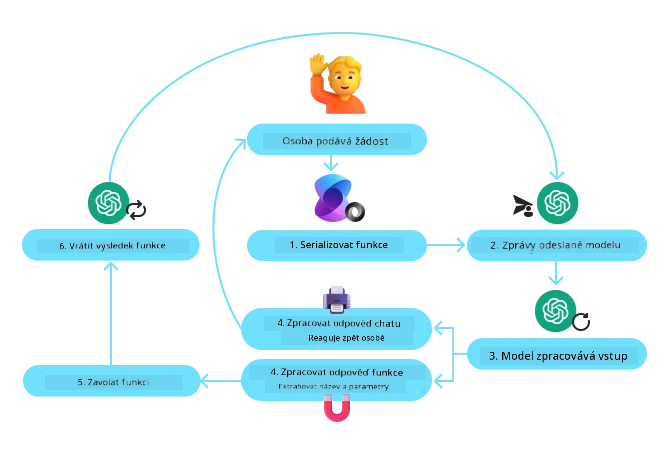
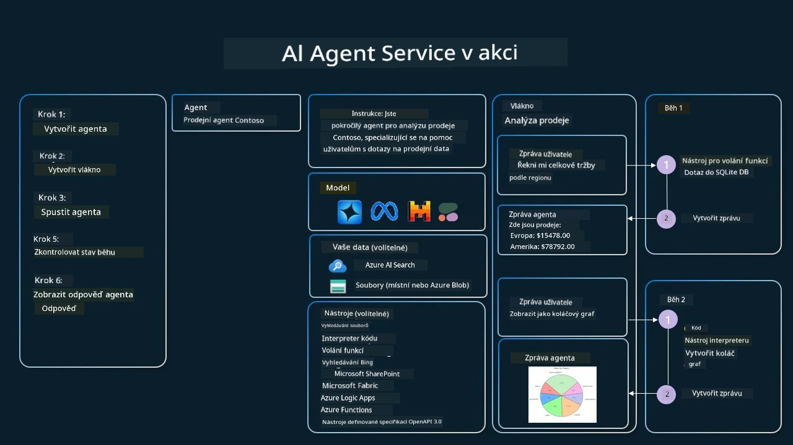

[](https://youtu.be/vieRiPRx-gI?si=cEZ8ApnT6Sus9rhn)

> _(Klikněte na obrázek výše pro zhlédnutí videa této lekce)_

# Vzor návrhu používání nástrojů

Nástroje jsou zajímavé, protože umožňují AI agentům mít širší škálu schopností. Místo toho, aby agent měl omezený soubor akcí, které může provádět, přidáním nástroje může agent nyní vykonávat širokou škálu akcí. V této kapitole si prohlédneme vzor návrhu používání nástrojů, který popisuje, jak mohou AI agenti používat konkrétní nástroje k dosažení svých cílů.

## Úvod

V této lekci se pokusíme odpovědět na následující otázky:

- Co je vzor návrhu používání nástrojů?
- Pro jaké případy použití lze tento vzor aplikovat?
- Jaké jsou prvky/stavební bloky potřebné k implementaci vzoru návrhu?
- Jaká jsou speciální hlediska pro použití vzoru návrhu používání nástrojů k vytvoření důvěryhodných AI agentů?

## Cíle učení

Po absolvování této lekce budete schopni:

- Definovat vzor návrhu používání nástrojů a jeho účel.
- Identifikovat případy použití, kde je vzor používání nástrojů vhodný.
- Pochopit klíčové prvky potřebné k implementaci vzoru návrhu.
- Rozpoznat úvahy pro zajištění důvěryhodnosti AI agentů používajících tento vzor návrhu.

## Co je vzor návrhu používání nástrojů?

**Vzor návrhu používání nástrojů** se zaměřuje na poskytnutí schopnosti LLM interagovat s externími nástroji k dosažení konkrétních cílů. Nástroje jsou kódy, které může agent spustit, aby provedl akce. Nástroj může být jednoduchá funkce, jako je kalkulačka, nebo volání API třetí strany, například dotaz na cenu akcií nebo předpověď počasí. V kontextu AI agentů jsou nástroje navrženy tak, aby je agenti spouštěli v reakci na **funkční volání generovaná modelem**.

## Pro jaké případy použití lze tento vzor aplikovat?

AI agenti mohou využívat nástroje k dokončení složitých úkolů, získání informací nebo učinění rozhodnutí. Vzor používání nástrojů je často používán v situacích vyžadujících dynamickou interakci s externími systémy, jako jsou databáze, webové služby nebo interprety kódu. Tato schopnost je užitečná pro řadu různých použití, včetně:

- **Dynamické získávání informací:** Agenti mohou dotazovat externí API nebo databáze k získání aktuálních dat (např. dotazování SQLite databáze pro analýzu dat, získávání cen akcií nebo informací o počasí).
- **Spouštění a interpretace kódu:** Agenti mohou vykonávat kód nebo skripty k řešení matematických problémů, generování reportů nebo provádění simulací.
- **Automatizace pracovních toků:** Automatizace opakujících se nebo vícefázových pracovních toků integrací nástrojů jako plánovače úkolů, e-mailových služeb nebo datových potrubí.
- **Zákaznická podpora:** Agenti mohou komunikovat s CRM systémy, ticketingovými platformami nebo znalostními databázemi k vyřešení dotazů uživatelů.
- **Generování a úprava obsahu:** Agenti mohou využívat nástroje jako kontrola gramatiky, shrnovače textu nebo hodnotitelé bezpečnosti obsahu k podpoře úkolů tvorby obsahu.

## Jaké jsou prvky/stavební bloky potřebné k implementaci vzoru návrhu používání nástrojů?

Tyto stavební bloky umožňují AI agentovi vykonávat širokou škálu úkolů. Pojďme se podívat na klíčové prvky potřebné k implementaci vzoru používání nástrojů:

- **Schémata funkcí/nástrojů:** Podrobné definice dostupných nástrojů, včetně názvu funkce, účelu, požadovaných parametrů a očekávaných výstupů. Tato schémata umožňují LLM pochopit, jaké nástroje jsou dostupné a jak sestavit platné požadavky.

- **Logika spouštění funkcí:** Řídí, jak a kdy jsou nástroje vyvolány na základě uživatelova záměru a kontextu konverzace. Může zahrnovat plánovací moduly, směrovací mechanismy nebo podmíněné toky, které dynamicky určují používání nástrojů.

- **Systém zpracování zpráv:** Komponenty, které řídí konverzační tok mezi uživatelskými vstupy, odpověďmi LLM, voláními nástrojů a výstupy nástrojů.

- **Rámec integrace nástrojů:** Infrastruktura spojující agenta s různými nástroji, ať už jde o jednoduché funkce nebo komplexní externí služby.

- **Zpracování chyb a validace:** Mechanismy pro zvládání selhání při spouštění nástrojů, validaci parametrů a řízení neočekávaných odpovědí.

- **Správa stavu:** Sleduje kontext konverzace, předchozí interakce s nástroji a perzistentní data pro zajištění konzistence přes více kroků interakce.

Nyní si podrobněji přiblížíme volání funkcí/nástrojů.

### Volání funkcí/nástrojů

Volání funkcí je primární způsob, jakým umožňujeme rozsáhlým jazykovým modelům (LLM) interagovat s nástroji. Často uvidíte termíny „funkce“ a „nástroj“ použité zaměnitelně, protože „funkce“ (bloky znovupoužitelného kódu) jsou „nástroje“, které agenti používají k vykonání úkolů. Aby bylo možné vyvolat kód funkce, musí LLM porovnat uživatelův požadavek s popisem funkcí. K tomu je odesláno schéma obsahující popisy všech dostupných funkcí modelu. LLM poté vybere nejvhodnější funkci pro úkol a vrátí její název a argumenty. Vybraná funkce je vyvolána, její odpověď je zaslána zpět do LLM, který tyto informace použije k odpovědi na uživatelův požadavek.

Pro vývojáře, kteří chtějí implementovat volání funkcí pro agenty, jsou potřeba:

1. LLM model, který podporuje volání funkcí
2. Schéma obsahující popisy funkcí
3. Kód pro každou popsanou funkci

Pro ilustraci použijme příklad zjištění aktuálního času v městě:

1. **Inicializujte LLM, který podporuje volání funkcí:**

   Ne všechny modely volání funkcí podporují, proto je důležité ověřit, že váš LLM tuto podporu má.  
   <a href="https://learn.microsoft.com/azure/ai-services/openai/how-to/function-calling" target="_blank">Azure OpenAI</a> podporuje volání funkcí. Začneme inicializací klienta Azure OpenAI.

    ```python
    # Inicializujte klienta Azure OpenAI
    client = AzureOpenAI(
        azure_endpoint = os.getenv("AZURE_AI_PROJECT_ENDPOINT"), 
        api_key=os.getenv("AZURE_OPENAI_API_KEY"),  
        api_version="2024-05-01-preview"
    )
    ```


1. **Vytvořte schéma funkce:**

   Definujeme JSON schéma, které obsahuje název funkce, popis funkce a názvy a popisy parametrů funkce.  
   Toto schéma pak předáme dříve vytvořenému klientovi spolu s uživatelovým požadavkem na zjištění času v San Franciscu. Důležité je poznamenat, že výsledkem není **konečná odpověď na otázku**, ale **volání nástroje**. Jak bylo zmíněno, LLM vrací název zvolené funkce pro úkol a argumenty, které jí budou předány.

    ```python
    # Popis funkce pro model ke čtení
    tools = [
        {
            "type": "function",
            "function": {
                "name": "get_current_time",
                "description": "Get the current time in a given location",
                "parameters": {
                    "type": "object",
                    "properties": {
                        "location": {
                            "type": "string",
                            "description": "The city name, e.g. San Francisco",
                        },
                    },
                    "required": ["location"],
                },
            }
        }
    ]
    ```
   
    ```python
  
    # Počáteční uživatelská zpráva
    messages = [{"role": "user", "content": "What's the current time in San Francisco"}] 
  
    # První volání API: Požádejte model, aby použil funkci
      response = client.chat.completions.create(
          model=deployment_name,
          messages=messages,
          tools=tools,
          tool_choice="auto",
      )
  
      # Zpracujte odpověď modelu
      response_message = response.choices[0].message
      messages.append(response_message)
  
      print("Model's response:")  

      print(response_message)
  
    ```

    ```bash
    Model's response:
    ChatCompletionMessage(content=None, role='assistant', function_call=None, tool_calls=[ChatCompletionMessageToolCall(id='call_pOsKdUlqvdyttYB67MOj434b', function=Function(arguments='{"location":"San Francisco"}', name='get_current_time'), type='function')])
    ```
  

1. **Kód funkce potřebný k vykonání úkolu:**

   Jakmile si LLM vybere, kterou funkci spustit, je třeba implementovat a spustit kód, který úkol provede.  
   Kód pro získání aktuálního času v Pythonu implementujeme sami. Dále je třeba napsat kód pro extrakci názvu a argumentů z response_message, abychom dostali konečný výsledek.

    ```python
      def get_current_time(location):
        """Get the current time for a given location"""
        print(f"get_current_time called with location: {location}")  
        location_lower = location.lower()
        
        for key, timezone in TIMEZONE_DATA.items():
            if key in location_lower:
                print(f"Timezone found for {key}")  
                current_time = datetime.now(ZoneInfo(timezone)).strftime("%I:%M %p")
                return json.dumps({
                    "location": location,
                    "current_time": current_time
                })
      
        print(f"No timezone data found for {location_lower}")  
        return json.dumps({"location": location, "current_time": "unknown"})
    ```

     ```python
     # Zpracování volání funkcí
      if response_message.tool_calls:
          for tool_call in response_message.tool_calls:
              if tool_call.function.name == "get_current_time":
     
                  function_args = json.loads(tool_call.function.arguments)
     
                  time_response = get_current_time(
                      location=function_args.get("location")
                  )
     
                  messages.append({
                      "tool_call_id": tool_call.id,
                      "role": "tool",
                      "name": "get_current_time",
                      "content": time_response,
                  })
      else:
          print("No tool calls were made by the model.")  
  
      # Druhý API dotaz: Získat konečnou odpověď od modelu
      final_response = client.chat.completions.create(
          model=deployment_name,
          messages=messages,
      )
  
      return final_response.choices[0].message.content
     ```

     ```bash
      get_current_time called with location: San Francisco
      Timezone found for san francisco
      The current time in San Francisco is 09:24 AM.
     ```


Volání funkcí je jádrem většiny, ne-li všech vzorů používání nástrojů v agentech, avšak jeho implementace od začátku může být někdy náročná.  
Jak jsme se naučili v [Lekci 2](../../../02-explore-agentic-frameworks), agentní rámce nám poskytují předpřipravené stavební bloky pro implementaci používání nástrojů.

## Příklady používání nástrojů s agentními rámci

Zde jsou některé příklady, jak můžete implementovat vzor používání nástrojů pomocí různých agentních rámců:

### Microsoft Agent Framework

<a href="https://learn.microsoft.com/azure/ai-services/agents/overview" target="_blank">Microsoft Agent Framework</a> je open source AI rámec pro tvorbu AI agentů. Zjednodušuje proces volání funkcí tím, že umožňuje definovat nástroje jako Python funkce s dekorátorem `@tool`. Rámec zajišťuje komunikaci mezi modelem a vaším kódem. Také poskytuje přístup k předpřipraveným nástrojům, jako je hledání v souborech a interpret kódu, přes `AzureAIProjectAgentProvider`.

Následující diagram znázorňuje proces volání funkcí v Microsoft Agent Framework:



V Microsoft Agent Framework jsou nástroje definovány jako dekorované funkce. Můžeme převést funkci `get_current_time`, kterou jsme viděli dříve, na nástroj pomocí dekorátoru `@tool`. Rámec automaticky serializuje funkci a její parametry a vytvoří schéma, které zašle LLM.

```python
from agent_framework import tool
from agent_framework.azure import AzureAIProjectAgentProvider
from azure.identity import AzureCliCredential

@tool
def get_current_time(location: str) -> str:
    """Get the current time for a given location"""
    ...

# Vytvořit klienta
provider = AzureAIProjectAgentProvider(credential=AzureCliCredential())

# Vytvořit agenta a spustit s nástrojem
agent = await provider.create_agent(name="TimeAgent", instructions="Use available tools to answer questions.", tools=get_current_time)
response = await agent.run("What time is it?")
```
  

### Azure AI Agent Service

<a href="https://learn.microsoft.com/azure/ai-services/agents/overview" target="_blank">Azure AI Agent Service</a> je novější agentní rámec, navržený tak, aby umožnil vývojářům bezpečně vytvářet, nasazovat a škálovat vysoce kvalitní a rozšiřitelné AI agenty bez nutnosti spravovat základní výpočetní a úložné zdroje. Je zvláště užitečný pro podnikové aplikace, protože jde o plně spravovanou službu s podnikovou úrovní zabezpečení.

Ve srovnání s vývojem přímo přes LLM API nabízí Azure AI Agent Service některé výhody, včetně:

- Automatické volání nástrojů – není třeba rozebírat volání nástroje, vyvolat nástroj a zpracovávat odpověď; vše se nyní děje na straně serveru
- Bezpečně spravovaná data – místo správy stavu konverzace je možné spolehnout se na vlákna, která uchovávají veškeré potřebné informace
- Nástroje připravené k použití – nástroje, které vám umožní interagovat s vašimi zdroji dat, jako Bing, Azure AI Search a Azure Functions.

Nástroje dostupné v Azure AI Agent Service lze rozdělit do dvou kategorií:

1. Nástroje znalostí:
    - <a href="https://learn.microsoft.com/azure/ai-services/agents/how-to/tools/bing-grounding?tabs=python&pivots=overview" target="_blank">Základ s Bing Search</a>
    - <a href="https://learn.microsoft.com/azure/ai-services/agents/how-to/tools/file-search?tabs=python&pivots=overview" target="_blank">Hledání souborů</a>
    - <a href="https://learn.microsoft.com/azure/ai-services/agents/how-to/tools/azure-ai-search?tabs=azurecli%2Cpython&pivots=overview-azure-ai-search" target="_blank">Azure AI Search</a>

2. Akční nástroje:
    - <a href="https://learn.microsoft.com/azure/ai-services/agents/how-to/tools/function-calling?tabs=python&pivots=overview" target="_blank">Volání funkcí</a>
    - <a href="https://learn.microsoft.com/azure/ai-services/agents/how-to/tools/code-interpreter?tabs=python&pivots=overview" target="_blank">Interpret kódu</a>
    - <a href="https://learn.microsoft.com/azure/ai-services/agents/how-to/tools/openapi-spec?tabs=python&pivots=overview" target="_blank">Nástroje definované OpenAPI</a>
    - <a href="https://learn.microsoft.com/azure/ai-services/agents/how-to/tools/azure-functions?pivots=overview" target="_blank">Azure Functions</a>

Agent Service nám umožňuje používat tyto nástroje společně jako `toolset`. Používá také `vlákna`, která uchovávají historii zpráv z konkrétní konverzace.

Představte si, že jste obchodní zástupce ve společnosti Contoso. Chcete vytvořit konverzačního agenta, který umí odpovídat na otázky týkající se prodejních dat.

Následující obrázek znázorňuje, jak můžete použít Azure AI Agent Service k analýze vašich prodejních dat:



Pro použití některého z těchto nástrojů se službou můžeme vytvořit klienta a definovat nástroj nebo sadu nástrojů. Praktickou implementaci můžeme uskutečnit následujícím Python kódem. LLM bude moci při pohledu na toolset rozhodnout, zda použije uživatelem vytvořenou funkci `fetch_sales_data_using_sqlite_query`, nebo předpřipravený Code Interpreter podle požadavku uživatele.

```python 
import os
from azure.ai.projects import AIProjectClient
from azure.identity import DefaultAzureCredential
from fetch_sales_data_functions import fetch_sales_data_using_sqlite_query # funkce fetch_sales_data_using_sqlite_query, kterou najdete v souboru fetch_sales_data_functions.py.
from azure.ai.projects.models import ToolSet, FunctionTool, CodeInterpreterTool

project_client = AIProjectClient.from_connection_string(
    credential=DefaultAzureCredential(),
    conn_str=os.environ["PROJECT_CONNECTION_STRING"],
)

# Inicializovat sadu nástrojů
toolset = ToolSet()

# Inicializovat agenta pro volání funkcí s funkcí fetch_sales_data_using_sqlite_query a přidat ji do sady nástrojů
fetch_data_function = FunctionTool(fetch_sales_data_using_sqlite_query)
toolset.add(fetch_data_function)

# Inicializovat nástroj Code Interpreter a přidat jej do sady nástrojů.
code_interpreter = code_interpreter = CodeInterpreterTool()
toolset.add(code_interpreter)

agent = project_client.agents.create_agent(
    model="gpt-4o-mini", name="my-agent", instructions="You are helpful agent", 
    toolset=toolset
)
```


## Jaká jsou speciální hlediska pro použití vzoru návrhu používání nástrojů k vytvoření důvěryhodných AI agentů?

Běžnou obavou u SQL dynamicky generovaného LLM jsou bezpečnostní rizika, zejména hrozba SQL injection nebo škodlivých akcí, jako je smazání či poškození databáze. Tyto obavy jsou oprávněné, ale mohou být efektivně zmírněny správnou konfigurací přístupových oprávnění k databázi. Většinou to zahrnuje nastavení databáze do režimu pouze pro čtení. U databázových služeb jako PostgreSQL nebo Azure SQL by měla aplikace mít přiřazenou roli s oprávněním pouze ke čtení (SELECT).

Provozování aplikace v bezpečném prostředí navíc zvyšuje ochranu. V podnikových scénářích jsou data obvykle extrahována a transformována z provozních systémů do databáze pouze pro čtení nebo datového skladu s uživatelsky přívětivým schématem. Tento postup zajistí, že data jsou bezpečná, optimalizovaná pro výkon a přístupnost a že aplikace má omezený, pouze čtecí přístup.

## Ukázkové kódy

- Python: [Agent Framework](./code_samples/04-python-agent-framework.ipynb)
- .NET: [Agent Framework](./code_samples/04-dotnet-agent-framework.md)

## Máte další otázky ohledně vzorů návrhu používání nástrojů?

Připojte se k [Microsoft Foundry Discord](https://aka.ms/ai-agents/discord), kde se setkáte s dalšími studenty, zúčastníte se konzultačních hodin a dostanete odpovědi na své otázky o AI agentech.

## Další zdroje

- <a href="https://microsoft.github.io/build-your-first-agent-with-azure-ai-agent-service-workshop/" target="_blank">Workshop Azure AI Agents Service</a>
- <a href="https://github.com/Azure-Samples/contoso-creative-writer/tree/main/docs/workshop" target="_blank">Workshopy Contoso Creative Writer Multi-Agent</a>
- <a href="https://learn.microsoft.com/azure/ai-services/agents/overview" target="_blank">Přehled Microsoft Agent Framework</a>

## Předchozí lekce

[Pochopení agentních vzorů návrhu](../03-agentic-design-patterns/README.md)

## Další lekce
[Agentický RAG](../05-agentic-rag/README.md)

---

<!-- CO-OP TRANSLATOR DISCLAIMER START -->
**Vymezení odpovědnosti**:  
Tento dokument byl přeložen pomocí AI překladatelské služby [Co-op Translator](https://github.com/Azure/co-op-translator). I když usilujeme o přesnost, mějte prosím na paměti, že automatické překlady mohou obsahovat chyby nebo nepřesnosti. Původní dokument v jeho mateřském jazyce by měl být považován za závazný zdroj. Pro důležité informace se doporučuje využít profesionální lidský překlad. Nejsme odpovědní za jakékoli nedorozumění nebo nesprávné interpretace vyplývající z použití tohoto překladu.
<!-- CO-OP TRANSLATOR DISCLAIMER END -->