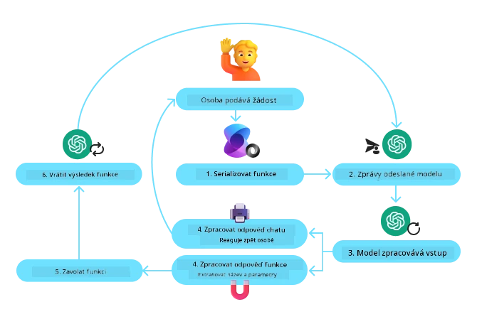
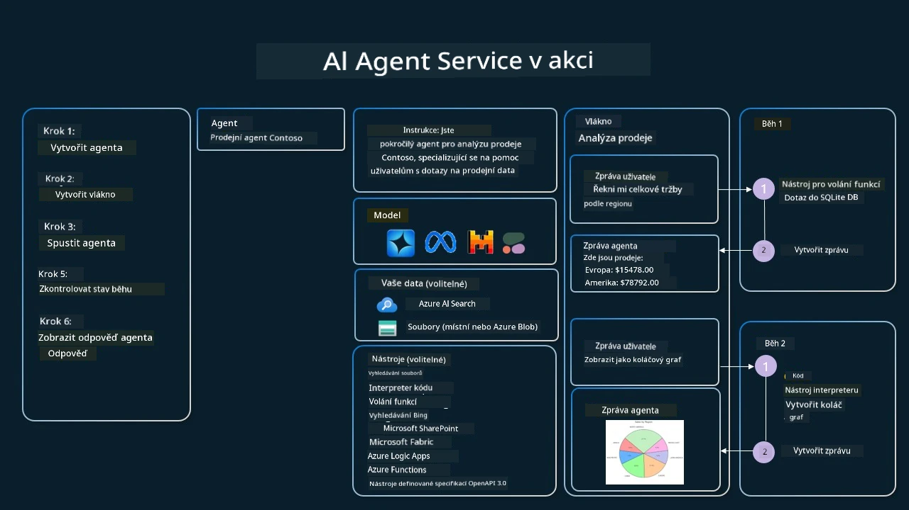

[](https://youtu.be/vieRiPRx-gI?si=cEZ8ApnT6Sus9rhn)

> _(Klikněte na obrázek výše pro zhlédnutí videa z této lekce)_

# Návrhový vzor používání nástrojů

Nástroje jsou zajímavé, protože umožňují AI agentům mít širší škálu schopností. Místo toho, aby agent měl omezenou sadu akcí, které může vykonávat, přidáním nástroje může agent provádět širokou škálu akcí. V této kapitole se podíváme na návrhový vzor používání nástrojů, který popisuje, jak mohou AI agenti používat specifické nástroje k dosažení svých cílů.

## Úvod

V této lekci se pokusíme odpovědět na následující otázky:

- Co je to návrhový vzor používání nástrojů?
- Na jaké případy použití lze tento vzor aplikovat?
- Jaké prvky/stavební kameny jsou potřeba k implementaci tohoto návrhového vzoru?
- Jaká jsou speciální hlediska pro použití návrhového vzoru používání nástrojů při vytváření důvěryhodných AI agentů?

## Cíle učení

Po dokončení této lekce budete schopni:

- Definovat návrhový vzor používání nástrojů a jeho účel.
- Identifikovat případy použití, kde je tento návrhový vzor vhodný.
- Pochopit klíčové prvky potřebné k implementaci návrhového vzoru.
- Rozpoznat hlediska pro zajištění důvěryhodnosti AI agentů používajících tento návrhový vzor.

## Co je návrhový vzor používání nástrojů?

**Návrhový vzor používání nástrojů** se zaměřuje na umožnění LLM (velkým jazykovým modelům) interagovat s externími nástroji k dosažení specifických cílů. Nástroje jsou kód, který může agent spustit k provedení akcí. Nástroj může být jednoduchá funkce, jako kalkulačka, nebo volání API třetí strany, například vyhledávání cen akcií nebo předpověď počasí. V kontextu AI agentů jsou nástroje navrženy tak, aby je agenti spouštěli jako odpověď na **volání funkcí generovaných modelem**.

## Na jaké případy použití lze tento vzor aplikovat?

AI agenti mohou využívat nástroje k dokončení složitých úkolů, získávání informací či rozhodování. Návrhový vzor používání nástrojů se často používá v situacích, které vyžadují dynamickou interakci s externími systémy, jako jsou databáze, webové služby nebo interprety kódu. Tato schopnost je užitečná pro řadu různých případů použití, například:

- **Dynamické získávání informací:** Agenti mohou dotazovat externí API nebo databáze pro získání aktuálních dat (např. dotazování SQLite databáze pro analýzu dat, získávání cen akcií nebo informací o počasí).
- **Spouštění a interpretace kódu:** Agenti mohou spouštět kód nebo skripty k řešení matematických problémů, generování zpráv nebo provádění simulací.
- **Automatizace pracovních postupů:** Automatizace opakujících se nebo vícekrokových pracovních postupů integrací nástrojů jako plánovače úloh, e-mailových služeb nebo datových pipeline.
- **Zákaznická podpora:** Agenti mohou komunikovat s CRM systémy, ticketovacími platformami nebo znalostními databázemi k vyřešení uživatelských dotazů.
- **Generování a úprava obsahu:** Agenti mohou využívat nástroje jako kontroly gramatiky, shrnovače textu nebo hodnotitele bezpečnosti obsahu k asistenci při tvorbě obsahu.

## Jaké prvky/stavební kameny jsou potřeba k implementaci návrhového vzoru používání nástrojů?

Tyto stavební prvky umožňují AI agentovi vykonávat širokou škálu úkolů. Podívejme se na klíčové prvky potřebné k implementaci názorvého vzoru používání nástrojů:

- **Schéma funkcí/nástrojů**: Podrobné definice dostupných nástrojů, včetně názvu funkce, účelu, požadovaných parametrů a očekávaných výstupů. Tato schémata umožňují LLM pochopit, jaké nástroje jsou k dispozici a jak sestavit platné požadavky.

- **Logika vykonávání funkcí**: Řídí, jak a kdy jsou nástroje volány na základě záměru uživatele a kontextu konverzace. Může zahrnovat moduly plánovače, mechanizmy směrování nebo podmíněné toky, které dynamicky určují použití nástrojů.

- **Systém správy zpráv**: Komponenty, které řídí tok konverzace mezi uživatelskými vstupy, odpověďmi LLM, voláními nástrojů a výstupy nástrojů.

- **Rámec integrace nástrojů**: Infrastruktura, která spojuje agenta s různými nástroji, ať už jsou to jednoduché funkce, nebo komplexní externí služby.

- **Zpracování chyb a validace**: Mechanizmy pro řešení neúspěchů při vykonávání nástrojů, validaci parametrů a správu neočekávaných odpovědí.

- **Správa stavu**: Sleduje kontext konverzace, předchozí interakce s nástroji a perzistentní data pro zajištění konzistence v průběhu vícetahových interakcí.

Dále si podrobněji ukážeme volání funkcí/nástrojů.
 
### Volání funkcí/nástrojů

Volání funkcí je primární způsob, jakým umožňujeme velkým jazykovým modelům (LLM) interagovat s nástroji. Často uvidíte, že „funkce“ a „nástroj“ jsou používány zaměnitelně, protože „funkce“ (bloky znovupoužitelného kódu) jsou 'nástroje', které agenti používají k vykonání úkolů. Aby mohl být kód funkce vyvolán, musí LLM porovnat požadavek uživatele s popisem funkcí. K tomu se do LLM posílá schéma obsahující popisy všech dostupných funkcí. LLM poté vybere nejvhodnější funkci pro daný úkol a vrátí její jméno a argumenty. Vybraná funkce je vyvolána, její odpověď je zaslána zpět LLM, které použije informace k odpovědi na požadavek uživatele.

Pro vývojáře, kteří chtějí implementovat volání funkcí pro agenty, je potřeba:

1. LLM model, který podporuje volání funkcí
2. Schéma obsahující popisy funkcí
3. Kód pro každou popsanou funkci

Použijme příklad získání aktuálního času ve městě pro ilustraci:

1. **Inicializujte LLM, který podporuje volání funkcí:**

    Ne všechny modely podporují volání funkcí, proto je důležité zkontrolovat, že model, který používáte, tuto podporu má.     <a href="https://learn.microsoft.com/azure/ai-services/openai/how-to/function-calling" target="_blank">Azure OpenAI</a> podporuje volání funkcí. Můžeme začít tím, že inicializujeme OpenAI klienta pro Azure OpenAI **Responses API** (stabilní endpoint `/openai/v1/` — není potřeba `api_version`). 

    ```python
    # Inicializujte klienta OpenAI pro Azure OpenAI (API odpovědí, koncový bod v1)
    client = OpenAI(
        base_url=f"{os.environ['AZURE_OPENAI_ENDPOINT'].rstrip('/')}/openai/v1/",
        api_key=os.environ["AZURE_OPENAI_API_KEY"],
    )
    deployment_name = os.environ["AZURE_OPENAI_DEPLOYMENT"]
    ```

1. **Vytvoření schématu funkce**:

    Dále definujeme JSON schéma, které obsahuje název funkce, popis toho, co funkce dělá, a názvy a popisy parametrů funkce.
    Toto schéma pak předáme klientovi vytvořenému výše, společně s uživatelovým požadavkem, aby našel čas v San Franciscu. Důležité je poznamenat, že je vráceno **volání nástroje**, **ne** konečná odpověď na otázku. Jak bylo uvedeno dříve, LLM vrací název funkce, kterou si vybral pro úkol, a argumenty, které jí budou předány.

    ```python
    # Popis funkce pro model ke čtení (formát nástroje Responses API flat)
    tools = [
        {
            "type": "function",
            "name": "get_current_time",
            "description": "Get the current time in a given location",
            "parameters": {
                "type": "object",
                "properties": {
                    "location": {
                        "type": "string",
                        "description": "The city name, e.g. San Francisco",
                    },
                },
                "required": ["location"],
            },
        }
    ]
    ```
   
    ```python
  
    # Počáteční uživatelská zpráva
    messages = [{"role": "user", "content": "What's the current time in San Francisco"}]

    # První volání API: Požádejte model, aby použil funkci
    response = client.responses.create(
        model=deployment_name,
        input=messages,
        tools=tools,
        tool_choice="auto",
        store=False,
    )

    # API Odpovědi vrací volání nástrojů jako položky function_call v response.output.
    # Přidejte je do konverzace, aby měl model plný kontext v dalším kole.
    messages += response.output

    print("Model's response:")
    print(response.output)
  
    ```

    ```bash
    Model's response:
    [ResponseFunctionToolCall(arguments='{"location":"San Francisco"}', call_id='call_pOsKdUlqvdyttYB67MOj434b', name='get_current_time', type='function_call')]
    ```
  
1. **Kód funkce potřebný k vykonání úkolu:**

    Jakmile LLM vybere, kterou funkci je třeba spustit, musí být kód, který úkol vykoná, implementován a spuštěn.
    Můžeme implementovat kód pro získání aktuálního času v Pythonu. Také budeme muset napsat kód pro extrakci jména a argumentů z response_message pro získání konečného výsledku.

    ```python
      def get_current_time(location):
        """Get the current time for a given location"""
        print(f"get_current_time called with location: {location}")  
        location_lower = location.lower()
        
        for key, timezone in TIMEZONE_DATA.items():
            if key in location_lower:
                print(f"Timezone found for {key}")  
                current_time = datetime.now(ZoneInfo(timezone)).strftime("%I:%M %p")
                return json.dumps({
                    "location": location,
                    "current_time": current_time
                })
      
        print(f"No timezone data found for {location_lower}")  
        return json.dumps({"location": location, "current_time": "unknown"})
    ```

     ```python
    # Zpracovat volání funkcí
    tool_calls = [item for item in response.output if item.type == "function_call"]
    if tool_calls:
        for tool_call in tool_calls:
            if tool_call.name == "get_current_time":

                function_args = json.loads(tool_call.arguments)

                time_response = get_current_time(
                    location=function_args.get("location")
                )

                # Vrátit výsledek nástroje jako položku function_call_output
                messages.append({
                    "type": "function_call_output",
                    "call_id": tool_call.call_id,
                    "output": time_response,
                })
    else:
        print("No tool calls were made by the model.")

    # Druhé volání API: Získat konečnou odpověď od modelu
    final_response = client.responses.create(
        model=deployment_name,
        input=messages,
        tools=tools,
        store=False,
    )

    return final_response.output_text
     ```

     ```bash
      get_current_time called with location: San Francisco
      Timezone found for san francisco
      The current time in San Francisco is 09:24 AM.
     ```

Volání funkcí je srdcem většiny, pokud ne všech, návrhů používání nástrojů u agentů, ovšem jeho implementace od začátku může být někdy náročná.
Jak jsme se naučili v [Lekci 2](../../../02-explore-agentic-frameworks), agentní rámce nám poskytují předem připravené stavební bloky k implementaci používání nástrojů.
 
## Příklady používání nástrojů s agentními rámci

Zde je několik příkladů, jak implementovat návrhový vzor používání nástrojů pomocí různých agentních rámců:

### Microsoft Agent Framework

<a href="https://learn.microsoft.com/azure/ai-services/agents/overview" target="_blank">Microsoft Agent Framework</a> je open-source AI rámec pro tvorbu AI agentů. Zjednodušuje proces používání volání funkcí tím, že umožňuje definovat nástroje jako Python funkce pomocí dekorátoru `@tool`. Rámec zvládá komunikaci mezi modelem a vaším kódem. Také poskytuje přístup k předpřipraveným nástrojům jako File Search a Code Interpreter přes `FoundryChatClient`.

Následující diagram ilustruje proces volání funkcí v Microsoft Agent Framework:



V Microsoft Agent Framework jsou nástroje definovány jako dekorované funkce. Můžeme přeměnit funkci `get_current_time`, kterou jsme viděli dříve, na nástroj pomocí dekorátoru `@tool`. Rámec automaticky serializuje funkci a její parametry a vytvoří schéma, které se odešle LLM.

```python
import os
from agent_framework import tool
from agent_framework.foundry import FoundryChatClient
from azure.identity import AzureCliCredential

@tool(approval_mode="never_require")
def get_current_time(location: str) -> str:
    """Get the current time for a given location"""
    ...

# Vytvořit klienta
provider = FoundryChatClient(
    project_endpoint=os.environ["AZURE_AI_PROJECT_ENDPOINT"],
    model=os.environ["AZURE_AI_MODEL_DEPLOYMENT_NAME"],
    credential=AzureCliCredential(),
)

# Vytvořit agenta a spustit s nástrojem
agent = provider.as_agent(name="TimeAgent", instructions="Use available tools to answer questions.", tools=get_current_time)
response = await agent.run("What time is it?")
```
  
### Microsoft Foundry Agent Service

<a href="https://learn.microsoft.com/azure/ai-services/agents/overview" target="_blank">Microsoft Foundry Agent Service</a> je novější agentní rámec navržený k umožnění vývojářům bezpečně budovat, nasazovat a škálovat vysoce kvalitní a rozšiřitelné AI agenty bez nutnosti spravovat základní výpočetní a úložné zdroje. Je obzvláště užitečný pro podnikové aplikace, protože jde o plně spravovanou službu s bezpečností na úrovni podniků.

Ve srovnání s přímým vývojem pomocí LLM API poskytuje Microsoft Foundry Agent Service některé výhody, včetně:

- Automatické volání nástrojů – není třeba parsovat volání nástroje, vyvolávat nástroj a zpracovávat odpověď; vše je nyní prováděno na straně serveru.
- Bezpečně spravovaná data – místo správy vlastního stavu konverzace můžete spoléhat na vlákna, která uchovávají všechny potřebné informace.
- Nástroje připravené k použití – nástroje, které můžete použít k interakci s datovými zdroji, jako jsou Bing, Azure AI Search a Azure Functions.

Dostupné nástroje v Microsoft Foundry Agent Service lze rozdělit do dvou kategorií:

1. Nástroje znalostí:
    - <a href="https://learn.microsoft.com/azure/ai-services/agents/how-to/tools/bing-grounding?tabs=python&pivots=overview" target="_blank">Propojení s vyhledáváním Bing</a>
    - <a href="https://learn.microsoft.com/azure/ai-services/agents/how-to/tools/file-search?tabs=python&pivots=overview" target="_blank">Vyhledávání souborů</a>
    - <a href="https://learn.microsoft.com/azure/ai-services/agents/how-to/tools/azure-ai-search?tabs=azurecli%2Cpython&pivots=overview-azure-ai-search" target="_blank">Azure AI Search</a>

2. Akční nástroje:
    - <a href="https://learn.microsoft.com/azure/ai-services/agents/how-to/tools/function-calling?tabs=python&pivots=overview" target="_blank">Volání funkcí</a>
    - <a href="https://learn.microsoft.com/azure/ai-services/agents/how-to/tools/code-interpreter?tabs=python&pivots=overview" target="_blank">Code Interpreter</a>
    - <a href="https://learn.microsoft.com/azure/ai-services/agents/how-to/tools/openapi-spec?tabs=python&pivots=overview" target="_blank">Nástroje definované OpenAPI</a>
    - <a href="https://learn.microsoft.com/azure/ai-services/agents/how-to/tools/azure-functions?pivots=overview" target="_blank">Azure Functions</a>

Agent Service nám umožňuje používat tyto nástroje společně jako `toolset`. Také využívá `vlákna`, která sledují historii zpráv z konkrétní konverzace.

Představte si, že jste obchodní agent ve společnosti Contoso. Chcete vyvinout konverzačního agenta, který dokáže odpovídat na otázky týkající se vašich prodejních dat.

Následující obrázek ukazuje, jak byste mohli použít Microsoft Foundry Agent Service k analýze vašich prodejních dat:



Pro použití některého z těchto nástrojů se službou můžeme vytvořit klienta a definovat nástroj nebo sadu nástrojů. Prakticky to můžeme implementovat pomocí následujícího Python kódu. LLM bude schopné prohlédnout si toolset a rozhodnout, zda použije uživatelem vytvořenou funkci `fetch_sales_data_using_sqlite_query`, nebo předpřipravený Code Interpreter, v závislosti na požadavku uživatele.

```python 
import os
from azure.ai.projects import AIProjectClient
from azure.identity import DefaultAzureCredential
from fetch_sales_data_functions import fetch_sales_data_using_sqlite_query # funkce fetch_sales_data_using_sqlite_query, kterou lze najít v souboru fetch_sales_data_functions.py.
from azure.ai.projects.models import ToolSet, FunctionTool, CodeInterpreterTool

project_client = AIProjectClient.from_connection_string(
    credential=DefaultAzureCredential(),
    conn_str=os.environ["PROJECT_CONNECTION_STRING"],
)

# Inicializovat sadu nástrojů
toolset = ToolSet()

# Inicializovat agenta volání funkcí s funkcí fetch_sales_data_using_sqlite_query a přidat ji do sady nástrojů
fetch_data_function = FunctionTool(fetch_sales_data_using_sqlite_query)
toolset.add(fetch_data_function)

# Inicializovat nástroj Kódový interpret a přidat ho do sady nástrojů.
code_interpreter = CodeInterpreterTool()toolset.add(code_interpreter)

agent = project_client.agents.create_agent(
    model="gpt-4o-mini", name="my-agent", instructions="You are helpful agent", 
    toolset=toolset
)
```

## Jaká jsou speciální hlediska pro použití návrhového vzoru používání nástrojů pro vytváření důvěryhodných AI agentů?

Častou obavou u dynamicky generovaného SQL LLM je bezpečnost, zejména riziko SQL injekce nebo škodlivých akcí, jako je mazání nebo manipulace s databází. Přestože jsou tyto obavy oprávněné, lze je účinně zmírnit správnou konfigurací přístupových oprávnění k databázi. U většiny databází to znamená konfiguraci databáze jako pouze pro čtení. U databázových služeb, jako je PostgreSQL nebo Azure SQL, by měla aplikace mít přiřazenou roli pouze pro čtení (SELECT).

Spuštění aplikace v zabezpečeném prostředí dále zvyšuje ochranu. V podnikových scénářích se data typicky extrahují a transformují z provozních systémů do databáze nebo datového skladu pouze pro čtení s uživatelsky přívětivým schématem. Tento přístup zajišťuje, že data jsou zabezpečená, optimalizovaná pro výkon a přístupnost, a že aplikace má omezený přístup pouze pro čtení.

## Ukázkové kódy

- Python: [Agent Framework](./code_samples/04-python-agent-framework.ipynb)
- .NET: [Agent Framework](./code_samples/04-dotnet-agent-framework.md)

## Máte další otázky ohledně návrhového vzoru používání nástrojů?

Přidejte se k [Microsoft Foundry Discord](https://discord.com/invite/ATgtXmAS5D), kde se potkáte s dalšími studenty, zúčastníte se konzultačních hodin a získáte odpovědi na své otázky ohledně AI agentů.

## Další zdroje

- <a href="https://microsoft.github.io/build-your-first-agent-with-azure-ai-agent-service-workshop/" target="_blank">Azure AI Agents Service Workshop</a>
- <a href="https://github.com/Azure-Samples/contoso-creative-writer/tree/main/docs/workshop" target="_blank">Contoso Creative Writer Multi-Agent Workshop</a>
- <a href="https://learn.microsoft.com/azure/ai-services/agents/overview" target="_blank">Microsoft Agent Framework Overview</a>


## Předchozí lekce

[Porozumění agentním návrhovým vzorům](../03-agentic-design-patterns/README.md)

## Další lekce

[Agentní RAG](../05-agentic-rag/README.md)

---

<!-- CO-OP TRANSLATOR DISCLAIMER START -->
**Prohlášení o omezení odpovědnosti**:
Tento dokument byl přeložen pomocí AI překladatelské služby [Co-op Translator](https://github.com/Azure/co-op-translator). Přestože usilujeme o co největší přesnost, mějte prosím na paměti, že automatizované překlady mohou obsahovat chyby nebo nepřesnosti. Originální dokument v jeho mateřském jazyce by měl být považován za autoritativní zdroj. Pro kritické informace se doporučuje profesionální lidský překlad. Nejsme odpovědní za jakékoli nedorozumění nebo nesprávné interpretace vzniklé použitím tohoto překladu.
<!-- CO-OP TRANSLATOR DISCLAIMER END -->