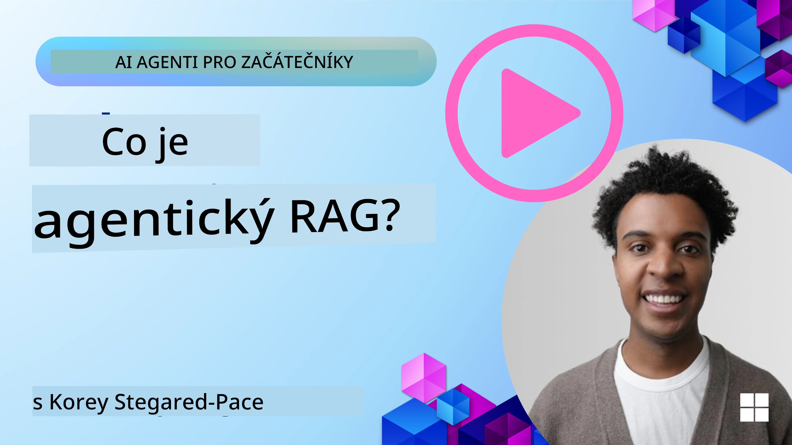
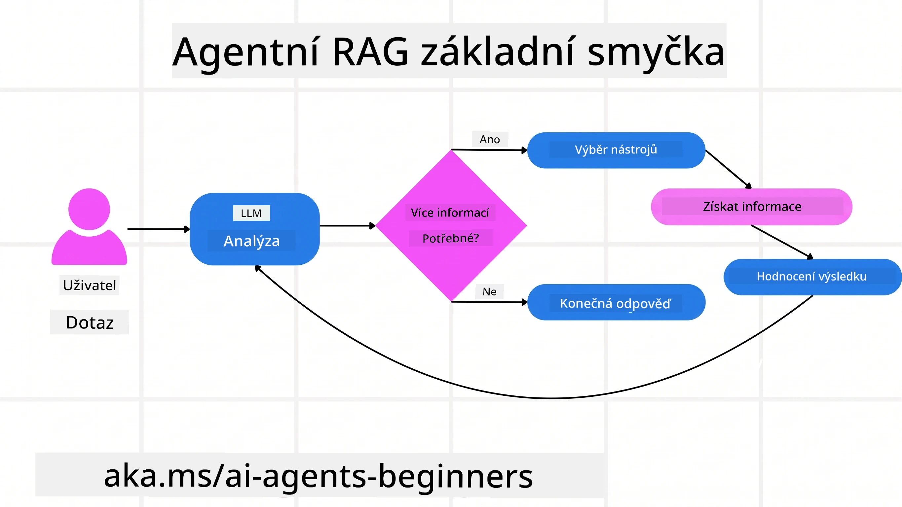
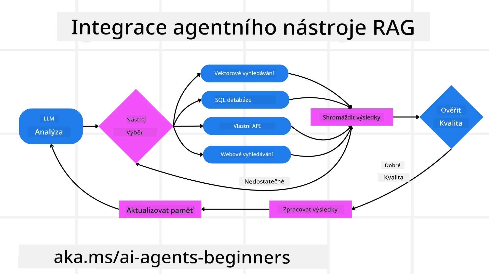
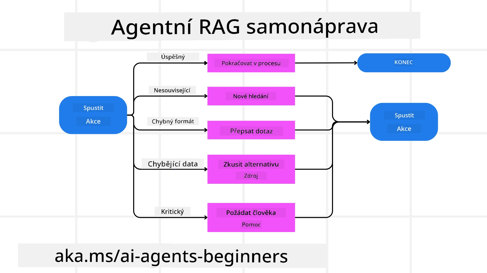
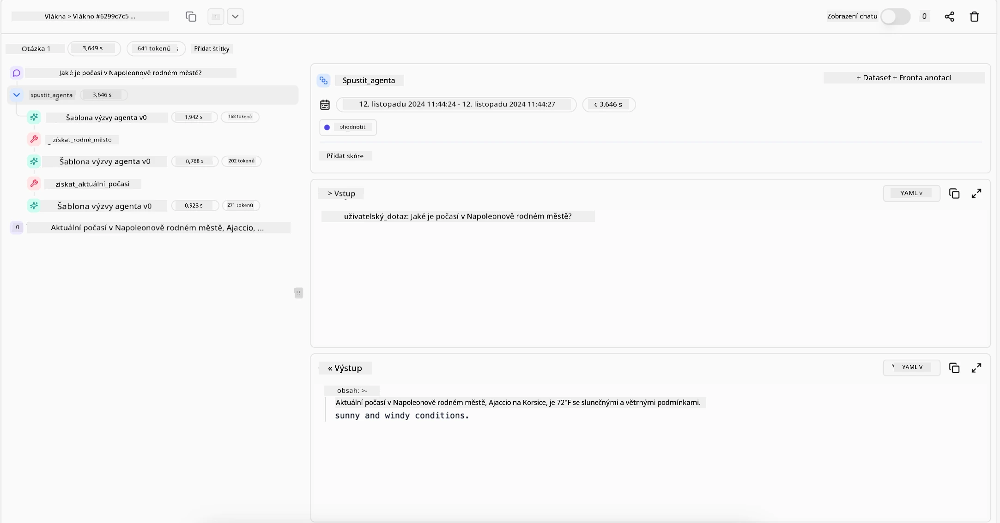

> _(Klikněte na obrázek výše pro zobrazení videa této lekce)_

# Agentic RAG

Tato lekce poskytuje komplexní přehled o Agentic Retrieval-Augmented Generation (Agentic RAG), novém paradigmatu v AI, kde velké jazykové modely (LLM) autonomně plánují své další kroky při načítání informací z externích zdrojů. Na rozdíl od statických vzorců získávání a poté čtení zahrnuje Agentic RAG iterativní volání LLM, prokládaná voláním nástrojů nebo funkcí a strukturovanými výstupy. Systém vyhodnocuje výsledky, zpřesňuje dotazy, v případě potřeby spouští další nástroje a pokračuje v tomto cyklu, dokud není dosaženo uspokojivého řešení.

## Úvod

Tato lekce pokryje

- **Porozumění Agentic RAG:** Seznamte se s novým paradigmatem v AI, kde velké jazykové modely (LLM) autonomně plánují své další kroky při získávání informací z externích datových zdrojů.
- **Pochopení Iterativního Maker-Checker stylu:** Porozumějte smyčce iterativních volání LLM, prokládaných voláním nástrojů nebo funkcí a strukturovanými výstupy, navržené ke zvýšení správnosti a řešení nesprávně formulovaných dotazů.
- **Prozkoumání praktických aplikací:** Identifikujte scénáře, kde Agentic RAG vyniká, například prostředí zaměřená na správnost, složité interakce s databázemi a rozšířené pracovní postupy.

## Cíle výuky

Po dokončení této lekce budete vědět jak a rozumět:

- **Porozumění Agentic RAG:** Seznamte se s novým paradigmatem v AI, kde velké jazykové modely (LLM) autonomně plánují své další kroky při získávání informací z externích datových zdrojů.
- **Iterativní Maker-Checker styl:** Pochopte koncept smyčky iterativních volání LLM, prokládaných voláním nástrojů nebo funkcí a strukturovanými výstupy, navržené ke zvýšení správnosti a řešení nesprávně formulovaných dotazů.
- **Ovládání procesu uvažování:** Pochopte schopnost systému plně ovládat svůj proces uvažování, dělat rozhodnutí o přístupu k problémům bez spoléhání se na předem definované cesty.
- **Pracovní tok:** Pochopte, jak model agentu autonomně rozhoduje o získávání zpráv o tržních trendech, identifikaci dat konkurence, korelaci interních prodejních metrik, syntéze zjištění a vyhodnocení strategie.
- **Iterativní smyčky, integrace nástrojů a paměť:** Naučte se, jak systém spoléhá na vzorec smyčkových interakcí, udržuje stav a paměť mezi kroky, aby se vyhnul opakování smyček a přijal informovaná rozhodnutí.
- **Řešení selhání a sebereflexe:** Prozkoumejte robustní mechanismy sebereflexe systému, včetně opakování a pře-dotazování, využívání diagnostických nástrojů a spoléhání se na lidský dohled.
- **Hranice autonomie:** Pochopte omezení Agentic RAG, zaměřené na doménově specifickou autonomii, závislost na infrastruktuře a respekt k bezpečnostním opatřením.
- **Praktické případy užití a hodnoty:** Identifikujte scénáře, kde Agentic RAG vyniká, například prostředí zaměřená na správnost, složité databázové interakce a rozšířené pracovní postupy.
- **Řízení, transparentnost a důvěra:** Naučte se o důležitosti řízení a transparentnosti, včetně vysvětlitelného uvažování, kontroly zkreslení a lidského dohledu.

## Co je Agentic RAG?

Agentic Retrieval-Augmented Generation (Agentic RAG) je nově vznikající paradigma AI, kde velké jazykové modely (LLM) autonomně plánují své další kroky při načítání informací z externích zdrojů. Na rozdíl od statických vzorců získávání a poté čtení Agentic RAG zahrnuje iterativní volání LLM, prokládané voláním nástrojů nebo funkcí a strukturovanými výstupy. Systém vyhodnocuje výsledky, zpřesňuje dotazy, v případě potřeby spouští další nástroje a pokračuje v tomto cyklu, dokud není dosaženo uspokojivého řešení. Tento iterativní „maker-checker“ styl zvyšuje správnost, řeší nesprávně formulované dotazy a zajišťuje vysokou kvalitu výsledků.

Systém aktivně ovládá svůj proces uvažování, přepisuje neúspěšné dotazy, volí různé metody vyhledávání a integruje více nástrojů — jako je vektorové vyhledávání v Azure AI Search, SQL databáze nebo vlastní API — před konečným sestavením odpovědi. Rozlišující kvalitou agentického systému je jeho schopnost ovládat svůj proces uvažování. Tradiční implementace RAG spoléhají na předem definované cesty, zatímco agentický systém autonomně určuje sekvenci kroků na základě kvality nalezených informací.

## Definice Agentic Retrieval-Augmented Generation (Agentic RAG)

Agentic Retrieval-Augmented Generation (Agentic RAG) je nově vznikající paradigma vývoje AI, kde LLM nejen získávají informace z externích datových zdrojů, ale také autonomně plánují své další kroky. Na rozdíl od statických vzorců získávání a poté čtení nebo pečlivě skriptovaných sekvencí promptů Agentic RAG zahrnuje smyčku iterativních volání LLM, prokládaných voláním nástrojů nebo funkcí a strukturovanými výstupy. Při každém kroku systém vyhodnocuje získané výsledky, rozhoduje, zda zpřesnit své dotazy, v případě potřeby spouští další nástroje a pokračuje v tomto cyklu, dokud nedosáhne uspokojivého řešení.

Tento iterativní „maker-checker“ styl provozu je navržen tak, aby zlepšil správnost, řešil nesprávně formulované dotazy do strukturovaných databází (např. NL2SQL) a zajišťoval vyvážené, kvalitní výsledky. Místo spoléhání se pouze na pečlivě zpracované řetězce promptů systém aktivně ovládá svůj proces uvažování. Může přepisovat neúspěšné dotazy, volit různé metody vyhledávání a integrovat více nástrojů — jako je vektorové vyhledávání v Azure AI Search, SQL databáze nebo vlastní API — před finálním sestavením odpovědi. Tím se odstraňuje potřeba příliš složitých orchestrací. Místo toho relativně jednoduchá smyčka „volání LLM → použití nástroje → volání LLM → …“ může přinést sofistikované a dobře podložené výstupy.

## Ovládání procesu uvažování

Rozlišující kvalitou, která činí systém „agentickým“, je jeho schopnost ovládat svůj proces uvažování. Tradiční implementace RAG často spoléhají na to, že lidé předem definují cestu pro model: řetězec myšlenek, které určují, co a kdy získávat.
Ale když je systém skutečně agentický, uvnitř se rozhoduje, jak k problému přistoupit. Nejde jen o vykonávání skriptu; autonomně určuje sekvenci kroků na základě kvality nalezených informací.
Například pokud je požádán o vytvoření strategie uvedení produktu na trh, nespoléhá se pouze na prompt, který popisuje celý výzkum a proces rozhodování. Místo toho agentický model nezávisle rozhoduje:

1. Získat aktuální zprávy o tržních trendech pomocí Bing Web Grounding
2. Identifikovat relevantní data o konkurentech pomocí Azure AI Search.
3. Korelovat historická interní prodejní data pomocí Azure SQL Database.
4. Syntetizovat zjištění do soudržné strategie koordinované přes Azure OpenAI Service.
5. Vyhodnotit strategii na mezery nebo nesrovnalosti, případně vyvolat další kolo získávání dat.
Všechny tyto kroky — zpřesňování dotazů, volba zdrojů, iterace dokud není odpověď „uspokojivá“ — jsou rozhodovány modelem, nikoli předem napsané člověkem.

## Iterativní smyčky, integrace nástrojů a paměť

Agentický systém se spoléhá na vzorec smyčkové interakce:

- **Počáteční volání:** Uživatelský cíl (tzv. uživatelský prompt) je předložen LLM.
- **Vyvolání nástroje:** Pokud model identifikuje chybějící informace nebo nejasné instrukce, zvolí nástroj nebo metodu získávání – jako je dotaz do vektorové databáze (například Azure AI Search hybridní vyhledávání soukromých dat) nebo strukturovaný SQL dotaz – aby získal více kontextu.
- **Hodnocení a zpřesnění:** Po přezkoumání vrácených dat model rozhodne, zda informace dostačují. Nebo ne, zpřesní dotaz, vyzkouší jiný nástroj nebo upraví přístup.
- **Opakovat dokud není spokojen:** Tento cyklus pokračuje, dokud model nerozhodne, že má dostatečnou jasnost a důkazy pro poskytnutí konečné, dobře odůvodněné odpovědi.
- **Paměť a stav:** Jelikož systém udržuje stav a paměť v rámci kroků, může si pamatovat předchozí pokusy a jejich výsledky, vyhýbat se opakování smyček a činit informovanější rozhodnutí, jak pokračuje.

Postupem času to vytváří pocit vyvíjejícího se porozumění, což umožňuje modelu orientovat se v komplexních, vícekrokových úlohách bez nutnosti lidského zásahu či neustálé úpravy promptu.

## Řešení selhání a sebereflexe

Autonomie Agentic RAG zahrnuje i robustní mechanismy sebereflexe. Když systém narazí na slepé uličky – například načte nerelevantní dokumenty nebo narazí na nesprávně formulované dotazy – může:

- **Iterovat a pře-dotazovat:** Místo vrácení málo hodnotných odpovědí model zkouší nové vyhledávací strategie, přepisuje databázové dotazy nebo prohlíží alternativní datové sady.
- **Používat diagnostické nástroje:** Systém může vyvolat další funkce navržené k pomoci s laděním kroků uvažování nebo ověřením správnosti získaných dat. Nástroje jako Azure AI Tracing jsou důležité pro robustní pozorovatelnost a monitorování.
- **Spoléhat se na lidský dohled:** V případě náročných nebo opakovaně selhávajících scénářů může model vyjádřit nejistotu a požádat o lidskou pomoc. Jakmile člověk poskytne korektivní zpětnou vazbu, model může tuto lekci dále aplikovat.

Tento iterativní a dynamický přístup umožňuje modelu se neustále zlepšovat, zajišťujíc, že nejde pouze o jednorázový systém, ale o ten, který se během relace učí z chyb.

## Hranice autonomie

Přestože má autonomii v rámci úkolu, Agentic RAG není ekvivalentem obecné umělé inteligence (AGI). Jeho „agentické“ schopnosti jsou omezeny nástroji, datovými zdroji a pravidly definovanými lidskými vývojáři. Nemůže si vymýšlet vlastní nástroje ani vystupovat mimo hranice domény, které mu byly nastaveny. Naopak vyniká v dynamické orchestraci dostupných zdrojů.
Klíčové rozdíly oproti pokročilejším formám AI zahrnují:

1. **Doménově specifická autonomie:** Agentic RAG systémy jsou zaměřené na dosažení uživatelem definovaných cílů v rámci známé domény, využívající strategie jako přepisování dotazů nebo volbu nástrojů k vylepšení výsledků.
2. **Závislost na infrastruktuře:** Schopnosti systému závisí na nástrojích a datech integrovaných vývojáři. Nemůže tyto hranice překročit bez lidského zásahu.
3. **Respektování bezpečnostních opatření:** Etické pokyny, pravidla shody a obchodní politiky jsou velmi důležité. Svoboda agenta je vždy omezena bezpečnostními opatřeními a mechanismy dohledu (doufejme).

## Praktické případy užití a přínosy

Agentic RAG vyniká v situacích, které vyžadují iterativní zpřesňování a přesnost:

1. **Prostředí zaměřená na správnost:** Při kontrolách shody, regulativních analýzách nebo právním výzkumu může agentický model opakovaně ověřovat fakta, konzultovat různé zdroje a přepisovat dotazy, dokud nevytvoří důkladně ověřenou odpověď.
2. **Komplexní interakce s databázemi:** Při práci se strukturovanými daty, kde dotazy často selhávají nebo potřebují úpravu, může systém autonomně zpřesňovat dotazy pomocí Azure SQL nebo Microsoft Fabric OneLake, aby finální získání odpovídalo záměru uživatele.
3. **Rozšířené pracovní postupy:** Delší sezení se mohou vyvíjet s přibývajícími informacemi. Agentic RAG může kontinuálně začleňovat nová data a měnit strategie, jak se více dozvídá o problému.

## Řízení, transparentnost a důvěra

Jak se tyto systémy stávají autonomnějšími ve svém uvažování, je řízení a transparentnost klíčové:

- **Vysvětlitelné uvažování:** Model může poskytnout auditní stopu dotazů, které provedl, zdrojů, jež konzultoval, a kroků uvažování, které použil k dosažení závěru. Nástroje jako Azure AI Content Safety a Azure AI Tracing / GenAIOps pomáhají udržovat transparentnost a snižovat rizika.
- **Kontrola zkreslení a vyvážené získávání:** Vývojáři mohou ladit strategie získávání tak, aby byly zahrnuty vyvážené a reprezentativní datové zdroje, a pravidelně auditovat výstupy na přítomnost zkreslení nebo vychýlení, za použití vlastních modelů pro pokročilé datové vědce využívající Azure Machine Learning.
- **Lidský dohled a shoda:** Pro citlivé úkoly zůstává lidské hodnocení nezbytné. Agentic RAG nenahrazuje lidský úsudek v rozhodnutích s vysokou váhou – doplňuje ho poskytováním důkladně ověřených možností.

Mít nástroje, které poskytují jasný záznam akcí, je klíčové. Bez nich může být ladění vícekrokového procesu velmi obtížné. Viz následující příklad z Literal AI (společnost za Chainlit) pro Agent run:

## Závěr

Agentic RAG představuje přirozenou evoluci v tom, jak AI systémy zvládají komplexní úkoly náročné na data. Přijetím smyčkového vzorce interakce, autonomní volbou nástrojů a zpřesňováním dotazů až k dosažení vysoce kvalitního výsledku, systém překračuje statické následování promptů a stává se adaptivnějším, kontextově uvědomělým tvůrcem rozhodnutí. Ačkoliv je stále omezen lidsky definovanou infrastrukturou a etickými pravidly, tyto agentické schopnosti umožňují bohatší, dynamičtější a nakonec užitečnější AI interakce jak pro podniky, tak pro koncové uživatele.

### Máte další otázky o Agentic RAG?

Připojte se k [Microsoft Foundry Discord](https://discord.com/invite/ATgtXmAS5D), kde se setkáte s ostatními studenty, zúčastníte se konzultačních hodin a necháte si zodpovědět své otázky ohledně AI agentů.

## Další zdroje

- <a href="https://learn.microsoft.com/training/modules/use-own-data-azure-openai" target="_blank">Implementace Retrieval Augmented Generation (RAG) se službou Azure OpenAI: Naučte se, jak používat svá vlastní data se službou Azure OpenAI. Tento modul Microsoft Learn poskytuje komplexní průvodce implementací RAG</a>
- <a href="https://learn.microsoft.com/azure/ai-studio/concepts/evaluation-approach-gen-ai" target="_blank">Hodnocení generativních AI aplikací s Microsoft Foundry: Článek pokrývá hodnocení a srovnání modelů na veřejně dostupných datech, včetně aplikací Agentic AI a architektur RAG</a>
- <a href="https://weaviate.io/blog/what-is-agentic-rag" target="_blank">Co je Agentic RAG | Weaviate</a>
- <a href="https://ragaboutit.com/agentic-rag-a-complete-guide-to-agent-based-retrieval-augmented-generation/" target="_blank">Agentic RAG: Kompletní průvodce agentně založeným Retrieval Augmented Generation – Novinky z generace RAG</a>

- <a href="https://huggingface.co/learn/cookbook/agent_rag" target="_blank">Agentic RAG: zrychlete svůj RAG pomocí reformulace dotazů a vlastních dotazů! Hugging Face Open-Source AI Cookbook</a>
- <a href="https://youtu.be/aQ4yQXeB1Ss?si=2HUqBzHoeB5tR04U" target="_blank">Přidání agentních vrstev k RAG</a>
- <a href="https://www.youtube.com/watch?v=zeAyuLc_f3Q&t=244s" target="_blank">Budoucnost znalostních asistentů: Jerry Liu</a>
- <a href="https://www.youtube.com/watch?v=AOSjiXP1jmQ" target="_blank">Jak postavit agentní RAG systémy</a>
- <a href="https://ignite.microsoft.com/sessions/BRK102?source=sessions" target="_blank">Použití Microsoft Foundry Agent Service pro škálování vašich AI agentů</a>

### Akademické články

- <a href="https://arxiv.org/abs/2303.17651" target="_blank">2303.17651 Self-Refine: Iterativní zpřesňování s vlastní zpětnou vazbou</a>
- <a href="https://arxiv.org/abs/2303.11366" target="_blank">2303.11366 Reflexion: Jazykoví agenti s verbálním posilovacím učením</a>
- <a href="https://arxiv.org/abs/2305.11738" target="_blank">2305.11738 CRITIC: Velké jazykové modely se mohou samy opravovat pomocí interaktivní kritiky nástroji</a>
- <a href="https://arxiv.org/abs/2501.09136" target="_blank">2501.09136 Agentic Retrieval-Augmented Generation: Přehled o agentním RAG</a>

## Předchozí lekce

[Návrhový vzor používání nástrojů](../04-tool-use/README.md)

## Následující lekce

[Budování důvěryhodných AI agentů](../06-building-trustworthy-agents/README.md)

---

<!-- CO-OP TRANSLATOR DISCLAIMER START -->
**Prohlášení o omezení odpovědnosti**:
Tento dokument byl přeložen pomocí AI překladatelské služby [Co-op Translator](https://github.com/Azure/co-op-translator). Přestože usilujeme o co největší přesnost, mějte prosím na paměti, že automatizované překlady mohou obsahovat chyby nebo nepřesnosti. Originální dokument v jeho mateřském jazyce by měl být považován za autoritativní zdroj. Pro kritické informace se doporučuje profesionální lidský překlad. Nejsme odpovědní za jakékoli nedorozumění nebo nesprávné interpretace vzniklé použitím tohoto překladu.
<!-- CO-OP TRANSLATOR DISCLAIMER END -->