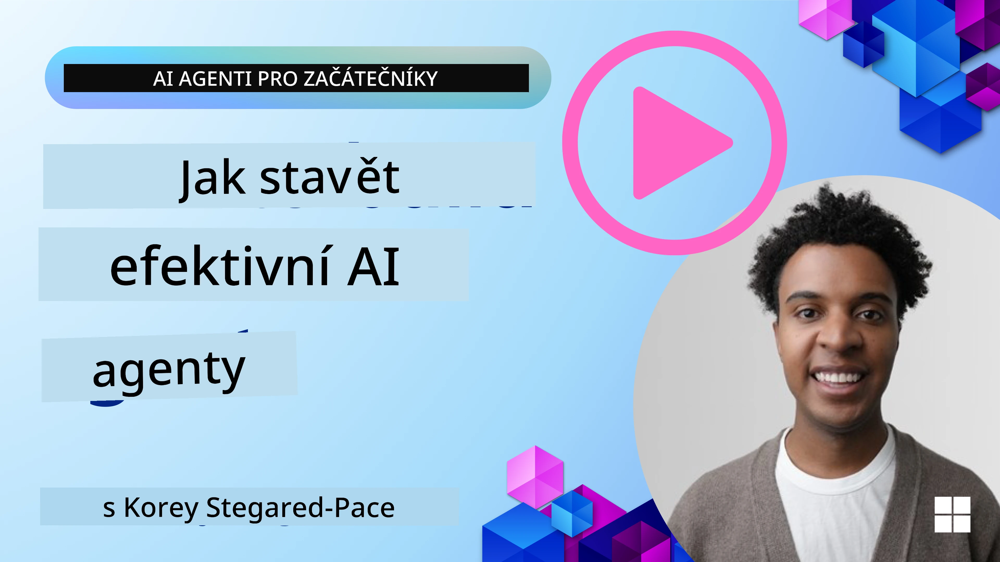
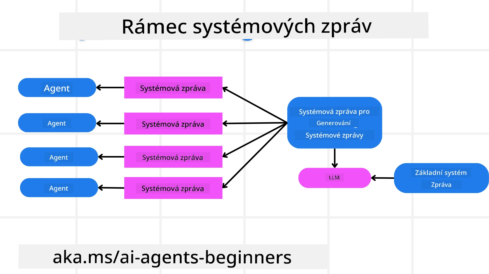
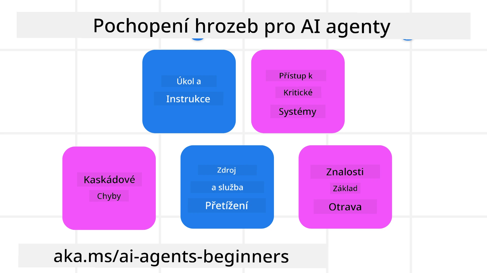
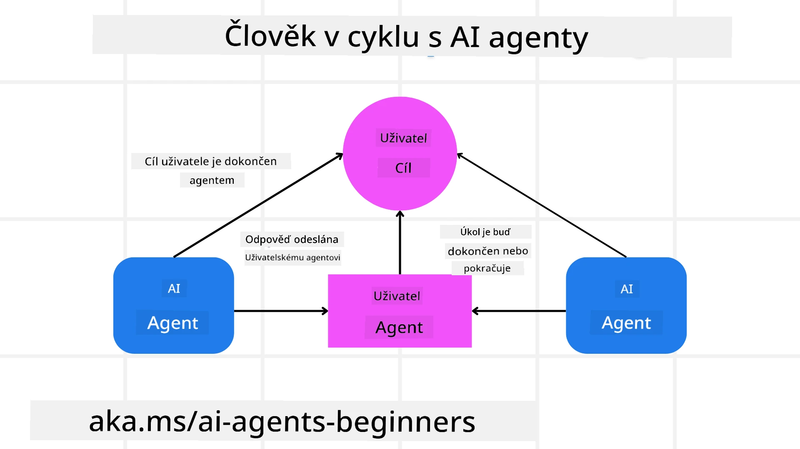

[](https://youtu.be/iZKkMEGBCUQ?si=Q-kEbcyHUMPoHp8L)

> _(Klikněte na obrázek výše pro zhlédnutí videa této lekce)_

# Budování důvěryhodných AI agentů

## Úvod

Tato lekce pokryje:

- Jak vytvořit a nasadit bezpečné a efektivní AI agenty
- Důležité bezpečnostní aspekty při vývoji AI agentů
- Jak udržovat ochranu dat a soukromí uživatelů při vývoji AI agentů

## Cíle učení

Po dokončení této lekce budete vědět, jak:

- Identifikovat a zmírnit rizika při tvorbě AI agentů
- Implementovat bezpečnostní opatření k zajištění správného řízení dat a přístupu
- Vytvořit AI agenty, kteří zachovávají ochranu dat a poskytují kvalitní uživatelský zážitek

## Bezpečnost

Nejprve se podívejme na budování bezpečných agentních aplikací. Bezpečnost znamená, že AI agent funguje podle návrhu. Jako tvůrci agentních aplikací máme metody a nástroje, jak maximalizovat bezpečnost:

### Budování rámce systémové zprávy

Pokud jste někdy vytvářeli AI aplikaci pomocí rozsáhlých jazykových modelů (LLM), víte, jak je důležité navrhnout robustní systémový prompt nebo systémovou zprávu. Tyto prompty stanovují meta pravidla, instrukce a pokyny, jak bude LLM komunikovat s uživatelem a daty.

Pro AI agenty je systémový prompt ještě důležitější, protože AI agenti budou potřebovat velmi specifické pokyny k dokončení úkolů, které jsme pro ně navrhli.

Pro tvorbu škálovatelných systémových promptů můžeme použít rámec systémové zprávy pro tvorbu jednoho nebo více agentů v naší aplikaci:



#### Krok 1: Vytvoření meta systémové zprávy

Meta prompt bude použit LLM k generování systémových promptů pro agenty, které vytváříme. Navrhujeme jej jako šablonu, aby bylo možné efektivně vytvořit více agentů, pokud je potřeba.

Zde je příklad meta systémové zprávy, kterou bychom dali LLM:

```plaintext
You are an expert at creating AI agent assistants. 
You will be provided a company name, role, responsibilities and other
information that you will use to provide a system prompt for.
To create the system prompt, be descriptive as possible and provide a structure that a system using an LLM can better understand the role and responsibilities of the AI assistant. 
```

#### Krok 2: Vytvoření základního promptu

Dalším krokem je vytvoření základního promptu, který popisuje AI agenta. Měli byste zahrnout roli agenta, úkoly, které agent dokončí, a další odpovědnosti agenta.

Zde je příklad:

```plaintext
You are a travel agent for Contoso Travel that is great at booking flights for customers. To help customers you can perform the following tasks: lookup available flights, book flights, ask for preferences in seating and times for flights, cancel any previously booked flights and alert customers on any delays or cancellations of flights.  
```

#### Krok 3: Poskytnutí základní systémové zprávy LLM

Nyní můžeme tento systémový prompt optimalizovat tak, že poskytneme meta systémovou zprávu jako systémovou zprávu a naši základní systémovou zprávu.

Tím vznikne systémová zpráva lépe navržená k vedení našich AI agentů:

```markdown
**Company Name:** Contoso Travel  
**Role:** Travel Agent Assistant

**Objective:**  
You are an AI-powered travel agent assistant for Contoso Travel, specializing in booking flights and providing exceptional customer service. Your main goal is to assist customers in finding, booking, and managing their flights, all while ensuring that their preferences and needs are met efficiently.

**Key Responsibilities:**

1. **Flight Lookup:**
    
    - Assist customers in searching for available flights based on their specified destination, dates, and any other relevant preferences.
    - Provide a list of options, including flight times, airlines, layovers, and pricing.
2. **Flight Booking:**
    
    - Facilitate the booking of flights for customers, ensuring that all details are correctly entered into the system.
    - Confirm bookings and provide customers with their itinerary, including confirmation numbers and any other pertinent information.
3. **Customer Preference Inquiry:**
    
    - Actively ask customers for their preferences regarding seating (e.g., aisle, window, extra legroom) and preferred times for flights (e.g., morning, afternoon, evening).
    - Record these preferences for future reference and tailor suggestions accordingly.
4. **Flight Cancellation:**
    
    - Assist customers in canceling previously booked flights if needed, following company policies and procedures.
    - Notify customers of any necessary refunds or additional steps that may be required for cancellations.
5. **Flight Monitoring:**
    
    - Monitor the status of booked flights and alert customers in real-time about any delays, cancellations, or changes to their flight schedule.
    - Provide updates through preferred communication channels (e.g., email, SMS) as needed.

**Tone and Style:**

- Maintain a friendly, professional, and approachable demeanor in all interactions with customers.
- Ensure that all communication is clear, informative, and tailored to the customer's specific needs and inquiries.

**User Interaction Instructions:**

- Respond to customer queries promptly and accurately.
- Use a conversational style while ensuring professionalism.
- Prioritize customer satisfaction by being attentive, empathetic, and proactive in all assistance provided.

**Additional Notes:**

- Stay updated on any changes to airline policies, travel restrictions, and other relevant information that could impact flight bookings and customer experience.
- Use clear and concise language to explain options and processes, avoiding jargon where possible for better customer understanding.

This AI assistant is designed to streamline the flight booking process for customers of Contoso Travel, ensuring that all their travel needs are met efficiently and effectively.

```

#### Krok 4: Opakujte a zlepšujte

Hodnota tohoto rámce systémové zprávy spočívá v možnosti snadněji škálovat tvorbu systémových zpráv pro více agentů a také ve vylepšování vašich systémových zpráv v průběhu času. Je vzácné, že systémová zpráva bude fungovat na první pokus pro váš kompletní případ použití. Možnost provádět drobné úpravy a vylepšení změnou základní systémové zprávy a jejím zpracováním přes systém vám umožní porovnat a vyhodnotit výsledky.

## Pochopení hrozeb

Pro budování důvěryhodných AI agentů je důležité rozumět a zmírnit rizika a hrozby vůči vašemu AI agentovi. Podívejme se na některé z různých hrozeb pro AI agenty a jak se na ně lépe připravit a plánovat.



### Úkol a instrukce

**Popis:** Útočníci se snaží změnit instrukce nebo cíle AI agenta prostřednictvím promptů nebo manipulace vstupních dat.

**Zmírnění:** Provádějte validační kontroly a filtry vstupů, abyste detekovali potenciálně nebezpečné prompty dříve, než je AI agent zpracuje. Protože tyto útoky obvykle vyžadují častou interakci s agentem, omezení počtu kol v konverzaci je dalším způsobem, jak předejít těmto typům útoků.

### Přístup ke kritickým systémům

**Popis:** Pokud má AI agent přístup k systémům a službám ukládajícím citlivá data, útočníci mohou kompromitovat komunikaci mezi agentem a těmito službami. Může jít o přímé útoky nebo nepřímé pokusy získat informace o těchto systémech přes agenta.

**Zmírnění:** AI agenti by měli mít přístup k systémům pouze podle potřeby, aby se zabránilo těmto útokům. Komunikace mezi agentem a systémem by měla být také zabezpečená. Implementace ověřování a řízení přístupu je dalším způsobem ochrany těchto informací.

### Přetížení zdrojů a služeb

**Popis:** AI agenti mohou používat různé nástroje a služby k dokončení úkolů. Útočníci mohou tuto schopnost zneužít k útokům na tyto služby zasíláním velkého množství požadavků prostřednictvím AI agenta, což může vést k selhání systému nebo vysokým nákladům.

**Zmírnění:** Zavádějte zásady omezující počet požadavků, které může AI agent na službu zaslat. Omezení počtu kol konverzace a požadavků na vašeho AI agenta je dalším způsobem prevence těchto typů útoků.

### Otrava znalostní báze

**Popis:** Tento typ útoku nesměřuje přímo na AI agenta, ale na znalostní bázi a další služby, které AI agent používá. Může se jednat o poškození dat nebo informací, které AI agent používá k dokončení úkolu, což vede k zaujatým nebo nechtěným odpovědím pro uživatele.

**Zmírnění:** Pravidelně ověřujte data, která AI agent používá ve svých pracovních procesech. Zajistěte, aby k těmto datům měli přístup pouze důvěryhodné osoby, aby se zabránilo tomuto typu útoku.

### Kaskádové chyby

**Popis:** AI agenti používají různé nástroje a služby k dokončení úkolů. Chyby způsobené útočníky mohou vést k selháním dalších systémů, na které je AI agent napojen, což způsobí, že útok se rozšíří a je obtížnější jej odhalit a řešit.

**Zmírnění:** Jednou z metod, jak se tomu vyhnout, je provozovat AI agenta v omezeném prostředí, například vykonáváním úkolů v Docker kontejneru, aby se zabránilo přímým útokům na systém. Vytvoření záložních mechanismů a logiky opakování při chybách v některých systémech je dalším způsobem prevence větších systémových selhání.

## Člověk v cyklu

Dalším efektivním způsobem, jak budovat důvěryhodné AI agentní systémy, je použití konceptu Člověka v cyklu. To vytváří tok, ve kterém mohou uživatelé poskytnout zpětnou vazbu agentům během jejich činnosti. Uživatelé v podstatě fungují jako agenti v multi-agentním systému a poskytují schválení nebo ukončení probíhajícího procesu.



Zde je úryvek kódu používající Microsoft Agent Framework, který ukazuje, jak je tento koncept implementován:

```python
import os
from agent_framework.azure import AzureAIProjectAgentProvider
from azure.identity import AzureCliCredential

# Vytvořte poskytovatele s lidským schválením v procesu
provider = AzureAIProjectAgentProvider(
    credential=AzureCliCredential(),
)

# Vytvořte agenta s krokem lidského schválení
response = provider.create_response(
    input="Write a 4-line poem about the ocean.",
    instructions="You are a helpful assistant. Ask for user approval before finalizing.",
)

# Uživatel může odpověď zkontrolovat a schválit
print(response.output_text)
user_input = input("Do you approve? (APPROVE/REJECT): ")
if user_input == "APPROVE":
    print("Response approved.")
else:
    print("Response rejected. Revising...")
```

## Závěr

Budování důvěryhodných AI agentů vyžaduje pečlivý návrh, robustní bezpečnostní opatření a nepřetržitou iteraci. Implementací strukturovaných meta promptových systémů, pochopením možných hrozeb a aplikováním strategie zmírnění mohou vývojáři vytvořit AI agenty, kteří jsou zároveň bezpeční a efektivní. Navíc začlenění přístupu člověka v cyklu zajišťuje, že AI agenti zůstávají v souladu s potřebami uživatelů a minimalizují rizika. S pokračujícím vývojem AI bude pro udržení důvěry a spolehlivosti v AI systémech klíčové zachovat proaktivní přístup k bezpečnosti, ochraně soukromí a etickým otázkám.

### Máte více otázek o budování důvěryhodných AI agentů?

Přidejte se do [Microsoft Foundry Discord](https://aka.ms/ai-agents/discord), kde se setkáte s dalšími studenty, zúčastníte se konzultačních hodin a dostanete odpovědi na své otázky o AI agentech.

## Další zdroje

- <a href="https://learn.microsoft.com/azure/ai-studio/responsible-use-of-ai-overview" target="_blank">Přehled odpovědného používání AI</a>
- <a href="https://learn.microsoft.com/azure/ai-studio/concepts/evaluation-approach-gen-ai" target="_blank">Hodnocení generativních AI modelů a AI aplikací</a>
- <a href="https://learn.microsoft.com/azure/ai-services/openai/concepts/system-message?context=%2Fazure%2Fai-studio%2Fcontext%2Fcontext&tabs=top-techniques" target="_blank">Systémové bezpečnostní zprávy</a>
- <a href="https://blogs.microsoft.com/wp-content/uploads/prod/sites/5/2022/06/Microsoft-RAI-Impact-Assessment-Template.pdf?culture=en-us&country=us" target="_blank">Šablona pro hodnocení rizik</a>

## Předchozí lekce

[Agentní RAG](../05-agentic-rag/README.md)

## Další lekce

[Plánovací návrhový vzor](../07-planning-design/README.md)

---

<!-- CO-OP TRANSLATOR DISCLAIMER START -->
**Prohlášení o vyloučení odpovědnosti**:  
Tento dokument byl přeložen pomocí AI překládací služby [Co-op Translator](https://github.com/Azure/co-op-translator). Ačkoli usilujeme o přesnost, mějte prosím na paměti, že automatické překlady mohou obsahovat chyby nebo nepřesnosti. Původní dokument v jeho mateřském jazyce by měl být považován za autoritativní zdroj. Pro zásadní informace je doporučen profesionální lidský překlad. Nejsme odpovědní za jakákoli nedorozumění nebo nesprávné výklady vyplývající z použití tohoto překladu.
<!-- CO-OP TRANSLATOR DISCLAIMER END -->