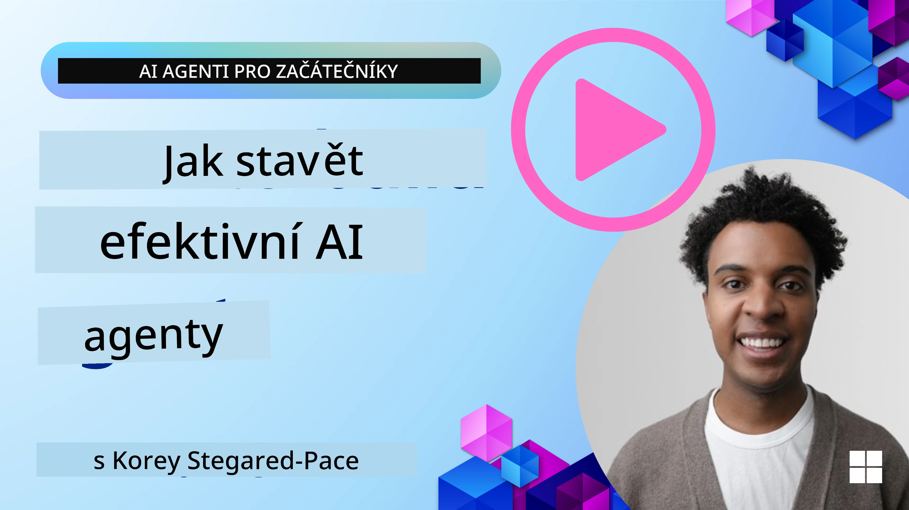
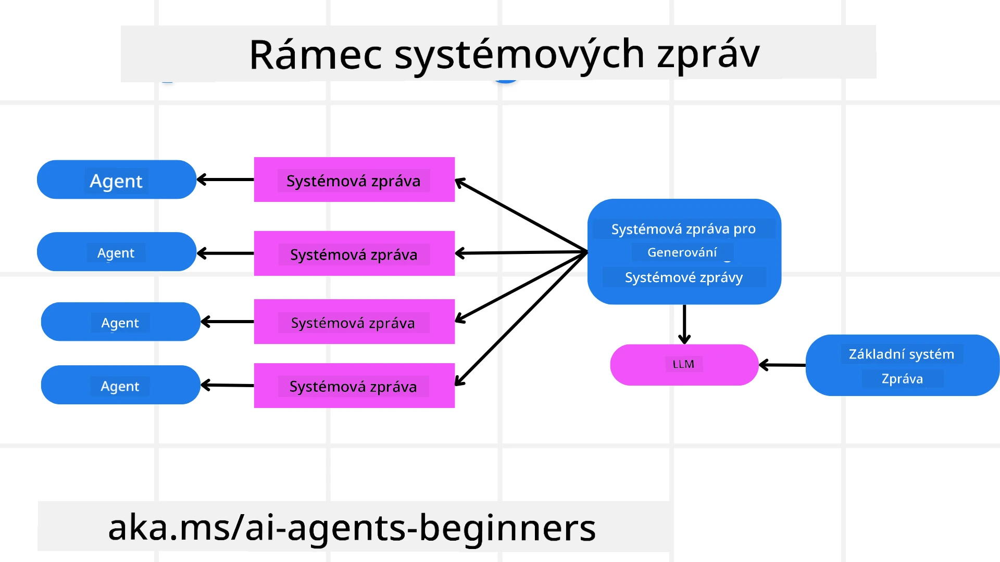
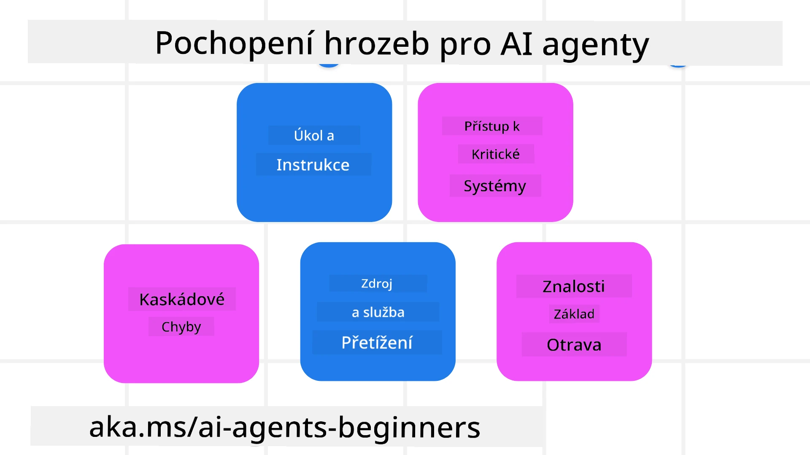
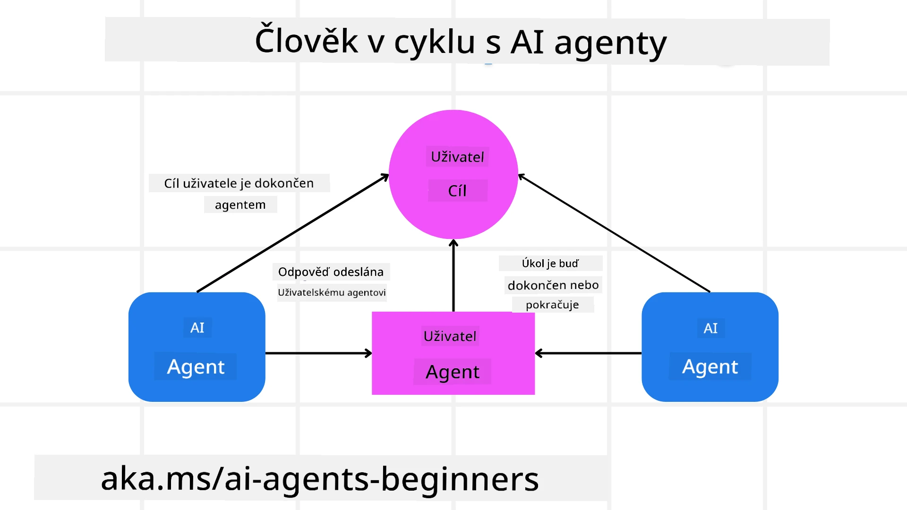

[](https://youtu.be/iZKkMEGBCUQ?si=Q-kEbcyHUMPoHp8L)

> _(Klikněte na obrázek výše pro zobrazení videa této lekce)_

# Budování důvěryhodných AI agentů

## Úvod

Tato lekce se bude zabývat:

- Jak vytvořit a nasadit bezpečné a efektivní AI agenty
- Důležité bezpečnostní aspekty při vývoji AI agentů.
- Jak zabezpečit data a soukromí uživatelů při vývoji AI agentů.

## Cíle učení

Po dokončení této lekce budete umět:

- Identifikovat a zmírňovat rizika při tvorbě AI agentů.
- Implementovat bezpečnostní opatření pro správu dat a přístupu.
- Vytvořit AI agenty, kteří zachovávají soukromí dat a poskytují kvalitní uživatelský zážitek.

## Bezpečnost

Podívejme se nejprve na budování bezpečných agentních aplikací. Bezpečnost znamená, že AI agent funguje podle navržení. Jako tvůrci agentních aplikací máme metody a nástroje, jak maximalizovat bezpečnost:

### Budování rámce systémových zpráv

Pokud jste někdy vytvářeli AI aplikaci s využitím velkých jazykových modelů (LLM), víte, jak důležité je navrhnout robustní systémový prompt nebo systémovou zprávu. Tyto prompty stanovují metapráva, instrukce a pokyny, jak bude LLM komunikovat s uživatelem a zpracovávanými daty.

Pro AI agenty je systémový prompt ještě důležitější, protože AI agenti budou potřebovat vysoce specifické instrukce k dokončení úkolů, které jsme pro ně navrhli.

Pro vytvoření škálovatelných systémových promptů můžeme použít rámec systémových zpráv pro vytvoření jednoho nebo více agentů v naší aplikaci:



#### Krok 1: Vytvoření meta systémové zprávy 

Meta prompt bude použit LLM pro generování systémových promptů pro agenty, které vytvoříme. Navrhujeme ho jako šablonu, abychom mohli efektivně vytvářet více agentů, pokud to bude potřeba.

Zde je příklad meta systémové zprávy, kterou bychom dali LLM:

```plaintext
You are an expert at creating AI agent assistants. 
You will be provided a company name, role, responsibilities and other
information that you will use to provide a system prompt for.
To create the system prompt, be descriptive as possible and provide a structure that a system using an LLM can better understand the role and responsibilities of the AI assistant. 
```

#### Krok 2: Vytvořit základní prompt

Dalším krokem je vytvoření základního promptu, který popisuje AI agenta. Měli byste zahrnout roli agenta, úkoly, které bude agent plnit, a další odpovědnosti agenta.

Zde je příklad:

```plaintext
You are a travel agent for Contoso Travel that is great at booking flights for customers. To help customers you can perform the following tasks: lookup available flights, book flights, ask for preferences in seating and times for flights, cancel any previously booked flights and alert customers on any delays or cancellations of flights.  
```

#### Krok 3: Poskytnout základní systémovou zprávu LLM

Nyní můžeme optimalizovat tuto systémovou zprávu tím, že poskytneme meta systémovou zprávu jako systémovou zprávu a naši základní systémovou zprávu.

To vytvoří systémovou zprávu, která je lépe navržena k usměrňování našich AI agentů:

```markdown
**Company Name:** Contoso Travel  
**Role:** Travel Agent Assistant

**Objective:**  
You are an AI-powered travel agent assistant for Contoso Travel, specializing in booking flights and providing exceptional customer service. Your main goal is to assist customers in finding, booking, and managing their flights, all while ensuring that their preferences and needs are met efficiently.

**Key Responsibilities:**

1. **Flight Lookup:**
    
    - Assist customers in searching for available flights based on their specified destination, dates, and any other relevant preferences.
    - Provide a list of options, including flight times, airlines, layovers, and pricing.
2. **Flight Booking:**
    
    - Facilitate the booking of flights for customers, ensuring that all details are correctly entered into the system.
    - Confirm bookings and provide customers with their itinerary, including confirmation numbers and any other pertinent information.
3. **Customer Preference Inquiry:**
    
    - Actively ask customers for their preferences regarding seating (e.g., aisle, window, extra legroom) and preferred times for flights (e.g., morning, afternoon, evening).
    - Record these preferences for future reference and tailor suggestions accordingly.
4. **Flight Cancellation:**
    
    - Assist customers in canceling previously booked flights if needed, following company policies and procedures.
    - Notify customers of any necessary refunds or additional steps that may be required for cancellations.
5. **Flight Monitoring:**
    
    - Monitor the status of booked flights and alert customers in real-time about any delays, cancellations, or changes to their flight schedule.
    - Provide updates through preferred communication channels (e.g., email, SMS) as needed.

**Tone and Style:**

- Maintain a friendly, professional, and approachable demeanor in all interactions with customers.
- Ensure that all communication is clear, informative, and tailored to the customer's specific needs and inquiries.

**User Interaction Instructions:**

- Respond to customer queries promptly and accurately.
- Use a conversational style while ensuring professionalism.
- Prioritize customer satisfaction by being attentive, empathetic, and proactive in all assistance provided.

**Additional Notes:**

- Stay updated on any changes to airline policies, travel restrictions, and other relevant information that could impact flight bookings and customer experience.
- Use clear and concise language to explain options and processes, avoiding jargon where possible for better customer understanding.

This AI assistant is designed to streamline the flight booking process for customers of Contoso Travel, ensuring that all their travel needs are met efficiently and effectively.

```

#### Krok 4: Iterace a vylepšování

Hodnotou tohoto rámce systémových zpráv je schopnost škálovat tvorbu systémových zpráv z více agentů snadněji a zároveň postupně zlepšovat vaše systémové zprávy. Je vzácné mít systémovou zprávu, která funguje dokonale na první pokus pro celý váš případ použití. Možnost dělat malé úpravy a zlepšení změnou základní systémové zprávy a jejím spuštěním systémem vám umožní porovnat a vyhodnotit výsledky.

## Pochopení hrozeb

Pro vytvoření důvěryhodných AI agentů je důležité pochopit a zmírnit rizika a hrozby vůči vašemu AI agentovi. Podívejme se na některé z různých hrozeb pro AI agenty a jak se na ně lépe připravit.



### Úkol a instrukce

**Popis:** Útočníci se snaží změnit instrukce nebo cíle AI agenta pomocí promptů nebo manipulací vstupů.

**Změkčení:** Proveďte validační kontroly a filtry vstupů, abyste odhalili potenciálně nebezpečné prompty, než budou zpracovány AI agentem. Protože tyto útoky obvykle vyžadují častou interakci s agentem, omezení počtu kol konverzace je dalším způsobem, jak těmto útokům předcházet.

### Přístup k kritickým systémům

**Popis:** Pokud má AI agent přístup k systémům a službám, které uchovávají citlivá data, útočníci mohou kompromitovat komunikaci mezi agentem a těmito službami. Mohou jít o přímé útoky nebo nepřímé pokusy získat informace o těchto systémech přes agenta.

**Změkčení:** AI agenti by měli mít přístup k systémům pouze na základě potřeby, aby se předešlo těmto útokům. Komunikace mezi agentem a systémem by také měla být zabezpečená. Implementace autentizace a řízení přístupu je dalším způsobem, jak chránit tyto informace.

### Přetížení zdrojů a služeb

**Popis:** AI agenti mohou přistupovat k různým nástrojům a službám k plnění úkolů. Útočníci mohou tuto schopnost využít k útokům na tyto služby zasíláním vysokého počtu požadavků přes AI agenta, což může vést k selháním systému nebo vysokým nákladům.

**Změkčení:** Zaveďte politiky omezující počet požadavků, které může AI agent zaslat na službu. Omezování počtu kol konverzace a požadavků na AI agenta je dalším způsobem, jak těmto útokům předcházet.

### Otrava znalostní báze

**Popis:** Tento typ útoku není zaměřen přímo na AI agenty, ale na znalostní bázi a další služby, které AI agent používá. Může jít o poškození dat nebo informací, které AI agent použije k plnění úkolu, což vede k zaujatým nebo nechtěným odpovědím uživateli.

**Změkčení:** Provádějte pravidelnou kontrolu dat, která AI agent používá ve svých pracovních postupech. Zajistěte, aby přístup k těmto datům byl zabezpečený a aby je měnili pouze důvěryhodní jednotlivci, aby se předešlo tomuto typu útoku.

### Kaskádové chyby

**Popis:** AI agenti přistupují k různým nástrojům a službám k plnění úkolů. Chyby způsobené útočníky mohou vést k selhání dalších systémů, ke kterým je AI agent připojen, což zvyšuje rozsah útoku a ztěžuje jeho řešení.

**Změkčení:** Jednou z metod, jak tomu předejít, je nechat AI agenta pracovat v omezeném prostředí, například provádět úkoly v Docker kontejneru, aby se zabránilo přímým útokům na systém. Vytvoření záložních mechanismů a opakování pokusu při odpovědi systému s chybou je dalším způsobem, jak zabránit větším selháním systému.

## Člověk v procesu

Dalším účinným způsobem, jak vytvořit důvěryhodné AI agentní systémy, je použít přístup člověk v procesu. Ten vytváří tok, kde uživatelé mohou poskytovat zpětnou vazbu agentům během jejich běhu. Uživatelé v podstatě fungují jako agenti v multiagentním systému a poskytují schválení nebo ukončení probíhajícího procesu.



Zde je ukázka kódu využívající Microsoft Agent Framework, která ukazuje, jak je tento koncept implementován:

```python
import os
from agent_framework.foundry import FoundryChatClient
from azure.identity import AzureCliCredential

# Vytvořit poskytovatele s lidským schvalovacím krokem
provider = FoundryChatClient(
    project_endpoint=os.environ["AZURE_AI_PROJECT_ENDPOINT"],
    model=os.environ["AZURE_AI_MODEL_DEPLOYMENT_NAME"],
    credential=AzureCliCredential(),
)

# Vytvořit agenta s krokem lidského schválení
response = provider.create_response(
    input="Write a 4-line poem about the ocean.",
    instructions="You are a helpful assistant. Ask for user approval before finalizing.",
)

# Uživatel může odpověď zkontrolovat a schválit
print(response.output_text)
user_input = input("Do you approve? (APPROVE/REJECT): ")
if user_input == "APPROVE":
    print("Response approved.")
else:
    print("Response rejected. Revising...")
```

## Závěr

Budování důvěryhodných AI agentů vyžaduje pečlivý návrh, robustní bezpečnostní opatření a neustálou iteraci. Implementací strukturovaných meta prompting systémů, pochopením možných hrozeb a aplikací strategií zmírnění mohou vývojáři vytvořit AI agenty, kteří jsou bezpeční i efektivní. Zároveň začlenění přístupu člověk v procesu zajišťuje, že AI agenti zůstanou v souladu s potřebami uživatelů a minimalizují rizika. Jak AI dále evoluuje, aktivní přístup k bezpečnosti, soukromí a etickým otázkám bude klíčový pro budování důvěry a spolehlivosti v systémy řízené AI.

## Ukázky kódu

- [`code_samples/06-system-message-framework.ipynb`](code_samples/06-system-message-framework.ipynb): Krok za krokem demonstrace rámce systémových zpráv meta-promptu.
- [`code_samples/06-human-in-the-loop.ipynb`](code_samples/06-human-in-the-loop.ipynb): Schvalovací brány před akcí, tierování rizik a auditní logování pro důvěryhodné agenty.

### Máte další otázky ohledně budování důvěryhodných AI agentů?

Připojte se na [Microsoft Foundry Discord](https://discord.com/invite/ATgtXmAS5D), kde se můžete setkat s dalšími studenty, zúčastnit se konzultací a nechat si zodpovědět vaše otázky ohledně AI agentů.

## Další zdroje

- <a href="https://learn.microsoft.com/azure/ai-studio/responsible-use-of-ai-overview" target="_blank">Přehled odpovědného využití AI</a>
- <a href="https://learn.microsoft.com/azure/ai-studio/concepts/evaluation-approach-gen-ai" target="_blank">Hodnocení generativních AI modelů a AI aplikací</a>
- <a href="https://learn.microsoft.com/azure/ai-services/openai/concepts/system-message?context=%2Fazure%2Fai-studio%2Fcontext%2Fcontext&tabs=top-techniques" target="_blank">Bezpečnostní systémové zprávy</a>
- <a href="https://blogs.microsoft.com/wp-content/uploads/prod/sites/5/2022/06/Microsoft-RAI-Impact-Assessment-Template.pdf?culture=en-us&country=us" target="_blank">Šablona posouzení rizik</a>

## Předchozí lekce

[Agentní RAG](../05-agentic-rag/README.md)

## Další lekce

[Plánovací vzor](../07-planning-design/README.md)

---

<!-- CO-OP TRANSLATOR DISCLAIMER START -->
**Prohlášení o omezení odpovědnosti**:
Tento dokument byl přeložen pomocí AI překladatelské služby [Co-op Translator](https://github.com/Azure/co-op-translator). Přestože usilujeme o co největší přesnost, mějte prosím na paměti, že automatizované překlady mohou obsahovat chyby nebo nepřesnosti. Originální dokument v jeho mateřském jazyce by měl být považován za autoritativní zdroj. Pro kritické informace se doporučuje profesionální lidský překlad. Nejsme odpovědní za jakékoli nedorozumění nebo nesprávné interpretace vzniklé použitím tohoto překladu.
<!-- CO-OP TRANSLATOR DISCLAIMER END -->