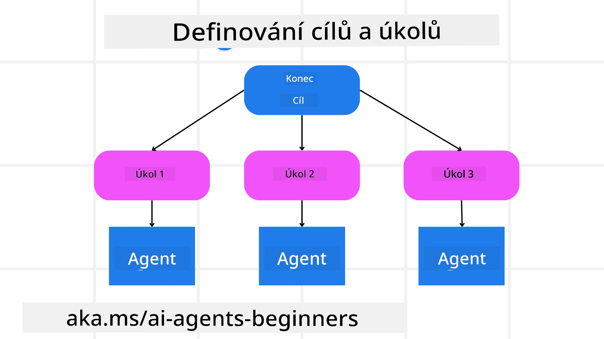

[](https://youtu.be/kPfJ2BrBCMY?si=9pYpPXp0sSbK91Dr)

> _(Klikněte na obrázek výše pro zobrazení videa této lekce)_

# Plánovací návrh

## Úvod

Tato lekce bude pokrývat

* Definování jasného celkového cíle a rozdělení složitého úkolu na zvládnutelné úkoly.
* Využití strukturovaného výstupu pro spolehlivější a strojově čitelné odpovědi.
* Použití přístupu řízeného událostmi pro zvládání dynamických úkolů a neočekávaných vstupů.

## Vzdělávací cíle

Po dokončení této lekce budete mít přehled o:

* Identifikaci a nastavení celkového cíle pro AI agenta, aby jasně věděl, co má být dosaženo.
* Rozkladu složitého úkolu na zvládnutelné dílčí úkoly a jejich uspořádání do logické posloupnosti.
* Vybavení agentů správnými nástroji (např. vyhledávacími nástroji nebo nástroji pro analýzu dat), rozhodování kdy a jak jsou používány, a řešení neočekávaných situací.
* Vyhodnocení výsledků dílčích úkolů, měření výkonu a opakování akcí pro zlepšení konečného výsledku.

## Definování celkového cíle a rozdělení úkolu



Většina reálných úkolů je příliš složitá na řešení v jednom kroku. AI agent potřebuje stručný cíl, který bude řídit jeho plánování a činnosti. Například uvažujte o cíli:

    "Vytvořit plán cesty na 3 dny."

Ačkoliv je snadné jej vyjádřit, stále vyžaduje upřesnění. Čím je cíl jasnější, tím lépe se agent (a případní lidské spolupracovníky) může soustředit na dosažení správného výsledku, jako je vytvoření komplexního itineráře s možnostmi letu, doporučeními hotelů a návrhy aktivit.

### Rozklad úkolu

Velké nebo složité úkoly se stávají lépe zvládnutelnými, když je rozdělíte na menší, cílené dílčí úkoly.
Pro příklad plánu cesty můžete cíl rozdělit na:

* Rezervace letenky
* Rezervace hotelu
* Pronájem auta
* Personalizace

Každý dílčí úkol pak může řešit specializovaný agent nebo proces. Jeden agent může mít specializaci na vyhledávání nejlepších letenek, jiný se zaměřuje na rezervaci hotelů a tak dále. Koordinující nebo „downstream“ agent může pak tyto výsledky sloučit do uceleného itineráře pro koncového uživatele.

Tento modulární přístup také umožňuje postupná vylepšení. Například můžete přidat specializované agenty pro doporučení jídla nebo návrhy místních aktivit a itinerář postupně zdokonalovat.

### Strukturovaný výstup

Velké jazykové modely (LLM) mohou generovat strukturovaný výstup (např. JSON), který je pro downstream agenty nebo služby snazší k parsování a zpracování. To je obzvlášť užitečné v kontextu více agentů, kde můžeme úkoly provádět po obdržení plánovacího výstupu.

Následující Python kód ukazuje jednoduchého plánovacího agenta, který rozkládá cíl na dílčí úkoly a generuje strukturovaný plán:

```python
from pydantic import BaseModel
from enum import Enum
from typing import List, Optional, Union
import json
import os
from typing import Optional
from pprint import pprint
from agent_framework.azure import AzureAIProjectAgentProvider
from azure.identity import AzureCliCredential

class AgentEnum(str, Enum):
    FlightBooking = "flight_booking"
    HotelBooking = "hotel_booking"
    CarRental = "car_rental"
    ActivitiesBooking = "activities_booking"
    DestinationInfo = "destination_info"
    DefaultAgent = "default_agent"
    GroupChatManager = "group_chat_manager"

# Model podúkolu cesty
class TravelSubTask(BaseModel):
    task_details: str
    assigned_agent: AgentEnum  # chceme úkol přiřadit agentovi

class TravelPlan(BaseModel):
    main_task: str
    subtasks: List[TravelSubTask]
    is_greeting: bool

provider = AzureAIProjectAgentProvider(credential=AzureCliCredential())

# Definujte uživatelskou zprávu
system_prompt = """You are a planner agent.
    Your job is to decide which agents to run based on the user's request.
    Provide your response in JSON format with the following structure:
{'main_task': 'Plan a family trip from Singapore to Melbourne.',
 'subtasks': [{'assigned_agent': 'flight_booking',
               'task_details': 'Book round-trip flights from Singapore to '
                               'Melbourne.'}
    Below are the available agents specialised in different tasks:
    - FlightBooking: For booking flights and providing flight information
    - HotelBooking: For booking hotels and providing hotel information
    - CarRental: For booking cars and providing car rental information
    - ActivitiesBooking: For booking activities and providing activity information
    - DestinationInfo: For providing information about destinations
    - DefaultAgent: For handling general requests"""

user_message = "Create a travel plan for a family of 2 kids from Singapore to Melbourne"

response = client.create_response(input=user_message, instructions=system_prompt)

response_content = response.output_text
pprint(json.loads(response_content))
```

### Plánovací agent s orchestrací více agentů

V tomto příkladu Semantic Router Agent přijímá uživatelský požadavek (např. „Potřebuji plán hotelu na svou cestu.“).

Plánovač následně:

* Přijímá plán hotelu: Plánovač vezme uživatelovu zprávu a na základě systémového promptu (včetně dostupných agentů) generuje strukturovaný plán cesty.
* Vyjmenuje agenty a jejich nástroje: Registr agentů obsahuje seznam agentů (např. pro letenky, hotel, pronájem auta a aktivity) spolu s funkcemi nebo nástroji, které poskytují.
* Směruje plán příslušným agentům: V závislosti na počtu dílčích úkolů plánovač buď pošle zprávu přímo specializovanému agentovi (pro scénáře s jedním úkolem) nebo koordinuje přes správce skupinového chatu pro spolupráci více agentů.
* Shrnuje výsledek: Nakonec plánovač shrne vygenerovaný plán pro přehlednost.
Následující ukázka kódu v Pythonu ilustruje tyto kroky:

```python

from pydantic import BaseModel

from enum import Enum
from typing import List, Optional, Union

class AgentEnum(str, Enum):
    FlightBooking = "flight_booking"
    HotelBooking = "hotel_booking"
    CarRental = "car_rental"
    ActivitiesBooking = "activities_booking"
    DestinationInfo = "destination_info"
    DefaultAgent = "default_agent"
    GroupChatManager = "group_chat_manager"

# Model podúkolu cesty

class TravelSubTask(BaseModel):
    task_details: str
    assigned_agent: AgentEnum # chceme přiřadit úkol agentovi

class TravelPlan(BaseModel):
    main_task: str
    subtasks: List[TravelSubTask]
    is_greeting: bool
import json
import os
from typing import Optional

from agent_framework.azure import AzureAIProjectAgentProvider
from azure.identity import AzureCliCredential

# Vytvořit klienta

provider = AzureAIProjectAgentProvider(credential=AzureCliCredential())

from pprint import pprint

# Definovat uživatelskou zprávu

system_prompt = """You are a planner agent.
    Your job is to decide which agents to run based on the user's request.
    Below are the available agents specialized in different tasks:
    - FlightBooking: For booking flights and providing flight information
    - HotelBooking: For booking hotels and providing hotel information
    - CarRental: For booking cars and providing car rental information
    - ActivitiesBooking: For booking activities and providing activity information
    - DestinationInfo: For providing information about destinations
    - DefaultAgent: For handling general requests"""

user_message = "Create a travel plan for a family of 2 kids from Singapore to Melbourne"

response = client.create_response(input=user_message, instructions=system_prompt)

response_content = response.output_text

# Vytisknout obsah odpovědi po načtení jako JSON

pprint(json.loads(response_content))
```

Co následuje, je výstup z předchozího kódu a vy jej potom můžete použít pro směrování k `assigned_agent` a shrnutí plánu cesty koncovému uživateli.

```json
{
    "is_greeting": "False",
    "main_task": "Plan a family trip from Singapore to Melbourne.",
    "subtasks": [
        {
            "assigned_agent": "flight_booking",
            "task_details": "Book round-trip flights from Singapore to Melbourne."
        },
        {
            "assigned_agent": "hotel_booking",
            "task_details": "Find family-friendly hotels in Melbourne."
        },
        {
            "assigned_agent": "car_rental",
            "task_details": "Arrange a car rental suitable for a family of four in Melbourne."
        },
        {
            "assigned_agent": "activities_booking",
            "task_details": "List family-friendly activities in Melbourne."
        },
        {
            "assigned_agent": "destination_info",
            "task_details": "Provide information about Melbourne as a travel destination."
        }
    ]
}
```

Příklad notebooku s předchozím kódem je dostupný [zde](07-python-agent-framework.ipynb).

### Iterativní plánování

Některé úkoly vyžadují opakované interakce nebo přeplánování, kde výsledek jednoho dílčího úkolu ovlivňuje další. Například pokud agent zjistí neočekávaný formát dat během rezervace letenek, může být nutné upravit strategii dříve, než přejde k rezervaci hotelů.

Navíc zpětná vazba od uživatele (např. člověk rozhodující se pro dřívější let) může spustit částečné přeplánování. Tento dynamický, iterativní přístup zajišťuje, že konečné řešení odpovídá reálným omezením a měnícím se preferencím uživatele.

např. ukázkový kód

```python
from agent_framework.azure import AzureAIProjectAgentProvider
from azure.identity import AzureCliCredential
#.. stejně jako v předchozím kódu a předat historii uživatele, aktuální plán

system_prompt = """You are a planner agent to optimize the
    Your job is to decide which agents to run based on the user's request.
    Below are the available agents specialized in different tasks:
    - FlightBooking: For booking flights and providing flight information
    - HotelBooking: For booking hotels and providing hotel information
    - CarRental: For booking cars and providing car rental information
    - ActivitiesBooking: For booking activities and providing activity information
    - DestinationInfo: For providing information about destinations
    - DefaultAgent: For handling general requests"""

user_message = "Create a travel plan for a family of 2 kids from Singapore to Melbourne"

response = client.create_response(
    input=user_message,
    instructions=system_prompt,
    context=f"Previous travel plan - {TravelPlan}",
)
# .. přeplánovat a odeslat úkoly příslušným agentům
```

Pro komplexnější plánování si prohlédněte Magnetic One <a href="https://www.microsoft.com/research/articles/magentic-one-a-generalist-multi-agent-system-for-solving-complex-tasks" target="_blank">Blogpost</a> pro řešení složitých úkolů.

## Shrnutí

V tomto článku jsme si ukázali příklad, jak vytvořit plánovač, který může dynamicky vybírat dostupné definované agenty. Výstup plánovače rozkládá úkoly a přiřazuje agenty tak, aby mohly být provedeny. Předpokládá se, že agenti mají přístup k funkcím/nástrojům potřebným k vykonání úkolu. Kromě agentů můžete zahrnout další vzory jako reflexe, shrnovač a round robin chat pro další přizpůsobení.

## Další zdroje

Magentic One - Generalistický multi-agentní systém pro řešení složitých úkolů, který dosáhl působivých výsledků na několika náročných agentních benchmarkech. Reference: <a href="https://www.microsoft.com/research/articles/magentic-one-a-generalist-multi-agent-system-for-solving-complex-tasks" target="_blank">Magentic One</a>. V této implementaci orchestrátor vytváří úkolově specifické plány a deleguje tyto úkoly dostupným agentům. Kromě plánování orchestrátor také využívá mechanismus sledování pokroku úkolu a dle potřeby přeplánovává.

### Máte další otázky o Plánovacím návrhovém vzoru?

Připojte se k [Microsoft Foundry Discord](https://aka.ms/ai-agents/discord), kde se můžete setkat s dalšími studenty, zúčastnit se konzultačních hodin a získat odpovědi na otázky k AI agentům.

## Předchozí lekce

[Budování důvěryhodných AI agentů](../06-building-trustworthy-agents/README.md)

## Následující lekce

[Multi-agentní návrhový vzor](../08-multi-agent/README.md)

---

<!-- CO-OP TRANSLATOR DISCLAIMER START -->
**Prohlášení o vyloučení odpovědnosti**:  
Tento dokument byl přeložen pomocí AI překladatelské služby [Co-op Translator](https://github.com/Azure/co-op-translator). Přestože usilujeme o přesnost, mějte prosím na paměti, že automatické překlady mohou obsahovat chyby nebo nepřesnosti. Původní dokument v jeho mateřském jazyce by měl být považován za autoritativní zdroj. Pro zásadní informace se doporučuje profesionální lidský překlad. Nejsme odpovědni za jakékoli nedorozumění nebo nesprávné výklady vyplývající z použití tohoto překladu.
<!-- CO-OP TRANSLATOR DISCLAIMER END -->