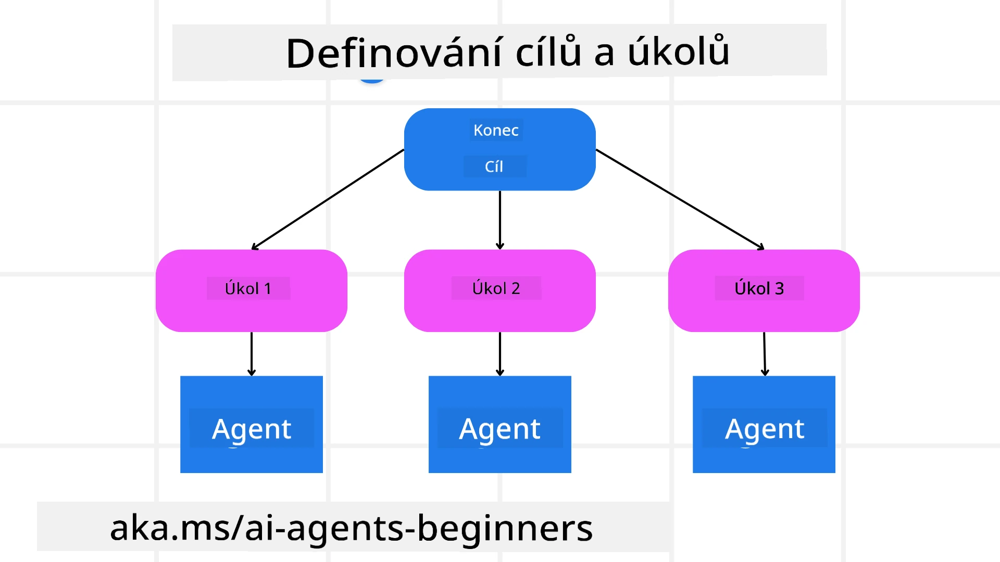

[](https://youtu.be/kPfJ2BrBCMY?si=9pYpPXp0sSbK91Dr)

> _(Klikněte na obrázek výše pro zobrazení videa této lekce)_

# Plánování návrhu

## Úvod

Tato lekce pokryje

* Definování jasného celkového cíle a rozložení složité úlohy na zvládnutelné podúkoly.
* Využití strukturovaného výstupu pro spolehlivější a strojově čitelnější odpovědi.
* Použití přístupu řízeného událostmi k řešení dynamických úkolů a neočekávaných vstupů.

## Cíle učení

Po dokončení této lekce budete rozumět:

* Jak identifikovat a nastavit celkový cíl pro AI agenta, aby jasně věděl, čeho má dosáhnout.
* Jak rozložit složitý úkol na zvládnutelné podúkoly a uspořádat je do logické posloupnosti.
* Jak vybavit agenty vhodnými nástroji (např. vyhledávacími nástroji nebo nástroji pro analýzu dat), rozhodnout, kdy a jak je použít, a jak řešit neočekávané situace.
* Jak vyhodnotit výsledky podúkolů, měřit výkon a iterovat činnosti pro zlepšení konečného výstupu.

## Definování celkového cíle a rozklad úkolu



Většina reálných úkolů je příliš složitá na to, aby byla řešena jedním krokem. AI agent potřebuje stručný cíl, který jej povede při plánování a činnostech. Například zvažte cíl:

    "Vytvořit cestovní itinerář na 3 dny."

I když je to jednoduché říct, je třeba jej upřesnit. Čím jasnější cíl, tím lépe se agent (a případní lidscí spolupracovníci) mohou soustředit na dosažení správného výsledku, například vytvoření komplexního itineráře s možnostmi letů, doporučeními hotelů a návrhy aktivit.

### Rozklad úkolu

Velké nebo složité úkoly se stávají zvládnutelnějšími, když jsou rozděleny na menší podúkoly zaměřené na cíl.
Pro příklad cestovního itineráře můžete rozložit cíl na:

* Rezervaci letu
* Rezervaci hotelu
* Pronájem auta
* Personalizaci

Každý podúkol může pak řešit dedikovaný agent nebo proces. Jeden agent může být specialista na vyhledávání nejlepších letenek, jiný se zaměřuje na rezervaci hotelů atd. Koordinující nebo „downstream“ agent následně sloučí výsledky do jednoho uceleného itineráře pro koncového uživatele.

Tento modulární přístup také umožňuje postupné vylepšení. Například lze přidat specializované agenty pro doporučení jídel nebo místních aktivit a itinerář postupně zdokonalovat.

### Strukturovaný výstup

Velké jazykové modely (LLM) mohou generovat strukturovaný výstup (např. JSON), který je snazší pro další agenty nebo služby zpracovat a analyzovat. To je obzvláště užitečné v kontextu více agentů, kde můžeme úkoly zpracovat po obdržení plánovacího výstupu.

Následující ukázka Pythonu demonstruje jednoduchého plánovacího agenta, který rozkládá cíl na podúkoly a generuje strukturovaný plán:

```python
from pydantic import BaseModel
from enum import Enum
from typing import List, Optional, Union
import json
import os
from typing import Optional
from pprint import pprint
from agent_framework.foundry import FoundryChatClient
from azure.identity import AzureCliCredential

class AgentEnum(str, Enum):
    FlightBooking = "flight_booking"
    HotelBooking = "hotel_booking"
    CarRental = "car_rental"
    ActivitiesBooking = "activities_booking"
    DestinationInfo = "destination_info"
    DefaultAgent = "default_agent"
    GroupChatManager = "group_chat_manager"

# Model podúkolu cesty
class TravelSubTask(BaseModel):
    task_details: str
    assigned_agent: AgentEnum  # chceme přiřadit úkol agentovi

class TravelPlan(BaseModel):
    main_task: str
    subtasks: List[TravelSubTask]
    is_greeting: bool

provider = FoundryChatClient(
    project_endpoint=os.environ["AZURE_AI_PROJECT_ENDPOINT"],
    model=os.environ["AZURE_AI_MODEL_DEPLOYMENT_NAME"],
    credential=AzureCliCredential(),
)

# Definujte uživatelskou zprávu
system_prompt = """You are a planner agent.
    Your job is to decide which agents to run based on the user's request.
    Provide your response in JSON format with the following structure:
{'main_task': 'Plan a family trip from Singapore to Melbourne.',
 'subtasks': [{'assigned_agent': 'flight_booking',
               'task_details': 'Book round-trip flights from Singapore to '
                               'Melbourne.'}
    Below are the available agents specialised in different tasks:
    - FlightBooking: For booking flights and providing flight information
    - HotelBooking: For booking hotels and providing hotel information
    - CarRental: For booking cars and providing car rental information
    - ActivitiesBooking: For booking activities and providing activity information
    - DestinationInfo: For providing information about destinations
    - DefaultAgent: For handling general requests"""

user_message = "Create a travel plan for a family of 2 kids from Singapore to Melbourne"

response = client.create_response(input=user_message, instructions=system_prompt)

response_content = response.output_text
pprint(json.loads(response_content))
```

### Plánovací agent s multi-agentní orchestrací

V tomto příkladu agent s názvem Semantic Router přijímá uživatelský požadavek (např. „Potřebuji plán hotelu na svou cestu.“).

Plánovač pak:

* Přijímá plán hotelu: Plánovač vezme zprávu uživatele a na základě systémového promptu (včetně podrobností o dostupných agentech) vygeneruje strukturovaný cestovní plán.
* Vypisuje agenty a jejich nástroje: Registr agentů obsahuje seznam agentů (např. pro lety, hotely, půjčovny aut a aktivity) spolu s funkcemi nebo nástroji, které nabízejí.
* Směruje plán příslušným agentům: Podle počtu podúkolů plánovač buď přímo pošle zprávu dedikovanému agentovi (pro scénáře s jedním úkolem), nebo koordinuje přes správce skupinového chatu pro spolupráci více agentů.
* Shrnuje výsledek: Nakonec plánovač srozumitelně shrne vygenerovaný plán.
Následující ukázka kódu v Pythonu ilustruje tyto kroky:

```python

from pydantic import BaseModel

from enum import Enum
from typing import List, Optional, Union

class AgentEnum(str, Enum):
    FlightBooking = "flight_booking"
    HotelBooking = "hotel_booking"
    CarRental = "car_rental"
    ActivitiesBooking = "activities_booking"
    DestinationInfo = "destination_info"
    DefaultAgent = "default_agent"
    GroupChatManager = "group_chat_manager"

# Model podúkolu cesty

class TravelSubTask(BaseModel):
    task_details: str
    assigned_agent: AgentEnum # chceme úkol přiřadit agentovi

class TravelPlan(BaseModel):
    main_task: str
    subtasks: List[TravelSubTask]
    is_greeting: bool
import json
import os
from typing import Optional

from agent_framework.foundry import FoundryChatClient
from azure.identity import AzureCliCredential

# Vytvořit klienta

provider = FoundryChatClient(
    project_endpoint=os.environ["AZURE_AI_PROJECT_ENDPOINT"],
    model=os.environ["AZURE_AI_MODEL_DEPLOYMENT_NAME"],
    credential=AzureCliCredential(),
)

from pprint import pprint

# Definovat uživatelskou zprávu

system_prompt = """You are a planner agent.
    Your job is to decide which agents to run based on the user's request.
    Below are the available agents specialized in different tasks:
    - FlightBooking: For booking flights and providing flight information
    - HotelBooking: For booking hotels and providing hotel information
    - CarRental: For booking cars and providing car rental information
    - ActivitiesBooking: For booking activities and providing activity information
    - DestinationInfo: For providing information about destinations
    - DefaultAgent: For handling general requests"""

user_message = "Create a travel plan for a family of 2 kids from Singapore to Melbourne"

response = client.create_response(input=user_message, instructions=system_prompt)

response_content = response.output_text

# Vytisknout obsah odpovědi po načtení jako JSON

pprint(json.loads(response_content))
```

Následuje výstup z předchozího kódu a můžete použít tento strukturovaný výstup k odeslání `assigned_agent` a shrnutí cestovního plánu koncovému uživateli.

```json
{
    "is_greeting": "False",
    "main_task": "Plan a family trip from Singapore to Melbourne.",
    "subtasks": [
        {
            "assigned_agent": "flight_booking",
            "task_details": "Book round-trip flights from Singapore to Melbourne."
        },
        {
            "assigned_agent": "hotel_booking",
            "task_details": "Find family-friendly hotels in Melbourne."
        },
        {
            "assigned_agent": "car_rental",
            "task_details": "Arrange a car rental suitable for a family of four in Melbourne."
        },
        {
            "assigned_agent": "activities_booking",
            "task_details": "List family-friendly activities in Melbourne."
        },
        {
            "assigned_agent": "destination_info",
            "task_details": "Provide information about Melbourne as a travel destination."
        }
    ]
}
```

Ukázkový notebook s předchozím kódem je k dispozici [zde](./code_samples/07-python-agent-framework.ipynb).

### Iterativní plánování

Některé úkoly vyžadují zpětnou vazbu nebo přeplánování, kdy výsledek jednoho podúkolu ovlivní další. Například pokud agent objeví neočekávaný formát dat při rezervaci letu, může být potřeba upravit strategii před rezervací hotelu.

Také uživatelská zpětná vazba (např. když člověk rozhodne, že preferuje dřívější let) může spustit částečné přeplánování. Tento dynamický, iterativní přístup zajišťuje, že konečné řešení odpovídá skutečným podmínkám a měnícím se uživatelským preferencím.

např. ukázkový kód

```python
import os
from agent_framework.foundry import FoundryChatClient
from azure.identity import AzureCliCredential
#.. stejné jako předchozí kód a předej historii uživatele, aktuální plán

system_prompt = """You are a planner agent to optimize the
    Your job is to decide which agents to run based on the user's request.
    Below are the available agents specialized in different tasks:
    - FlightBooking: For booking flights and providing flight information
    - HotelBooking: For booking hotels and providing hotel information
    - CarRental: For booking cars and providing car rental information
    - ActivitiesBooking: For booking activities and providing activity information
    - DestinationInfo: For providing information about destinations
    - DefaultAgent: For handling general requests"""

user_message = "Create a travel plan for a family of 2 kids from Singapore to Melbourne"

response = client.create_response(
    input=user_message,
    instructions=system_prompt,
    context=f"Previous travel plan - {TravelPlan}",
)
# .. přeplánuj a pošli úkoly příslušným agentům
```

Pro komplexnější plánování si prohlédněte Magnetic One <a href="https://www.microsoft.com/research/articles/magentic-one-a-generalist-multi-agent-system-for-solving-complex-tasks" target="_blank">Blogový příspěvek</a> o řešení složitých úloh.

## Shrnutí

V tomto článku jsme prozkoumali příklad, jak můžeme vytvořit plánovač, který dynamicky vybírá dostupné definované agenty. Výstup plánovače rozkládá úkoly a přiřazuje agenty tak, aby mohly být provedeny. Předpokládá se, že agenti mají přístup k funkcím/nástrojům potřebným k vykonání úkolu. Kromě agentů lze zahrnout i další vzory jako reflexe, shrnovače a round robin chat pro další přizpůsobení.

## Další zdroje

Magentic One - Generální multi-agentní systém pro řešení složitých úloh, který dosáhl působivých výsledků v několika náročných agentních benchmarkech. Odkaz: <a href="https://www.microsoft.com/research/articles/magentic-one-a-generalist-multi-agent-system-for-solving-complex-tasks" target="_blank">Magentic One</a>. V této implementaci orchestrátor vytváří plán specifický pro úkoly a deleguje je dostupným agentům. Kromě plánování aplikátor také využívá mechanismus sledování postupu úkolu a přeplánovává dle potřeby.

### Máte další dotazy ohledně plánovacího návrhového vzoru?

Přidejte se na [Microsoft Foundry Discord](https://discord.com/invite/ATgtXmAS5D), kde se můžete setkat s dalšími studenty, účastnit se konzultačních hodin a získat odpovědi na své otázky o AI agentech.

## Předchozí lekce

[Budování důvěryhodných AI agentů](../06-building-trustworthy-agents/README.md)

## Další lekce

[Multi-agentní návrhový vzor](../08-multi-agent/README.md)

---

<!-- CO-OP TRANSLATOR DISCLAIMER START -->
**Prohlášení o omezení odpovědnosti**:
Tento dokument byl přeložen pomocí AI překladatelské služby [Co-op Translator](https://github.com/Azure/co-op-translator). Přestože usilujeme o co největší přesnost, mějte prosím na paměti, že automatizované překlady mohou obsahovat chyby nebo nepřesnosti. Originální dokument v jeho mateřském jazyce by měl být považován za autoritativní zdroj. Pro kritické informace se doporučuje profesionální lidský překlad. Nejsme odpovědní za jakékoli nedorozumění nebo nesprávné interpretace vzniklé použitím tohoto překladu.
<!-- CO-OP TRANSLATOR DISCLAIMER END -->