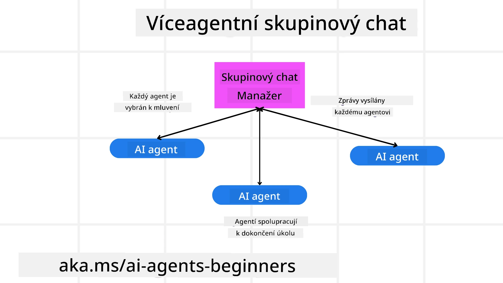
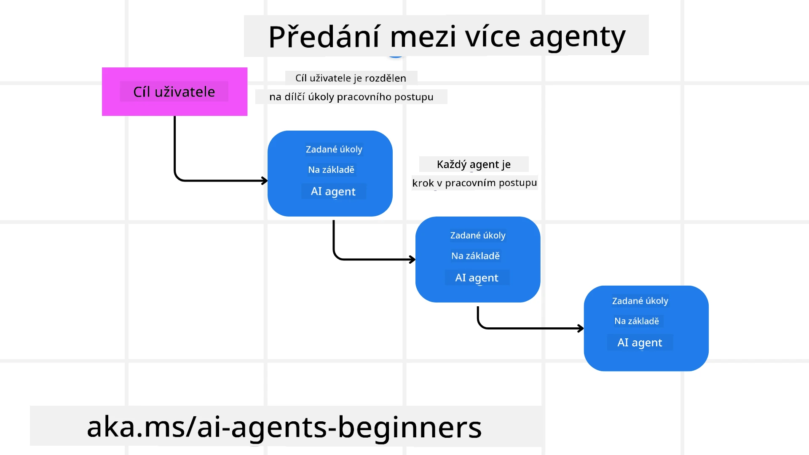
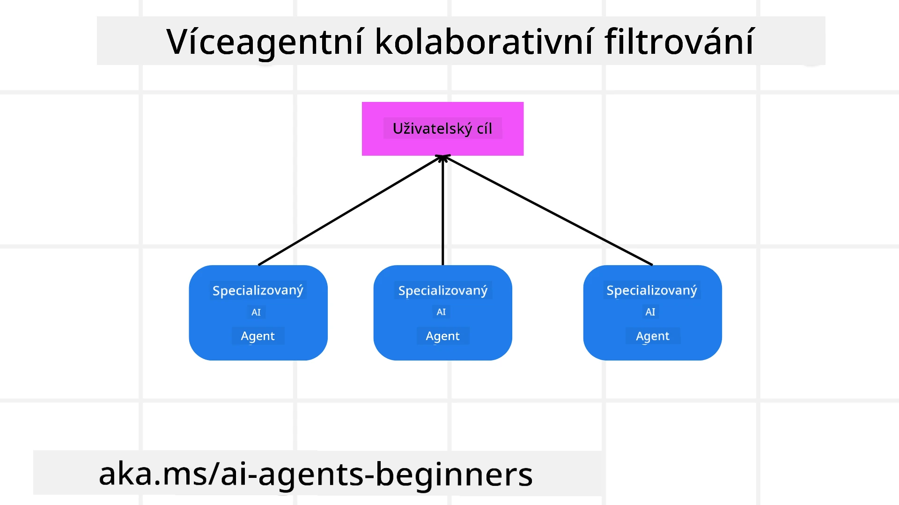

> _(Klikněte na obrázek výše pro zobrazení videa této lekce)_

# Multi-agentní návrhové vzory

Jakmile začnete pracovat na projektu zahrnujícím více agentů, budete muset zvážit multi-agentní návrhový vzor. Není však vždy ihned jasné, kdy přejít na multi-agenty a jaké jsou výhody.

## Úvod

V této lekci se snažíme odpovědět na následující otázky:

- Jaké scénáře jsou vhodné pro použití multi-agentů?
- Jaké jsou výhody používání multi-agentů oproti jednomu agentovi vykonávajícímu více úkolů?
- Jaké jsou stavební bloky implementace multi-agentního návrhového vzoru?
- Jak získáme přehled o interakcích mezi více agenty?

## Výukové cíle

Po této lekci byste měli být schopni:

- Identifikovat scénáře vhodné pro použití multi-agentů
- Rozpoznat výhody používání více agentů oproti jednomu agentovi.
- Pochopit stavební bloky implementace multi-agentního návrhového vzoru.

Jaký je širší přehled?

*Multi-agenti jsou návrhový vzor, který umožňuje více agentům spolupracovat na dosažení společného cíle.*

Tento vzor se široce používá v různých oblastech, včetně robotiky, autonomních systémů a distribuovaného výpočtu.

## Scénáře, kde jsou multi-agenti vhodní

Jaké scénáře jsou tedy vhodné pro použití multi-agentů? Odpověď je, že existuje mnoho scénářů, kde je využití více agentů prospěšné, zejména v následujících případech:

- **Velká pracovní zátěž**: Velké pracovní úkoly mohou být rozděleny na menší části a přiděleny různým agentům, což umožňuje paralelní zpracování a rychlejší dokončení. Příkladem je velký úkol zpracování dat.
- **Komplexní úkoly**: Komplexní úkoly, podobně jako velké pracovní zátěže, mohou být rozloženy do menších podúkolů a přiděleny agentům, kteří se specializují na konkrétní část úkolu. Dobrou ukázkou jsou autonomní vozidla, kde různí agenti spravují navigaci, detekci překážek a komunikaci s ostatními vozidly.
- **Různorodá odbornost**: Různí agenti mohou mít různorodou odbornost, což jim umožňuje efektivněji zvládat různé aspekty úkolu než jeden agent. Příkladem je zdravotnictví, kde agenti mohou spravovat diagnostiku, léčebné plány a sledování pacientů.

## Výhody používání multi-agentů oproti jednomu agentovi

Jednoagentní systém může fungovat dobře u jednoduchých úkolů, ale u složitějších úkolů může použití více agentů přinést několik výhod:

- **Specializace**: Každý agent může být specializovaný na konkrétní úkol. Nedostatek specializace u jednoho agenta znamená, že má agent schopný dělat všechno, ale může být zmatený, co dělat při složitém úkolu. Může například skončit přiřazením úkolu, pro který není nejvhodnější.
- **Škálovatelnost**: Je snazší škálovat systémy přidáním dalších agentů než přetížením jednoho agenta.
- **Odpornost vůči chybám**: Pokud jeden agent selže, ostatní mohou pokračovat ve fungování, čímž je zajištěna spolehlivost systému.

Uveďme příklad – rezervujeme cestu uživateli. Jednoagentní systém by musel zvládnout všechny aspekty rezervace cesty, od hledání letů přes rezervaci hotelů a pronájem aut. Aby to jeden agent zvládl, musel by mít nástroje pro všechny tyto úkoly, což by vedlo ke složitému a monolitickému systému, který je těžké udržovat a škálovat. Multi-agentní systém by naopak mohl mít různé agenty specializované na hledání letů, rezervaci hotelů a pronájem aut. To by učinilo systém modulárnějším, snazším na údržbu a škálovatelným.

Porovnejte to s cestovní kanceláří provozovanou jako rodinný obchod versus kanceláří fungující jako franšíza. Rodinný obchod by měl jednoho agenta ovládajícího všechny části procesu rezervace, zatímco franšíza by měla různé agenty ovládající různé části procesu.

## Stavební bloky implementace multi-agentního návrhového vzoru

Než budete moci implementovat multi-agentní návrhový vzor, musíte pochopit stavební bloky, které ho tvoří.

Uveďme si to konkrétně znovu na příkladu rezervace cesty pro uživatele. V tomto případě by stavební bloky zahrnovaly:

- **Komunikace agentů**: Agenti pro hledání letů, rezervaci hotelů a aut si musí komunikovat a sdílet informace o preferencích a omezeních uživatele. Musíte rozhodnout o protokolech a metodách této komunikace. Konkrétně to znamená, že agent pro hledání letů musí komunikovat s agentem pro rezervaci hotelů, aby zajistil rezervaci hotelu na stejné datum jako let. To znamená, že agenti si musí sdílet informace o cestovních datech uživatele, takže potřebujete rozhodnout *které agenti si informace sdílí a jak*.
- **Koordinační mechanismy**: Agenti musí koordinovat své činnosti, aby byly splněny preference a omezení uživatele. Preference uživatele může být, že chce hotel blízko letiště, zatímco omezení může být, že půjčovny aut jsou k dispozici jen na letišti. To znamená, že agent pro rezervaci hotelů musí koordinovat činnost s agentem pro půjčovnu aut, aby byly preference a omezení splněny. Musíte tedy rozhodnout *jak agenti koordinují své akce*.
- **Agentní architektura**: Agenti musí mít vnitřní strukturu umožňující rozhodování a učení se z interakcí s uživatelem. To znamená, že agent pro hledání letů musí mít interní strukturu, jež umožňuje rozhodovat o doporučovaných letech. Musíte rozhodnout *jak agenti rozhodují a učí se z interakcí s uživatelem*. Příkladem může být, že agent pro hledání letů využívá model strojového učení k doporučení letů na základě minulých preferencí uživatele.
- **Viditelnost do interakcí mezi agenty**: Musíte mít přehled o tom, jak si více agentů mezi sebou interaguje. Potřebujete nástroje a techniky pro sledování aktivit a interakcí agentů. Může to být formou logování a monitorování, vizualizačních nástrojů a metrik výkonu.
- **Multi-agentní vzory**: Existují různé vzory pro implementaci multi-agentních systémů, jako je centralizovaná, decentralizovaná a hybridní architektura. Musíte se rozhodnout pro vzor, který nejlépe vyhovuje vašemu případu použití.
- **Člověk v procesu**: Ve většině případů bude ve smyčce člověk a musíte agenty naučit, kdy požádat o lidský zásah. Může jít třeba o uživatele, který si vyžádá konkrétní hotel nebo let, které agenti nedoporučili, nebo o požadavek na potvrzení před rezervací letu či hotelu.

## Viditelnost do interakcí mezi agenty

Je důležité mít přehled o tom, jak si více agentů navzájem interaguje. Tento přehled je zásadní pro ladění, optimalizaci a zajištění efektivity celého systému. K dosažení toho potřebujete nástroje a techniky pro sledování aktivit a interakcí agentů. Může to být formou logování a monitorování, vizualizačních nástrojů a metrik výkonu.

Například při rezervaci cesty pro uživatele můžete mít dashboard, který ukazuje stav jednotlivých agentů, preference a omezení uživatele a interakce mezi agenty. Tento dashboard může zobrazovat data o cestovních datech uživatele, letech doporučených agentem pro lety, hotelech doporučených agentem pro hotely a autech doporučených agentem pro půjčovnu aut. To vám poskytne jasný přehled, jak agenti mezi sebou komunikují a zda jsou preference a omezení uživatele splněny.

Podívejme se podrobněji na jednotlivé aspekty.

- **Nástroje pro logování a monitorování**: Chcete zaznamenávat každou akci provedenou agentem. Záznam může obsahovat informace o agentovi, který akci provedl, o provedené akci, čase provedení a výsledku akce. Tyto informace pak mohou být použity pro ladění, optimalizaci a další.
- **Vizualizační nástroje**: Pomáhají vizualizovat interakce mezi agenty intuitivnějším způsobem. Například můžete mít graf ukazující tok informací mezi agenty, což vám pomůže odhalit úzká hrdla, neefektivity a další problémy v systému.
- **Výkonové metriky**: Pomáhají sledovat efektivitu multi-agentního systému. Můžete sledovat čas potřebný k dokončení úkolu, počet úkolů dokončených za jednotku času a přesnost doporučení agentů. Tyto informace vám mohou pomoci odhalit oblasti pro zlepšení a optimalizaci systému.

## Multi-agentní vzory

Pojďme se podívat na konkrétní vzory, které můžeme použít pro tvorbu multi-agentních aplikací. Zde je několik zajímavých vzorů, které stojí za zvážení:

### Skupinový chat

Tento vzor je užitečný, pokud chcete vytvořit aplikaci skupinového chatu, kde může více agentů mezi sebou komunikovat. Typické případy užití jsou týmová spolupráce, zákaznická podpora a sociální sítě.

V tomto vzoru každý agent představuje uživatele ve skupinovém chatu a zprávy se mezi agenty vyměňují pomocí komunikačního protokolu. Agenti mohou posílat zprávy do chatu, přijímat zprávy ze skupiny a reagovat na zprávy ostatních agentů.

Vzor lze implementovat centralizovanou architekturou, kde všechny zprávy procházejí centrálním serverem, nebo decentralizovanou architekturou, kde si zprávy agenty vyměňují přímo.

### Předávání úkolů

Tento vzor je vhodný, pokud chcete vytvořit aplikaci, kde si více agentů může předávat úkoly navzájem.

Typické případy užití zahrnují zákaznickou podporu, správu úkolů a automatizaci pracovních toků.

V tomto vzoru každý agent představuje úkol nebo krok v pracovním toku a agenti si mohou dle předem definovaných pravidel předávat úkoly.

### Kolaborativní filtrování

Tento vzor je vhodný, pokud chcete vytvořit aplikaci, kde může více agentů spolupracovat na tvorbě doporučení pro uživatele.

Proč chtít, aby agenti spolupracovali, je proto, že každý agent může mít jinou odbornost a může se na procesu doporučení podílet různými způsoby.

Uveďme příklad, kdy uživatel chce doporučení na nejlepší akcie k nákupu na burze.

- **Odborník na odvětví**: Jeden agent může být odborníkem na konkrétní odvětví.
- **Technická analýza**: Další agent může být odborníkem na technickou analýzu.
- **Fundamentální analýza**: A další agent může být odborníkem na fundamentální analýzu. Spoluprací tito agenti poskytnou uživateli komplexnější doporučení.

## Scénář: Proces vrácení peněz

Uvažujme scénář, kdy zákazník žádá o vrácení peněz za produkt. Může zde být zapojeno několik agentů, ale rozdělme je na agenty specifické pro tento proces a obecné agenty použitelné i jinde.

**Agenti specifickí pro proces vrácení peněz**:

Následující agenti by mohli být zapojeni do procesu vrácení:

- **Agent zákazníka**: Tento agent zastupuje zákazníka a zodpovídá za zahájení procesu vrácení peněz.
- **Agent prodejce**: Tento agent zastupuje prodejce a je zodpovědný za zpracování vrácení.
- **Agent platby**: Tento agent zastupuje platební proces a je zodpovědný za vrácení platby zákazníkovi.
- **Agent řešení**: Tento agent zastupuje proces řešení a zodpovídá za vyřešení případných problémů během procesu vrácení.
- **Agent souladu**: Tento agent dohlíží, zda proces vrácení odpovídá předpisům a politikám.

**Obecní agenti**:

Ti mohou být použiti i v jiných částech vašeho podnikání.

- **Agent dopravy**: Tento agent zastupuje proces dopravy a zodpovídá za zaslání produktu zpět prodejci. Lze jej použít jak při vrácení, tak i pro běžné zasílání produktů.
- **Agent zpětné vazby**: Tento agent reprezentuje sběr zpětné vazby od zákazníka. Zpětná vazba může přijít kdykoli, nejen během procesu vrácení.
- **Agent eskalace**: Tento agent zajišťuje eskalaci problémů na vyšší úroveň podpory. Tento typ agenta lze využít v jakémkoli procesu vyžadujícím eskalaci.
- **Agent notifikací**: Tento agent posílá upozornění zákazníkovi v různých fázích procesu vrácení.
- **Agent analýz**: Tento agent zpracovává a analyzuje data související s procesem vrácení.
- **Agent auditu**: Tento agent dohlíží na správné provedení procesu vrácení.
- **Agent reportingu**: Tento agent generuje zprávy o procesu vrácení.
- **Agent znalostí**: Tento agent spravuje znalostní bázi informací souvisejících s procesem vrácení, ale i dalšími částmi vašeho podnikání.
- **Agent bezpečnosti**: Tento agent dohlíží na bezpečnost procesu vrácení.
- **Agent kvality**: Tento agent zajišťuje kvalitu procesu vrácení.

Jak vidíte, je zde poměrně mnoho agentů zapojených jak do specifického procesu vrácení peněz, tak i agentů obecnějších. Snad vám to pomůže představit si, jak si můžete vybrat agenty pro váš multi-agentní systém.

## Zadání

Navrhněte multi-agentní systém pro proces zákaznické podpory. Identifikujte zapojené agenty, jejich role a odpovědnosti a jak vzájemně spolupracují. Zvažte jak agenty specifické pro proces zákaznické podpory, tak obecné agenty použitelné v jiných oblastech vašeho podnikání.
> Zamyslete se, než si přečtete následující řešení, možná budete potřebovat více agentů, než si myslíte.

> TIP: Zvažte různé fáze zákaznické podpory a také zvažte agenty potřebné pro jakýkoli systém.

## Řešení

[Řešení](./solution/solution.md)

## Kontroly znalostí

Otázka: Kdy byste měli zvážit použití více agentů?

- [ ] A1: Když máte malou pracovní zátěž a jednoduchý úkol.
- [ ] A2: Když máte velkou pracovní zátěž.
- [ ] A3: Když máte jednoduchý úkol.

[Kvíz ke řešení](./solution/solution-quiz.md)

## Shrnutí

V této lekci jsme se podívali na návrhový vzor více agentů, včetně scénářů, kdy je použití více agentů vhodné, výhod používání více agentů oproti jednomu agentovi, stavebních bloků implementace návrhového vzoru více agentů a jak získat přehled o tom, jak si jednotliví agenti vzájemně spolupracují.

### Máte více otázek ohledně návrhového vzoru více agentů?

Připojte se k [Microsoft Foundry Discord](https://aka.ms/ai-agents/discord), setkejte se s dalšími studenty, navštěvujte konzultační hodiny a nechte si zodpovědět své otázky týkající se AI agentů.

## Další zdroje

- <a href="https://learn.microsoft.com/azure/ai-services/agents/overview" target="_blank">Dokumentace Microsoft Agent Framework</a>
- <a href="https://www.analyticsvidhya.com/blog/2024/10/agentic-design-patterns/" target="_blank">Agentní návrhové vzory</a>

## Předchozí lekce

[Plánování návrhu](../07-planning-design/README.md)

## Následující lekce

[Metakognice u AI agentů](../09-metacognition/README.md)

---

<!-- CO-OP TRANSLATOR DISCLAIMER START -->
**Prohlášení o vyloučení odpovědnosti**:  
Tento dokument byl přeložen pomocí AI překladatelské služby [Co-op Translator](https://github.com/Azure/co-op-translator). Přestože se snažíme o co největší přesnost, mějte prosím na paměti, že automatizované překlady mohou obsahovat chyby nebo nepřesnosti. Originální dokument v jeho rodném jazyce by měl být považován za závazný zdroj. Pro důležité informace je doporučeno využít profesionální lidský překlad. Nebereme zodpovědnost za jakékoli nedorozumění nebo chybná vysvětlení vyplývající z použití tohoto překladu.
<!-- CO-OP TRANSLATOR DISCLAIMER END -->