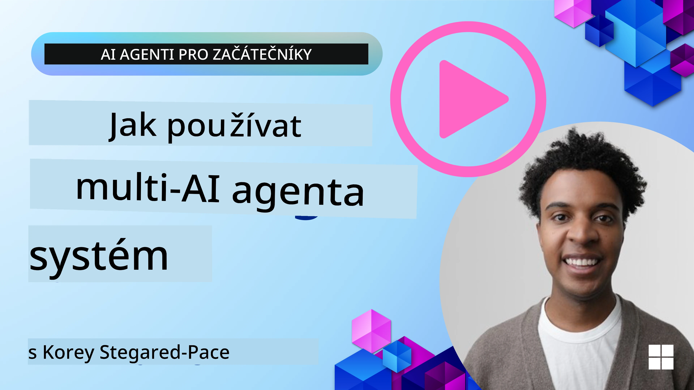
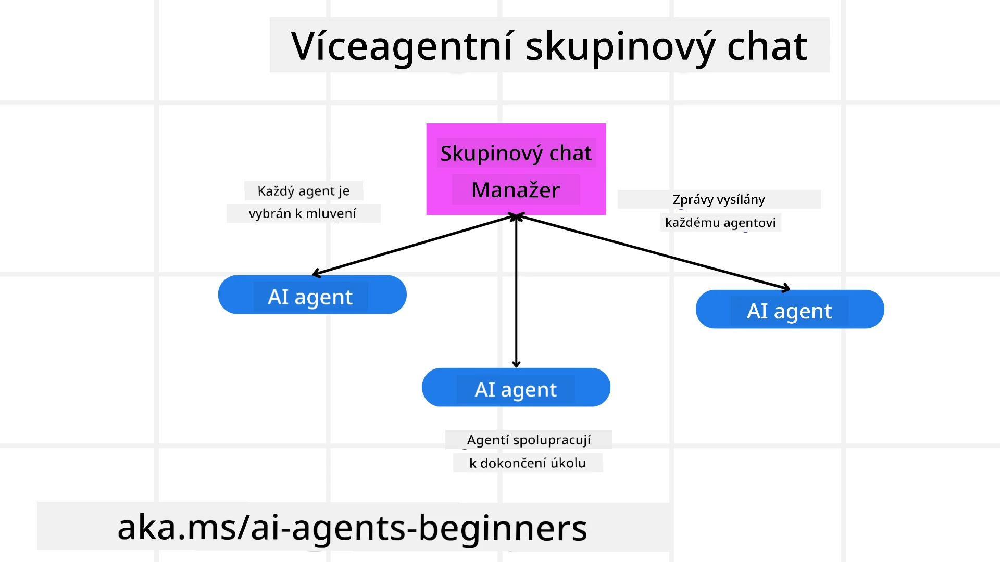
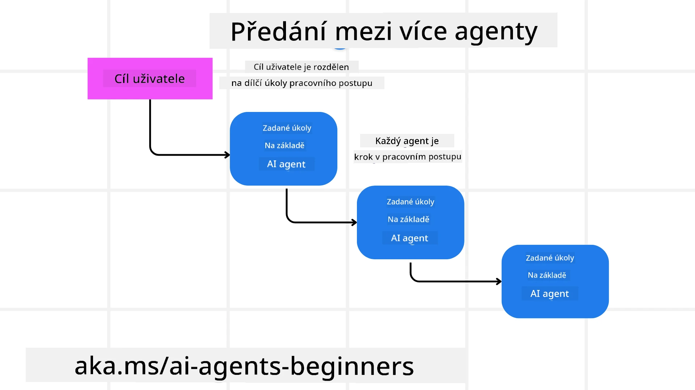
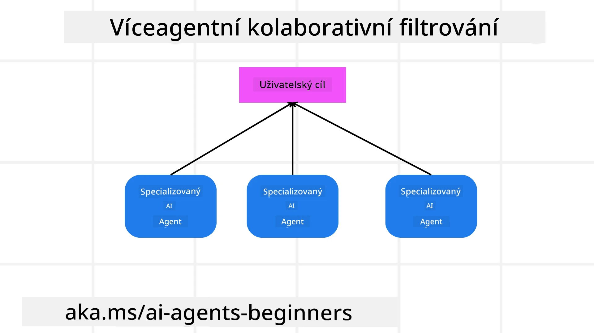

> _(Klikněte na obrázek výše pro zobrazení videa této lekce)_

# Multi-agentní návrhové vzory

Jakmile začnete pracovat na projektu, který zahrnuje více agentů, budete muset zvážit multi-agentní návrhový vzor. Není však vždy okamžitě jasné, kdy přejít na více agentů a jaké jsou výhody.

## Úvod

V této lekci se pokusíme odpovědět na následující otázky:

- Jaké scénáře jsou vhodné pro použití multi-agentů?
- Jaké jsou výhody používání více agentů oproti jednomu agentovi, který vykonává více úkolů?
- Jaké jsou stavební bloky implementace multi-agentního návrhového vzoru?
- Jak získáme přehled o tom, jak spolu více agentů vzájemně spolupracuje?

## Cíle učení

Po této lekci byste měli být schopni:

- Identifikovat scénáře, kde je použití multi-agentů vhodné
- Rozpoznat výhody používání více agentů oproti jedinému agentovi.
- Pochopit stavební bloky implementace multi-agentního návrhového vzoru.

Jaký je větší obrázek?

*Multi-agenční systémy jsou návrhovým vzorem, který umožňuje více agentům společně pracovat k dosažení společného cíle*.

Tento vzor je široce využíván v různých oblastech, včetně robotiky, autonomních systémů a distribuovaného výpočetnictví.

## Scénáře, kde jsou multi-agenti použitelní

V jakých scénářích je tedy dobré použít více agentů? Odpověď je, že existuje mnoho scénářů, kde je výhodné využít více agentů, zejména v následujících případech:

- **Velké pracovní zátěže**: Velké pracovní úkoly lze rozdělit na menší úkoly a přiřadit různým agentům, což umožňuje paralelní zpracování a rychlejší dokončení. Příkladem může být zpracování velkého množství dat.
- **Komplexní úkoly**: Komplexní úkoly, podobně jako velké pracovní zátěže, lze rozdělit na menší podúkoly a přiřadit různým agentům, z nichž každý se specializuje na určitou část úkolu. Dobrým příkladem je případ autonomních vozidel, kdy různí agenti spravují navigaci, detekci překážek a komunikaci s jinými vozidly.
- **Různorodé odbornosti**: Různí agenti mohou mít různorodé odbornosti, což jim umožňuje efektivněji řešit různé aspekty úkolu než jeden agent. Dobrým příkladem je zdravotnictví, kde agenti mohou spravovat diagnostiku, plány léčby a monitorování pacientů.

## Výhody používání multi-agentů oproti jedinému agentovi

Jednoagentní systém může fungovat dobře pro jednoduché úkoly, ale pro složitější úkoly může použití více agentů nabídnout několik výhod:

- **Specializace**: Každý agent může být specializován na konkrétní úkol. Nedostatek specializace u jednoho agenta znamená, že máte agenta, který umí všechno, ale může být zmatený, co má dělat při složitém úkolu. Může například skončit tím, že provede úkol, na který není nejvhodnější.
- **Škálovatelnost**: Je jednodušší škálovat systémy přidáváním více agentů než přetěžováním jediného agenta.
- **Odolnost vůči poruchám**: Pokud jeden agent selže, ostatní mohou pokračovat v činnosti, což zajišťuje spolehlivost systému.

Uveďme příklad - rezervujme výlet pro uživatele. Jednoagentní systém by musel řešit všechny aspekty procesu rezervace výletu, od hledání letu po rezervaci hotelů a půjčovny aut. Aby toho jeden agent dosáhl, potřeboval by nástroje pro všechny tyto úkoly, což může vést ke složitému a monolitickému systému, který je obtížně udržovatelný a škálovatelný. Multi-agentní systém by naproti tomu mohl mít různé agenty specializované na hledání letů, rezervaci hotelů a půjčovnu aut. To by systém učinilo modulárnějším, snadněji udržitelným a škálovatelným.

Porovnejte to s cestovní kanceláří provozovanou jako malý rodinný podnik oproti cestovní kanceláři provozované jako franšíza. Malý podnik by měl jediného agenta, který by řešil všechny aspekty rezervace výletu, zatímco franšíza by měla různé agenty, kteří řeší různé části procesu.

## Stavební bloky implementace multi-agentního návrhového vzoru

Před implementací multi-agentního návrhového vzoru musíte rozumět stavebním blokům, které tento vzor tvoří.

Učiňme to konkrétnější, opět se podívejme na příklad rezervace výletu pro uživatele. V tomto případě stavební bloky zahrnují:

- **Komunikace agentů**: Agent pro hledání letů, agent pro rezervaci hotelů a agent pro půjčovnu aut musí komunikovat a sdílet informace o preferencích a omezeních uživatele. Musíte rozhodnout o protokolech a metodách této komunikace. Konkrétně to znamená, že agent pro hledání letů musí komunikovat s agentem pro rezervaci hotelů, aby zajistil, že hotel je rezervován na stejné termíny jako let. To znamená, že agenti musí sdílet informace o datech cestování uživatele, tedy musíte rozhodnout *které agenti sdílejí informace a jak je sdílejí*.
- **Koordinační mechanismy**: Agenti musí koordinovat své akce tak, aby byly splněny preference a omezení uživatele. Například preference uživatele může být hotel blízko letiště, zatímco omezení může být, že půjčovny aut jsou k dispozici pouze na letišti. To znamená, že agent pro rezervaci hotelu musí koordinovat s agentem pro rezervaci půjčovny aut, aby zajistil splnění požadavků uživatele. Musíte tedy rozhodnout *jak agenti koordinují své akce*.
- **Architektura agenta**: Agenti musí mít interní strukturu, která jim umožní rozhodovat a učit se ze svých interakcí s uživatelem. To znamená, že agent pro hledání letů musí mít interní strukturu pro rozhodování o tom, které lety doporučit uživateli. Musíte rozhodnout *jak agenti rozhodují a učí se ze svých interakcí s uživatelem*. Příkladem učení a zlepšování může být agent pro hledání letů, který používá model strojového učení k doporučení letů na základě minulých preferencí uživatele.
- **Přehled o interakcích multi-agentů**: Musíte mít přehled o tom, jak více agentů vzájemně spolupracuje. To znamená, že potřebujete nástroje a techniky pro sledování aktivit a interakcí agentů. To může mít podobu nástrojů pro logování a monitorování, vizualizačních nástrojů a měření výkonu.
- **Multi-agentní vzory**: Existují různé vzory pro implementaci multi-agentních systémů, jako jsou centralizovaná, decentralizovaná a hybridní architektura. Musíte si vybrat vzor, který nejlépe odpovídá vašemu případu použití.
- **Člověk v cyklu**: Ve většině případů bude člověk v cyklu a je potřeba instrukce, kdy mají agenti požádat o lidský zásah. To může být například v případě, kdy uživatel žádá konkrétní hotel nebo let, které agenti neodporučili, nebo když žádají o potvrzení před rezervací letu nebo hotelu.

## Přehled o interakcích multi-agentů

Je důležité mít přehled o tom, jak více agentů vzájemně spolupracuje. Tento přehled je nezbytný pro ladění, optimalizaci a zajištění efektivity celého systému. Abyste toho dosáhli, potřebujete nástroje a techniky pro sledování aktivit a interakcí agentů. To může mít podobu nástrojů pro logování a monitorování, vizualizačních nástrojů a metrik výkonu.

Například v případě rezervace výletu pro uživatele můžete mít panel, který zobrazuje stav jednotlivých agentů, preference a omezení uživatele a interakce mezi agenty. Tento panel může ukazovat data o cestování uživatele, lety doporučené agentem pro lety, hotely doporučené agentem pro hotely a půjčovny aut doporučené agentem pro půjčovnu aut. To vám poskytne jasný přehled o tom, jak agenti spolupracují a zda jsou preference a omezení uživatele dodržena.

Podívejme se na tyto aspekty podrobněji.

- **Nástroje pro logování a monitorování**: Chcete mít zaznamenávány všechny akce, které agent provede. Záznam může obsahovat informace o agentu, který akci provedl, o provedené akci, o čase provedení a o výsledku akce. Tyto informace můžete používat pro ladění, optimalizaci a další účely.

- **Vizualizační nástroje**: Vizualizační nástroje vám mohou pomoci vidět interakce agentů intuitivněji. Například můžete mít graf, který ukazuje tok informací mezi agenty. To vám může pomoci identifikovat úzká hrdla, neefektivnosti a další problémy v systému.

- **Metriky výkonu**: Metriky výkonu vám mohou pomoci sledovat efektivitu multi-agentního systému. Můžete například sledovat čas potřebný k dokončení úkolu, počet úkolů dokončených za jednotku času a přesnost doporučení agentů. Tyto informace vám pomohou identifikovat oblasti pro zlepšení a optimalizovat systém.

## Multi-agentní vzory

Podívejme se na některé konkrétní vzory, které můžeme využít k vytvoření multi-agentních aplikací. Zde je několik zajímavých vzorů, které stojí za zvážení:

### Skupinový chat

Tento vzor je užitečný, když chcete vytvořit aplikaci skupinového chatu, kde může více agentů mezi sebou komunikovat. Typické scénáře pro tento vzor zahrnují týmovou spolupráci, zákaznickou podporu a sociální sítě.

V tomto vzoru každý agent představuje uživatele ve skupinovém chatu a zprávy se mezi agenty vyměňují pomocí komunikačního protokolu. Agenti mohou posílat zprávy do skupiny, přijímat zprávy ze skupiny a reagovat na zprávy od ostatních agentů.

Tento vzor lze implementovat pomocí centralizované architektury, kde jsou všechny zprávy směrovány přes centrální server, nebo decentralizované architektury, kde si agenti zprávy vyměňují přímo.

### Předání úkolu

Tento vzor je užitečný, když chcete vytvořit aplikaci, kde si mohou více agentů předávat úkoly.

Typické scénáře pro tento vzor zahrnují zákaznickou podporu, správu úkolů a automatizaci pracovních postupů.

V tomto vzoru každý agent představuje úkol nebo krok pracovního postupu a agenti si mohou na základě předem definovaných pravidel předávat úkoly.

### Kolaborativní filtrování

Tento vzor je užitečný, když chcete vytvořit aplikaci, kde více agentů spolupracuje na tvorbě doporučení pro uživatele.

Důvod, proč chcete, aby více agentů spolupracovalo, je ten, že každý agent může mít jinou odbornost a může přispívat k doporučovacímu procesu různými způsoby.

Uveďme příklad, kdy chce uživatel doporučení na nejlepší akcii k nákupu na burze.

- **Odborník na odvětví**: Jeden agent může být odborníkem na konkrétní odvětví.
- **Technická analýza**: Další agent může být expertem na technickou analýzu.
- **Fundamentální analýza**: A další agent může být expertem na fundamentální analýzu. Spoluprací mohou tito agenti uživateli poskytnout komplexnější doporučení.

## Scénář: Proces vrácení peněz

Představme si scénář, kdy zákazník žádá o vrácení peněz za produkt. V tomto procesu může být zapojeno několik agentů, ale rozdělme je na agenty specifické pro tento proces a obecné agenty, kteří mohou být použiti i v jiných procesech.

**Agenti specifickí pro proces vrácení peněz**:

Následující agenti by mohli být zapojeni do procesu vrácení peněz:

- **Agent zákazníka**: Tento agent představuje zákazníka a je zodpovědný za inicializaci procesu vrácení peněz.
- **Agent prodejce**: Tento agent představuje prodejce a je zodpovědný za zpracování vrácení peněz.
- **Agent plateb**: Tento agent zastupuje platební proces a je zodpovědný za vrácení prostředků zákazníkovi.
- **Agent řešení problémů**: Tento agent spravuje proces vyřešení jakýchkoliv problémů, které během vrácení mohou nastat.
- **Agent shody**: Tento agent dohlíží na to, že proces vrácení peněz je v souladu s předpisy a politikami.

**Obecní agenti**:

Tito agenti mohou být využíváni i v jiných částech vašeho podnikání.

- **Agent zásilky**: Tento agent spravuje proces dopravy produktu zpět prodejci. Tento agent lze použít jak pro proces vrácení peněz, tak i obecně pro dopravu produktů při nákupu.
- **Agent zpětné vazby**: Tento agent shromažďuje zpětnou vazbu od zákazníka. Zpětná vazba může být sbírána kdykoli, nejen během procesu vrácení.
- **Agent eskalace**: Tento agent zodpovídá za eskalaci problémů na vyšší úroveň podpory. Takový agent lze využít pro jakýkoliv proces, kde je potřeba eskalovat problém.
- **Agent notifikací**: Tento agent spravuje proces odesílání oznámení zákazníkovi v různých fázích procesu vrácení peněz.
- **Agent analýzy**: Tento agent analyzuje data týkající se procesu vrácení peněz.
- **Agent auditu**: Tento agent dohlíží na správnost provádění procesu vrácení peněz.
- **Agent reportování**: Tento agent generuje zprávy o procesu vrácení peněz.
- **Agent znalostí**: Tento agent spravuje databázi znalostí souvisejících s procesem vrácení peněz. Tento agent může mít znalosti nejen o vráceních, ale i o dalších částech vašeho podnikání.
- **Agent bezpečnosti**: Tento agent zabezpečuje proces vrácení peněz.
- **Agent kvality**: Tento agent dohlíží na kvalitu procesu vrácení peněz.

Výše uvedený seznam obsahuje celkem mnoho agentů, ať už specifických pro proces vrácení, tak i obecné agenty využitelné i jinde ve vašem podnikání. Doufejme, že vám to poskytlo představu, jak rozhodnout, které agenty použít ve vašem multi-agentním systému.

## Zadání úkolu

Navrhněte multi-agentní systém pro proces zákaznické podpory. Identifikujte agenty zapojené v procesu, jejich role a odpovědnosti a jak spolu navzájem komunikují. Zvažte jak agenty specifické pro proces zákaznické podpory, tak i obecné agenty, kteří mohou být využiti i v jiných částech vašeho podnikání.

> Zvažte to, než si přečtete následující řešení, možná budete potřebovat více agentů, než si myslíte.

> TIP: Zvažte různé fáze procesu zákaznické podpory a také zvažte agenty potřebné pro jakýkoli systém.

## Řešení

[Řešení](./solution/solution.md)

## Kontroly znalostí

### Otázka 1

Který scénář nejlépe odpovídá systému s více agenty?

- [ ] A1: Podpůrný bot odpovídá na běžné otázky pomocí jedné databáze znalostí a malého souboru nástrojů.
- [ ] A2: Proces vrácení peněz vyžaduje samostatné role pro podvod, platby a dodržování předpisů, každá s vlastními nástroji, a jejich výsledky musí být koordinovány.
- [ ] A3: Stejný jednoduchý požadavek na klasifikaci přichází tisícekrát za hodinu.

### Otázka 2

Kdy je obvykle lepší volbou jeden agent?

- [ ] A1: Úkol lze zvládnout jedním souborem pokynů a nástrojů bez předávání specialistům.
- [ ] A2: Agent má přístup k více než jednomu nástroji.
- [ ] A3: Pracovní postup vyžaduje samostatné role s různými oprávněními a nezávislými auditními trasami.

[Řešení kvízu](./solution/solution-quiz.md)

## Shrnutí

V této lekci jsme se podívali na návrhový vzor multi-agent, včetně scénářů, kdy jsou multi-agenti vhodní, výhod používání multi-agentů oproti jednému agentovi, stavebních bloků implementace návrhového vzoru multi-agent a jak mít přehled o tom, jak jednotliví agenti vzájemně interagují.

### Máte další otázky ohledně návrhového vzoru Multi-Agent?

Připojte se k [Microsoft Foundry Discord](https://discord.com/invite/ATgtXmAS5D) a setkejte se s ostatními studenty, účastněte se konzultačních hodin a získejte odpovědi na své otázky o AI agentech.

## Další zdroje

- <a href="https://learn.microsoft.com/azure/ai-services/agents/overview" target="_blank">Dokumentace Microsoft Agent Framework</a>
- <a href="https://www.analyticsvidhya.com/blog/2024/10/agentic-design-patterns/" target="_blank">Agentické návrhové vzory</a>

## Předchozí lekce

[Plánování návrhu](../07-planning-design/README.md)

## Další lekce

[Metakognice v AI agentech](../09-metacognition/README.md)

---

<!-- CO-OP TRANSLATOR DISCLAIMER START -->
**Prohlášení o omezení odpovědnosti**:
Tento dokument byl přeložen pomocí AI překladatelské služby [Co-op Translator](https://github.com/Azure/co-op-translator). Přestože usilujeme o co největší přesnost, mějte prosím na paměti, že automatizované překlady mohou obsahovat chyby nebo nepřesnosti. Originální dokument v jeho mateřském jazyce by měl být považován za autoritativní zdroj. Pro kritické informace se doporučuje profesionální lidský překlad. Nejsme odpovědní za jakékoli nedorozumění nebo nesprávné interpretace vzniklé použitím tohoto překladu.
<!-- CO-OP TRANSLATOR DISCLAIMER END -->