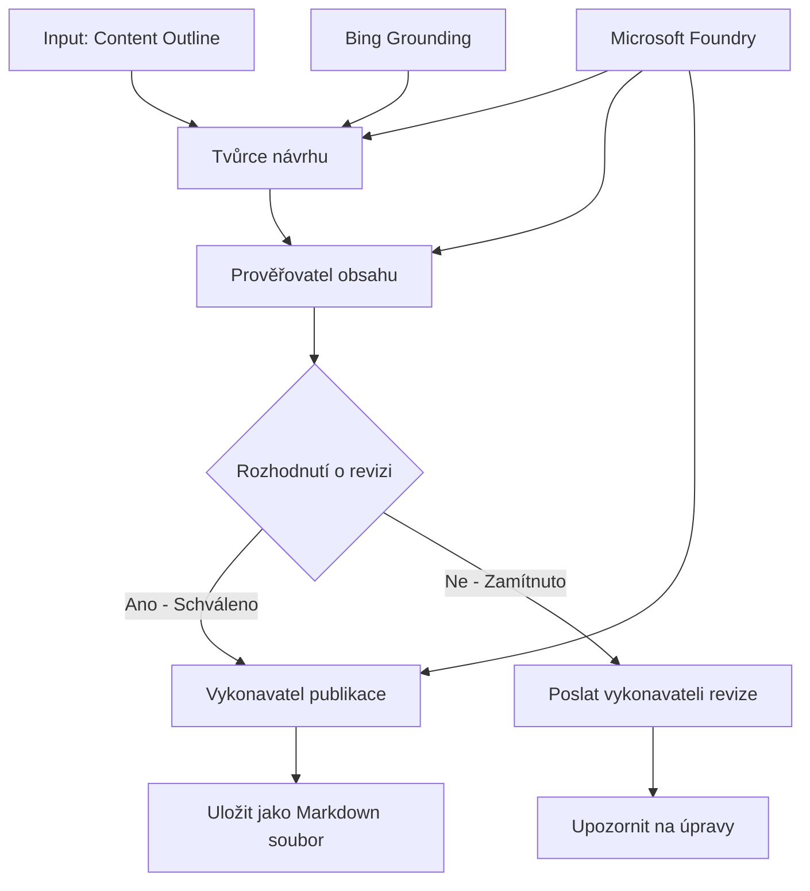

# 🔀 Podmíněné pracovní postupy agentů s Microsoft Foundry (.NET)

## 📋 Návod na inteligentní pracovní postupy založené na rozhodování

Tento notebook demonstruje **vzory podmíněných pracovních postupů** pomocí Microsoft Foundry a Microsoft Agent Framework pro .NET. Naučíte se, jak vytvořit sofistikované, rozhodováním řízené pracovní postupy, které inteligentně směrují zpracování na základě AI analýzy, obchodních pravidel a dynamických podmínek pro podnikové automatizace.

## 🎯 Cíle učení

### 🧠 **Architektura inteligentního rozhodování**
- **Implementace podmíněné logiky**: Vytvářejte komplexní rozhodovací stromy s více větveními
- **Směrování poháněné AI**: Používejte modely Microsoft Foundry pro inteligentní rozhodování o směrování
- **Dynamická adaptace pracovního postupu**: Upravujte chování pracovního postupu na základě analýzy a podmínek za běhu
- **Integrace podnikových pravidel**: Začleňte obchodní logiku a požadavky na shodu do pracovních postupů

### 🔀 **Pokročilé podmíněné vzory**
- **Vícekriteriální rozhodování**: Vyhodnocujte více faktorů pro rozhodnutí o směrování
- **Zpracování s kontextovým uvědoměním**: Rozhodujte na základě akumulovaného kontextu a historie pracovního postupu
- **Adaptivní úprava pracovního postupu**: Dynamicky přizpůsobujte cesty zpracování na základě aktuálních podmínek
- **Integrace pravidlových enginů**: Implementujte sofistikované obchodní pravidlové enginy v pracovních postupech

### 🏢 **Podnikové podmíněné aplikace**
- **Klasifikace a směrování dokumentů**: Automaticky klasifikujte a směrujte dokumenty do příslušných pracovních postupů
- **Triage zákaznického servisu**: Inteligentní směrování zákaznických dotazů na specializované týmy
- **Zpracování shody a rizik**: Používejte různé procesy ověřování a kontroly na základě hodnocení rizik
- **Pracovní postupy kontroly kvality**: Směrujte obsah vhodnými kontrolními procesy na základě metrik kvality

## ⚙️ Požadavky a nastavení

### 📦 **Požadované NuGet balíčky**

Pokročilé balíčky pro zpracování podmíněných pracovních postupů:

```xml
<!-- Core AI Framework -->
<PackageReference Include="Microsoft.Extensions.AI" Version="9.9.0" />

<!-- Azure AI Agents with Persistent State -->
<PackageReference Include="Azure.AI.Agents.Persistent" Version="1.2.0-beta.5" />

<!-- Azure Identity and Utilities -->
<PackageReference Include="Azure.Identity" Version="1.15.0" />
<PackageReference Include="System.Linq.Async" Version="6.0.3" />
<PackageReference Include="DotNetEnv" Version="3.1.1" />

<!-- Local Workflow Framework References -->
<!-- Microsoft.Agents.Workflows.dll - Advanced workflow orchestration -->
<!-- Microsoft.Agents.AI.AzureAI.dll - Microsoft Foundry integration -->
<!-- Microsoft.Agents.AI.dll - Core agent abstractions -->
```

### 🔑 **Konfigurace Microsoft Foundry**

**Požadované Azure zdroje:**
- Pracovní prostor Microsoft Foundry s modely pro podmíněné zpracování
- Azure předplatné s příslušnými kvótami výpočetních prostředků a oprávněními
- Nasazené AI modely pro rozhodování a analýzu obsahu
- (Volitelné) Připojení k Bing Search API pro založení znalostí

**Konfigurace prostředí (soubor .env):**
```env
# Microsoft Foundry Configuration
AZURE_AI_PROJECT_ENDPOINT=https://your-project.cognitiveservices.azure.com/
BING_CONNECTION_ID=your-bing-connection-id
```

**Nastavení ověřování:**
```csharp
// Azure CLI or Managed Identity authentication
using Azure.Identity;
var credential = new AzureCliCredential();

// Load environment configuration
DotNetEnv.Env.Load("../../../.env");
```

### 🏗️ **Architektura podmíněného pracovního postupu**



**Klíčové komponenty:**
- **Draft Executor**: AI agent, který vytváří počáteční návrhy obsahu z osnov
- **Content Review Executor**: AI agent, který hodnotí kvalitu návrhů a shodu
- **Podmíněné směrování**: Rozhodovací logika směrující na základě výsledků hodnocení
- **Cesty publikace/recenze**: Oddělené cesty zpracování pro schválený versus zamítnutý obsah
- **Správa stavu**: Udržuje kontext obsahu a hodnocení během celého pracovního postupu

## 🎨 **Vzory návrhu podmíněných pracovních postupů**

### 📋 **Produkce obsahu s kontrolními bránami kvality**
```
Outline → Draft Creation → Quality Review → {Approve: Publish | Reject: Revise}
```

### 🎯 **Zpracování dokumentů na základě rizik**
```
Document → Risk Assessment → {Low: Standard | High: Enhanced Review}
```

### 🔍 **Inteligentní směrování zákaznického servisu**
```
Customer Query → Analysis → {Simple: FAQ Bot | Complex: Human Agent}
```

### 💼 **Pracovní postupy řízené shodou**
```
Content → Compliance Check → {Pass: Publish | Fail: Legal Review}
```

## 🏢 **Podnikové výhody podmíněných pracovních postupů**

### 🎯 **Inteligentní automatizace**
- **Chytré rozhodování**: Směrování s podporou AI na základě analýzy obsahu a kontextu
- **Adaptivní zpracování**: Pracovní postupy, které se automaticky přizpůsobují měnícím se podmínkám
- **Prosazování obchodních pravidel**: Automatická aplikace složité obchodní logiky a politik
- **Směrování s uvědoměním kontextu**: Rozhodnutí založená na celé historii pracovního postupu a akumulovaném kontextu

### 📈 **Provozní excelence**
- **Optimalizované přidělování zdrojů**: Směrujte práci ke nejvhodnějším specialistům a procesům
- **Snížená manuální intervence**: Automatizované rozhodování minimalizuje potřebu lidského směrování
- **Rychlejší doba vyřešení**: Přímé směrování ke správným odborníkům a zpracovatelským schopnostem
- **Konzistentní aplikace**: Jednotná aplikace obchodních pravidel a rozhodovacích kritérií

### 🛡️ **Řízení rizik a shoda**
- **Automatizované hodnocení rizik**: AI hodnocení úrovně rizika obsahu a situace
- **Prosazování shody**: Automatické směrování skrze požadované regulační procesy
- **Aplikace bezpečnostních protokolů**: Zvýšená bezpečnost na základě hodnocení rizika
- **Údržba auditních stop**: Kompletní dokumentace rozhodnutí o směrování a jejich důvodů

### 📊 **Analytika a kontinuální zlepšování**
- **Analýza rozhodnutí**: Sledujte efektivitu a přesnost rozhodnutí o směrování
- **Rozpoznávání vzorů**: Identifikujte trendy a vzory v rozhodnutích o směrování v čase
- **Optimalizace výkonu**: Neustálé zlepšování rozhodovacích kritérií a efektivity směrování
- **Business Intelligence**: Přehledy o vlastnostech obsahu a požadavcích na zpracování

### 🔧 **Technická dokonalost**
- **Trvalé řízení stavu**: Udržujte složitý stav během běhu pracovního postupu
- **Škálovatelná architektura**: Zvládejte vysoké objemy podmíněných požadavků na zpracování
- **Integrační schopnosti**: Bezproblémová integrace s existujícími obchodními systémy a procesy
- **Monitorování a observabilita**: Komplexní sledování výkonu a rozhodnutí pracovního postupu

Postavme inteligentní, rozhodováním řízené podnikové pracovní postupy s .NET! 🚀

## 💻 Spuštění kódu

Kompletní implementace je dostupná v `04.dotnet-agent-framework-workflow-aifoundry-condition.cs`. Ukazuje **pracovní postup produkce obsahu s kontrolními bránami kvality**:

### 🏗️ **Architektura pracovního postupu**

```
Content Outline → Draft Creation → Quality Review → Conditional Routing:
                                                      ├─ Approved (>200 words) → Publish
                                                      └─ Rejected (<200 words) → Review Notification
```

**Agenti v pracovním postupu:**
1. **Evangelist Agent**: Vytváří návrhy návodů z osnov s Bing základnou
2. **Content Reviewer Agent**: Hodnotí kvalitu návrhů (počty slov, úplnost)
3. **Publisher Agent**: Ukládá schválený obsah jako časově označené Markdown soubory

**Vlastní exekutoři:**
1. **DraftExecutor**: Orchestrace vytváření návrhů
2. **ContentReviewExecutor**: Provádí hodnocení kvality
3. **PublishExecutor**: Zpracovává publikování schváleného obsahu
4. **SendReviewExecutor**: Řídí oznámení o zamítnutém obsahu

### 🚀 Spuštění příkladu

**Požadavky:**
- Nakonfigurovaný pracovní prostor Microsoft Foundry
- Azure CLI ověřování (`az login`)
- (Volitelné) připojení k Bing Search pro založení znalostí

```bash
# Nastavte skript jako spustitelný (Unix/Linux/macOS)
chmod +x 04.dotnet-agent-framework-workflow-aifoundry-condition.cs

# Spusťte podmíněný workflow
./04.dotnet-agent-framework-workflow-aifoundry-condition.cs
```

Nebo na Windows:
```powershell
dotnet run 04.dotnet-agent-framework-workflow-aifoundry-condition.cs
```

### 📝 Očekávaný výstup

Pracovní postup:
1. **Vytvoří agenty**: Inicializuje tři specializované Microsoft Foundry agenty
2. **Vygeneruje návrh**: Evangelist agent vytvoří návrh návodu z osnovy
3. **Zhodnotí obsah**: Content Reviewer provede hodnocení kvality návrhu
4. **Podmíněné směrování**:
   - **Pokud schváleno (>200 slov)**: Publish executor uloží jako Markdown soubor
   - **Pokud zamítnuto (<200 slov)**: Odeslat oznámení o revizi
5. **Zobrazí výsledky**: Ukáže konečný výsledek pracovního postupu

### 🔧 Možnosti přizpůsobení

**Změna kritérií hodnocení:**
```csharp
const string ContentReviewerInstructions = @"
You are a content reviewer...
1. Check if content is more than 500 words (instead of 200)
2. Verify technical accuracy
3. Ensure proper formatting
...";
```

**Přidání dalších podmíněných cest:**
```csharp
var workflow = new WorkflowBuilder(draftExecutor)
    .AddEdge(draftExecutor, contentReviewerExecutor)
    .AddEdge(contentReviewerExecutor, publishExecutor, condition: GetCondition("Excellent"))
    .AddEdge(contentReviewerExecutor, editExecutor, condition: GetCondition("Good"))
    .AddEdge(contentReviewerExecutor, sendReviewerExecutor, condition: GetCondition("Poor"))
    .Build();
```

**Změna požadavků na obsah:**
```csharp
string OUTLINE_Content = @"
# Your Custom Topic
## Section 1
https://your-reference-url
## Section 2
...
";
```

### 🎯 Aplikace v reálném světě

Tento vzor podmíněného pracovního postupu je ideální pro:
- **Systémy správy obsahu**: Automatizované redakční procesy s kontrolními bránami kvality
- **Zpracování dokumentů**: Směřování dokumentů podle klasifikace a shody
- **Zákaznická podpora**: Inteligentní směrování tiketů podle složitosti a naléhavosti
- **Právní kontrola**: Směrování smluv podle hodnocení rizika a hodnoty
- **HR procesy**: Směrování žádostí přes vhodné screeningové pracovní postupy

### 🔍 Porozumění podmíněné logice

**Funkce podmínky:**
```csharp
public Func<object?, bool> GetCondition(string expectedResult) =>
    reviewResult => reviewResult is ReviewResult review && review.Result == expectedResult;
```

Tato funkce vytváří predikát, který:
1. Kontroluje, zda je výsledek typu `ReviewResult`
2. Porovnává vlastnost `Result` s očekávanou hodnotou
3. Vrací true/false pro určení směrování

**Hrany pracovního postupu s podmínkami:**
```csharp
.AddEdge(contentReviewerExecutor, publishExecutor, condition: GetCondition("Yes"))
.AddEdge(contentReviewerExecutor, sendReviewerExecutor, condition: GetCondition("No"))
```

### 📊 Pokročilé funkce

**Validace JSON schématu:**
Pracovní postup používá JSON schémata pro zajištění strukturovaných odpovědí:

```csharp
// Define response structure
public class ReviewResult
{
    [JsonPropertyName("review_result")]
    public string Result { get; set; } = string.Empty;
    
    [JsonPropertyName("reason")]
    public string Reason { get; set; } = string.Empty;
    
    [JsonPropertyName("draft_content")]
    public string DraftContent { get; set; } = string.Empty;
}

// Apply to agent
ResponseFormat = ChatResponseFormat.ForJsonSchema(
    AIJsonUtilities.CreateJsonSchema(typeof(ReviewResult)), 
    "ReviewResult", 
    "Review Result From DraftContent"
)
```

**Integrace Bing Grounding:**
Evangelist agent využívá Bing grounding pro přístup k aktuálním informacím:

```csharp
var bingGroundingConfig = new BingGroundingSearchConfiguration(bing_conn_id);
BingGroundingToolDefinition bingGroundingTool = new(
    new BingGroundingSearchToolParameters([bingGroundingConfig])
);
```

To umožňuje agentovi sledovat URL v osnově a získávat aktuální informace.

### 🛡️ Zpracování chyb

Pracovní postup obsahuje robustní zpracování chyb pro zamítnutý obsah:
- Selhání při hodnocení aktivují alternativní cestu
- Oznámení poskytují jasné důvody zamítnutí
- Obsah je zachován pro revizi

### 🔄 Rozšíření pracovního postupu

**Přidání smyčky revize:**
Vytvořte zpětnou vazbu, která automaticky přepracuje obsah:

```csharp
.AddEdge(contentReviewerExecutor, publishExecutor, condition: GetCondition("Yes"))
.AddEdge(contentReviewerExecutor, draftExecutor, condition: GetCondition("No")) // Loop back
```

**Implementace vícestupňové revize:**
Přidejte několik fází hodnocení s různými kritérii:

```csharp
.AddEdge(draftExecutor, technicalReviewer)
.AddEdge(technicalReviewer, editorialReviewer, condition: GetCondition("TechPass"))
.AddEdge(editorialReviewer, publishExecutor, condition: GetCondition("EditPass"))
```

Tento vzor podmíněného pracovního postupu poskytuje základ pro konstrukci sofistikovaných, inteligentních podnikových automatizačních systémů! 🚀

---

<!-- CO-OP TRANSLATOR DISCLAIMER START -->
**Prohlášení o omezení odpovědnosti**:
Tento dokument byl přeložen pomocí AI překladatelské služby [Co-op Translator](https://github.com/Azure/co-op-translator). Přestože usilujeme o co největší přesnost, mějte prosím na paměti, že automatizované překlady mohou obsahovat chyby nebo nepřesnosti. Originální dokument v jeho mateřském jazyce by měl být považován za autoritativní zdroj. Pro kritické informace se doporučuje profesionální lidský překlad. Nejsme odpovědní za jakékoli nedorozumění nebo nesprávné interpretace vzniklé použitím tohoto překladu.
<!-- CO-OP TRANSLATOR DISCLAIMER END -->