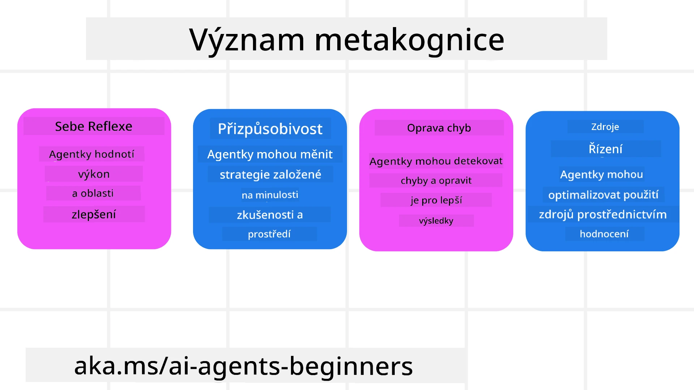
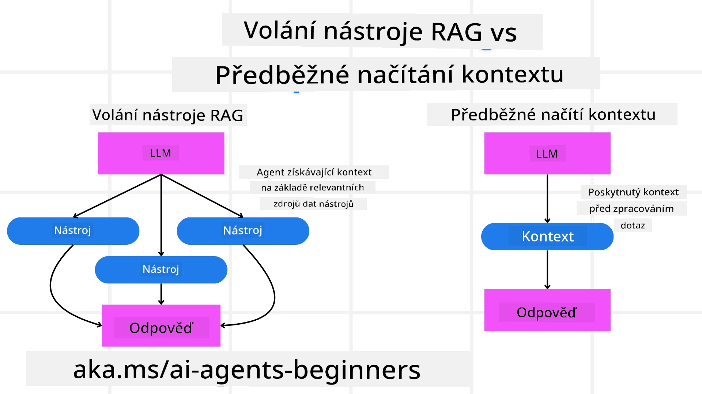

[](https://youtu.be/His9R6gw6Ec?si=3_RMb8VprNvdLRhX)

> _(Kliknutím na obrázek výše zobrazíte video k této lekci)_
# Metakognice u AI agentů

## Úvod

Vítejte u lekce o metakognici u AI agentů! Tato kapitola je určena pro začátečníky, kteří se zajímají o to, jak mohou AI agenti přemýšlet o svých vlastních myšlenkových procesech. Na konci této lekce porozumíte klíčovým konceptům a budete vybaveni praktickými příklady pro aplikaci metakognice při návrhu AI agentů.

## Vzdělávací cíle

Po dokončení této lekce budete schopni:

1. Pochopit důsledky smyček uvažování v definicích agentů.
2. Použít plánovací a hodnotící techniky k podpoře samoopravujících se agentů.
3. Vytvořit vlastní agenty schopné manipulovat s kódem k dosažení úkolů.

## Úvod do metakognice

Metakognice označuje kognitivní procesy vyššího řádu, které zahrnují přemýšlení o vlastním myšlení. Pro AI agenty to znamená schopnost hodnotit a upravovat své akce na základě sebeuvědomění a minulých zkušeností. Metakognice, neboli „přemýšlení o přemýšlení“, je důležitý koncept ve vývoji agentních AI systémů. Zahrnuje to, že AI systémy si uvědomují své vlastní vnitřní procesy a dokážou sledovat, regulovat a přizpůsobovat své chování podle toho. Podobně jako když my vnímáme situaci v místnosti nebo přemýšlíme nad problémem. Toto sebeuvědomění může AI systémům pomoci činit lepší rozhodnutí, identifikovat chyby a časem zlepšovat svůj výkon – opět navazující na Turingův test a debatu o tom, zda AI převezme kontrolu.

V kontextu agentních AI systémů může metakognice pomoci řešit několik výzev, například:
- Transparentnost: Zajištění, že AI systémy dokážou vysvětlit své uvažování a rozhodnutí.
- Uvažování: Zlepšení schopnosti AI systémů syntetizovat informace a činit rozumná rozhodnutí.
- Adaptace: Umožnění AI systémům přizpůsobit se novým prostředím a měnícím se podmínkám.
- Vnímání: Zvýšení přesnosti AI systémů při rozpoznávání a interpretaci dat z jejich okolí.

### Co je metakognice?

Metakognice, neboli „přemýšlení o přemýšlení“, je kognitivní proces vyššího řádu, který zahrnuje sebeuvědomění a seberegulaci vlastních kognitivních procesů. V oblasti AI metakognice umožňuje agentům hodnotit a přizpůsobovat své strategie a akce, což vede ke zlepšení schopností řešit problémy a činit rozhodnutí. Porozuměním metakognici můžete navrhovat AI agenty, kteří nejsou jen chytřejší, ale také adaptabilnější a efektivnější. V pravé metakognici byste viděli AI, jak explicitně uvažuje o svém vlastním uvažování.

Příklad: „Dával jsem přednost levnějším letům, protože… mohl bych ale postrádat přímé lety, tak to raději znovu zkontroluji.“
Sledování toho, jak nebo proč zvolil určitou trasu.
- Uvědomování si, že udělal chyby, protože při rozhodování příliš spoléhal na preference uživatele z minula, a tak upravuje svou strategii rozhodování, nejen konečné doporučení.
- Diagnostika vzorců jako například: „Kdykoliv uživatel zmíní ‚příliš přeplněno‘, neměl bych jen odstraňovat určitá místa, ale také reflektovat, že můj způsob výběru ‚top atrakcí‘ je chybný, pokud vždy řadím podle popularity.“

### Význam metakognice u AI agentů

Metakognice hraje zásadní roli při návrhu AI agentů z několika důvodů:



- Sebereflexe: Agenti mohou hodnotit svůj výkon a identifikovat oblasti ke zlepšení.
- Přizpůsobivost: Agenti mohou upravovat své strategie na základě minulých zkušeností a měnících se podmínek.
- Oprava chyb: Agenti mohou autonomně detekovat a opravovat chyby, což vede k přesnějším výsledkům.
- Správa zdrojů: Agenti mohou optimalizovat využití zdrojů, jako je čas a výpočetní výkon, plánováním a hodnocením svých akcí.

## Složky AI agenta

Než se pustíme do metakognitivních procesů, je důležité pochopit základní složky AI agenta. AI agent obvykle sestává z:

- Persona: Osobnost a charakteristiky agenta, které určují, jak komunikuje s uživateli.
- Nástroje: Schopnosti a funkce, které agent může vykonávat.
- Dovednosti: Znalosti a odbornosti, které agent disponuje.

Tyto složky společně tvoří „jednotku odbornosti“, která může vykonávat konkrétní úkoly.

**Příklad**:
Představte si cestovního agenta, službu agenta, která nejen plánuje vaši dovolenou, ale také upravuje svůj plán na základě aktuálních dat a zkušeností z předchozích cest zákazníků.

### Příklad: Metakognice u cestovního agenta

Představte si, že navrhujete cestovního agenta poháněného AI. Tento agent „Cestovní agent“ pomáhá uživatelům plánovat jejich dovolenou. Aby začlenil metakognici, musí Cestovní agent hodnotit a upravovat své akce na základě sebeuvědomění a minulých zkušeností. Zde je, jak může metakognice hrát roli:

#### Aktuální úkol

Aktuální úkol je pomoci uživateli naplánovat cestu do Paříže.

#### Kroky k dokončení úkolu

1. **Shromáždit preference uživatele**: Zeptat se uživatele na cestovní data, rozpočet, zájmy (například muzea, kuchyně, nakupování) a jakékoli specifické požadavky.
2. **Získat informace**: Vyhledat možnosti letů, ubytování, atrakcí a restaurací odpovídajících preferencím uživatele.
3. **Vytvořit doporučení**: Poskytnout personalizovaný itinerář s detaily o letech, rezervacích hotelů a navržených aktivitách.
4. **Upravit na základě zpětné vazby**: Zeptat se uživatele na zpětnou vazbu ohledně doporučení a provést potřebné úpravy.

#### Potřebné zdroje

- Přístup k databázím letů a hotelových rezervací.
- Informace o pařížských atrakcích a restauracích.
- Data o zpětné vazbě uživatele z předchozích interakcí.

#### Zkušenosti a sebereflexe

Cestovní agent používá metakognici k hodnocení svého výkonu a učení se z minulých zkušeností. Například:

1. **Analýza zpětné vazby uživatele**: Cestovní agent přezkoumává zpětnou vazbu uživatele, aby určil, která doporučení byla dobře přijata a která ne. Podle toho upravuje budoucí návrhy.
2. **Přizpůsobivost**: Pokud uživatel dříve zmínil, že nemá rád přeplněná místa, Cestovní agent v budoucnu nebude doporučovat oblíbená turistická místa během špičky.
3. **Oprava chyb**: Pokud Cestovní agent udělal chybu v předchozí rezervaci, například navrhl hotel, který byl plně obsazený, naučí se důkladněji kontrolovat dostupnost před dalším doporučením.

#### Praktický příklad pro vývojáře

Zde je zjednodušený příklad kódu Travel Agenta s implementací metakognice:

```python
class Travel_Agent:
    def __init__(self):
        self.user_preferences = {}
        self.experience_data = []

    def gather_preferences(self, preferences):
        self.user_preferences = preferences

    def retrieve_information(self):
        # Vyhledávejte lety, hotely a atrakce podle preferencí
        flights = search_flights(self.user_preferences)
        hotels = search_hotels(self.user_preferences)
        attractions = search_attractions(self.user_preferences)
        return flights, hotels, attractions

    def generate_recommendations(self):
        flights, hotels, attractions = self.retrieve_information()
        itinerary = create_itinerary(flights, hotels, attractions)
        return itinerary

    def adjust_based_on_feedback(self, feedback):
        self.experience_data.append(feedback)
        # Analyzujte zpětnou vazbu a upravte budoucí doporučení
        self.user_preferences = adjust_preferences(self.user_preferences, feedback)

# Příklad použití
travel_agent = Travel_Agent()
preferences = {
    "destination": "Paris",
    "dates": "2025-04-01 to 2025-04-10",
    "budget": "moderate",
    "interests": ["museums", "cuisine"]
}
travel_agent.gather_preferences(preferences)
itinerary = travel_agent.generate_recommendations()
print("Suggested Itinerary:", itinerary)
feedback = {"liked": ["Louvre Museum"], "disliked": ["Eiffel Tower (too crowded)"]}
travel_agent.adjust_based_on_feedback(feedback)
```

#### Proč je metakognice důležitá

- **Sebereflexe**: Agenti mohou analyzovat svůj výkon a identifikovat oblasti ke zlepšení.
- **Přizpůsobivost**: Agenti mohou upravovat strategie na základě zpětné vazby a měnících se podmínek.
- **Oprava chyb**: Agenti mohou autonomně detekovat a opravovat chyby.
- **Správa zdrojů**: Agenti mohou optimalizovat využití zdrojů, jako je čas a výpočetní výkon.

Začleněním metakognice může Cestovní agent poskytovat personalizovanější a přesnější doporučení, což zlepšuje celkový uživatelský zážitek.

---

## 2. Plánování u agentů

Plánování je klíčovou součástí chování AI agenta. Zahrnuje vymezení kroků potřebných k dosažení cíle s ohledem na aktuální stav, zdroje a možné překážky.

### Prvky plánování

- **Aktuální úkol**: Jasně definujte úkol.
- **Kroky k dokončení úkolu**: Rozdělte úkol na zvládnutelné kroky.
- **Potřebné zdroje**: Identifikujte nezbytné zdroje.
- **Zkušenosti**: Využijte minulé zkušenosti k informování plánování.

**Příklad**:
Zde jsou kroky, které musí Cestovní agent podniknout, aby efektivně pomohl uživateli naplánovat cestu:

### Kroky pro Cestovního agenta

1. **Shromáždit preference uživatele**
   - Zeptejte se uživatele na podrobnosti o cestovních datech, rozpočtu, zájmech a jakékoliv specifické požadavky.
   - Příklady: „Kdy plánujete cestovat?“ „Jaký máte rozpočet?“ „Jaké aktivity na dovolené preferujete?“

2. **Získat informace**
   - Vyhledat relevantní cestovní možnosti na základě preferencí uživatele.
   - **Lety**: Hledat dostupné lety v rámci rozpočtu a preferovaných cestovních dat uživatele.
   - **Ubytování**: Najít hotely nebo pronájmy odpovídající preferencím uživatele ohledně lokality, ceny a vybavení.
   - **Atrakcí a restaurace**: Identifikovat populární atrakce, aktivity a stravovací možnosti, které odpovídají zájmům uživatele.

3. **Vytvořit doporučení**
   - Sestavit získané informace do personalizovaného itineráře.
   - Poskytnout podrobnosti jako možnosti letů, rezervace hotelů a navržené aktivity, s ohledem na preference uživatele.

4. **Prezentovat itinerář uživateli**
   - Sdílet navržený itinerář s uživatelem k jeho zhodnocení.
   - Příklad: „Zde je navržený itinerář vaší cesty do Paříže. Obsahuje detaily letů, hotelové rezervace a seznam doporučených aktivit a restaurací. Dejte mi vědět, co si myslíte!“

5. **Sbírat zpětnou vazbu**
   - Zeptat se uživatele na zpětnou vazbu ohledně navrženého itineráře.
   - Příklady: „Líbí se vám možnosti letů?“ „Je hotel vhodný pro vaše potřeby?“ „Existují nějaké aktivity, které chcete přidat nebo odebrat?“

6. **Upravit na základě zpětné vazby**
   - Upravte itinerář podle uživatelské zpětné vazby.
   - Proveďte potřebné změny v doporučeních letu, ubytování a aktivit, aby lépe odpovídaly preferencím uživatele.

7. **Finální potvrzení**
   - Předložte aktualizovaný itinerář uživateli k finálnímu potvrzení.
   - Příklad: „Provedl jsem úpravy podle vaší zpětné vazby. Zde je aktualizovaný itinerář. Vypadá to pro vás v pořádku?“

8. **Rezervace a potvrzení**
   - Po schválení itineráře uživatelem pokračujte v rezervaci letů, ubytování a předem naplánovaných aktivit.
   - Zašlete uživateli potvrzovací detaily.

9. **Poskytování průběžné podpory**
   - Zůstaňte k dispozici pro pomoc uživateli s jakýmikoli změnami nebo doplňujícími požadavky před i během cesty.
   - Příklad: „Pokud budete během cesty potřebovat další pomoc, neváhejte mě kdykoli kontaktovat!“

### Příklad interakce

```python
class Travel_Agent:
    def __init__(self):
        self.user_preferences = {}
        self.experience_data = []

    def gather_preferences(self, preferences):
        self.user_preferences = preferences

    def retrieve_information(self):
        flights = search_flights(self.user_preferences)
        hotels = search_hotels(self.user_preferences)
        attractions = search_attractions(self.user_preferences)
        return flights, hotels, attractions

    def generate_recommendations(self):
        flights, hotels, attractions = self.retrieve_information()
        itinerary = create_itinerary(flights, hotels, attractions)
        return itinerary

    def adjust_based_on_feedback(self, feedback):
        self.experience_data.append(feedback)
        self.user_preferences = adjust_preferences(self.user_preferences, feedback)

# Příklad použití v rámci požadavku na rezervaci
travel_agent = Travel_Agent()
preferences = {
    "destination": "Paris",
    "dates": "2025-04-01 to 2025-04-10",
    "budget": "moderate",
    "interests": ["museums", "cuisine"]
}
travel_agent.gather_preferences(preferences)
itinerary = travel_agent.generate_recommendations()
print("Suggested Itinerary:", itinerary)
feedback = {"liked": ["Louvre Museum"], "disliked": ["Eiffel Tower (too crowded)"]}
travel_agent.adjust_based_on_feedback(feedback)
```

## 3. Korektivní RAG systém

Nejprve začněme pochopením rozdílu mezi RAG nástrojem a předběžným načítáním kontextu.



### Retrieval-Augmented Generation (RAG)

RAG kombinuje systém vyhledávání s generativním modelem. Když je zadán dotaz, systém vyhledávání získá relevantní dokumenty nebo data z externího zdroje a tyto získané informace se použijí k rozšíření vstupu generativního modelu. To pomáhá modelu generovat přesnější a kontextově vhodné odpovědi.

V systému RAG agent získává relevantní informace z databáze znalostí a používá je k tvorbě vhodných odpovědí nebo akcí.

### Korektivní RAG přístup

Korektivní RAG přístup se zaměřuje na použití RAG technik k opravě chyb a zlepšení přesnosti AI agentů. To zahrnuje:

1. **Technika podnětů**: Použití specifických podnětů k vedení agenta při vyhledávání relevantních informací.
2. **Nástroj**: Implementaci algoritmů a mechanismů, které agentovi umožní hodnotit relevanci získaných informací a generovat přesné odpovědi.
3. **Hodnocení**: Neustálé hodnocení výkonu agenta a provádění úprav k zlepšení jeho přesnosti a efektivity.

#### Příklad: Korektivní RAG u vyhledávacího agenta

Uvažujme vyhledávacího agenta, který získává informace z webu, aby odpovídal na dotazy uživatelů. Korektivní RAG přístup by mohl zahrnovat:

1. **Technika podnětů**: Formulování vyhledávacích dotazů na základě uživatelského vstupu.
2. **Nástroj**: Použití algoritmů zpracování přirozeného jazyka a strojového učení k řazení a filtrování výsledků vyhledávání.
3. **Hodnocení**: Analyzování zpětné vazby uživatele, identifikace a korekce nepřesností v získaných informacích.

### Korektivní RAG u cestovního agenta

Korektivní RAG (Retrieval-Augmented Generation) zlepšuje schopnosti AI získávat a generovat informace a zároveň opravovat nepřesnosti. Podívejme se, jak může Cestovní agent využít korektivní RAG přístup k poskytování přesnějších a relevantnějších cestovních doporučení.

To zahrnuje:

- **Technika podnětů:** Použití specifických podnětů k vedení agenta při získávání relevantních informací.
- **Nástroj:** Implementaci algoritmů a mechanismů, které agentovi umožňují hodnotit relevanci získaných informací a generovat přesné odpovědi.
- **Hodnocení:** Neustálé posuzování výkonu agenta a provádění úprav k zlepšení jeho přesnosti a efektivity.

#### Kroky k implementaci korektivního RAG u cestovního agenta

1. **Počáteční interakce s uživatelem**
   - Cestovní agent sbírá počáteční preference uživatele, jako jsou destinace, cestovní data, rozpočet a zájmy.
   - Příklad:

     ```python
     preferences = {
         "destination": "Paris",
         "dates": "2025-04-01 to 2025-04-10",
         "budget": "moderate",
         "interests": ["museums", "cuisine"]
     }
     ```

2. **Získávání informací**
   - Cestovní agent získává informace o letech, ubytování, atrakcích a restauracích na základě preferencí uživatele.
   - Příklad:

     ```python
     flights = search_flights(preferences)
     hotels = search_hotels(preferences)
     attractions = search_attractions(preferences)
     ```

3. **Generování počátečních doporučení**
   - Cestovní agent používá získané informace k vytvoření personalizovaného itineráře.
   - Příklad:

     ```python
     itinerary = create_itinerary(flights, hotels, attractions)
     print("Suggested Itinerary:", itinerary)
     ```

4. **Sbírání zpětné vazby uživatele**
   - Cestovní agent žádá uživatele o zpětnou vazbu k počátečním doporučením.
   - Příklad:

     ```python
     feedback = {
         "liked": ["Louvre Museum"],
         "disliked": ["Eiffel Tower (too crowded)"]
     }
     ```

5. **Korektivní RAG proces**
   - **Technika podnětů**: Cestovní agent formuluje nové vyhledávací dotazy na základě uživatelské zpětné vazby.
     - Příklad:

       ```python
       if "disliked" in feedback:
           preferences["avoid"] = feedback["disliked"]
       ```

   - **Nástroj**: Cestovní agent používá algoritmy k řazení a filtrování nových výsledků vyhledávání s důrazem na relevanci na základě zpětné vazby uživatele.
     - Příklad:

       ```python
       new_attractions = search_attractions(preferences)
       new_itinerary = create_itinerary(flights, hotels, new_attractions)
       print("Updated Itinerary:", new_itinerary)
       ```

   - **Hodnocení**: Cestovní agent průběžně hodnotí relevanci a přesnost svých doporučení analýzou zpětné vazby uživatele a prováděním nutných úprav.
     - Příklad:

       ```python
       def adjust_preferences(preferences, feedback):
           if "liked" in feedback:
               preferences["favorites"] = feedback["liked"]
           if "disliked" in feedback:
               preferences["avoid"] = feedback["disliked"]
           return preferences

       preferences = adjust_preferences(preferences, feedback)
       ```

#### Praktický příklad

Zde je zjednodušený příklad v Pythonu začleňující korektivní RAG přístup u cestovního agenta:

```python
class Travel_Agent:
    def __init__(self):
        self.user_preferences = {}
        self.experience_data = []

    def gather_preferences(self, preferences):
        self.user_preferences = preferences

    def retrieve_information(self):
        flights = search_flights(self.user_preferences)
        hotels = search_hotels(self.user_preferences)
        attractions = search_attractions(self.user_preferences)
        return flights, hotels, attractions

    def generate_recommendations(self):
        flights, hotels, attractions = self.retrieve_information()
        itinerary = create_itinerary(flights, hotels, attractions)
        return itinerary

    def adjust_based_on_feedback(self, feedback):
        self.experience_data.append(feedback)
        self.user_preferences = adjust_preferences(self.user_preferences, feedback)
        new_itinerary = self.generate_recommendations()
        return new_itinerary

# Příklad použití
travel_agent = Travel_Agent()
preferences = {
    "destination": "Paris",
    "dates": "2025-04-01 to 2025-04-10",
    "budget": "moderate",
    "interests": ["museums", "cuisine"]
}
travel_agent.gather_preferences(preferences)
itinerary = travel_agent.generate_recommendations()
print("Suggested Itinerary:", itinerary)
feedback = {"liked": ["Louvre Museum"], "disliked": ["Eiffel Tower (too crowded)"]}
new_itinerary = travel_agent.adjust_based_on_feedback(feedback)
print("Updated Itinerary:", new_itinerary)
```

### Předběžné načítání kontextu


Pre-emptivní načítání kontextu zahrnuje načtení relevantního kontextu nebo základních informací do modelu před zpracováním dotazu. To znamená, že model má k těmto informacím přístup od začátku, což mu může pomoci generovat informovanější odpovědi, aniž by musel během procesu získávat další data.

Zde je zjednodušený příklad, jak by mohlo vypadat pre-emptivní načítání kontextu pro aplikaci cestovní kanceláře v Pythonu:

```python
class TravelAgent:
    def __init__(self):
        # Přednačíst oblíbené destinace a jejich informace
        self.context = {
            "Paris": {"country": "France", "currency": "Euro", "language": "French", "attractions": ["Eiffel Tower", "Louvre Museum"]},
            "Tokyo": {"country": "Japan", "currency": "Yen", "language": "Japanese", "attractions": ["Tokyo Tower", "Shibuya Crossing"]},
            "New York": {"country": "USA", "currency": "Dollar", "language": "English", "attractions": ["Statue of Liberty", "Times Square"]},
            "Sydney": {"country": "Australia", "currency": "Dollar", "language": "English", "attractions": ["Sydney Opera House", "Bondi Beach"]}
        }

    def get_destination_info(self, destination):
        # Načíst informace o destinaci z přednačteného kontextu
        info = self.context.get(destination)
        if info:
            return f"{destination}:\nCountry: {info['country']}\nCurrency: {info['currency']}\nLanguage: {info['language']}\nAttractions: {', '.join(info['attractions'])}"
        else:
            return f"Sorry, we don't have information on {destination}."

# Příklad použití
travel_agent = TravelAgent()
print(travel_agent.get_destination_info("Paris"))
print(travel_agent.get_destination_info("Tokyo"))
```

#### Vysvětlení

1. **Inicializace (metoda `__init__`)**: Třída `TravelAgent` přednačte slovník obsahující informace o populárních cílových místech, jako jsou Paříž, Tokio, New York a Sydney. Tento slovník zahrnuje detaily jako země, měna, jazyk a hlavní atrakce každého místa.

2. **Získávání informací (metoda `get_destination_info`)**: Když uživatel položí otázku o konkrétním cíli, metoda `get_destination_info` načte relevantní informace ze přednačteného slovníku kontextu.

Přednačtením kontextu může aplikace cestovní kanceláře rychle odpovídat na dotazy uživatelů, aniž by musela v reálném čase získávat tyto informace z externího zdroje. To činí aplikaci efektivnější a schopnější rychlé odezvy.

### Inicializace plánu s cílem před iterací

Inicializace plánu s cílem znamená začít s jasným cílem nebo požadovaným výsledkem na paměti. Definováním tohoto cíle předem může model použít tento cíl jako průvodní princip během iterativního procesu. To pomáhá zajistit, aby se každá iterace přibližovala dosažení požadovaného výsledku, čímž proces činí efektivnějším a soustředěnějším.

Zde je příklad, jak můžete inicializovat cestovní plán s cílem před iterací pro cestovní kancelář v Pythonu:

### Scénář

Cestovní kancelář chce naplánovat na míru připravenou dovolenou pro klienta. Cílem je vytvořit cestovní itinerář maximalizující spokojenost klienta na základě jeho preferencí a rozpočtu.

### Kroky

1. Definovat preference klienta a rozpočet.
2. Inicializovat počáteční plán na základě těchto preferencí.
3. Iterovat pro vylepšení plánu optimalizací spokojenosti klienta.

#### Python kód

```python
class TravelAgent:
    def __init__(self, destinations):
        self.destinations = destinations

    def bootstrap_plan(self, preferences, budget):
        plan = []
        total_cost = 0

        for destination in self.destinations:
            if total_cost + destination['cost'] <= budget and self.match_preferences(destination, preferences):
                plan.append(destination)
                total_cost += destination['cost']

        return plan

    def match_preferences(self, destination, preferences):
        for key, value in preferences.items():
            if destination.get(key) != value:
                return False
        return True

    def iterate_plan(self, plan, preferences, budget):
        for i in range(len(plan)):
            for destination in self.destinations:
                if destination not in plan and self.match_preferences(destination, preferences) and self.calculate_cost(plan, destination) <= budget:
                    plan[i] = destination
                    break
        return plan

    def calculate_cost(self, plan, new_destination):
        return sum(destination['cost'] for destination in plan) + new_destination['cost']

# Příklad použití
destinations = [
    {"name": "Paris", "cost": 1000, "activity": "sightseeing"},
    {"name": "Tokyo", "cost": 1200, "activity": "shopping"},
    {"name": "New York", "cost": 900, "activity": "sightseeing"},
    {"name": "Sydney", "cost": 1100, "activity": "beach"},
]

preferences = {"activity": "sightseeing"}
budget = 2000

travel_agent = TravelAgent(destinations)
initial_plan = travel_agent.bootstrap_plan(preferences, budget)
print("Initial Plan:", initial_plan)

refined_plan = travel_agent.iterate_plan(initial_plan, preferences, budget)
print("Refined Plan:", refined_plan)
```

#### Vysvětlení kódu

1. **Inicializace (metoda `__init__`)**: Třída `TravelAgent` je inicializována s listem potenciálních destinací, z nichž každá má atributy jako název, cena a typ aktivity.

2. **Inicializace plánu (metoda `bootstrap_plan`)**: Tato metoda vytváří počáteční cestovní plán na základě preferencí klienta a rozpočtu. Prochází seznam destinací a přidává je do plánu, pokud odpovídají preferencím klienta a vejdou se do rozpočtu.

3. **Porovnání preferencí (metoda `match_preferences`)**: Tato metoda ověřuje, zda destinace odpovídá preferencím klienta.

4. **Iterace plánu (metoda `iterate_plan`)**: Tato metoda zdokonaluje počáteční plán tím, že se snaží nahradit každou destinaci v plánu lepší shodou, přičemž bere v úvahu preference klienta a omezení rozpočtu.

5. **Výpočet ceny (metoda `calculate_cost`)**: Tato metoda vypočítává celkové náklady aktuálního plánu včetně potenciální nové destinace.

#### Příklad použití

- **Počáteční plán**: Cestovní kancelář vytvoří počáteční plán na základě preferencí klienta pro památky a rozpočtu 2000 $.
- **Vylepšený plán**: Cestovní kancelář iteruje plán, optimalizuje podle preferencí klienta a rozpočtu.

Inicializací plánu s jasným cílem (např. maximalizace spokojenosti klienta) a iterativním zdokonalováním může cestovní kancelář vytvořit přizpůsobený a optimalizovaný cestovní itinerář pro klienta. Tento přístup zajišťuje, že cestovní plán odpovídá preferencím a rozpočtu klienta od samého začátku a s každou iterací se zlepšuje.

### Využití LLM pro přeřazení a hodnocení

Velké jazykové modely (LLM) lze použít k přeřazení a hodnocení tím, že vyhodnocují relevanci a kvalitu získaných dokumentů nebo generovaných odpovědí. Funguje to takto:

**Získávání:** Počáteční krok získání vyhledá sadu kandidátních dokumentů nebo odpovědí na základě dotazu.

**Přeřazení:** LLM vyhodnotí tyto kandidáty a přeřadí je podle relevance a kvality. Tento krok zajišťuje, že nejrelevantnější a nejkvalitnější informace jsou prezentovány jako první.

**Hodnocení:** LLM přiřadí skóre každému kandidátovi, které odráží jejich relevanci a kvalitu. To pomáhá vybrat nejlepší odpověď nebo dokument pro uživatele.

Využitím LLM pro přeřazení a hodnocení systém může poskytovat přesnější a kontextově relevantnější informace, což zlepšuje celkový zážitek uživatele.

Zde je příklad, jak může cestovní kancelář použít Velký jazykový model (LLM) k přeřazení a hodnocení cestovních destinací na základě uživatelských preferencí v Pythonu:

#### Scénář - Cestování podle preferencí

Cestovní kancelář chce doporučit nejlepší destinace klientovi na základě jeho preferencí. LLM pomůže přeřadit a ohodnotit destinace, aby bylo zajištěno, že nejrelevantnější možnosti jsou předloženy.

#### Kroky:

1. Shromáždit uživatelské preference.
2. Získat seznam potenciálních cestovních destinací.
3. Použít LLM k přeřazení a ohodnocení destinací na základě preferencí uživatele.

Zde je, jak můžete aktualizovat předchozí příklad pro použití Azure OpenAI Services:

#### Požadavky

1. Musíte mít předplatné Azure.
2. Vytvořte zdroj Azure OpenAI a získejte svůj API klíč.

#### Příklad Python kódu

```python
import requests
import json

class TravelAgent:
    def __init__(self, destinations):
        self.destinations = destinations

    def get_recommendations(self, preferences, api_key, endpoint):
        # Vygenerujte výzvu pro Azure OpenAI
        prompt = self.generate_prompt(preferences)
        
        # Definujte hlavičky a obsah pro požadavek
        headers = {
            'Content-Type': 'application/json',
            'Authorization': f'Bearer {api_key}'
        }
        payload = {
            "prompt": prompt,
            "max_tokens": 150,
            "temperature": 0.7
        }
        
        # Zavolejte Azure OpenAI API pro získání přeskupených a ohodnocených destinací
        response = requests.post(endpoint, headers=headers, json=payload)
        response_data = response.json()
        
        # Extrahujte a vraťte doporučení
        recommendations = response_data['choices'][0]['text'].strip().split('\n')
        return recommendations

    def generate_prompt(self, preferences):
        prompt = "Here are the travel destinations ranked and scored based on the following user preferences:\n"
        for key, value in preferences.items():
            prompt += f"{key}: {value}\n"
        prompt += "\nDestinations:\n"
        for destination in self.destinations:
            prompt += f"- {destination['name']}: {destination['description']}\n"
        return prompt

# Ukázka použití
destinations = [
    {"name": "Paris", "description": "City of lights, known for its art, fashion, and culture."},
    {"name": "Tokyo", "description": "Vibrant city, famous for its modernity and traditional temples."},
    {"name": "New York", "description": "The city that never sleeps, with iconic landmarks and diverse culture."},
    {"name": "Sydney", "description": "Beautiful harbour city, known for its opera house and stunning beaches."},
]

preferences = {"activity": "sightseeing", "culture": "diverse"}
api_key = 'your_azure_openai_api_key'
endpoint = 'https://your-endpoint.com/openai/deployments/your-deployment-name/completions?api-version=2022-12-01'

travel_agent = TravelAgent(destinations)
recommendations = travel_agent.get_recommendations(preferences, api_key, endpoint)
print("Recommended Destinations:")
for rec in recommendations:
    print(rec)
```

#### Vysvětlení kódu – Preference Booker

1. **Inicializace**: Třída `TravelAgent` je inicializována se seznamem potenciálních cestovních destinací, z nichž každá má atributy, jako je název a popis.

2. **Získávání doporučení (metoda `get_recommendations`)**: Tato metoda generuje prompt pro službu Azure OpenAI na základě uživatelských preferencí a provede HTTP POST požadavek na Azure OpenAI API, aby získala přeřazené a ohodnocené destinace.

3. **Generování promptu (metoda `generate_prompt`)**: Tato metoda vytváří prompt pro Azure OpenAI, který obsahuje uživatelské preference a seznam destinací. Prompt vede model k přeřazení a ohodnocení destinací podle zadaných preferencí.

4. **Volání API**: Knihovna `requests` je použita k provedení HTTP POST požadavku na endpoint Azure OpenAI API. Odpověď obsahuje přeřazené a ohodnocené destinace.

5. **Příklad použití**: Cestovní kancelář shromáždí uživatelské preference (např. zájem o památky a různorodou kulturu) a použije službu Azure OpenAI k získání přeřazených a ohodnocených doporučení na cestovní destinace.

Nezapomeňte nahradit `your_azure_openai_api_key` svým skutečným API klíčem Azure OpenAI a `https://your-endpoint.com/...` skutečnou URL adresou vašeho Azure OpenAI nasazení.

Využitím LLM pro přeřazení a hodnocení může cestovní kancelář poskytovat personalizovanější a relevantnější cestovní doporučení klientům a zlepšit tak jejich celkový zážitek.

### RAG: Technika promptování vs Nástroj

Retrieval-Augmented Generation (RAG) může být jak technikou promptování, tak nástrojem při vývoji AI agentů. Pochopení rozdílu mezi nimi vám může pomoci efektivněji využít RAG ve vašich projektech.

#### RAG jako technika promptování

**Co to je?**

- Jako technika promptování RAG zahrnuje formulaci specifických dotazů nebo promptů k vedení vyhledávání relevantních informací z velkého korpusu nebo databáze. Tyto informace se pak používají k generování odpovědí nebo akcí.

**Jak to funguje:**

1. **Formulace promptů**: Vytvoření dobře strukturovaných promptů nebo dotazů na základě úkolu či vstupu uživatele.
2. **Získání informací**: Použití promptů k vyhledání relevantních dat z předexistující databáze znalostí nebo datasetu.
3. **Generování odpovědi**: Kombinace získaných informací s generativními AI modely za účelem vytvoření komplexní a koherentní odpovědi.

**Příklad v cestovní kanceláři**:

- Uživatelský vstup: "Chci navštívit muzea v Paříži."
- Prompt: "Najdi nejlepší muzea v Paříži."
- Získané informace: Detaily o Louvru, Musée d'Orsay apod.
- Vygenerovaná odpověď: "Zde jsou nejlepší muzea v Paříži: Louvre, Musée d'Orsay a Centre Pompidou."

#### RAG jako nástroj

**Co to je?**

- Jako nástroj je RAG integrovaný systém, který automatizuje proces získávání a generování, což vývojářům usnadňuje implementaci složitých AI funkcionalit bez nutnosti ručního vytváření promptů pro každý dotaz.

**Jak to funguje:**

1. **Integrace**: Začlenění RAG do architektury AI agenta, umožňující automatické zpracování úkolů získávání a generování.
2. **Automatizace**: Nástroj spravuje celý proces od přijetí uživatelského vstupu po generování finální odpovědi, bez potřeby explicitních promptů pro každý krok.
3. **Efektivita**: Zlepšuje výkon agenta zjednodušením procesu získávání a generování, umožňující rychlejší a přesnější odpovědi.

**Příklad v cestovní kanceláři**:

- Uživatelský vstup: "Chci navštívit muzea v Paříži."
- RAG nástroj: Automaticky získá informace o muzeích a vygeneruje odpověď.
- Vygenerovaná odpověď: "Zde jsou nejlepší muzea v Paříži: Louvre, Musée d'Orsay a Centre Pompidou."

### Porovnání

| Aspekt                 | Technika promptování                                   | Nástroj                                              |
|------------------------|--------------------------------------------------------|------------------------------------------------------|
| **Ruční vs Automatické** | Ruční formulace promptů pro každý dotaz.              | Automatizovaný proces získávání a generování.        |
| **Kontrola**            | Nabízí větší kontrolu nad procesem získávání.          | Zjednodušuje a automatizuje získávání a generování. |
| **Flexibilita**         | Umožňuje přizpůsobené prompty dle specifických potřeb. | Efektivnější pro rozsáhlé implementace.             |
| **Složitost**            | Vyžaduje tvorbu a ladění promptů.                      | Snazší integrace v architektuře AI agenta.           |

### Praktické příklady

**Příklad techniky promptování:**

```python
def search_museums_in_paris():
    prompt = "Find top museums in Paris"
    search_results = search_web(prompt)
    return search_results

museums = search_museums_in_paris()
print("Top Museums in Paris:", museums)
```

**Příklad nástroje:**

```python
class Travel_Agent:
    def __init__(self):
        self.rag_tool = RAGTool()

    def get_museums_in_paris(self):
        user_input = "I want to visit museums in Paris."
        response = self.rag_tool.retrieve_and_generate(user_input)
        return response

travel_agent = Travel_Agent()
museums = travel_agent.get_museums_in_paris()
print("Top Museums in Paris:", museums)
```

### Hodnocení relevance

Hodnocení relevance je klíčový aspekt výkonu AI agenta. Zajišťuje, že informace získané a generované agentem jsou vhodné, přesné a užitečné pro uživatele. Prozkoumejme, jak hodnotit relevanci v AI agentech včetně praktických příkladů a technik.

#### Klíčové koncepty hodnocení relevance

1. **Vědomí kontextu**:
   - Agent musí rozumět kontextu dotazu uživatele, aby získal a generoval relevantní informace.
   - Příklad: Pokud uživatel žádá o "nejlepší restaurace v Paříži", agent by měl zvážit preference uživatele, jako je typ kuchyně a rozpočet.

2. **Přesnost**:
   - Informace poskytnuté agentem by měly být fakticky správné a aktuální.
   - Příklad: Doporučení aktuálně otevřených restaurací s dobrými recenzemi spíše než zastaralých nebo zavřených možností.

3. **Úmysl uživatele**:
   - Agent by měl vyvodit úmysl uživatele za dotazem, aby poskytl co nejrelevantnější informace.
   - Příklad: Pokud uživatel žádá o "hotely vhodné pro rozpočet", agent by měl upřednostnit cenově dostupné možnosti.

4. **Zpětná vazba**:
   - Neustálé sbírání a analýza uživatelské zpětné vazby pomáhá agentovi zdokonalovat proces hodnocení relevance.
   - Příklad: Začlenění hodnocení a zpětné vazby uživatelů na předchozí doporučení pro zlepšení budoucích odpovědí.

#### Praktické techniky hodnocení relevance

1. **Skórování relevance**:
   - Přidělit skóre relevance každé získané položce na základě toho, jak dobře odpovídá dotazu a preferencím uživatele.
   - Příklad:

     ```python
     def relevance_score(item, query):
         score = 0
         if item['category'] in query['interests']:
             score += 1
         if item['price'] <= query['budget']:
             score += 1
         if item['location'] == query['destination']:
             score += 1
         return score
     ```

2. **Filtrování a řazení**:
   - Odfiltrovat nerelevantní položky a zbývající seřadit podle skóre relevance.
   - Příklad:

     ```python
     def filter_and_rank(items, query):
         ranked_items = sorted(items, key=lambda item: relevance_score(item, query), reverse=True)
         return ranked_items[:10]  # Vrátit top 10 relevantních položek
     ```

3. **Zpracování přirozeného jazyka (NLP)**:
   - Použít NLP techniky pro pochopení dotazu uživatele a získání relevantních informací.
   - Příklad:

     ```python
     def process_query(query):
         # Použijte NLP k extrakci klíčových informací z dotazu uživatele
         processed_query = nlp(query)
         return processed_query
     ```

4. **Integrace uživatelské zpětné vazby**:
   - Sbírat zpětnou vazbu uživatele na poskytnutá doporučení a použít ji k úpravě budoucích hodnocení relevance.
   - Příklad:

     ```python
     def adjust_based_on_feedback(feedback, items):
         for item in items:
             if item['name'] in feedback['liked']:
                 item['relevance'] += 1
             if item['name'] in feedback['disliked']:
                 item['relevance'] -= 1
         return items
     ```

#### Příklad: Hodnocení relevance v cestovní kanceláři

Zde je praktický příklad, jak může cestovní kancelář hodnotit relevanci cestovních doporučení:

```python
class Travel_Agent:
    def __init__(self):
        self.user_preferences = {}
        self.experience_data = []

    def gather_preferences(self, preferences):
        self.user_preferences = preferences

    def retrieve_information(self):
        flights = search_flights(self.user_preferences)
        hotels = search_hotels(self.user_preferences)
        attractions = search_attractions(self.user_preferences)
        return flights, hotels, attractions

    def generate_recommendations(self):
        flights, hotels, attractions = self.retrieve_information()
        ranked_hotels = self.filter_and_rank(hotels, self.user_preferences)
        itinerary = create_itinerary(flights, ranked_hotels, attractions)
        return itinerary

    def filter_and_rank(self, items, query):
        ranked_items = sorted(items, key=lambda item: self.relevance_score(item, query), reverse=True)
        return ranked_items[:10]  # Vrátit 10 nejrelevantnějších položek

    def relevance_score(self, item, query):
        score = 0
        if item['category'] in query['interests']:
            score += 1
        if item['price'] <= query['budget']:
            score += 1
        if item['location'] == query['destination']:
            score += 1
        return score

    def adjust_based_on_feedback(self, feedback, items):
        for item in items:
            if item['name'] in feedback['liked']:
                item['relevance'] += 1
            if item['name'] in feedback['disliked']:
                item['relevance'] -= 1
        return items

# Příklad použití
travel_agent = Travel_Agent()
preferences = {
    "destination": "Paris",
    "dates": "2025-04-01 to 2025-04-10",
    "budget": "moderate",
    "interests": ["museums", "cuisine"]
}
travel_agent.gather_preferences(preferences)
itinerary = travel_agent.generate_recommendations()
print("Suggested Itinerary:", itinerary)
feedback = {"liked": ["Louvre Museum"], "disliked": ["Eiffel Tower (too crowded)"]}
updated_items = travel_agent.adjust_based_on_feedback(feedback, itinerary['hotels'])
print("Updated Itinerary with Feedback:", updated_items)
```

### Vyhledávání s úmyslem

Vyhledávání s úmyslem znamená porozumění a interpretaci základního účelu nebo cíle dotazu uživatele za účelem získání a generování co nejrelevantnějších a nejpřínosnějších informací. Tento přístup jde nad rámec prostého shody klíčových slov a zaměřuje se na pochopení skutečných potřeb a kontextu uživatele.

#### Klíčové koncepty vyhledávání s úmyslem

1. **Porozumění úmyslu uživatele**:
   - Úmysl uživatele lze rozdělit do tří hlavních typů: informační, navigační a transakční.
     - **Informační úmysl**: Uživatel hledá informace o tématu (např. "Jaká jsou nejlepší muzea v Paříži?").
     - **Navigační úmysl**: Uživatel chce přejít na konkrétní web nebo stránku (např. "Oficiální web Louvru").
     - **Transakční úmysl**: Uživatel chce provést transakci, jako je rezervace letu nebo nákup (např. "Rezervovat let do Paříže").

2. **Vědomí kontextu**:
   - Analýza kontextu dotazu uživatele pomáhá přesně určovat jeho úmysl. Zahrnuje to zohlednění předchozích interakcí, uživatelských preferencí a konkrétních podrobností aktuálního dotazu.

3. **Zpracování přirozeného jazyka (NLP)**:
   - NLP techniky se používají k pochopení a interpretaci přirozených jazykových dotazů od uživatelů. To zahrnuje úkoly jako rozpoznání entit, analýzu sentimentu a parsování dotazů.

4. **Personalizace**:
   - Personalizace výsledků vyhledávání na základě historie, preferencí a zpětné vazby uživatele zvyšuje relevanci získaných informací.

#### Praktický příklad: Vyhledávání s úmyslem v cestovní kanceláři

Podívejme se na cestovní kancelář jako příklad, jak lze vyhledávání s úmyslem implementovat.

1. **Shromáždění uživatelských preferencí**

   ```python
   class Travel_Agent:
       def __init__(self):
           self.user_preferences = {}

       def gather_preferences(self, preferences):
           self.user_preferences = preferences
   ```

2. **Porozumění úmyslu uživatele**

   ```python
   def identify_intent(query):
       if "book" in query or "purchase" in query:
           return "transactional"
       elif "website" in query or "official" in query:
           return "navigational"
       else:
           return "informational"
   ```

3. **Vědomí kontextu**


   ```python
   def analyze_context(query, user_history):
       # Kombinujte aktuální dotaz s historií uživatele pro pochopení kontextu
       context = {
           "current_query": query,
           "user_history": user_history
       }
       return context
   ```

4. **Vyhledávání a personalizace výsledků**

   ```python
   def search_with_intent(query, preferences, user_history):
       intent = identify_intent(query)
       context = analyze_context(query, user_history)
       if intent == "informational":
           search_results = search_information(query, preferences)
       elif intent == "navigational":
           search_results = search_navigation(query)
       elif intent == "transactional":
           search_results = search_transaction(query, preferences)
       personalized_results = personalize_results(search_results, user_history)
       return personalized_results

   def search_information(query, preferences):
       # Příklad vyhledávací logiky pro informační záměr
       results = search_web(f"best {preferences['interests']} in {preferences['destination']}")
       return results

   def search_navigation(query):
       # Příklad vyhledávací logiky pro navigační záměr
       results = search_web(query)
       return results

   def search_transaction(query, preferences):
       # Příklad vyhledávací logiky pro transakční záměr
       results = search_web(f"book {query} to {preferences['destination']}")
       return results

   def personalize_results(results, user_history):
       # Příklad personalizační logiky
       personalized = [result for result in results if result not in user_history]
       return personalized[:10]  # Vrátit top 10 personalizovaných výsledků
   ```

5. **Příklad použití**

   ```python
   travel_agent = Travel_Agent()
   preferences = {
       "destination": "Paris",
       "interests": ["museums", "cuisine"]
   }
   travel_agent.gather_preferences(preferences)
   user_history = ["Louvre Museum website", "Book flight to Paris"]
   query = "best museums in Paris"
   results = search_with_intent(query, preferences, user_history)
   print("Search Results:", results)
   ```

---

## 4. Generování kódu jako nástroj

Agenti generující kód využívají AI modely k psaní a spouštění kódu, řeší složité problémy a automatizují úkoly.

### Agenti generující kód

Agenti generující kód používají generativní AI modely k psaní a spouštění kódu. Tito agenti mohou řešit složité problémy, automatizovat úkoly a poskytovat cenné poznatky generováním a spouštěním kódu v různých programovacích jazycích.

#### Praktické využití

1. **Automatizované generování kódu**: Generování úryvků kódu pro konkrétní úkoly, jako je analýza dat, web scraping nebo strojové učení.
2. **SQL jako RAG**: Použití SQL dotazů k načítání a manipulaci s daty z databází.
3. **Řešení problémů**: Tvorba a vykonávání kódu k řešení specifických problémů, jako je optimalizace algoritmů nebo analýza dat.

#### Příklad: Agent generující kód pro analýzu dat

Představte si, že navrhujete agenta generujícího kód. Takto by mohl fungovat:

1. **Úkol**: Analyzovat datovou sadu pro identifikaci trendů a vzorců.
2. **Kroky**:
   - Načíst datovou sadu do nástroje pro analýzu dat.
   - Generovat SQL dotazy k filtrování a agregaci dat.
   - Spustit dotazy a získat výsledky.
   - Použít výsledky k vytvoření vizualizací a poznatků.
3. **Potřebné zdroje**: Přístup k datové sadě, nástroje pro analýzu dat a SQL schopnosti.
4. **Zkušenosti**: Použít předchozí výsledky analýz ke zlepšení přesnosti a relevance budoucích analýz.

### Příklad: Agent generující kód pro cestovní agenturu

V tomto příkladu navrhneme agenta generujícího kód, Cestovní agenta, který pomáhá uživatelům plánovat cestu generováním a spouštěním kódu. Tento agent může řešit úkoly jako získávání cestovních možností, filtrování výsledků a sestavení itineráře pomocí generativní AI.

#### Přehled agenta generujícího kód

1. **Sbírání preferencí uživatele**: Shromažďuje uživatelské vstupy jako destinaci, data cesty, rozpočet a zájmy.
2. **Generování kódu pro získávání dat**: Generuje úryvky kódu k načtení dat o letech, hotelích a atrakcích.
3. **Spouštění generovaného kódu**: Spouští generovaný kód pro získání aktuálních informací.
4. **Generování itineráře**: Sestavuje získaná data do personalizovaného cestovního plánu.
5. **Úpravy na základě zpětné vazby**: Přijímá zpětnou vazbu od uživatele a podle potřeby regeneruje kód pro zpřesnění výsledků.

#### Krok za krokem – implementace

1. **Sbírání preferencí uživatele**

   ```python
   class Travel_Agent:
       def __init__(self):
           self.user_preferences = {}

       def gather_preferences(self, preferences):
           self.user_preferences = preferences
   ```

2. **Generování kódu pro získávání dat**

   ```python
   def generate_code_to_fetch_data(preferences):
       # Příklad: Vygenerovat kód pro vyhledávání letů na základě uživatelských preferencí
       code = f"""
       def search_flights():
           import requests
           response = requests.get('https://api.example.com/flights', params={preferences})
           return response.json()
       """
       return code

   def generate_code_to_fetch_hotels(preferences):
       # Příklad: Vygenerovat kód pro vyhledávání hotelů
       code = f"""
       def search_hotels():
           import requests
           response = requests.get('https://api.example.com/hotels', params={preferences})
           return response.json()
       """
       return code
   ```

3. **Spouštění generovaného kódu**

   ```python
   def execute_code(code):
       # Spusťte vygenerovaný kód pomocí exec
       exec(code)
       result = locals()
       return result

   travel_agent = Travel_Agent()
   preferences = {
       "destination": "Paris",
       "dates": "2025-04-01 to 2025-04-10",
       "budget": "moderate",
       "interests": ["museums", "cuisine"]
   }
   travel_agent.gather_preferences(preferences)
   
   flight_code = generate_code_to_fetch_data(preferences)
   hotel_code = generate_code_to_fetch_hotels(preferences)
   
   flights = execute_code(flight_code)
   hotels = execute_code(hotel_code)

   print("Flight Options:", flights)
   print("Hotel Options:", hotels)
   ```

4. **Generování itineráře**

   ```python
   def generate_itinerary(flights, hotels, attractions):
       itinerary = {
           "flights": flights,
           "hotels": hotels,
           "attractions": attractions
       }
       return itinerary

   attractions = search_attractions(preferences)
   itinerary = generate_itinerary(flights, hotels, attractions)
   print("Suggested Itinerary:", itinerary)
   ```

5. **Úpravy na základě zpětné vazby**

   ```python
   def adjust_based_on_feedback(feedback, preferences):
       # Upravte preference na základě zpětné vazby uživatele
       if "liked" in feedback:
           preferences["favorites"] = feedback["liked"]
       if "disliked" in feedback:
           preferences["avoid"] = feedback["disliked"]
       return preferences

   feedback = {"liked": ["Louvre Museum"], "disliked": ["Eiffel Tower (too crowded)"]}
   updated_preferences = adjust_based_on_feedback(feedback, preferences)
   
   # Znovu vygenerujte a spusťte kód s aktualizovanými preferencemi
   updated_flight_code = generate_code_to_fetch_data(updated_preferences)
   updated_hotel_code = generate_code_to_fetch_hotels(updated_preferences)
   
   updated_flights = execute_code(updated_flight_code)
   updated_hotels = execute_code(updated_hotel_code)
   
   updated_itinerary = generate_itinerary(updated_flights, updated_hotels, attractions)
   print("Updated Itinerary:", updated_itinerary)
   ```

### Využití povědomí o prostředí a uvažování

Využití schématu tabulky může skutečně zlepšit proces generování dotazů tím, že využívá povědomí o prostředí a uvažování.

Zde je příklad, jak toho lze dosáhnout:

1. **Porozumění schématu**: Systém porozumí schématu tabulky a využije tyto informace k podpoře generování dotazů.
2. **Úpravy podle zpětné vazby**: Systém upraví uživatelské preference na základě zpětné vazby a uvažuje, která pole ve schématu je třeba aktualizovat.
3. **Generování a spouštění dotazů**: Systém vygeneruje a spustí dotazy k načtení aktualizovaných údajů o letech a hotelech podle nových preferencí.

Zde je aktualizovaný příklad Python kódu, který tyto koncepty zahrnuje:

```python
def adjust_based_on_feedback(feedback, preferences, schema):
    # Upravte preference na základě zpětné vazby uživatele
    if "liked" in feedback:
        preferences["favorites"] = feedback["liked"]
    if "disliked" in feedback:
        preferences["avoid"] = feedback["disliked"]
    # Odůvodnění na základě schématu pro úpravu dalších souvisejících preferencí
    for field in schema:
        if field in preferences:
            preferences[field] = adjust_based_on_environment(feedback, field, schema)
    return preferences

def adjust_based_on_environment(feedback, field, schema):
    # Vlastní logika pro úpravu preferencí na základě schématu a zpětné vazby
    if field in feedback["liked"]:
        return schema[field]["positive_adjustment"]
    elif field in feedback["disliked"]:
        return schema[field]["negative_adjustment"]
    return schema[field]["default"]

def generate_code_to_fetch_data(preferences):
    # Generování kódu pro získání údajů o letech na základě aktualizovaných preferencí
    return f"fetch_flights(preferences={preferences})"

def generate_code_to_fetch_hotels(preferences):
    # Generování kódu pro získání údajů o hotelích na základě aktualizovaných preferencí
    return f"fetch_hotels(preferences={preferences})"

def execute_code(code):
    # Simulace provedení kódu a návrat testovacích dat
    return {"data": f"Executed: {code}"}

def generate_itinerary(flights, hotels, attractions):
    # Vytvoření itineráře na základě letů, hotelů a atrakcí
    return {"flights": flights, "hotels": hotels, "attractions": attractions}

# Příklad schématu
schema = {
    "favorites": {"positive_adjustment": "increase", "negative_adjustment": "decrease", "default": "neutral"},
    "avoid": {"positive_adjustment": "decrease", "negative_adjustment": "increase", "default": "neutral"}
}

# Příklad použití
preferences = {"favorites": "sightseeing", "avoid": "crowded places"}
feedback = {"liked": ["Louvre Museum"], "disliked": ["Eiffel Tower (too crowded)"]}
updated_preferences = adjust_based_on_feedback(feedback, preferences, schema)

# Znovu vygenerovat a spustit kód s aktualizovanými preferencemi
updated_flight_code = generate_code_to_fetch_data(updated_preferences)
updated_hotel_code = generate_code_to_fetch_hotels(updated_preferences)

updated_flights = execute_code(updated_flight_code)
updated_hotels = execute_code(updated_hotel_code)

updated_itinerary = generate_itinerary(updated_flights, updated_hotels, feedback["liked"])
print("Updated Itinerary:", updated_itinerary)
```

#### Vysvětlení - Rezervace na základě zpětné vazby

1. **Povědomí o schématu**: Slovník `schema` definuje, jak mají být preference upraveny na základě zpětné vazby. Obsahuje pole jako `favorites` a `avoid` s odpovídajícími úpravami.
2. **Úprava preferencí (metoda `adjust_based_on_feedback`)**: Tato metoda upravuje preference na základě zpětné vazby uživatele a schématu.
3. **Úpravy založené na prostředí (metoda `adjust_based_on_environment`)**: Tato metoda přizpůsobuje úpravy podle schématu a zpětné vazby.
4. **Generování a spouštění dotazů**: Systém generuje kód k načtení aktualizovaných dat o letech a hotelech na základě upravených preferencí a simuluje spuštění těchto dotazů.
5. **Generování itineráře**: Systém vytváří aktualizovaný itinerář založený na nových datech o letech, hotelech a atrakcích.

Tím, že systém je povědomý o prostředí a uvažuje na základě schématu, může generovat přesnější a relevantnější dotazy, což vede k lepším doporučením a personalizovanějšímu uživatelskému zážitku.

### Použití SQL jako techniky Retrieval-Augmented Generation (RAG)

SQL (Structured Query Language) je mocný nástroj pro práci s databázemi. Když se používá jako součást přístupu Retrieval-Augmented Generation (RAG), může SQL načítat relevantní data z databází, která informují a generují odpovědi nebo akce AI agentů. Podívejme se, jak lze SQL použít jako techniku RAG v kontextu Cestovního agenta.

#### Klíčové koncepty

1. **Interakce s databází**:
   - SQL se používá k dotazování do databází, načítání relevantních informací a manipulaci s daty.
   - Příklad: Získání detailů letů, informací o hotelech a atrakcích z cestovní databáze.

2. **Integrace s RAG**:
   - SQL dotazy jsou generovány na základě uživatelských vstupů a preferencí.
   - Načtená data se pak používají pro vytváření personalizovaných doporučení nebo akcí.

3. **Dynamické generování dotazů**:
   - AI agent generuje dynamické SQL dotazy podle kontextu a potřeb uživatele.
   - Příklad: Přizpůsobení SQL dotazů pro filtrování výsledků podle rozpočtu, dat a zájmů.

#### Aplikace

- **Automatizované generování kódu**: Generování úryvků kódu pro specifické úkoly.
- **SQL jako RAG**: Použití SQL dotazů k manipulaci s daty.
- **Řešení problémů**: Tvorba a spouštění kódu pro řešení problémů.

**Příklad**:
Agent pro analýzu dat:

1. **Úkol**: Analyzovat datovou sadu pro nalezení trendů.
2. **Kroky**:
   - Načíst datovou sadu.
   - Generovat SQL dotazy pro filtrování dat.
   - Spustit dotazy a získat výsledky.
   - Vytvořit vizualizace a poznatky.
3. **Zdroje**: Přístup k datové sadě, SQL schopnosti.
4. **Zkušenosti**: Použít předchozí výsledky ke zlepšení budoucích analýz.

#### Praktický příklad: Použití SQL v Cestovním agentovi

1. **Sbírání preferencí uživatele**

   ```python
   class Travel_Agent:
       def __init__(self):
           self.user_preferences = {}

       def gather_preferences(self, preferences):
           self.user_preferences = preferences
   ```

2. **Generování SQL dotazů**

   ```python
   def generate_sql_query(table, preferences):
       query = f"SELECT * FROM {table} WHERE "
       conditions = []
       for key, value in preferences.items():
           conditions.append(f"{key}='{value}'")
       query += " AND ".join(conditions)
       return query
   ```

3. **Spouštění SQL dotazů**

   ```python
   import sqlite3

   def execute_sql_query(query, database="travel.db"):
       connection = sqlite3.connect(database)
       cursor = connection.cursor()
       cursor.execute(query)
       results = cursor.fetchall()
       connection.close()
       return results
   ```

4. **Generování doporučení**

   ```python
   def generate_recommendations(preferences):
       flight_query = generate_sql_query("flights", preferences)
       hotel_query = generate_sql_query("hotels", preferences)
       attraction_query = generate_sql_query("attractions", preferences)
       
       flights = execute_sql_query(flight_query)
       hotels = execute_sql_query(hotel_query)
       attractions = execute_sql_query(attraction_query)
       
       itinerary = {
           "flights": flights,
           "hotels": hotels,
           "attractions": attractions
       }
       return itinerary

   travel_agent = Travel_Agent()
   preferences = {
       "destination": "Paris",
       "dates": "2025-04-01 to 2025-04-10",
       "budget": "moderate",
       "interests": ["museums", "cuisine"]
   }
   travel_agent.gather_preferences(preferences)
   itinerary = generate_recommendations(preferences)
   print("Suggested Itinerary:", itinerary)
   ```

#### Příklad SQL dotazů

1. **Dotaz na lety**

   ```sql
   SELECT * FROM flights WHERE destination='Paris' AND dates='2025-04-01 to 2025-04-10' AND budget='moderate';
   ```

2. **Dotaz na hotely**

   ```sql
   SELECT * FROM hotels WHERE destination='Paris' AND budget='moderate';
   ```

3. **Dotaz na atrakce**

   ```sql
   SELECT * FROM attractions WHERE destination='Paris' AND interests='museums, cuisine';
   ```

Využitím SQL jako součást techniky Retrieval-Augmented Generation (RAG) mohou AI agenti jako Cestovní agent dynamicky načítat a využívat relevantní data k poskytování přesných a personalizovaných doporučení.

### Příklad metakognice

Abychom demonstrovali implementaci metakognice, vytvoříme jednoduchého agenta, který *reflektuje svůj rozhodovací proces* při řešení problému. V tomto příkladu postavíme systém, kde agent se snaží optimalizovat výběr hotelu, ale pak hodnotí své vlastní uvažování a upravuje svou strategii, když udělá chyby nebo neoptimální volby.

Bude to simulováno základním příkladem, kde agent vybírá hotely na základě kombinace ceny a kvality, ale bude „reflektovat“ svá rozhodnutí a odpovídajícím způsobem se přizpůsobovat.

#### Jak to ilustruje metakognici:

1. **Počáteční rozhodnutí**: Agent vybere nejlevnější hotel, aniž by chápal dopad kvality.
2. **Reflexe a hodnocení**: Po počáteční volbě agent prověří, zda hotel byl „špatná“ volba pomocí uživatelské zpětné vazby. Pokud zjistí, že kvalita hotelu byla příliš nízká, reflektuje své uvažování.
3. **Úprava strategie**: Agent upraví strategii na základě své reflexe – přechází z „nejlevnějšího“ na „nejkvalitnější“, čímž zlepšuje svůj rozhodovací proces v budoucích iteracích.

Zde je příklad:

```python
class HotelRecommendationAgent:
    def __init__(self):
        self.previous_choices = []  # Ukládá dříve vybrané hotely
        self.corrected_choices = []  # Ukládá opravené volby
        self.recommendation_strategies = ['cheapest', 'highest_quality']  # Dostupné strategie

    def recommend_hotel(self, hotels, strategy):
        """
        Recommend a hotel based on the chosen strategy.
        The strategy can either be 'cheapest' or 'highest_quality'.
        """
        if strategy == 'cheapest':
            recommended = min(hotels, key=lambda x: x['price'])
        elif strategy == 'highest_quality':
            recommended = max(hotels, key=lambda x: x['quality'])
        else:
            recommended = None
        self.previous_choices.append((strategy, recommended))
        return recommended

    def reflect_on_choice(self):
        """
        Reflect on the last choice made and decide if the agent should adjust its strategy.
        The agent considers if the previous choice led to a poor outcome.
        """
        if not self.previous_choices:
            return "No choices made yet."

        last_choice_strategy, last_choice = self.previous_choices[-1]
        # Předpokládejme, že máme nějakou zpětnou vazbu od uživatele, která nám říká, zda byla poslední volba dobrá nebo ne
        user_feedback = self.get_user_feedback(last_choice)

        if user_feedback == "bad":
            # Upravte strategii, pokud byla předchozí volba neuspokojivá
            new_strategy = 'highest_quality' if last_choice_strategy == 'cheapest' else 'cheapest'
            self.corrected_choices.append((new_strategy, last_choice))
            return f"Reflecting on choice. Adjusting strategy to {new_strategy}."
        else:
            return "The choice was good. No need to adjust."

    def get_user_feedback(self, hotel):
        """
        Simulate user feedback based on hotel attributes.
        For simplicity, assume if the hotel is too cheap, the feedback is "bad".
        If the hotel has quality less than 7, feedback is "bad".
        """
        if hotel['price'] < 100 or hotel['quality'] < 7:
            return "bad"
        return "good"

# Simulujte seznam hotelů (cena a kvalita)
hotels = [
    {'name': 'Budget Inn', 'price': 80, 'quality': 6},
    {'name': 'Comfort Suites', 'price': 120, 'quality': 8},
    {'name': 'Luxury Stay', 'price': 200, 'quality': 9}
]

# Vytvořte agenta
agent = HotelRecommendationAgent()

# Krok 1: Agent doporučí hotel pomocí strategie „nejlevnější“
recommended_hotel = agent.recommend_hotel(hotels, 'cheapest')
print(f"Recommended hotel (cheapest): {recommended_hotel['name']}")

# Krok 2: Agent přemýšlí o volbě a v případě potřeby upraví strategii
reflection_result = agent.reflect_on_choice()
print(reflection_result)

# Krok 3: Agent opět doporučí, tentokrát pomocí upravené strategie
adjusted_recommendation = agent.recommend_hotel(hotels, 'highest_quality')
print(f"Adjusted hotel recommendation (highest_quality): {adjusted_recommendation['name']}")
```

#### Schopnosti metakognice agentů

Klíčové je zde schopnost agenta:
- Vyhodnocovat své předchozí volby a rozhodovací proces.
- Upravit svou strategii na základě této reflexe, tj. metakognice v praxi.

Jedná se o jednoduchou formu metakognice, kdy systém dokáže upravovat svůj uvažovací proces na základě interní zpětné vazby.

### Závěr

Metakognice je mocný nástroj, který může významně zvýšit schopnosti AI agentů. Začleněním metakognitivních procesů lze navrhnout agenty, kteří jsou inteligentnější, přizpůsobivější a efektivnější. Využijte další zdroje k dalšímu prozkoumání fascinujícího světa metakognice u AI agentů.

### Máte další otázky ohledně designového vzoru metakognice?

Připojte se k [Microsoft Foundry Discord](https://discord.com/invite/ATgtXmAS5D), potkejte se s ostatními studenty, účastněte se konzultačních hodin a získejte odpovědi na své otázky týkající se AI agentů.

## Předchozí lekce

[Multi-Agent Design Pattern](../08-multi-agent/README.md)

## Následující lekce

[AI Agents in Production](../10-ai-agents-production/README.md)

---

<!-- CO-OP TRANSLATOR DISCLAIMER START -->
**Prohlášení o omezení odpovědnosti**:
Tento dokument byl přeložen pomocí AI překladatelské služby [Co-op Translator](https://github.com/Azure/co-op-translator). Přestože usilujeme o co největší přesnost, mějte prosím na paměti, že automatizované překlady mohou obsahovat chyby nebo nepřesnosti. Originální dokument v jeho mateřském jazyce by měl být považován za autoritativní zdroj. Pro kritické informace se doporučuje profesionální lidský překlad. Nejsme odpovědní za jakékoli nedorozumění nebo nesprávné interpretace vzniklé použitím tohoto překladu.
<!-- CO-OP TRANSLATOR DISCLAIMER END -->