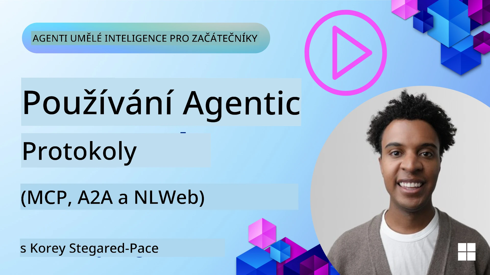
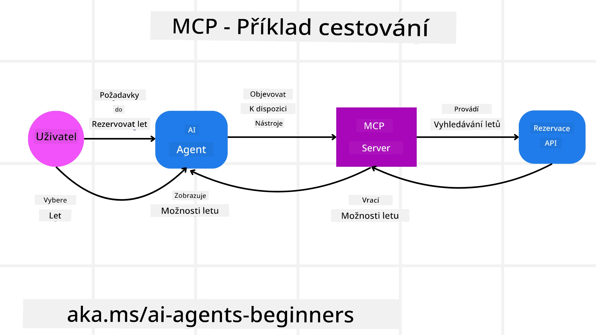
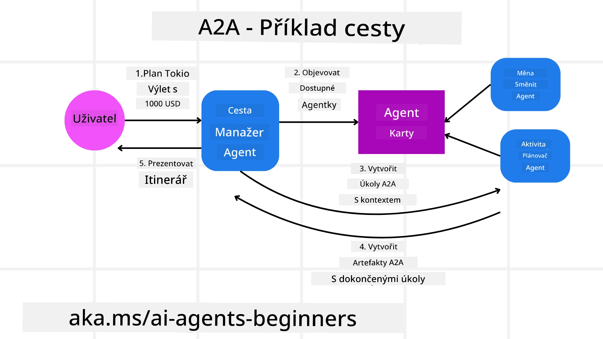
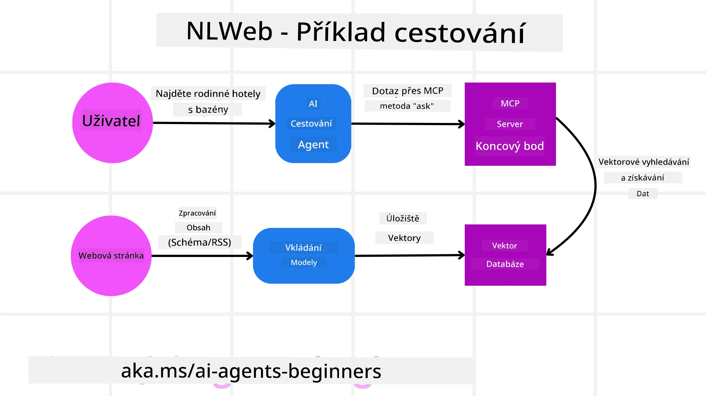

# Používání agentních protokolů (MCP, A2A a NLWeb)

> _(Klikněte na obrázek výše pro zhlédnutí videa této lekce)_

S rostoucím využíváním AI agentů roste i potřeba protokolů, které zajišťují standardizaci, bezpečnost a podporují otevřenou inovaci. V této lekci pokryjeme 3 protokoly, které se snaží tuto potřebu naplnit - Model Context Protocol (MCP), Agent to Agent (A2A) a Natural Language Web (NLWeb).

## Úvod

V této lekci se budeme zabývat:

• Jak **MCP** umožňuje AI agentům přistupovat k externím nástrojům a datům, aby dokončili uživatelské úkoly.

•  Jak **A2A** umožňuje komunikaci a spolupráci mezi různými AI agenty.

• Jak **NLWeb** přináší rozhraní v přirozeném jazyce na jakoukoli webovou stránku, což umožňuje AI agentům objevovat a interagovat s obsahem.

## Cíle učení

• **Identifikovat** hlavní účel a přínosy MCP, A2A a NLWeb v kontextu AI agentů.

• **Vysvětlit** jak každý protokol usnadňuje komunikaci a interakci mezi LLMs, nástroji a ostatními agenty.

• **Rozpoznat** rozdílné role, které každý protokol hraje při budování složitých agentních systémů.

## Model Context Protocol

The **Model Context Protocol (MCP)** je otevřený standard, který poskytuje standardizovaný způsob, jak aplikace poskytují kontext a nástroje LLMs. To umožňuje „univerzální adaptér“ k různým datovým zdrojům a nástrojům, ke kterým se AI agenti mohou připojovat konzistentním způsobem.

Podívejme se na komponenty MCP, výhody oproti přímému používání API a na příklad, jak by AI agenti mohli použít MCP server.

### MCP Core Components

MCP funguje na **klient-server architektuře** a hlavními komponentami jsou:

• **Hosts** jsou LLM aplikace (například editor kódu jako VSCode), které zahajují připojení k MCP Serveru.

• **Clients** jsou komponenty v rámci hostitelské aplikace, které udržují one-to-one spojení se servery.

• **Servers** jsou lehké programy, které vystavují konkrétní schopnosti.

V protokolu jsou zahrnuty tři základní primitivy, což jsou schopnosti MCP Serveru:

• **Tools**: Jedná se o samostatné akce nebo funkce, které může AI agent zavolat k provedení úkolu. Například služba počasí může vystavit nástroj "get weather", nebo e‑commerce server může vystavit nástroj "purchase product". MCP servery inzerují název každého nástroje, popis a vstupně‑výstupní schéma ve svém výpisu schopností.

• **Resources**: Jedná se o data pouze pro čtení nebo dokumenty, které může MCP server poskytovat, a které si klienti mohou vyžádat na požádání. Příklady zahrnují obsah souborů, záznamy z databází nebo logovací soubory. Resources mohou být textové (např. kód nebo JSON) nebo binární (např. obrázky nebo PDF).

• **Prompts**: Předdefinované šablony, které poskytují navrhované výzvy, umožňující složitější pracovní postupy.

### Výhody MCP

MCP nabízí významné výhody pro AI agenty:

• **Dynamické objevování nástrojů**: Agenti mohou dynamicky obdržet seznam dostupných nástrojů ze serveru spolu s popisy jejich funkcí. To kontrastuje s tradičními API, které často vyžadují statické zakódování integrací, což znamená, že jakákoli změna API vyžaduje aktualizace kódu. MCP nabízí přístup „integrovat jednou“, což vede k vyšší přizpůsobivosti.

• **Interoperabilita mezi LLMs**: MCP funguje napříč různými LLM, poskytuje flexibilitu pro přepínání základních modelů za účelem lepšího výkonu.

• **Standardizované zabezpečení**: MCP zahrnuje standardní metodu autentizace, což zlepšuje škálovatelnost při přidávání přístupu k dalším MCP serverům. To je jednodušší než správa různých klíčů a typů autentizace pro různá tradiční API.

### MCP Example

Představte si, že uživatel chce rezervovat let pomocí AI asistenta poháněného MCP.

1. **Připojení**: AI asistent (MCP klient) se připojí k MCP serveru poskytovanému leteckou společností.

2. **Objevování nástrojů**: Klient se zeptá MCP serveru letecké společnosti: „Jaké nástroje máte k dispozici?“ Server odpoví nástroji jako "search flights" a "book flights".

3. **Volání nástroje**: Poté požádáte AI asistenta: „Prosím vyhledej let z Portlandu do Honolulu.“ AI asistent za použití svého LLM identifikuje, že musí zavolat nástroj "search flights" a předá relevantní parametry (odlet, destinace) na MCP server.

4. **Provedení a odpověď**: MCP server, fungující jako obal, provede skutečné volání interního rezervačního API letecké společnosti. Poté obdrží informace o letech (např. JSON data) a pošle je zpět AI asistentovi.

5. **Další interakce**: AI asistent zobrazí možnosti letů. Jakmile vyberete let, asistent může zavolat nástroj "book flight" na stejném MCP serveru a dokončit rezervaci.

## Agent-to-Agent Protocol (A2A)

Zatímco MCP se zaměřuje na propojení LLM s nástroji, **Agent-to-Agent (A2A) protocol** jde dál tím, že umožňuje komunikaci a spolupráci mezi různými AI agenty. A2A propojuje AI agenty napříč různými organizacemi, prostředími a technologickými stacky, aby dokončili sdílený úkol.

Prozkoumáme komponenty a výhody A2A spolu s příkladem, jak by mohl být použit v naší cestovní aplikaci.

### A2A Core Components

A2A se zaměřuje na umožnění komunikace mezi agenty a na to, aby spolupracovali na dokončení podúkolu uživatele. Každá komponenta protokolu k tomu přispívá:

#### Agent Card

Podobně jako MCP server sdílí seznam nástrojů, Agent Card obsahuje:
- Název agenta.
- A **popis obecných úkolů**, které vykonává.
- Seznam **konkrétních dovedností** s popisy, které pomáhají ostatním agentům (nebo i lidským uživatelům) pochopit, kdy a proč by toho agenta chtěli zavolat.
- **Aktuální Endpoint URL** agenta
- **verzi** a **schopnosti** agenta, jako jsou streamované odpovědi a push notifikace.

#### Agent Executor

Agent Executor je zodpovědný za **předání kontextu uživatelského chatu vzdálenému agentovi**; vzdálený agent to potřebuje k pochopení úkolu, který má být dokončen. V A2A serveru agent používá své vlastní Large Language Model (LLM) k parsování příchozích požadavků a vykonávání úkolů pomocí svých interních nástrojů.

#### Artifact

Jakmile vzdálený agent dokončí požadovaný úkol, jeho výstup je vytvořen jako artifact. Artifact **obsahuje výsledek práce agenta**, **popis toho, co bylo dokončeno**, a **textový kontext**, který je poslán prostřednictvím protokolu. Po odeslání artifactu je spojení s vzdáleným agentem uzavřeno, dokud nebude znovu potřeba.

#### Event Queue

Tato komponenta se používá pro **zpracování aktualizací a předávání zpráv**. Je obzvlášť důležitá v produkci pro agentní systémy, aby se zabránilo uzavření spojení mezi agenty dříve, než je úkol dokončen, zejména když doba dokončení úkolu může být delší.

### Výhody A2A

• **Zlepšená spolupráce**: Umožňuje agentům od různých dodavatelů a platforem vzájemně komunikovat, sdílet kontext a spolupracovat, čímž usnadňuje plynulou automatizaci napříč tradičně oddělenými systémy.

• **Flexibilita výběru modelu**: Každý A2A agent si může zvolit, který LLM použije k obsluze svých požadavků, což umožňuje optimalizované nebo jemně doladěné modely pro každého agenta, na rozdíl od jediného připojení LLM v některých scénářích MCP.

• **Vestavěná autentizace**: Autentizace je integrována přímo do protokolu A2A, což poskytuje robustní bezpečnostní rámec pro interakce agentů.

### A2A Example

Rozšíříme náš scénář rezervace cesty, tentokrát však využijeme A2A.

1. **Požadavek uživatele na multi-agenta**: Uživatel interaguje s "Travel Agent" A2A klientem/agenta, například řekne: "Prosím rezervujte celý výlet do Honolulu příští týden, včetně letů, hotelu a pronájmu auta".

2. **Orchestrace cestovního agenta**: Travel Agent obdrží tento složitý požadavek. Použije svůj LLM k rozmyšlení úkolu a určení, že potřebuje komunikovat s jinými specializovanými agenty.

3. **Meziagentní komunikace**: Travel Agent poté používá A2A protokol k připojení k downstream agentům, jako je "Airline Agent", "Hotel Agent" a "Car Rental Agent", které jsou vytvořeny různými společnostmi.

4. **Delegované vykonání úloh**: Travel Agent pošle konkrétní úkoly těmto specializovaným agentům (např. "Najdi lety do Honolulu", "Rezervuj hotel", "Pronajmi auto"). Každý z těchto specializovaných agentů, běžící na svých vlastních LLM a využívající své nástroje (které mohou být sami MCP servery), provede svou konkrétní část rezervace.

5. **Konsolidovaná odpověď**: Jakmile všichni downstream agenti dokončí své úkoly, Travel Agent sestaví výsledky (detail letu, potvrzení hotelu, rezervaci auta) a pošle uživateli komplexní odpověď ve stylu chatu.

## Natural Language Web (NLWeb)

Webové stránky byly dlouho primárním způsobem, jak uživatelé přistupují k informacím a datům na internetu.

Podívejme se na různé komponenty NLWeb, výhody NLWeb a příklad, jak náš NLWeb funguje, a to na příkladu naší cestovní aplikace.

### Komponenty NLWeb

- **NLWeb Application (Core Service Code)**: Systém, který zpracovává dotazy v přirozeném jazyce. Připojuje různé části platformy k vytváření odpovědí. Můžete si ho představit jako **motor, který pohání funkce v přirozeném jazyce** webu.

- **NLWeb Protocol**: Toto je **základní soubor pravidel pro interakci v přirozeném jazyce** s webovou stránkou. Vrací odpovědi ve formátu JSON (často pomocí Schema.org). Jeho účelem je vytvořit jednoduchý základ pro „AI Web“, stejným způsobem, jak HTML umožnilo sdílení dokumentů online.

- **MCP Server (Model Context Protocol Endpoint)**: Každé NLWeb nasazení také funguje jako **MCP server**. To znamená, že může **sdílet nástroje (jako metodu „ask“) a data** s jinými AI systémy. V praxi to umožňuje, aby se obsah a schopnosti webu staly použitelnými pro AI agenty, čímž se web stává součástí širší „ekosystému agentů“.

- **Embedding Models**: Tyto modely se používají k **převodu obsahu webu do číselných reprezentací zvaných vektory** (embeddings). Tyto vektory zachycují význam způsobem, který mohou počítače porovnávat a vyhledávat. Jsou uloženy ve speciální databázi a uživatelé si mohou vybrat, který embedding model chtějí použít.

- **Vector Database (Retrieval Mechanism)**: Tato databáze **ukládá embeddingy obsahu webu**. Když někdo položí dotaz, NLWeb zkontroluje vektorovou databázi, aby rychle našel nejrelevantnější informace. Poskytne rychlý seznam možných odpovědí seřazených podle podobnosti. NLWeb pracuje s různými systémy pro ukládání vektorů, jako jsou Qdrant, Snowflake, Milvus, Azure AI Search a Elasticsearch.

### NLWeb na příkladu

Uvažujme opět naši cestovní rezervační webovou stránku, tentokrát poháněnou NLWeb.

1. **Získávání dat**: Stávající produktové katalogy cestovního webu (např. seznamy letů, popisy hotelů, nabídky zájezdů) jsou formátovány pomocí Schema.org nebo načteny přes RSS feedy. Nástroje NLWeb tyto strukturované údaje ingestují, vytvářejí embeddings a ukládají je do lokální nebo vzdálené vektorové databáze.

2. **Dotaz v přirozeném jazyce (člověk)**: Uživatel navštíví web a místo procházení menu zadá do chatovacího rozhraní: "Najdi mi rodinně přátelský hotel v Honolulu s bazénem na příští týden".

3. **Zpracování NLWeb**: Aplikace NLWeb obdrží tento dotaz. Pošle dotaz do LLM pro porozumění a současně prohledá svou vektorovou databázi pro relevantní nabídky hotelů.

4. **Přesné výsledky**: LLM pomáhá interpretovat výsledky vyhledávání z databáze, identifikovat nejlepší shody na základě kritérií "rodinně přátelský", "bazén" a "Honolulu" a poté sestaví odpověď v přirozeném jazyce. Klíčové je, že odpověď odkazuje na skutečné hotely z katalogu webu a vyhýbá se vymyšleným informacím.

5. **Interakce AI agenta**: Protože NLWeb slouží jako MCP server, externí AI cestovní agent se může také připojit k instanci NLWeb tohoto webu. AI agent pak může použít MCP metodu `ask("Are there any vegan-friendly restaurants in the Honolulu area recommended by the hotel?")`. Instanci NLWeb by to zpracovala, využila svou databázi informací o restauracích (pokud byla načtena) a vrátila strukturovanou JSON odpověď.

### Máte další otázky ohledně MCP/A2A/NLWeb?

Připojte se k [Microsoft Foundry Discord](https://aka.ms/ai-agents/discord) a setkejte se s ostatními studenty, navštěvujte konzultační hodiny a získejte odpovědi na své dotazy ohledně AI agentů.

## Zdroje

- [MCP for Beginners](https://aka.ms/mcp-for-beginners)  
- [MCP Documentation](https://learn.microsoft.com/python/api/overview/azure/ai-projects-readme)
- [NLWeb Repo](https://github.com/nlweb-ai/NLWeb)
- [Microsoft Agent Framework](https://aka.ms/ai-agents-beginners/agent-framewrok)

---

<!-- CO-OP TRANSLATOR DISCLAIMER START -->
**Prohlášení o vyloučení odpovědnosti**:  
Tento dokument byl přeložen pomocí AI překladatelské služby [Co-op Translator](https://github.com/Azure/co-op-translator). Přestože usilujeme o přesnost, mějte prosím na paměti, že automatické překlady mohou obsahovat chyby nebo nepřesnosti. Původní dokument v jeho originálním jazyce by měl být považován za závazný zdroj. Pro kritické informace se doporučuje profesionální lidský překlad. Za jakákoli nedorozumění či nesprávné výklady vzniklé v důsledku tohoto překladu neneseme odpovědnost.
<!-- CO-OP TRANSLATOR DISCLAIMER END -->