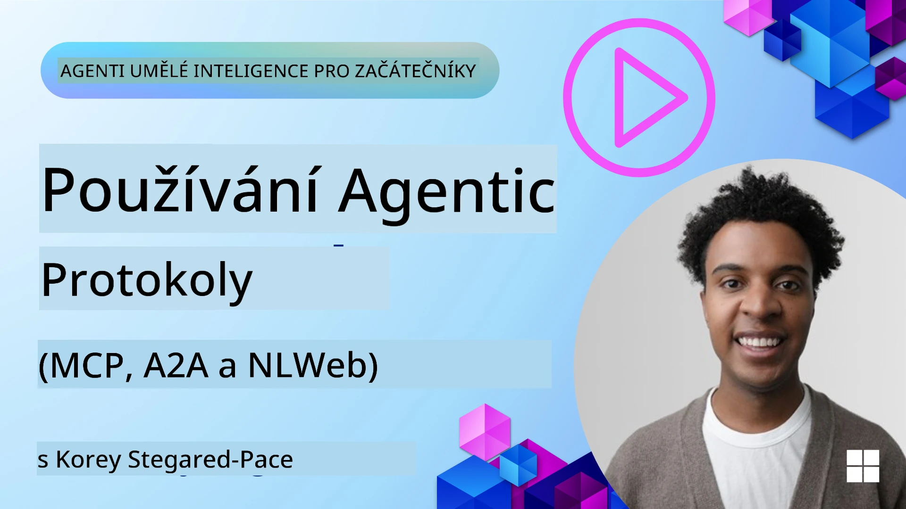
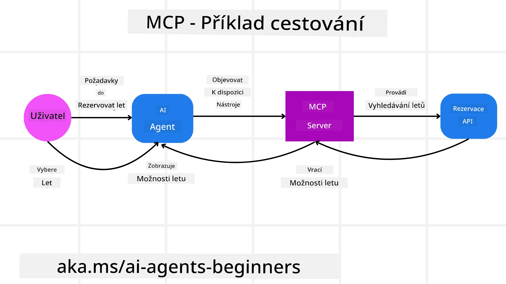
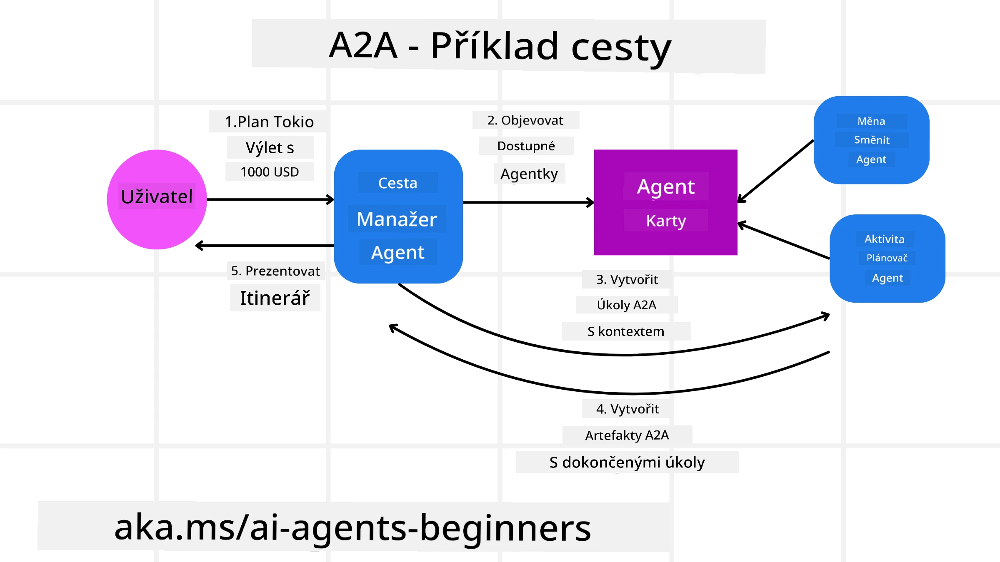
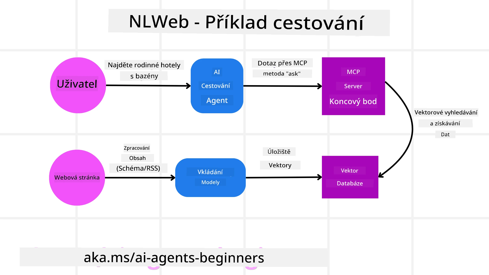

# Používání agentních protokolů (MCP, A2A a NLWeb)

> _(Klikněte na obrázek výše pro zobrazení videa tohoto lekce)_

S rozšiřujícím se používáním AI agentů roste i potřeba protokolů, které zajistí standardizaci, zabezpečení a podporu otevřených inovací. V této lekci pokryjeme 3 protokoly, které se snaží tuto potřebu naplnit – Model Context Protocol (MCP), Agent to Agent (A2A) a Natural Language Web (NLWeb).

## Úvod

V této lekci pokryjeme:

• Jak **MCP** umožňuje AI agentům přístup k externím nástrojům a datům k dokončení uživatelských úkolů.

• Jak **A2A** umožňuje komunikaci a spolupráci mezi různými AI agenty.

• Jak **NLWeb** přináší rozhraní přirozeného jazyka na jakoukoli webovou stránku, což umožňuje AI agentům objevovat a interagovat s obsahem.

## Výukové cíle

• **Identifikovat** hlavní účel a přínosy MCP, A2A a NLWeb v kontextu AI agentů.

• **Vysvětlit**, jak každý protokol usnadňuje komunikaci a interakci mezi LLM, nástroji a ostatními agenty.

• **Rozpoznat** odlišné role jednotlivých protokolů při budování složitých agentních systémů.

## Model Context Protocol

**Model Context Protocol (MCP)** je otevřený standard, který poskytuje standardizovaný způsob, jak aplikace mohou poskytovat kontext a nástroje LLM. Umožňuje tak „univerzální adaptér“ ke zdrojům dat a nástrojům, ke kterým se AI agenti mohou připojit konzistentně.

Podívejme se na součásti MCP, přínosy oproti přímému použití API a příklad, jak by AI agenti mohli používat MCP server.

### Základní součásti MCP

MCP funguje na **klient-server architektuře** a základní součásti jsou:

• **Hosts** jsou LLM aplikace (například editor kódu jako VSCode), které zahajují připojení k MCP serveru.

• **Clients** jsou komponenty v rámci hostitelské aplikace, které udržují jedno-na-jedno připojení k serverům.

• **Servers** jsou lehké programy, které vystavují specifické schopnosti.

Součástí protokolu jsou tři základní primitiva, která tvoří schopnosti MCP serveru:

• **Nástroje**: Jsou to jednotlivé akce nebo funkce, které může AI agent vyvolat, aby provedl činnost. Například služba počasí může vystavit nástroj "získat počasí" nebo e-commerce server nástroj "zakoupit produkt". MCP servery zveřejňují název, popis a schéma vstupů/výstupů každého nástroje ve svém seznamu schopností.

• **Zdroje**: Jsou to datové položky nebo dokumenty určené pouze ke čtení, které MCP server může poskytovat a klienti je mohou kdykoli získat. Příklady zahrnují obsah souborů, záznamy databází nebo logy. Zdroje mohou být textové (například kód nebo JSON) nebo binární (například obrázky či PDF).

• **Prompty**: Jsou to předdefinované šablony, které poskytují navrhované prompty umožňující složitější pracovní postupy.

### Přínosy MCP

MCP nabízí významné výhody pro AI agenty:

• **Dynamické objevování nástrojů**: Agenti mohou dynamicky získat seznam dostupných nástrojů ze serveru spolu s jejich popisy. Na rozdíl od tradičních API, která často vyžadují statické kódování integrací, což znamená, že jakákoli změna API vyžaduje aktualizaci kódu. MCP nabízí přístup „integrovat jednou“, což vede k větší přizpůsobivosti.

• **Interoperabilita napříč LLM**: MCP funguje přes různé LLM, což poskytuje flexibilitu při přechodu na jiné modely pro lepší výkon.

• **Standardizované zabezpečení**: MCP zahrnuje standardní metodu autentizace, což zlepšuje škálovatelnost při přidávání přístupu k dalším MCP serverům. Je to jednodušší než správa různých klíčů a typů autentizace pro různé tradiční API.

### Příklad MCP

Představme si uživatele, který chce rezervovat let pomocí AI asistenta využívajícího MCP.

1. **Připojení**: AI asistent (MCP klient) se připojí k MCP serveru poskytnutému leteckou společností.

2. **Objevování nástrojů**: Klient se zeptá MCP serveru aerolinek: „Jaké nástroje máte k dispozici?“ Server odpoví nástroji jako „vyhledat lety“ a „rezervovat lety“.

3. **Volání nástroje**: Poté požádáte AI asistenta: „Prosím, vyhledej let z Portlandu do Honolulu.“ AI asistent pomocí svého LLM identifikuje, že musí vyvolat nástroj „vyhledat lety“ a předá relevantní parametry (odletové a příletové místo) MCP serveru.

4. **Provedení a odpověď**: MCP server, působící jako obal, provede skutečné volání vnitřního rezervačního API aerolinek. Poté obdrží informace o letu (např. JSON data) a odešle je zpět AI asistentovi.

5. **Další interakce**: AI asistent prezentuje možnosti letu. Jakmile vyberete let, asistent může vyvolat nástroj „rezervovat let“ na stejném MCP serveru a dokončit rezervaci.

## Agent-to-Agent protokol (A2A)

Zatímco MCP se zaměřuje na připojení LLM k nástrojům, **Agent-to-Agent (A2A) protokol** jde dál a umožňuje komunikaci a spolupráci mezi různými AI agenty. A2A propojuje AI agenty napříč různými organizacemi, prostředími a technologickými stacky, aby dokončili sdílený úkol.

Prozkoumáme komponenty a přínosy A2A spolu s příkladem jeho použití v naší cestovní aplikaci.

### Základní komponenty A2A

A2A se zaměřuje na umožnění komunikace mezi agenty a jejich spolupráci na dokončení uživatelského podúkolu. Každá komponenta protokolu k tomu přispívá:

#### Agent Card

Podobně jako MCP server sdílí seznam nástrojů, Agent Card obsahuje:
- Jméno agenta.
- **popis obecných úkolů**, které plní.
- **seznam specifických dovedností** s popisy, které pomáhají ostatním agentům (nebo i lidem) pochopit, kdy a proč by daného agenta měli volat.
- **aktuální URL koncového bodu** agenta.
- **verzi** a **schopnosti** agenta, jako je streamování odpovědí a push notifikace.

#### Agent Executor

Agent Executor je odpovědný za **předávání kontextu uživatelského chatu vzdálenému agentovi**, který to potřebuje k pochopení úkolu, který má splnit. V A2A serveru agent používá svůj vlastní velký jazykový model (LLM) k analýze příchozích požadavků a vykonání úkolů pomocí svých interních nástrojů.

#### Artefakt

Jakmile vzdálený agent dokončí požadovaný úkol, jeho práce je vytvořena jako artefakt. Artefakt **obsahuje výsledek práce agenta**, **popis provedeného úkolu** a **textový kontext**, který je přenesen protokolem. Po odeslání artefaktu je spojení se vzdáleným agentem ukončeno, dokud není znovu potřeba.

#### Fronta událostí

Tato komponenta slouží k **zpracování aktualizací a přenosu zpráv**. Je zvláště důležitá v produkci agentních systémů, aby se zabránilo uzavření spojení mezi agenty před dokončením úkolu, zejména když dokončení úkolů může trvat déle.

### Přínosy A2A

• **Vylepšená spolupráce**: Umožňuje agentům od různých dodavatelů a platformám interagovat, sdílet kontext a spolupracovat, což usnadňuje hladkou automatizaci mezi historicky oddělenými systémy.

• **Flexibilita výběru modelu**: Každý A2A agent si může vybrat, který LLM použije k obsluze svých požadavků, což umožňuje optimalizované nebo laděné modely pro jednotlivé agenty, na rozdíl od jednoho LLM připojení v některých MCP scénářích.

• **Integrovaná autentizace**: Autentizace je přímo zabudována do A2A protokolu, poskytující robustní bezpečnostní rámec pro interakce agentů.

### Příklad A2A

Rozveďme náš scénář rezervace cesty, tentokrát pomocí A2A.

1. **Uživatelský požadavek na multi-agenta**: Uživatel komunikuje s „Cestovním agentem“ – A2A klientem/agentem, například říká: „Prosím, rezervuj celou cestu do Honolulu na příští týden, včetně letů, hotelu a půjčení auta“.

2. **Orchestrace Cestovního agenta**: Cestovní agent obdrží tento složitý požadavek. Používá svůj LLM k rozmyšlení úkolu a zjistí, že musí komunikovat s dalšími specializovanými agenty.

3. **Meziagentní komunikace**: Cestovní agent pak použije A2A protokol k připojení k nižším agentům, například „Agent aerolinek“, „Hotelový agent“ a „Agent půjčovny aut“, kteří jsou vytvořeni různými společnostmi.

4. **Delegované provádění úkolů**: Cestovní agent posílá specifické úkoly těmto specializovaným agentům (např. „Najdi lety do Honolulu“, „Rezervuj hotel“, „Půjč auto“). Každý z těchto specializovaných agentů, běžící na vlastních LLM a využívající své nástroje (které mohou být sami MCP servery), provádí svou část rezervace.

5. **Konsolidovaná odpověď**: Jakmile všichni níže uvedení agenti dokončí své úkoly, Cestovní agent shromáždí výsledky (detaily letu, potvrzení hotelu, rezervaci auta) a odešle komplexní odpověď v podobě chatu zpět uživateli.

## Natural Language Web (NLWeb)

Webové stránky jsou dlouho hlavním způsobem, jak uživatelé přistupují k informacím a datům napříč internetem.

Pojďme se podívat na různé komponenty NLWeb, přínosy NLWeb a příklad, jak NLWeb funguje na naší cestovní aplikaci.

### Komponenty NLWeb

- **NLWeb aplikace (jadrový servisní kód)**: Systém, který zpracovává otázky v přirozeném jazyce. Spojuje různé části platformy, aby vytvářel odpovědi. Můžeme ho považovat za **motor, který pohání přirozenojazykové funkce webu**.

- **NLWeb protokol**: Jedná se o **základní soubor pravidel pro interakci v přirozeném jazyce** s webem. Vrací odpovědi v JSON formátu (často využívajíce Schema.org). Jeho účelem je vytvořit jednoduchý základ pro „AI Web“, podobně jako HTML umožnilo sdílení dokumentů online.

- **MCP server (Model Context Protocol endpoint)**: Každá NLWeb instalace současně funguje jako **MCP server**. To znamená, že může **sdílet nástroje (jako metodu „ask“) a data** s ostatními AI systémy. Prakticky to znamená, že obsah a schopnosti webu jsou použitelné AI agenty, což umožňuje stránce stát se součástí širší „agentní ekosystému“.

- **Embedding modely**: Tyto modely se používají k **převodu obsahu webu na číselné reprezentace zvané vektory (embeddingy)**. Tyto vektory zachycují význam tak, aby je počítače mohly porovnávat a vyhledávat. Jsou uloženy ve speciální databázi a uživatelé si mohou vybrat, který embedding model chtějí použít.

- **Vektorová databáze (retrieval mechanismus)**: Tato databáze **ukládá embeddingy obsahu webu**. Když někdo položí otázku, NLWeb kontroluje vektorovou databázi, aby rychle našel nejrelevantnější informace. Poskytuje rychlý seznam možných odpovědí, řazených podle podobnosti. NLWeb pracuje s různými systémy uložení vektorů, jako jsou Qdrant, Snowflake, Milvus, Azure AI Search a Elasticsearch.

### NLWeb na příkladu

Opět si vezměme náš cestovní rezervační web, tentokrát poháněný NLWeb.

1. **Zpracování dat**: Stávající katalogy produktů cestovního webu (např. seznamy letů, popisy hotelů, zájezdové balíčky) jsou formátovány pomocí Schema.org nebo načteny přes RSS feedy. Nástroje NLWeb tyto strukturované údaje zpracují, vytvoří embeddingy a uloží je do místní nebo vzdálené vektorové databáze.

2. **Dotaz v přirozeném jazyce (člověk)**: Uživatel navštíví web a místo procházení menu zadá do chatového rozhraní dotaz: „Najdi mi rodinný hotel v Honolulu s bazénem na příští týden“.

3. **Zpracování NLWeb**: Aplikace NLWeb obdrží tento dotaz. Posílá jej LLM pro pochopení a zároveň vyhledává vektorovou databázi relevantní hotelové nabídky.

4. **Přesné výsledky**: LLM pomáhá interpretovat výsledky vyhledávání z databáze, identifikovat nejlepší shody na základě kritérií „pro rodiny“, „bazén“ a „Honolulu“ a poté formátuje odpověď v přirozeném jazyce. Zásadní je, že odpověď odkazuje na skutečné hotely z katalogu webu, bez vymyšlených informací.

5. **Interakce AI agenta**: Protože NLWeb funguje jako MCP server, externí AI cestovní agent se může připojit k této NLWeb instanci webu. AI agent pak může použít MCP metodu `ask`, aby přímo dotazoval web: `ask("Jsou v oblasti Honolulu nějaké veganské restaurace doporučené hotelem?")`. NLWeb tuto žádost zpracuje, využívajíc svou databázi informací o restauracích (pokud je načtena), a vrátí strukturovanou odpověď v JSON formátu.

### Máte další otázky o MCP/A2A/NLWeb?

Připojte se na [Microsoft Foundry Discord](https://discord.com/invite/ATgtXmAS5D), kde se setkáte s dalšími studenty, můžete navštívit konzultační hodiny a získat odpovědi na otázky ohledně AI agentů.

## Zdroje

- [MCP pro začátečníky](https://aka.ms/mcp-for-beginners)  
- [MCP dokumentace](https://learn.microsoft.com/python/api/overview/azure/ai-projects-readme)
- [NLWeb repozitář](https://github.com/nlweb-ai/NLWeb)
- [Microsoft Agent Framework](https://learn.microsoft.com/en-us/agent-framework/overview/?wt.mc_id=youtube_26688_organicsocial_reactor&pivots=programming-language-python)

## Předchozí lekce

[AI agenti v produkci](../10-ai-agents-production/README.md)

## Další lekce

[Kontektová inženýrství pro AI agenty](../12-context-engineering/README.md)

---

<!-- CO-OP TRANSLATOR DISCLAIMER START -->
**Prohlášení o omezení odpovědnosti**:
Tento dokument byl přeložen pomocí AI překladatelské služby [Co-op Translator](https://github.com/Azure/co-op-translator). Přestože usilujeme o co největší přesnost, mějte prosím na paměti, že automatizované překlady mohou obsahovat chyby nebo nepřesnosti. Originální dokument v jeho mateřském jazyce by měl být považován za autoritativní zdroj. Pro kritické informace se doporučuje profesionální lidský překlad. Nejsme odpovědní za jakékoli nedorozumění nebo nesprávné interpretace vzniklé použitím tohoto překladu.
<!-- CO-OP TRANSLATOR DISCLAIMER END -->