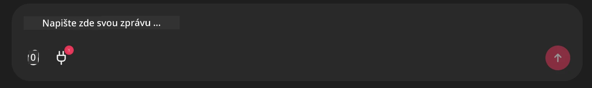

# Příklad Github MCP serveru

## Popis

Toto byla ukázka vytvořená pro AI Agents Hackathon pořádaný prostřednictvím Microsoft Reactor.

Tyto nástroje se používají k doporučování hackathonových projektů na základě uživatelových Github repozitářů.
To probíhá takto:

1. **Github Agent** - Pomocí Github MCP Serveru načítá repozitáře a informace o těchto repozitářích.
2. **Hackathon Agent** - Zpracuje data od Github Agenta a navrhne kreativní nápady na hackathonové projekty založené na projektech, programovacích jazycích, které uživatel používá, a tématech pro AI Agents hackathon.
3. **Events Agent** - Na základě návrhů Hackathon Agenta doporučí Events Agent relevantní akce ze série AI Agent Hackathon.
## Spuštění kódu 

### Proměnné prostředí

Tato ukázka používá Microsoft Agent Framework, Azure OpenAI Service, the Github MCP Server and Azure AI Search.

Ujistěte se, že máte nastavené odpovídající proměnné prostředí pro použití těchto nástrojů:

```python
AZURE_AI_PROJECT_ENDPOINT=""
AZURE_AI_MODEL_DEPLOYMENT_NAME=""
AZURE_SEARCH_SERVICE_ENDPOINT=""
AZURE_SEARCH_API_KEY=""
``` 

## Spuštění Chainlit serveru

Pro připojení k MCP serveru tato ukázka používá Chainlit jako chatovací rozhraní. 

Pro spuštění serveru použijte v terminálu následující příkaz:

```bash
chainlit run app.py -w
```

Tím by se měl spustit váš Chainlit server na `localhost:8000` a zároveň naplnit váš Azure AI Search Index obsahem souboru `event-descriptions.md`. 

## Připojení k MCP serveru

Pro připojení k Github MCP Serveru vyberte ikonu "plug" pod chatovacím polem "Type your message here..":



Odtud můžete kliknout na "Connect an MCP" pro přidání příkazu pro připojení k Github MCP Serveru:

```bash
npx -y @modelcontextprotocol/server-github --env GITHUB_PERSONAL_ACCESS_TOKEN=[YOUR PERSONAL ACCESS TOKEN]
```

Nahraďte "[YOUR PERSONAL ACCESS TOKEN]" svým skutečným Personal Access Tokenem. 

Po připojení byste vedle ikony plug měli vidět (1), což potvrzuje, že je připojeno. Pokud ne, zkuste restartovat chainlit server pomocí `chainlit run app.py -w`.

## Použití ukázky 

Chcete-li spustit workflow agentů pro doporučování hackathonových projektů, můžete zadat zprávu jako: 

"Doporučte projekty na hackathon pro uživatele Github koreyspace"

Router Agent analyzuje váš požadavek a určí, která kombinace agentů (GitHub, Hackathon a Events) je nejvhodnější pro zpracování dotazu. Agenti spolupracují, aby poskytli komplexní doporučení založená na analýze Github repozitářů, generování nápadů na projekty a relevantních technologických akcích.

---

<!-- CO-OP TRANSLATOR DISCLAIMER START -->
Vyloučení odpovědnosti:
Tento dokument byl přeložen pomocí AI překladatelské služby Co-op Translator (https://github.com/Azure/co-op-translator). Ačkoli usilujeme o přesnost, vezměte prosím na vědomí, že automatické překlady mohou obsahovat chyby nebo nepřesnosti. Původní dokument v jeho mateřském jazyce by měl být považován za závazný zdroj. Pro zásadní informace se doporučuje profesionální lidský překlad. Neneseme odpovědnost za jakákoli nedorozumění nebo chybné výklady, které by mohly vzniknout v důsledku použití tohoto překladu.
<!-- CO-OP TRANSLATOR DISCLAIMER END -->