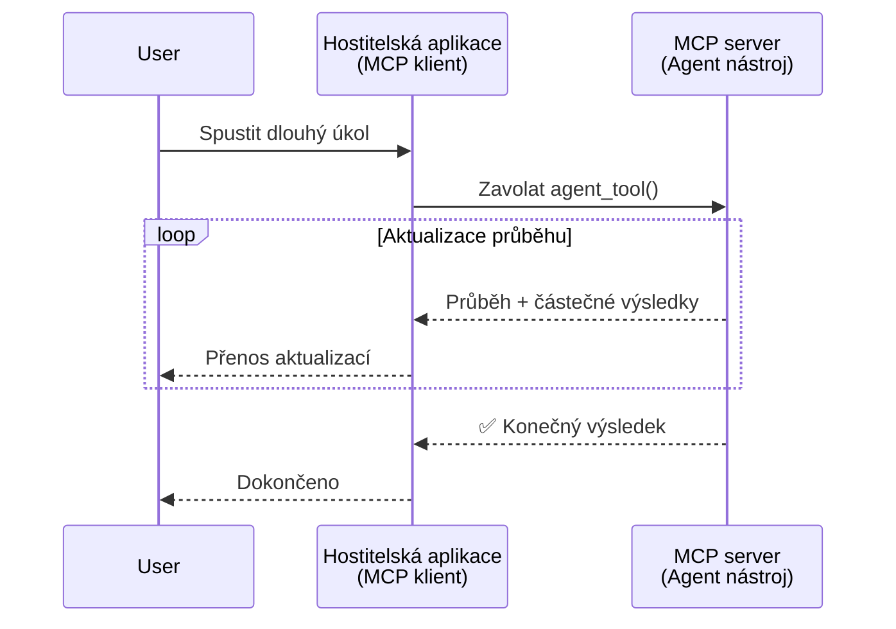
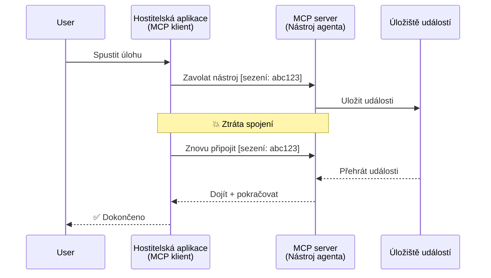
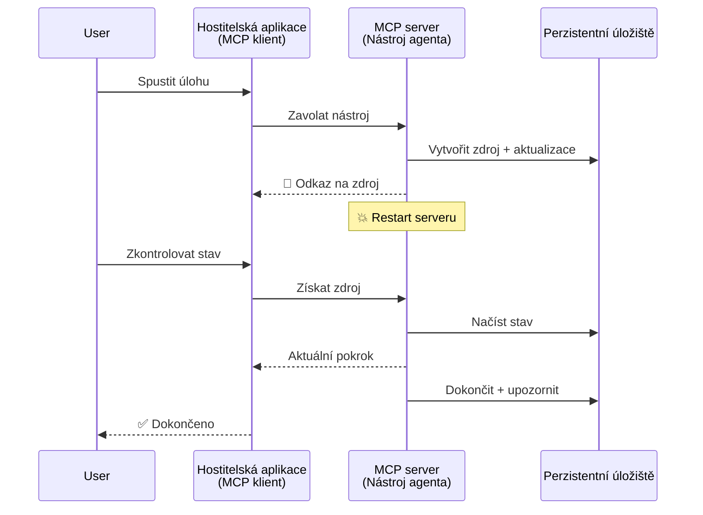
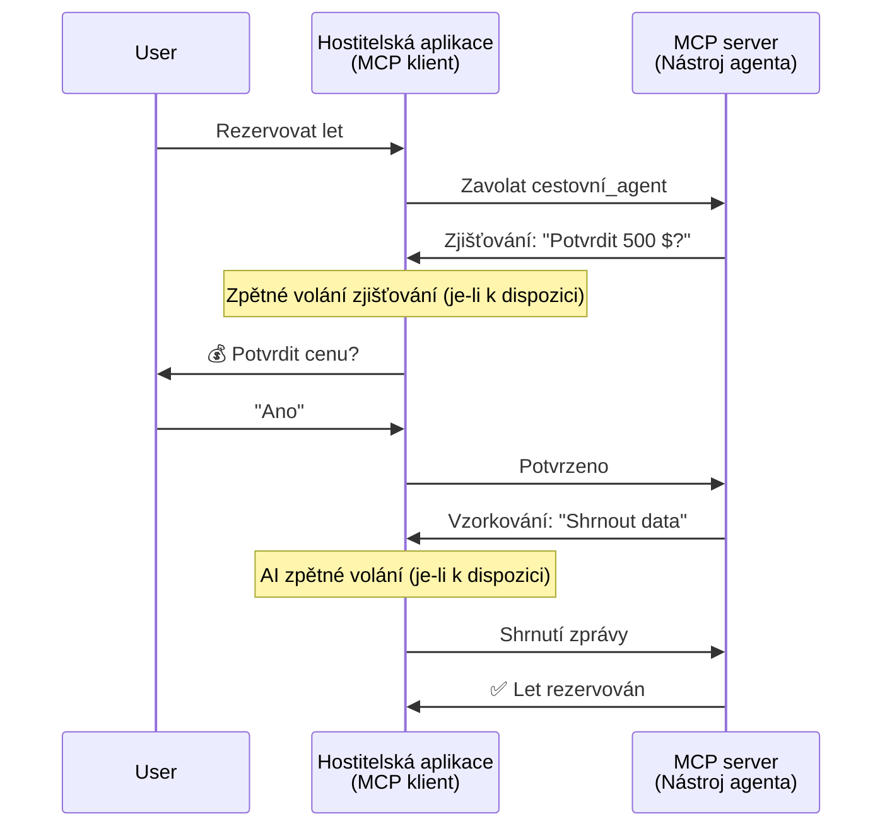
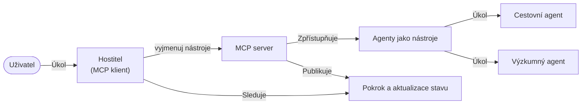

# Budování systémů pro komunikaci agent-agent pomocí MCP

> TL;DR - Lze postavit komunikaci Agent2Agent na MCP? Ano!

MCP se vyvinul výrazně dál za svůj původní cíl „poskytovat kontext pro LLM“. S nedávnými vylepšeními včetně [obnovitelných streamů](https://modelcontextprotocol.io/docs/concepts/transports#resumability-and-redelivery), [vyžádání vstupu](https://modelcontextprotocol.io/specification/2025-06-18/client/elicitation), [vzorkování](https://modelcontextprotocol.io/specification/2025-06-18/client/sampling) a notifikací ([progres](https://modelcontextprotocol.io/specification/2025-06-18/basic/utilities/progress) a [zdroje](https://modelcontextprotocol.io/specification/2025-06-18/schema#resourceupdatednotification)), nyní MCP poskytuje robustní základ pro stavbu komplexních systémů komunikace agent-agent.

## Záměna pojmů agent/nástroj

Jak více vývojářů zkoumá nástroje s agentními vlastnostmi (běh dlouhou dobu, může vyžadovat dodatečný vstup během provádění atd.), častým omylem je, že MCP není vhodný, protože rané příklady jeho primitivních nástrojů se zaměřovaly na jednoduché vzory požadavek-odpověď.

Tento pohled je zastaralý. Specifikace MCP byla během posledních měsíců výrazně rozšířena o schopnosti, které uzavírají mezeru pro budování dlouhodobě běžících agentních behaviorálních modelů:

- **Streamování & Částečné výsledky**: Aktualizace průběhu v reálném čase během provádění
- **Obnovitelnost**: Klienti se mohou znovu připojit a pokračovat po odpojení
- **Trvanlivost**: Výsledky přežijí restart serveru (např. pomocí odkazů na zdroje)
- **Vícekrokové**: Interaktivní vstup během provádění přes vyžádání a vzorkování

Tyto funkce lze kombinovat pro umožnění složitých agentních a multiagentních aplikací, vše nasazené na protokol MCP.

Pro přehled budeme označovat agenta jako „nástroj“, který je dostupný na MCP serveru. To předpokládá existenci hostitelské aplikace, která implementuje MCP klienta, který naváže relaci s MCP serverem a může volat agenta.

## Co dělá MCP nástroj „agentním“?

Než se pustíme do implementace, pojďme stanovit, jaké infrastrukturní schopnosti jsou potřeba k podpoře dlouhodobě běžících agentů.

> Definujeme agenta jako entitu, která může autonomně pracovat po delší časové období, schopnou zvládat složité úkoly, které mohou vyžadovat vícenásobné interakce nebo úpravy na základě zpětné vazby v reálném čase.

### 1. Streamování & Částečné výsledky

Tradiční vzory požadavek-odpověď nefungují pro dlouhodobé úkoly. Agenti musí poskytovat:

- Aktualizace průběhu v reálném čase
- Mezitímní výsledky

**Podpora v MCP**: Notifikace o aktualizaci zdroje umožňují streamování částečných výsledků, přičemž je potřeba pečlivě navrhnout, aby se zabránilo konfliktům s model 1:1 požadavek/odpověď JSON-RPC.

| Funkce                   | Použití                                                                                                                                                                      | Podpora v MCP                                                                             |
| ------------------------ | --------------------------------------------------------------------------------------------------------------------------------------------------------------------------- | ----------------------------------------------------------------------------------------- |
| Aktualizace průběhu v reálném čase | Uživatelský požadavek na migraci kódu, agent streamuje průběh: „10 % - analyzování závislostí… 25 % - převod TypeScript souborů… 50 % - aktualizace importů…“               | ✅ Notifikace o průběhu                                                                   |
| Částečné výsledky       | Úkol „vygeneruj knihu“ streamuje částečné výsledky, např. 1) nástin děje, 2) seznam kapitol, 3) jednotlivé kapitoly dle dokončení. Host může kdykoli kontrolovat, zrušit či změnit směr. | ✅ Notifikace lze „rozšířit“ o částečné výsledky viz návrhy v PR 383, 776                  |

<div align="center" style="font-style: italic; font-size: 0.95em; margin-bottom: 0.5em;">
<strong>Obrázek 1:</strong> Tento diagram znázorňuje, jak MCP agent streamuje aktualizace průběhu v reálném čase a částečné výsledky do hostitelské aplikace během dlouhodobého úkolu, což uživateli umožňuje sledovat provádění v reálném čase.
</div>



### 2. Obnovitelnost

Agenti musí zvládat přerušení sítě elegantně:

- Znovu se připojit po (klientském) odpojení
- Pokračovat tam, kde skončili (opakováním zpráv)

**Podpora v MCP**: MCP přenos StreamableHTTP dnes podporuje obnovení relace a opakované doručení zpráv pomocí ID relace a posledních ID událostí. Důležité je, že server musí implementovat EventStore, který umožní přehrávání událostí po znovupřipojení klienta.  
Upozorňujeme, že existuje komunitní návrh (PR #975), který zkoumá přenosně-agnostické obnovitelné streamy.

| Funkce       | Použití                                                                                                                                                | Podpora v MCP                                                          |
| ------------ | ----------------------------------------------------------------------------------------------------------------------------------------------------- | --------------------------------------------------------------------- |
| Obnovitelnost| Klient se odpojí během dlouhodobého úkolu. Po znovupřipojení relace pokračuje s přehráním zmeškaných událostí a bez přerušení navazuje tam, kde skončil. | ✅ StreamableHTTP s ID relace, přehráváním událostí a EventStore       |

<div align="center" style="font-style: italic; font-size: 0.95em; margin-bottom: 0.5em;">
<strong>Obrázek 2:</strong> Tento diagram ukazuje, jak MCP přenos StreamableHTTP a event store umožňují plynulé obnovení relace: pokud se klient odpojí, může se znovu připojit, přehrát zmeškané události a pokračovat v úkolu bez ztráty průběhu.
</div>



### 3. Trvanlivost

Dlouhodobě běžící agenti potřebují perzistentní stav:

- Výsledky přežijí restart serveru
- Stav lze získat i mimo přímou interakci
- Sledování průběhu napříč relacemi

**Podpora v MCP**: MCP nyní podporuje návratový typ Resource link pro volání nástrojů. Dnes je běžný vzor navrhnout nástroj, který vytvoří zdroj a okamžitě vrátí odkaz na zdroj. Nástroj může později pokračovat v práci na úkolu na pozadí a aktualizovat zdroj. Klient může následně zvolit polling stavu zdroje pro získání částečných nebo úplných výsledků (na základě toho, jaké aktualizace zdroje server poskytuje) nebo se přihlásit k odběru notifikací o zdroji.

Jedno omezení je, že polling zdrojů nebo odběr aktualizací může spotřebovávat prostředky s důsledky v rozsahu. Existuje otevřený komunitní návrh (včetně #992), který zkoumá možnost zahrnutí webhooků nebo triggerů, které by server mohl volat pro oznámení klientovi/hostitelské aplikaci o aktualizacích.

| Funkce    | Použití                                                                                                                                           | Podpora v MCP                                                     |
| --------- | ------------------------------------------------------------------------------------------------------------------------------------------------ | ----------------------------------------------------------------- |
| Trvanlivost| Server havaruje během úkolu migrace dat. Výsledky a průběh přežijí restart, klient může získat stav a pokračovat z perzistentního zdroje.           | ✅ Odkazy na zdroje s perzistentním uložištěm a notifikacemi stavu |

Dnes je běžný vzor navrhnout nástroj, který vytvoří zdroj a ihned vrátí odkaz na něj. Nástroj může na pozadí řešit úkol, vydávat notifikace o zdroji jako aktualizace průběhu nebo obsahovat částečné výsledky a podle potřeby aktualizovat obsah zdroje.

<div align="center" style="font-style: italic; font-size: 0.95em; margin-bottom: 0.5em;">
<strong>Obrázek 3:</strong> Tento diagram ukazuje, jak MCP agenti využívají perzistentní zdroje a notifikace stavu, aby zajistili, že dlouhodobé úkoly přežijí restart serveru, což umožňuje klientům kontrolovat průběh a získávat výsledky i po výpadcích.
</div>



### 4. Vícekrokové interakce

Agenti často během běhu potřebují dodatečný vstup:

- Lidské upřesnění nebo schválení
- AI asistence pro složitá rozhodnutí
- Dynamické nastavení parametrů

**Podpora v MCP**: Plně podporováno přes vzorkování (pro AI vstup) a vyžádání (pro lidský vstup).

| Funkce                | Použití                                                                                                                                       | Podpora v MCP                                        |
| --------------------- | -------------------------------------------------------------------------------------------------------------------------------------------- | ---------------------------------------------------- |
| Vícekrokové interakce | Agent pro rezervaci cest vyžaduje potvrzení ceny od uživatele, pak požádá AI o shrnutí dat o cestě před dokončením rezervace.               | ✅ Vyžádání pro lidský vstup, vzorkování pro AI vstup |

<div align="center" style="font-style: italic; font-size: 0.95em; margin-bottom: 0.5em;">
<strong>Obrázek 4:</strong> Tento diagram znázorňuje, jak mohou MCP agenti interaktivně vyžadovat lidský vstup nebo požádat o AI asistenci během provádění, podporující složité vícekrokové pracovní toky, jako jsou potvrzení a dynamické rozhodování.
</div>



## Implementace dlouhodobě běžících agentů na MCP - přehled kódu

Jako součást tohoto článku poskytujeme [repozitář kódu](https://github.com/victordibia/ai-tutorials/tree/main/MCP%20Agents), který obsahuje kompletní implementaci dlouhodobě běžících agentů pomocí MCP Python SDK s přenosem StreamableHTTP pro obnovu relace a opakované doručení zpráv. Implementace ukazuje, jak lze schopnosti MCP kombinovat k umožnění sofistikovaných agentních chování.

Konkrétně implementujeme server se dvěma hlavními agentními nástroji:

- **Cestovní agent** - Simuluje službu pro rezervaci cest s potvrzením ceny pomocí vyžádání
- **Výzkumný agent** - Provádí výzkumné úkoly s AI-pomocí pomocí vzorkování shrnutí

Oba agenti demonstrují aktualizace průběhu v reálném čase, interaktivní potvrzení a plnou schopnost obnovení relace.

### Klíčové koncepty implementace

Následující sekce ukazují implementaci agenta na straně serveru a zpracování na straně hostitele pro každou schopnost:

#### Streamování & Aktualizace průběhu - Stav úkolu v reálném čase

Streamování umožňuje agentům poskytovat aktualizace průběhu v reálném čase během dlouhodobých úkolů, informujíc uživatele o stavu a mezivýsledcích.

**Implementace serveru (agent posílá notifikace o průběhu):**

```python
# Z server/server.py - Cestovní agent posílající aktualizace pokroku
for i, step in enumerate(steps):
    await ctx.session.send_progress_notification(
        progress_token=ctx.request_id,
        progress=i * 25,
        total=100,
        message=step,
        related_request_id=str(ctx.request_id)
    )
    await anyio.sleep(2)  # Simulovat práci

# Alternativa: Pro podrobné aktualizace krok za krokem zaznamenávejte zprávy
await ctx.session.send_log_message(
    level="info",
    data=f"Processing step {current_step}/{steps} ({progress_percent}%)",
    logger="long_running_agent",
    related_request_id=ctx.request_id,
)
```

**Implementace klienta (hostitel přijímá aktualizace průběhu):**

```python
# Z client/client.py - Klient zpracovávající notifikace v reálném čase
async def message_handler(message) -> None:
    if isinstance(message, types.ServerNotification):
        if isinstance(message.root, types.LoggingMessageNotification):
            console.print(f"📡 [dim]{message.root.params.data}[/dim]")
        elif isinstance(message.root, types.ProgressNotification):
            progress = message.root.params
            console.print(f"🔄 [yellow]{progress.message} ({progress.progress}/{progress.total})[/yellow]")

# Registrovat obsluhu zpráv při vytváření relace
async with ClientSession(
    read_stream, write_stream,
    message_handler=message_handler
) as session:
```

#### Vyžádání - Požadavek na vstup uživatele

Vyžádání umožňuje agentům požadovat vstup uživatele během provádění. To je nezbytné pro potvrzení, upřesnění či schválení během dlouhodobých úkolů.

**Implementace serveru (agent žádá o potvrzení):**

```python
# Z server/server.py - Cestovní agent žádá o potvrzení ceny
elicit_result = await ctx.session.elicit(
    message=f"Please confirm the estimated price of $1200 for your trip to {destination}",
    requestedSchema=PriceConfirmationSchema.model_json_schema(),
    related_request_id=ctx.request_id,
)

if elicit_result and elicit_result.action == "accept":
    # Pokračovat s rezervací
    logger.info(f"User confirmed price: {elicit_result.content}")
elif elicit_result and elicit_result.action == "decline":
    # Zrušit rezervaci
    booking_cancelled = True
```

**Implementace klienta (hostitel poskytuje callback pro vyžádání):**

```python
# Z klienta/client.py - Zpracování požadavků na vyvolání klienta
async def elicitation_callback(context, params):
    console.print(f"💬 Server is asking for confirmation:")
    console.print(f"   {params.message}")

    response = console.input("Do you accept? (y/n): ").strip().lower()

    if response in ['y', 'yes']:
        return types.ElicitResult(
            action="accept",
            content={"confirm": True, "notes": "Confirmed by user"}
        )
    else:
        return types.ElicitResult(
            action="decline",
            content={"confirm": False, "notes": "Declined by user"}
        )

# Zaregistrujte zpětné volání při vytváření relace
async with ClientSession(
    read_stream, write_stream,
    elicitation_callback=elicitation_callback
) as session:
```

#### Vzorkování - Požadavek AI asistence

Vzorkování dovoluje agentům požádat LLM o pomoc při složitých rozhodnutích nebo generování obsahu během běhu. To umožňuje hybridní workflow člověk-AI.

**Implementace serveru (agent žádá AI asistenci):**

```python
# Z server/server.py - Výzkumný agent žádající o souhrn AI
sampling_result = await ctx.session.create_message(
    messages=[
        SamplingMessage(
            role="user",
            content=TextContent(type="text", text=f"Please summarize the key findings for research on: {topic}")
        )
    ],
    max_tokens=100,
    related_request_id=ctx.request_id,
)

if sampling_result and sampling_result.content:
    if sampling_result.content.type == "text":
        sampling_summary = sampling_result.content.text
        logger.info(f"Received sampling summary: {sampling_summary}")
```

**Implementace klienta (hostitel poskytuje callback pro vzorkování):**

```python
# Ze souboru client/client.py - Zpracování požadavků na vzorkování klienta
async def sampling_callback(context, params):
    message_text = params.messages[0].content.text if params.messages else 'No message'
    console.print(f"🧠 Server requested sampling: {message_text}")

    # V reálné aplikaci by to mohlo volat API LLM
    # Pro demonstrační účely poskytujeme simulovanou odpověď
    mock_response = "Based on current research, MCP has evolved significantly..."

    return types.CreateMessageResult(
        role="assistant",
        content=types.TextContent(type="text", text=mock_response),
        model="interactive-client",
        stopReason="endTurn"
    )

# Zaregistrujte zpětné volání při vytváření relace
async with ClientSession(
    read_stream, write_stream,
    sampling_callback=sampling_callback,
    elicitation_callback=elicitation_callback
) as session:
```

#### Obnovitelnost - Kontinuita relace přes odpojení

Obnovitelnost zajišťuje, že dlouhodobé agentní úkoly přežijí odpojení klienta a plynule pokračují po znovupřipojení. Je implementována pomocí event store a tokenů pro obnovení.

**Implementace event store (server uchovává stav relace):**

```python
# Ze server/event_store.py - Jednoduchý událostní úložiště v paměti
class SimpleEventStore(EventStore):
    def __init__(self):
        self._events: list[tuple[StreamId, EventId, JSONRPCMessage]] = []
        self._event_id_counter = 0

    async def store_event(self, stream_id: StreamId, message: JSONRPCMessage) -> EventId:
        """Store an event and return its ID."""
        self._event_id_counter += 1
        event_id = str(self._event_id_counter)
        self._events.append((stream_id, event_id, message))
        return event_id

    async def replay_events_after(self, last_event_id: EventId, send_callback: EventCallback) -> StreamId | None:
        """Replay events after the specified ID for resumption."""
        start_index = None
        stream_id = None
        for index, (event_stream_id, event_id, _) in enumerate(self._events):
            if event_id == last_event_id:
                start_index = index + 1
                stream_id = event_stream_id
                break

        if start_index is None:
            return None

        # Přehrávejte pouze pozdější události z původního proudu relace.
        for event_stream_id, event_id, message in self._events[start_index:]:
            if event_stream_id != stream_id:
                continue
            await send_callback(EventMessage(message, event_id))

        return stream_id

# Ze server/server.py - Předání událostního úložiště správci relace
def create_server_app(event_store: Optional[EventStore] = None) -> Starlette:
    server = ResumableServer()

    # Vytvořte správce relace s událostním úložištěm pro pokračování
    session_manager = StreamableHTTPSessionManager(
        app=server,
        event_store=event_store,  # Událostní úložiště umožňuje pokračování relace
        json_response=False,
        security_settings=security_settings,
    )

    return Starlette(routes=[Mount("/mcp", app=session_manager.handle_request)])

# Použití: Inicializujte s událostním úložištěm
event_store = SimpleEventStore()
app = create_server_app(event_store)
```

**Metadata klienta s tokenem pro obnovení (klient se znovu připojuje pomocí uloženého stavu):**

```python
# Z client/client.py - Pokračování klienta s metadata
if existing_tokens and existing_tokens.get("resumption_token"):
    # Použijte existující pokračovací token k pokračování tam, kde jsme skončili
    metadata = ClientMessageMetadata(
        resumption_token=existing_tokens["resumption_token"],
    )
else:
    # Vytvořte zpětné volání pro uložení pokračovacího tokenu po jeho obdržení
    def enhanced_callback(token: str):
        protocol_version = getattr(session, 'protocol_version', None)
        token_manager.save_tokens(session_id, token, protocol_version, command, args)

    metadata = ClientMessageMetadata(
        on_resumption_token_update=enhanced_callback,
    )

# Odeslat požadavek s metadaty pokračování
result = await session.send_request(
    types.ClientRequest(
        types.CallToolRequest(
            method="tools/call",
            params=types.CallToolRequestParams(name=command, arguments=args)
        )
    ),
    types.CallToolResult,
    metadata=metadata,
)
```

Hostitelská aplikace si uchovává ID relací a tokeny pro obnovení lokálně, což jí umožňuje znovu se připojit k existujícím relacím bez ztráty průběhu či stavu.

### Organizace kódu

<div align="center" style="font-style: italic; font-size: 0.95em; margin-bottom: 0.5em;">
<strong>Obrázek 5:</strong> Architektura systému agentů založených na MCP
</div>



**Klíčové soubory:**

- **`server/server.py`** - Obnovitelný MCP server s cestovním a výzkumným agentem demonstrující vyžádání, vzorkování a aktualizace průběhu
- **`client/client.py`** - Interaktivní hostitelská aplikace s podporou obnovení, callback handlery a správou tokenů
- **`server/event_store.py`** - Implementace event store umožňující obnovení relace a opakované doručení zpráv

## Rozšíření na multi-agentní komunikaci na MCP

Výše uvedenou implementaci lze rozšířit na multi-agentní systémy zvýšením inteligence a rozsahu hostitelské aplikace:

- **Inteligentní dekompozice úkolů**: Hostitel analyzuje složité uživatelské požadavky a rozkládá je na podúkoly pro různé specializované agenty
- **Koordinace více serverů**: Hostitel udržuje připojení k více MCP serverům, z nichž každý nabízí různé agentní schopnosti
- **Správa stavu úkolu**: Hostitel sleduje průběh napříč více současnými agentními úkoly, řeší závislosti a pořadí
- **Odolnost & Opakování pokusů**: Hostitel spravuje selhání, implementuje logiku opakování a přesměrovává úkoly, když agenti nejsou dostupní
- **Syntéza výsledků**: Hostitel kombinuje výstupy z více agentů do koherentních finálních výsledků

Hostitel se vyvíjí z jednoduchého klienta na inteligentního orchestrátora, který koordinuje distribuované agentní schopnosti při zachování stejného základního protokolu MCP.

## Závěr

Vylepšené schopnosti MCP – notifikace zdrojů, vyžádání/vzorkování, obnovitelné streamy a perzistentní zdroje – umožňují komplexní interakce agent-agent při zachování jednoduchosti protokolu.

## Začínáme

Připraven stavět svůj vlastní agent2agent systém? Postupujte podle těchto kroků:

### 1. Spusťte demo

```bash
# Spusťte server s úložištěm událostí pro obnovení
python -m server.server --port 8006

# V jiném terminálu spusťte interaktivního klienta
python -m client.client --url http://127.0.0.1:8006/mcp
```

**Dostupné příkazy v interaktivním režimu:**

- `travel_agent` - Rezervujte cestu s potvrzením ceny pomocí vyžádání
- `research_agent` - Výzkumné téma s AI-podporou shrnutí pomocí vzorkování
- `list` - Zobrazit všechny dostupné nástroje
- `clean-tokens` - Vyčistit tokeny pro obnovení
- `help` - Zobrazit podrobnou nápovědu příkazů
- `quit` - Ukončit klienta

### 2. Otestujte schopnosti obnovení

- Spusťte dlouhodobého agenta (např. `travel_agent`)
- Přerušte klienta během běhu (Ctrl+C)
- Restartujte klienta – automaticky pokračuje tam, kde skončil

### 3. Objevujte a rozšiřujte

- **Prozkoumejte příklady**: Podívejte se na tento [mcp-agents](https://github.com/victordibia/ai-tutorials/tree/main/MCP%20Agents)
- **Připojte se ke komunitě**: Zapojte se do diskusí o MCP na GitHubu
- **Experimentujte**: Začněte s jednoduchým dlouhodobým úkolem a postupně přidejte streamování, obnovitelnost a multi-agentní koordinaci

Toto demonstruje, jak MCP umožňuje inteligentní agentní chování při zachování jednoduchosti založené na nástrojích.

Celkově se specifikace protokolu MCP rychle vyvíjí; čtenáře se doporučuje sledovat oficiální web dokumentace pro nejnovější aktualizace – https://modelcontextprotocol.io/introduction

---

<!-- CO-OP TRANSLATOR DISCLAIMER START -->
**Prohlášení o omezení odpovědnosti**:
Tento dokument byl přeložen pomocí AI překladatelské služby [Co-op Translator](https://github.com/Azure/co-op-translator). Přestože usilujeme o co největší přesnost, mějte prosím na paměti, že automatizované překlady mohou obsahovat chyby nebo nepřesnosti. Originální dokument v jeho mateřském jazyce by měl být považován za autoritativní zdroj. Pro kritické informace se doporučuje profesionální lidský překlad. Nejsme odpovědní za jakékoli nedorozumění nebo nesprávné interpretace vzniklé použitím tohoto překladu.
<!-- CO-OP TRANSLATOR DISCLAIMER END -->