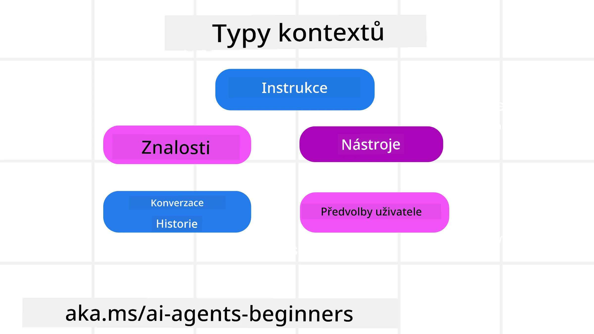
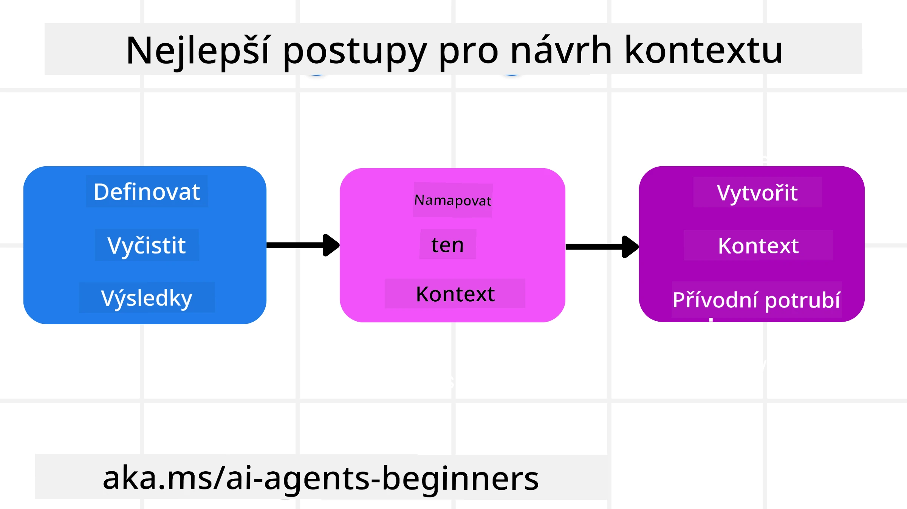

# Kontextové inženýrství pro AI agenty

> _(Klikněte na obrázek výše pro shlédnutí videa této lekce)_

Pochopení složitosti aplikace, pro kterou budujete AI agenta, je důležité pro vytvoření spolehlivého agenta. Potřebujeme vytvářet AI agenty, kteří efektivně spravují informace, aby uspokojili komplexní potřeby přesahující samotné prompt inženýrství.

V této lekci se podíváme na to, co je to kontextové inženýrství a jakou má roli při budování AI agentů.

## Úvod

Tato lekce pokryje:

• **Co je kontextové inženýrství** a proč se liší od prompt inženýrství.

• **Strategie pro efektivní kontextové inženýrství**, včetně způsobů, jak psát, vybírat, komprimovat a izolovat informace.

• **Běžné chyby v kontextu**, které mohou narušit funkčnost AI agenta, a jak je opravit.

## Výukové cíle

Po dokončení této lekce budete umět:

• **Definovat kontextové inženýrství** a odlišit ho od prompt inženýrství.

• **Identifikovat klíčové komponenty kontextu** v aplikacích s velkými jazykovými modely (LLM).

• **Aplikovat strategie psaní, výběru, komprimace a izolace kontextu** pro zlepšení výkonu agentů.

• **Rozpoznat běžné chyby v kontextu** jako otrava, rozptýlení, zmatení a kolize, a zavést techniky k jejich zmírnění.

## Co je kontextové inženýrství?

Pro AI agenty je kontext tím, co řídí plánování agenta k provedení určitých akcí. Kontextové inženýrství je praxe zajištění toho, aby AI agent měl správné informace k dokončení dalšího kroku úkolu. Kontextové okno má omezenou velikost, a proto musíme jako stavitelé agentů vytvářet systémy a procesy pro přidávání, odebírání a kondenzaci informací v kontextovém okně.

### Prompt inženýrství vs Kontextové inženýrství

Prompt inženýrství se zaměřuje na jednorázovou sadu statických instrukcí, které efektivně vedou AI agenty pomocí pravidel. Kontextové inženýrství pak spravuje dynamický soubor informací, včetně počátečního promptu, aby zajistilo, že AI agent má v průběhu času to, co potřebuje. Hlavní myšlenkou kontextového inženýrství je, aby tento proces byl opakovatelný a spolehlivý.

### Typy kontextu

Je důležité si pamatovat, že kontext není jen jedna věc. Informace, které AI agent potřebuje, mohou pocházet z různých zdrojů a je na nás, abychom zajistili agentovi přístup k těmto zdrojům:

Typy kontextu, které může AI agent potřebovat spravovat, zahrnují:

• **Instrukce:** Jsou jako pravidla agenta – prompty, systémové zprávy, few-shot příklady (ukazující AI, jak něco dělat) a popisy nástrojů, které může použít. Zde se spojuje zaměření prompt inženýrství s kontextovým inženýrstvím.

• **Znání:** Pokrývá fakta, informace získané z databází nebo dlouhodobé vzpomínky, které agent nashromáždil. Zahrnuje také integraci systému Retrieval Augmented Generation (RAG), pokud agent potřebuje přístup k různým úložištím znalostí a databázím.

• **Nástroje:** Jsou to definice externích funkcí, API a MCP serverů, které agent může volat, spolu s výsledky (zpětnou vazbou) použití.

• **Historie konverzací:** Probíhající dialog s uživatelem. Jak čas plyne, konverzace se prodlužují a komplikují, což zabírá místo v kontextovém okně.

• **Preference uživatele:** Informace získané o preferencích uživatele v průběhu času. Ty lze uložit a využít při klíčových rozhodnutích, aby se uživateli pomohlo.

## Strategie pro efektivní kontextové inženýrství

### Plánovací strategie

Dobré kontextové inženýrství začíná dobrým plánováním. Zde je přístup, který vám pomůže začít přemýšlet o aplikaci konceptu kontextového inženýrství:

1. **Definujte jasné výsledky** – výsledky úkolů, které budou AI agenti vykonávat, by měly být jasně definovány. Odpovězte na otázku – „Jak bude vypadat svět, když AI agent dokončí svůj úkol?“ Jinými slovy, jaká změna, informace nebo odpověď by měl uživatel mít po interakci s AI agentem.
2. **Zmapujte kontext** – jakmile máte definované výsledky AI agenta, musíte odpovědět na otázku „Jaké informace AI agent potřebuje, aby tento úkol dokončil?“. Tím můžete začít mapovat kontext, kde lze tyto informace nalézt.
3. **Vytvořte kontextové pipeline** – nyní, když víte, kde jsou informace, potřebujete odpovědět na otázku „Jak agent získá tyto informace?“. To lze provést různými způsoby včetně RAG, použití MCP serverů a dalších nástrojů.

### Praktické strategie

Plánování je důležité, ale jakmile začnou informace proudit do kontextového okna agenta, je potřeba mít praktické strategie na jejich správu:

#### Správa kontextu

Zatímco některé informace budou do kontextového okna přidávány automaticky, kontextové inženýrství znamená převzít aktivnější roli s těmito informacemi pomocí několika strategií:

1. **Agentův poznámkový blok (scratchpad)**  
  Umožňuje AI agentovi dělat poznámky o relevantních informacích o aktuálních úkolech a interakcích s uživatelem během jedné relace. Tento poznámkový blok by měl existovat mimo kontextové okno v souboru nebo běhovém objektu, který si agent může během relace později vyvolat, pokud je to potřeba.

2. **Vzpomínky**  
  Scratchpady jsou vhodné pro správu informací mimo kontextové okno jedné relace. Vzpomínky umožňují agentům ukládat a vyvolávat relevantní informace napříč více relacemi. To může zahrnovat shrnutí, preference uživatele a zpětnou vazbu pro budoucí zlepšení.

3. **Komprimace kontextu**  
  Jak kontextové okno roste a blíží se svému limitu, lze použít techniky jako shrnutí a ořezávání. To zahrnuje buď uchování pouze nejrelevantnějších informací, nebo odstranění starších zpráv.

4. **Víceagentní systémy**  
  Vývoj víceagentních systémů je formou kontextového inženýrství, protože každý agent má své vlastní kontextové okno. Způsob, jakým se tento kontext sdílí a předává různým agentům, je další aspekt, který je potřeba plánovat při tvorbě těchto systémů.

5. **Sandbox prostředí**  
  Pokud agent potřebuje spustit nějaký kód nebo zpracovat velké množství informací v dokumentu, může to zabrat velké množství tokenů na zpracování výsledků. Místo ukládání všeho do kontextového okna může agent použít sandbox prostředí, které je schopné kód spustit a přečíst pouze výsledky a další relevantní informace.

6. **Objekty běhového stavu**  
  Toto se provádí vytvářením kontejnerů informací, aby se spravovaly situace, kdy agent potřebuje mít přístup k určitým informacím. U složitého úkolu to umožní agentovi ukládat výsledky jednotlivých podúkolů krok za krokem, což umožní, aby kontext zůstal propojen pouze s tím konkrétním podúkolem.

#### Kontrola kontextu

Po aplikaci některé z těchto strategií stojí za to zkontrolovat, co vlastně další volání modelu obdrželo. Užitečná otázka pro debugování je:

> Načítal agent příliš mnoho kontextu, špatný kontext, nebo mu chyběl kontext, který potřeboval?

Pro odpověď na tuto otázku není potřeba logovat surové prompty, výstupy nástrojů nebo obsah vzpomínek. Pro produkci je lepší malé záznamy kontroly kontextu, které zachycují počty, ID, hashe a štítky politiky:

- **Výběr:** Sledujte, kolik kandidátních částí (chunks), nástrojů nebo vzpomínek bylo zváženo, kolik bylo vybráno a které pravidlo nebo skóre způsobilo vyloučení ostatních.
- **Komprimace:** Zaznamenejte zdrojový rozsah nebo trasovací ID, ID shrnutí, odhadovaný počet tokenů před a po komprimaci a zda byl surový obsah vyloučen z dalšího volání.
- **Izolace:** Poznamenejte, který podúkol probíhal v samostatném agentovi, relaci nebo sandboxu, jaké ohraničené shrnutí bylo vráceno a zda velký výstup nástroje zůstal mimo kontext rodičovského agenta.
- **Paměť a RAG:** Ukládejte ID dokumentů pro vyhledávání, ID vzpomínek, skóre, vybraná ID a stav cenzury místo plného získaného textu.
- **Bezpečnost a soukromí:** Preferujte hashe, ID, tokenové kvóty a štítky politiky před citlivým textem promptu, argumenty nástrojů, výsledky nástrojů nebo tělem uživatelských vzpomínek.

Cílem není uchovávat více kontextu, ale nechat dostatek důkazů, aby vývojář mohl říct, která strategie kontextu byla použita a zda to změnilo další volání modelu zamýšleným způsobem.

### Příklad kontextového inženýrství

Řekněme, že chceme, aby AI agent **„Rezervoval mi výlet do Paříže.“**

• Jednoduchý agent používající pouze prompt inženýrství by mohl jednoduše odpovědět: **„Dobře, kdy byste chtěli jet do Paříže?“** Zpracoval pouze vaši přímou otázku v okamžiku, kdy ji uživatel položil.

• Agent využívající strategie kontextového inženýrství, které jsme pokryli, by udělal mnohem víc. Jeho systém by před odpovědí mohl:

  ◦ **Zkontrolovat váš kalendář** pro dostupné termíny (vyhledání aktuálních dat).

 ◦ **Vzpomenout si na předchozí preference cestování** (z dlouhodobé paměti) jako preferovaná letecká společnost, rozpočet nebo zda preferujete přímé lety.

 ◦ **Identifikovat dostupné nástroje** pro rezervaci letu a hotelu.

- Pak by mohl například odpovědět: „Ahoj [Vaše jméno]! Vidím, že máte volno první týden v říjnu. Mám hledat přímé lety do Paříže na [Preferovaná letecká společnost] ve vašem obvyklém rozpočtu [Rozpočet]?“. Tato bohatší a kontextově uvědomělá odpověď demonstruje sílu kontextového inženýrství.

## Běžné chyby v kontextu

### Otrava kontextu (Context Poisoning)

**Co to je:** Když do kontextu vstoupí halucinace (nepravdivá informace vytvořená LLM) nebo chyba, která je opakovaně zmiňována, čímž agent sleduje nemožné cíle nebo rozvíjí nesmyslné strategie.

**Co dělat:** Zavést **validaci kontextu** a **karanténu**. Validujte informace před přidáním do dlouhodobé paměti. Pokud je detekována možná otrava, zahajte nové vlákna kontextu, aby se zabránilo šíření špatných informací.

**Příklad rezervace cestování:** Váš agent halucinuje **přímý let z malého místního letiště do vzdáleného mezinárodního města**, kde ve skutečnosti nejsou mezinárodní lety. Tento neexistující let se uloží do kontextu. Později, když požádáte agenta o rezervaci, neustále se snaží najít letenky na této nemožné trase, což vede k opakovaným chybám.

**Řešení:** Zaveďte krok, který **ověřuje existenci letu a trasy pomocí API v reálném čase** _před_ přidáním detaily letu do pracovního kontextu agenta. Pokud validace selže, chybná informace je „karanténována“ a dál nepoužívána.

### Rozptýlení kontextu (Context Distraction)

**Co to je:** Když kontext naroste natolik, že model se příliš soustředí na nahromaděnou historii namísto toho, co se naučil během tréninku, což vede k opakujícím se nebo neúplným akcím. Modely mohou začít chybovat ještě před naplněním kontextového okna.

**Co dělat:** Použít **shrnutí kontextu**. Pravidelně komprimujte nahromaděné informace do kratších shrnutí, přičemž zachovávejte důležité detaily a odstraňujte nadbytečnou historii. To pomáhá „resetovat“ fokus.

**Příklad rezervace cestování:** Dlouho diskutujete o různých vysněných destinacích včetně detailního vyprávění o batůžkářském výletu před dvěma lety. Když konečně požádáte **„najdi mi levný let na další měsíc,“** agent je zahlcen starými irelevantními detaily a stále se ptá na vybavení a předchozí itineráře, zatímco ignoruje vaši aktuální žádost.

**Řešení:** Po určitém počtu výměn nebo když kontext překročí velikost, by měl agent **shrnout nejnovější a nejrelevantnější části konverzace** – zaměřit se na aktuální data a destinaci – a toto zhuštěné shrnutí použít pro další volání LLM, přičemž méně relevantní historickou konverzaci zahodit.

### Zmatení v kontextu (Context Confusion)

**Co to je:** Když zbytečný kontext, často ve formě příliš mnoha dostupných nástrojů, způsobuje, že model generuje špatné odpovědi nebo volá nerelevantní nástroje. Menší modely jsou k tomu zvláště náchylné.

**Co dělat:** Zavést **správu nástrojů** pomocí RAG technik. Ukládejte popisy nástrojů ve vektorové databázi a vybírejte _pouze_ nejrelevantnější nástroje pro konkrétní úkol. Výzkum ukazuje, že je vhodné omezit počet nástrojů na méně než 30.

**Příklad rezervace cestování:** Váš agent má přístup k desítkám nástrojů: `book_flight`, `book_hotel`, `rent_car`, `find_tours`, `currency_converter`, `weather_forecast`, `restaurant_reservations` atd. Ptáte se: **„Jak se nejlépe pohybovat po Paříži?“** Kvůli velkému množství nástrojů se agent zmateně pokouší zavolat `book_flight` _v rámci_ Paříže nebo `rent_car`, i když preferujete veřejnou dopravu, protože popisy nástrojů mohou překrývat funkce nebo jednoduše nedokáže vybrat ten nejlepší.

**Řešení:** Použijte **RAG nad popisy nástrojů**. Když se ptáte na pohyb po Paříži, systém dynamicky načte _pouze_ nejrelevantnější nástroje jako `rent_car` nebo `public_transport_info` podle dotazu, a představí LLM zaměřenou „sadu“ nástrojů.

### Kolize v kontextu (Context Clash)

**Co to je:** Když v kontextu existují protichůdné informace, vede to k nekonzistentnímu uvažování nebo špatným závěrečným odpovědím. Často k tomu dochází, když informace přicházejí postupně a rané chybné předpoklady zůstávají v kontextu.

**Co dělat:** Použijte **prořezávání kontextu** a **odkládání (offloading)**. Prořezávání znamená odstranit zastaralé nebo konfliktující informace, jak přicházejí nové podrobnosti. Odkládání poskytuje modelu samostatný „scratchpad“ pracovní prostor pro zpracování informací bez zahlcování hlavního kontextu.
**Příklad rezervace cesty:** Nejprve svému agentovi řeknete, **„Chci letět v ekonomické třídě.“** Později v rozhovoru svůj názor změníte a řeknete, **„Vlastně na tuto cestu pojďme v business třídě.“** Pokud obě instrukce zůstanou v kontextu, agent může obdržet protichůdné výsledky vyhledávání nebo se může zmást, kterou preferenci upřednostnit.

**Řešení:** Implementujte **prořezávání kontextu**. Když nová instrukce odporuje staré, starší instrukce je z kontextu odstraněna nebo explicitně přepsána. Alternativně může agent použít **poznámkový blok**, aby smířil protichůdné preference před rozhodnutím, čímž zajistí, že pouze konečná, konzistentní instrukce bude řídit jeho činnost.

## Máte další otázky ohledně inženýrství kontextu?

Připojte se k [Microsoft Foundry Discord](https://aka.ms/ai-agents/discord), kde se můžete setkat s jinými studenty, zúčastnit se konzultačních hodin a získat odpovědi na své otázky ohledně AI agentů.

---

<!-- CO-OP TRANSLATOR DISCLAIMER START -->
**Prohlášení o omezení odpovědnosti**:
Tento dokument byl přeložen pomocí AI překladatelské služby [Co-op Translator](https://github.com/Azure/co-op-translator). Přestože usilujeme o co největší přesnost, mějte prosím na paměti, že automatizované překlady mohou obsahovat chyby nebo nepřesnosti. Originální dokument v jeho mateřském jazyce by měl být považován za autoritativní zdroj. Pro kritické informace se doporučuje profesionální lidský překlad. Nejsme odpovědní za jakékoli nedorozumění nebo nesprávné interpretace vzniklé použitím tohoto překladu.
<!-- CO-OP TRANSLATOR DISCLAIMER END -->