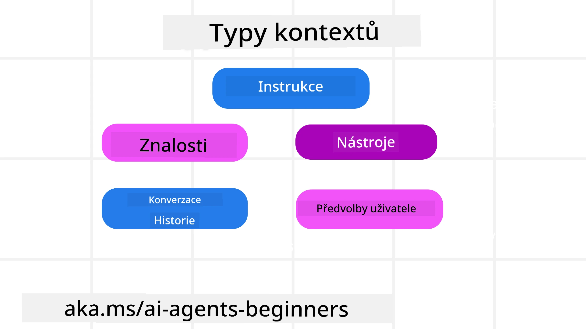
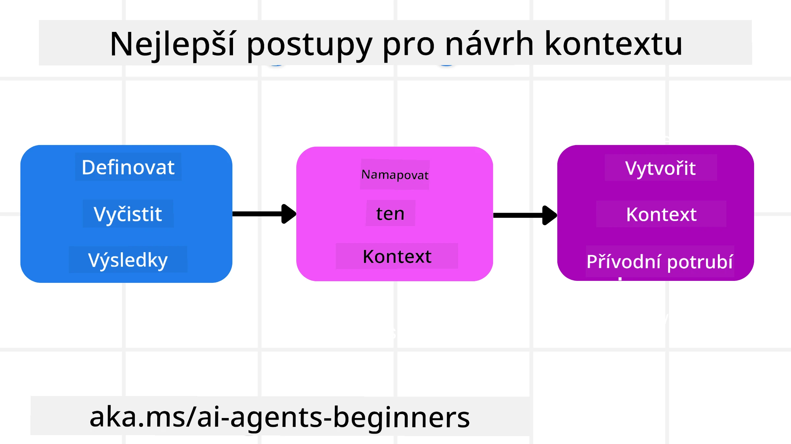

# Kontextové inženýrství pro AI agenty

> _(Klikněte na obrázek výše pro zobrazení videa této lekce)_

Pochopení složitosti aplikace, pro kterou vytváříte AI agenta, je důležité pro vytvoření spolehlivého agenta. Potřebujeme budovat AI agenty, kteří efektivně spravují informace k řešení složitých potřeb, a to přesahuje samotné prompt engineering.

V této lekci se podíváme na to, co je kontextové inženýrství a jakou má roli při tvorbě AI agentů.

## Úvod

Tato lekce pokryje:

• **Co je kontextové inženýrství** a proč se liší od prompt engineeringu.

• **Strategie pro efektivní kontextové inženýrství**, včetně psaní, výběru, komprese a izolace informací.

• **Běžné chyby v kontextu**, které mohou zhatit vašeho AI agenta, a jak je opravit.

## Cíle učení

Po dokončení této lekce budete rozumět, jak:

• **Definovat kontextové inženýrství** a rozlišovat ho od prompt engineeringu.

• **Identifikovat klíčové prvky kontextu** v aplikacích s velkými jazykovými modely (LLM).

• **Použít strategie pro psaní, výběr, kompresi a izolaci kontextu** ke zlepšení výkonu agenta.

• **Rozpoznat běžné chyby v kontextu** jako je otrava, rozptýlení, zmatení a konflikt, a implementovat techniky zmírnění.

## Co je kontextové inženýrství?

Pro AI agenty je kontext tím, co řídí plánování agenta k uskutečnění určitých akcí. Kontextové inženýrství je praxe zajištění, že AI agent má správné informace k dokončení dalšího kroku úkolu. Kontextové okno má omezenou velikost, takže jako tvůrci agentů musíme budovat systémy a procesy pro správu přidávání, odebírání a zhušťování informací v kontextovém okně.

### Prompt engineering vs kontextové inženýrství

Prompt engineering se zaměřuje na jeden soubor statických instrukcí pro efektivní vedení AI agentů s určitou sadou pravidel. Kontextové inženýrství se týká správy dynamického souboru informací, včetně počátečního promptu, aby AI agent měl potřebné údaje v průběhu času. Hlavní myšlenkou kontextového inženýrství je, aby byl tento proces opakovatelný a spolehlivý.

### Typy kontextu

Je důležité si pamatovat, že kontext není jen jedna věc. Informace, které AI agent potřebuje, mohou pocházet z různých zdrojů a je na nás zajistit, aby měl agent přístup k těmto zdrojům:

Typy kontextu, které AI agent může potřebovat spravovat, zahrnují:

• **Instrukce:** Jsou to jako agentova "pravidla" – prompty, systémové zprávy, few-shot příklady (ukázky, jak něco dělat), a popisy nástrojů, které může použít. Tady se propojuje zaměření prompt engineeringu s kontextovým inženýrstvím.

• **Znalosti:** Pokrývají fakta, informace získané z databází nebo dlouhodobé vzpomínky, které agent nasbíral. To zahrnuje integraci systému Retrieval Augmented Generation (RAG), pokud agent potřebuje přístup k různým úložištím znalostí a databázím.

• **Nástroje:** Jsou to definice externích funkcí, API a MCP serverů, které agent může volat, spolu se zpětnou vazbou (výsledky) z jejich použití.

• **Historie konverzace:** Probíhající dialog s uživatelem. Jak čas plyne, tyto konverzace jsou delší a složitější, což znamená, že zabírají místo v kontextovém okně.

• **Preference uživatele:** Informace o uživatelových preferencích a nelibostech získané v průběhu času. Ty mohou být uložené a použité při činiteli klíčových rozhodnutí, aby bylo uživateli lépe pomáháno.

## Strategie pro efektivní kontextové inženýrství

### Plánovací strategie

Dobré kontextové inženýrství začíná dobrým plánováním. Tento přístup vám pomůže začít přemýšlet, jak koncept kontextového inženýrství aplikovat:

1. **Definujte jasné výsledky** – výsledky úkolů, které budou AI agenti plnit, by měly být jasně definované. Odpovězte na otázku - „Jak bude vypadat svět, když AI agent dokončí svůj úkol?“ Jinými slovy, jaká změna, informace nebo odpověď by měl uživatel mít po interakci s AI agentem.
2. **Mapujte kontext** – Jakmile jsou výsledky AI agenta definovány, je třeba odpovědět na otázku „Jaké informace AI agent potřebuje k dokončení tohoto úkolu?“ Tak můžete začít mapovat kontext, kde lze tyto informace nalézt.
3. **Vytvořte kontextové pipelines** – Teď, když víte, kde jsou informace, musíte odpovědět na otázku „Jak bude agent tyto informace získávat?“ To lze řešit různě, včetně RAG, využití MCP serverů a dalších nástrojů.

### Praktické strategie

Plánování je důležité, ale jakmile informace začnou proudit do kontextového okna našeho agenta, potřebujeme mít praktické strategie, jak to spravovat:

#### Správa kontextu

Zatímco některé informace budou do kontextového okna přidávány automaticky, kontextové inženýrství znamená aktivnější přístup k těmto informacím, které lze řídit několika strategiemi:

 1. **Poznámkový blok agenta**
 Umožňuje AI agentovi si během jedné relace dělat poznámky o relevantních informacích o aktuálních úkolech a interakcích s uživatelem. Měl by být mimo kontextové okno, například v souboru nebo runtime objektu, který si agent může později během této relace vyvolat.

 2. **Vzpomínky**
 Poznámkové bloky jsou dobré pro správu informací mimo prostor kontextového okna jedné relace. Vzpomínky umožňují agentům ukládat a vyhledávat relevantní informace přes více relací. Mohou zahrnovat shrnutí, uživatelské preference a zpětnou vazbu pro budoucí zlepšení.

 3. **Kompresní kontext**
  Jakmile kontextové okno narůstá a blíží se limitu, lze použít techniky jako shrnování a ořezávání. To zahrnuje buď ponechání jen nejrelevantnějších informací, nebo odebrání starších zpráv.
  
 4. **Multialagentní systémy**
  Vyvíjení multialagentních systémů je formou kontextového inženýrství, protože každý agent má své vlastní kontextové okno. Jak se tento kontext sdílí a předává mezi agenty, je další věc, kterou je třeba plánovat při budování těchto systémů.
  
 5. **Sandbox prostředí**
  Pokud agent potřebuje spustit nějaký kód nebo zpracovat velké množství informací v dokumentu, může to vyžadovat hodně tokenů k zpracování výsledků. Místo ukládání všeho v kontextovém okně může agent využít sandbox prostředí, které kód spustí a přečte si jen výsledky a další relevantní informace.
  
 6. **Runtime stavové objekty**
   To se provádí vytvářením kontejnerů informací pro správu situací, kdy agent potřebuje přístup k určitému obsahu. U složitého úkolu to umožní agentovi ukládat výsledky jednotlivých podúkolů krok za krokem, takže kontext zůstane vázaný pouze na konkrétní podúkol.

#### Kontrola kontextu

Po aplikaci jedné ze strategií stojí za to zkontrolovat, co vlastně další volání modelu dostalo. Užitečná debugovací otázka je:

> Nahrál agent příliš mnoho kontextu, špatný kontext, nebo postrádal kontext, který potřeboval?

Pro odpověď na tuto otázku nemusíte ukládat surové prompty, výstupy nástrojů nebo obsah paměti. V produkci preferujte malé záznamy kontroly kontextu, které zaznamenávají počty, ID, hashe a štítky politiky:

- **Výběr:** Sledujte, kolik kandidátních úseků, nástrojů nebo vzpomínek bylo zvažováno, kolik jich bylo vybráno a které pravidlo nebo skóre vedlo k odfiltrování ostatních.
- **Kompresní:** Zaznamenejte zdrojový rozsah nebo ID stopy, ID shrnutí, odhad počtu tokenů před a po kompresi a zda surový obsah byl vynechán z dalšího volání.
- **Izolace:** Poznamenejte, který podúkol byl spuštěn v samostatném agentovi, relaci nebo sandboxu, jaké omezené shrnutí bylo vráceno a zda velký výstup nástroje zůstal mimo kontext hlavního agenta.
- **Paměť a RAG:** Ukládejte ID dokumentů pro vyhledávání, ID paměti, skóre, vybraná ID a stav redakce místo plného vyhledaného textu.
- **Bezpečnost a soukromí:** Preferujte hash, ID, tokeny a štítky politiky před citlivým textem promptu, argumenty nástrojů, výsledky nástrojů nebo těly uživatelských pamětí.

Cílem není uchovávat víc kontextu. Je to ponechat dostatek důkazů, aby vývojář mohl říct, která kontextová strategie byla použita a zda změnila další volání modelu zamýšleným způsobem.

### Příklad kontextového inženýrství

Řekněme, že chceme, aby AI agent **„Rezervoval mi cestu do Paříže.“**

• Jednoduchý agent používající pouze prompt engineering by mohl odpovědět: **„Dobře, kdy byste chtěli jet do Paříže?“** Zpracoval jen váš přímý dotaz v okamžiku, kdy uživatel položil otázku.

• Agent používající strategie kontextového inženýrství popsané výše by dělal mnohem více. Ještě před odpovědí by jeho systém mohl:

  ◦ **Zkontrolovat váš kalendář** pro dostupné termíny (získávání dat v reálném čase).

 ◦ **Připomenout si minulé cestovní preference** (z dlouhodobé paměti) jako preferovaná letecká společnost, rozpočet nebo zda preferujete přímé lety.

 ◦ **Identifikovat dostupné nástroje** pro rezervaci letu a hotelu.

- Poté může být příklad odpovědi: „Ahoj [Vaše jméno]! Vidím, že máte volno první týden v říjnu. Mám hledat přímé lety do Paříže u [preferované aerolinie] v rámci vašeho obvyklého rozpočtu [rozpočet]?“ Tento bohatší, na kontextu založený odpověď ukazuje sílu kontextového inženýrství.

## Běžné chyby v kontextu

### Otrava kontextu

**Co to je:** Když do kontextu vstoupí halucinace (falešná informace generovaná LLM) nebo chyba, která je opakovaně zmiňována, což vede k tomu, že agent sleduje nemožné cíle nebo vyvíjí nesmyslné strategie.

**Co dělat:** Implementovat **validaci kontextu** a **karanténu**. Ověřujte informace před přidáním do dlouhodobé paměti. Pokud je detekována možná otrava, začněte nové kontextové vlákno, aby se zabránilo šíření špatných informací.

**Příklad rezervace cesty:** Váš agent si vymýšlí **přímý let z malého místního letiště do vzdáleného mezinárodního města**, které ve skutečnosti mezinárodní lety nenabízí. Tento neexistující detail letu se uloží do kontextu. Když požádáte agenta o rezervaci, stále se snaží najít letenky na tuto nemožnou trasu, což vede k opakovaným chybám.

**Řešení:** Přidejte krok, který **ověřuje existenci letu a trasy pomocí API v reálném čase** _předtím_, než se detail letu přidá do pracovního kontextu agenta. Pokud ověření selže, chybná informace je „karanténována“ a dále se nepoužívá.

### Rozptýlení kontextem

**Co to je:** Když se kontext stane natolik rozsáhlým, že model se příliš soustředí na nahromaděnou historii místo na to, co se naučil během tréninku, což vede k opakujícím se nebo neefektivním akcím. Modely mohou začít dělat chyby ještě před naplněním kontextového okna.

**Co dělat:** Použit **shrnování kontextu**. Pravidelně komprimujte nahromaděné informace do kratších shrnutí, přičemž si ponechte důležité detaily a odstraníte nadbytečnou historii. To pomáhá „resetovat“ pozornost.

**Příklad rezervace cesty:** Diskutujete dlouho o různých vysněných cestovatelských destinacích, včetně detailního popisu vašeho batůžkářského výletu před dvěma lety. Když konečně požádáte o **„nalezení levného letu na příští měsíc“**, agent se zasekne ve starých, irelevantních detailech a pořád se ptá na vaši batůžkářskou výbavu nebo předchozí itineráře, zanedbávajíc váš aktuální požadavek.

**Řešení:** Po určitém počtu kol nebo když kontext překročí velikost, by agent měl **shrnovat nejnovější a nejrelevantnější části konverzace** – soustředit se na vaše aktuální cestovní termíny a destinaci – a toto zhuštěné shrnutí použít pro další volání LLM, zatímco méně relevantní historický rozhovor zahodit.

### Zmatek v kontextu

**Co to je:** Když zbytečný kontext, často ve formě příliš mnoha dostupných nástrojů, způsobí, že model generuje špatné odpovědi nebo volá nerelevantní nástroje. Menší modely jsou zvlášť náchylné k tomuto problému.

**Co dělat:** Implementovat **správu nástrojů** pomocí technik RAG. Ukládejte popisy nástrojů ve vektorové databázi a vybírejte _jen_ ty nejrelevantnější nástroje pro konkrétní úkol. Výzkumy doporučují omezit počet nástrojů pod 30.

**Příklad rezervace cesty:** Váš agent má přístup k desítkám nástrojů: `book_flight`, `book_hotel`, `rent_car`, `find_tours`, `currency_converter`, `weather_forecast`, `restaurant_reservations` atd. Zeptáte se, **„Jak se nejlépe pohybovat po Paříži?“** Kvůli velkému množství nástrojů se agent zmate a pokusí se volat `book_flight` _v rámci_ Paříže, nebo `rent_car` i přesto, že preferujete veřejnou dopravu, protože popisy nástrojů se mohou překrývat nebo jednoduše nemůže správně odlišit nejlepší volbu.

**Řešení:** Použijte **RAG přes popisy nástrojů**. Když se ptáte na pohyb v Paříži, systém dynamicky vyhledává _jen_ nejrelevantnější nástroje jako `rent_car` nebo `public_transport_info` podle vašeho dotazu a předkládá soustředěný „výběr“ nástrojů pro LLM.

### Konflikt v kontextu

**Co to je:** Když v kontextu existují protichůdné informace, což vede k nekonzistentnímu uvažování nebo špatným konečným odpovědím. Často se to stává, když informace přicházejí postupně a dřívější nesprávné předpoklady zůstávají v kontextu.

**Co dělat:** Použijte **prořezávání kontextu** a **offloading**. Prořezávání znamená odstraňování zastaralých nebo konfliktních informací, jakmile přijdou nové detaily. Offloading dává modelu samostatný „poznámkový blok“ pro zpracování informací, aniž by se hlavní kontext zaplnil nepořádkem.

**Příklad rezervace cestování:** Nejprve řeknete svému agentovi, **"Chci letět ekonomickou třídou."** Později během rozhovoru změníte názor a řeknete, **"Vlastně na tuto cestu vyberme byznys třídu."** Pokud zůstanou oba pokyny v kontextu, agent může obdržet protichůdné výsledky vyhledávání nebo se zmást, které preference upřednostnit.

**Řešení:** Implementujte **prořezávání kontextu**. Když nový pokyn odporuje starému, starší pokyn je odstraněn nebo explicitně přepsán v kontextu. Alternativně může agent použít **poznámkový blok** k vyřešení protichůdných preferencí před rozhodnutím, aby zajistil, že pouze konečný, konzistentní pokyn bude řídit jeho činnost.

## Máte další otázky ohledně inženýrství kontextu?

Připojte se k [Microsoft Foundry Discord](https://discord.com/invite/ATgtXmAS5D), kde se můžete setkat s dalšími studenty, zúčastnit se hodin otevřených dveří a získat odpovědi na své otázky o AI agentech.

---

<!-- CO-OP TRANSLATOR DISCLAIMER START -->
**Prohlášení o omezení odpovědnosti**:
Tento dokument byl přeložen pomocí AI překladatelské služby [Co-op Translator](https://github.com/Azure/co-op-translator). Přestože usilujeme o co největší přesnost, mějte prosím na paměti, že automatizované překlady mohou obsahovat chyby nebo nepřesnosti. Originální dokument v jeho mateřském jazyce by měl být považován za autoritativní zdroj. Pro kritické informace se doporučuje profesionální lidský překlad. Nejsme odpovědní za jakékoli nedorozumění nebo nesprávné interpretace vzniklé použitím tohoto překladu.
<!-- CO-OP TRANSLATOR DISCLAIMER END -->