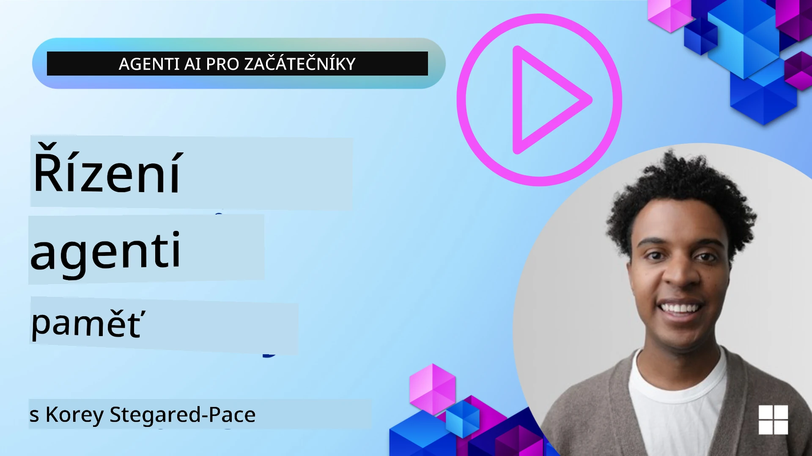

# Paměť pro agenty AI 

Při diskutování jedinečných výhod vytváření AI agentů se obecně zmiňují dvě věci: schopnost volat nástroje pro dokončení úkolů a schopnost zlepšovat se v čase. Paměť je základem tvorby samoučících se agentů, kteří mohou vytvářet lepší zážitky pro naše uživatele.

V této lekci se podíváme, co je paměť pro AI agenty a jak ji můžeme spravovat a využívat ve prospěch našich aplikací.

## Úvod

Tato lekce pokryje:

• **Porozumění paměti agentů AI**: Co je paměť a proč je pro agenty zásadní.

• **Implementace a ukládání paměti**: Praktické metody přidání schopností paměti vašim AI agentům se zaměřením na krátkodobou a dlouhodobou paměť.

• **Umožnění samovylepšování AI agentů**: Jak paměť umožňuje agentům učit se z minulých interakcí a zlepšovat se v čase.

## Dostupné implementace

Tato lekce obsahuje dva komplexní výukové notebooky:

• **[13-agent-memory.ipynb](./13-agent-memory.ipynb)**: Implementuje paměť pomocí Mem0 a Azure AI Search s Microsoft Agent Framework

• **[13-agent-memory-cognee.ipynb](./13-agent-memory-cognee.ipynb)**: Implementuje strukturovanou paměť pomocí Cognee, automaticky buduje znalostní graf založený na embeddingech, vizualizuje graf a inteligentní vyhledávání

## Cíle učení

Po dokončení této lekce budete umět:

• **Rozlišovat mezi různými typy paměti AI agentů**, včetně pracovní, krátkodobé a dlouhodobé paměti, stejně jako specializované formy jako persona a epizodická paměť.

• **Implementovat a spravovat krátkodobou a dlouhodobou paměť pro AI agenty** pomocí Microsoft Agent Framework, využívaje nástroje jako Mem0, Cognee, Whiteboard memory a integraci s Azure AI Search.

• **Porozumět principům za samovylepšujícími se AI agenty** a jak robustní systémy správy paměti přispívají k průběžnému učení a adaptaci.

## Porozumění paměti AI agentů

V jádru věci **paměť pro AI agenty odkazuje na mechanismy, které jim umožňují uchovávat a vybavovat si informace**. Tyto informace mohou být konkrétní detaily o konverzaci, uživatelské preference, minulé akce nebo dokonce naučené vzory.

Bez paměti jsou AI aplikace často bezstavové, což znamená, že každá interakce začíná od nuly. To vede k opakujícímu se a frustrujícímu uživatelskému zážitku, kde agent „zapomíná“ předchozí kontext nebo preference.

### Proč je paměť důležitá?

an agent's intelligence is deeply tied to its ability to recall and utilize past information. Paměť umožňuje agentům být:

• **Reflexivní**: Učit se z minulých akcí a výsledků.

• **Interaktivní**: Udržovat kontext během probíhající konverzace.

• **Proaktivní a reaktivní**: Předvídat potřeby nebo adekvátně reagovat na základě historických dat.

• **Autonomní**: Fungovat samostatněji čerpáním ze uložených znalostí.

Cílem implementace paměti je učinit agenty více **spolehlivými a schopnými**.

### Typy paměti

#### Pracovní paměť

Představte si to jako kus papíru, který agent používá během jednoho probíhajícího úkolu nebo myšlenkového procesu. Obsahuje okamžité informace potřebné k výpočtu dalšího kroku.

Pro AI agenty pracovní paměť často zachycuje nejrelevantnější informace z konverzace, i když je celá historie chatu dlouhá nebo zkrácená. Zaměřuje se na extrakci klíčových prvků jako požadavky, návrhy, rozhodnutí a akce.

**Příklad pracovní paměti**

U cestovního rezervačního agenta by pracovní paměť mohla zachytit aktuální požadavek uživatele, například „Chci si rezervovat výlet do Paříže“. Tento konkrétní požadavek je držen v okamžitém kontextu agenta, aby řídil současnou interakci.

#### Krátkodobá paměť

Tento typ paměti uchovává informace po dobu trvání jedné konverzace nebo sezení. Je to kontext aktuálního chatu, který umožňuje agentovi odkazovat zpět na dřívější otázky v dialogu.

**Příklad krátkodobé paměti**

Pokud uživatel zeptá „Kolik by stál let do Paříže?“ a pak naváže otázkou „A co tam ubytování?“, krátkodobá paměť zajišťuje, že agent ví, že „tam“ odkazuje na „Paříž“ v rámci téže konverzace.

#### Dlouhodobá paměť

To jsou informace, které přetrvávají přes více konverzací nebo sezení. Umožňuje agentům pamatovat si uživatelské preference, historické interakce nebo obecné znalosti po dlouhou dobu. To je důležité pro personalizaci.

**Příklad dlouhodobé paměti**

Dlouhodobá paměť může uložit, že „Ben má rád lyžování a aktivity v přírodě, má rád kávu s výhledem na hory a chce se vyhýbat pokročilým sjezdovkám kvůli minulému zranění“. Tyto informace, získané z předchozích interakcí, ovlivní doporučení v budoucích plánovacích sezeních, díky čemuž budou silně personalizovaná.

#### Persona paměť

Tento specializovaný typ paměti pomáhá agentovi rozvíjet konzistentní „osobnost“ nebo „personu“. Umožňuje agentovi pamatovat si detaily o sobě nebo své zamýšlené roli, čímž dělá interakce plynulejší a cílenější.

**Příklad persona paměti**
Pokud je cestovní agent navržen jako „expert na plánování lyžování“, persona paměť by mohla posílit tuto roli a ovlivňovat jeho odpovědi tak, aby odpovídaly tónu a znalostem odborníka.

#### Workflow/Epizodická paměť

Tato paměť uchovává posloupnost kroků, které agent podnikne během složitého úkolu, včetně úspěchů a neúspěchů. Je to jako pamatovat si konkrétní „epizody“ nebo minulé zkušenosti, aby se z nich dalo poučit.

**Příklad epizodické paměti**

Pokud se agent pokusil rezervovat konkrétní let, ale neuspěl kvůli nedostupnosti, epizodická paměť by mohla zaznamenat tento neúspěch a umožnit agentovi zkusit alternativní lety nebo uživatele informovat o problému informovaněji při dalším pokusu.

#### Paměť entit

To zahrnuje extrakci a zapamatování konkrétních entit (jako lidé, místa nebo věci) a událostí z konverzací. Umožňuje agentovi vybudovat strukturované porozumění klíčovým prvkům, o kterých se diskutovalo.

**Příklad paměti entit**

Z konverzace o minulém výletu může agent extrahovat „Paříž“, „Eiffelova věž“ a „večeře v restauraci Le Chat Noir“ jako entity. Při budoucí interakci by si agent mohl vzpomenout na „Le Chat Noir“ a nabídnout novou rezervaci tam.

#### Strukturovaný RAG (Retrieval Augmented Generation)

I když je RAG širší technikou, „Strukturovaný RAG“ je zdůrazněn jako výkonná technologie paměti. Extrahuje husté, strukturované informace z různých zdrojů (konverzace, e-maily, obrázky) a používá je ke zvýšení přesnosti, vybavitelnosti a rychlosti odpovědí. Na rozdíl od klasického RAG, které spoléhá pouze na sémantickou podobnost, Strukturovaný RAG pracuje s vnitřní strukturou informací.

**Příklad Strukturovaného RAG**

Místo pouhého porovnávání klíčových slov by Strukturovaný RAG mohl parsovat detaily letu (destinace, datum, čas, letecká společnost) z e-mailu a uložit je strukturovaně. To umožní přesné dotazy jako „Jaký let jsem si rezervoval do Paříže v úterý?“

## Implementace a ukládání paměti

Implementace paměti pro AI agenty zahrnuje systematický proces **správy paměti**, který zahrnuje generování, ukládání, vyhledávání, integraci, aktualizaci a dokonce „zapomínání“ (nebo mazání) informací. Vyhledávání je obzvlášť klíčovým aspektem.

### Specializované nástroje pro paměť

#### Mem0

Jedním ze způsobů, jak ukládat a spravovat paměť agentů, je použití specializovaných nástrojů jako Mem0. Mem0 funguje jako persistentní vrstva paměti, která umožňuje agentům vyvolávat relevantní interakce, ukládat uživatelské preference a faktický kontext a učit se z úspěchů a neúspěchů v čase. Myšlenkou je, že bezstavní agenti se stanou stavovými.

Funguje prostřednictvím **dvoufázového pipeline paměti: extrakce a aktualizace**. Nejprve jsou zprávy přidané do vlákna agenta zaslány do služby Mem0, která používá velký jazykový model (LLM) k shrnutí historie konverzace a extrakci nových vzpomínek. Následně LLM řízená aktualizační fáze určí, zda přidat, upravit nebo smazat tyto vzpomínky a uloží je do hybridního úložiště dat, které může zahrnovat vektorové, grafové a klíč-hodnota databáze. Tento systém také podporuje různé typy paměti a může začlenit grafovou paměť pro správu vztahů mezi entitami.

#### Cognee

Dalším silným přístupem je použití **Cognee**, open-source sémantické paměti pro AI agenty, která transformuje strukturovaná i nestrukturovaná data do dotazovatelného znalostního grafu podpořeného embeddingy. Cognee poskytuje **duální úložištní architekturu** kombinující vyhledávání podle vektorové podobnosti s grafovými vztahy, což agentům umožňuje chápat nejen to, jaké informace jsou podobné, ale jak spolu pojmy souvisejí.

Vyniká v **hybridním vyhledávání**, které mísí vektorovou podobnost, grafovou strukturu a LLM uvažování - od vyhledávání surových chunků až po dotazování s ohledem na graf. Systém udržuje **živou paměť**, která se vyvíjí a roste a přitom zůstává dotazovatelná jako jeden propojený graf, podporující jak krátkodobý kontext sezení, tak dlouhodobou persistenci paměti.

Tutoriál v notebooku Cognee ([13-agent-memory-cognee.ipynb](./13-agent-memory-cognee.ipynb)) demonstruje stavbu této sjednocené vrstvy paměti, s praktickými příklady ingestování různorodých zdrojů dat, vizualizace znalostního grafu a dotazování s různými vyhledávacími strategiemi přizpůsobenými specifickým potřebám agentů.

### Ukládání paměti pomocí RAG

Kromě specializovaných nástrojů pro paměť jako Mem0 můžete využít robustní vyhledávací služby jako **Azure AI Search jako backend pro ukládání a získávání vzpomínek**, zejména pro strukturovaný RAG.

To vám umožní zakotvit odpovědi agenta ve vašich datech, zajišťujíc relevantnější a přesnější odpovědi. Azure AI Search lze použít k ukládání uživatelsky specifických cestovních vzpomínek, katalogů produktů nebo jakýchkoli jiných doménově specifických znalostí.

Azure AI Search podporuje funkcionality jako **Strukturovaný RAG**, který vyniká ve vytažení a získávání hustých, strukturovaných informací z velkých datových sad jako historie konverzací, e-mailů nebo dokonce obrázků. To poskytuje „nadlidskou přesnost a vybavitelnost“ ve srovnání s tradičním chunkingem textu a přístupy založenými na embeddingech.

## Umožnění samovylepšování AI agentů

Běžný vzorec pro samovylepšující se agenty zahrnuje zavedení **„knowledge agenta“**. Tento samostatný agent pozoruje hlavní konverzaci mezi uživatelem a primárním agentem. Jeho role je:

1. **Identifikovat hodnotné informace**: Určit, zda má nějaká část konverzace smysl uložit jako obecné znalosti nebo specifickou uživatelskou preferenci.

2. **Extrahovat a shrnout**: Destilovat podstatné učení nebo preferenci z konverzace.

3. **Uložit do znalostní báze**: Persistovat tuto extrahovanou informaci, často ve vektorové databázi, aby mohla být později vyhledána.

4. **Obohatit budoucí dotazy**: Když uživatel zahájí nový dotaz, knowledge agent vyhledá relevantní uložené informace a připojí je k uživatelovu promptu, poskytujíc primárnímu agentovi zásadní kontext (podobně jako RAG).

### Optimalizace pro paměť

• **Řízení latence**: Aby se zabránilo zpomalení uživatelských interakcí, může být nejprve použit levnější, rychlejší model pro rychlou kontrolu, zda stojí informace za uložení nebo vyhledání, a složitější extrakční/vyhledávací proces se spustí jen pokud je to nutné.

• **Údržba znalostní báze**: Pro rostoucí znalostní bázi lze méně často používané informace přesunout do „studeného úložiště“ kvůli řízení nákladů.

## Máte další otázky o paměti agentů?

Připojte se do [Microsoft Foundry Discord](https://aka.ms/ai-agents/discord), kde se můžete setkat s ostatními studenty, zúčastnit se konzultačních hodin a získat odpovědi na své dotazy ohledně AI agentů.

---

<!-- CO-OP TRANSLATOR DISCLAIMER START -->
Prohlášení o vyloučení odpovědnosti:
Tento dokument byl přeložen pomocí AI překladatelské služby [Co-op Translator](https://github.com/Azure/co-op-translator). I když usilujeme o přesnost, mějte prosím na paměti, že automatické překlady mohou obsahovat chyby nebo nepřesnosti. Původní dokument v jeho původním jazyce by měl být považován za závazný zdroj. Pro zásadní informace doporučujeme profesionální lidský překlad. Nejsme odpovědní za žádná nedorozumění nebo mylné výklady vyplývající z použití tohoto překladu.
<!-- CO-OP TRANSLATOR DISCLAIMER END -->