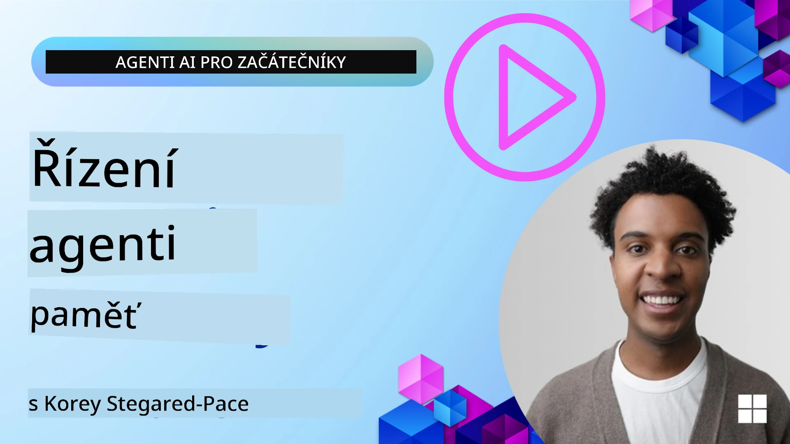

# Paměť pro AI agenty 

Při diskusi o jedinečných výhodách vytváření AI agentů se hlavně probírají dvě věci: schopnost volat nástroje k dokončení úkolů a schopnost se časem zlepšovat. Paměť je základem pro vytvoření agentů, kteří se sami zlepšují a mohou tak vytvářet lepší zkušenosti pro naše uživatele.

V této lekci se podíváme na to, co paměť znamená pro AI agenty, jak ji spravovat a využívat ve prospěch našich aplikací.

## Úvod

Tato lekce pokryje:

• **Porozumění paměti AI agentů**: Co paměť je a proč je pro agenty nezbytná.

• **Implementace a ukládání paměti**: Praktické metody pro přidání paměťových schopností vašim AI agentům se zaměřením na krátkodobou a dlouhodobou paměť.

• **Jak AI agenti mohou být samoučící se**: Jak jim paměť umožňuje učit se z minulých interakcí a s časem se zlepšovat.

## Dostupné implementace

Tato lekce obsahuje dva komplexní notebookové tutoriály:

• **[13-agent-memory.ipynb](./13-agent-memory.ipynb)**: Implementuje paměť pomocí Mem0 a Azure AI Search s Microsoft Agent Frameworkem

• **[13-agent-memory-cognee.ipynb](./13-agent-memory-cognee.ipynb)**: Implementuje strukturovanou paměť pomocí Cognee, automaticky buduje znalostní graf podporovaný embeddingy, vizualizuje graf a umožňuje inteligentní vyhledávání

## Cíle učení

Po dokončení této lekce budete umět:

• **Rozlišovat mezi různými typy paměti AI agentů**, včetně pracovní, krátkodobé a dlouhodobé paměti, jakož i specializovaných forem jako persona a episodická paměť.

• **Implementovat a spravovat krátkodobou a dlouhodobou paměť AI agentů** pomocí Microsoft Agent Frameworku, využívající nástroje jako Mem0, Cognee, Whiteboard paměť a integraci s Azure AI Search.

• **Porozumět principům samoučících se AI agentů** a jak robustní správa paměti přispívá k neustálému učení a adaptaci.

## Porozumění paměti AI agentů

V jádru **paměť AI agentů označuje mechanismy, které jim umožňují uchovávat a vybavovat si informace**. Tyto informace mohou být konkrétní detaily o konverzaci, preference uživatele, minulé akce nebo dokonce naučené vzory.

Bez paměti jsou AI aplikace často bezstavové, což znamená, že každá interakce začíná od začátku. To vede k opakující se a frustrující uživatelské zkušenosti, kde agent „zapomíná“ předchozí kontext nebo preference.

### Proč je paměť důležitá?

Inteligence agenta je hluboce spjata s jeho schopností vybavovat si a využívat minulé informace. Paměť umožňuje agentům být:

• **Reflexivní**: Učit se z minulých akcí a výsledků.

• **Interaktivní**: Udržovat kontext probíhající konverzace.

• **Proaktivní a reaktivní**: Očekávat potřeby nebo odpovídat vhodně na základě historických dat.

• **Autonomní**: Pracovat nezávisleji čerpáním ze uložených znalostí.

Cílem implementace paměti je učinit agentů spolehlivějšími a schopnějšími.

### Typy paměti

#### Pracovní paměť

Představte si ji jako kus poznámkového papíru, který agent používá během jednoho probíhajícího úkolu nebo myšlenkového procesu. Uchovává okamžité informace potřebné k vypočtení dalšího kroku.

Pro AI agenty pracovní paměť často zachycuje nejdůležitější informace z konverzace, i když je celá historie chatu dlouhá nebo zkrácená. Zaměřuje se na extrakci klíčových prvků jako požadavky, návrhy, rozhodnutí a akce.

**Příklad pracovní paměti**

U cestovního agenta může pracovní paměť zachytit aktuální požadavek uživatele, například „Chci rezervovat cestu do Paříže“. Tento konkrétní požadavek je v agentově bezprostředním kontextu, aby vedl aktuální interakci.

#### Krátkodobá paměť

Tento typ paměti uchovává informace po dobu jedné konverzace nebo relace. Je to kontext současného chatu, který umožňuje agentovi odkazovat zpět na předchozí výměny v dialogu.

V příkladech [Microsoft Agent Framework](https://github.com/microsoft/agent-framework) Python SDK odpovídá `AgentSession`, vytvořená příkazem `agent.create_session()`. Relace je integrovaná krátkodobá paměť frameworku: udržuje kontext konverzace dostupný, dokud je relace znovu používána, ale tento kontext se neukládá po ukončení relace nebo restartu aplikace. Pro fakta a preference, které musí přežít mezi relacemi, používejte dlouhodobou paměť, obvykle přes databázi, vektorový index nebo jiné trvalé úložiště.

**Příklad krátkodobé paměti**

Pokud se uživatel zeptá „Kolik by stál let do Paříže?“ a pak naváže otázkou „A co ubytování tam?“, krátkodobá paměť zajistí, že agent ví, že „tam“ znamená „Paříž“ v rámci téže konverzace.

#### Dlouhodobá paměť

Jedná se o informace, které přetrvávají přes více konverzací nebo relací. Umožňuje agentům pamatovat si uživatelské preference, historické interakce nebo obecné znalosti po dlouhé období. To je důležité pro personalizaci.

**Příklad dlouhodobé paměti**

Dlouhodobá paměť může uchovávat informaci, že „Ben má rád lyžování a outdoorové aktivity, chutná mu káva s výhledem na hory a kvůli minulému zranění se chce vyhnout náročným lyžařským tratím“. Tyto znalosti získané z předchozích interakcí ovlivňují doporučení při budoucím plánování cest, což je činí vysoce personalizovanými.

#### Persona paměť

Tento specializovaný typ paměti pomáhá agentovi vyvíjet konzistentní „osobnost“ nebo „personu“. Umožňuje agentovi pamatovat si detaily o sobě nebo o své zamýšlené roli, díky čemuž jsou interakce plynulejší a zaměřené.

**Příklad persona paměti**
Pokud je cestovní agent navržen jako „expert na plánování lyžařských výletů“, persona paměť může tuto roli posilovat a ovlivňuje jeho odpovědi tak, aby odpovídaly tónu a znalostem odborníka.

#### Workflow/Episodická paměť

Tato paměť uchovává sled kroků, které agent podniká během složitého úkolu, včetně úspěchů a neúspěchů. Je to jako pamatování si konkrétních „epizod“ nebo minulých zkušeností, ze kterých se agent učí.

**Příklad episodické paměti**

Pokud se agent pokusil rezervovat konkrétní let, ale z důvodu nedostupnosti selhal, episodická paměť může zaznamenat tento neúspěch, což umožní agentovi zkusit alternativní lety nebo uživatele informovat o problému lépe při dalším pokusu.

#### Paměť entit

Tato paměť zahrnuje extrakci a zapamatování specifických entit (jako osoby, místa nebo věci) a událostí z konverzací. Umožňuje agentovi budovat strukturované porozumění klíčovým prvkům diskutovaným v konverzaci.

**Příklad paměti entit**

Z konverzace o minulé cestě může agent extrahovat entity jako „Paříž“, „Eiffelova věž“ a „večeře v restauraci Le Chat Noir“. Při budoucí interakci si agent může vzpomenout na „Le Chat Noir“ a nabídnout nové rezervace tam.

#### Strukturovaný RAG (Retrieval Augmented Generation)

RAG je širší technika, ale „Strukturovaný RAG“ je vyzdvihován jako výkonná paměťová technologie. Extrahuje husté, strukturované informace z různých zdrojů (konverzace, emaily, obrázky) a používá je ke zvýšení přesnosti, vybavování a rychlosti odpovědí. Na rozdíl od klasického RAG, který spoléhá pouze na sémantickou podobnost, Strukturovaný RAG pracuje s vnitřní strukturou informací.

**Příklad Strukturovaného RAG**

Místo pouhého hledání klíčových slov může Strukturovaný RAG analyzovat detaily letu (destinace, datum, čas, letecká společnost) z emailu a uložit je strukturovaně. To umožňuje přesné dotazy jako „Jaký let jsem si rezervoval do Paříže v úterý?“.

## Implementace a ukládání paměti

Implementace paměti pro AI agenty zahrnuje systematický proces **správy paměti**, který zahrnuje generování, ukládání, vyhledávání, integraci, aktualizaci a dokonce i „zapomínání“ (nebo mazání) informací. Retrieval (vyhledávání) je zvlášť důležitý aspekt.

### Specializované nástroje pro paměť

#### Mem0

Jedním ze způsobů, jak uložit a spravovat paměť agenta, je použití specializovaných nástrojů jako Mem0. Mem0 funguje jako vrstva perzistentní paměti, která agentům umožňuje vybavovat si relevantní interakce, ukládat uživatelské preference a faktický kontext a učit se z úspěchů a nezdarů v průběhu času. Myšlenkou je, že bezstavoví agenti se mění na stavové.

Funguje přes **dvoufázový paměťový proces: extrakce a aktualizace**. Nejprve jsou zprávy přidané do vlákna agenta odeslány do služby Mem0, která používá velký jazykový model (LLM) k shrnutí historie konverzace a extrakci nových vzpomínek. Následně fáze řízená LLM rozhodne, zda tyto vzpomínky přidat, upravit nebo smazat a uloží je do hybridního datového úložiště, které může zahrnovat vektorové, grafové a klíč-hodnota databáze. Systém také podporuje různé typy paměti a může začlenit grafovou paměť pro správu vztahů mezi entitami.

#### Cognee

Dalším silným přístupem je použití **Cognee**, open-source sémantické paměti pro AI agenty, která transformuje strukturovaná i nestrukturovaná data do dotazovatelných znalostních grafů podpořených embeddingy. Cognee poskytuje **architekturu s dvojitým úložištěm**, která kombinuje vyhledávání podobnosti vektorů s grafovými vztahy, což umožňuje agentům rozumět nejen tomu, jaké informace jsou podobné, ale jak jsou koncepty navzájem propojeny.

Vyniká ve **hybridním vyhledávání**, které kombinuje vektorovou podobnost, strukturu grafu a uvažování LLM - od přímého vyhledávání v datech po zodpovídání otázek s ohledem na graf. Systém udržuje **aktivní paměť**, která se vyvíjí a roste, zatímco je stále dotazovatelná jako jeden propojený graf, podporující jak krátkodobý kontext relace, tak dlouhodobou trvalou paměť.

Notebookový tutoriál Cognee ([13-agent-memory-cognee.ipynb](./13-agent-memory-cognee.ipynb)) ukazuje stavbu této sjednocené paměťové vrstvy s praktickými příklady vkládání různých zdrojů dat, vizualizace znalostního grafu a dotazování pomocí různých vyhledávacích strategií přizpůsobených potřebám agenta.

### Ukládání paměti pomocí RAG

Kromě specializovaných paměťových nástrojů jako Mem0 můžete využít robustní vyhledávací služby jako **Azure AI Search jako backend pro ukládání a vyhledávání vzpomínek**, hlavně pro strukturovaný RAG.

To umožňuje založit odpovědi agenta na vlastních datech a zajistit tak relevantnější a přesnější odpovědi. Azure AI Search lze použít k ukládání uživatelských cestovních vzpomínek, katalogů produktů nebo jakýchkoli jiných doménově specifických znalostí.

Azure AI Search podporuje funkce jako **Strukturovaný RAG**, který vyniká ve vyhledávání a zpřesňování hustých, strukturovaných informací z velkých datových sad, například historií konverzací, emailů nebo dokonce obrázků. To poskytuje „nadlidskou přesnost a vybavování“ oproti tradičním metodám dělení textu a embeddingu.

## Jak učinit AI agenty samoučícími se

Častý vzorec samoučících se agentů zahrnuje zavedení **„znalostního agenta“**. Tento samostatný agent sleduje hlavní konverzaci mezi uživatelem a primárním agentem. Jeho úkolem je:

1. **Identifikovat cenné informace**: Určit, zda je část konverzace hodná uložení jako obecná znalost nebo specifická uživatelská preference.

2. **Extrahovat a shrnout**: Destilovat podstatné učení nebo preferenci z konverzace.

3. **Uložit do znalostní báze**: Trvale uložit extrahované informace, často do vektorové databáze, aby byly později dostupné.

4. **Rozšířit budoucí dotazy**: Když uživatel zahájí nový dotaz, znalostní agent vyhledá relevantní uložené informace a připojí je k uživatelově zadání, což poskytuje klíčový kontext primárnímu agentovi (podobně jako RAG).

### Optimalizace pro paměť

• **Řízení latence**: Aby se předešlo zpomalení uživatelských interakcí, může být zpočátku použit levnější a rychlejší model, který rychle zkontroluje, zda je informace vhodná pro uložení nebo vyhledání, a složitější proces extrakce/vyhledávání se spustí jen pokud je to nutné.

• **Údržba znalostní báze**: Pro rostoucí znalostní bázi lze méně často používané informace přesunout do „studeného úložiště“ za účelem řízení nákladů.

## Máte další otázky ohledně paměti agentů?

Přidejte se na [Microsoft Foundry Discord](https://discord.com/invite/ATgtXmAS5D), kde se můžete setkat s ostatními studenty, účastnit se konzultací a získat odpovědi na své otázky ohledně AI agentů.

---

<!-- CO-OP TRANSLATOR DISCLAIMER START -->
**Prohlášení o omezení odpovědnosti**:
Tento dokument byl přeložen pomocí AI překladatelské služby [Co-op Translator](https://github.com/Azure/co-op-translator). Přestože usilujeme o co největší přesnost, mějte prosím na paměti, že automatizované překlady mohou obsahovat chyby nebo nepřesnosti. Originální dokument v jeho mateřském jazyce by měl být považován za autoritativní zdroj. Pro kritické informace se doporučuje profesionální lidský překlad. Nejsme odpovědní za jakékoli nedorozumění nebo nesprávné interpretace vzniklé použitím tohoto překladu.
<!-- CO-OP TRANSLATOR DISCLAIMER END -->