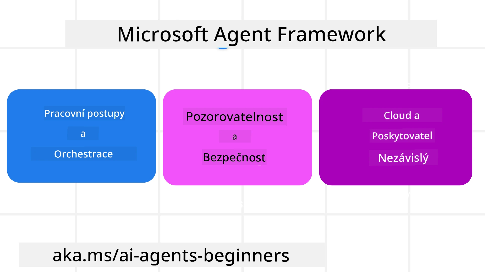

# Prozkoumání Microsoft Agent Framework


### Úvod

Tato lekce pokryje:

- Pochopení Microsoft Agent Framework: Klíčové vlastnosti a hodnota  
- Prozkoumání klíčových konceptů Microsoft Agent Framework
- Pokročilé vzory MAF: Workflows, middleware a paměť

## Cíle učení

Po dokončení této lekce budete vědět, jak:

- Vytvořit produkčně připravené AI agenty pomocí Microsoft Agent Framework
- Aplikovat základní funkce Microsoft Agent Framework na vaše agentní případy užití
- Používat pokročilé vzory včetně workflows, middleware a sledovatelnosti

## Vzorky kódu

Vzorky kódu pro [Microsoft Agent Framework (MAF)](https://aka.ms/ai-agents-beginners/agent-framewrok) lze nalézt v tomto repozitáři v souborech `xx-python-agent-framework` a `xx-dotnet-agent-framework`.

## Pochopení Microsoft Agent Framework



[Microsoft Agent Framework (MAF)](https://aka.ms/ai-agents-beginners/agent-framewrok) je jednotný framework Microsoftu pro vytváření AI agentů. Nabízí flexibilitu řešit širokou škálu agentních případů užití, které se objevují jak v produkčním, tak v akademickém prostředí, včetně:

- **Sekvenční orchestrace agentů** ve scénářích, kde je potřeba krok za krokem workflow.
- **Současná orchestrace** ve scénářích, kde agenti dokončují úkoly současně.
- **Orchestrace skupinového chatu** ve scénářích, kdy agenti mohou spolupracovat na jednom úkolu.
- **Předávání úkolů v orchestrace** ve scénářích, kdy agenti předávají úkol jeden druhému, jakmile jsou podúkoly dokončeny.
- **Magnetická orchestrace** ve scénářích, kde manažerský agent vytváří a modifikuje seznam úkolů a koordinuje podagenty, aby úkol dokončili.

Pro doručení AI agentů do produkce má MAF také zabudované funkce pro:

- **Sledovatelnost** pomocí OpenTelemetry, kdy každý krok AI agenta včetně volání nástrojů, orchestrací, toků uvažování a monitoringu výkonu je viditelný přes Microsoft Foundry dashboardy.
- **Bezpečnost** díky nativnímu hostingu agentů na Microsoft Foundry s bezpečnostními kontrolami jako role-based access, zpracováním soukromých dat a zabudovanou bezpečností obsahu.
- **Trvanlivost** protože vlákna a workflows agentů mohou být pauzována, obnovena a zotavena z chyb, což umožňuje delší běh procesů.
- **Kontrolu** díky podpoře workflownů se zapojením člověka, kde jsou úkoly označeny jako vyžadující schválení člověkem.

Microsoft Agent Framework je také zaměřen na interoperabilitu tím, že:

- **Je nezávislý na cloudu** - agenti mohou běžet v kontejnerech, lokálně i na vícero různých cloudech.
- **Je nezávislý na poskytovateli** - agenti mohou být vytvářeni přes váš preferovaný SDK včetně Azure OpenAI a OpenAI.
- **Integruje otevřené standardy** - agenti mohou používat protokoly jako Agent-to-Agent (A2A) a Model Context Protocol (MCP) pro objevování a využívání jiných agentů a nástrojů.
- **Pluginy a konektory** - připojení k datovým a paměťovým službám jako Microsoft Fabric, SharePoint, Pinecone a Qdrant.

Podívejme se, jak jsou tyto funkce aplikovány na některé klíčové koncepty Microsoft Agent Framework.

## Klíčové koncepty Microsoft Agent Framework

### Agenti


**Vytváření agentů**

Vytvoření agenta spočívá v definování inference služby (LLM poskytovatele), sady instrukcí, které má AI agent následovat, a přiřazeného `name`:

```python
agent = AzureOpenAIChatClient(credential=AzureCliCredential()).create_agent( instructions="You are good at recommending trips to customers based on their preferences.", name="TripRecommender" )
```

Výše uvedený příklad používá `Azure OpenAI`, ale agenti mohou být vytvořeni s využitím různých služeb včetně `Microsoft Foundry Agent Service`:

```python
AzureAIAgentClient(async_credential=credential).create_agent( name="HelperAgent", instructions="You are a helpful assistant." ) as agent
```

OpenAI `Responses`, `ChatCompletion` API

```python
agent = OpenAIResponsesClient().create_agent( name="WeatherBot", instructions="You are a helpful weather assistant.", )
```

```python
agent = OpenAIChatClient().create_agent( name="HelpfulAssistant", instructions="You are a helpful assistant.", )
```

nebo vzdálených agentů přes A2A protokol:

```python
agent = A2AAgent( name=agent_card.name, description=agent_card.description, agent_card=agent_card, url="https://your-a2a-agent-host" )
```

**Spouštění agentů**

Agenti jsou spouštěni pomocí metod `.run` nebo `.run_stream` pro ne-streamované nebo streamované odpovědi.

```python
result = await agent.run("What are good places to visit in Amsterdam?")
print(result.text)
```

```python
async for update in agent.run_stream("What are the good places to visit in Amsterdam?"):
    if update.text:
        print(update.text, end="", flush=True)

```

Každé spuštění agenta může mít také parametry pro přizpůsobení jako `max_tokens`, které agent používá, `tools`, které může agent volat, a dokonce `model` samotný použitý agentem.

To je užitečné v případech, kdy jsou pro splnění uživatelského úkolu vyžadovány specifické modely nebo nástroje.

**Nástroje**

Nástroje lze definovat jak při definování agenta:

```python
def get_attractions( location: Annotated[str, Field(description="The location to get the top tourist attractions for")], ) -> str: """Get the top tourist attractions for a given location.""" return f"The top attractions for {location} are." 


# Při přímém vytváření ChatAgenta

agent = ChatAgent( chat_client=OpenAIChatClient(), instructions="You are a helpful assistant", tools=[get_attractions]

```

tak také při spouštění agenta:

```python

result1 = await agent.run( "What's the best place to visit in Seattle?", tools=[get_attractions] # Nástroj poskytnutý pouze pro tento běh )
```

**Vlákna agentů**

Vlákna agentů se používají k vedení vícekrokových konverzací. Vlákna lze vytvořit buď:

- Použitím `get_new_thread()`, které umožňuje vlákno ukládat v čase
- Automatickým vytvořením vlákna při spuštění agenta, kde vlákno trvá pouze během aktuálního spuštění.

Pro vytvoření vlákna kód vypadá takto:

```python
# Vytvořte nový vlákno.
thread = agent.get_new_thread() # Spusťte agenta s tímto vláknem.
response = await agent.run("Hello, I am here to help you book travel. Where would you like to go?", thread=thread)

```

Vlákno lze pak serializovat a uložit pro pozdější použití:

```python
# Vytvořte nový vlákno.
thread = agent.get_new_thread() 

# Spusťte agenta s vláknem.

response = await agent.run("Hello, how are you?", thread=thread) 

# Serializujte vlákno pro uložení.

serialized_thread = await thread.serialize() 

# Deserializujte stav vlákna po načtení z úložiště.

resumed_thread = await agent.deserialize_thread(serialized_thread)
```

**Middleware agentů**

Agenti spolupracují s nástroji a LLM, aby dokončili uživatelské úkoly. V určitých scénářích chceme vykonat nebo zaznamenat akce mezi těmito interakcemi. Middleware agentů nám to umožňuje prostřednictvím:

*Funkčního middleware*

Tento middleware umožňuje spustit akci mezi agentem a funkcí/nástrojem, který volá. Příklad použití je zaznamenávání volání funkce.

V níže uvedeném kódu `next` definuje, zda by měl být zavolán další middleware nebo samotná funkce.

```python
async def logging_function_middleware(
    context: FunctionInvocationContext,
    next: Callable[[FunctionInvocationContext], Awaitable[None]],
) -> None:
    """Function middleware that logs function execution."""
    # Předzpracování: Zaznamenat před vykonáním funkce
    print(f"[Function] Calling {context.function.name}")

    # Pokračovat na další middleware nebo vykonání funkce
    await next(context)

    # Pozpracování: Zaznamenat po vykonání funkce
    print(f"[Function] {context.function.name} completed")
```

*Chat middleware*

Tento middleware nám umožňuje spustit nebo zaznamenat akci mezi agentem a požadavky mezi LLM.

Obsahuje důležité informace jako `messages`, které se odesílají AI službě.

```python
async def logging_chat_middleware(
    context: ChatContext,
    next: Callable[[ChatContext], Awaitable[None]],
) -> None:
    """Chat middleware that logs AI interactions."""
    # Předzpracování: Záznam před voláním AI
    print(f"[Chat] Sending {len(context.messages)} messages to AI")

    # Pokračovat k dalšímu middleware nebo službě AI
    await next(context)

    # Poté zpracování: Záznam po odpovědi AI
    print("[Chat] AI response received")

```

**Paměť agentů**

Jak bylo pokryto v lekci `Agentic Memory`, paměť je důležitý prvek, který agentovi umožňuje operovat v různých kontextech. MAF nabízí několik typů paměti:

*Paměť v aplikaci (In-Memory Storage)*

Paměť ukládaná ve vláknech během běhu aplikace.

```python
# Vytvořit nový vlákno.
thread = agent.get_new_thread() # Spustit agenta s vláknem.
response = await agent.run("Hello, I am here to help you book travel. Where would you like to go?", thread=thread)
```

*Perzistentní zprávy*

Tato paměť se používá ke skladování historie konverzace napříč různými sezeními. Definuje se pomocí `chat_message_store_factory`:

```python
from agent_framework import ChatMessageStore

# Vytvořit vlastní úložiště zpráv
def create_message_store():
    return ChatMessageStore()

agent = ChatAgent(
    chat_client=OpenAIChatClient(),
    instructions="You are a Travel assistant.",
    chat_message_store_factory=create_message_store
)

```

*Dynamická paměť*

Tato paměť je přidána do kontextu před spuštěním agentů. Tyto paměti mohou být uloženy v externích službách jako mem0:

```python
from agent_framework.mem0 import Mem0Provider

# Použití Mem0 pro pokročilé paměťové možnosti
memory_provider = Mem0Provider(
    api_key="your-mem0-api-key",
    user_id="user_123",
    application_id="my_app"
)

agent = ChatAgent(
    chat_client=OpenAIChatClient(),
    instructions="You are a helpful assistant with memory.",
    context_providers=memory_provider
)

```

**Sledovatelnost agentů**

Sledovatelnost je důležitá pro vytváření spolehlivých a udržitelných agentních systémů. MAF integruje OpenTelemetry pro poskytování trace a metrik pro lepší sledovatelnost.

```python
from agent_framework.observability import get_tracer, get_meter

tracer = get_tracer()
meter = get_meter()
with tracer.start_as_current_span("my_custom_span"):
    # udělej něco
    pass
counter = meter.create_counter("my_custom_counter")
counter.add(1, {"key": "value"})
```

### Workflows

MAF nabízí workflows, což jsou předdefinované kroky pro dokončení úkolu a zahrnují AI agenty jako komponenty těchto kroků.

Workflows jsou tvořeny různými komponentami pro lepší řízení toku. Workflows také umožňují **multi-agentní orchestrace** a **checkpointing** pro ukládání stavů workflows.

Základní komponenty workflow jsou:

**Executory**

Executory přijímají vstupní zprávy, vykonávají přiřazené úkoly a poté produkují výstupní zprávu. Posouvají workflow směrem k dokončení většího úkolu. Executory mohou být AI agenti nebo vlastní logika.

**Hrany (Edges)**

Hrany definují tok zpráv ve workflow. Mohou být:

*Přímé hrany* - Jednoduchá propojení jeden na jednoho mezi executory:

```python
from agent_framework import WorkflowBuilder

builder = WorkflowBuilder()
builder.add_edge(source_executor, target_executor)
builder.set_start_executor(source_executor)
workflow = builder.build()
```

*Podmíněné hrany* - Aktivovány po splnění určité podmínky. Například pokud nejsou dostupné hotelové pokoje, executor může navrhnout jiné možnosti.

*Switch-case hrany* - Směřují zprávy k různým executorům podle definovaných podmínek. Například pokud má cestující prioritu a jeho úkoly jsou řešeny přes jiný workflow.

*Fan-out hrany* - Odkazují jednu zprávu na více cílů.

*Fan-in hrany* - Sbírají více zpráv z různých executorů a posílají je jednomu cíli.

**Události**

Pro lepší sledovatelnost workflows nabízí MAF zabudované události pro vykonávání, včetně:

- `WorkflowStartedEvent` – začátek provádění workflow
- `WorkflowOutputEvent` – workflow generuje výstup
- `WorkflowErrorEvent` – workflow narazí na chybu
- `ExecutorInvokeEvent` – executor zahajuje zpracování
- `ExecutorCompleteEvent` – executor dokončuje zpracování
- `RequestInfoEvent` – je vystaven požadavek

## Pokročilé vzory MAF

Výše uvedené sekce pokrývají klíčové koncepty Microsoft Agent Framework. Při vytváření složitějších agentů zde jsou některé pokročilé vzory, které stojí za zvážení:

- **Skládání middleware**: Řetězit několik middleware handlerů (logování, autentizace, rate-limiting) pomocí funkčního a chat middleware pro jemnější kontrolu chování agentů.
- **Checkpointing workflow**: Používat události workflow a serializaci pro ukládání a obnovení dlouhotrvajících agentních procesů.
- **Dynamický výběr nástrojů**: Kombinovat RAG přes popisy nástrojů s registrací nástrojů v MAF tak, aby byly zobrazeny pouze relevantní nástroje pro každý dotaz.
- **Multi-agentní předávání úkolů**: Používat hrany workflow a podmíněné směrování k orchestrace předávání mezi specializovanými agenty.

## Vzorky kódu

Vzorky kódu pro Microsoft Agent Framework lze nalézt v tomto repozitáři v souborech `xx-python-agent-framework` a `xx-dotnet-agent-framework`.

## Máte další otázky ohledně Microsoft Agent Framework?

Připojte se na [Microsoft Foundry Discord](https://aka.ms/ai-agents/discord), kde se můžete setkat s dalšími studenty, zúčastnit se kancelářských hodin a nechat si zodpovědět své otázky o AI agentech.

---

<!-- CO-OP TRANSLATOR DISCLAIMER START -->
**Prohlášení o vyloučení odpovědnosti**:  
Tento dokument byl přeložen pomocí AI překladatelské služby [Co-op Translator](https://github.com/Azure/co-op-translator). Přestože usilujeme o přesnost, vezměte prosím na vědomí, že automatické překlady mohou obsahovat chyby nebo nepřesnosti. Originální dokument v jeho původním jazyce by měl být považován za autoritativní zdroj. Pro kritické informace se doporučuje profesionální lidský překlad. Nejsme odpovědní za jakékoliv nedorozumění nebo nesprávné interpretace vyplývající z použití tohoto překladu.
<!-- CO-OP TRANSLATOR DISCLAIMER END -->