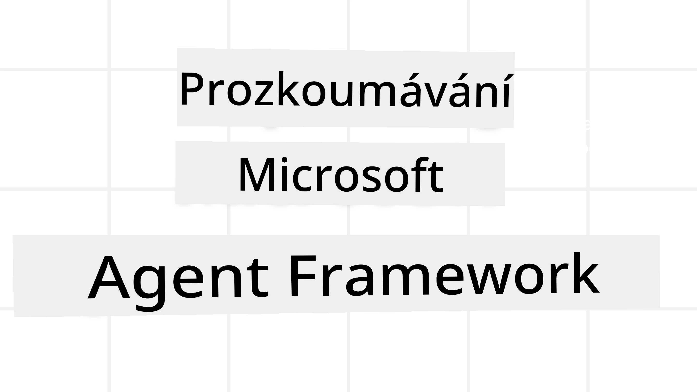
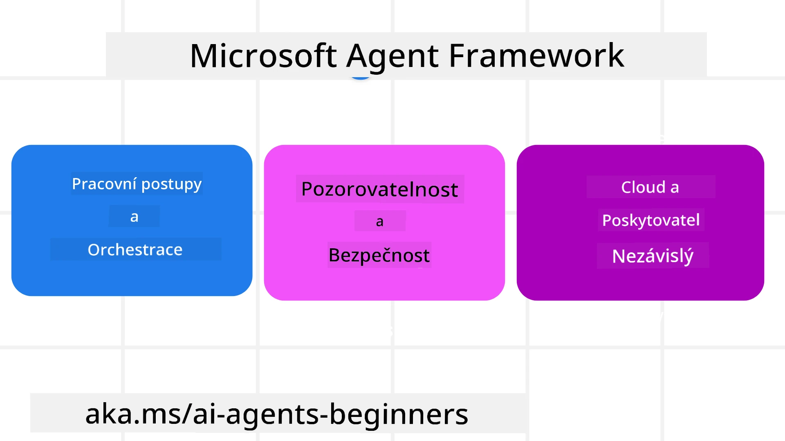
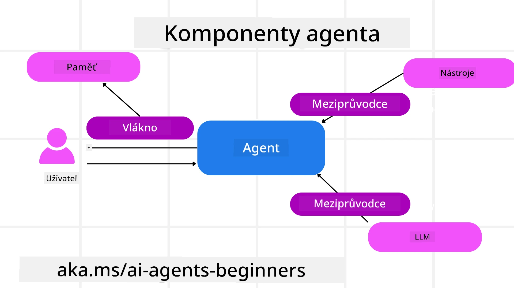

# Prozkoumávání Microsoft Agent Framework



### Úvod

Tato lekce pokryje:

- Porozumění Microsoft Agent Framework: Klíčové vlastnosti a hodnota  
- Prozkoumání klíčových konceptů Microsoft Agent Framework
- Pokročilé vzory MAF: Pracovní postupy, middleware a paměť

## Výukové cíle

Po dokončení této lekce budete umět:

- Vytvářet produkčně připravené AI agenty pomocí Microsoft Agent Framework
- Aplikovat základní funkce Microsoft Agent Framework pro vaše agentní scénáře použití
- Používat pokročilé vzory včetně pracovních postupů, middleware a observability

## Ukázky kódu 

Ukázky kódu pro [Microsoft Agent Framework (MAF)](https://learn.microsoft.com/en-us/agent-framework/overview/?wt.mc_id=youtube_26688_organicsocial_reactor&pivots=programming-language-python) naleznete v tomto repozitáři v souborech `xx-python-agent-framework` a `xx-dotnet-agent-framework`.

## Porozumění Microsoft Agent Framework



[Microsoft Agent Framework (MAF)](https://learn.microsoft.com/en-us/agent-framework/overview/?wt.mc_id=youtube_26688_organicsocial_reactor&pivots=programming-language-python) je jednotný rámec Microsoftu pro vytváření AI agentů. Nabízí flexibilitu k řešení široké škály agentních scénářů použití, jak v produkčních, tak výzkumných prostředích, včetně:

- **Sekvenční orchestraci agentů** v situacích, kdy jsou potřeba krokové pracovní postupy.
- **Současnou orchestraci** v situacích, kdy agenti musí plnit úkoly souběžně.
- **Orchestraci skupinové konverzace** v situacích, kdy agenti mohou spolupracovat na jednom úkolu.
- **Orchestraci předávání** v situacích, kdy si agenti předávají úkol, jakmile se dokončí dílčí úkoly.
- **Magnetickou orchestraci** v situacích, kdy manažerský agent vytváří a upravuje seznam úkolů a koordinuje pod-agenty, aby úkol dokončili.

Pro nasazení AI agentů v produkci obsahuje MAF také funkce pro:

- **Sledovatelnost (Observability)** pomocí OpenTelemetry, kde je zaznamenána každá akce AI agenta včetně volání nástrojů, kroků orchestrace, toků uvažování a monitorování výkonu přes Microsoft Foundry dashboardy.
- **Bezpečnost**, protože agenti jsou hostováni nativně na Microsoft Foundry, který zahrnuje bezpečnostní kontroly jako přístup na základě rolí, zpracování soukromých dat a vestavěnou bezpečnost obsahu.
- **Odolnost (Durability)**, protože vlákna agentů a pracovní postupy mohou pauznout, pokračovat a zotavovat se z chyb, což umožňuje delší běhy procesů.
- **Kontrolu**, protože jsou podporovány pracovní postupy s lidským dohledem, kde úkoly jsou označeny jako vyžadující lidské schválení.

Microsoft Agent Framework se také zaměřuje na interoperabilitu díky:

- **Nezávislosti na cloudu** - agenti mohou běžet v kontejnerech, on-premises i napříč více cloudy.
- **Nezávislosti na poskytovateli** - agenti mohou být vytvořeni pomocí vašeho preferovaného SDK včetně Azure OpenAI a OpenAI.
- **Integraci otevřených standardů** - agenti mohou využívat protokoly jako Agent-to-Agent (A2A) a Model Context Protocol (MCP) k objevování a používání dalších agentů a nástrojů.
- **Pluginy a konektory** - Připojení mohou být realizována k datovým a paměťovým službám jako Microsoft Fabric, SharePoint, Pinecone a Qdrant.

Podívejme se, jak jsou tyto funkce aplikovány na některé základní koncepty Microsoft Agent Framework.

## Klíčové koncepty Microsoft Agent Framework

### Agenti



**Vytváření agentů**

Vytvoření agenta probíhá definováním inference služby (poskytovatel LLM), 
sady instrukcí, které má AI agent následovat, a přiděleného `name`:

```python
agent = AzureOpenAIChatClient(credential=AzureCliCredential()).create_agent( instructions="You are good at recommending trips to customers based on their preferences.", name="TripRecommender" )
```

Výše je použito `Azure OpenAI`, ale agenti mohou být vytvářeni pomocí různých služeb včetně `Microsoft Foundry Agent Service`:

```python
AzureAIAgentClient(async_credential=credential).create_agent( name="HelperAgent", instructions="You are a helpful assistant." ) as agent
```

OpenAI API `Responses`, `ChatCompletion`

```python
agent = OpenAIResponsesClient().create_agent( name="WeatherBot", instructions="You are a helpful weather assistant.", )
```

```python
agent = OpenAIChatClient().create_agent( name="HelpfulAssistant", instructions="You are a helpful assistant.", )
```

nebo [MiniMax](https://platform.minimaxi.com/), který poskytuje OpenAI-kompatibilní API s velkými kontextovými okny (až 204K tokenů):

```python
agent = OpenAIChatClient(base_url="https://api.minimax.io/v1", api_key=os.environ["MINIMAX_API_KEY"], model_id="MiniMax-M3").create_agent( name="HelpfulAssistant", instructions="You are a helpful assistant.", )
```

nebo vzdálené agenty používající protokol A2A:

```python
agent = A2AAgent( name=agent_card.name, description=agent_card.description, agent_card=agent_card, url="https://your-a2a-agent-host" )
```

**Spouštění agentů**

Agenti jsou spouštěni metodami `.run` nebo `.run_stream` pro non-streaming nebo streaming odpovědi.

```python
result = await agent.run("What are good places to visit in Amsterdam?")
print(result.text)
```

```python
async for update in agent.run_stream("What are the good places to visit in Amsterdam?"):
    if update.text:
        print(update.text, end="", flush=True)

```

Každé spuštění agenta může mít také volby pro přizpůsobení parametrů jako `max_tokens` použitých agentem, `tools`, které agent může volat, a dokonce i samotný `model` používaný agentem.

To je užitečné v případech, kdy jsou pro splnění úkolu uživatele požadovány specifické modely nebo nástroje.

**Nástroje**

Nástroje lze definovat jak při definici agenta:

```python
def get_attractions( location: Annotated[str, Field(description="The location to get the top tourist attractions for")], ) -> str: """Get the top tourist attractions for a given location.""" return f"The top attractions for {location} are." 


# Při přímém vytváření ChatAgenta

agent = ChatAgent( chat_client=OpenAIChatClient(), instructions="You are a helpful assistant", tools=[get_attractions]

```

a také při spouštění agenta:

```python

result1 = await agent.run( "What's the best place to visit in Seattle?", tools=[get_attractions] # Nástroj poskytovaný pouze pro tento běh )
```

**Vlákna agentů**

Vlákna agentů slouží k obsluze konverzací více kol. Vlákna mohou být vytvořena buď:

- Použitím `get_new_thread()`, což umožňuje vlákno v průběhu času uložit
- Automatickým vytvořením vlákna při spuštění agenta, kde vlákno trvá jen během aktuálního běhu.

K vytvoření vlákna vypadá kód takto:

```python
# Vytvořte nový vlákno.
thread = agent.get_new_thread() # Spusťte agenta s tímto vláknem.
response = await agent.run("Hello, I am here to help you book travel. Where would you like to go?", thread=thread)

```

Poté můžete vlákno serializovat pro pozdější použití:

```python
# Vytvořit nový vlákno.
thread = agent.get_new_thread() 

# Spustit agenta s vláknem.

response = await agent.run("Hello, how are you?", thread=thread) 

# Serializovat vlákno pro uložení.

serialized_thread = await thread.serialize() 

# Deserializovat stav vlákna po načtení z úložiště.

resumed_thread = await agent.deserialize_thread(serialized_thread)
```

**Middleware agentů**

Agent s nástroji a LLM interaguje k plnění úkolů uživatele. V určitých scénářích chceme provést nebo zaznamenat akci mezi těmito interakcemi. Middleware agentů to umožňuje prostřednictvím:

*Function Middleware*

Toto middleware nám umožňuje provést akci mezi agentem a funkcí/nástrojem, který volá. Příklad použití je, když chcete zaznamenat volání funkce.

V kódu níže `next` určuje, zda má být voláno další middleware nebo samotná funkce.

```python
async def logging_function_middleware(
    context: FunctionInvocationContext,
    next: Callable[[FunctionInvocationContext], Awaitable[None]],
) -> None:
    """Function middleware that logs function execution."""
    # Předzpracování: Zaznamenat před vykonáním funkce
    print(f"[Function] Calling {context.function.name}")

    # Pokračovat na další middleware nebo vykonání funkce
    await next(context)

    # Pozpracování: Zaznamenat po vykonání funkce
    print(f"[Function] {context.function.name} completed")
```

*Chat Middleware*

Toto middleware nám umožňuje provést nebo zaznamenat akci mezi agentem a požadavky zasílanými LLM.

Obsahuje důležité informace jako `messages`, které jsou zasílány AI službě.

```python
async def logging_chat_middleware(
    context: ChatContext,
    next: Callable[[ChatContext], Awaitable[None]],
) -> None:
    """Chat middleware that logs AI interactions."""
    # Předzpracování: Záznam před voláním AI
    print(f"[Chat] Sending {len(context.messages)} messages to AI")

    # Pokračovat na další middleware nebo AI službu
    await next(context)

    # Post-processing: Záznam po odpovědi AI
    print("[Chat] AI response received")

```

**Paměť agenta**

Jak bylo popsáno v lekci `Agentic Memory`, paměť je důležitý prvek pro umožnění agentovi operovat v různých kontextech. MAF nabízí několik typů paměti:

*In-Memory Storage*

Toto je paměť uložená ve vláknech během běhu aplikace.

```python
# Vytvořte nový vlákno.
thread = agent.get_new_thread() # Spusťte agenta s vláknem.
response = await agent.run("Hello, I am here to help you book travel. Where would you like to go?", thread=thread)
```

*Persistující zprávy*

Tato paměť se používá pro ukládání historie konverzace přes různé sezení. Definuje se pomocí `chat_message_store_factory` :

```python
from agent_framework import ChatMessageStore

# Vytvořit vlastní úložiště zpráv
def create_message_store():
    return ChatMessageStore()

agent = ChatAgent(
    chat_client=OpenAIChatClient(),
    instructions="You are a Travel assistant.",
    chat_message_store_factory=create_message_store
)

```

*Dynamická paměť*


Tato paměť je přidána do kontextu před spuštěním agentů. Tyto paměti mohou být uloženy v externích službách, jako je mem0:

```python
from agent_framework.mem0 import Mem0Provider

# Použití Mem0 pro pokročilé paměťové schopnosti
memory_provider = Mem0Provider(
    api_key="your-mem0-api-key",
    user_id="user_123",
    application_id="my_app"
)

agent = ChatAgent(
    chat_client=OpenAIChatClient(),
    instructions="You are a helpful assistant with memory.",
    context_providers=memory_provider
)

```

**Pozorovatelnost agentů**

Pozorovatelnost je důležitá pro budování spolehlivých a udržitelných agentních systémů. MAF se integruje s OpenTelemetry pro poskytování trasování a metrik pro lepší pozorovatelnost.

```python
from agent_framework.observability import get_tracer, get_meter

tracer = get_tracer()
meter = get_meter()
with tracer.start_as_current_span("my_custom_span"):
    # udělej něco
    pass
counter = meter.create_counter("my_custom_counter")
counter.add(1, {"key": "value"})
```

### Pracovní postupy

MAF nabízí pracovní postupy, které jsou předdefinovanými kroky k dokončení úkolu a zahrnují AI agenty jako komponenty těchto kroků.

Pracovní postupy se skládají z různých komponent, které umožňují lepší řízení toku. Pracovní postupy také umožňují **koordinaci více agentů** a **checkpointing** pro ukládání stavů pracovních postupů.

Jádrové komponenty pracovního postupu jsou:

**Exekutoři**

Exekutoři přijímají vstupní zprávy, provádějí své přiřazené úkoly a pak generují výstupní zprávu. Tím posouvají pracovní postup směrem k dokončení většího úkolu. Exekutoři mohou být buď AI agenti nebo vlastní logika.

**Hrany**

Hrany slouží k definování toku zpráv v pracovním postupu. Mohou být:

*Přímé hrany* – Jednoduchá jeden-na-jeden spojení mezi exekutory:

```python
from agent_framework import WorkflowBuilder

builder = WorkflowBuilder()
builder.add_edge(source_executor, target_executor)
builder.set_start_executor(source_executor)
workflow = builder.build()
```

*Podmíněné hrany* – Aktivují se po splnění určité podmínky. Například, když nejsou dostupné hotelové pokoje, exekutor může navrhnout jiné možnosti.

*Hrany typu switch-case* – Směrují zprávy k různým exekutorům na základě definovaných podmínek. Například když cestující má prioritní přístup a jeho úkoly budou řešeny přes jiný pracovní postup.

*Fan-out hrany* – Odesílají jednu zprávu na více cílů.

*Fan-in hrany* – Sbírají více zpráv od různých exekutorů a odesílají je jednomu cíli.

**Události**

Pro lepší pozorovatelnost pracovních postupů nabízí MAF vestavěné události pro vykonávání včetně:

- `WorkflowStartedEvent`  - Spuštění pracovního postupu
- `WorkflowOutputEvent` - Pracovní postup generuje výstup
- `WorkflowErrorEvent` - Pracovní postup narazí na chybu
- `ExecutorInvokeEvent`  - Exekutor začíná zpracování
- `ExecutorCompleteEvent`  -  Exekutor dokončí zpracování
- `RequestInfoEvent` - Je vydána žádost

## Pokročilé vzory MAF

Výše uvedené sekce pokrývají klíčové koncepty Microsoft Agent Framework. Jak vytváříte složitější agenty, zde je několik pokročilých vzorů, které stojí za zvážení:

- **Skládání middleware**: Řetězíte několik middleware handlerů (logování, autentizace, omezení rychlosti) pomocí funkce a chat middleware pro detailní kontrolu chování agenta.
- **Checkpointing pracovních postupů**: Použijte události pracovních postupů a serializaci k ukládání a obnovení dlouhotrvajících agentních procesů.
- **Dynamický výběr nástrojů**: Kombinujte RAG přes popisy nástrojů s registrací nástrojů v MAF, abyste zobrazili pouze relevantní nástroje pro dotaz.
- **Předání mezi více agenty**: Použijte hrany pracovních postupů a podmíněné směrování pro orchestraci předávání mezi specializovanými agenty.

## Hostování LangChain / LangGraph agentů na Microsoft Foundry

Microsoft Agent Framework je **kompatibilní s různými rámci** — nejste omezeni na agenty napsané pouze pomocí MAF. Pokud už máte agenta vytvořeného s **LangChain** nebo **LangGraph**, můžete jej spustit jako **hostovaného agenta v Microsoft Foundry**, takže Foundry spravuje runtime, relace, škálování, identitu a protokolové koncové body za vás, zatímco logiku agenta ponecháte v LangGraph.

Toto se dělá pomocí balíčku `langchain_azure_ai.agents.hosting`, který zpřístupňuje zkompilovaný LangGraph graf přes stejné protokoly, jaké používají hostovaní agenti Foundry.

**1. Nainstalujte hostingový extra balíček:**

```bash
pip install -U "langchain-azure-ai[hosting]>=1.2.4" azure-identity
```

Extra balíček `hosting` nainstaluje knihovny protokolu Foundry: `azure-ai-agentserver-responses` (OpenAI-kompatibilní `/responses` endpoint) a `azure-ai-agentserver-invocations` (obecný `/invocations` endpoint).

**2. Vyberte hostingový protokol:**

| Protokol | Hostitelská třída | Koncový bod | Použijte když |
|----------|------------------|------------|--------------|
| **Responses** | `ResponsesHostServer` | `/responses` | Chcete OpenAI-kompatibilní chat, streamování, historii odpovědí a propojování konverzací — doporučený výchozí režim pro konverzační agenty. |
| **Invocations** | `InvocationsHostServer` | `/invocations` | Potřebujete vlastní JSON strukturu, webhook-style endpoint nebo ne-konverzační zpracování. |

Protože **Responses API je primární API pro vývoj agentů ve Foundry**, začněte s `ResponsesHostServer` u většiny agentů.

**3. Nakonfigurujte proměnné prostředí** (`az login` nejdříve, aby `DefaultAzureCredential` mohl autentizovat):

```bash
export FOUNDRY_PROJECT_ENDPOINT="https://<resource>.services.ai.azure.com/api/projects/<project>"
export FOUNDRY_MODEL_NAME="gpt-5-mini"
```

Když agent poběží jako hostovaný agent ve Foundry, platforma automaticky injektuje `FOUNDRY_PROJECT_ENDPOINT`.

**4. Zpřístupněte LangGraph agenta přes Responses protokol:**

```python
import os

from azure.ai.projects import AIProjectClient
from azure.identity import DefaultAzureCredential, get_bearer_token_provider
from langchain.agents import create_agent
from langchain_openai import ChatOpenAI
from langchain_azure_ai.agents.hosting import ResponsesHostServer

_AZURE_AI_SCOPE = "https://ai.azure.com/.default"


def build_chat_model() -> ChatOpenAI:
    project_endpoint = os.environ["FOUNDRY_PROJECT_ENDPOINT"].rstrip("/")
    deployment = os.environ.get("FOUNDRY_MODEL_NAME", "gpt-5-mini")
    credential = DefaultAzureCredential()
    project = AIProjectClient(endpoint=project_endpoint, credential=credential)
    openai_client = project.get_openai_client()
    token_provider = get_bearer_token_provider(credential, _AZURE_AI_SCOPE)

    # ChatOpenAI zde cílí na endpoint projektu Foundry kompatibilní s OpenAI (Responses).
    return ChatOpenAI(
        model=deployment,
        base_url=str(openai_client.base_url),
        api_key=token_provider,
    )


def main() -> None:
    graph = create_agent(build_chat_model(), tools=[])
    port = int(os.environ.get("PORT", "8088"))
    ResponsesHostServer(graph).run(port=port)


if __name__ == "__main__":
    main()
```

Spusťte lokálně pomocí `python main.py`, poté odešlete Requests požadavek na `http://localhost:8088/responses`.

**Klíčové chování:**

- **Konverzace**: Klienti pokračují v konverzaci předáním `previous_response_id` nebo `conversation` ID. Pokud je váš graf zkompilován s LangGraph checkpointingem, Foundry klíčuje stav konverzace k checkpointu (v produkci používejte trvalý checkpoint; `MemorySaver` je vhodný pro lokální testování).
- **Human-in-the-loop**: Pokud váš graf používá LangGraph `interrupt()`, `ResponsesHostServer` zobrazí čekající přerušení jako položku Responses `function_call` / `mcp_approval_request` a klienti pokračují se shodným `function_call_output` / `mcp_approval_response`.
- **Nasazení do Foundry**: Použijte Azure Developer CLI — `azd ext install azure.ai.agents`, `azd ai agent init -m <manifest>`, `azd ai agent run` (lokálně, vyžaduje Docker), následně `azd provision` a `azd deploy`. Nasazení hostovaných agentů vyžaduje roli **Foundry Project Manager**.

Spustitelná verze tohoto příkladu je k dispozici v [code-samples/14-langchain-hosted-agent.py](../../../14-microsoft-agent-framework/code-samples/14-langchain-hosted-agent.py). Pro kompletní průvodce (Invocations protokol, vlastní schémata požadavků a odstraňování problémů) viz [Host LangGraph agents as Foundry hosted agents](https://learn.microsoft.com/azure/foundry/how-to/develop/langchain-hosted-agents).

## Ukázky kódu 

Ukázky kódu pro Microsoft Agent Framework najdete v tomto repozitáři pod soubory `xx-python-agent-framework` a `xx-dotnet-agent-framework`.

## Máte další otázky ohledně Microsoft Agent Framework?

Přidejte se do [Microsoft Foundry Discord](https://discord.com/invite/ATgtXmAS5D), kde můžete poznat další zájemce, účastnit se konzultací a nechat si zodpovědět vaše otázky ohledně AI agentů.
## Předchozí lekce

[Paměť pro AI agenty](../13-agent-memory/README.md)

## Další lekce


[Tvorba agentů pro použití počítače (CUA)](../15-browser-use/README.md)

---

<!-- CO-OP TRANSLATOR DISCLAIMER START -->
**Prohlášení o omezení odpovědnosti**:
Tento dokument byl přeložen pomocí AI překladatelské služby [Co-op Translator](https://github.com/Azure/co-op-translator). Přestože usilujeme o co největší přesnost, mějte prosím na paměti, že automatizované překlady mohou obsahovat chyby nebo nepřesnosti. Originální dokument v jeho mateřském jazyce by měl být považován za autoritativní zdroj. Pro kritické informace se doporučuje profesionální lidský překlad. Nejsme odpovědní za jakékoli nedorozumění nebo nesprávné interpretace vzniklé použitím tohoto překladu.
<!-- CO-OP TRANSLATOR DISCLAIMER END -->