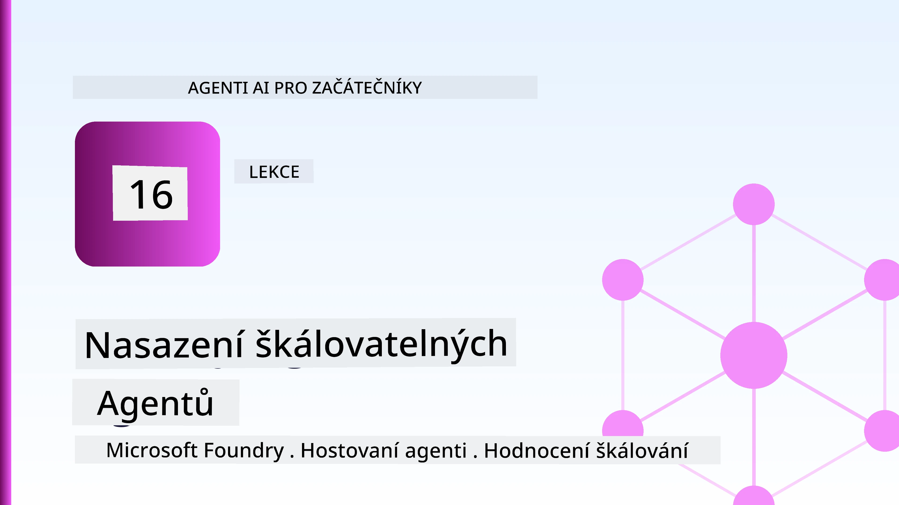
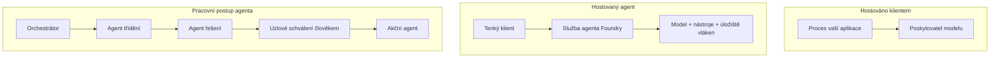
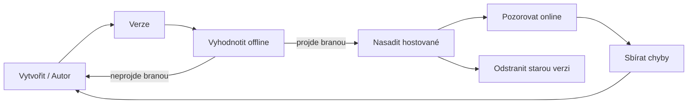
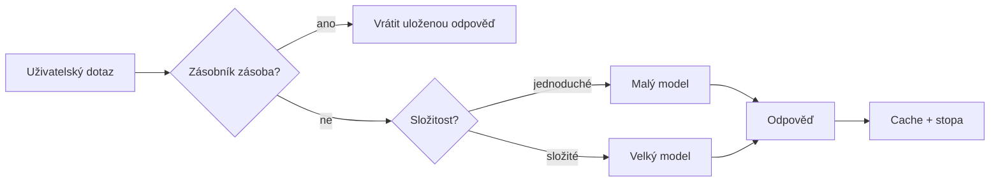
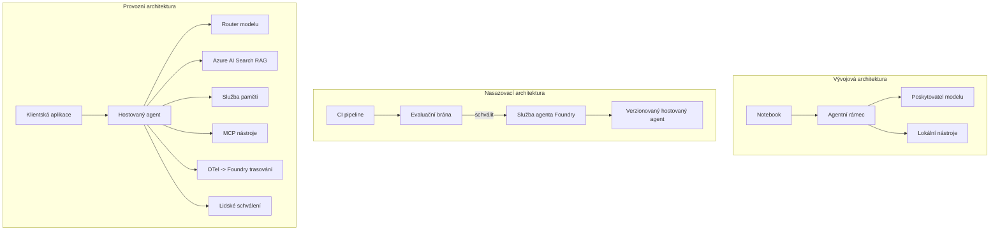

# Nasazení škálovatelných agentů pomocí Microsoft Foundry



Do tohoto bodu kurzu jste si vytvořili agenty, kteří běží na vašem notebooku, uvnitř zápisníku, řízeni příkazem `az login` a hrstkou proměnných prostředí. To je přesně ten správný způsob, jak se učit. Není to však správný způsob, jak spustit agenta, na kterém závisí tisíce zákazníků v 3 ráno.

Tato lekce se zabývá propastí mezi "funguje to na mém stroji" a "funguje to spolehlivě a za přijatelnou cenu v produkci." Tuto propast uzavíráme pomocí **Microsoft Foundry** a **Microsoft Foundry Agent Service**, a děláme to tak, že vytváříme skutečného zákaznického podpůrného agenta, který má nástroje, vyhledávání, paměť, vyhodnocování a monitorování.

## Úvod

Tato lekce bude pokrývat:

- Rozdíl mezi **prototypovým agentem** a **nasazeným agentem** a proč je přechod zejména o všem *okolo* modelu.
- **Vzory nasazení** agentů: klientsky hostovaní, službou hostovaní (Hosted Agents) a workflow řízené.
- **Životní cyklus agenta** na Microsoft Foundry — vytvořit, verzovat, nasadit, vyhodnotit, sledovat, vyřadit.
- **Strategie škálování**: směrování modelu, cache, souběžnost a bezstavový design.
- **Observabilita** s OpenTelemetry a Foundry trasováním.
- **Optimalizace nákladů** pomocí výběru modelu, směrování a vyhodnocovacích bran.
- **Podnikové úvahy**: správa, schválení lidským operátorem a bezpečný běh MCP serverů v produkci.

## Výukové cíle

Po dokončení této lekce budete umět:

- Vybrat správný vzor nasazení pro dané zatížení agenta.
- Nasadit agenta do Microsoft Foundry Agent Service tak, aby byl verzován, spravován a pozorovatelný.
- Instrumentovat agenta pro trasování a propojit hodnotící pipeline, která běží před každým vydáním.
- Aplikovat směrování modelu a cache, aby se udržela latence a náklady pod kontrolou ve velkém rozsahu.
- Přidat bránu schválení člověkem pro vysoce rizikové akce a integrovat MCP server bezpečným způsobem do produkce.

## Předpoklady

Tato lekce předpokládá, že jste dokončili předchozí lekce a jste pohodlní s:

- Vytvářením agentů s [Microsoft Agent Framework](../14-microsoft-agent-framework/README.md) (Lekce 14).
- [Používáním nástrojů](../04-tool-use/README.md) (Lekce 4) a [Agentické RAG](../05-agentic-rag/README.md) (Lekce 5).
- [Pamětí agenta](../13-agent-memory/README.md) (Lekce 13) a [Agentickými protokoly / MCP](../11-agentic-protocols/README.md) (Lekce 11).
- [Observabilitou a vyhodnocováním](../10-ai-agents-production/README.md) (Lekce 10) — tato lekce na ni přímo navazuje.

Budete také potřebovat:

- **Azure předplatné** a **Microsoft Foundry projekt** s alespoň jedním nasazeným chatovacím modelem.
- Autentizovaný **Azure CLI** (`az login`).
- Python 3.12+ a balíčky obsažené v repozitáři [`requirements.txt`](../../../requirements.txt).

## Od prototypu k produkci: Co se skutečně mění

Prototypový agent a produkční agent sdílejí stejnou základní smyčku — vyvozování, volání nástrojů, odpověď. Co se mění je vše, co je kolem této smyčky. Model tvoří možná 20 % produkčního agenta; zbývajících 80 % je operační kostra.

| Oblast | Prototyp | Produkce |
| --- | --- | --- |
| **Hostování** | Běží ve vašem zápisníku | Běží jako hostovaná služba, verzovaná a vydávaná |
| **Identita** | Váš token `az login` | Spravovaná identita s omezeným RBAC |
| **Stav** | V paměti, ztracen po restartu | Externalizovaný (uloženo v thread store, memory service) |
| **Selhání** | Vidíte traceback | Opakování, záložní plány, dead-letter, výstrahy |
| **Náklady** | "Několik centů" | Sledované na požadavek, směrované, cachované, v rozpočtu |
| **Kvalita** | Sledujete výstup okem | Automaticky vyhodnocováno před každým vydáním |
| **Důvěra** | Schvalujete každou akci | Pravidla + člověk v procesu pro rizikové akce |

Mějte tuto tabulku na paměti. Každá následující sekce odpovídá jednomu z těchto řádků.

## Vzory nasazení agentů

Existují tři vzory, které budete používat, často v kombinaci.

### 1. Klientsky hostovaní agenti

Objekt agenta žije uvnitř *vašeho* aplikačního procesu. Váš kód volá poskytovatele modelu přímo; smyčka vyvozování běží ve vaší službě. To je to, co dělala každá předchozí lekce.

- **Použijte, když** potřebujete plnou kontrolu nad smyčkou, vlastní middleware nebo chcete agenta vložit do stávajícího backendu.
- **Kompenzace**: vlastníte si škálování, stav a odolnost sami.

### 2. Hostovaní agenti (Foundry Agent Service)

Agent je *registrován jako zdroj* v Microsoft Foundry. Foundry hostí smyčku vyvozování, ukládá vlákna, vynucuje bezpečnost obsahu a RBAC a činí agenta viditelným v portálu Foundry. Vaše aplikace se stává tenkým klientem, který vytváří vlákna a čte odpovědi.

- **Použijte, když** chcete odolnost, zabudovanou observabilitu, správu a menší operační plochu.
- **Kompenzace**: méně nízkoúrovňové kontroly výměnou za spravované runtime.

### 3. Workflow agentů

Více agentů (a nástrojů) je složeno do grafu s explicitním řízením toku — sekvenční kroky, větvení, uzly schválení člověkem a trvalé kontrolní body, které mohou pozastavit a obnovit běh. Toto je schopnost Microsoft Agent Framework **Workflows** aplikovaná v měřítku nasazení.

- **Použijte, když** jedna úloha pokrývá několik specializovaných agentů nebo vyžaduje schvalovací krok uprostřed.
- **Kompenzace**: více pohyblivých částí; vyžaduje observabilitu na úrovni orchestrace.



## Životní cyklus agenta na Microsoft Foundry

Nasazení agenta není jednorázové `push`. Je to smyčka, která vypadá hodně jako cyklus vydávání softwaru, protože to přesně tak je.



Klíčová myšlenka, převzatá z [Lekce 10](../10-ai-agents-production/README.md): **offline vyhodnocování je brána, ne odbočka po cestě.** Nová verze agenta se nevydá, pokud neprojde vašimi hodnotícími prahy. Online observabilita pak přivádí zpět selhání z reálného světa do offline testovací sady. To je celá smyčka.

## Strategie škálování

Škálování agenta se liší od škálování bezstavového webového API, protože každý požadavek může spustit více nákladných volání modelu a nástrojů. Čtyři techniky nesou většinu zatížení.

**Bezstavé zpracování požadavků.** Neuchovávejte žádný stav uživatele v paměti procesu. Uchovávejte vlákna konverzace v Foundry thread store nebo memory service, aby jakýkoliv instance mohla zpracovat jakýkoliv požadavek. To vám umožní horizontální škálování — přidání instancí bez sticky sessions.

**Směrování modelu.** Ne každý požadavek potřebuje váš nejvýkonnější (a nejdražší) model. Směřujte jednoduché požadavky — klasifikaci úmyslu, krátké faktické odpovědi — na malý, rychlý model a rezervujte velký model pro skutečné vyvozování. Foundry **Model Router** to může udělat za vás, nebo můžete implementovat lehký klasifikátor sami. Laboratoř vám ukáže DIY verzi.

**Cache odpovědí.** Mnoho dotazů podpory je téměř duplicitních ("jak resetuji své heslo?"). Cache odpovědi na běžné otázky a podávejte je bez nutnosti volání modelu. I mírná cache hit rate významně snižuje náklady a latenci.

**Souběžnost a zpětný tlak.** Poskytovatelé modelů mají limity rychlosti. Omezte souběžnost, používejte opakování s exponenciálním zpětným skluzem a selhávejte elegantně (fronta „pracujeme na tom“ je lepší než chyba 500).



## Observabilita v produkci

Nemůžete provozovat to, co nevidíte. Jak bylo pokryto v Lekci 10, Microsoft Agent Framework nativně vydává **OpenTelemetry** stopy — každé volání modelu, vyvolání nástroje a krok orchestrace se stane spanem. V produkci exportujete tyto spany do Microsoft Foundry (nebo jakéhokoliv backendu kompatibilního s OTel), abyste mohli:

- Sledovat jeden zákaznický stížnost end-to-end přes všechna volání modelu a nástrojů.
- Sledovat latenci p50/p95 a náklady na požadavek v čase.
- Upozornit na náhlé nárůsty chyb a anomálie nákladů dřívějš, než si toho všimnou uživatelé (nebo váš finanční tým).

```python
from agent_framework.observability import get_tracer

tracer = get_tracer()

with tracer.start_as_current_span("support_request") as span:
    span.set_attribute("customer.tier", "enterprise")
    span.set_attribute("routed.model", "gpt-5-nano")
    # provádění agenta je automaticky sledováno uvnitř tohoto rozsahu
```

Atributy jako `customer.tier` a `routed.model` promění zeď stop ve zodpověditelné otázky ("jsou zákazníci podnikové úrovně příliš často směrováni na malý model?").

## Optimalizace nákladů

Náklady v produkčních agentech jsou dominovány tokeny. Tři páky, dle dopadu:

1. **Správná velikost modelu.** Malý model, který projde vaší bránou vyhodnocování, je téměř vždy levnější než velký model, který také projde. Použijte vyhodnocování k *prokázání*, že malý model je dostatečně dobrý, místo abyste z obavy vždy volili největší model.
2. **Směrujte podle složitosti.** Jak výše — plaťte ceny velkého modelu pouze za požadavky, které vyžadují vyvozování velkým modelem.
3. **Agresivně cacheujte.** Nejlevnější modelové volání je to, které nikdy neuděláte.

Vyhodnocovací brány a kontrola nákladů jsou stejná disciplína z dvou úhlů pohledu: vyhodnocování vám říká *kvalitní spodní hranici*, směrování a cache vás drží co nejblíže nákladům této hranice.

## Podnikové úvahy o nasazení

**Správa.** Hosted Agents dědí RBAC, bezpečnost obsahu a auditní protokol Foundry. Dejte každému agentovi spravovanou identitu s nejmenšími právy, které potřebuje — přístup jen pro čtení do znalostní báze, omezený přístup do ticketovacího API, nic víc.

**Člověk v procesu.** Některé akce jsou příliš závažné na to, aby byly plně automatizované — vystavení refundace, smazání účtu, eskalace na právní tým. Microsoft Agent Framework podporuje nástroje **vyžadující schválení**: agent navrhne akci, provedení se pozastaví, člověk akci schválí nebo odmítne a workflow pokračuje. Primitivum jste viděli v [Lekci 6](../06-building-trustworthy-agents/README.md); zde ho nasazujete.

**MCP v produkci.** [MCP](../11-agentic-protocols/README.md) umožňuje agentovi používat externí nástroje přes standardní rozhraní. V produkci považujte každý MCP server za nedůvěryhodnou hranici: fixujte verzi serveru, spouštějte ji se scoped identitou, ověřujte její výstupy a nikdy jí neodhalujte tajné klíče. MCP server je závislost, a závislosti se patchují, auditují a omezují jejich rychlost.



Tyto tři diagramy — vývoj, nasazení, runtime — jsou tentýž agent ve třech fázích svého života. Laboratoř, která následuje, vás tím provede.

## Praktická laboratoř: Produkčně připravený zákaznický podpůrný agent

Otevřete [`code_samples/16-python-agent-framework.ipynb`](./code_samples/16-python-agent-framework.ipynb) a projděte ho od začátku do konce. Poskládáte **Contoso zákaznického podpůrného agenta** se všemi produkčními obavami zapojenými:

1. **Volání nástrojů** — vyhledat stav objednávky a otevřít support ticket.
2. **RAG** — odpovídat na otázky politiky z znalostní báze (Azure AI Search, s paměťovým fallbackem, aby zápisník běžel i bez Search zdroje).
3. **Paměť** — pamatovat si zákazníka přes průběh konverzace.
4. **Směrování modelu** — klasifikátor složitosti směruje každý požadavek na malý nebo velký model.
5. **Cache odpovědí** — opakující se otázky jsou podávány z cache.
6. **Lidské schválení** — refundace nad prahovou hodnotu čekají na lidské odsouhlasení.
7. **Vyhodnocovací pipeline** — malá offline testovací sada skóruje agenta a funguje jako brána pro vydání.
8. **Observabilita** — OpenTelemetry trasování kolem každého požadavku.

### Procházení

Zápisník je organizován tak, že každá produkční obava je samostatná, spustitelná sekce. Jádrem je request handler pro směrování a caching:

```python
async def handle_support_request(query: str, customer_id: str) -> str:
    # 1. Podávat z cache, kdykoliv je to možné.
    cached = response_cache.get(normalize(query))
    if cached:
        return cached

    # 2. Směrovat podle složitosti pro kontrolu nákladů.
    model = "gpt-5-nano" if is_simple(query) else "gpt-5-mini"

    # 3. Spustit agenta uvnitř trace span pro pozorovatelnost.
    with tracer.start_as_current_span("support_request") as span:
        span.set_attribute("routed.model", model)
        span.set_attribute("customer.id", customer_id)
        response = await support_agent.run(query, model=model)

    # 4. Uložit do cache a vrátit.
    response_cache.set(normalize(query), response.text)
    return response.text
```

Vyhodnocovací brána, která chrání vydání, vypadá takto:

```python
async def evaluation_gate(agent, test_cases, threshold: float = 0.8) -> bool:
    passed = 0
    for case in test_cases:
        result = await agent.run(case["input"])
        if score_response(result.text, case["expected"]) >= 0.8:
            passed += 1
    pass_rate = passed / len(test_cases)
    print(f"Evaluation pass rate: {pass_rate:.0%} (gate: {threshold:.0%})")
    return pass_rate >= threshold  # nasadit pouze pokud brána projde
```

Přečtěte každou řádku — zápisník udržuje primitivní části záměrně malé, aby nebylo nic skrytého za voláním frameworku.

## Validace nasazeného agenta pomocí smoke testů

Vyhodnocovací brána výše běží *offline* proti vašemu objektu agenta. Jakmile je agent nasazen jako Hosted Agent, potřebujete ještě jednu, ještě levnější kontrolu: **odpovídá nasazený endpoint skutečně?**

Úspěšné nasazení dokazuje pouze, že řídicí rovina akceptovala definici — neprokazuje, že agent odpovídá. Chybějící závislost, špatné směrování modelu nebo vypršené připojení mohou zanechat zelené nasazení, které nic nevrací. **Smoke test** to zachytí za sekundy, při každém nasazení, bez nákladů plného vyhodnocování.

Tento repozitář poskytuje připravenou smoke-test pipeline založenou na [AI Smoke Test](https://github.com/marketplace/actions/ai-smoke-test) GitHub Action:

- **Katalog** — [`tests/lesson-16-smoke-tests.json`](../../../tests/lesson-16-smoke-tests.json) obsahuje výzvy a ověření pro Contoso podpůrného agenta (ověřené odpovědi politických otázek, dotaz na objednávku, držení tématu a kontinuita vícevýměnných vláken). Katalogy pro agenty z dalších lekcí jsou uloženy vedle — viz [`tests/README.md`](../tests/README.md).
- **Workflow** — [`.github/workflows/smoke-test.yml`](../../../.github/workflows/smoke-test.yml) se přihlašuje přes Azure OIDC a odesílá každou výzvu na endpoint agentových odpovědí, chybuje job při jakémkoli nesplnění ověřovací podmínky.

```yaml
- name: Smoke-test hosted agent
  uses: JFolberth/ai-smoketest@v1
  with:
    project_endpoint: ${{ inputs.project_endpoint }}
    agent_name: ContosoSupportAgent
    tests_file: tests/lesson-16-smoke-tests.json
```


Spusťte jej z karty **Actions**, jakmile je váš agent nasazen, a zadejte koncový bod projektu Foundry a název agenta. Federovaná identita potřebuje roli **Azure AI User** v rozsahu projektu Foundry. Vrstev vnímejte jako pyramidy: smoke testy (dostupný a reagující?) běží při každém nasazení, offline vyhodnocení (dostatečně dobré k distribuci?) běží před nasazením, a online vyhodnocení (jak si vede v praxi?) běží kontinuálně.

## Kontrola znalostí

Otestujte své znalosti před přechodem k úkolu.

**1. Přibližně kolik z produkčního agenta je „model“, a co tvoří zbytek?**

<details>
<summary>Odpověď</summary>

Model je menšinou systému — často se uvádí kolem 20 %. Zbytek tvoří provozní kostra: hosting a verzování, identita a RBAC, externí stav, zpracování chyb, sledování nákladů, vyhodnocení a kontroly zapojující člověka. Přechod do produkce je většinou o budování všeho *okolo* smyčky rozumování.
</details>

**2. Kdy byste zvolili Hosted Agent místo agenta hostovaného na klientovi?**

<details>
<summary>Odpověď</summary>

Když chcete spravované běhové prostředí s vestavěnou trvanlivostí (vlákna, která přetrvávají a mohou pokračovat), pozorovatelností, bezpečností obsahu a RBAC, a jste ochotni obětovat část nízkoúrovňové kontroly smyčky rozumování za menší provozní povrch. Hostování na klientovi je lepší, pokud potřebujete plnou kontrolu nad smyčkou nebo integrujete agenta do stávajícího backendu.
</details>

**3. Proč musí být škálovatelný agent bezstavový ve své vlastní paměti procesu?**

<details>
<summary>Odpověď</summary>

Aby jakákoli instance mohla zpracovat jakýkoli požadavek, což dovoluje horizontální škálování bez sticky sessions. Stav konverzace pro uživatele je externě uložen v úložišti vláken nebo paměťové službě. Pokud by stav žil v paměti procesu, ztratil by se při restartu a nelze volně rozložit zátěž.
</details>

**4. Jaký problém řeší směrování modelů a jak souvisí s vyhodnocováním?**

<details>
<summary>Odpověď</summary>

Směrování posílá jednoduché požadavky malému, levnému a rychlému modelu a vyhrazuje velký model pro skutečné rozumování, což kontroluje latenci i náklady. Souvisí to s vyhodnocováním, protože vyhodnocení je to, co *dokazuje*, že malý model je dostatečný pro určitou třídu požadavků — směrování bez vyhodnocení je hádání.
</details>

**5. Co je „evaluace gate“ (brána vyhodnocování) a kde se nachází v životním cyklu?**

<details>
<summary>Odpověď</summary>

Evaluace gate spustí offline testy na nové verzi agenta a zablokuje nasazení, pokud míra úspěšnosti nesplní práh. Nachází se mezi „verzí“ a „nasazením“ v životním cyklu, takže kvalita je podmínkou před vydáním, ne něco, co kontrolujete po nasazení.
</details>

**6. Proč by měl být MCP server považován za nedůvěryhodnou hranici v produkci?**

<details>
<summary>Odpověď</summary>

Protože je to externí závislost, na kterou váš agent volá. Měli byste pevně stanovit jeho verzi, spouštět jej s omezenou identitou, ověřovat jeho výstupy, omezovat jeho požadavky a nikdy mu neuchovávat tajemství — stejná disciplína, jakou používáte u jakékoli třetí strany. Jeho výstupy vstupují do rozumování agenta, proto neověřená důvěra znamená bezpečnostní riziko.
</details>

**7. Která jediná změna obvykle má největší dopad na náklady produkčního agenta a proč?**

<details>
<summary>Odpověď</summary>

Správné dimenzování modelu — použití nejmenšího modelu, který stále prochází vaším evaluacím gate. Náklady jsou dominantně určeny tokeny a menší model, který splňuje kvalitativní standard, je téměř vždy levnější než větší model. Cache a směrování pak náklady dále snižují, ale volba správného základního modelu má největší primární efekt.
</details>

**8. Jakou roli hrají atributy spanů jako `customer.tier` a `routed.model` v pozorovatelnosti?**

<details>
<summary>Odpověď</summary>

Převádějí syrové stopy na zodpověditelné obchodní otázky. Bez atributů máte plochu spanů; s nimi můžete položit otázky jako „jsou podnikový zákazníci směrováni na malý model příliš často?“ nebo „který model řeší naše nejpomalejší požadavky?“ Atributy jsou způsob, jak rozřezat telemetrii podle rozměrů, které jsou důležité pro vaše provozní potřeby.
</details>

## Úkol

Vezměte zákaznického podpůrného agenta z laboratoře a zabezpečte jej pro konkrétní scénář: **podpora předplatného a fakturace pro SaaS společnost.**

Vaše odevzdání by mělo:

1. **Nahradit nástroje** nástroji relevantními pro účtování: `get_subscription_status`, `get_invoice` a `issue_credit` (kredity nad 50 $ vyžadují schválení člověkem).
2. **Přidat tři RAG dokumenty** pokrývající politiku vrácení peněz společnosti, fakturační cyklus a pravidla zrušení.
3. **Rozšířit sadu vyhodnocení** na nejméně osm případů, včetně alespoň dvou, které *by měly* spustit cestu s lidským schválením, a ověřit, že evaluace gate správně projde nebo selže.
4. **Přidat jeden nákladový report**: po spuštění deseti smíšených dotazů prostřednictvím agenta vytisknout, kolik jich šlo na malý model, kolik na velký model a kolik bylo obslouženo z cache.

Napište krátký odstavec (v markdown buňce), který vysvětlí, jaké pravidlo směrování modelů jste zvolili a jak byste jej ověřili na reálné zátěži. Neexistuje jedna správná odpověď — budete hodnoceni podle toho, zda jsou produkční souvislosti propojeny koherentně.

## Shrnutí

V této lekci jste přesunuli agenta z prototypu do produkce s Microsoft Foundry:

- Přechod do produkce je především o **provozní kostře** kolem modelu — hostování, identita, stav, zpracování chyb, náklady, kvalita a důvěra.
- Naučili jste se tři **vzory nasazení** — klient-hostované, Hosted Agents a Agent Workflows — a kdy je který vhodný.
- Prošli jste **životní cyklus agenta**, kde offline **vyhodnocení funguje jako brána vydání** a online pozorovatelnost vrací selhání zpět do testovací sady.
- Použili jste **škálovací strategie** — bezstavový design, směrování modelů, cache a omezenou souběžnost — a spojili je s **optimalizací nákladů**.
- Zapojujete **podnikové kontroly**: RBAC, lidské schválení a produkčně bezpečnou integraci MCP.
- Vybudovali jste **produkčně připraveného zákaznického podpůrného agenta**, který všechny tyto aspekty propojuje v běžícím kódu.

Další lekce podnikne opačnou cestu: místo škálování agentů do cloudu je stáhnete *dolů* na jeden vývojářský stroj a poběží výhradně lokálně.

## Další zdroje

- <a href="https://learn.microsoft.com/azure/ai-foundry/what-is-azure-ai-foundry" target="_blank">Dokumentace Microsoft Foundry</a>
- <a href="https://learn.microsoft.com/azure/ai-foundry/agents/overview" target="_blank">Přehled Microsoft Foundry Agent Service</a>
- <a href="https://learn.microsoft.com/en-us/agent-framework/overview/?wt.mc_id=youtube_26688_organicsocial_reactor&pivots=programming-language-python" target="_blank">Microsoft Agent Framework</a>
- <a href="https://learn.microsoft.com/azure/ai-foundry/concepts/model-router" target="_blank">Model Router v Microsoft Foundry</a>
- <a href="https://learn.microsoft.com/azure/search/search-what-is-azure-search" target="_blank">Azure AI Search</a>
- <a href="https://opentelemetry.io/" target="_blank">OpenTelemetry</a>
- <a href="https://github.com/marketplace/actions/ai-smoke-test" target="_blank">AI Smoke Test GitHub Action</a>
- <a href="https://modelcontextprotocol.io/" target="_blank">Model Context Protocol (MCP)</a>

## Předchozí lekce

[Budování agentů využívajících počítač (CUA)](../15-browser-use/README.md)

## Následující lekce

[Vytváření lokálních AI agentů](../17-creating-local-ai-agents/README.md)

---

<!-- CO-OP TRANSLATOR DISCLAIMER START -->
**Prohlášení o omezení odpovědnosti**:
Tento dokument byl přeložen pomocí AI překladatelské služby [Co-op Translator](https://github.com/Azure/co-op-translator). Přestože usilujeme o co největší přesnost, mějte prosím na paměti, že automatizované překlady mohou obsahovat chyby nebo nepřesnosti. Originální dokument v jeho mateřském jazyce by měl být považován za autoritativní zdroj. Pro kritické informace se doporučuje profesionální lidský překlad. Nejsme odpovědní za jakékoli nedorozumění nebo nesprávné interpretace vzniklé použitím tohoto překladu.
<!-- CO-OP TRANSLATOR DISCLAIMER END -->