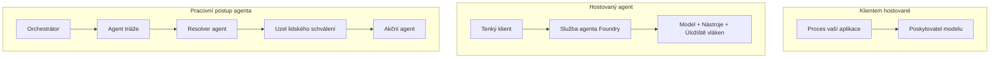
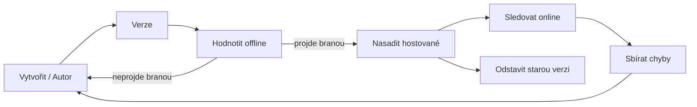
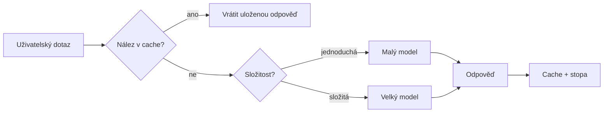
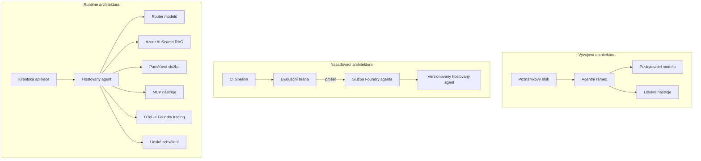

# Nasazení škálovatelných agentů s Microsoft Foundry


Do tohoto okamžiku v kurzu jste vytvářeli agenty, kteří běží na vašem notebooku, uvnitř poznámkového bloku, řízení pomocí `az login` a několika proměnných prostředí. To je přesně ten správný způsob, jak se učit. Není to však správný způsob, jak provozovat agenta, na kterého spolehlivě závisí tisíce zákazníků ve 3 ráno.

Tato lekce se zabývá propastí mezi „funguje to na mém počítači“ a „funguje to spolehlivě a cenově dostupně v produkci.“ Tuto propast překonáme pomocí **Microsoft Foundry** a **Microsoft Foundry Agent Service** a vytvoříme skutečného zákaznického podporového agenta, který má nástroje, vyhledávání, paměť, vyhodnocování a monitorování.

## Úvod

Tato lekce pokryje:

- Rozdíl mezi **prototypovým agentem** a **nasazeným agentem** a proč je přechod především o všem, co je *okolo* modelu.
- **Vzory nasazení** agentů: klientem-hostované, službou-hostované (Hosted Agents) a workflow-orchestrace.
- **Životní cyklus agenta** na Microsoft Foundry — vytvořit, verzovat, nasadit, vyhodnotit, sledovat, odebrat.
- **Strategie škálování**: směrování modelu, caching, paralelnost a design bez stavů.
- **Pozorovatelnost** s OpenTelemetry a Foundry trasováním.
- **Optimalizace nákladů** skrze výběr modelu, směrování a vyhodnocovací brány.
- **Podnikové úvahy**: řízení, lidské schválení a bezpečný provoz MCP serverů v produkci.

## Cíle učení

Po dokončení této lekce budete umět:

- Vybrat správný vzor nasazení pro danou zátěž agenta.
- Nasadit agenta do Microsoft Foundry Agent Service tak, aby byl verzovaný, řízený a pozorovatelný.
- Instrumentovat agenta pro trasování a zapojit vyhodnocovací pipeline, která běží před každým uvolněním.
- Použít směrování modelů a caching, aby latence a náklady byly při škálování pod kontrolou.
- Přidat lidskou schvalovací bránu pro vysoce rizikové akce a integrovat MCP server bezpečným způsobem do produkce.

## Předpoklady

Tato lekce předpokládá, že jste dokončili dřívější lekce a jste pohodlní s:

- Vytvářením agentů pomocí [Microsoft Agent Framework](../14-microsoft-agent-framework/README.md) (Lekce 14).
- [Použitím nástrojů](../04-tool-use/README.md) (Lekce 4) a [Agentic RAG](../05-agentic-rag/README.md) (Lekce 5).
- [Pamětí agenta](../13-agent-memory/README.md) (Lekce 13) a [Agentic protokoly / MCP](../11-agentic-protocols/README.md) (Lekce 11).
- [Pozorovatelností a vyhodnocováním](../10-ai-agents-production/README.md) (Lekce 10) — tato lekce na to přímo navazuje.

Budete také potřebovat:

- **Předplatné Azure** a **Microsoft Foundry projekt** s alespoň jedním nasazeným chatovacím modelem.
- **Azure CLI** autentifikovaný (`az login`).
- Python 3.12+ a balíčky v repozitáři [`requirements.txt`](../../../requirements.txt).

## Od prototypu k produkci: co se vlastně mění

Prototypový agent a produkční agent sdílejí stejný hlavní cyklus — uvažování, volání nástrojů, odpověď. Co se mění, je vše obalené kolem tohoto cyklu. Model tvoří možná 20 % produkčního agenta; zbylých 80 % je operační kostra.

| Oblast | Prototyp | Produkce |
| --- | --- | --- |
| **Hosting** | Běží ve vašem poznámkovém bloku | Běží jako hostovaná služba, verzovaná a nasazovaná |
| **Identita** | Váš token `az login` | Spravovaná identita s omezeným RBAC |
| **Stav** | V paměti, ztracený po restartu | Externí (úložiště vláken, paměťová služba) |
| **Selhání** | Vidíte traceback | Opakování, zálohy, dead-letter, upozornění |
| **Náklady** | "Jsou to pár centů" | Sledováno na požadavek, směrováno, cachováno, rozpočtováno |
| **Kvalita** | Oční kontrola výstupu | Automatické vyhodnocení před každým vydáním |
| **Důvěra** | Schvalujete každý krok | Politika + lidský zásah pro rizikové akce |

Mějte tuto tabulku na paměti. Každá níže uvedená sekce odpovídá jednomu řádku z této tabulky.

## Vzory nasazení agentů

Existují tři vzory, které budete používat, často v kombinaci.

### 1. Klientem-hostovaní agenti

Objekt agenta žije uvnitř *vašeho* aplikačního procesu. Váš kód volá poskytovatele modelu přímo; uvažovací smyčka běží ve vaší službě. To bylo to, co dělal každý předchozí lekce.

- **Použijte, když** potřebujete plnou kontrolu nad smyčkou, vlastní middleware nebo agent je zabudován do existujícího backendu.
- **Kompenzace**: škálování, stav a odolnost si zajišťujete sami.

### 2. Hostovaní agenti (Foundry Agent Service)

Agent je *registrován jako zdroj* v Microsoft Foundry. Foundry hostuje uvažovací smyčku, ukládá vlákna, zajišťuje bezpečnost obsahu a RBAC a zviditelňuje agenta v portálu Foundry. Vaše aplikace se stává lehkým klientem, který vytváří vlákna a čte odpovědi.

- **Použijte, když** chcete odolnost, zabudovanou pozorovatelnost, řízení a menší operační plochu.
- **Kompenzace**: méně nízkoúrovňové kontroly výměnou za spravované runtime.

### 3. Workflows agentů

Více agentů (a nástrojů) je složeno do grafu s explicitním řídícím tokem — sekvenční kroky, větvení, uzly pro lidské schválení a trvalé kontrolní body, které mohou pozastavit a obnovit práci. Toto je schopnost Microsoft Agent Framework **Workflows** aplikovaná ve škále nasazení.

- **Použijte, když** jediný úkol pokrývá několik specializovaných agentů nebo vyžaduje průběžný schvalovací krok uprostřed.
- **Kompenzace**: více pohyblivých částí; vyžaduje pozorovatelnost na úrovni orchestrace.



## Životní cyklus agenta na Microsoft Foundry

Nasazení agenta není jednorázový `push`. Je to smyčka a velmi se podobá cyklu vydávání softwaru, protože přesně to je.



Klíčová myšlenka, převzatá z [Lekce 10](../10-ai-agents-production/README.md): **offline vyhodnocení je brána, ne dodatečná činnost.** Nová verze agenta není uvolněna, pokud nepřekročí vaše vyhodnocovací prahy. Online pozorovatelnost pak vrací selhání z reálného světa zpět do vašeho offline testovacího souboru. To je celý cyklus.

## Strategie škálování

Škálování agenta se liší od škálování bezstavového webového API, protože každý požadavek může spustit několik nákladných volání modelu a nástrojů. Čtyři techniky nesou většinu zátěže.

**Bezstavné zpracování požadavků.** V procesu neukládejte žádný stav na uživatele. Uchovávejte konverzační vlákna v úložišti vláken Foundry nebo v paměťové službě, aby jakákoliv instance mohla zpracovat jakýkoliv požadavek. To vám umožní škálovat horizontálně — přidávejte instance, bez nálepkových session.

**Směrování modelu.** Ne každý požadavek potřebuje váš nejvýkonnější (a nejdražší) model. Směřujte jednoduché požadavky — klasifikace záměru, krátké faktické odpovědi — na malý, rychlý model, a velký model si ponechte pro skutečné uvažování. Foundry má pro vás **Model Router**, nebo si můžete vytvořit lehký klasifikátor sami. DIY verzi vytvoříte v laboratoři.

**Caching odpovědí.** Mnoho dotazů podpory jsou téměř duplikáty („jak si resetuji heslo?“). Ukládejte odpovědi na časté otázky a poskytujte je bez nutnosti volání modelu. I mírná míra zásahů cache významně snižuje náklady a latenci.

**Paralelnost a zpětný tlak.** Poskytovatelé modelů mají omezení rychlosti. Omezte svoji paralelnost, používejte opakování s exponenciálním zpožděním a selhání řešte elegantně (zařazená odpověď „pracujeme na tom“ je lepší než chyba 500).



## Pozorovatelnost v produkci

Nemůžete provozovat to, co nevidíte. Jak bylo popsáno v Lekci 10, Microsoft Agent Framework nativně vysílá **OpenTelemetry** stopy — každé volání modelu, nástroje a orchestrální krok je span. V produkci exportujete tyto spany do Microsoft Foundry (nebo jakéhokoliv backendu kompatibilního s OTel), abyste mohli:

- Sledovat jednu zákaznickou stížnost od začátku do konce přes všechna volání modelu a nástrojů.
- Sledovat latenci p50/p95 a náklady na požadavek v čase.
- Upozornit na nárůsty chybovosti a anomálie nákladů dřív, než si toho uživatelé (nebo finance) všimnou.

```python
from agent_framework.observability import get_tracer

tracer = get_tracer()

with tracer.start_as_current_span("support_request") as span:
    span.set_attribute("customer.tier", "enterprise")
    span.set_attribute("routed.model", "gpt-5-nano")
    # provádění agenta je automaticky sledováno uvnitř tohoto rozsahu
```

Atributy jako `customer.tier` a `routed.model` proměňují ze zdi stop zodpověditelné otázky („jsou firemní zákazníci příliš často směrováni na malý model?“).

## Optimalizace nákladů

Náklady na produkční agenty jsou dominovány tokeny. Tři páky, v pořadí dopadu:

1. **Správná velikost modelu.** Malý model, který projde vaší vyhodnocovací bránou, je téměř vždy levnější než velký model, který také projde. Použijte vyhodnocení k *důkazu*, že malý model je dostatečně dobrý, místo abyste z opatrnosti používali největší model.
2. **Směrování podle složitosti.** Jako výše — plaťte ceny velkého modelu jen za požadavky, které potřebují jeho uvažování.
3. **Agresivní caching.** Nejlevnější volání modelu je to, které nikdy neprovedete.

Vyhodnocovací brány a kontrola nákladů jsou stejná disciplína ze dvou úhlů pohledu: vyhodnocení udává *kvalitativní minimum*, směrování a caching udržují náklady co nejblíže této hranici.

## Podnikové úvahy ohledně nasazení

**Řízení.** Hostovaní agenti dědí RBAC, bezpečnost obsahu a auditing Foundry. Dej každému agentovi spravovanou identitu s nejmenšími potřebnými právy — přístup jen pro čtení do znalostní báze, omezený přístup k API ticketů, nic víc.

**Lidé v procesu.** Některé akce jsou příliš důsledné, než aby byly plně automatizovány — vydání refundace, vymazání účtu, eskalace na právní tým. Microsoft Agent Framework podporuje **nástroje vyžadující schválení**: agent navrhne akci, vykonání se pozastaví, člověk schválí či zamítne a workflow pokračuje. Tento primitiv jste viděli v [Lekci 6](../06-building-trustworthy-agents/README.md); zde ho nasazujete.

**MCP v produkci.** [MCP](../11-agentic-protocols/README.md) umožňuje agentovi spotřebovávat externí nástroje přes standardní rozhraní. V produkci je každý MCP server považován za nedůvěryhodnou hranici: připněte verzi serveru, spusťte ho s omezenou identitou, validujte jeho výstupy a nikdy mu nesdělujte tajemství. MCP server je závislost, a závislosti jsou patchovány, auditovány a mají omezení rychlosti.



Tyto tři diagramy — vývoj, nasazení, runtime — jsou jeden agent ve třech fázích života. Následující laboratoř vás provede jeho výstavbou.

## Praktická laboratoř: produkčně připravený zákaznický podporový agent

Otevřete [`code_samples/16-python-agent-framework.ipynb`](./code_samples/16-python-agent-framework.ipynb) a projděte ho celý. Sestavíte **podporového agenta Contoso** se zapojením všech produkčních aspektů:

1. **Volání nástrojů** — vyhledání stavu objednávky a otevření tiketů podpory.
2. **RAG** — odpovědi na otázky politiky z znalostní báze (Azure AI Search s paměťovou záložní variantou, aby poznámkový blok fungoval i bez Search zdroje).
3. **Paměť** — pamatovat si zákazníka během konverzace.
4. **Směrování modelu** — klasifikátor složitosti směruje každý požadavek na malý nebo velký model.
5. **Caching odpovědí** — opakované otázky jsou odpovídány z cache.
6. **Lidské schválení** — refundace nad určitým limitem čekají na lidské potvrzení.
7. **Vyhodnocovací pipeline** — malá offline testovací sada skóruje agenta a slouží jako brána vydání.
8. **Pozorovatelnost** — OpenTelemetry trasování kolem každého požadavku.

### Průchod

Poznámkový blok je organizován tak, že každý produkční aspekt je samostatná a spustitelná sekce. Jádrem je request handler s routingem a cachingem:

```python
async def handle_support_request(query: str, customer_id: str) -> str:
    # 1. Podávejte z cache, kdykoli je to možné.
    cached = response_cache.get(normalize(query))
    if cached:
        return cached

    # 2. Směřujte podle složitosti pro kontrolu nákladů.
    model = "gpt-5-nano" if is_simple(query) else "gpt-5-mini"

    # 3. Spusťte agenta uvnitř trace úseku pro sledovatelnost.
    with tracer.start_as_current_span("support_request") as span:
        span.set_attribute("routed.model", model)
        span.set_attribute("customer.id", customer_id)
        response = await support_agent.run(query, model=model)

    # 4. Uložte do cache a vraťte.
    response_cache.set(normalize(query), response.text)
    return response.text
```

Vyhodnocovací brána, která hlídá vydání, vypadá takto:

```python
async def evaluation_gate(agent, test_cases, threshold: float = 0.8) -> bool:
    passed = 0
    for case in test_cases:
        result = await agent.run(case["input"])
        if score_response(result.text, case["expected"]) >= 0.8:
            passed += 1
    pass_rate = passed / len(test_cases)
    print(f"Evaluation pass rate: {pass_rate:.0%} (gate: {threshold:.0%})")
    return pass_rate >= threshold  # nasadit pouze, pokud brána projde
```

Čtěte každý řádek — poznámkový blok drží primitivy úmyslně malé, aby nic nebylo skryto za voláním frameworku.

## Validace nasazeného agenta pomocí základních testů

Výše uvedená vyhodnocovací brána běží *offline* vůči vašemu agentovi. Jakmile je agent nasazen jako Hosted Agent, potřebujete ještě jednu, ještě levnější kontrolu: **odpovídá nasazený endpoint vůbec?**

„Úspěšné“ nasazení dokazuje, že řídící rovina akceptovala definici — ne, že agent reflektuje odpověď. Chybějící závislost, chybné směrování modelu nebo vypršelé připojení může zanechat zelené nasazení, které nic nevrací. **Smoke test** to zachytí během několika sekund, při každém nasazení, bez nákladů na plné vyhodnocení.

Tento repozitář obsahuje připravený smoke-test pipeline postavený na akci GitHub [AI Smoke Test](https://github.com/marketplace/actions/ai-smoke-test):

- **Katalog** — [`tests/lesson-16-smoke-tests.json`](../../../tests/lesson-16-smoke-tests.json) obsahuje výzvy a tvrzení pro agenta podpory Contoso (vázané odpovědi politiky, vyhledání objednávky, držení tématu, kontinuita vícekolových vláken). Katalogy pro agenty z jiných lekcí jsou vedle něj — viz [`tests/README.md`](../tests/README.md).
- **Workflow** — [`.github/workflows/smoke-test.yml`](../../../.github/workflows/smoke-test.yml) se přihlásí pomocí Azure OIDC a POSTuje každou výzvu na endpoint Responses agenta, selže úlohu při jakémkoliv chybě tvrzení.

```yaml
- name: Smoke-test hosted agent
  uses: JFolberth/ai-smoketest@v1
  with:
    project_endpoint: ${{ inputs.project_endpoint }}
    agent_name: ContosoSupportAgent
    tests_file: tests/lesson-16-smoke-tests.json
```


Spusťte to z karty **Actions**, jakmile je váš agent nasazen, a zadejte koncový bod projektu Foundry a jméno agenta. Federovaná identita potřebuje roli **Azure AI User** v rozsahu projektu Foundry. Přemýšlejte o vrstvách jako o pyramidě: testy kouře (dostupný a reaguje?) se spouštějí při každém nasazení, offline hodnocení (dostatečně dobrý k distribuci?) se provádí před propagací a online hodnocení (jak se daří v reálném provozu?) běží nepřetržitě.

## Kontrola znalostí

Vyzkoušejte si své porozumění před přechodem k zadání.

**1. Přibližně jak velkou část výrobního agenta tvoří „model“ a co je zbytek?**

<details>
<summary>Odpověď</summary>

Model tvoří menšinovou část systému — často se uvádí asi 20 %. Zbytek tvoří operační kostra: hostování a verzování, identita a RBAC, externí stav, zpracování selhání, sledování nákladů, hodnocení a kontrolní mechanismy s lidským zapojením. Přechod do produkce je zejména o vytváření všech prvků *kolem* smyčky uvažování.
</details>

**2. Kdy byste zvolili Hosted Agent místo agenta hostovaného klientem?**

<details>
<summary>Odpověď</summary>

Když chcete spravované běhové prostředí s vestavěnou odolností (vlákna, která přetrvávají a mohou pokračovat), pozorovatelností, bezpečností obsahu a RBAC a jste ochotni obětovat určitou nízkoúrovňovou kontrolu nad smyčkou uvažování výměnou za menší operační plochu. Hostovaný klient je vhodnější, když potřebujete plnou kontrolu nad smyčkou nebo vkládáte agenta do existujícího backendu.
</details>

**3. Proč musí být škálovatelný agent bezstavový ve své vlastní procesní paměti?**

<details>
<summary>Odpověď</summary>

Aby mohla jakákoli instance zpracovat jakýkoli požadavek, což umožňuje horizontální škálování bez přilepených relací (sticky sessions). Stav konverzace na uživatele je externě uložen ve vláknovém úložišti nebo paměťové službě. Pokud by stav žil v procesní paměti, ztratil by se po restartu a nebylo by možné volně rozdělovat zátěž.
</details>

**4. Jaký problém řeší směrování modelů a jak souvisí s hodnocením?**

<details>
<summary>Odpověď</summary>

Směrování posílá jednoduché požadavky na malý, levný a rychlý model a vyhrazuje velký model pro skutečné uvažování, čímž se řídí jak latence, tak náklady. Souvisí s hodnocením, protože hodnocení je to, co *dokazuje*, že malý model je dostatečně dobrý pro určitý typ požadavků — směrování bez hodnocení je odhad.
</details>

**5. Co je „hodnoticí brána“ a kde v životním cyklu sedí?**

<details>
<summary>Odpověď</summary>

Hodnoticí brána spouští offline testovací sadu proti nové verzi agenta a blokuje nasazení, pokud míra úspěšnosti nesplní prahovou hodnotu. Nachází se mezi „verzí“ a „nasazením“ v životním cyklu a činí kvalitu podmínkou pro vydání, nikoli jen něčím, co se kontroluje po nasazení.
</details>

**6. Proč by měl být server MCP považován za nedůvěryhodnou hranici v produkci?**

<details>
<summary>Odpověď</summary>

Protože je to externí závislost, do které volá váš agent. Měli byste přichytit jeho verzi, spouštět ho s omezenou identitou, validovat jeho výstupy, omezovat rychlost a nikdy mu nesdělovat tajné údaje — stejná disciplína jako u jakékoli třetí strany. Jeho výstupy vstupují do uvažování vašeho agenta, takže neověřená důvěra je bezpečnostní riziko.
</details>

**7. Která jediná změna obvykle nejvíce ovlivní náklady na produkčního agenta a proč?**

<details>
<summary>Odpověď</summary>

Správná velikost modelu — použití nejmenšího modelu, který stále projde vaší hodnoticí bránou. Náklady dominují tokeny a menší model, který splňuje kvalitativní hranici, je téměř vždy levnější než větší. Ke snížení nákladů přispívají ještě caching a směrování, ale výběr správného základního modelu má největší prvnířádový efekt.
</details>

**8. Jakou roli v pozorovatelnosti hrají atributy rozsahu jako `customer.tier` a `routed.model`?**

<details>
<summary>Odpověď</summary>

Přeměňují syrové stopy na zodpověditelné obchodní otázky. Bez atributů máte zeď rozsahů; s nimi můžete položit otázky, jako „jsou firemní zákazníci příliš často směrováni na malý model?“ nebo „který model zpracovává naše nejpomalejší požadavky?“ Atributy jsou způsob, jak rozřezat telemetrii podle rozměrů, které jsou důležité pro váš provoz.
</details>

## Zadání

Vezměte zákaznického podpůrného agenta z laboratoře a zabezpečte ho pro konkrétní scénář: **support agenta pro účtování předplatného pro SaaS společnost.**

Vaše odevzdání by mělo:

1. **Nahradit nástroje** nástroji relevantními pro účtování: `get_subscription_status`, `get_invoice` a `issue_credit` (kredity nad 50 USD vyžadují lidské schválení).
2. **Přidat tři RAG dokumenty** pokrývající zásady vrácení peněz, fakturační cyklus a zásady zrušení.
3. **Rozšířit hodnoticí sadu** na alespoň osm případů, včetně alespoň dvou, které *by měly* spustit cestu s lidským schválením, a potvrdit, že vaše hodnoticí brána správně projde nebo selže.
4. **Přidat jednu zprávu o nákladech**: po deseti smíšených dotazech přes agenta vytiskněte, kolik šlo na malý model, kolik na velký model a kolik bylo obslouženo z cache.

Napište krátký odstavec (v markdown buňce), ve kterém vysvětlíte, jaké pravidlo směrování modelů jste zvolili a jak byste ho ověřili s reálným provozem. Neexistuje jediná správná odpověď — posuzuje se, zda jsou produkční požadavky logicky propojené.

## Shrnutí

V této lekci jste přesunuli agenta z prototypu do produkce pomocí Microsoft Foundry:

- Přechod do produkce je hlavně o **operační kostře** kolem modelu — hostování, identita, stav, zpracování selhání, náklady, kvalita a důvěra.
- Naučili jste se tři **vzorové způsoby nasazení** — hostování na klientovi, Hosted Agents a Agent Workflows — a kdy se který hodí.
- Prošli jste **životním cyklem agenta**, kde offline **hodnocení funguje jako brána uvolnění** a online pozorovatelnost přivádí chyby zpět do testovací sady.
- Použili jste **strategie škálování** — bezstavový design, směrování modelů, caching a omezenou souběžnost — a spojili je s **optimalizací nákladů**.
- Zapojili jste **firemní kontroly**: RBAC, schválení s lidským zapojením a produkčně bezpečnou integraci MCP.
- Vytvořili jste **produkčně připraveného zákaznického podpůrného agenta**, který všechny tyto požadavky propojuje v spustitelném kódu.

Další lekce půjde opačným směrem: místo škálování agentů do cloudu je stáhnete *dolů* na jeden vývojářský počítač a poběží zcela lokálně.

## Další zdroje

- <a href="https://learn.microsoft.com/azure/ai-foundry/what-is-azure-ai-foundry" target="_blank">Dokumentace Microsoft Foundry</a>
- <a href="https://learn.microsoft.com/azure/ai-foundry/agents/overview" target="_blank">Přehled služby Microsoft Foundry Agent Service</a>
- <a href="https://learn.microsoft.com/en-us/agent-framework/overview/?wt.mc_id=youtube_26688_organicsocial_reactor&pivots=programming-language-python" target="_blank">Microsoft Agent Framework</a>
- <a href="https://learn.microsoft.com/azure/ai-foundry/concepts/model-router" target="_blank">Model Router v Microsoft Foundry</a>
- <a href="https://learn.microsoft.com/azure/search/search-what-is-azure-search" target="_blank">Azure AI Search</a>
- <a href="https://opentelemetry.io/" target="_blank">OpenTelemetry</a>
- <a href="https://github.com/marketplace/actions/ai-smoke-test" target="_blank">AI Smoke Test GitHub Action</a>
- <a href="https://modelcontextprotocol.io/" target="_blank">Model Context Protocol (MCP)</a>

## Předchozí lekce

[Budování agentů pro použití počítače (CUA)](../15-browser-use/README.md)

## Následující lekce

[Vytváření lokálních AI agentů](../17-creating-local-ai-agents/README.md)

---

<!-- CO-OP TRANSLATOR DISCLAIMER START -->
**Prohlášení o omezení odpovědnosti**:
Tento dokument byl přeložen pomocí AI překladatelské služby [Co-op Translator](https://github.com/Azure/co-op-translator). Přestože usilujeme o co největší přesnost, mějte prosím na paměti, že automatizované překlady mohou obsahovat chyby nebo nepřesnosti. Originální dokument v jeho mateřském jazyce by měl být považován za autoritativní zdroj. Pro kritické informace se doporučuje profesionální lidský překlad. Nejsme odpovědní za jakékoli nedorozumění nebo nesprávné interpretace vzniklé použitím tohoto překladu.
<!-- CO-OP TRANSLATOR DISCLAIMER END -->