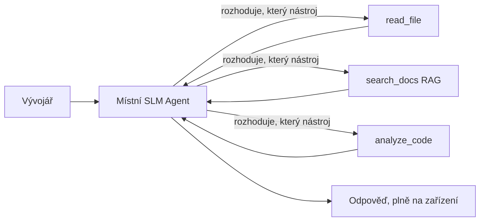
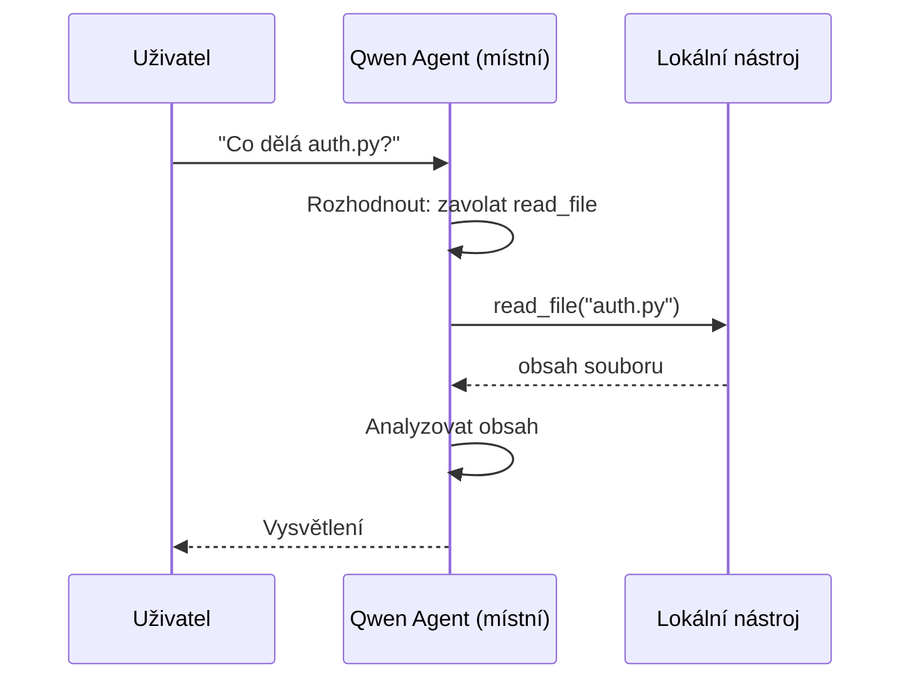
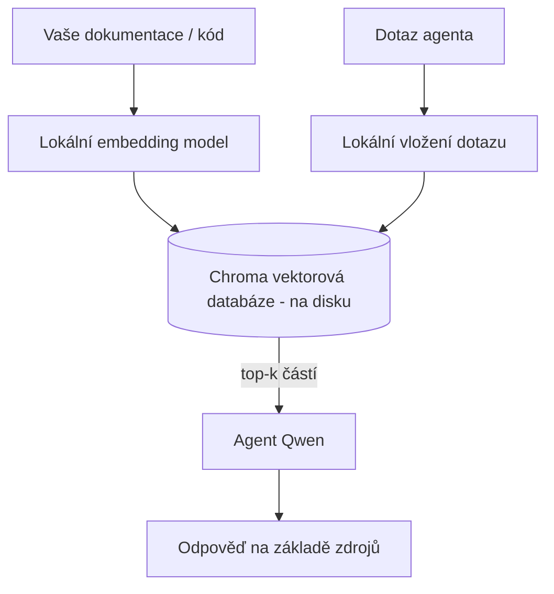
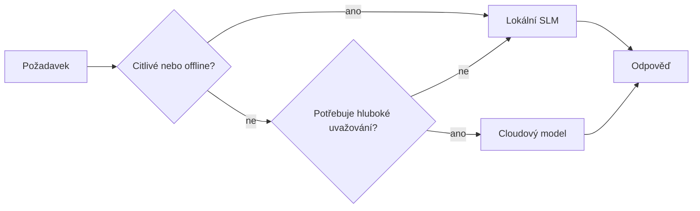

# Vytváření lokálních AI agentů pomocí Microsoft Foundry Local a Qwen


Předchozí lekce škálovala agenty *nahoru* do cloudu. Tato je přenáší *dolů* na jeden stroj. Na konci budete mít fungujícího inženýrského asistenta, který rozumí, volá nástroje, čte vaše soubory a vyhledává v dokumentaci — **bez jediného cloudového inferenčního volání.**

Proč byste to chtěli? Tři důvody, které se neustále objevují v reálné inženýrské práci:

- **Soukromí.** Kód a dokumenty nikdy neopustí zařízení. Žádný prompt, žádný úryvek, žádná data zákazníka nepřejdou přes síťovou hranici.
- **Náklady.** Lokální inference nemá žádné účtování za tokeny. Můžete iterovat celý den za cenu elektřiny.
- **Offline.** Na palubě letadla, v zabezpečeném zařízení nebo během výpadku agent stále funguje.

Podmínkou je, že vyměňujete nejmodernější cloudový model za **Small Language Model (SLM)** běžící na vašem CPU, GPU nebo NPU. Tato lekce je o vytváření agentů, kteří jsou *dobří* v rámci tohoto omezení, místo předstírání, že omezení neexistuje.

## Úvod

Tato lekce pokrývá:

- **Small Language Models (SLM)** — co jsou, kde vynikají a kde ne.
- **Microsoft Foundry Local** — runtime, který stahuje a poskytuje modely přímo na zařízení přes **OpenAI-kompatibilní API**.
- **Qwen modely s voláním funkcí** — SLM, které spolehlivě generují volání nástrojů, což umožňuje vytvářet lokální *agenty* (nejen lokální chat).
- **Lokální nástroje, lokální RAG a lokální MCP** — dávají agentovi schopnosti bez cloudu.
- **Hybridní vzory** — kdy udržovat věci lokální a kdy se spolehnout na cloud.

## Cíle učení

Po dokončení této lekce budete vědět, jak:

- Vysvětlit kompromisy SLM a vybrat vhodné případy použití lokálních agentů.
- Poskytnout Qwen model lokálně pomocí Foundry Local a připojit se k němu přes OpenAI-kompatibilní endpoint.
- Vytvořit agenta volajícího nástroje, který běží kompletně na vašem pracovním stroji.
- Přidat lokální RAG přes vlastní dokumenty pomocí lokální vektorové databáze (Chroma).
- Připojit agenta k lokálnímu MCP serveru a uvažovat o hybridním lokálním/cloudovém designu.

## Požadavky

Tato lekce předpokládá, že jste dokončili předchozí lekce a jste pohodlní s:

- [Používání nástrojů](../04-tool-use/README.md) (Lekce 4) a [Agentický RAG](../05-agentic-rag/README.md) (Lekce 5).
- [Agentické protokoly / MCP](../11-agentic-protocols/README.md) (Lekce 11).
- [Microsoft Agent Framework](../14-microsoft-agent-framework/README.md) (Lekce 14).

Také budete potřebovat:

- Vývojářské pracovní stanici. **8 GB RAM je reálný minimální požadavek**; 16 GB+ je pohodlné. GPU nebo NPU pomáhá, ale není vyžadováno.
- **Microsoft Foundry Local** nainstalovaný (viz sekce instalace níže).
- Python 3.12+ a balíčky v repozitáři [`requirements.txt`](../../../requirements.txt), plus `foundry-local-sdk`, `openai` a `chromadb` pro tuto lekci.

## Small Language Models: Správný nástroj pro lokální práci

Nejmodernější cloudový model má stovky miliard parametrů a za sebou datové centrum. SLM má pár miliard parametrů a musí se vejít do RAM vašeho notebooku. Tento rozdíl nastavuje jasná očekávání.

**SLM vynikají v:**

- Strukturovaných, omezených úkolech — klasifikace, extrakce, shrnutí známého dokumentu.
- **Volání nástrojů** — rozhodování, kterou funkci volat a s jakými argumenty.
- Rychlé, levné a soukromé iterace nad vlastními daty.

**SLM jsou slabší v:**

- Otevřeném, vícekrokovém uvažování nad velkým kontextem.
- Širokých znalostech světa (viděli méně a více zapomínají).

Vítězná strategie pro lokální agenty je proto: **nechte SLM orchestraci a nechte nástroje dělat těžkou práci.** Model nemusí *znát* vaši kódovou základnu — musí vědět, kdy volat `read_file` a `search_docs`. To přímo odpovídá silným stránkám SLM.



## Microsoft Foundry Local

**Microsoft Foundry Local** je lehký runtime, který stahuje, spravuje a poskytuje modely kompletně na vašem stroji. Jeho nejdůležitější funkcí pro nás je, že vystavuje **OpenAI-kompatibilní HTTP endpoint** — což znamená, že OpenAI SDK a OpenAI klient Microsoft Agent Frameworku s ním fungují pouze změnou `base_url`. Vše, co jste se naučili o budování agentů, přechází přímo; jen endpoint se přesouvá z cloudu na `localhost`.

Foundry Local také automaticky vybere nejlepší verzi modelu pro váš hardware — CPU build, CUDA/GPU build nebo NPU build — takže nemusíte ručně optimalizovat pro každý stroj.

### Instalace

Nainstalujte Foundry Local (viz [dokumentaci](https://learn.microsoft.com/azure/ai-foundry/foundry-local/) pro váš OS) a poté ověřte, že funguje:

```bash
# Instalace (příklad; postupujte podle dokumentace pro vaši platformu)
winget install Microsoft.FoundryLocal      # Windows
# brew install microsoft/foundrylocal/foundrylocal   # macOS

# Stáhněte a spusťte model Qwen, poté spusťte lokální službu
foundry model run qwen2.5-7b-instruct
foundry service status
```

Jakmile služba běží, máte lokální OpenAI-kompatibilní endpoint (typicky `http://localhost:PORT/v1`). Notebok používá `foundry-local-sdk` k automatickému zjištění endpointu, takže nemusíte zadávat port natvrdo.

## Qwen volání funkcí: Proč je to důležité

Agent je agentem pouze pokud může volat nástroje. Mnoho SLM dokáže chatovat, ale vytváří nespolehlivá, špatně formátovaná volání nástrojů. **Qwen** modely jsou trénovány pro volání funkcí a konzistentně vytváří dobře formátované struktury volání nástrojů — což přesně umožňuje proměnit lokální chat model v lokální *agenta*.

Průběh je standardní smyčka volání nástrojů, kterou už znáte, jen běží na zařízení:



## Lokální RAG

Vyhledávání v dokumentaci je místem, kde lokální agenti prokazují svůj přínos. Místo abyste doufali, že SLM si zapamatoval dokumentaci vašeho frameworku, zakódujete tyto dokumenty do **lokální vektorové databáze** a necháte agenta na vyžádání získávat relevantní úryvky.

Používáme **Chroma**, vnořený vektorový úložiště, které běží v procesu bez nutnosti serveru. Potrubí je kompletně lokální: lokální embedding model → lokální vektory → lokální vyhledávání → lokální SLM.



Toto je stejný Agentický RAG vzor jako v Lekci 5 — jediný rozdíl je, že všechny komponenty běží na vašem stroji.

## Lokální MCP Servery

[MCP](../11-agentic-protocols/README.md) je transport, ne cloudová služba. MCP server může běžet jako lokální proces na `stdio`, poskytující nástroje vašemu agentovi přes standardní protokol. To vám umožňuje znovu použít rostoucí ekosystém MCP serverů — přístup k souborovému systému, git operace, dotazy do databáze — zcela offline.

Bezpečnostní postoj se liší od cloudu, ale není nulový: lokální MCP server běží s oprávněními vašeho uživatele, proto nastavte rozsah, co může ovlivnit (adresář projektu, ne celou domovskou složku) a považujte jeho výstupy za vstupy, které je třeba ověřit.

## Hybridní cloudové a lokální vzory

Priorita lokálního neznamená pouze lokální. Zralé systémy volí podle citlivosti a obtížnosti:

| Situace | Kde běží |
| --- | --- |
| Citlivý kód / data nebo offline | **Lokální SLM** |
| Jednoduchý, omezený úkol | **Lokální SLM** (levné, rychlé) |
| Obtížné vícekrokové uvažování nad necitlivými daty | **Cloudový model** |
| Všechno během výpadku | **Lokální SLM** (přiměřené snížení kvality) |

To odráží koncept **směrování modelu** z Lekce 16 — akorát že jeden z „modelů“ je vaše vlastní zařízení. Robustní design se při nedostupnosti cloudu vrací k lokálnímu, takže agent klesá v kvalitě místo úplného pádu.



## Praktická část: Lokální inženýrský asistent

Otevřete [`code_samples/17-local-agent-foundry-local.ipynb`](./code_samples/17-local-agent-foundry-local.ipynb) a projděte ho. Vytvoříte **lokálního inženýrského asistenta**, který běží kompletně na vašem pracovním stroji a umí:

1. **Volat nástroje** — pomocí Qwen volání funkcí přes Foundry Local.
2. **Provádět lokální operace se soubory** — listovat a číst soubory v adresáři projektu.
3. **Analyzovat kód** — reportovat základní metriky u zdrojového souboru.
4. **Vyhledávat v dokumentaci** — lokální RAG přes adresář dokumentace s Chromou.
5. **Použít MCP** — připojit se k lokálnímu MCP serveru (s přátelským přeskočením, pokud není nakonfigurován).

Žádné cloudové inference nejsou použity.

### Průvodce krok za krokem

Asistent se připojuje k Foundry Local přes OpenAI-kompatibilní endpoint, takže kód agenta vypadá téměř identicky jako v cloudových lekcích — mění se jen klient:

```python
from foundry_local import FoundryLocalManager
from openai import OpenAI

# Foundry Local najde/stáhne model a poskytne nám lokální koncový bod.
manager = FoundryLocalManager(\"qwen2.5-7b-instruct\")
client = OpenAI(base_url=manager.endpoint, api_key=manager.api_key)  # api_key je lokální zástupce
```

Nástroje jsou obyčejné Python funkce omezené na adresář projektu:

```python
def read_file(path: str) -> str:
    \"\"\"Read a file, but only inside the sandboxed project directory.\"\"\"
    full = (PROJECT_ROOT / path).resolve()
    if PROJECT_ROOT not in full.parents and full != PROJECT_ROOT:
        return \"Access denied: path is outside the project directory.\"
    return full.read_text(encoding=\"utf-8\")
```

Všimněte si sandboxové kontroly — i lokálně je nástroj čtoucí libovolné cesty rizikový. Notebook omezuje každý nástroj na jeden kořenový adresář projektu.

## Kontrola znalostí

Otestujte své porozumění před tím, než přejdete k úkolu.

**1. Uveďte dva konkrétní důvody, proč spustit agenta lokálně místo v cloudu.**

<details>
<summary>Odpověď</summary>

Kterékoli dva z: **soukromí** (kód a data nikdy neopouštějí zařízení), **náklady** (žádné účtování za tokeny), a **offline schopnost** (funguje bez sítě — v letadle, v zabezpečeném zařízení nebo během výpadku). Regulační/kompliance omezení, která zakazují odesílání dat mimo zařízení, jsou častým důvodem pro soukromí.
</details>

**2. Jaké je doporučené rozdělení práce mezi SLM a jeho nástroji v lokálním agentovi a proč?**

<details>
<summary>Odpověď</summary>

Nechte SLM **orkestrovat** (rozhodnout, který nástroj zavolat a s jakými argumenty) a nechte **nástroje dělat těžkou práci** (čtení souborů, získávání dokumentů, počítání výsledků). SLM jsou silné v omezených rozhodnutích jako výběr nástrojů, ale slabší v širokých znalostech a dlouhém vícekrokovém uvažování, proto spoléhání na nástroje hraje jejich silné stránky.
</details>

**3. Co umožňuje opětovné použití cloudového kódu agenta s Foundry Local?**

<details>
<summary>Odpověď</summary>

Foundry Local vystavuje **OpenAI-kompatibilní HTTP endpoint**. OpenAI SDK a OpenAI klient Agent Frameworku pracují s ním pouhou změnou `base_url` (a použitím lokálního placeholder API klíče). Vše ostatní v kódu agenta zůstává stejné.
</details>

**4. Proč používáme právě Qwen model s voláním funkcí namísto jakéhokoli SLM?**

<details>
<summary>Odpověď</summary>

Protože agent musí produkovat spolehlivá, dobře formátovaná **volání nástrojů**. Mnoho SLM umí chatovat, ale generují chybné nebo nekonzistentní struktury volání nástrojů. Qwen modely jsou trénovány na volání funkcí a vytvářejí konzistentní volání nástrojů, což promění lokální chat model v fungující lokální agenta.
</details>

**5. Které komponenty v lokálním RAG pipeline běží na stroji?**

<details>
<summary>Odpověď</summary>

Všechny: embedding model, vektorová databáze (Chroma, na disku), krok vyhledávání a SLM. Dokumenty jsou embedovány lokálně, uloženy lokálně, vyhledávány lokálně a model na zařízení na ně uvažuje — žádná komponenta se nedotýká cloudu.
</details>

**6. Lokální MCP server běží na vašem stroji. Znamená to, že je automaticky bezpečný? Jaké opatření byste měli stále přijmout?**

<details>
<summary>Odpověď</summary>

Ne. Lokální MCP server běží s oprávněními vašeho uživatele, takže může ovlivnit cokoliv, co můžete vy. Omezte jej na to, co potřebuje (například jeden adresář projektu místo celé domovské složky) a považujte jeho výstupy za vstupy, které je nutné ověřit dřív, než na ně budete reagovat.
</details>

**7. Popište smysluplné pravidlo hybridního směrování zahrnující lokální model.**

<details>
<summary>Odpověď</summary>

Směrujte citlivé nebo offline požadavky na lokální SLM; jednoduché omezené úlohy také na lokální SLM kvůli rychlosti a nákladům; složité vícekrokové uvažování nad necitlivými daty do cloudového modelu; a při nedostupnosti cloudu se vraťte k lokálnímu SLM, takže agent sníží kvalitu místo úplného pádu. To je směrování modelů (Lekce 16) s vaším strojem jako jedním z modelů.
</details>

**8. Jaký je reálný minimální požadavek na RAM pro běh lokálního agenta v této lekci a co vám více RAM přinese?**

<details>
<summary>Odpověď</summary>

Přibližně **8 GB** je realistický minimální požadavek; 16 GB a více je pohodlné. Více RAM umožňuje spouštět větší, schopnější modely a udržet více kontextu v paměti. GPU nebo NPU zrychlují inferenci, ale nejsou nutné — Foundry Local zvolí CPU build, pokud není k dispozici akcelerátor.
</details>

## Úkol

Rozšiřte lokálního inženýrského asistenta na **lokálního recenzenta dokumentace** pro malý projekt dle vašeho výběru (můžete použít některou lekční složku z tohoto repozitáře).

Vaše řešení by mělo:

1. **Indexovat reálnou složku s dokumentací/kódem** do Chromy (alespoň pět souborů).
2. **Přidat nástroj `find_todos`**, který prohledá projekt pro komentáře `TODO`/`FIXME` a vrátí je se souborem a číslem řádku — s použitím stejné sandboxové kontroly jako `read_file`.

3. **Zeptejte se agenta na tři otázky**, které ho donutí kombinovat nástroje: jedna čistě RAG otázka, jedna vyžadující přečtení konkrétního souboru, a jedna vyžadující nalezení TODO.
4. **Změřte to**: zapište čas každé ze tří odpovědí do markdown buňky. Komentujte, zda je doba odezvy přijatelná pro váš zamýšlený pracovní tok.

Pak napište krátký odstavec o tom, **co byste přesunuli do cloudu a co byste ponechali lokálně** pro tohoto recenzenta a proč. Hodnoceni jste za to, zda jsou lokální komponenty správně propojené a zda je vaše hybridní uvažování správné — ne za kvalitu modelu.

## Shrnutí

V této lekci jste vytvořili agenta, který běží zcela na vašem vlastním počítači:

- **SLM** mění šíři za soukromí, náklady a offline provoz — a vynikají, když **orchestruji nástroje** místo toho, aby sami nesly veškeré znalosti.
- **Foundry Local** poskytuje modely přímo na zařízení za **OpenAI-kompatibilním endpointem**, takže váš cloudový kód agenta převede změna jednoho řádku.
- **Qwen modely s voláním funkcí** umožňují spolehlivé volání lokálních nástrojů — a tudíž i lokálních *agentů*.
- **Lokální RAG** (Chroma) a **lokální MCP** dávají agentovi možnosti, aniž by opouštěl zařízení.
- **Hybridní vzory** vám umožní přiřazovat úlohy podle citlivosti a náročnosti, s lokálním jako elegantní záložní variantou.

Tím se uzavírá nasazovací oblouk: Lekce 16 škálovala agenty do Microsoft Foundry, a tato lekce je škáluje dolů na jedno pracovní stanici. Následující lekce se zaměřuje na zabezpečení nasazených agentů.

## Další zdroje

- <a href="https://learn.microsoft.com/azure/ai-foundry/foundry-local/" target="_blank">Dokumentace Microsoft Foundry Local</a>
- <a href="https://learn.microsoft.com/azure/ai-foundry/what-is-azure-ai-foundry" target="_blank">Dokumentace Microsoft Foundry</a>
- <a href="https://learn.microsoft.com/en-us/agent-framework/overview/?wt.mc_id=youtube_26688_organicsocial_reactor&pivots=programming-language-python" target="_blank">Microsoft Agent Framework</a>
- <a href="https://qwen.readthedocs.io/en/latest/framework/function_call.html" target="_blank">Dokumentace Qwen pro volání funkcí</a>
- <a href="https://modelcontextprotocol.io/" target="_blank">Model Context Protocol (MCP)</a>
- <a href="https://docs.trychroma.com/" target="_blank">Chroma vektorová databáze</a>

## Předchozí lekce

[Nasazení škálovatelných agentů](../16-deploying-scalable-agents/README.md)

## Další lekce

[Zabezpečení AI agentů](../18-securing-ai-agents/README.md)

---

<!-- CO-OP TRANSLATOR DISCLAIMER START -->
**Prohlášení o omezení odpovědnosti**:
Tento dokument byl přeložen pomocí AI překladatelské služby [Co-op Translator](https://github.com/Azure/co-op-translator). Přestože usilujeme o co největší přesnost, mějte prosím na paměti, že automatizované překlady mohou obsahovat chyby nebo nepřesnosti. Originální dokument v jeho mateřském jazyce by měl být považován za autoritativní zdroj. Pro kritické informace se doporučuje profesionální lidský překlad. Nejsme odpovědní za jakékoli nedorozumění nebo nesprávné interpretace vzniklé použitím tohoto překladu.
<!-- CO-OP TRANSLATOR DISCLAIMER END -->