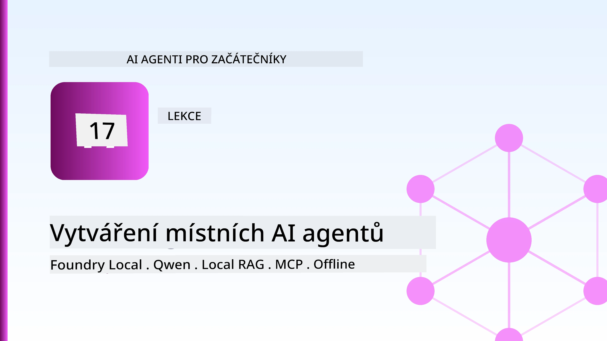
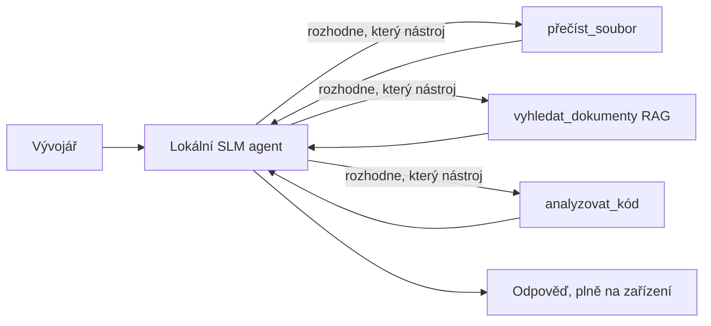
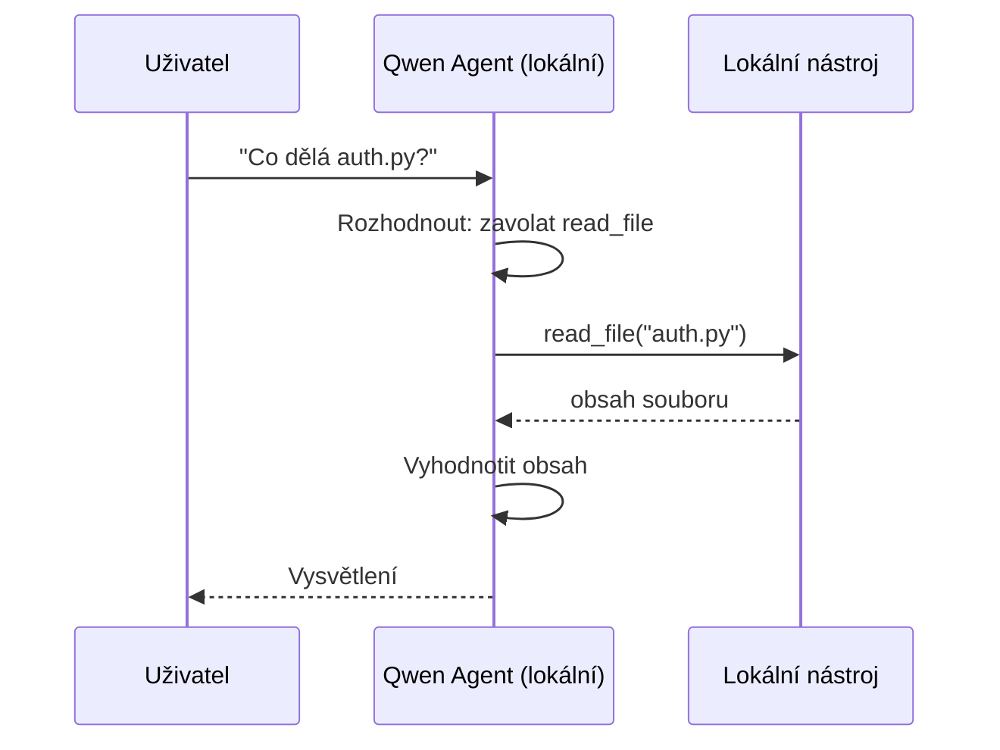
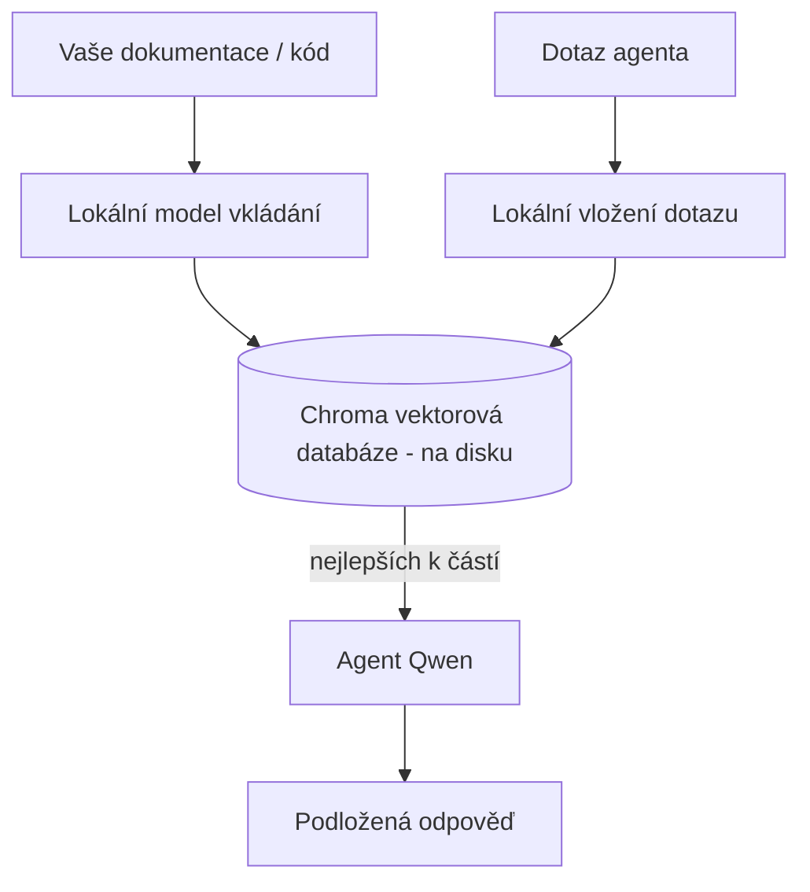
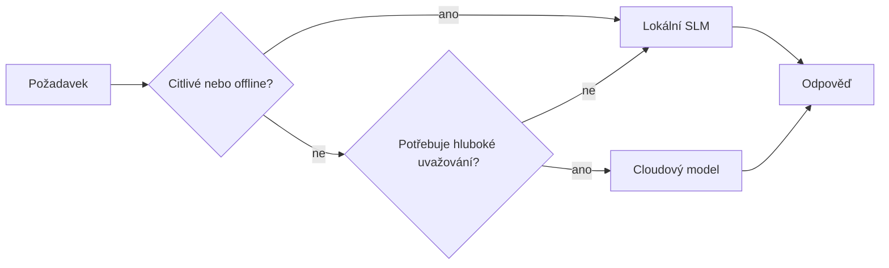

# Vytváření lokálních AI agentů pomocí Microsoft Foundry Local a Qwen



Předchozí lekce škálovala agenty *nahoru* do cloudu. Tato je přenáší *dolů* na jeden stroj. Na konci budete mít funkčního inženýrského asistenta, který uvažuje, volá nástroje, čte vaše soubory a hledá ve vaší dokumentaci — **bez jediného volání do cloudu.**

Proč byste to chtěli? Tři důvody, které se v reálné inženýrské praxi stále opakují:

- **Soukromí.** Kód a dokumenty nikdy neopustí stroj. Žádný prompt, žádný úryvek, žádná data zákazníka nepřekročí síťovou hranici.
- **Cena.** Lokální inferenční systém nemá poplatek za token. Můžete iterovat celý den za cenu elektřiny.
- **Offline.** Na palubě letadla, v zabezpečeném zařízení nebo během výpadku agent stále funguje.

Nevýhodou je, že za cloudový model na špici vyměňujete **malý jazykový model (SLM)** běžící na vašem CPU, GPU nebo NPU. Tato lekce je o budování agentů, kteří jsou *dobří* v tomto omezení, místo předstírání, že omezení neexistuje.

## Úvod

Tato lekce pokrývá:

- **Malé jazykové modely (SLM)** — co jsou, kde vynikají a kde ne.
- **Microsoft Foundry Local** — runtime, který stahuje a poskytuje modely přímo na zařízení přes **OpenAI-kompatibilní API**.
- **Qwen modely pro volání funkcí** — SLM, které spolehlivě generují volání nástrojů, což umožňuje lokální *agenty* (ne jen lokální chat).
- **Lokální nástroje, lokální RAG a lokální MCP** — poskytující agentovi schopnosti bez cloudu.
- **Hybridní vzory** — kdy držet věci lokálně a kdy sáhnout do cloudu.

## Vzdělávací cíle

Po dokončení této lekce budete umět:

- Vysvětlit kompromisy SLM a vybrat vhodné případy použití lokálního agenta.
- Poskytnout Qwen model lokálně s Foundry Local a připojit se k němu přes OpenAI-kompatibilní endpoint.
- Postavit agenta volajícího nástroje, který běží celý na vaší pracovní stanici.
- Přidat lokální RAG přes vaše vlastní dokumenty pomocí lokálního vektorového databáze (Chroma).
- Připojit agenta k lokálnímu MCP serveru a uvažovat o hybridních návrzích lokálně/cloud.

## Předpoklady

Tato lekce předpokládá, že jste dokončili předchozí lekce a jste pohodlní s:

- [Používání nástrojů](../04-tool-use/README.md) (Lekce 4) a [Agentický RAG](../05-agentic-rag/README.md) (Lekce 5).
- [Agentické protokoly / MCP](../11-agentic-protocols/README.md) (Lekce 11).
- [Microsoft Agent Framework](../14-microsoft-agent-framework/README.md) (Lekce 14).

Budete také potřebovat:

- Vývojářskou pracovní stanici. **8 GB RAM je realistické minimum**; 16 GB+ je pohodlné. GPU nebo NPU pomáhá, ale není nutné.
- Nainstalovaný **Microsoft Foundry Local** (viz sekce instalace níže).
- Python 3.12+ a balíčky uvedené v repozitáři [`requirements.txt`](../../../requirements.txt), plus `foundry-local-sdk`, `openai` a `chromadb` pro tuto lekci.

## Malé jazykové modely: správný nástroj pro lokální práci

Model na hranici cloudu má stovky miliard parametrů a datové centrum za sebou. SLM má pár miliard parametrů a musí se vejít do RAM vašeho notebooku. Tento rozdíl nastavuje jasná očekávání.

**SLM jsou dobré v:**

- Strukturované, omezené úkoly — klasifikace, extrakce, shrnutí známého dokumentu.
- **Volání nástrojů** — rozhodování, kterou funkci volat a s jakými argumenty.
- Rychlé, levné a soukromé iterace na vašich vlastních datech.

**SLM jsou slabší v:**

- Otevřené, vícenásobné přesahy uvažování přes velký kontext.
- Široké celosvětové znalosti (viděly méně a více zapomínají).

Vítězná strategie pro lokální agenty je proto: **nechte SLM orchestr(u)ovat a nechte nástroje vykonávat těžkou práci.** Model nemusí *znát* váš kód — musí vědět, kdy volat `read_file` a `search_docs`. To přesně odpovídá silným stránkám SLM.



## Microsoft Foundry Local

**Microsoft Foundry Local** je lehký runtime, který stahuje, spravuje a poskytuje modely úplně na vašem zařízení. Nejvýznamnější funkcí pro nás je, že vystavuje **OpenAI-kompatibilní HTTP endpoint** — což znamená, že OpenAI SDK a OpenAI klient z Microsoft Agent Framework proti němu pracují pouhou změnou `base_url`. Všechno, co jste se naučili o budování agentů, se přímo přenáší; jen endpoint se přenáší z cloudu na `localhost`.

Foundry Local také automaticky vybírá nejlepší sestavení modelu pro váš hardware — CPU sestavení, CUDA/GPU sestavení nebo NPU sestavení — takže nemusíte ručně optimalizovat pro každý stroj.

### Instalace

Nainstalujte Foundry Local (viz [dokumentaci](https://learn.microsoft.com/azure/ai-foundry/foundry-local/) pro váš OS), pak ověřte, že funguje:

```bash
# Instalace (příklad; postupujte podle dokumentace pro vaši platformu)
winget install Microsoft.FoundryLocal      # Windows
# brew install microsoft/foundrylocal/foundrylocal   # macOS

# Stáhněte a spusťte model Qwen, poté spusťte místní službu
foundry model run qwen2.5-7b-instruct
foundry service status
```

Jakmile služba běží, máte lokální, OpenAI-kompatibilní endpoint (typicky `http://localhost:PORT/v1`). Notebook používá `foundry-local-sdk`, který endpoint automaticky zjistí, takže nemusíte pevně kódovat port.

## Qwen volání funkcí: proč je důležité

Agent je agentem jen pokud může volat nástroje. Mnoho SLM může chatovat, ale generují nespolehlivé, chybné volání nástrojů. **Qwen** modely jsou trénované na volání funkcí a konzistentně produkují správně formátované struktury volání nástrojů — což přesně proměňuje místní chat model v lokální *agenta*.

Tok je standardní smyčka volání nástrojů, kterou už znáte, jen běží přímo na zařízení:



## Lokální RAG

Hledání v dokumentaci je místo, kde lokální agenti opravdu vyniknou. Místo toho, abyste doufali, že SLM si zapamatoval dokumentaci vašeho frameworku, vložíte tyto dokumenty do **lokálního vektorového databáze** a necháte agenta vyhledávat relevantní útržky na požádání.

Používáme **Chroma**, vestavěný vektorový obchod, který běží v rámci procesu bez potřeby serveru. Pipeline je kompletně lokální: lokální embedding model → lokální vektory → lokální vyhledávání → lokální SLM.



Toto je stejný Agentický RAG vzor z Lekce 5 — jediná změna je, že všechny součásti běží na vašem stroji.

## Lokální MCP servery

[MCP](../11-agentic-protocols/README.md) je transport, ne cloudová služba. MCP server může běžet jako lokální proces na `stdio`, vystavuje nástroje vašemu agentovi přes standardní protokol. To umožňuje znovupoužít rostoucí ekosystém MCP serverů — přístup k souborovému systému, git operace, dotazy do databáze — zcela offline.

Bezpečnostní nastavení se liší od cloudu, ale není nulové: lokální MCP server stále běží s oprávněními vašeh uživatele, proto omezte, na co může sáhnout (adresář projektu, ne celý váš domovský adresář) a považujte jeho výstupy za vstupy k ověření.

## Hybridní cloudové a lokální vzory

Nejprve lokální neznamená pouze lokální. Dospělé systémy směrují podle citlivosti a obtížnosti:

| Situace | Kde běží |
| --- | --- |
| Citlivý kód / data, nebo offline | **Lokální SLM** |
| Jednoduchý, omezený úkol | **Lokální SLM** (levně, rychle) |
| Těžké vícenásobné uvažování na necitlivých datech | **Cloudový model** |
| Všechno během výpadku | **Lokální SLM** (přechodné zhoršení) |

To odráží myšlenku **směrování modelů** z Lekce 16 — jenže jedním z „modelů“ je nyní váš vlastní stroj. Robustní návrh se při nedostupnosti cloudu vrátí k lokálnímu modelem, takže agent degraduje v kvalitě, místo aby úplně selhal.



## Praktická laboratoř: Lokální inženýrský asistent

Otevřete [`code_samples/17-local-agent-foundry-local.ipynb`](./code_samples/17-local-agent-foundry-local.ipynb) a projděte se jím. Postavíte **lokálního inženýrského asistenta**, který běží celý na vaší pracovní stanici a umí:

1. **Volat nástroje** — přes Qwen funkční volání přes Foundry Local.
2. **Provádět lokální operace se soubory** — zobrazit seznam a číst soubory v adresáři projektu.
3. **Analyzovat kód** — hlásit základní metriky zdrojového souboru.
4. **Vyhledávat v dokumentaci** — lokální RAG přes složku s dokumentací pomocí Chroma.
5. **Používat MCP** — připojit se k lokálnímu MCP serveru (s jemným přeskočením, pokud není nakonfigurován).

Nikdy se nepoužívá inference v cloudu.

### Průchod

Asistent se připojuje k Foundry Local přes OpenAI-kompatibilní endpoint, takže kód agenta vypadá téměř stejně jako v lekcích pro cloud — mění se jen klient:

```python
from foundry_local import FoundryLocalManager
from openai import OpenAI

# Foundry Local nalezne/stáhne model a poskytne nám lokální koncový bod.
manager = FoundryLocalManager(\"qwen2.5-7b-instruct\")
client = OpenAI(base_url=manager.endpoint, api_key=manager.api_key)  # api_key je lokální zástupce
```

Nástroje jsou obyčejné Python funkce omezené na adresář projektu:

```python
def read_file(path: str) -> str:
    \"\"\"Read a file, but only inside the sandboxed project directory.\"\"\"
    full = (PROJECT_ROOT / path).resolve()
    if PROJECT_ROOT not in full.parents and full != PROJECT_ROOT:
        return \"Access denied: path is outside the project directory.\"
    return full.read_text(encoding=\"utf-8\")
```

Všimněte si kontrolu sandboxu — i lokálně je nástroj čtoucí libovolné cesty rizikový. Notebook drží každý nástroj omezený na jediný kořen projektu.

## Kontrola znalostí

Otestujte své porozumění před přechodem ke cvičení.

**1. Uveďte dva konkrétní důvody, proč spouštět agenta lokálně místo v cloudu.**

<details>
<summary>Odpověď</summary>

Jakékoliv dva z: **soukrví** (kód a data nikdy neopustí stroj), **cena** (žádný poplatek za token při inferenci) a **offline schopnost** (funguje bez sítě — v letadle, v zabezpečeném zařízení nebo při výpadku). Předpisové/kompliance požadavky, které zakazují odesílání dat mimo zařízení, jsou častým důvodem pro soukromí.
</details>

**2. Jaký je doporučený rozdělení práce mezi SLM a jeho nástroji u lokálního agenta a proč?**

<details>
<summary>Odpověď</summary>

Nechte SLM **orchestrace** (rozhodování, který nástroj zavolat a s jakými argumenty) a nechte **nástroje dělat těžkou práci** (čtení souborů, vyhledávání v dokumentaci, výpočet výsledků). SLM jsou silné v omezených rozhodnutích jako výběr nástroje, ale slabší ve širokých znalostech a dlouhém vícenásobném uvažování, proto spoléhání na nástroje hraje jejich silné stránky.
</details>

**3. Co umožňuje znovupoužít kód cloudového agenta s Foundry Local?**

<details>
<summary>Odpověď</summary>

Foundry Local vystavuje **OpenAI-kompatibilní HTTP endpoint**. OpenAI SDK a OpenAI klient Agent Frameworku proti němu pracují pouhou změnou `base_url` (a použitím lokálního placeholder API klíče). Vše ostatní v kódu agenta zůstává stejné.
</details>

**4. Proč používáme speciálně Qwen model pro volání funkcí a ne jen jakýkoliv SLM?**

<details>
<summary>Odpověď</summary>

Protože agent musí produkovat spolehlivá, správně formátovaná **volání nástrojů**. Mnoho SLM může chatovat, ale generuje chybné nebo nekonzistentní struktury volání nástrojů. Qwen modely jsou trénované na volání funkcí a produkují konzistentní volání nástrojů, což přesně proměňuje lokální chat model v funkčního lokálního agenta.
</details>

**5. Které komponenty v lokální RAG pipeline běží na stroji?**

<details>
<summary>Odpověď</summary>

Všechny: embedding model, vektorová databáze (Chroma, na disku), vyhledávací krok a SLM. Dokumenty jsou vloženy lokálně, uloženy lokálně, vyhledávány lokálně a zpracovávány lokálním modelem — žádná část se nedotýká cloudu.
</details>

**6. Lokální MCP server běží na vašem stroji. Znamená to automaticky, že je bezpečný? Jaké opatření byste měli ještě učinit?**

<details>
<summary>Odpověď</summary>

Ne. Lokální MCP server běží s oprávněními vašeho uživatele, takže může sáhnout kamkoli, kam můžete vy. Omezte ho na to, co potřebuje (například na jeden adresář projektu místo celého domovského adresáře) a k jeho výstupům přistupujte jako ke vstupům k ověření, než s nimi budete pracovat.
</details>

**7. Popište rozumné pravidlo hybridního směrování, které zahrnuje lokální model.**

<details>
<summary>Odpověď</summary>

Směrujte citlivé nebo offline požadavky na lokální SLM; směrujte jednoduché omezené úkoly na lokální SLM pro rychlost a cenu; směrujte těžké vícenásobné uvažování na necitlivých datech na cloudový model; a v případě nedostupnosti cloudu se vraťte k lokálnímu SLM, aby agent degraduje plynule místo selhání. Toto je směrování modelů (Lekce 16) s lokálním strojem jako jedním z modelů.
</details>

**8. Jaká je realistická minimální hodnota RAM pro běh lokálního agenta v této lekci a co vám přinese více RAM?**

<details>
<summary>Odpověď</summary>

Přibližně **8 GB** je realistické minimum; 16 GB+ je pohodlné. Více RAM vám umožní spustit větší, schopnější modely a udržet více kontextu v paměti. GPU nebo NPU zrychlí inferenci, ale není nutné — Foundry Local vybírá CPU sestavení, pokud není akcelerátor k dispozici.
</details>

## Zadání

Rozšiřte lokálního inženýrského asistenta na **lokálního recenzenta dokumentace** pro malý projekt dle vašeho výběru (můžete použít jednu z lekcí v tomto repozitáři).

Vaše odevzdání by mělo:

1. **Nainicializovat skutečnou složku dokumentace/kódu** do Chromy (alespoň pět souborů).
2. **Přidat nástroj `find_todos`**, který prohledá projekt kvůli komentářům `TODO`/`FIXME` a vrátí je s uvedením souboru a čísla řádku — přičemž zachová stejnou kontrolu sandboxu jako `read_file`.

3. **Zeptejte se agenta na tři otázky**, které jej donutí kombinovat nástroje: jedna čistě RAG otázka, jedna, která vyžaduje čtení konkrétního souboru, a jedna, která vyžaduje hledání TODOs.
4. **Změřte to**: změřte čas tří odpovědí a poznamenejte je do markdownové buňky. Komentujte, zda je zpoždění přijatelné pro váš zamýšlený pracovní postup.

Poté napište krátký odstavec o **tom, co byste přesunuli do cloudu a co byste ponechali lokálně** pro tohoto recenzenta a proč. Hodnotí se, zda jsou lokální komponenty správně propojeny a zda je vaše hybridní uvažování správné — ne kvalita modelu.

## Shrnutí

V této lekci jste vytvořili agenta, který běží zcela na vašem vlastním zařízení:

- **SLMs** obětují rozsah za soukromí, náklady a offline provoz — a vynikají, když **orkestrují nástroje** místo toho, aby uchovávaly veškeré znalosti samy.
- **Foundry Local** poskytuje modely přímo na zařízení za **OpenAI-kompatibilním endpointem**, takže váš cloudový kód agenta lze přenést jednou změnou řádku.
- **Qwen modely volání funkcí** umožňují spolehlivé lokální volání nástrojů — a tedy i lokálních *agentů*.
- **Lokální RAG** (Chroma) a **lokální MCP** dávají agentovi schopnosti bez opuštění zařízení.
- **Hybridní vzory** vám umožňují směrovat podle citlivosti a obtížnosti, přičemž lokální část slouží jako elegantní záložní varianta.

Tímto je dokončena nasazovací část: Lekce 16 škálovala agenty do Microsoft Foundry a tato lekce je zmenšila na jedno pracovní stanoviště. Následující lekce se zaměří na zabezpečení nasazených agentů.

## Další zdroje

- <a href="https://learn.microsoft.com/azure/ai-foundry/foundry-local/" target="_blank">Dokumentace Microsoft Foundry Local</a>
- <a href="https://learn.microsoft.com/azure/ai-foundry/what-is-azure-ai-foundry" target="_blank">Dokumentace Microsoft Foundry</a>
- <a href="https://learn.microsoft.com/en-us/agent-framework/overview/?wt.mc_id=youtube_26688_organicsocial_reactor&pivots=programming-language-python" target="_blank">Microsoft Agent Framework</a>
- <a href="https://qwen.readthedocs.io/en/latest/framework/function_call.html" target="_blank">Dokumentace volání funkcí Qwen</a>
- <a href="https://modelcontextprotocol.io/" target="_blank">Model Context Protocol (MCP)</a>
- <a href="https://docs.trychroma.com/" target="_blank">Chroma vektorová databáze</a>

## Předchozí lekce

[Nasazení škálovatelných agentů](../16-deploying-scalable-agents/README.md)

## Následující lekce

[Zabezpečení AI agentů](../18-securing-ai-agents/README.md)

---

<!-- CO-OP TRANSLATOR DISCLAIMER START -->
**Prohlášení o omezení odpovědnosti**:
Tento dokument byl přeložen pomocí AI překladatelské služby [Co-op Translator](https://github.com/Azure/co-op-translator). Přestože usilujeme o co největší přesnost, mějte prosím na paměti, že automatizované překlady mohou obsahovat chyby nebo nepřesnosti. Originální dokument v jeho mateřském jazyce by měl být považován za autoritativní zdroj. Pro kritické informace se doporučuje profesionální lidský překlad. Nejsme odpovědní za jakékoli nedorozumění nebo nesprávné interpretace vzniklé použitím tohoto překladu.
<!-- CO-OP TRANSLATOR DISCLAIMER END -->