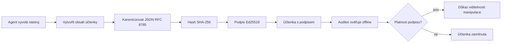
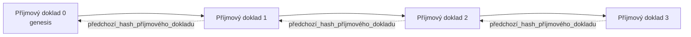

[Sledujte video lekce: Zabezpečení AI agentů pomocí kryptografických potvrzení](https://youtu.be/PLACEHOLDER_VIDEO_ID)

> _(Video lekce a náhledový obrázek budou přidány týmem Microsoft po sloučení, odpovídající vzoru lekcí 14 / 15.)_

# Zabezpečení AI agentů pomocí kryptografických potvrzení

## Úvod

Tato lekce pokryje:

- Proč jsou auditní stopy AI agentů důležité pro dodržování předpisů, ladění a důvěru.
- Co je to kryptografické potvrzení a jak se liší od nepodepsané logovací řádky.
- Jak vytvořit podepsané potvrzení o volání nástroje agenta v čistém Pythonu.
- Jak offline ověřit potvrzení a odhalit manipulaci.
- Jak řetězit potvrzení tak, že odstranění nebo přeuspořádání jednoho potvrdí přerušení řetězce.
- Co potvrzení dokazují a co výslovně nedokazují.

## Cíle učení

Po dokončení této lekce budete umět:

- Identifikovat selhávající režimy, které motivují použití kryptografického původu u akcí agenta.
- Vytvořit potvrzení podepsané Ed25519 nad kanonickým JSON payloadem.
- Nezávisle ověřit potvrzení pouze za použití veřejného klíče podepisovatele.
- Detekovat manipulaci opětovným ověřením upraveného potvrzení.
- Vytvořit sekvenci potvrzení spojenou hashem a vysvětlit, proč řetězec má význam.
- Rozpoznat hranici mezi tím, co potvrzení dokazují (přiřazení, integrita, pořadí) a co ne (správnost akce, správnost zásad).

## Problém: Auditní stopa vašeho agenta

Představte si, že jste nasadili AI agenta pro Contoso Travel. Agent čte požadavky zákazníků, volá API letů k vyhledání možností a rezervuje místa jménem zákazníka. Za poslední čtvrtletí agent zpracoval 50 000 rezervací.

Dnes přichází auditor. Položí jednoduchou otázku: „Ukažte mi, co váš agent udělal.“

Předáte mu své log soubory. Auditor je prohlédne a položí složitější otázku: „Jak vím, že tyto záznamy nebyly upraveny?“

To je problém auditní stopy. Většina dnešních nasazení agentů spoléhá na:

- **Aplikační logy**: psané samotným agentem, upravitelné kýmkoli s přístupem k souborovému systému.
- **Cloudové logovací služby**: nezměnitelné na úrovni platformy, ale jen pokud auditor důvěřuje provozovateli platformy.
- **Databázové transakční logy**: vhodné pro změny v databázi, ale ne pro libovolná volání nástrojů.

Žádný z těchto přístupů nemůže odpovědět auditorovi bez požadavku důvěry v někoho (vás, vašeho cloudového poskytovatele, dodavatele databáze). Pro interní použití je tato důvěra často přijatelná. Pro regulované oblasti (finance, zdravotnictví, cokoli podléhající EU AI Act) není.

Kryptografická potvrzení tento problém řeší tím, že každou akci agenta dělají nezávisle ověřitelnou. Auditor nemusí důvěřovat vám. Potřebuje pouze váš veřejný klíč a samotné potvrzení.

## Co je kryptografické potvrzení?

Potvrzení je JSON objekt, který zaznamenává, co agent udělal, podepsaný digitálním podpisem.



Minimální potvrzení vypadá takto:

```json
{
  "type": "agent.tool_call.v1",
  "agent_id": "contoso-travel-bot",
  "tool_name": "lookup_flights",
  "tool_args_hash": "sha256:a3f9c1...",
  "result_hash": "sha256:7b2e1d...",
  "policy_id": "contoso-travel-policy-v3",
  "timestamp": "2026-04-25T14:30:00Z",
  "sequence": 47,
  "previous_receipt_hash": "sha256:9d4e6a...",
  "signature": {
    "alg": "EdDSA",
    "sig": "c5af83...",
    "public_key": "8f3b2c..."
  }
}
```

Tři vlastnosti zajišťují funkci:

1. **Podpis**. Potvrzení je podepsané bránou agenta pomocí privátního klíče Ed25519. Každý, kdo má odpovídající veřejný klíč, může offline ověřit podpis. Jakákoli manipulace s jakýmkoli polem podpis zneplatní.

2. **Kanonické kódování**. Před podpisem je potvrzení serializováno podle JSON Canonicalization Scheme (JCS, RFC 8785). To zajišťuje, že dvě implementace vytvářející stejný logický dokument mají bytově identický výstup. Bez kanonizace by různí JSON serializéři vytvořili pro stejný obsah různé podpisy.

3. **Hashové řetězení**. Pole `previous_receipt_hash` propojuje každé potvrzení s předchozím. Odstranění nebo přeuspořádání jednoho potvrzení přeruší každé potvrzení, které po něm přišlo. Manipulace je viditelná na úrovni řetězce i v případě obejití individuálních podpisů.

Tyto vlastnosti dohromady poskytují tři záruky:

- **Přiřazení**: tento klíč podepsal tento obsah.
- **Integrita**: obsah se od podpisu nezměnil.
- **Pořadí**: toto potvrzení přišlo v řetězci po onom potvrzení.

## Vytvoření potvrzení v Pythonu

K vytvoření potvrzení nepotřebujete žádnou speciální knihovnu. Kryptografické primitivy jsou široce dostupné a logika je jen několik desítek řádků Pythonu.

Cvičení v `code_samples/18-signed-receipts.ipynb` detailně projdou celý proces. Shrnutí:

```python
import json
import hashlib
import base64
from nacl import signing
from jcs import canonicalize  # RFC 8785 kanonický JSON

def b64url_nopad(data: bytes) -> str:
    return base64.urlsafe_b64encode(data).decode("ascii").rstrip("=")

def sha256_canonical(obj) -> str:
    """SHA-256 of a Python object's JCS-canonical JSON form."""
    return f"sha256:{hashlib.sha256(canonicalize(obj)).hexdigest()}"

# Vygenerujte nebo načtěte podepisovací klíč (v produkci uložte do trezoru klíčů)
signing_key = signing.SigningKey.generate()
verify_key = signing_key.verify_key

# Sestavte datový rámec účtenky (ještě bez podpisu)
tool_args = {"origin": "SYD", "destination": "LAX"}
tool_result = [{"flight": "QF11", "price": 1850, "stops": 0}]

payload = {
    "type": "agent.tool_call.v1",
    "agent_id": "contoso-travel-bot",
    "tool_name": "lookup_flights",
    "tool_args_hash": sha256_canonical(tool_args),
    "result_hash": sha256_canonical(tool_result),
    "policy_id": "contoso-travel-policy-v3",
    "timestamp": "2026-04-25T14:30:00Z",
    "sequence": 0,
    "previous_receipt_hash": None,
}

# Kanonizujte, zahashujte, podepište.
canonical_bytes = canonicalize(payload)
message_hash = hashlib.sha256(canonical_bytes).digest()
signature_bytes = signing_key.sign(message_hash).signature

# Připojte strukturovaný objekt podpisu.
receipt = {
    **payload,
    "signature": {
        "alg": "EdDSA",
        "sig": b64url_nopad(signature_bytes),
        "public_key": b64url_nopad(bytes(verify_key)),
    },
}
```

To je celý proces podepsání. V cvičeních v sešitě projdete každý krok.

## Ověření potvrzení a detekce manipulace

Ověření je opačný proces:

```python
import base64
import hashlib
from nacl import signing
from nacl.exceptions import BadSignatureError
from jcs import canonicalize

def b64url_decode(s: str) -> bytes:
    padding = "=" * ((4 - len(s) % 4) % 4)
    return base64.urlsafe_b64decode(s + padding)

def verify_receipt(receipt: dict) -> bool:
    # Podpis je strukturovaný objekt: {"alg", "sig", "public_key"}.
    sig_obj = receipt.get("signature")
    if not sig_obj or sig_obj.get("alg") != "EdDSA":
        return False

    # Zrekonstruujte užitečné zatížení, které bylo skutečně podepsáno (všechno kromě podpisu).
    payload = {k: v for k, v in receipt.items() if k != "signature"}

    canonical_bytes = canonicalize(payload)
    message_hash = hashlib.sha256(canonical_bytes).digest()

    try:
        verify_key = signing.VerifyKey(b64url_decode(sig_obj["public_key"]))
        verify_key.verify(message_hash, b64url_decode(sig_obj["sig"]))
        return True
    except BadSignatureError:
        return False
```

Tato funkce vezme potvrzení a vrátí `True`, pokud je podpis platný, jinak `False`. Žádný síťový požadavek, žádná závislost na službě, žádná důvěra v třetí stranu není potřeba.

Pro ukázku detekce manipulace se v sešitě projde:

1. Vytvoření platného potvrzení a potvrzení jeho platnosti.
2. Úprava jednoho bytu v poli `tool_args_hash`.
3. Znovuovření ověření a zjištění jeho selhání.

To je praktický důkaz, že potvrzení jsou odolná vůči manipulaci: jakákoli úprava, byť malá, podpis zneplatní.

## Řetězení potvrzení pro vícekrokové agenty

Jedno podepsané potvrzení chrání jednu akci. Řetězec potvrzení chrání posloupnost.



Každé potvrzení zaznamenává hash potvrzení před ním. Aby útočník potichu odstranil potvrzení č. 2, musel by:

- Upravit pole `previous_receipt_hash` v potvrzení 3 (to zneplatní podpis potvrzení 3), NEBO
- Vytvořit nový podpis na upraveném potvrzení 3 (což vyžaduje privátní klíč agenta).

Pokud je privátní klíč uložen v hardwarovém klíčovém úložišti a veřejný klíč publikujete s každým potvrzením, žádný útok není bez odhalení možný.

Sešit projde:

1. Vytvoření řetězce ze tří potvrzení.
2. Ověření, že pole `previous_receipt_hash` každého potvrzení odpovídá skutečnému hashi předchozího potvrzení.
3. Manipulaci jednoho potvrzení uprostřed a zjištění, že řetězec je přerušen přesně v tomto místě.

Takto vytvoříte auditní stopu, kterou může externí auditor ověřit bez důvěry ve vás.

## Co potvrzení dokazují (a co ne)

Toto je nejdůležitější část lekce. Potvrzení jsou mocná, ale jejich moc je omezená.

**Potvrzení dokazují tři věci:**

1. **Přiřazení**: konkrétní klíč podepsal daný payload.
2. **Integritu**: payload se od podpisu nezměnil.
3. **Pořadí**: toto potvrzení přišlo po onom potvrzení v hashovém řetězci.

**Potvrzení NEdokazují:**

1. **Správnost**: že akce agenta byla správná. Potvrzení může být podepsáno stejně snadno pro špatnou odpověď jako pro správnou.
2. **Dodržování zásad**: že zásada uvedená v `policy_id` byla skutečně vyhodnocena, nebo že by tuto akci povolila. Potvrzení zaznamenává to, co bylo tvrzeno, ne co bylo skutečně vynuceno.
3. **Identitu nad rámec klíče**: potvrzení říká „tento klíč podepsal tento obsah.“ Neříká „tento člověk to autorizoval.“ Pro spojení klíče s osobou nebo organizací je potřeba samostatná identifikační infrastruktura (adresář, registr veřejných klíčů apod.).
4. **Pravdivost vstupů**: pokud agent obdrží zmanipulovaný podnět a podle něj jedná, potvrzení věrně zaznamenává tuto akci. Potvrzení jsou závislá na validaci vstupů, nejsou jejich náhradou.

Tato hranice je důležitá ze dvou důvodů:

- Říká vám, k čemu jsou potvrzení užitečná: aby chování agentů bylo auditovatelné a odolné vůči manipulaci, i napříč organizacemi.
- Říká vám, jaké další vrstvy ještě potřebujete: validaci vstupů (Lekce 6), vynucení zásad (stručně zmíněné níže) a identifikační infrastrukturu (mimo rozsah této lekce).

Častá chyba je předpokládat, že „máme potvrzení“ znamená „jsme řízeni.“ Neznamená. Potvrzení jsou základ. Řízení je systém, který na tom postavíte.

## Produkční odkazy

Kód v Pythonu v této lekci je záměrně minimalistický, aby bylo možné každý řádek přečíst a přesně pochopit, co se děje. V produkci máte dvě možnosti:

1. **Postavit se přímo na kryptografických primitivech.** Oněch 50 řádků výše je dostačujících pro mnohé případy užití. PyNaCl (Ed25519) a balíček `jcs` (kanonický JSON) jsou dobře udržované a auditované knihovny.

2. **Použít produkční knihovnu pro potvrzení.** Několik open-source projektů implementuje stejný vzor s dalšími funkcemi (rotace klíčů, dávkové ověřování, distribuce JWK Set, integrace s policy enginy):
   - Formát potvrzení použitý v této lekci vychází z IETF Internet-Draftu (`draft-farley-acta-signed-receipts`), který je v procesu standardizace.
   - Microsoft Agent Governance Toolkit kombinuje potvrzení s rozhodnutími zásad založenými na Cedar; viz Tutorial 33 v příslušném repozitáři pro komplexní příklad.
   - Balíčky `protect-mcp` (npm) a `@veritasacta/verify` (npm) poskytují implementaci podepisování a offline ověřování potvrzení pro Node, určenou pro zabalení jakéhokoli MCP serveru s nezměnitelnou auditní stopou.

Volba mezi vlastní implementací a knihovnou je podobná rozhodování mezi psaním vlastní JWT knihovny a použitím otestované knihovny: obě jsou rozumné; knihovna ušetří čas a omezí auditní plochu; vlastní cesta vás přinutí rozumět každému primitivu. Tato lekce učí vlastní cestu, abyste měli základy pro obě varianty.

## Kontrola znalostí

Ověřte si porozumění před přechodem na praktické cvičení.

**1. Potvrzení je podepsáno privátním klíčem Ed25519 agenta. Auditor má pouze veřejný klíč. Může auditor potvrzení ověřit offline?**

<details>
<summary>Odpověď</summary>

Ano. Ověření Ed25519 vyžaduje pouze veřejný klíč a podepsaná data. Žádný síťový dotaz, žádná služba, žádná důvěra ve třetí stranu. Toto je vlastnost, která dělá potvrzení užitečnými v offline prostředích, mezi organizacemi nebo v nastavení s nízkou důvěrou.
</details>

**2. Útočník upraví pole `policy_id` potvrzení, aby tvrdil, že bylo řízeno volnější zásadou. Podpis byl však spočítán nad původním payloadem. Co se stane při ověření?**

<details>
<summary>Odpověď</summary>

Ověření selže. Podpis byl spočítán nad kanonickými byty původního payloadu; úprava jakéhokoli pole změní kanonické byty, což změní SHA-256 hash a učiní podpis neplatným. Útočník by potřeboval privátní klíč k vytvoření nového platného podpisu, který nemá.
</details>

**3. Proč potvrzení zahrnuje `tool_args_hash` a `result_hash` místo surových argumentů a výsledku?**

<details>
<summary>Odpověď</summary>

Dva důvody. Za prvé, potvrzení může být archivováno nebo přenášeno v prostředích, kde únik surového obsahu (osobní údaje, obchodní data) je problém. Hashování udržuje potvrzení malé a obsah soukromý; auditor ověřuje, že hash odpovídá samostatně uložené kopii skutečného obsahu. Za druhé, hashe mají pevnou velikost; potvrzení s hashi je omezené velikostí bez ohledu na velikost vstupů a výstupů.
</details>

**4. Pole `previous_receipt_hash` propojuje každé potvrzení s předchozím. Co se stane, když útočník potichu odstraní jedno potvrzení uprostřed řetězce?**

<details>
<summary>Odpověď</summary>

Každé potvrzení, které po čísle odstraněného přišlo. Jejich pole `previous_receipt_hash` už neodpovídají skutečnému řetězci (protože potvrzení, na které odkazovaly, už neexistuje, nebo řetězec nyní ukazuje na jiného předchůdce). Pro skrytí odstranění by útočník musel znovu podepsat každé následující potvrzení, což vyžaduje privátní klíč.
</details>

**5. Potvrzení bylo ověřeno bez chyby. Dokazuje to, že akce agenta byla správná, rozumná nebo vyhovující zásadám?**

<details>
<summary>Odpověď</summary>

Ne. Platné potvrzení dokazuje tři věci: přiřazení (tento klíč podepsal tento obsah), integritu (obsah se nezměnil) a pořadí (potvrzení přišlo po onom potvrzení). Nedokazuje, že akce byla správná, že zásada uvedená v `policy_id` byla skutečně vyhodnocena, nebo že agent dodržel všechna pravidla. Potvrzení činí chování agenta auditovatelné, ne nutně správné. Toto je nejdůležitější hranice lekce.
</details>

## Praktické cvičení

Otevřete `code_samples/18-signed-receipts.ipynb` a dokončete všechny čtyři sekce:

1. **Sekce 1**: Podepište své první potvrzení a ověřte ho.
2. **Sekce 2**: Manipulujte s potvrzením a sledujte neúspěšné ověření.
3. **Sekce 3**: Vytvořte řetězec ze tří potvrzení a ověřte integritu řetězce.
4. **Sekce 4**: Použijte vzor na agenta postaveného na Microsoft Agent Frameworku: zabalte volání nástroje do podepisování potvrzení a poté potvrzení nezávisle ověřte.

**Rozšiřující výzva 1:** rozšiřte schéma potvrzení o další pole dle vlastního výběru (například ID požadavku pro trasování), aktualizujte kanonickou logiku podepisování tak, aby pole zahrnovala, a potvrďte, že potvrzení projde ověřením. Pak pole po podpisu upravte a ověřte, že ověření selže. Tento postup vás donutí pochopit, jak každý byte kanonického kódování přispívá k podpisu.
**Výzva k rozšíření 2:** SHA-256-hashujte spolu dva své účtenky (spojte jejich kanonické bajty v deterministickém pořadí) a vložte výsledný digest jako nové pole do třetí účtenky před jejím podepsáním. Ověřte, že všechny tři účtenky stále projdou zpětnou kontrolou. Právě jste vytvořili jednostupňový důkaz začlenění: kdokoli s třetí účtenkou může dokázat, že první dvě existovaly v době jejího podepsání, aniž by bylo třeba odhalovat jejich obsah. Toto je vzor, který selektivně-odhalovací účtenky používají v měřítku (Merkleho závazky, RFC 6962).

## Závěr

Kryptografické účtenky poskytují AI agentům auditní stopu, která je:

- **Nezávisle ověřitelná**: jakákoliv strana s veřejným klíčem může ověřit, bez závislosti na službě.
- **Zjevná při neoprávněné manipulaci**: jakákoliv změna neplatí podpis.
- **Přenosná**: účtenka je malý JSON soubor; lze ji archivovat, přenášet a ověřovat kdekoliv.
- **V souladu se standardy**: založená na Ed25519 (RFC 8032), JCS (RFC 8785) a SHA-256, všechny široce používané primitiva.

Nejsou náhradou za validaci vstupu, vynucování politiky nebo identitní infrastrukturu. Jsou základem těchto vrstev. Když nasazujete agenty do regulovaných pracovních zátěží, vícestupňových pracovních procesů nebo jakéhokoliv prostředí, kde nelze předpokládat důvěru budoucího auditora, účtenky jsou způsob, jak udržet auditní stopu poctivou.

Nejdůležitější poznatek: účtenky dokazují, kdo co řekl a kdy. Nedokazují, že to, co bylo řečeno, je pravda nebo správné. Držte tuto odlišnost pevně. Je to rozdíl mezi poctivým systémem provenience a klamavým.

## Kontrolní seznam pro produkci

Když jste připraveni postoupit z této lekce na nasazení agentů podepsaných účtenkami do reálného prostředí:

- [ ] **Přesuňte podepisovací klíč mimo vývojářský notebook.** Použijte Azure Key Vault, AWS KMS nebo hardware security modul. Soukromý klíč podepisující vaše účtenky nesmí nikdy být ve zdrojovém kódu ani v nešifrované podobě na aplikačních strojích.
- [ ] **Publikujte veřejný ověřovací klíč.** Auditoři ho potřebují pro offline ověření. Standardní vzor je JWK Set na známé URL (RFC 7517), např. `https://your-org.example.com/.well-known/agent-keys.json`.
- [ ] **Externě zafixujte řetězec.** Pravidelně zapisujte poslední hash hlavy řetězce do logu transparentnosti (Sigstore Rekor, RFC 3161 timestamp authority nebo druhý interní systém), aby externí strana mohla potvrdit „tento řetězec existoval v tomto čase“.
- [ ] **Ukládejte účtenky nezměnitelně.** Skladování s připojováním pouze (Azure Storage s politikou nezměnitelnosti, AWS S3 Object Lock) zabraňuje insiderovi přepisovat historii na úrovni úložiště.
- [ ] **Rozhodněte o retenční době.** Mnoho režimů shody vyžaduje víceletou archivaci. Plánujte růst počtu účtenek (každá účtenka má cca 500 bajtů; agent s 10 tisíci voláními za den produkuje asi 1,8 GB ročně).
- [ ] **Zdokumentujte, co účtenky nepokryjí.** Účtenky dokazují atribuci, integritu a pořadí. Váš instrukční plán by měl explicitně uvést, jaká další opatření (validace vstupu, vynucování politiky, omezení rychlosti, identitní infrastruktura) stojí vedle účtenek ve vaší správě.

### Máte více otázek ohledně zabezpečení AI agentů?

Připojte se k [Microsoft Foundry Discord](https://aka.ms/ai-agents/discord), kde se setkáte s ostatními studenty, zúčastníte se konzultačních hodin a získáte odpovědi na své otázky ohledně AI agentů.

## Za hranicí této lekce

Tato lekce pokrývá podepisování jedné účtenky a sekvence řetězených hashů. Stejná primitiva se skládají do několika pokročilejších vzorů, se kterými se můžete setkat, až vaše správa dozraje:

- **Selektivní odhalování.** Když jsou pole účtenky nezávisle zavázána (Merkle strom ve stylu RFC 6962), můžete odhalit konkrétní pole konkrétním auditorům a dokázat, že ostatní pole zůstávají nezměněna, aniž byste je odhalili. Užitené, pokud ta samá účtenka musí vyhovět jak komplexnímu auditu (chtějícímu úplnost), tak předpisům o minimalizaci dat, jako GDPR (chtějícímu, aby auditor viděl co nejméně nezbytného).
- **Revokace účtenek.** Pokud je podepisovací klíč kompromitován, potřebujete způsob, jak označit všechny účtenky podepsané tímto klíčem jako nedůvěryhodné od určitého okamžiku dále. Standardní vzory: krátkodobé podepisovací klíče plus publikovaný rejstřík revokací, nebo log transparentnosti s položkami revokace.
- **Oboustranné / rozdělené podepisovací účtenky.** Některé implementace rozdělují podepsaný obsah na před- -vykonávací (`authorization_*`) a po-vykonávací (`result_*`) poloviny s nezávislými podpisy, užitečné pokud rozhodnutí o autorizaci a pozorovaný výsledek jsou vytvářeny různými aktéry nebo v různých časech. Toto se skládá navíc k formátu účtenky z této lekce.
- **Skládání obsahu.** Účtenka zaznamenává jakékoliv bajty vložené do `result_hash`. Reálné obsahy jsou často bohatší než výsledek jediného nástroje: předrozhodovací úvahy (predikce modelu, uvažované možnosti, důkazy a jejich úplnost, postoj k riziku, řetězec odpovědnosti, výsledek brány) mohou být všechny uvnitř, zapečetěné jedinou účtenkou. To udržuje formát účtenky minimalistický a umožňuje doménově specifický vývoj schémat obsahu.
- **Konformita napříč implementacemi.** Více nezávislých implementací stejného formátu účtenky (Python, TypeScript, Rust, Go) si navzájem ověřují kompatibilitu pomocí sdílených testovacích vektorů. Pokud vyvíjíte vlastní implementaci, ověření vůči publikovaným vektorům potvrzuje kompatibilitu komunikační vrstvy.
- **Migrace po kvantové éře.** Ed25519 je dnes široce nasazen, ale není odolný vůči kvantovým počítačům. Formát účtenky je algoritmicky flexibilní: pole `signature.alg` může nést `ML-DSA-65` (kvantově odolný podpisový standard NIST), když přecházíte. Plánujte přechodové období, kdy budou účtenky podepsány dvojím podpisem.

## Další zdroje

- <a href="https://datatracker.ietf.org/doc/draft-farley-acta-signed-receipts/" target="_blank">IETF Internet-Draft: Podepsané rozhodovací účtenky pro strojově-strojovou kontrolu přístupu</a>
- <a href="https://learn.microsoft.com/azure/ai-studio/responsible-use-of-ai-overview" target="_blank">Přehled zodpovědného AI (Azure AI)</a>
- <a href="https://datatracker.ietf.org/doc/html/rfc8032" target="_blank">RFC 8032: Digitální podpisový algoritmus Edwards-Curve (EdDSA)</a>
- <a href="https://datatracker.ietf.org/doc/html/rfc8785" target="_blank">RFC 8785: JSON Canonicalization Scheme (JCS)</a>
- <a href="https://datatracker.ietf.org/doc/html/rfc6962" target="_blank">RFC 6962: Transparentnost certifikátů</a> (Merkle strom používaný selektivně-odhalovacími účtenkami)
- <a href="https://github.com/microsoft/agent-governance-toolkit/blob/main/docs/tutorials/33-offline-verifiable-receipts.md" target="_blank">Microsoft Agent Governance Toolkit, Tutoriál 33: Offline ověřitelné rozhodovací účtenky</a>
- <a href="https://github.com/ScopeBlind/agent-governance-testvectors" target="_blank">Testovací vektory konformity napříč implementacemi</a> pro formát účtenek použitý v této lekci (Apache-2.0)
- <a href="https://pynacl.readthedocs.io/" target="_blank">Dokumentace PyNaCl</a> (Ed25519 v Pythonu)

## Předchozí lekce

[Budování agentů pro používání počítače (CUA)](../15-browser-use/README.md)

## Následující lekce

_(Bude určeno správci kurikula)_

---

<!-- CO-OP TRANSLATOR DISCLAIMER START -->
**Prohlášení o omezení odpovědnosti**:
Tento dokument byl přeložen pomocí AI překladatelské služby [Co-op Translator](https://github.com/Azure/co-op-translator). Přestože usilujeme o co největší přesnost, mějte prosím na paměti, že automatizované překlady mohou obsahovat chyby nebo nepřesnosti. Originální dokument v jeho mateřském jazyce by měl být považován za autoritativní zdroj. Pro kritické informace se doporučuje profesionální lidský překlad. Nejsme odpovědní za jakékoli nedorozumění nebo nesprávné interpretace vzniklé použitím tohoto překladu.
<!-- CO-OP TRANSLATOR DISCLAIMER END -->