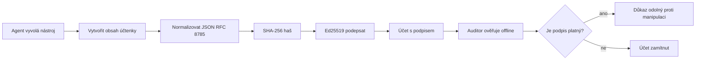
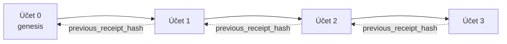

[Watch the lesson video: Zabezpečení AI agentů pomocí kryptografických potvrzení](https://youtu.be/PLACEHOLDER_VIDEO_ID)

> _(Video lekce a náhled obrázku budou přidány týmem Microsoft pro obsah po sloučení, odpovídající vzoru lekce 14 / 15.)_

# Zabezpečení AI agentů pomocí kryptografických potvrzení

## Úvod

Tato lekce pokryje:

- Proč jsou auditní stopy AI agentů důležité pro shodu, ladění a důvěru.
- Co je kryptografický doklad a jak se liší od nepodepsaného záznamu.
- Jak vygenerovat podepsaný doklad pro volání nástroje agenta v čistém Pythonu.
- Jak offline ověřit doklad a odhalit manipulaci.
- Jak řetězit doklady tak, aby odstranění nebo přeskupení jednoho dokladu porušilo řetězec.
- Co doklady dokazují a co explicitně nedokazují.

## Cíle učení

Po dokončení této lekce budete vědět, jak:

- Identifikovat selhání, která motivují kryptografický původ činů agenta.
- Vytvořit Ed25519-podepsaný doklad nad kanonickým JSON payloadem.
- Nezávisle ověřit doklad pouze pomocí veřejného klíče osoby podepisující.
- Odhalit manipulaci znovu spuštěním ověření upraveného dokladu.
- Postavit hash-řetězenou posloupnost dokladů a vysvětlit důležitost tohoto řetězce.
- Rozpoznat hranici mezi tím, co doklady dokazují (přiřazení, integrita, pořadí) a co nedokazují (správnost akce, správnost pravidel).

## Problém: Auditní stopa vašeho agenta

Představte si, že jste nasadili AI agenta pro Contoso Travel. Agent čte zákaznické požadavky, volá API letů pro vyhledání možností a rezervuje sedadla za zákazníka. Za poslední čtvrtletí agent zpracoval 50 000 rezervací.

Dnes přijde auditor. Položí jednoduchou otázku: „Ukažte mi, co váš agent dělal.“

Předáte logy. Auditor se na ně podívá a položí těžší otázku: „Jak vím, že tyto logy nebyly upraveny?“

To je problém auditní stopy. Většina dnešních nasazení agentů spoléhá na:

- **Aplikační logy**: psané samotným agentem, editovatelné kýmkoli s přístupem do souborového systému.
- **Cloudové služby logování**: jsou odolné proti manipulaci na úrovni platformy, ale pouze pokud auditor důvěřuje provozovateli platformy.
- **Protokoly transakcí databáze**: vhodné pro změny v databázi, ale ne pro libovolná volání nástrojů.

Žádné z těchto řešení nedokáže odpovědět auditorově otázce bez požadavku, aby auditor někomu důvěřoval (vám, vašemu poskytovateli cloudu, dodavateli databáze). Pro interní použití je tato důvěra často přijateľná. Pro regulované úlohy (finance, zdravotnictví, cokoliv podléhající evropskému zákonu o AI) není.

Kryptografické doklady řeší tento problém tím, že každou akci agenta činí nezávisle ověřitelnou. Auditor vám nemusí důvěřovat. Potřebuje pouze váš veřejný klíč a samotný doklad.

## Co je kryptografický doklad?

Doklad je JSON objekt, který zaznamenává, co agent udělal, podepsaný digitálním podpisem.



Minimální doklad vypadá takto:

```json
{
  "type": "agent.tool_call.v1",
  "agent_id": "contoso-travel-bot",
  "tool_name": "lookup_flights",
  "tool_args_hash": "sha256:a3f9c1...",
  "result_hash": "sha256:7b2e1d...",
  "policy_id": "contoso-travel-policy-v3",
  "timestamp": "2026-04-25T14:30:00Z",
  "sequence": 47,
  "previous_receipt_hash": "sha256:9d4e6a...",
  "signature": {
    "alg": "EdDSA",
    "sig": "c5af83...",
    "public_key": "8f3b2c..."
  }
}
```

Tři vlastnosti, které zajišťují funkčnost:

1. **Podpis**. Doklad je podepsán bránou agenta pomocí soukromého klíče Ed25519. Kdokoli s odpovídajícím veřejným klíčem může offline ověřit podpis. Jakákoli manipulace s kterýmkoli polem podpis zneplatní.

2. **Kanonické kódování**. Před podpisem se doklad serializuje pomocí JSON Canonicalization Scheme (JCS, RFC 8785). To zajistí, že dvě implementace vytvářející stejný logický doklad vydají bajtově identický výstup. Bez kanonizace by různé JSON serializéry vytvářely různé podpisy pro stejné obsahy.

3. **Řetězení hashů**. Pole `previous_receipt_hash` odkazuje na předchozí doklad. Odstranění nebo přeuspořádání dokladu poruší každý následující doklad. Manipulace se stává viditelnou na úrovni řetězce i pokud jsou jednotlivé podpisy obejity.

Tyto vlastnosti společně poskytují tři záruky:

- **Přiřazení**: tento klíč podepsal tento obsah.
- **Integrita**: obsah se od podpisu nezměnil.
- **Pořadí**: tento doklad přišel po tom předchozím v řetězci.

## Vytvoření dokladu v Pythonu

Nemusíte používat speciální knihovnu na vytvoření dokladu. Kryptografické primitivy jsou běžně dostupné a logika představuje pár desítek řádků Pythonu.

Cvičení v `code_samples/18-signed-receipts.ipynb` provádí celým postupem. Shrnutí:

```python
import json
import hashlib
import base64
from nacl import signing
from jcs import canonicalize  # RFC 8785 kanonický JSON

def b64url_nopad(data: bytes) -> str:
    return base64.urlsafe_b64encode(data).decode("ascii").rstrip("=")

def sha256_canonical(obj) -> str:
    """SHA-256 of a Python object's JCS-canonical JSON form."""
    return f"sha256:{hashlib.sha256(canonicalize(obj)).hexdigest()}"

# Generujte nebo načtěte podpisový klíč (v produkci ukládejte do trezoru klíčů)
signing_key = signing.SigningKey.generate()
verify_key = signing_key.verify_key

# Vytvořte obsah účtenky (zatím bez podpisu)
tool_args = {"origin": "SYD", "destination": "LAX"}
tool_result = [{"flight": "QF11", "price": 1850, "stops": 0}]

payload = {
    "type": "agent.tool_call.v1",
    "agent_id": "contoso-travel-bot",
    "tool_name": "lookup_flights",
    "tool_args_hash": sha256_canonical(tool_args),
    "result_hash": sha256_canonical(tool_result),
    "policy_id": "contoso-travel-policy-v3",
    "timestamp": "2026-04-25T14:30:00Z",
    "sequence": 0,
    "previous_receipt_hash": None,
}

# Kanonizujte, zahashujte, podepište.
canonical_bytes = canonicalize(payload)
message_hash = hashlib.sha256(canonical_bytes).digest()
signature_bytes = signing_key.sign(message_hash).signature

# Připojte strukturovaný podpisový objekt.
receipt = {
    **payload,
    "signature": {
        "alg": "EdDSA",
        "sig": b64url_nopad(signature_bytes),
        "public_key": b64url_nopad(bytes(verify_key)),
    },
}
```

To je celý proces podepisování. Cvičení v notebooku popisují každý krok.

## Ověření dokladu a detekce manipulace

Ověření je opačné krok:

```python
import base64
import hashlib
from nacl import signing
from nacl.exceptions import BadSignatureError
from jcs import canonicalize

def b64url_decode(s: str) -> bytes:
    padding = "=" * ((4 - len(s) % 4) % 4)
    return base64.urlsafe_b64decode(s + padding)

def verify_receipt(receipt: dict) -> bool:
    # Podpis je strukturovaný objekt: {"alg", "sig", "public_key"}.
    sig_obj = receipt.get("signature")
    if not sig_obj or sig_obj.get("alg") != "EdDSA":
        return False

    # Zrekonstruujte užitečné zatížení, které bylo skutečně podepsáno (vše kromě podpisu).
    payload = {k: v for k, v in receipt.items() if k != "signature"}

    canonical_bytes = canonicalize(payload)
    message_hash = hashlib.sha256(canonical_bytes).digest()

    try:
        verify_key = signing.VerifyKey(b64url_decode(sig_obj["public_key"]))
        verify_key.verify(message_hash, b64url_decode(sig_obj["sig"]))
        return True
    except BadSignatureError:
        return False
```

Tato funkce vezme doklad a vrátí `True`, pokud je podpis platný, jinak `False`. Žádný síťový dotaz, žádná závislost na službě, žádná důvěra v třetí strany není potřeba.

Pro demonstraci detekce manipulací notebook ukazuje:

1. Vytvoření platného dokladu a potvrzení jeho platnosti.
2. Úpravu jednoho bajtu v poli `tool_args_hash`.
3. Znovu spuštění ověření, které selže.

To je praktický důkaz, že doklady jsou odolné proti manipulacím: jakákoli změna, i malá, zničí podpis.

## Řetězení dokladů pro agenty s více kroky

Jeden podepsaný doklad chrání jednu akci. Řetězec dokladů chrání posloupnost.



Každý doklad zaznamenává hash předchozího dokladu. Chcete-li tiše odstranit doklad 2, útočník by musel:

- Upravit pole `previous_receipt_hash` v dokladu 3 (znemožní podpis dokladu 3), NEBO
- Zfalšovat nový podpis upraveného dokladu 3 (což vyžaduje soukromý klíč agenta).

Pokud je soukromý klíč uložen v hardwarové klíčové schránce a vy zveřejníte veřejný klíč s každým dokladem, žádný z těchto útoků není bez odhalení realizovatelný.

Notebook ukazuje:

1. Vytváření řetězce ze tří dokladů.
2. Ověření, že `previous_receipt_hash` každého dokladu odpovídá skutečnému hashi předchozího dokladu.
3. Zmanipulování prostředního dokladu a pozorování přerušení řetězce právě na tomto místě.

Takto vytvoříte auditní stopu, kterou může externí auditor ověřit, aniž by vám musel důvěřovat.

## Co doklady dokazují (a co ne)

Jedná se o nejdůležitější část této lekce. Doklady jsou mocné, ale jejich účinek má hranice.

**Doklady dokazují tři věci:**

1. **Přiřazení**: konkrétní klíč podepsal konkrétní obsah.
2. **Integrita**: obsah se od podpisu nezměnil.
3. **Pořadí**: tento doklad následoval po tom předchozím v hash řetězci.

**Doklady NEdokazují:**

1. **Správnost**: že akce agenta byla správná. Doklad může být podepsán pro špatnou odpověď stejně jako pro správnou.
2. **Shodu s politikou**: že politika uvedená v `policy_id` byla skutečně vyhodnocena nebo by tuto akci povolila. Doklad zaznamenává, co bylo tvrzeno, ne co bylo vynuceno.
3. **Identitu nad rámec klíče**: doklad říká „tento klíč podepsal tento obsah.“ Neříká „tento člověk to autorizoval.“ Pro spojení klíče s osobou nebo organizací je potřeba samostatná identitní infrastruktura (adresář, rejstřík veřejných klíčů atd.).
4. **Pravdivost vstupů**: pokud agent obdrží zmanipulovaný prompt a jedná podle něj, doklad věrně zaznamená akci. Doklady jsou downstream od validace vstupů, nejsou jejím náhradníkem.

Tato hranice je důležitá ze dvou důvodů:

- Říká, k čemu jsou doklady užitečné: auditovatelné a odolné proti manipulacím chování agenta i přes organizační hranice.
- Říká, jaké další vrstvy stále potřebujete: validaci vstupů (Lekce 6), vynucování politik (krátce uvedeno níže) a identitní infrastrukturu (mimo rozsah této lekce).

Častou chybou je předpokládat, že „když máme doklady,“ znamená to „jsme regulovaní.“ Neznamená. Doklady jsou základ. Regulace je systém, který na nich stavíte.

## Referenční produkční zdroje

Python kód v této lekci je záměrně minimalistický, abyste mohli chápat každý řádek a přesně vědět, co se děje. V produkci máte dvě možnosti:

1. **Postavit se přímo na kryptografických primitivech.** 50 řádků, které jste viděli, stačí pro mnoho použití. PyNaCl (Ed25519) a balíček `jcs` (kanonický JSON) jsou dobře udržované a auditované knihovny.

2. **Použít produkční knihovnu na doklady.** Několik open-source projektů implementuje stejný vzor s dalšími funkcemi (rotace klíčů, hromadné ověřování, distribuce JWK setu, integrace s motory politik):
   - Formát dokladů použitý v této lekci následuje IETF Internet-Draft (`draft-farley-acta-signed-receipts`), který je právě ve schvalovacím procesu.
   - Microsoft Agent Governance Toolkit spojuje doklady s rozhodnutími politik na bázi Cedar; tutorial 33 v tomto repozitáři ukazuje příklad end-to-end.
   - Balíčky `protect-mcp` (npm) a `@veritasacta/verify` (npm) poskytují Node implementaci podepisování a offline ověřování dokladů, určenou k zabalení jakéhokoli MCP serveru do auditní stopy odolné proti manipulaci.
   - **[nobulex](https://github.com/arian-gogani/nobulex)** Python SDK (`pip install nobulex`) poskytuje stejný Ed25519 + JCS podpisový vzor v Pythonu s integracemi LangChain a CrewAI, včetně publikovaných testovacích vektorů a mapování shody přispěného prostřednictvím [OWASP PR #2210](https://github.com/OWASP/CheatSheetSeries/pull/2210).

Volba mezi psaním vlastního kódu a použitím knihovny je podobná rozhodování mezi vlastní JWT knihovnou a testovanou knihovnou: obojí je rozumné; knihovna šetří čas a snižuje auditní povrch; přístup od nuly vás nutí rozumět každé primitivě. Tato lekce učí přístup od nuly, abyste měli základy pro obě volby.

## Kontrola znalostí

Otestujte si pochopení před přechodem na praktické cvičení.

**1. Doklad je podepsán soukromým klíčem Ed25519 agenta. Auditor má pouze veřejný klíč. Může auditor ověřit doklad offline?**

<details>
<summary>Odpověď</summary>

Ano. Ed25519 ověření vyžaduje pouze veřejný klíč a podepsané bajty. Žádný síťový dotaz, žádná závislost na službě. Tato vlastnost dělá doklady užitečné ve vzduchotěsných, víceorganizacích nebo nízkodůvěryhodných auditech.
</details>

**2. Útočník upraví pole `policy_id` dokladu, aby tvrdil, že byl řízen volnější politikou. Podpis byl ale nad původním payloadem. Co se stane při ověřování?**

<details>
<summary>Odpověď</summary>

Ověření selže. Podpis byl spočítán na kanonických bajtech původního payloadu; jakákoli změna pole změní kanonické bajty, což změní SHA-256 hash, a podpis se stane neplatným. Útočník by potřeboval soukromý klíč pro vytvoření nového platného podpisu, což nemá.
</details>

**3. Proč doklad obsahuje `tool_args_hash` a `result_hash` místo surových argumetů a výsledku?**

<details>
<summary>Odpověď</summary>

Dva důvody. První je, že doklad může být archivován nebo přenášen v prostředích, kde by uniknutí surového obsahu (osobní údaje, obchodní data) bylo problémem. Hashování udržuje doklad malý a obsah soukromý; auditor ověřuje, že hash odpovídá odděleně uložené skutečné kopii. Druhý důvod je, že hashe mají pevnou délku; doklad s hashi má omezenou velikost bez ohledu na velikost vstupů a výstupů.
</details>

**4. Pole `previous_receipt_hash` propojuje každý doklad s jeho předchůdcem. Pokud útočník tiše smaže jeden doklad uprostřed řetězce, co se stane neplatným?**

<details>
<summary>Odpověď</summary>

Každý doklad, který přišel po smazaném. Jejich pole `previous_receipt_hash` už neodpovídají skutečnému řetězci (protože odkazovaný doklad už neexistuje nebo řetězec nyní ukazuje na jiného předchůdce). Pro skrytí smazání by útočník musel pře-podepsat každý pozdější doklad, což vyžaduje soukromý klíč.
</details>

**5. Doklad ověřen čistě platný. Znamená to, že akce agenta byla správná, rozumná nebo v souladu s politikou?**

<details>
<summary>Odpověď</summary>

Ne. Platný doklad dokazuje tři věci: přiřazení (tento klíč podepsal tento obsah), integritu (obsah se nezměnil) a pořadí (tento doklad přišel po tom předchozím). Nedokazuje, že akce byla správná, že politika v `policy_id` byla skutečně vyhodnocena, ani že agent dodržel všechna pravidla. Doklady umožňují auditovatelné chování agenta, ne nutně jeho správnost. Toto je nejdůležitější hranice této lekce.
</details>

## Praktické cvičení

Otevřete `code_samples/18-signed-receipts.ipynb` a dokončete všechna čtyři oddělení:

1. **Oddíl 1**: Podepište svůj první doklad a ověřte jej.
2. **Oddíl 2**: Zmanipulujte doklad a sledujte selhání ověření.
3. **Oddíl 3**: Vytvořte řetězec tří dokladů a ověřte integritu řetězce.
4. **Oddíl 4**: Použijte vzor na agenta postaveného na Microsoft Agent Frameworku: zabalte volání nástroje do podepisování dokladů a poté ověřte doklad nezávisle.
**Rozšiřující výzva 1:** rozšiřte schéma příjmu o další pole dle vlastního výběru (například identifikátor požadavku pro sledování), aktualizujte logiku kanonického podepisování tak, aby ho zahrnovala, a potvrďte, že se příjem stále úspěšně ověřuje při zpětné kontrole. Poté pole po podepsání změňte a potvrďte, že ověření selže. To vás donutí pochopit, jak každý bajt kanonického kódování přispívá k podpisu.

**Rozšiřující výzva 2:** Spojte SHA-256 hash dvou svých příjmů (spojte jejich kanonické bajty v deterministickém pořadí) a vložte vzniklý digest jako nové pole do třetího příjmu před jeho podepsáním. Ověřte, že všechny tři příjmy se stále úspěšně ověřují při zpětné kontrole. Právě jste vytvořili důkaz jedním krokem: kdokoli držící třetí příjem může dokázat, že první dva existovaly v době jeho podepsání, aniž by musel odhalit jejich obsah. Toto je vzor, který používají příjmy s výběrovým zveřejněním v rozsáhlém měřítku (Merkleho závazky, RFC 6962).

## Závěr

Kryptografické příjmy poskytují AI agentům auditní stopu, která je:

- **Nezávisle ověřitelná**: jakákoli strana s veřejným klíčem může ověřit, bez závislosti na službě.
- **Narušení je zjevné**: jakákoli modifikace zneplatní podpis.
- **Přenosná**: příjem je malý JSON soubor; lze ho archivovat, přenášet a ověřovat kdekoli.
- **V souladu se standardy**: postavené na Ed25519 (RFC 8032), JCS (RFC 8785) a SHA-256, všechny široce zavedené primitiva.

Nejsou náhradou za ověřování vstupů, prosazování politik nebo infrastrukturu identity. Jsou základem pro tyto vrstvy. Když nasazujete agenty do regulovaných prostředí, pracovních toků přes více organizací nebo do jakéhokoli prostředí, kde nelze předpokládat, že vám budoucí auditor bude důvěřovat, příjmy jsou způsob, jak zajistit poctivost auditní stopy.

Nejdůležitější poznatek: příjmy dokazují, kdo co řekl a kdy. Nedokazují, že to, co bylo řečeno, je pravda nebo správné. Držte toto rozlišení pevně. Je to rozdíl mezi poctivým systémem původu a zavádějícím.

## Produkční kontrolní seznam

Když jste připraveni přejít od této lekce k nasazení agentů podepsaných příjmy v reálném prostředí:

- [ ] **Přesuňte podepisovací klíč z vývojářského notebooku.** Použijte Azure Key Vault, AWS KMS nebo hardwarový bezpečnostní modul. Soukromý klíč podepisující vaše příjmy nesmí nikdy být uložen v zdrojovém kódu nebo v plném znění na aplikačních strojích.
- [ ] **Publikujte ověřovací veřejný klíč.** Auditoři ho potřebují k offline ověření. Standardní vzor je sada JWK na dobře známé URL (RFC 7517), například `https://your-org.example.com/.well-known/agent-keys.json`.
- [ ] **Externě ukotvěte řetězec.** Pravidelně zapisujte hash hlavy řetězce do transparentnostního logu (Sigstore Rekor, RFC 3161 autorita časových razítek nebo druhý interní systém), aby externí strana mohla potvrdit „tento řetězec existoval v tomto čase“.
- [ ] **Ukládejte příjmy neměnně.** Append-only blob storage (Azure Storage s politikami neměnnosti, AWS S3 Object Lock) brání interním osobám přepisovat historii na úrovni úložiště.
- [ ] **Rozhodněte o uchovávání.** Mnoho režimů souladu vyžaduje několik let uchování. Plánujte růst množství příjmů (každý příjem má ~500 bajtů; agent provádějící 10 000 volání denně produkuje ~1,8 GB za rok).
- [ ] **Dokumentujte, co příjmy nepokrývají.** Příjmy dokazují přiřazení, integritu a pořadí. Vaše provozní příručka by měla explicitně vyjmenovat, jaká další opatření (ověřování vstupů, prosazování politik, omezení rychlosti, infrastruktura identity) doplňují příjmy ve vaší správní struktuře.

### Máte další otázky ohledně zabezpečení AI agentů?

Připojte se na [Microsoft Foundry Discord](https://aka.ms/ai-agents/discord), kde se můžete setkat s dalšími studenty, účastnit se konzultačních hodin a nechat si zodpovědět své otázky ohledně AI agentů.

## Za touto lekcí

Tato lekce pokrývá podepisování jednoho příjmu a hashově navázané sekvence. Stejná primitiva tvoří základy několika pokročilejších vzorů, které můžete potkat, jak vaše správní pozice dozrává:

- **Selektivní zveřejnění.** Pokud jsou pole příjmu nezávisle závazná (Merkle strom ve stylu RFC 6962), můžete odhalit konkrétní pole konkrétním auditorům a dokázat, že ostatní zůstávají nezměněná bez jejich odhalení. Užívá se, když jeden příjem musí splnit jak komplexní audit (který požaduje kompletnost), tak regulace o minimalizaci dat jako GDPR (které chtějí, aby auditor viděl co nejméně).
- **Revokace příjmů.** Pokud je podepisovací klíč kompromitován, potřebujete způsob, jak označit všechny příjmy podepsané daným klíčem jako nedůvěryhodné od určitého okamžiku. Standardní vzory: krátkodobé podepisovací klíče plus publikovaný seznam revokací, nebo transparentnostní log s položkami revokace.
- **Dvoustranné / rozdělené podpisové příjmy.** Některé implementace rozdělují podepsané údaje na poloviny před vykonáním (`authorization_*`) a po vykonání (`result_*`) s nezávislými podpisy, užitečné když rozhodnutí o autorizaci a zaznamenaný výsledek jsou od různých aktérů nebo v různých časech. Toto se přidává k formátu příjmu vyučovaného v této lekci.
- **Složení užitečného zatížení.** Příjem zapečetí jakékoli bajty, které vložíte do `result_hash`. Reálné užitečné zatížení často obsahuje více než jediný výsledek nástroje: předrozhodovací zdůvodnění (predikce modelu, uvažované možnosti, důkazy a jejich úplnost, stav rizika, řetězec odpovědnosti, rozhodnutí brány) vše může být uvnitř užitečného zatížení, zapečetěné jedním příjmem. To udržuje formát příjmu minimální a zároveň umožňuje vývoj schémat užitečného zatížení podle domény.
- **Shoda mezi implementacemi.** Více nezávislých implementací stejného formátu příjmu (Python, TypeScript, Rust, Go) se vzájemně ověřuje pomocí sdílených testovacích vektorů. Pokud vytvoříte vlastní implementaci, ověření podle publikovaných vektorů potvrzuje kompatibilitu na úrovni přenosu dat.
- **Migrace pro post-kvantové prostředí.** Ed25519 je dnes široce nasazeno, ale není odolné vůči kvantovým útokům. Formát příjmu je algoritmicky agilní: pole `signature.alg` může nést hodnotu `ML-DSA-65` (standard NIST pro post-kvantové podpisy), když potřebujete migrovat. Plánujte přechodné období, kdy budou příjmy podepsané oběma způsoby.

## Další zdroje

- <a href="https://datatracker.ietf.org/doc/draft-farley-acta-signed-receipts/" target="_blank">IETF Internet-Draft: Podepsané rozhodovací příjmy pro strojové řízení přístupu</a>
- <a href="https://learn.microsoft.com/azure/ai-studio/responsible-use-of-ai-overview" target="_blank">Přehled odpovědného využití AI (Azure AI)</a>
- <a href="https://datatracker.ietf.org/doc/html/rfc8032" target="_blank">RFC 8032: Digitální podpisový algoritmus Edwardsovy křivky (EdDSA)</a>
- <a href="https://datatracker.ietf.org/doc/html/rfc8785" target="_blank">RFC 8785: Schéma kanonizace JSON (JCS)</a>
- <a href="https://datatracker.ietf.org/doc/html/rfc6962" target="_blank">RFC 6962: Transparentnost certifikátů</a> (Merkle strom použitý u příjmů s výběrovým zveřejněním)
- <a href="https://github.com/microsoft/agent-governance-toolkit/blob/main/docs/tutorials/33-offline-verifiable-receipts.md" target="_blank">Microsoft Agent Governance Toolkit, Tutorial 33: Offline ověřitelné rozhodovací příjmy</a>
- <a href="https://github.com/ScopeBlind/agent-governance-testvectors" target="_blank">Testovací vektory pro ověřování mezi implementacemi</a> formátu příjmu použitého v této lekci (Apache-2.0)
- <a href="https://pynacl.readthedocs.io/" target="_blank">Dokumentace PyNaCl</a> (Ed25519 v Pythonu)

## Předchozí lekce

[Budování agentů pro využití počítače (CUA)](../15-browser-use/README.md)

## Další lekce

_(Bude určeno správci kurikula)_

---

<!-- CO-OP TRANSLATOR DISCLAIMER START -->
**Prohlášení o omezení odpovědnosti**:
Tento dokument byl přeložen pomocí AI překladatelské služby [Co-op Translator](https://github.com/Azure/co-op-translator). Přestože usilujeme o co největší přesnost, mějte prosím na paměti, že automatizované překlady mohou obsahovat chyby nebo nepřesnosti. Originální dokument v jeho mateřském jazyce by měl být považován za autoritativní zdroj. Pro kritické informace se doporučuje profesionální lidský překlad. Nejsme odpovědní za jakékoli nedorozumění nebo nesprávné interpretace vzniklé použitím tohoto překladu.
<!-- CO-OP TRANSLATOR DISCLAIMER END -->