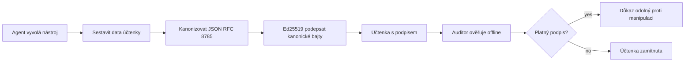
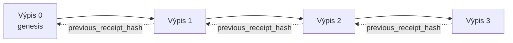

[Sledujte video lekce: Zabezpečení AI agentů pomocí kryptografických potvrzení](https://youtu.be/PLACEHOLDER_VIDEO_ID)

> _(Video lekce a náhled bude přidán týmem Microsoftu po sloučení, v souladu se vzorem lekcí 14 / 15.)_

# Zabezpečení AI agentů pomocí kryptografických potvrzení

## Úvod

Tato lekce pokryje:

- Proč jsou auditní stopy pro AI agenty důležité pro shodu, ladění a důvěru.
- Co je to kryptografické potvrzení a jak se liší od nepodepsané logové položky.
- Jak vyrobit podepsané potvrzení pro volání nástroje agenta v čistém Pythonu.
- Jak ověřit potvrzení offline a detekovat manipulaci.
- Jak propojit potvrzení do řetězce tak, že odstranění nebo přeskupení jednoho způsobí přerušení řetězce.
- Co potvrzení dokazují a co explicitně nedokazují.

## Výukové cíle

Po absolvování této lekce budete umět:

- Identifikovat způsoby selhání, které motivují kryptografický původ akcí agentů.
- Vytvořit potvrzení podepsané Ed25519 nad kanonickým JSON payloadem.
- Ověřit potvrzení nezávisle pomocí pouze veřejného klíče podepisovatele.
- Detekovat manipulaci opětovným provedením ověření u upraveného potvrzení.
- Vytvořit sekvenci potvrzení v hash-řetězu a vysvětlit, proč je řetězec důležitý.
- Rozlišit hranici mezi tím, co potvrzení dokazují (přiřazení, integrita, pořadí) a co nedokazují (správnost akce, správnost politiky).

## Problém: Auditní stopa vašeho agenta

Představte si, že jste nasadili AI agenta pro Contoso Travel. Agent čte požadavky zákazníků, volá API leteckých společností pro vyhledávání možností a rezervuje místa za zákazníka. Minulý kvartál agent zpracoval 50 000 rezervací.

Dnes přijde auditor. Položí jednoduchou otázku: „Ukažte mi, co váš agent dělal.“

Předáte mu své logy. Auditor se podívá a položí těžší otázku: „Jak vím, že tyto logy nebyly upraveny?“

To je problém auditní stopy. Většina nasazení agentů dnes spoléhá na:

- **Aplikační logy**: psané samotným agentem, upravitelné každý, kdo má přístup k souborovému systému.
- **Cloudové logovací služby**: odolné proti úpravám na úrovni platformy, ale pouze pokud auditor důvěřuje provozovateli platformy.
- **Databázové transakční logy**: vhodné pro změny databáze, ale ne pro libovolná volání nástrojů.

Žádný z nich nemůže odpovědět na auditorovu otázku, aniž by auditor musel někomu důvěřovat (vám, vašemu cloudovému poskytovateli, vašemu dodavateli databáze). Pro interní použití je tato důvěra často přijatelná. Pro regulované pracovní zátěže (finance, zdravotnictví, cokoliv podléhající EU AI Act) ne.

Kryptografická potvrzení tento problém řeší tím, že každou akci agenta lze ověřit nezávisle. Auditor vám nemusí důvěřovat. Potřebuje pouze váš veřejný klíč a samotné potvrzení.

## Co je to kryptografické potvrzení?

Potvrzení je JSON objekt, který zaznamenává, co agent udělal, podepsaný digitálním podpisem.


```mermaid
flowchart LR
    A[Agent vyvolá nástroj] --> B[Sestavit data účtenky]
    B --> C[Kanonizovat JSON RFC 8785]
    C --> E[Ed25519 podepsat kanonické bajty]
    E --> F[Účtenka s podpisem]
    F --> G[Auditor ověřuje offline]
    G --> H{Platný podpis?}
    H -- yes --> I[Důkaz odolný proti manipulaci]
    H -- no --> J[Účtenka zamítnuta]
```

Minimalistické potvrzení vypadá takto:

```json
{
  "type": "agent.tool_call.v1",
  "agent_id": "contoso-travel-bot",
  "tool_name": "lookup_flights",
  "tool_args_hash": "sha256:a3f9c1...",
  "result_hash": "sha256:7b2e1d...",
  "policy_id": "contoso-travel-policy-v3",
  "timestamp": "2026-04-25T14:30:00Z",
  "sequence": 47,
  "previous_receipt_hash": "sha256:9d4e6a...",
  "signature": {
    "alg": "EdDSA",
    "sig": "c5af83...",
    "public_key": "8f3b2c..."
  }
}
```

Tři vlastnosti provádějí práci:

1. **Podpis**. Potvrzení je podepsané branou agenta (gateway) pomocí soukromého klíče Ed25519. Každý, kdo má odpovídající veřejný klíč, může podpis ověřit offline. Úprava jakéhokoli pole podpis zneplatní.

2. **Kanonické kódování**. Před podpisem je potvrzení serializováno pomocí JSON Canonicalization Scheme (JCS, RFC 8785). To zajišťuje, že dvě implementace, které vytvoří stejný logický obsah, vytvoří bajtově totožný výstup. Bez kanonizace by různé JSON serializéry vytvářely odlišné podpisy pro stejný obsah.

3. **Hashový řetězec**. Pole `previous_receipt_hash` spojuje každé potvrzení s tím předchozím. Odstranění nebo přeskupení potvrzení rozbije každý následující řetězový článek. Manipulace se stává viditelnou na úrovni řetězce i když jsou jednotlivé podpisy obcházeny.

Společně tyto vlastnosti zajišťují tři garance:

- **Přiřazení**: tento klíč podepsal tento obsah.
- **Integrita**: obsah se od doby podpisu nezměnil.
- **Pořadí**: toto potvrzení přišlo po tomto potvrzení v řetězci.

## Vytvoření potvrzení v Pythonu

K výrobě potvrzení nepotřebujete speciální knihovnu. Kryptografické primitiva jsou široce dostupná a logika zabere pár desítek řádků Pythonu.

Praktické cvičení v `code_samples/18-signed-receipts.ipynb` provádí celý proces. Stručná verze:

```python
import json
import hashlib
import base64
from nacl import signing
from jcs import canonicalize  # Canonical JSON podle RFC 8785

def b64url_nopad(data: bytes) -> str:
    return base64.urlsafe_b64encode(data).decode("ascii").rstrip("=")

def sha256_canonical(obj) -> str:
    """SHA-256 of a Python object's JCS-canonical JSON form."""
    return f"sha256:{hashlib.sha256(canonicalize(obj)).hexdigest()}"

# Vygenerujte nebo načtěte podpisový klíč (v produkci uložit do trezoru klíčů)
signing_key = signing.SigningKey.generate()
verify_key = signing_key.verify_key

# Sestavte obsah účtenky (zatím bez podpisu)
tool_args = {"origin": "SYD", "destination": "LAX"}
tool_result = [{"flight": "QF11", "price": 1850, "stops": 0}]

payload = {
    "type": "agent.tool_call.v1",
    "agent_id": "contoso-travel-bot",
    "tool_name": "lookup_flights",
    "tool_args_hash": sha256_canonical(tool_args),
    "result_hash": sha256_canonical(tool_result),
    "policy_id": "contoso-travel-policy-v3",
    "timestamp": "2026-04-25T14:30:00Z",
    "sequence": 0,
    "previous_receipt_hash": None,
}

# Kanonizujte a podepište bajty JCS přímo. PureEdDSA interně hashuje.
canonical_bytes = canonicalize(payload)
signature_bytes = signing_key.sign(canonical_bytes).signature

# Připojte strukturovaný objekt podpisu.
receipt = {
    **payload,
    "signature": {
        "alg": "EdDSA",
        "sig": b64url_nopad(signature_bytes),
        "public_key": b64url_nopad(bytes(verify_key)),
    },
}
```

To je celý podpisový pipeline. V notebooku jsou probrány všechny kroky.

## Ověření potvrzení a detekce manipulace

Ověření je inverzní operace:

```python
import base64
import hashlib
from nacl import signing
from nacl.exceptions import BadSignatureError
from jcs import canonicalize

def b64url_decode(s: str) -> bytes:
    padding = "=" * ((4 - len(s) % 4) % 4)
    return base64.urlsafe_b64decode(s + padding)

def verify_receipt(receipt: dict) -> bool:
    # Podpis je strukturovaný objekt: {"alg", "sig", "public_key"}.
    sig_obj = receipt.get("signature")
    if not sig_obj or sig_obj.get("alg") != "EdDSA":
        return False

    # Zrekonstruujte obsah, který byl skutečně podepsán (vše kromě podpisu).
    payload = {k: v for k, v in receipt.items() if k != "signature"}

    canonical_bytes = canonicalize(payload)

    try:
        verify_key = signing.VerifyKey(b64url_decode(sig_obj["public_key"]))
        verify_key.verify(canonical_bytes, b64url_decode(sig_obj["sig"]))
        return True
    except BadSignatureError:
        return False
```

Tato funkce přijímá potvrzení a vrací `True`, pokud je podpis platný, jinak `False`. Žádné volání sítě, žádná závislost na službě, žádná důvěra v třetí stranu.

Pro předvedení detekce manipulace notebook ukazuje:

1. Vytvoření platného potvrzení a potvrzení, že ověření projde.
2. Úpravu jednoho bajtu v poli `tool_args_hash`.
3. Opětovné spuštění ověření a zjištění jeho selhání.

To je praktická ukázka, že potvrzení jsou evidentní vůči manipulaci: jakákoliv úprava, jakkoliv malá, zničí podpis.

## Řazení potvrzení pro vícekrokové agenty

Jedno podepsané potvrzení chrání jednu akci. Řetězec potvrzení chrání posloupnost.


```mermaid
flowchart LR
    R0[Výpis 0<br/>genesis] --> R1[Výpis 1]
    R1 --> R2[Výpis 2]
    R2 --> R3[Výpis 3]
    R1 -. previous_receipt_hash .-> R0
    R2 -. previous_receipt_hash .-> R1
    R3 -. previous_receipt_hash .-> R2
```

Každé potvrzení zaznamenává hash potvrzení předchozího. Pro tiché odstranění potvrzení 2 by útočník musel:

- Upravit pole `previous_receipt_hash` potvrzení 3 (rozbije podpis potvrzení 3), NEBO
- Padělat nový podpis upraveného potvrzení 3 (vyžaduje soukromý klíč agenta).

Pokud je soukromý klíč v hardwarovém úložišti a veřejný klíč zveřejníte s každým potvrzením, žádný z těchto útoků není možný bez odhalení.

Notebook ukazuje:

1. Vytvoření řetězce ze tří potvrzení.
2. Ověření, že pole `previous_receipt_hash` každého potvrzení odpovídá skutečnému hashi předchozího potvrzení.
3. Manipulaci s jedním potvrzením uprostřed a zjištění, že se řetězec rozbije právě v tomto bodě.

Takto vytvoříte auditní stopu, kterou může externí auditor ověřit bez důvěry v vás.

## Co potvrzení dokazují (a co nedokazují)

Toto je nejdůležitější část této lekce. Potvrzení jsou silná, ale jejich síla je omezená.

**Potvrzení dokazují tři věci:**

1. **Přiřazení**: konkrétní klíč podepsal konkrétní payload.
2. **Integrita**: payload se od doby podpisu nezměnil.
3. **Pořadí**: toto potvrzení přišlo po tom potvrzení v hashovém řetězci.

**Potvrzení nedokazují:**

1. **Správnost**: že akce agenta byla správná akce. Potvrzení může být podepsáno i pro špatnou odpověď stejně jako pro správnou.

2. **Soulad s politikou**: že politika uvedená v `policy_id` byla skutečně vyhodnocena, nebo že by toto jednání povolila, pokud by bylo zkontrolováno. Potvrzení zaznamenává, co bylo tvrzeno, ne co bylo vynuceno.
3. **Identita za klíčem**: potvrzení říká „tento klíč podepsal tento obsah.“ Neposkytuje informaci „tento člověk to autorizoval.“ Pro propojení klíče s osobou nebo organizací je potřeba samostatná identitní infrastruktura (adresář, rejstřík veřejných klíčů atd.).
4. **Pravdivost vstupů**: pokud agent dostane zmanipulovaný prompt a podle něj jedná, potvrzení věrně zaznamenává danou akci. Potvrzení jsou následkem validace vstupu, nejsou jejím náhradou.

Tato hranice je důležitá ze dvou důvodů:

- Říká vám, k čemu jsou potvrzení užitečná: k tomu, aby bylo možné auditovat chování agenta a aby bylo zřejmé jakékoliv manipulace, a to i přes organizační hranice.
- Říká vám, jaké další vrstvy ještě potřebujete: validaci vstupu (Lekce 6), vynucování politiky (stručně uvedeno níže) a identitní infrastrukturu (mimo rozsah této lekce).

Častou chybou je předpokládat, že „máme potvrzení“ znamená „jsme řízeni.“ Není tomu tak. Potvrzení jsou základ. Řízení je systém, který na něm vybudujete.

## Dokázání, že člověk schválil přesnou akci

Bod 3 výše stojí za vlastní sekci: potvrzení akce říká „tento klíč podepsal tento obsah,“ nikdy ne „člověk to autorizoval.“ Pro akce s vysokým rizikem (vrácení peněz, mazání, bankovní převody) požadují rámce řízení právě tento chybějící výrok, který lze vyrobit pomocí stejných primitiv, která jste v této lekci již použili.

Následující poznámkový blok `code_samples/human-authorization-receipts.ipynb` přidává druhý typ potvrzení, `human.approval.v1`, ve stejném obalovém formátu jako potvrzení z této lekce (typovaný payload podepsaný Ed25519 přes jeho kanonické JCS bajty, s objektem `signature` mimo podepsané bajty). Pojmenovaný schvalovatel podepíše **celou kanonickou akci a její digest** před vykonáním; potvrzení akce agenta nese **stejný digest akce** a `parent_approval_ref`, tj. `receipt_hash` schválení, stejný konvenční způsob jako `previous_receipt_hash` v řetězci, který jste vybudovali výše. Jedno `verify_chain` ověřuje oba artefakty pod **samostatnými registrovanými klíči** (klíče schvalovatele vs klíče agenta), takže kódová cesta je sdílená, ale autority nikdy.

Vlastnost, kterou toto umožňuje, pečlivě vyjádřeno: *člověk schválil právě tuto přesnou akci a agent přesně tuto schválenou akci vykonal.* Testovací příklady v poznámkovém bloku dělají tuto vlastnost skutečnou, nikoli jen tvrzenou:

- klasická sada: manipulace, zmatkový zástupce, přehrání, padělané klíče na obou stranách, chybný vstup;
- **zastaralá autorita**: podpis, který stále ověřuje, přesto zamítnuto, protože se posunula verze politiky, klíč schvalovatele byl odstraněn z registrovaného seznamu nebo schválení vypršelo před vykonáním;
- **náhrada digestu**: platně podepsané potvrzení akce odkazující na *skutečné* schválení, které vázá *jinou* kanonickou akci.

Každé selhání zamítne z důvodu, takže auditor, který čte zamítnutí, může poznat, zda autorita ztratila platnost nebo zda se změnila vykonaná akce. Pravidlo, které poznámkový blok učí: podepsané schválení samo o sobě není autorita. Autorita existuje pouze tehdy, když obě potvrzení stále vážou v okamžiku vykonání na stejnou kanonickou akci. Potvrzení schválení člověkem je vzdělávací kompozicí definovanou v této lekci, není typem potvrzení definovaným v `draft-farley-acta-signed-receipts`.

## Použití v produkci

Python kód této lekce je záměrně jednoduchý, abyste mohli každý řádek přečíst a přesně pochopit, co se děje. V produkci máte dvě možnosti:

1. **Stavět přímo na kryptografických primitivech.** 50 řádků, které jste viděli výše, stačí pro mnoho případů použití. PyNaCl (Ed25519) a balíček `jcs` (kanonický JSON) jsou dobře udržované a auditované knihovny.

2. **Použít produkční knihovnu potvrzení.** Několik projektů s otevřeným zdrojovým kódem implementuje stejný vzor s dalšími funkcemi (rotace klíčů, hromadné ověřování, distribuce JWK sad, integrace s politikami):
   - Podepisovací pipeline používá JCS a signature-scope konvence v nezávislém internetovém návrhu IETF ([`draft-farley-acta-signed-receipts`](https://datatracker.ietf.org/doc/draft-farley-acta-signed-receipts/), revize 02). Vzdělávací lekce používá jednodušší potvrzení odlišné od obálky návrhu `{payload, signature}` a není prezentována jako konformní implementace. Návrh zveřejňuje sdílený soubor testovacích vektorů ([agent-governance-testvectors](https://github.com/ScopeBlind/agent-governance-testvectors)) pro implementace cílené na jeho formát přenosu dat.
   - Microsoft Agent Governance Toolkit skládá potvrzení s rozhodnutími politik na bázi Cedar; viz Tutoriál 33 v tomto repozitáři pro reálný příklad od začátku do konce.
   - Balíčky `protect-mcp` (npm) a `@veritasacta/verify` (npm) poskytují Node.js implementaci podpisu potvrzení a offline ověřování, určené pro zabalení jakéhokoli MCP serveru do důkazu proti manipulaci auditním záznamem, včetně režimu drženého pro spolupodepisování, kdy pozastavená akce vydá schvalovací potvrzení vázané na digest akce (podporované WebAuthn v desktopovém režimu), stejný vzor schvalovacího potvrzení jako v poznámkovém bloku schvalování člověkem výše.
   - **[nobulex](https://github.com/arian-gogani/nobulex)** Python SDK (`pip install nobulex`) poskytuje stejný vzor Ed25519 + JCS podepisování v Pythonu s integracemi LangChain a CrewAI, včetně zveřejněných testovacích vektorů pro křížovou validaci a mapování souladu přispěné prostřednictvím [OWASP PR #2210](https://github.com/OWASP/CheatSheetSeries/pull/2210).

Rozhodnutí mezi vlastním řešením a použitím knihovny odpovídá rozhodnutí o vlastní nebo knihovní implementaci JWT: obojí je rozumné; knihovna šetří čas a snižuje auditní plochu; cesta od začátku vyžaduje pochopení každé primitivy. Tato lekce učí cestu od začátku, abyste měli základ pro obě možnosti.

## Kontrola znalostí

Otestujte své porozumění před přechodem na cvičení.

**1. Potvrzení je podepsáno privátním Ed25519 klíčem agenta. Auditor má pouze veřejný klíč. Může auditor offline ověřit potvrzení?**

<details>
<summary>Odpověď</summary>

Ano. Ověření Ed25519 vyžaduje pouze veřejný klíč a podepsané bajty. Žádný síťový požadavek, žádná závislost na službě. To je vlastnost, díky které jsou potvrzení užitečná v uzavřených, víceorganizačních nebo auditních prostředích s nízkou důvěrou.
</details>

**2. Útočník změní pole `policy_id` v potvrzení, aby tvrdil, že podléhalo benevolentnější politice. Podpis byl však nad původním payloadem. Co se stane při ověření?**

<details>
<summary>Odpověď</summary>


Ověření selhalo. Podpis byl vypočítán nad kanonickými bajty původního obsahu; jakákoli změna pole změní tyto bajty, což činí podpis neplatným. Útočník by potřeboval privátní klíč, aby vytvořil nový platný podpis, což nemá.
</details>

**3. Proč příjem obsahuje `tool_args_hash` a `result_hash` namísto surových argumentů a výsledku?**

<details>
<summary>Odpověď</summary>

Dva důvody. Za prvé, příjem může být archivován nebo přenášen v prostředích, kde je problémem únik surového obsahu (osobní identifikační údaje, obchodní data). Hashování udržuje příjem malý a obsah soukromý; auditor ověřuje, že hash odpovídá zvlášť uložené kopii skutečného obsahu. Za druhé, hashe mají pevnou velikost; příjem s hashy má omezenou velikost bez ohledu na to, jak velké byly vstupy a výstupy.
</details>

**4. Pole `previous_receipt_hash` spojuje každý příjem s jeho předchůdcem. Pokud útočník potichu odstraní jeden příjem ze středu řetězce, co se stane neplatným?**

<details>
<summary>Odpověď</summary>

Každý příjem, který přišel po smazaném. Jejich pole `previous_receipt_hash` už nesouhlasí se skutečným řetězcem (protože příjem, na který odkazovali, již neexistuje, nebo řetězec nyní ukazuje na jiného předchůdce). Aby útočník skryl smazání, musel by přepodepsat každý pozdější příjem, což vyžaduje privátní klíč.
</details>

**5. Příjem je platně ověřen. Dokazuje to, že akce agenta byla správná, rozumná nebo v souladu s pravidly?**

<details>
<summary>Odpověď</summary>

Ne. Platný příjem dokazuje tři věci: přiřazení (tento klíč podepsal tento obsah), integritu (obsah se nezměnil) a pořadí (tento příjem přišel po tom příjmu). NEDOKAZUJE, že akce byla správná, že byla skutečně vyhodnocena politika uvedená v `policy_id` nebo že agent dodržel všechna pravidla. Příjmy dělají chování agenta auditovatelné, ne nutně správné. Toto je nejdůležitější hranice této lekce.
</details>

## Cvičení

Otevřete `code_samples/18-signed-receipts.ipynb` a dokončete všechny čtyři části:

1. **Část 1**: Podepište svůj první příjem a ověřte ho.
2. **Část 2**: Poškoďte příjem a pozorujte selhání ověření.
3. **Část 3**: Vytvořte řetězec ze tří příjmů a ověřte integritu řetězce.
4. **Část 4**: Aplikujte vzor na agenta postaveného s Microsoft Agent Framework: zabalte volání nástroje do podepisování příjmů a potom příjem nezávisle ověřte.

**Náročnější úkol 1:** rozšiřte schéma příjmu o další vámi vybrané pole (například ID požadavku pro trasování), aktualizujte kanonickou logiku podepisování tak, aby ho zahrnovala, a potvrďte, že příjem stále projde ověřením. Pak pole po podepsání změňte a potvrďte, že ověření selže. To vás nutí pochopit, jak každý bajt kanonického kódování přispívá k podpisu.

**Náročnější úkol 2:** SHA-256 požádejte dva své příjmy dohromady (spojte jejich kanonické bajty v deterministickém pořadí) a vložte výsledný digest jako nové pole do třetího příjmu před jeho podepsáním. Ověřte, že všechny tři příjmy stále projdou ověřením. Právě jste postavili jednorázový důkaz začlenění: kdokoli držící třetí příjem může dokázat, že první dva existovaly v době, kdy byl podepsán, aniž by bylo nutné odhalit jejich obsah. Toto je vzor, který selektivní-disclosure příjmy používají ve velkém měřítku (Merkleovy závazky, RFC 6962).

## Závěr

Kryptografické příjmy dávají AI agentům auditní stopu, která je:

- **Nezávisle ověřitelná**: každá strana s veřejným klíčem může ověřit, bez závislosti na službě.
- **Zřejmá manipulace**: jakákoli změna neplatní podpis.
- **Přenosná**: příjem je malý JSON soubor; může být archivován, přenášen a ověřen kdekoli.
- **Shodná se standardy**: postavená na Ed25519 (RFC 8032), JCS (RFC 8785) a SHA-256, všechny široce používané primitivy.

Nejsou náhradou za validaci vstupů, prosazování politik nebo infrastrukturu identity. Jsou základem těchto vrstev. Když nasazujete agenty do regulovaných prostředí, vícestupňových pracovních toků nebo jakéhokoli nastavení, kde budoucí auditor nelze předpokládat jako důvěryhodný, příjmy jsou způsobem, jak zajistit poctivost auditní stopy.

Nejdůležitější poznatek: příjmy dokazují, kdo co kdy řekl. Nedokazují, že to, co bylo řečeno, bylo pravdivé nebo správné. Udržujte tuto distinkci pevně. Je to rozdíl mezi poctivým systémem původu a zavádějícím.

## Kontrolní seznam pro produkci

Až budete připraveni přejít z této lekce k nasazení agentů s podepisovanými příjmy v reálném prostředí:

- [ ] **Přemístěte podepisovací klíč z vývojářského notebooku.** Použijte Azure Key Vault, AWS KMS nebo hardwarový bezpečnostní modul. Soukromý klíč podepisující vaše příjmy nesmí nikdy žít ve verzovací kontrole nebo v prostém textu na aplikačních strojích.
- [ ] **Publikujte veřejný klíč pro ověřování.** Auditoři ho potřebují k offline ověřování. Standardní vzor je JWK Set na známé URL (RFC 7517), např. `https://your-org.example.com/.well-known/agent-keys.json`.
- [ ] **Externě ukotvěte řetězec.** Pravidelně zapisujte nejnovější hash hlavy řetězce do transparentního logu (Sigstore Rekor, RFC 3161 autorita časových razítek nebo druhý interní systém), aby externí strana mohla potvrdit „tento řetězec existoval v tomto čase.“
- [ ] **Ukládejte příjmy neměnitelně.** Použití jen přidávajícího se úložiště (Azure Storage s nepřepisovatelnými zásadami, AWS S3 Object Lock) zabrání insiderovi přepisovat historii na úrovni úložiště.
- [ ] **Rozhodněte o archivaci.** Mnoho režimů shody vyžaduje mnohaletou archivaci. Plánujte růst příjmů (každý příjem má ~500 bajtů; agent s 10 000 voláními denně produkuje ~1,8 GB ročně).
- [ ] **Zdokumentujte, co příjmy nepokrývají.** Příjmy dokazují přiřazení, integritu a pořadí. Váš runbook by měl explicitně uvést, jaké další kontroly (validace vstupů, prosazování politik, omezování frekvence, identitní infrastruktura) jsou vedle příjmů součástí vaší správy.

### Máte další otázky ohledně zabezpečení AI agentů?

Připojte se k [Microsoft Foundry Discord](https://aka.ms/ai-agents/discord), kde potkáte další studenty, zúčastníte se konzultačních hodin a získáte odpovědi na své otázky o AI agentech.

## Za touto lekcí

Tato lekce pokrývá podepisování jednoho příjmu a řetězení pomocí hashů. Stejné primitivy tvoří základ několika pokročilejších vzorů, na které můžete narazit, jak vaše správa zrání:

- **Selektivní zveřejňování.** Když jsou pole příjmu nezávisle závazná (Merkleův strom ve stylu RFC 6962), můžete odhalit konkrétní pole konkrétním auditorům a dokázat, že zbytek zůstal nezměněn, aniž byste je odhalili. Užitečné, když tentýž příjem musí vyhovět jak komplexnímu auditu (který chce úplnost), tak regulacím minimalizace dat jako GDPR (které chtějí, aby auditor viděl co nejméně).
- **Zrušení příjmů.** Pokud dojde ke kompromitaci podepisovacího klíče, potřebujete způsob, jak označit všechny příjmy podepsané tímto klíčem jako nedůvěryhodné od určitého okamžiku. Standardní vzory: krátkodobé podepisovací klíče plus zveřejněný seznam zrušení nebo transparentní log s položkami zrušení.
- **Oboustranné / dělené podpisy příjmů.** Některé implementace rozdělují podepsaný obsah na předvykonávací (`authorization_*`) a po vykonávací (`result_*`) poloviny s nezávislými podpisy, užitečné, když rozhodnutí o autorizaci a pozorovaný výsledek vytvářejí různí aktéři nebo v různých časech. Tyto vzory se aditivně skládají na formát příjmu vyučovaný v této lekci.
- **Složení obsahu.** Příjem uzavírá jakékoli bajty, které vložíte do `result_hash`. Reálné obsahy jsou často bohatší než jediný výsledek volání nástroje: předrozhodovací uvažování (predikce modelu, zvážené možnosti, důkazy a jejich úplnost, rizikový postoj, odpovědnost, výsledek kontroly) vše může žít uvnitř obsahu, který je uzavřen jedním příjmem. To udržuje formát příjmu minimální a zároveň umožňuje vývoj obsahových schémat podle domény.
- **Shoda mezi implementacemi.** Více nezávislých implementací stejného formátu příjmů (Python, TypeScript, Rust, Go) provádí křížové ověřování proti sdíleným testovacím vektorům. Pokud vytvoříte vlastní implementaci, ověření proti zveřejněným vektorům potvrzuje kompatibilitu na přenosové úrovni.
- **Migrace postkvantová.** Ed25519 je dnes široce nasazený, ale není odolný vůči kvantovým počítačům. Formát příjmu je algoritmicky flexibilní: pole `signature.alg` může nést `ML-DSA-65` (standard postkvantového podpisu NIST) kdykoli potřebujete migrovat. Plánujte přechodné období, kdy jsou příjmy podepisovány oběma způsoby.

## Další zdroje

- <a href="https://datatracker.ietf.org/doc/draft-farley-acta-signed-receipts/" target="_blank">IETF Internet-Draft: Podepsané rozhodovací příjmy pro strojový přístupový dohled</a>
- <a href="https://learn.microsoft.com/azure/ai-studio/responsible-use-of-ai-overview" target="_blank">Přehled odpovědného AI (Azure AI)</a>
- <a href="https://datatracker.ietf.org/doc/html/rfc8032" target="_blank">RFC 8032: Edwardsova křivková digitální podpisová algoritmus (EdDSA)</a>
- <a href="https://datatracker.ietf.org/doc/html/rfc8785" target="_blank">RFC 8785: Schéma kanonizace JSON (JCS)</a>
- <a href="https://datatracker.ietf.org/doc/html/rfc6962" target="_blank">RFC 6962: Transparentnost certifikátů</a> (strukturace Merkleovým stromem používaná u selektivních příjmů)
- <a href="https://github.com/microsoft/agent-governance-toolkit/blob/main/docs/tutorials/33-offline-verifiable-receipts.md" target="_blank">Microsoft Agent Governance Toolkit, výukový program 33: Offline ověřitelné rozhodovací příjmy</a>
- <a href="https://github.com/ScopeBlind/agent-governance-testvectors" target="_blank">Testovací vektory konformity mezi implementacemi</a> pro formát příjmu použitý v této lekci (Apache-2.0)
- <a href="https://pynacl.readthedocs.io/" target="_blank">Dokumentace PyNaCl</a> (Ed25519 v Pythonu)

## Předešlá lekce

[Vytváření lokálních AI agentů](../17-creating-local-ai-agents/README.md)

---

<!-- CO-OP TRANSLATOR DISCLAIMER START -->
**Prohlášení o omezení odpovědnosti**:
Tento dokument byl přeložen pomocí AI překladatelské služby [Co-op Translator](https://github.com/Azure/co-op-translator). Přestože usilujeme o co největší přesnost, mějte prosím na paměti, že automatizované překlady mohou obsahovat chyby nebo nepřesnosti. Originální dokument v jeho mateřském jazyce by měl být považován za autoritativní zdroj. Pro kritické informace se doporučuje profesionální lidský překlad. Nejsme odpovědní za jakékoli nedorozumění nebo nesprávné interpretace vzniklé použitím tohoto překladu.
<!-- CO-OP TRANSLATOR DISCLAIMER END -->