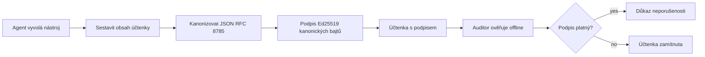
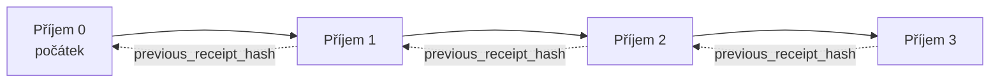

[Sledujte výukové video: Zajištění AI agentů pomocí kryptografických potvrzení](https://youtu.be/PLACEHOLDER_VIDEO_ID)

> _(Výukové video a náhled přidá tým Microsoftu po sloučení, v souladu s vzorem lekce 14 / 15.)_

# Zajištění AI agentů pomocí kryptografických potvrzení

## Úvod

Tato lekce se bude zabývat:

- Proč jsou auditní stopy u AI agentů důležité pro shodu, ladění a důvěru.
- Co je kryptografické potvrzení a jak se liší od nepodepsaného logovacího záznamu.
- Jak vytvořit podepsané potvrzení o volání nástroje agenta v čistém Pythonu.
- Jak offline ověřit potvrzení a zjistit manipulaci.
- Jak řetězit potvrzení, aby odebrání nebo přeuspořádání jednoho zlomilo řetěz.
- Co potvrzení dokazují a co výslovně nedokazují.

## Cíle učení

Po dokončení této lekce budete umět:

- Identifikovat režimy selhání, které motivují kryptografické původnictví akcí agenta.
- Vytvořit potvrzení podepsané Ed25519 nad kanonickým JSON záznamem.
- Ověřit potvrzení nezávisle pouze s použitím veřejného klíče podepisovatele.
- Zjistit manipulaci znovuověřením změněného potvrzení.
- Vybudovat hashový řetězec potvrzení a vysvětlit, proč je řetězec důležitý.
- Rozpoznat hranici mezi tím, co potvrzení dokazují (přiřazení, integrita, pořadí) a co nedokazují (správnost akce, správnost politiky).

## Problém: Auditní stopa vašeho agenta

Představte si, že jste nasadili AI agenta pro Contoso Travel. Agent čte požadavky zákazníků, volá API leteckých společností, aby zjistil možnosti, a rezervuje na zákazníka sedadla. Za poslední čtvrtletí agent zpracoval 50 000 rezervací.

Dnes přijde auditor. Položí jednoduchou otázku: „Ukažte mi, co váš agent dělal.“

Předáte mu své logy. Auditor je prohlédne a položí těžší otázku: „Jak vím, že tyto logy nebyly upraveny?“

To je problém auditní stopy. Většina dnešních nasazení agentů spoléhá na:

- **Aplikační logy**: píše je samotný agent, upravit je může kdokoli s přístupem k souborovému systému.
- **Cloudové logovací služby**: jsou na úrovni platformy detekovatelné při manipulaci, ale pouze pokud auditor důvěřuje provozovateli platformy.
- **Databázové transakční logy**: hodí se pro změny v databázi, ale ne pro libovolná volání nástrojů.

Žádný z těchto zdrojů nedokáže odpovědět auditorovi bez nutnosti, aby auditor někomu důvěřoval (vám, vašemu poskytovateli cloudu, dodavateli databáze). Pro interní použití je tato důvěra často přijatelná. Pro regulované úlohy (finance, zdravotnictví, vše podléhající evropskému zákonu o AI) nikoliv.

Kryptografická potvrzení tento problém řeší tím, že každou akci agenta učiní nezávisle ověřitelnou. Auditor nemusí věřit vám. Stačí mu pouze váš veřejný klíč a samotné potvrzení.

## Co je kryptografické potvrzení?

Potvrzení je JSON objekt, který zaznamenává, co agent udělal, podepsaný digitálním podpisem.


```mermaid
flowchart LR
    A[Agent vyvolá nástroj] --> B[Sestavit obsah účtenky]
    B --> C[Kanonizovat JSON RFC 8785]
    C --> E[Podpis Ed25519 kanonických bajtů]
    E --> F[Účtenka s podpisem]
    F --> G[Auditor ověřuje offline]
    G --> H{Podpis platný?}
    H -- yes --> I[Důkaz neporušenosti]
    H -- no --> J[Účtenka zamítnuta]
```

Minimální potvrzení vypadá takto:

```json
{
  "type": "agent.tool_call.v1",
  "agent_id": "contoso-travel-bot",
  "tool_name": "lookup_flights",
  "tool_args_hash": "sha256:a3f9c1...",
  "result_hash": "sha256:7b2e1d...",
  "policy_id": "contoso-travel-policy-v3",
  "timestamp": "2026-04-25T14:30:00Z",
  "sequence": 47,
  "previous_receipt_hash": "sha256:9d4e6a...",
  "signature": {
    "alg": "EdDSA",
    "sig": "c5af83...",
    "public_key": "8f3b2c..."
  }
}
```

Tři vlastnosti vykonávají práci:

1. **Podpis**. Potvrzení je podepsáno branou agenta pomocí privátního klíče Ed25519. Každý, kdo má odpovídající veřejný klíč, může podpis offline ověřit. Manipulace s jakýmkoli polem podpis zneplatní.

2. **Kanonické kódování**. Před podpisem je potvrzení serializováno pomocí JSON Canonicalization Scheme (JCS, RFC 8785). To zajišťuje, že dvě implementace, které vytvoří stejný logický obsah potvrzení, vytvoří přesně stejné bajty. Bez kanonizace by různé JSON serializéry produkovaly různé podpisy pro stejný obsah.

3. **Řetězení hashů**. Pole `previous_receipt_hash` propojuje každé potvrzení s tím předcházejícím. Odebrání nebo přeuspořádání potvrzení zlomí každé následující potvrzení. Manipulace je viditelná na úrovni řetězce i když jsou jednotlivé podpisy obejity.

Tyto vlastnosti dohromady poskytují tři záruky:

- **Přiřazení**: tento klíč podepsal tento obsah.
- **Integrita**: obsah se od podpisu nezměnil.
- **Pořadí**: toto potvrzení přišlo po tomto potvrzení v řetězci.

## Vytvoření potvrzení v Pythonu

Nepotřebujete speciální knihovnu pro vytvoření potvrzení. Kryptografické primitivy jsou široce dostupné a logika je jen několik desítek řádků Pythonu.

Praktická cvičení v `code_samples/18-signed-receipts.ipynb` krok po kroku ukazují celý proces. Shrnutí:

```python
import json
import hashlib
import base64
from nacl import signing
from jcs import canonicalize  # RFC 8785 kanonický JSON

def b64url_nopad(data: bytes) -> str:
    return base64.urlsafe_b64encode(data).decode("ascii").rstrip("=")

def sha256_canonical(obj) -> str:
    """SHA-256 of a Python object's JCS-canonical JSON form."""
    return f"sha256:{hashlib.sha256(canonicalize(obj)).hexdigest()}"

# Vygenerujte nebo načtěte podepisovací klíč (v produkci uložte do trezoru klíčů)
signing_key = signing.SigningKey.generate()
verify_key = signing_key.verify_key

# Vytvořte obsah účtenky (zatím bez podpisu)
tool_args = {"origin": "SYD", "destination": "LAX"}
tool_result = [{"flight": "QF11", "price": 1850, "stops": 0}]

payload = {
    "type": "agent.tool_call.v1",
    "agent_id": "contoso-travel-bot",
    "tool_name": "lookup_flights",
    "tool_args_hash": sha256_canonical(tool_args),
    "result_hash": sha256_canonical(tool_result),
    "policy_id": "contoso-travel-policy-v3",
    "timestamp": "2026-04-25T14:30:00Z",
    "sequence": 0,
    "previous_receipt_hash": None,
}

# Kanonizujte a přímo podepište bajty JCS. PureEdDSA interně hashuje.
canonical_bytes = canonicalize(payload)
signature_bytes = signing_key.sign(canonical_bytes).signature

# Připojte strukturovaný podpisový objekt.
receipt = {
    **payload,
    "signature": {
        "alg": "EdDSA",
        "sig": b64url_nopad(signature_bytes),
        "public_key": b64url_nopad(bytes(verify_key)),
    },
}
```

To je celý podpisový proces. Cvičení v zápisníku ukazují každý krok podrobně.

## Ověření potvrzení a detekce manipulace

Ověření je opačný proces:

```python
import base64
import hashlib
from nacl import signing
from nacl.exceptions import BadSignatureError
from jcs import canonicalize

def b64url_decode(s: str) -> bytes:
    padding = "=" * ((4 - len(s) % 4) % 4)
    return base64.urlsafe_b64decode(s + padding)

def verify_receipt(receipt: dict) -> bool:
    # Podpis je strukturovaný objekt: {"alg", "sig", "public_key"}.
    sig_obj = receipt.get("signature")
    if not sig_obj or sig_obj.get("alg") != "EdDSA":
        return False

    # Zrekonstruujte payload, který byl skutečně podepsán (vše kromě podpisu).
    payload = {k: v for k, v in receipt.items() if k != "signature"}

    canonical_bytes = canonicalize(payload)

    try:
        verify_key = signing.VerifyKey(b64url_decode(sig_obj["public_key"]))
        verify_key.verify(canonical_bytes, b64url_decode(sig_obj["sig"]))
        return True
    except BadSignatureError:
        return False
```

Tato funkce vezme potvrzení a vrátí `True`, pokud je podpis platný, `False` jinak. Bez volání do sítě, bez závislosti na službě, bez důvěry v třetí stranu.

Pro zobrazení detekce manipulace zápisník ukazuje:

1. Vytvoření platného potvrzení a potvrzení, že ověření projde.
2. Úprava jednoho bajtu v poli `tool_args_hash`.
3. Opětovné spuštění ověření, které selže.

Toto je praktická ukázka, že potvrzení jsou odolná proti manipulaci: jakákoli změna, i sebemenší, zlomí podpis.

## Řetězení potvrzení pro agenty s více kroky

Jedno podepsané potvrzení chrání jednu akci. Řetězec potvrzení chrání sekvenci akcí.


```mermaid
flowchart LR
    R0[Příjem 0<br/>počátek] --> R1[Příjem 1]
    R1 --> R2[Příjem 2]
    R2 --> R3[Příjem 3]
    R1 -. previous_receipt_hash .-> R0
    R2 -. previous_receipt_hash .-> R1
    R3 -. previous_receipt_hash .-> R2
```

Každé potvrzení zaznamenává hash toho předchozího. Chcete-li tichounce odstranit potvrzení 2, útočník by musel:

- Upravit pole `previous_receipt_hash` v potvrzení 3 (zničí podpis potvrzení 3), NEBO
- Vytvořit nový podpis k upravenému potvrzení 3 (vyžaduje soukromý klíč agenta).

Pokud je soukromý klíč v hardwarovém úložišti a veřejný klíč zveřejníte s každým potvrzením, žádný z těchto útoků není bez detekce proveditelný.

Zápisník ukazuje:

1. Vytvoření řetězce tří potvrzení.
2. Ověření, že `previous_receipt_hash` každého potvrzení odpovídá skutečnému hashi předchozího potvrzení.
3. Manipulaci s jedním potvrzením uprostřed a pozorování zlomu řetězce právě na tomto místě.

Takto vytvoříte auditní stopu, kterou může externí auditor ověřit bez důvěry v vás.

## Co potvrzení dokazují (a co ne)

Toto je nejdůležitější část této lekce. Potvrzení jsou mocná, ale jejich moc je omezená.

**Potvrzení dokazují tři věci:**

1. **Přiřazení**: určitý klíč podepsal konkrétní obsah.
2. **Integrita**: obsah se od času podpisu nezměnil.
3. **Pořadí**: toto potvrzení přišlo po daném potvrzení v hashovém řetězci.

**Potvrzení neprokazují:**

1. **Správnost**: že akce agenta byla správná. Potvrzení může být podepsáno stejně snadno pro chybnou odpověď jako pro správnou.
2. **Soulad s politikou**: že politika uvedená v `policy_id` byla skutečně aplikována, nebo že by tuto akci povolila. Potvrzení zaznamenává, co bylo tvrzeno, ne co bylo vynucováno.
3. **Identita nad rámec klíče**: potvrzení říká „tento klíč podepsal tento obsah“, nikoli „tento člověk to autorizoval“. Pro spojení klíče s osobou nebo organizací je potřeba samostatná identitní infrastruktura (adresář, registr veřejných klíčů atd.).
4. **Pravdivost vstupů**: pokud agent obdrží zmanipulovaný podnět a podle něj jedná, potvrzení věrně zaznamenává tuto akci. Potvrzení jsou závislá na validaci vstupu, nejsou její náhradou.

Tato hranice je důležitá ze dvou důvodů:

- Říká vám, k čemu jsou potvrzení užitečná: k auditovatelnosti a detekovatelnosti manipulace chování agenta, i přes organizační hranice.
- Říká vám, jaké další vrstvy stále potřebujete: validaci vstupů (Lekce 6), vynucování politiky (stručně níže) a identitní infrastrukturu (mimo rozsah této lekce).

Častou chybou je předpokládat, že „máme potvrzení“, tedy „jsme řízeni“. Není to pravda. Potvrzení jsou základ. Řízení (governance) je systém, který na něm postavíte.

## Dokazování, že člověk schválil přesnou akci

Položka 3 výše stojí za vlastní sekci: potvrzení akce říká „tento klíč podepsal tento obsah“, nikdy „člověk to autorizoval“. Pro vysoce rizikové akce (refundace, mazání, bankovní převody) rámce řízení stále častěji vyžadují přesně toto chybějící tvrzení, a je ho možné vytvořit se stejnými primitivy, které jste již v této lekci postavili.

Další zápisník `code_samples/human-authorization-receipts.ipynb` přidává druhý typ potvrzení, `human.approval.v1`, ve stejném obálkovém tvaru jako potvrzení z lekce (typovaný náklad podepsaný Ed25519 přes kanonické bajty JCS, s objektem `signature` mimo podepsané bajty). Jmenovaný schvalovatel podepisuje **plnou kanonickou akci a její otisk** před vykonáním; potvrzení akce agenta nese **stejný otisk akce** a `parent_approval_ref`, což je `receipt_hash` schválení, stejná konvence jako `previous_receipt_hash` v řetězci výše. Jedna funkce `verify_chain` ověřuje oba artefakty pod **oddělenými registrovanými klíči** (schvalovatelé vs agenti), takže kód je společný, ale autority nikdy.

Vlastnost, kterou to přináší, je pečlivě formulována: *člověk schválil přesně tuto akci a agent vykonal právě tuto schválenou akci.* Zápisníkové odmítací mechanismy jsou tím, co dělá vlastnost skutečnou, ne pouze tvrzenou:

- klasická sada: manipulace, zmatený zástupce, opakování, padělané klíče na obou stranách, neplatný vstup;
- **zastaralá autorita**: podpis stále ověřitelný, ale odmítnutý, protože se změnila verze politiky, klíč schvalovatele byl odstraněn z registrovaných, nebo schválení vypršelo před vykonáním;
- **náhrada otisku**: platně podepsané potvrzení akce ukazující na *skutečné* schválení, které váže *jinou* kanonickou akci.

Každé selhání odmítne s odlišným důvodem, takže auditor čtoucí odmítnutí pozná, zda autorita zastarala, nebo zda se změnila vykonaná akce. Pravidlo, které zápisník učí: podepsané schválení samo o sobě není autoritou. Autorita existuje pouze pokud obě potvrzení stále vážou stejnou kanonickou akci při vykonání. Potvrzení lidského schválení je vzdělávací kompozicí definovanou touto lekcí, nikoli typem potvrzení definovaným v `draft-farley-acta-signed-receipts`.

## Produkční reference

Python kód v této lekci je záměrně minimální, abyste mohli přečíst každý řádek a přesně pochopit, co se děje. V produkci máte dvě možnosti:

1. **Stavět přímo na kryptografických primitivech.** Výše viděných 50 řádků je dostačujících pro mnoho případů použití. PyNaCl (Ed25519) a balíček `jcs` (kanonický JSON) jsou dobře udržované a auditované knihovny.

2. **Použít produkční knihovnu pro potvrzení.** Několik open-source projektů implementuje stejný vzor s dalšími funkcemi (rotace klíčů, hromadné ověřování, distribuce JWK Set, integrace s politickými enginy):
   - Podpisový proces využívá konvence JCS a rozsahu podpisu v samostatném IETF Internet-Draft ([`draft-farley-acta-signed-receipts`](https://datatracker.ietf.org/doc/draft-farley-acta-signed-receipts/), revize 02). Výukové ploché potvrzení se liší od draftové obálky `{payload, signature}` a není prezentováno jako shodná implementace. Draft publikuje sdílenou sadu testů shody ([agent-governance-testvectors](https://github.com/ScopeBlind/agent-governance-testvectors)) pro implementace cílící na jeho formát dat.
   - Microsoft Agent Governance Toolkit skládá potvrzení s rozhodnutími na základě Cedar politik; viz Tutoriál 33 v tomto repozitáři jako kompletní příklad.
   - Balíčky `protect-mcp` (npm) a `@veritasacta/verify` (npm) poskytují Node implementaci podepisování potvrzení a offline ověření, určenou k obalení jakéhokoli MCP serveru auditní stopou detekovatelnou při manipulaci, včetně flow držení k podepsání, kde pozastavená akce vydá schvalovací potvrzení vázané na otisk akce (WebAuthn podporovaný v desktop flow), stejné schéma schvalovacího potvrzení jako v zápisníku lidského autorizování výše.
   - **[nobulex](https://github.com/arian-gogani/nobulex)** Python SDK (`pip install nobulex`) poskytuje stejný Ed25519 + JCS podpisový vzor v Pythonu s integracemi LangChain a CrewAI, včetně publikovaných vektorů pro křížovou validaci a mapování compliance příspěvku přes [OWASP PR #2210](https://github.com/OWASP/CheatSheetSeries/pull/2210).

Rozhodování mezi vlastním řešením a knihovnou je podobné rozhodování mezi psaním vlastní JWT knihovny a použitím otestované: obě varianty jsou rozumné; knihovna šetří čas a snižuje auditní plochu; postup od nuly vás nutí rozumět každému primitivu. Tato lekce učí postup od nuly, abyste měli základ pro obě možnosti.

## Kontrola znalostí

Otestujte své znalosti před přechodem na praktické cvičení.

**1. Potvrzení je podepsáno privátním Ed25519 klíčem agenta. Auditor má pouze veřejný klíč. Může auditor potvrzení ověřit offline?**

<details>
<summary>Odpověď</summary>

Ano. Ověření Ed25519 vyžaduje jen veřejný klíč a podepsané bajty. Žádné volání sítě, žádná závislost na službách. Toto je vlastnost, která činí potvrzení užitečným v oddělených (air-gapped), vícero organizačních nebo nízkodůvěrných auditních nastaveních.
</details>

**2. Útočník upraví pole `policy_id` potvrzení, aby tvrdil, že byla řízena přívětivější politikou. Podpis byl ale spočítán nad původním obsahem. Co se stane při ověření?**

<details>
<summary>Odpověď</summary>


Ověření selhalo. Podpis byl vypočítán nad kanonickými byty původního zatížení; změna jakéhokoli pole tyto byty změní, což způsobí neplatnost podpisu. Útočník by potřeboval soukromý klíč k vytvoření nového platného podpisu, který však nemá.
</details>

**3. Proč účtenka obsahuje `tool_args_hash` a `result_hash` namísto surových argumentů a výsledku?**

<details>
<summary>Odpověď</summary>

Dva důvody. Za prvé, účtenka může potřebovat být archivována nebo přenášena v prostředích, kde je problémem únik surového obsahu (osobní údaje, obchodní data). Hashování udržuje účtenku malou a obsah soukromý; auditor ověřuje, že hash odpovídá samostatně uložené kopii skutečného obsahu. Za druhé, hashe mají pevnou velikost; účtenka s hashi má omezenou velikost bez ohledu na to, jak velké byly vstupy a výstupy.
</details>

**4. Pole `previous_receipt_hash` propojuje každou účtenku s jejím předchůdcem. Pokud útočník tiše odstraní jednu účtenku ze středu řetězce, co se stane neplatným?**

<details>
<summary>Odpověď</summary>

Každá účtenka, která přišla po odstraněné. Jejich pole `previous_receipt_hash` již neodpovídají skutečnému řetězci (protože účtenka, na kterou odkazovaly, již neexistuje, nebo řetězec nyní ukazuje na jiného předchůdce). Aby útočník skryl odstranění, musel by znovu podepsat každou pozdější účtenku, což vyžaduje soukromý klíč.
</details>

**5. Účtenka je ověřena bez chyb. Dokazuje to, že akce agenta byla správná, validní nebo v souladu s politikou?**

<details>
<summary>Odpověď</summary>

Ne. Platná účtenka dokazuje tři věci: atribuci (tento klíč podepsal tento obsah), integritu (obsah se nezměnil) a pořadí (tato účtenka přišla po té předchozí). Neprokazuje, že akce byla správná, že politika pojmenovaná v `policy_id` byla skutečně vyhodnocena, nebo že agent dodržel všechna pravidla. Účtenky umožňují auditovatelnost chování agenta, nikoliv nutně jeho správnost. Toto je nejdůležitější hranice v této lekci.
</details>

## Praktické cvičení

Otevřete `code_samples/18-signed-receipts.ipynb` a dokončete všechny čtyři části:

1. **Sekce 1**: Podepište svou první účtenku a ověřte ji.
2. **Sekce 2**: Změňte účtenku a sledujte selhání ověření.
3. **Sekce 3**: Vytvořte řetězec ze tří účtenek a ověřte integritu řetězce.
4. **Sekce 4**: Použijte vzor na agenta postaveného s Microsoft Agent Framework: zabalte volání nástroje do podpisu účtenky a poté ověřte účtenku nezávisle.

**Rozšířená výzva 1:** rozšiřte schéma účtenky o další pole dle vlastního výběru (například ID požadavku pro sledování), aktualizujte kanonickou logiku podepisování, aby ho zahrnovala, a potvrďte, že účtenka stále projde ověřením. Poté pole po podepsání upravte a potvrďte selhání ověření. To vás donutí pochopit, jak každý byte kanonického kódování přispívá k podpisu.

**Rozšířená výzva 2:** Proveďte SHA-256 hash dvou svých účtenek dohromady (zkonzatenujte jejich kanonické bajty v deterministickém pořadí) a vložte výsledný digest jako nové pole do třetí účtenky před jejím podepsáním. Ověřte, že všechny tři účtenky stále projdou ověřením. Právě jste vytvořili jednorázový důkaz o začlenění: kdokoli držící třetí účtenku může prokázat, že první dvě existovaly v době jejího podepsání, aniž by musel odhalit jejich obsah. Toto je vzor, který selektivní zveřejňovací účtenky používají ve velkém měřítku (Merkleho závazky, RFC 6962).

## Závěr

Kryptografické účtenky dávají AI agentům auditní stopu, která je:

- **Nezávisle ověřitelná**: kdokoli s veřejným klíčem může ověřit bez závislosti na službě.
- **Zřejmá manipulace**: jakákoliv změna neplatí podpis.
- **Přenosná**: účtenka je malý JSON soubor; může být archivována, přenášena a ověřována kdekoli.
- **Shodná se standardy**: postavená na Ed25519 (RFC 8032), JCS (RFC 8785) a SHA-256, všechny široce používané primitivy.

Není náhradou za validaci vstupů, vynucování politiky nebo identifikační infrastrukturu. Jsou základem pro tyto vrstvy. Když nasazujete agenty do regulovaných pracovních zátěží, víceorganizačních workflow nebo jakéhokoli prostředí, kde nelze předpokládat důvěru budoucího auditora, účtenky jsou tím, jak udělat auditní stopu poctivou.

Nejdůležitější ponaučení: účtenky dokazují, kdo co a kdy řekl. Nedokazují, že to, co bylo řečeno, je pravda nebo správné. Pevně držte toto rozlišení. Je to rozdíl mezi poctivým a zavádějícím provenance systémem.

## Produkční kontrolní seznam

Když budete připraveni postoupit z této lekce k nasazení agentů podepisujících účtenky v reálném prostředí:

- [ ] **Přesuňte podpisový klíč mimo vývojářský notebook.** Použijte Azure Key Vault, AWS KMS nebo hardwarový bezpečnostní modul. Soukromý klíč podepisující vaše účtenky nikdy nesmí být v repozitáři zdrojového kódu nebo v prostém textu na aplikačních strojích.
- [ ] **Publikujte ověřovací veřejný klíč.** Auditoři ho potřebují k offline ověření. Standardní vzor je JWK Set na dobře známé URL (RFC 7517), např. `https://your-org.example.com/.well-known/agent-keys.json`.
- [ ] **Externě ukotvěte řetězec.** Pravidelně zaznamenávejte hash hlavy řetězce do transparentního logu (Sigstore Rekor, RFC 3161 časová autorita nebo druhý interní systém), aby mohla externí strana potvrdit „tento řetězec existoval v tomto čase.“
- [ ] **Uchovávejte účtenky neměnné.** Append-only blob storage (Azure Storage s politikami neměnnosti, AWS S3 Object Lock) zabraňuje insiderovi přepisovat historii na úrovni úložiště.
- [ ] **Rozhodněte o retention.** Mnoho regulačních režimů vyžaduje víceleté uchování. Plánujte růst účtenek (každá účtenka má cca 500 bytů; agent provádějící 10K volání denně produkuje cca 1,8 GB za rok).
- [ ] **Zdokumentujte, co účtenky nepokrývají.** Účtenky dokazují atribuci, integritu a pořadí. Váš provozní manuál by měl explicitně uvádět, jaké další kontroly (validace vstupů, vynucení politiky, omezení rychlosti, identifikační infrastruktura) doplňují účtenky v rámci vaší správy.

### Máte další otázky ohledně zabezpečení AI agentů?

Připojte se k [Microsoft Foundry Discord](https://aka.ms/ai-agents/discord), kde se setkáte s dalšími studenty, navštívíte konzultační hodiny a získáte odpovědi na své otázky ohledně AI agentů.

## Za touto lekcí

Tato lekce pokrývá podepisování jediné účtenky a řetězce spojené hashem. Tyto primitivy se skládají do několika pokročilejších vzorů, na které můžete narazit, jak se vaše správa vyvíjí:

- **Selektivní zveřejnění.** Když jsou pole účtenky nezávisle ukotvena (Merkle strom ve stylu RFC 6962), můžete odhalit konkrétní pole specifickým auditorům a dokázat, že ostatní zůstávají nezměněné, aniž byste je odhalili. Užitečné, když stejná účtenka musí splnit jak komplexní audit (který vyžaduje úplnost), tak regulace omezení dat, jako je GDPR (které chtějí, aby auditor viděl co nejméně).
- **Revokace účtenek.** Pokud je kompromitován podepisovací klíč, potřebujete způsob, jak od určitého okamžiku označit všechny účtenky podepsané tímto klíčem jako nedůvěryhodné. Standardní vzory: krátkodobé podepisovací klíče plus publikovaný seznam revokací, nebo transparentní log s revokačními záznamy.
- **Dvoustanné / rozdělené podepisování účtenek.** Některé implementace rozdělují podepsané zatížení na pre-exekuční (`authorization_*`) a post-exekuční (`result_*`) poloviny s nezávislými podpisy, užitečné, když rozhodnutí o autorizaci a pozorovaný výsledek produkují různí aktéři nebo v různých časech. Toto lze přidávat na formát účtenky vyučovaný v této lekci.
- **Skládání zatížení.** Účtenka uzavírá jakékoliv byty, které vložíte do `result_hash`. Reálná zatížení jsou často bohatší než výsledek jediného volání nástroje: předrozhodovací úvahy (modelové predikce, uvažované možnosti, důkazy a jejich úplnost, postoj k riziku, řetězec odpovědnosti, výsledek brány) vše může být součástí zatížení, uzavřené jednou účtenkou. To udržuje formát účtenky minimální a zároveň umožňuje vývoj schémat zatížení dle domény.
- **Shoda napříč implementacemi.** Více nezávislých implementací stejného formátu účtenky (Python, TypeScript, Rust, Go) se vzájemně ověřuje pomocí sdílených testovacích vektorů. Pokud vytvoříte vlastní implementaci, ověření vůči publikovaným vektorům potvrzuje kompatibilitu na přenosové vrstvě.
- **Migrace na postkvantové šifry.** Ed25519 je dnes široce nasazeno, ale není kvantově odolné. Formát účtenky je algoritmicky flexibilní: pole `signature.alg` může nést `ML-DSA-65` (standard NIST pro postkvantové digitální podpisy), když potřebujete provést migraci. Plánujte přechodné období, kdy budou účtenky podepsané dvojsignaturou.

## Další zdroje

- <a href="https://datatracker.ietf.org/doc/draft-farley-acta-signed-receipts/" target="_blank">IETF Internet-Draft: Podepsané rozhodovací účtenky pro strojový přístupový kontrolní systém</a>
- <a href="https://learn.microsoft.com/azure/ai-studio/responsible-use-of-ai-overview" target="_blank">Přehled odpovědného používání AI (Azure AI)</a>
- <a href="https://datatracker.ietf.org/doc/html/rfc8032" target="_blank">RFC 8032: Digitální podpisový algoritmus Edwardsovy křivky (EdDSA)</a>
- <a href="https://datatracker.ietf.org/doc/html/rfc8785" target="_blank">RFC 8785: Schéma kanonizace JSON (JCS)</a>
- <a href="https://datatracker.ietf.org/doc/html/rfc6962" target="_blank">RFC 6962: Transparentnost certifikátů</a> (Merkleho stromová struktura použitá selektivními zveřejňovacími účtenkami)
- <a href="https://github.com/microsoft/agent-governance-toolkit/blob/main/docs/tutorials/33-offline-verifiable-receipts.md" target="_blank">Microsoft Agent Governance Toolkit, Tutoriál 33: Offline ověřitelné rozhodovací účtenky</a>
- <a href="https://github.com/ScopeBlind/agent-governance-testvectors" target="_blank">Testovací vektory pro shodu napříč implementacemi</a> pro formát účtenky použitý v této lekci (Apache-2.0)
- <a href="https://pynacl.readthedocs.io/" target="_blank">Dokumentace PyNaCl</a> (Ed25519 v Pythonu)

## Předchozí lekce

[Vytváření lokálních AI agentů](../17-creating-local-ai-agents/README.md)

---

<!-- CO-OP TRANSLATOR DISCLAIMER START -->
**Prohlášení o omezení odpovědnosti**:
Tento dokument byl přeložen pomocí AI překladatelské služby [Co-op Translator](https://github.com/Azure/co-op-translator). Přestože usilujeme o co největší přesnost, mějte prosím na paměti, že automatizované překlady mohou obsahovat chyby nebo nepřesnosti. Originální dokument v jeho mateřském jazyce by měl být považován za autoritativní zdroj. Pro kritické informace se doporučuje profesionální lidský překlad. Nejsme odpovědní za jakékoli nedorozumění nebo nesprávné interpretace vzniklé použitím tohoto překladu.
<!-- CO-OP TRANSLATOR DISCLAIMER END -->