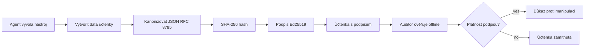
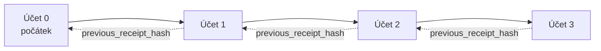

[Sledujte video z lekce: Zabezpečení AI agentů pomocí kryptografických potvrzení](https://youtu.be/PLACEHOLDER_VIDEO_ID)

> _(Video lekce a náhledový obrázek doplní po sloučení tým Microsoftu pro obsah, odpovídající vzoru lekce 14 / 15.)_

# Zabezpečení AI agentů pomocí kryptografických potvrzení

## Úvod

Tato lekce pokryje:

- Proč jsou auditní stopy AI agentů důležité pro shodu, ladění a důvěru.
- Co je kryptografické potvrzení a jak se liší od nepodepsaného záznamu v protokolu.
- Jak vytvořit podepsané potvrzení o volání nástroje agenta v čistém Pythonu.
- Jak potvrzení ověřit offline a zjistit manipulaci.
- Jak řetězit potvrzení tak, aby odstranění nebo přeuspořádání kteréhokoli z nich přerušilo řetězec.
- Co potvrzení dokládají a co explicitně nedokládají.

## Cíle výuky

Po dokončení této lekce budete umět:

- Identifikovat režimy selhání, které motivují kryptografický původ akcí agenta.
- Vytvořit Ed25519-podepsané potvrzení nad kanonickým JSON datovým blokem.
- Nezávisle ověřit potvrzení pouze pomocí veřejného klíče podepisovatele.
- Zjistit manipulaci opětovným ověřením modifikovaného potvrzení.
- Sestavit sekvenci potvrzení propojených hashem (hash chaining) a vysvětlit, proč je řetězec důležitý.
- Rozpoznat hranici mezi tím, co potvrzení dokládají (přiřazení, integrita, pořadí) a co nedokládají (správnost akce, správnost politiky).

## Problém: Auditní stopa vašeho agenta

Představte si, že jste nasadili AI agenta pro Contoso Travel. Agent čte požadavky zákazníků, volá API letů pro vyhledání možností a rezervuje sedadla jménem zákazníka. V minulém čtvrtletí agent zpracoval 50 000 rezervací.

Dnes přijde auditor. Položí jednoduchou otázku: „Ukažte mi, co váš agent dělal.“

Předáte mu své protokoly. Auditor je prohlédne a položí těžší otázku: „Jak vím, že tyto protokoly nebyly upravovány?“

To je problém auditní stopy. Většina dnešních nasazení agentů spoléhá na:

- **Aplikační protokoly**: psané samotným agentem, upravitelné kýmkoli s přístupem k souborovému systému.
- **Cloudové služby pro protokolování**: detekce manipulace na úrovni platformy, ale pouze pokud auditor důvěřuje provozovateli platformy.
- **Záznamy transakcí databáze**: vhodné pro změny databáze, ale ne pro libovolné volání nástrojů.

Žádné z nich nemůže auditorovu otázku zodpovědět, aniž by auditor musel někomu důvěřovat (vám, vašemu poskytovateli cloudu, dodavateli databáze). Pro interní použití je tato důvěra často přijatelná. Pro regulované zátěže (finance, zdravotnictví, cokoli pod EU AI zákonem) však nikoli.

Kryptografická potvrzení tento problém řeší tím, že každý agentní krok je samostatně ověřitelný. Auditor vám nemusí důvěřovat. Potřebuje jen váš veřejný klíč a samotné potvrzení.

## Co je kryptografické potvrzení?

Potvrzení je JSON objekt, který zaznamenává, co agent udělal, podepsaný digitálním podpisem.


```mermaid
flowchart LR
    A[Agent vyvolá nástroj] --> B[Vytvořit data účtenky]
    B --> C[Kanonizovat JSON RFC 8785]
    C --> D[SHA-256 hash]
    D --> E[Podpis Ed25519]
    E --> F[Účtenka s podpisem]
    F --> G[Auditor ověřuje offline]
    G --> H{Platnost podpisu?}
    H -- yes --> I[Důkaz proti manipulaci]
    H -- no --> J[Účtenka zamítnuta]
```

Minimální potvrzení vypadá takto:

```json
{
  "type": "agent.tool_call.v1",
  "agent_id": "contoso-travel-bot",
  "tool_name": "lookup_flights",
  "tool_args_hash": "sha256:a3f9c1...",
  "result_hash": "sha256:7b2e1d...",
  "policy_id": "contoso-travel-policy-v3",
  "timestamp": "2026-04-25T14:30:00Z",
  "sequence": 47,
  "previous_receipt_hash": "sha256:9d4e6a...",
  "signature": {
    "alg": "EdDSA",
    "sig": "c5af83...",
    "public_key": "8f3b2c..."
  }
}
```

Tři vlastnosti zajišťují funkčnost:

1. **Podpis**. Potvrzení podepisuje agentova brána pomocí Ed25519 soukromého klíče. Každý, kdo disponuje odpovídajícím veřejným klíčem, může offline ověřit podpis. Manipulace s jakýmkoli polem podpis zneplatní.

2. **Kanonické kódování**. Před podpisem je potvrzení serializováno pomocí JSON Canonicalization Scheme (JCS, RFC 8785). To zaručuje, že dvě implementace vyrábějící stejný logický obsah potvrzení vytváří bitově identický výstup. Bez kanonizace by různé JSON serializátory produkovaly různé podpisy pro stejný obsah.

3. **Řetězení hashů**. Pole `previous_receipt_hash` propojuje každé potvrzení s předchozím. Odstranění nebo přeuspořádání potvrzení přeruší každé potvrzení, které je za ním. Manipulace se tak stává viditelnou na úrovni řetězce i v případě obcházení jednotlivých podpisů.

Tyto vlastnosti dohromady poskytují tři záruky:

- **Přiřazení**: tento klíč podepsal tento obsah.
- **Integrita**: obsah od podpisu nezměněn.
- **Pořadí**: toto potvrzení přišlo po daném potvrzení v řetězci.

## Vytvoření potvrzení v Pythonu

K vytvoření potvrzení nepotřebujete speciální knihovnu. Kryptografické primitivy jsou široce dostupné a logika má jen několik desítek řádků Pythonu.

Praktická cvičení v souboru `code_samples/18-signed-receipts.ipynb` vedou celým procesem. Shrnutí:

```python
import json
import hashlib
import base64
from nacl import signing
from jcs import canonicalize  # RFC 8785 kanonický JSON

def b64url_nopad(data: bytes) -> str:
    return base64.urlsafe_b64encode(data).decode("ascii").rstrip("=")

def sha256_canonical(obj) -> str:
    """SHA-256 of a Python object's JCS-canonical JSON form."""
    return f"sha256:{hashlib.sha256(canonicalize(obj)).hexdigest()}"

# Vygenerujte nebo načtěte podpisový klíč (v produkci uložte do trezoru klíčů)
signing_key = signing.SigningKey.generate()
verify_key = signing_key.verify_key

# Vytvořte údaje účtenky (zatím bez podpisu)
tool_args = {"origin": "SYD", "destination": "LAX"}
tool_result = [{"flight": "QF11", "price": 1850, "stops": 0}]

payload = {
    "type": "agent.tool_call.v1",
    "agent_id": "contoso-travel-bot",
    "tool_name": "lookup_flights",
    "tool_args_hash": sha256_canonical(tool_args),
    "result_hash": sha256_canonical(tool_result),
    "policy_id": "contoso-travel-policy-v3",
    "timestamp": "2026-04-25T14:30:00Z",
    "sequence": 0,
    "previous_receipt_hash": None,
}

# Kanonizujte, zahashujte, podepište.
canonical_bytes = canonicalize(payload)
message_hash = hashlib.sha256(canonical_bytes).digest()
signature_bytes = signing_key.sign(message_hash).signature

# Připojte strukturovaný objekt podpisu.
receipt = {
    **payload,
    "signature": {
        "alg": "EdDSA",
        "sig": b64url_nopad(signature_bytes),
        "public_key": b64url_nopad(bytes(verify_key)),
    },
}
```

To je celý pipeline podepisování. Cvičení v notebooku postupně vysvětlují každý krok.

## Ověření potvrzení a detekce manipulace

Ověření je opačný proces:

```python
import base64
import hashlib
from nacl import signing
from nacl.exceptions import BadSignatureError
from jcs import canonicalize

def b64url_decode(s: str) -> bytes:
    padding = "=" * ((4 - len(s) % 4) % 4)
    return base64.urlsafe_b64decode(s + padding)

def verify_receipt(receipt: dict) -> bool:
    # Podpis je strukturovaný objekt: {"alg", "sig", "public_key"}.
    sig_obj = receipt.get("signature")
    if not sig_obj or sig_obj.get("alg") != "EdDSA":
        return False

    # Znovu sestavte obsah, který byl skutečně podepsán (vše kromě podpisu).
    payload = {k: v for k, v in receipt.items() if k != "signature"}

    canonical_bytes = canonicalize(payload)
    message_hash = hashlib.sha256(canonical_bytes).digest()

    try:
        verify_key = signing.VerifyKey(b64url_decode(sig_obj["public_key"]))
        verify_key.verify(message_hash, b64url_decode(sig_obj["sig"]))
        return True
    except BadSignatureError:
        return False
```

Tato funkce přijme potvrzení a vrátí `True`, pokud je podpis platný, jinak `False`. Žádné volání síťových služeb, žádná závislost na službě, žádná potřeba důvěry v třetí stranu.

Pro zobrazení detekce manipulace notebook demonstruje:

1. Vytvoření platného potvrzení a potvrzení jeho platnosti.
2. Úpravu jednoho bajtu v poli `tool_args_hash`.
3. Opětovné ověření a zjištění selhání.

To je praktická ukázka, že potvrzení jsou odolná vůči manipulacím: jakákoliv změna, byť malá, zneplatní podpis.

## Řetězení potvrzení pro vícefázové agenty

Jedno podepsané potvrzení chrání jednu akci. Řetězec potvrzení chrání sekvenci.


```mermaid
flowchart LR
    R0[Účet 0<br/>počátek] --> R1[Účet 1]
    R1 --> R2[Účet 2]
    R2 --> R3[Účet 3]
    R1 -. previous_receipt_hash .-> R0
    R2 -. previous_receipt_hash .-> R1
    R3 -. previous_receipt_hash .-> R2
```

Každé potvrzení zaznamenává hash svého předchůdce. Pro tichý odstraňování potvrzení č. 2 by útočník musel:

- Upravit pole `previous_receipt_hash` v potvrzení 3 (poruší podpis potvrzení 3), NEBO
- Zfalšovat podpis na upraveném potvrzení 3 (vyžaduje soukromý klíč agenta).

Pokud je soukromý klíč v hardwarovém trezoru a veřejný klíč zveřejňujete s každým potvrzením, žádný z těchto útoků není bez odhalení proveditelný.

Notebook demonstruje:

1. Vytvoření řetězce tří potvrzení.
2. Ověření, že každý `previous_receipt_hash` odpovídá skutečnému hashi předchozího potvrzení.
3. Manipulaci s jedním potvrzením uprostřed a pozorování přerušení řetězce právě v tomto místě.

Takto vytvoříte auditní stopu, kterou může externí auditor ověřit, aniž by vám musel důvěřovat.

## Co potvrzení dokládají (a co nedokládají)

Toto je nejdůležitější část lekce. Potvrzení jsou mocná, ale jejich možnosti jsou omezené.

**Potvrzení dokládají tři věci:**

1. **Přiřazení**: konkrétní klíč podepsal konkrétní datový blok.
2. **Integrita**: datový blok se od podpisu nezměnil.
3. **Pořadí**: toto potvrzení přišlo po daném potvrzení v hashovém řetězci.

**Potvrzení NEdokládají:**

1. **Správnost**: že akce agenta byla správná. Potvrzení může být podepsáno stejně snadno pro nesprávnou odpověď jako pro správnou.
2. **Shodu s politikou**: že politika uvedená v `policy_id` byla skutečně vyhodnocena, nebo že by akci povolila, kdyby byla zkontrolována. Potvrzení zaznamenává, co bylo uvedeno, ne co bylo vynuceno.
3. **Identitu nad rámec klíče**: potvrzení říká „tento klíč podepsal tento obsah“. Neříká „tento člověk toto autorizoval.“ Pro spojení klíče s osobou nebo organizací je potřeba samostatná identitní infrastruktura (adresář, registr veřejných klíčů apod.).
4. **Pravdivost vstupů**: pokud agent dostane zmanipulovaný prompt a jedná podle něj, potvrzení věrně zaznamenává akci. Potvrzení jsou reakcí na vstupní validaci, nikoli jejím náhradníkem.

Tato hranice je důležitá ze dvou důvodů:

- Říká vám, k čemu jsou potvrzení užitečná: dělají chování agentů auditovatelné a odolné vůči manipulaci, i přes organizační hranice.
- Říká vám, jaké další vrstvy stále potřebujete: validaci vstupů (Lekce 6), vynucování politiky (stručně zmíněné níže) a identitní infrastrukturu (mimo rozsah této lekce).

Běžnou chybou je předpokládat, že „máme potvrzení“ znamená „jsme řízeni.“ To neplatí. Potvrzení jsou základ. Řízení je systém, který na tom stavíte.

## Reference pro produkci

Python kód v této lekci je záměrně minimální, abyste mohli každý řádek přečíst a přesně pochopit, co se děje. V produkci máte dvě možnosti:

1. **Přímo stavět na kryptografických primitivech.** Oněch 50 řádků výše stačí pro mnoho případů použití. PyNaCl (Ed25519) a balíček `jcs` (kanonický JSON) jsou dobře udržované a auditované knihovny.

2. **Použít produkční knihovnu pro potvrzení.** Několik open-source projektů implementuje stejný vzor s dalšími funkcemi (rotace klíčů, hromadné ověřování, distribuce JWK Set, integrace s policy enginy):
   - Formát potvrzení použitý v této lekci vychází z IETF Internet-Draftu (`draft-farley-acta-signed-receipts`), který je právě ve fázi standardizačního procesu.
   - Microsoft Agent Governance Toolkit kombinuje potvrzení s politikami založenými na Cedar; viz Tutorial 33 v tomto repozitáři pro příklad end-to-end.
   - Balíčky `protect-mcp` (npm) a `@veritasacta/verify` (npm) poskytují Node implementaci podepisování potvrzení a offline ověřování, určenou k zabalení jakéhokoli MCP serveru s auditní stopou odolnou vůči manipulaci.
   - **[nobulex](https://github.com/arian-gogani/nobulex)** Python SDK (`pip install nobulex`) poskytuje stejný vzor podepisování Ed25519 + JCS v Pythonu s integrací LangChain a CrewAI, včetně publikovaných testovacích vektorů pro křížovou validaci a mapování shody přispěného pomocí [OWASP PR #2210](https://github.com/OWASP/CheatSheetSeries/pull/2210).

Rozhodnutí mezi psaním vlastního řešení a použitím knihovny odpovídá rozhodnutí mezi psaním vlastní JWT knihovny a použitím otestované knihovny: obě jsou rozumné; knihovna šetří čas a zmenšuje auditní plochu; cesta „od nuly“ vás nutí pochopit každý primitiv. Tato lekce učí cestu od nuly, abyste měli základ pro obě možnosti.

## Kontrola znalostí

Ověřte si své porozumění, než přejdete k praktickému cvičení.

**1. Potvrzení je podepsáno soukromým Ed25519 klíčem agenta. Auditor má pouze veřejný klíč. Může auditor potvrzení ověřit offline?**

<details>
<summary>Odpověď</summary>

Ano. Ověření Ed25519 vyžaduje pouze veřejný klíč a podepsané bajty. Žádné síťové volání, žádná závislost na službě. To je vlastnost, která dělá potvrzení užitečnými v oddělených, multiorganizačních nebo nízkodůvěrných auditech.
</details>

**2. Útočník upravil pole `policy_id` v potvrzení, aby tvrdil, že podléhalo uvolněnější politice. Podpis byl proveden nad původním datovým blokem. Co se stane při ověření?**

<details>
<summary>Odpověď</summary>

Ověření selže. Podpis byl vypočten nad kanonickými bajty původního datového bloku; jakákoli změna pole změní kanonické bajty, což změní SHA-256 hash, a tím způsobí neplatnost podpisu. Útočník by potřeboval soukromý klíč k vytvoření nového platného podpisu, který nemá.
</details>

**3. Proč potvrzení obsahuje `tool_args_hash` a `result_hash` místo surových argumentů a výsledků?**

<details>
<summary>Odpověď</summary>

Dva důvody. Za prvé, potvrzení může být archivováno nebo přenášeno v prostředích, kde únik surového obsahu (osobní údaje, obchodní data) představuje problém. Hashování udržuje potvrzení malé a obsah soukromý; auditor ověřuje, že hash odpovídá samostatně uchovávané kopii obsahu. Za druhé mají hashované hodnoty pevnou velikost; potvrzení s hashi má omezenou velikost bez ohledu na velikost vstupů a výstupů.
</details>

**4. Pole `previous_receipt_hash` propojuje každé potvrzení s předchůdcem. Pokud útočník tichým způsobem odstraní jedno potvrzení uprostřed řetězce, co se stane neplatným?**

<details>
<summary>Odpověď</summary>

Každé potvrzení, které následovalo po odstraněném. Jejich pole `previous_receipt_hash` už neodpovídají skutečnému řetězci (protože potvrzení, na které odkazovaly, neexistuje, nebo řetězec nyní ukazuje na jiného předchůdce). Pro skrytí odstranění by útočník musel přepodepsat každé následující potvrzení, což vyžaduje soukromý klíč.
</details>

**5. Potvrzení je úspěšně ověřeno. Dokládá to, že agentova akce byla správná, rozumná nebo v souladu s politikou?**

<details>
<summary>Odpověď</summary>

Ne. Platné potvrzení dokládá tři věci: přiřazení (tento klíč podepsal tento obsah), integritu (obsah se nezměnil) a pořadí (toto potvrzení přišlo po onom). Nedokládá správnost akce, že byla skutečně vyhodnocena politika uvedená v `policy_id`, ani že agent dodržel všechna pravidla. Potvrzení dělají chování agentů auditovatelné, ne nutně správné. Toto je nejdůležitější hranice lekce.
</details>

## Praktické cvičení

Otevřete `code_samples/18-signed-receipts.ipynb` a dokončete všechny čtyři části:

1. **Část 1**: Podepište své první potvrzení a ověřte ho.
2. **Část 2**: Manipulujte s potvrzením a sledujte neúspěch ověření.
3. **Část 3**: Vytvořte řetězec tří potvrzení a ověřte integritu řetězce.
4. **Část 4**: Aplikujte vzor na agenta vytvořeného pomocí Microsoft Agent Framework: zabalte volání nástroje do podepisování potvrzení a pak ověřte potvrzení nezávisle.


**Rozšířená výzva 1:** rozšiřte schéma potvrzení o další pole dle vlastního výběru (například ID žádosti pro trasování), aktualizujte logiku kanonického podepisování, aby jej zahrnovala, a potvrďte, že potvrzení stále projde ověřením. Poté pole po podepsání změňte a potvrďte, že ověření selže. To vás donutí pochopit, jak každý bajt kanonického kódování přispívá k podpisu.

**Rozšířená výzva 2:** zahashujte SHA-256 dvě vaše potvrzení dohromady (spojte jejich kanonické bajty v deterministickém pořadí) a vložte vzniklý digest jako nové pole do třetího potvrzení před jeho podepsáním. Ověřte, že všechna tři potvrzení stále projdou ověřením. Právě jste vytvořili jedno-krokový důkaz zahrnutí: kdokoliv, kdo drží třetí potvrzení, může dokázat, že první dvě existovala v době podepsání, aniž by bylo nutné odhalit jejich obsah. Toto je vzor, který používají potvrzení s selektivním zveřejněním ve velkém měřítku (Merkleovy závazky, RFC 6962).

## Závěr

Kryptografická potvrzení poskytují AI agentům auditní stopu, která je:

- **Nezávisle ověřitelná**: jakákoliv strana s veřejným klíčem může ověřit, bez závislosti na službách.
- **Odolná proti pozměnění**: jakákoliv změna neplatí podpis.
- **Přenosná**: potvrzení je malý JSON soubor; lze jej archivovat, přenášet a ověřovat kdekoli.
- **Souladná se standardy**: postavená na Ed25519 (RFC 8032), JCS (RFC 8785) a SHA-256, všechny široce používané primitivy.

Nejsou náhradou za validaci vstupu, vynucování politik nebo infrastrukturu identity. Jsou základem pro tyto vrstvy. Když nasazujete agenty do regulovaných pracovních zátěží, víceorganizačních toků práce nebo jakéhokoliv prostředí, kde budoucí auditor nemůže být považován za důvěryhodného vůči vám, potvrzení jsou způsob, jak zajistit poctivou auditní stopu.

Nejpodstatnější poznatek: potvrzení dokládají, kdo co kdy řekl. Nedokládají, že to, co bylo řečeno, je pravda nebo správné. Přistupujte k tomuto odlišení opatrně. Je to rozdíl mezi poctivým a zavádějícím systémem původu.

## Kontrolní seznam pro produkci

Až budete připraveni přejít z této lekce k nasazení agentů podepisujících potvrzení v reálném prostředí:

- [ ] **Přesuňte podepisovací klíč z vývojářského notebooku pryč.** Použijte Azure Key Vault, AWS KMS nebo hardwarový bezpečnostní modul. Soukromý klíč podepisující potvrzení nesmí nikdy být v systému správy zdrojového kódu ani v nešifrované podobě na aplikačních strojích.
- [ ] **Zveřejněte veřejný ověřovací klíč.** Auditoři jej potřebují k offline ověření. Standardním vzorem je JWK Set na známe URL (RFC 7517), např. `https://your-org.example.com/.well-known/agent-keys.json`.
- [ ] **Externě ukotvěte řetězec.** Pravidelně zapisujte hash hlavy řetězce do transparentního logu (Sigstore Rekor, RFC 3161 časová autorita, nebo druhý interní systém), aby externí strana mohla potvrdit "tento řetězec existoval v tomto čase."
- [ ] **Ukládejte potvrzení neměnným způsobem.** Přidávací blobové úložiště (Azure Storage s pravidly neměnnosti, AWS S3 Object Lock) brání insiderovi přepisovat historii na úrovni úložiště.
- [ ] **Rozhodněte o retenci.** Mnoho regulačních režimů vyžaduje víceroční archivaci. Plánujte růst potvrzení (každé potvrzení má cca 500 bajtů; agent provádějící 10 000 volání denně generuje cca 1,8 GB ročně).
- [ ] **Zdokumentujte, co potvrzení nepokrývají.** Potvrzení dokládají přiřazení, integritu a pořadí. Váš provozní manuál by měl explicitně vyjmenovat další kontroly (validace vstupu, vynucení politik, omezení rychlosti, infrastruktura identity), které stojí vedle potvrzení ve vaší správní pozici.

### Máte další otázky ohledně zabezpečení AI agentů?

Připojte se k [Microsoft Foundry Discord](https://aka.ms/ai-agents/discord), kde se setkáte s dalšími studenty, zúčastníte se konzultačních hodin a získáte odpovědi na vaše dotazy k AI Agentům.

## Za touto lekcí

Tato lekce pokrývá jediné podepsání potvrzení a sekvence s hashovým řetězcem. Stejné primitivy skládají několik pokročilejších vzorů, se kterými se můžete setkat, jak rozvíjíte svou správní pozici:

- **Selektivní zveřejnění.** Když jsou pole potvrzení samostatně závazná (Merkleův strom ve stylu RFC 6962), můžete specifická pole odkrýt vybraným auditorům a dokázat, že ostatní se nezměnila, aniž byste je odhalili. Užitočné, když totéž potvrzení musí vyhovět komplexnímu auditu (který chce úplnost) a regulacím minimalizace dat jako GDPR (které požadují, aby auditor viděl co nejméně).
- **Revokace potvrzení.** Pokud dojde ke kompromitaci podepisovacího klíče, potřebujete způsob, jak označit všechna potvrzení podepsaná tímto klíčem od určitého okamžiku jako nedůvěryhodná. Standardní vzory: krátkodobé podepisovací klíče plus zveřejněný seznam odvolání nebo transparentní log s položkami odvolání.
- **Bilaterální / rozdělené podpisové potvrzení.** Některé implementace dělí podepsaný obsah na předprovozní (`authorization_*`) a poprovozní (`result_*`) poloviny s nezávislými podpisy, užitečné, když rozhodnutí o autorizaci a pozorovaný výsledek provádějí různí aktéři nebo v různých časech. To se doplňuje nad rámec formátu potvrzení vyučovaného v této lekci.
- **Skládání obsahu.** Potvrzení zapečeťuje jakékoliv bajty, které vložíte do `result_hash`. Reálné payloady jsou často bohatší než výsledek jediného volání nástroje: předrozhodovací úvahy (predikce modelu, zvažované možnosti, důkazy a jejich úplnost, postoj k riziku, řetězec odpovědnosti, výsledek brány) mohou být všechny součástí payloadu, zapečetěné jedním potvrzením. To udržuje formát potvrzení minimální, ale umožňuje vývoj schémat payloadu dle domény.
- **Shoda mezi implementacemi.** Více nezávislých implementací stejného formátu potvrzení (Python, TypeScript, Rust, Go) vzájemně ověřuje pomocí sdílených testovacích vektorů. Pokud vyvíjíte vlastní implementaci, validace proti zveřejněným vektorům potvrzuje kompatibilitu na úrovni dat.
- **Migrace na post-kvantovou kryptografii.** Ed25519 je dnes široce nasazené, ale není kvantově odolné. Formát potvrzení je algoritmicky flexibilní: pole `signature.alg` může nést `ML-DSA-65` (NIST post-kvantový standard digitálního podpisu), když bude potřeba migrovat. Plánujte přechodné období, kdy budou potvrzení dvojitě podepsaná.

## Další zdroje

- <a href="https://datatracker.ietf.org/doc/draft-farley-acta-signed-receipts/" target="_blank">IETF Internet-Draft: Podepsaná rozhodnutí jako potvrzení pro strojový přístup</a>
- <a href="https://learn.microsoft.com/azure/ai-studio/responsible-use-of-ai-overview" target="_blank">Přehled odpovědného využití AI (Azure AI)</a>
- <a href="https://datatracker.ietf.org/doc/html/rfc8032" target="_blank">RFC 8032: Digital Signature Algorithm použítí Edwardsovy křivky (EdDSA)</a>
- <a href="https://datatracker.ietf.org/doc/html/rfc8785" target="_blank">RFC 8785: Schéma kanonizace JSON (JCS)</a>
- <a href="https://datatracker.ietf.org/doc/html/rfc6962" target="_blank">RFC 6962: Transparentnost certifikátů</a> (Merkleova konstrukce používaná potvrzeními s selektivním zveřejněním)
- <a href="https://github.com/microsoft/agent-governance-toolkit/blob/main/docs/tutorials/33-offline-verifiable-receipts.md" target="_blank">Microsoft Agent Governance Toolkit, Tutorial 33: Offline ověřitelná rozhodnutí potvrzení</a>
- <a href="https://github.com/ScopeBlind/agent-governance-testvectors" target="_blank">Testovací vektory pro shodu mezi implementacemi</a> formátu potvrzení použitého v této lekci (Apache-2.0)
- <a href="https://pynacl.readthedocs.io/" target="_blank">PyNaCl dokumentace</a> (Ed25519 v Pythonu)

## Předchozí lekce

[Budování agentů pro použití počítače (CUA)](../15-browser-use/README.md)

---

<!-- CO-OP TRANSLATOR DISCLAIMER START -->
**Prohlášení o omezení odpovědnosti**:
Tento dokument byl přeložen pomocí AI překladatelské služby [Co-op Translator](https://github.com/Azure/co-op-translator). Přestože usilujeme o co největší přesnost, mějte prosím na paměti, že automatizované překlady mohou obsahovat chyby nebo nepřesnosti. Originální dokument v jeho mateřském jazyce by měl být považován za autoritativní zdroj. Pro kritické informace se doporučuje profesionální lidský překlad. Nejsme odpovědní za jakékoli nedorozumění nebo nesprávné interpretace vzniklé použitím tohoto překladu.
<!-- CO-OP TRANSLATOR DISCLAIMER END -->