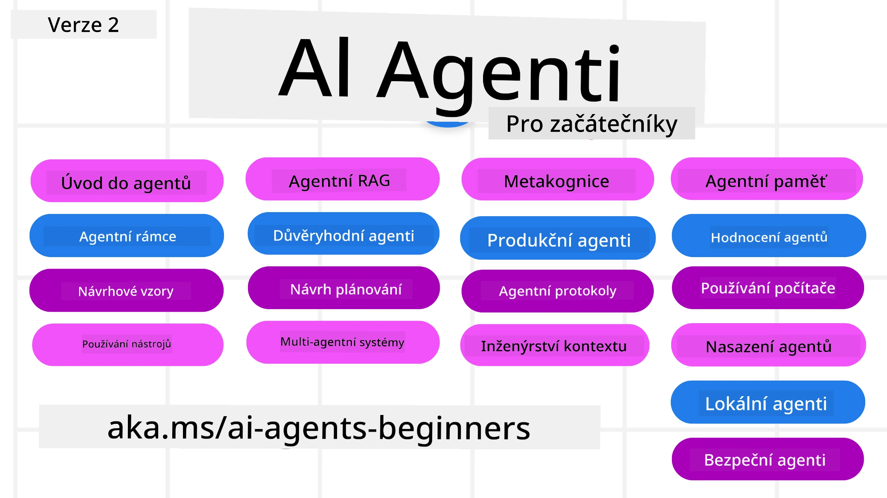

# AI Agenti pro začátečníky - Kurz



## Kurz, který vás naučí vše, co potřebujete vědět, abyste mohli začít vytvářet AI Agenty

[](https://github.com/microsoft/ai-agents-for-beginners/blob/master/LICENSE?WT.mc_id=academic-105485-koreyst)
[](https://GitHub.com/microsoft/ai-agents-for-beginners/graphs/contributors/?WT.mc_id=academic-105485-koreyst)
[](https://GitHub.com/microsoft/ai-agents-for-beginners/issues/?WT.mc_id=academic-105485-koreyst)
[](https://GitHub.com/microsoft/ai-agents-for-beginners/pulls/?WT.mc_id=academic-105485-koreyst)
[](http://makeapullrequest.com?WT.mc_id=academic-105485-koreyst)

### 🌐 Podpora více jazyků

#### Podporované prostřednictvím GitHub Action (automaticky a vždy aktuální)

<!-- CO-OP TRANSLATOR LANGUAGES TABLE START -->
[Arabic](../ar/README.md) | [Bengali](../bn/README.md) | [Bulgarian](../bg/README.md) | [Burmese (Myanmar)](../my/README.md) | [Chinese (Simplified)](../zh-CN/README.md) | [Chinese (Traditional, Hong Kong)](../zh-HK/README.md) | [Chinese (Traditional, Macau)](../zh-MO/README.md) | [Chinese (Traditional, Taiwan)](../zh-TW/README.md) | [Croatian](../hr/README.md) | [Czech](./README.md) | [Danish](../da/README.md) | [Dutch](../nl/README.md) | [Estonian](../et/README.md) | [Finnish](../fi/README.md) | [French](../fr/README.md) | [German](../de/README.md) | [Greek](../el/README.md) | [Hebrew](../he/README.md) | [Hindi](../hi/README.md) | [Hungarian](../hu/README.md) | [Indonesian](../id/README.md) | [Italian](../it/README.md) | [Japanese](../ja/README.md) | [Kannada](../kn/README.md) | [Khmer](../km/README.md) | [Korean](../ko/README.md) | [Lithuanian](../lt/README.md) | [Malay](../ms/README.md) | [Malayalam](../ml/README.md) | [Marathi](../mr/README.md) | [Nepali](../ne/README.md) | [Nigerian Pidgin](../pcm/README.md) | [Norwegian](../no/README.md) | [Persian (Farsi)](../fa/README.md) | [Polish](../pl/README.md) | [Portuguese (Brazil)](../pt-BR/README.md) | [Portuguese (Portugal)](../pt-PT/README.md) | [Punjabi (Gurmukhi)](../pa/README.md) | [Romanian](../ro/README.md) | [Russian](../ru/README.md) | [Serbian (Cyrillic)](../sr/README.md) | [Slovak](../sk/README.md) | [Slovenian](../sl/README.md) | [Spanish](../es/README.md) | [Swahili](../sw/README.md) | [Swedish](../sv/README.md) | [Tagalog (Filipino)](../tl/README.md) | [Tamil](../ta/README.md) | [Telugu](../te/README.md) | [Thai](../th/README.md) | [Turkish](../tr/README.md) | [Ukrainian](../uk/README.md) | [Urdu](../ur/README.md) | [Vietnamese](../vi/README.md)

> **Raději klonovat lokálně?**
>
> Tento repozitář zahrnuje více než 50 jazykových překladů, což výrazně zvětšuje velikost ke stažení. Pokud chcete klonovat bez překladů, použijte sparse checkout:
>
> **Bash / macOS / Linux:**
> ```bash
> git clone --filter=blob:none --sparse https://github.com/microsoft/ai-agents-for-beginners.git
> cd ai-agents-for-beginners
> git sparse-checkout set --no-cone '/*' '!translations' '!translated_images'
> ```
>
> **CMD (Windows):**
> ```cmd
> git clone --filter=blob:none --sparse https://github.com/microsoft/ai-agents-for-beginners.git
> cd ai-agents-for-beginners
> git sparse-checkout set --no-cone "/*" "!translations" "!translated_images"
> ```
>
> Tím získáte vše potřebné k dokončení kurzu s mnohem rychlejším stažením.
<!-- CO-OP TRANSLATOR LANGUAGES TABLE END -->

**Pokud si přejete mít podporovány další jazyky překladů, jsou uvedeny [zde](https://github.com/Azure/co-op-translator/blob/main/getting_started/supported-languages.md)**

[](https://GitHub.com/microsoft/ai-agents-for-beginners/watchers/?WT.mc_id=academic-105485-koreyst)
[](https://GitHub.com/microsoft/ai-agents-for-beginners/network/?WT.mc_id=academic-105485-koreyst)
[](https://GitHub.com/microsoft/ai-agents-for-beginners/stargazers/?WT.mc_id=academic-105485-koreyst)

[](https://discord.gg/nTYy5BXMWG)


## 🌱 Začínáme

Tento kurz obsahuje lekce zaměřené na základy vytváření AI Agentů. Každá lekce pokrývá své vlastní téma, takže můžete začít, kde chcete!

Kurz nabízí podporu více jazyků. Najděte je v sekci [dostupné jazyky zde](#-multi-language-support). 

Pokud je toto vaše první zkušenost s vytvářením s modely Generativní AI, podívejte se na náš kurz [Generative AI For Beginners](https://aka.ms/genai-beginners), který obsahuje 21 lekcí o tvorbě s GenAI.

Nezapomeňte [označit tento repozitář hvězdičkou (🌟)](https://docs.github.com/en/get-started/exploring-projects-on-github/saving-repositories-with-stars?WT.mc_id=academic-105485-koreyst) a [rozdělit tento repozitář (fork)](https://github.com/microsoft/ai-agents-for-beginners/fork), abyste mohli spustit kód.

### Seznamte se s ostatními studenty, získejte odpovědi na své otázky

Pokud narazíte na potíže nebo máte jakékoli otázky ohledně vytváření AI Agentů, připojte se k našemu dedikovanému kanálu na Discordu v rámci [Microsoft Foundry Discord](https://aka.ms/ai-agents/discord).

### Co budete potřebovat

Každá lekce v tomto kurzu obsahuje ukázky kódu, které najdete ve složce code_samples. Můžete [rozdělit (fork) tento repozitář](https://github.com/microsoft/ai-agents-for-beginners/fork), abyste vytvořili vlastní kopii.

Ukázky kódu v těchto cvičeních využívají Microsoft Agent Framework s Azure AI Foundry Agent Service V2:

- [Microsoft Foundry](https://aka.ms/ai-agents-beginners/ai-foundry) - Vyžaduje Azure účet

Tento kurz používá následující AI Agent frameworky a služby od Microsoftu:

- [Microsoft Agent Framework (MAF)](https://aka.ms/ai-agents-beginners/agent-framework)
- [Azure AI Foundry Agent Service V2](https://aka.ms/ai-agents-beginners/ai-agent-service)

Některé ukázky kódu také podporují alternativní poskytovatele kompatibilní s OpenAI, jako je [MiniMax](https://platform.minimaxi.com/), který nabízí modely s velkým kontextem (až 204K tokenů). Viz [Nastavení kurzu](./00-course-setup/README.md) pro podrobnosti konfigurace.

Více informací o spuštění kódu pro tento kurz najdete v [Nastavení kurzu](./00-course-setup/README.md).

## 🙏 Chcete pomoci?

Máte nějaké návrhy nebo jste našli pravopisné či kódové chyby? [Založte issue](https://github.com/microsoft/ai-agents-for-beginners/issues?WT.mc_id=academic-105485-koreyst) nebo [vytvořte pull request](https://github.com/microsoft/ai-agents-for-beginners/pulls?WT.mc_id=academic-105485-koreyst)


## 📂 Každá lekce obsahuje

- Písemnou lekci umístěnou v README a krátké video
- Ukázky kódu v Pythonu využívající Microsoft Agent Framework s Azure AI Foundry
- Odkazy na další zdroje pro pokračování ve vašem vzdělávání


## 🗃️ Lekce

| **Lekce**                                    | **Text & Kód**                                     | **Video**                                                  | **Další vzdělávání**                                                                     |
|----------------------------------------------|----------------------------------------------------|------------------------------------------------------------|----------------------------------------------------------------------------------------|
| Úvod do AI Agentů a případů použití agentů   | [Odkaz](./01-intro-to-ai-agents/README.md)         | [Video](https://youtu.be/3zgm60bXmQk?si=z8QygFvYQv-9WtO1)  | [Odkaz](https://aka.ms/ai-agents-beginners/collection?WT.mc_id=academic-105485-koreyst) |
| Prozkoumání agentních frameworků              | [Odkaz](./02-explore-agentic-frameworks/README.md) | [Video](https://youtu.be/ODwF-EZo_O8?si=Vawth4hzVaHv-u0H)  | [Odkaz](https://aka.ms/ai-agents-beginners/collection?WT.mc_id=academic-105485-koreyst) |
| Porozumění vzorům návrhu agentů                | [Odkaz](./03-agentic-design-patterns/README.md)    | [Video](https://youtu.be/m9lM8qqoOEA?si=BIzHwzstTPL8o9GF)  | [Odkaz](https://aka.ms/ai-agents-beginners/collection?WT.mc_id=academic-105485-koreyst) |
| Vzor návrhu používání nástrojů                 | [Odkaz](./04-tool-use/README.md)                    | [Video](https://youtu.be/vieRiPRx-gI?si=2z6O2Xu2cu_Jz46N)  | [Odkaz](https://aka.ms/ai-agents-beginners/collection?WT.mc_id=academic-105485-koreyst) |
| Agentní RAG                                  | [Odkaz](./05-agentic-rag/README.md)                 | [Video](https://youtu.be/WcjAARvdL7I?si=gKPWsQpKiIlDH9A3)  | [Odkaz](https://aka.ms/ai-agents-beginners/collection?WT.mc_id=academic-105485-koreyst) |
| Vytváření důvěryhodných AI Agentů             | [Odkaz](./06-building-trustworthy-agents/README.md) | [Video](https://youtu.be/iZKkMEGBCUQ?si=jZjpiMnGFOE9L8OK ) | [Odkaz](https://aka.ms/ai-agents-beginners/collection?WT.mc_id=academic-105485-koreyst) |
| Vzor návrhu plánování                         | [Odkaz](./07-planning-design/README.md)             | [Video](https://youtu.be/kPfJ2BrBCMY?si=6SC_iv_E5-mzucnC)  | [Odkaz](https://aka.ms/ai-agents-beginners/collection?WT.mc_id=academic-105485-koreyst) |
| Vzor návrhu multi-agentů                      | [Odkaz](./08-multi-agent/README.md)                 | [Video](https://youtu.be/V6HpE9hZEx0?si=rMgDhEu7wXo2uo6g)  | [Odkaz](https://aka.ms/ai-agents-beginners/collection?WT.mc_id=academic-105485-koreyst) |
| Návrhový vzor metakognice                 | [Odkaz](./09-metacognition/README.md)               | [Video](https://youtu.be/His9R6gw6Ec?si=8gck6vvdSNCt6OcF)  | [Odkaz](https://aka.ms/ai-agents-beginners/collection?WT.mc_id=academic-105485-koreyst) |
| AI agenti v produkci                      | [Odkaz](./10-ai-agents-production/README.md)        | [Video](https://youtu.be/l4TP6IyJxmQ?si=31dnhexRo6yLRJDl)  | [Odkaz](https://aka.ms/ai-agents-beginners/collection?WT.mc_id=academic-105485-koreyst) |
| Používání agentních protokolů (MCP, A2A a NLWeb) | [Odkaz](./11-agentic-protocols/README.md)           | [Video](https://youtu.be/X-Dh9R3Opn8)                                 | [Odkaz](https://aka.ms/ai-agents-beginners/collection?WT.mc_id=academic-105485-koreyst) |
| Context Engineering pro AI agenty            | [Odkaz](./12-context-engineering/README.md)         | [Video](https://youtu.be/F5zqRV7gEag)                                 | [Odkaz](https://aka.ms/ai-agents-beginners/collection?WT.mc_id=academic-105485-koreyst) |
| Správa agentické paměti                      | [Odkaz](./13-agent-memory/README.md)     |      [Video](https://youtu.be/QrYbHesIxpw?si=vZkVwKrQ4ieCcIPx)                                                      |                                                                                        |
| Prozkoumání Microsoft Agent Framework                         | [Odkaz](./14-microsoft-agent-framework/README.md)                            |                                                            |                                                                                        |
| Vytváření agentů pro používání počítače (CUA)           | [Odkaz](./15-browser-use/README.md)     |                                                            | [Odkaz](https://docs.browser-use.com/examples/templates/playwright-integration)         |
| Nasazování škálovatelných agentů                    | Brzy k dispozici                            |                                                            |                                                                                        |
| Vytváření lokálních AI agentů                     | Brzy k dispozici                               |                                                            |                                                                                        |
| Zabezpečení AI agentů                           | [Odkaz](./18-securing-ai-agents/README.md)  |                                                            | [Odkaz](https://aka.ms/ai-agents-beginners/collection?WT.mc_id=academic-105485-koreyst) |

## 🎒 Další kurzy

Náš tým vytváří i další kurzy! Podívejte se na:

<!-- CO-OP TRANSLATOR OTHER COURSES START -->
### LangChain
[](https://aka.ms/langchain4j-for-beginners)
[](https://aka.ms/langchainjs-for-beginners?WT.mc_id=m365-94501-dwahlin)
[](https://github.com/microsoft/langchain-for-beginners?WT.mc_id=m365-94501-dwahlin)
---

### Azure / Edge / MCP / Agent
[](https://github.com/microsoft/AZD-for-beginners?WT.mc_id=academic-105485-koreyst)
[](https://github.com/microsoft/edgeai-for-beginners?WT.mc_id=academic-105485-koreyst)
[](https://github.com/microsoft/mcp-for-beginners?WT.mc_id=academic-105485-koreyst)
[](https://github.com/microsoft/ai-agents-for-beginners?WT.mc_id=academic-105485-koreyst)

---
 
### Generativní AI série
[](https://github.com/microsoft/generative-ai-for-beginners?WT.mc_id=academic-105485-koreyst)
[-9333EA?style=for-the-badge&labelColor=E5E7EB&color=9333EA)](https://github.com/microsoft/Generative-AI-for-beginners-dotnet?WT.mc_id=academic-105485-koreyst)
[-C084FC?style=for-the-badge&labelColor=E5E7EB&color=C084FC)](https://github.com/microsoft/generative-ai-for-beginners-java?WT.mc_id=academic-105485-koreyst)
[-E879F9?style=for-the-badge&labelColor=E5E7EB&color=E879F9)](https://github.com/microsoft/generative-ai-with-javascript?WT.mc_id=academic-105485-koreyst)

---
 
### Základní vzdělávání
[](https://aka.ms/ml-beginners?WT.mc_id=academic-105485-koreyst)
[](https://aka.ms/datascience-beginners?WT.mc_id=academic-105485-koreyst)
[](https://aka.ms/ai-beginners?WT.mc_id=academic-105485-koreyst)
[](https://github.com/microsoft/Security-101?WT.mc_id=academic-96948-sayoung)
[](https://aka.ms/webdev-beginners?WT.mc_id=academic-105485-koreyst)
[](https://aka.ms/iot-beginners?WT.mc_id=academic-105485-koreyst)
[](https://github.com/microsoft/xr-development-for-beginners?WT.mc_id=academic-105485-koreyst)

---
 
### Sada Copilot
[](https://aka.ms/GitHubCopilotAI?WT.mc_id=academic-105485-koreyst)
[](https://github.com/microsoft/mastering-github-copilot-for-dotnet-csharp-developers?WT.mc_id=academic-105485-koreyst)
[](https://github.com/microsoft/CopilotAdventures?WT.mc_id=academic-105485-koreyst)
<!-- CO-OP TRANSLATOR OTHER COURSES END -->

## 🌟 Poděkování komunitě

Děkujeme [Shivam Goyal](https://www.linkedin.com/in/shivam2003/) za přispění důležitých ukázek kódu demonstrujících Agentic RAG.

## Přispívání

Tento projekt vítá příspěvky a návrhy. Většina příspěvků vyžaduje, abyste souhlasili s 
Dohodou o právu přispěvatele (CLA), v níž prohlašujete, že máte právo a skutečně poskytujete
práva k využití vašeho příspěvku. Podrobnosti naleznete na <https://cla.opensource.microsoft.com>.

Když odešlete požadavek na sloučení (pull request), bot CLA automaticky rozhodne, zda musíte
poskytnout CLA a odpovídajícím způsobem označí PR (například kontrolou stavu, komentářem). Stačí postupovat podle pokynů
poskytnutých botem. To budete muset udělat pouze jednou pro všechny repozitáře používající náš CLA.

Tento projekt přijal [Microsoft Open Source Code of Conduct](https://opensource.microsoft.com/codeofconduct/).
Pro více informací si přečtěte [Často kladené otázky k Chování](https://opensource.microsoft.com/codeofconduct/faq/) nebo
kontaktujte [opencode@microsoft.com](mailto:opencode@microsoft.com) s dalšími dotazy nebo připomínkami.

## Ochranné známky

Tento projekt může obsahovat ochranné známky nebo loga projektů, produktů nebo služeb. Autorizované používání ochranných známek nebo log společnosti Microsoft podléhá
a musí dodržovat [Microsoft's Trademark & Brand Guidelines](https://www.microsoft.com/legal/intellectualproperty/trademarks/usage/general).
Použití ochranných známek nebo log Microsoftu v upravených verzích tohoto projektu nesmí způsobit záměnu ani naznačovat sponzorování Microsoftem.
Jakékoli použití ochranných známek nebo log třetích stran je vázáno politikami těchto třetích stran.

## Získání pomoci

Pokud uvíznete nebo máte dotazy ohledně vytváření AI aplikací, připojte se k:

[](https://aka.ms/foundry/discord)

Pokud máte zpětnou vazbu k produktu nebo narazíte na chyby během vývoje, navštivte:

[](https://aka.ms/foundry/forum)

---

<!-- CO-OP TRANSLATOR DISCLAIMER START -->
**Prohlášení o omezení odpovědnosti**:
Tento dokument byl přeložen pomocí AI překladatelské služby [Co-op Translator](https://github.com/Azure/co-op-translator). Přestože usilujeme o co největší přesnost, mějte prosím na paměti, že automatizované překlady mohou obsahovat chyby nebo nepřesnosti. Originální dokument v jeho mateřském jazyce by měl být považován za autoritativní zdroj. Pro kritické informace se doporučuje profesionální lidský překlad. Nejsme odpovědní za jakékoli nedorozumění nebo nesprávné interpretace vzniklé použitím tohoto překladu.
<!-- CO-OP TRANSLATOR DISCLAIMER END -->