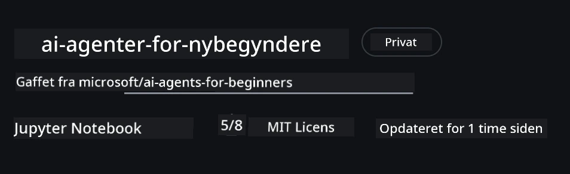
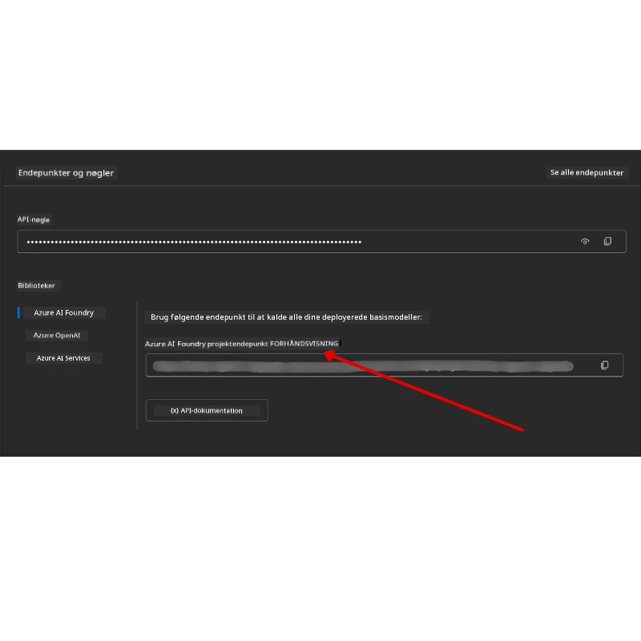

# Course Setup

## Introduction

Denne lektion vil dække, hvordan man kører kodeeksemplerne i dette kursus.

## Join Other Learners and Get Help

Før du begynder at klone dit repo, tilslut dig [AI Agents For Beginners Discord channel](https://aka.ms/ai-agents/discord) for at få hjælp til opsætning, spørgsmål om kurset eller for at få kontakt med andre kursister.

## Clone or Fork this Repo

For at komme i gang, klon eller fork GitHub-repositoriet. Dette laver din egen version af kursusmaterialet, så du kan køre, teste og ændre koden!

Dette kan gøres ved at klikke på linket til <a href="https://github.com/microsoft/ai-agents-for-beginners/fork" target="_blank">fork the repo</a>

Du bør nu have din egen forkede version af dette kursus på følgende link:



### Shallow Clone (recommended for workshop / Codespaces)

  >Det fulde repository kan være stort (~3 GB), når du downloader fuld historik og alle filer. Hvis du kun deltager i workshoppen eller kun har brug for nogle få lektionsmapper, undgår en shallow clone (eller en sparse clone) det meste af den download ved at trunkere historik og/eller springe blobs over.

#### Quick shallow clone — minimal history, all files

Erstat `<your-username>` i kommandoerne nedenfor med din fork URL (eller upstream-URL hvis du foretrækker det).

For kun at klone den seneste commit-historik (lille download):

```bash|powershell
git clone --depth 1 https://github.com/<your-username>/ai-agents-for-beginners.git
```

For at klone en specifik gren:

```bash|powershell
git clone --depth 1 --branch <branch-name> https://github.com/<your-username>/ai-agents-for-beginners.git
```

#### Partial (sparse) clone — minimal blobs + only selected folders

Dette bruger partial clone og sparse-checkout (kræver Git 2.25+ og anbefales at bruge en moderne Git med partial clone-support):

```bash|powershell
git clone --depth 1 --filter=blob:none --sparse https://github.com/<your-username>/ai-agents-for-beginners.git
```

Gå ind i repo-mappen:

```bash|powershell
cd ai-agents-for-beginners
```

Angiv derefter hvilke mapper du vil have (eksemplet nedenfor viser to mapper):

```bash|powershell
git sparse-checkout set 00-course-setup 01-intro-to-ai-agents
```

Efter kloning og verifikation af filerne, hvis du kun har brug for filerne og vil frigøre plads (ingen git-historik), slet venligst repository-metadataene (💀irreversibelt — du mister al Git-funktionalitet: ingen commits, pulls, pushes eller adgang til historik).

```bash
# zsh/bash
rm -rf .git
```

```powershell
# PowerShell
Remove-Item -Recurse -Force .git
```

#### Using GitHub Codespaces (recommended to avoid local large downloads)

- Opret en ny Codespace for dette repo via [GitHub UI](https://github.com/codespaces).  

- I terminalen i den nyskabte codespace, kør en af shallow/sparse clone-kommandoerne ovenfor for kun at få de lektionsmapper du har brug for ind i Codespace-arbejdsområdet.
- Valgfrit: efter kloning inde i Codespaces, fjern .git for at få ekstra plads tilbage (se fjernelseskommandoerne ovenfor).
- Bemærk: Hvis du foretrækker at åbne repoet direkte i Codespaces (uden en ekstra clone), vær opmærksom på at Codespaces vil konstruere devcontainer-miljøet og muligvis stadig provisionere mere end nødvendigt. At clone en shallow kopi inde i en frisk Codespace giver dig mere kontrol over diskforbruget.

#### Tips

- Erstat altid clone-URL'en med din fork, hvis du vil redigere/committe.
- Hvis du senere får brug for mere historik eller flere filer, kan du hente dem eller justere sparse-checkout for at inkludere yderligere mapper.

## Running the Code

Dette kursus tilbyder en række Jupyter Notebooks, som du kan køre for at få praktisk erfaring med at bygge AI-agenter.

Kodeeksemplerne bruger **Microsoft Agent Framework (MAF)** med `AzureAIProjectAgentProvider`, som forbinder til **Azure AI Agent Service V2** (Responses API) gennem **Microsoft Foundry**.

Alle Python-notebooks er mærket `*-python-agent-framework.ipynb`.

## Requirements

- Python 3.12+
  - **BEMÆRK**: Hvis du ikke har Python3.12 installeret, sørg for at installere det. Opret derefter dit venv ved hjælp af python3.12 for at sikre, at de korrekte versioner installeres fra requirements.txt-filen.
  
    >Eksempel

    Opret Python venv-mappe:

    ```bash|powershell
    python -m venv venv
    ```

    Aktivér derefter venv-miljøet for:

    ```bash
    # zsh/bash
    source venv/bin/activate
    ```
  
    ```dos
    # Command Prompt for Windows
    venv\Scripts\activate
    ```

- .NET 10+: For samplekoderne, der bruger .NET, sørg for at installere [.NET 10 SDK](https://dotnet.microsoft.com/download/dotnet/10.0) eller nyere. Tjek derefter din installerede .NET SDK-version:

    ```bash|powershell
    dotnet --list-sdks
    ```

- **Azure CLI** — Krævet til autentificering. Installer fra [aka.ms/installazurecli](https://aka.ms/installazurecli).
- **Azure Subscription** — For adgang til Microsoft Foundry og Azure AI Agent Service.
- **Microsoft Foundry Project** — Et projekt med en deployet model (f.eks. `gpt-4o`). Se [Step 1](../../../00-course-setup) nedenfor.

Vi har inkluderet en `requirements.txt` fil i roden af dette repository, som indeholder alle nødvendige Python-pakker for at køre kodeeksemplerne.

Du kan installere dem ved at køre følgende kommando i din terminal i repository-rodmappen:

```bash|powershell
pip install -r requirements.txt
```

Vi anbefaler at oprette et Python virtual environment for at undgå konflikter og problemer.

## Setup VSCode

Sørg for, at du bruger den rigtige version af Python i VSCode.


## Set Up Microsoft Foundry and Azure AI Agent Service

### Step 1: Create a Microsoft Foundry Project

Du skal bruge en Azure AI Foundry **hub** og **project** med en deployet model for at køre notebooks.

1. Gå til [ai.azure.com](https://ai.azure.com) og log ind med din Azure-konto.
2. Opret et **hub** (eller brug et eksisterende). Se: [Hub resources overview](https://learn.microsoft.com/azure/ai-foundry/concepts/ai-resources).
3. Inde i hubben, opret et **project**.
4. Deploy en model (f.eks. `gpt-4o`) fra **Models + Endpoints** → **Deploy model**.

### Step 2: Retrieve Your Project Endpoint and Model Deployment Name

Fra dit projekt i Microsoft Foundry-portalen:

- **Project Endpoint** — Gå til **Overview** siden og kopier endpoint-URL'en.



- **Model Deployment Name** — Gå til **Models + Endpoints**, vælg din deployede model, og noter **Deployment name** (f.eks. `gpt-4o`).

### Step 3: Sign in to Azure with `az login`

Alle notebooks bruger **`AzureCliCredential`** til autentificering — ingen API-nøgler at håndtere. Dette kræver, at du er logget ind via Azure CLI.

1. **Installer Azure CLI** hvis du ikke allerede har gjort det: [aka.ms/installazurecli](https://aka.ms/installazurecli)

2. **Log ind** ved at køre:

    ```bash|powershell
    az login
    ```

    Eller hvis du er i et remote/Codespace-miljø uden en browser:

    ```bash|powershell
    az login --use-device-code
    ```

3. **Vælg dit subscription** hvis du bliver bedt om det — vælg det som indeholder dit Foundry-projekt.

4. **Verificer** at du er logget ind:

    ```bash|powershell
    az account show
    ```

> **Hvorfor `az login`?** Notebooks autentificerer ved hjælp af `AzureCliCredential` fra `azure-identity` pakken. Det betyder, at din Azure CLI-session leverer credentials — ingen API-nøgler eller hemmeligheder i din `.env` fil. Dette er en [sikkerhedspraksis](https://learn.microsoft.com/azure/developer/ai/keyless-connections).

### Step 4: Create Your `.env` File

Kopiér eksempel-filen:

```bash
# zsh/bash
cp .env.example .env
```

```powershell
# PowerShell
Copy-Item .env.example .env
```

Åbn `.env` og udfyld disse to værdier:

```env
AZURE_AI_PROJECT_ENDPOINT=https://<your-project>.services.ai.azure.com/api/projects/<your-project-id>
AZURE_AI_MODEL_DEPLOYMENT_NAME=gpt-4o
```

| Variabel | Hvor findes den |
|----------|-----------------|
| `AZURE_AI_PROJECT_ENDPOINT` | Foundry portal → dit projekt → **Overview** side |
| `AZURE_AI_MODEL_DEPLOYMENT_NAME` | Foundry portal → **Models + Endpoints** → navnet på din deployede model |

Det var det for de fleste lektioner! Notebooks vil autentificere automatisk gennem din `az login` session.

### Step 5: Install Python Dependencies

```bash|powershell
pip install -r requirements.txt
```

Vi anbefaler at køre dette inde i det virtuelle miljø, du oprettede tidligere.

## Additional Setup for Lesson 5 (Agentic RAG)

Lektion 5 bruger **Azure AI Search** til retrieval-augmented generation. Hvis du planlægger at køre den lektion, tilføj disse variabler til din `.env` fil:

| Variabel | Hvor findes den |
|----------|-----------------|
| `AZURE_SEARCH_SERVICE_ENDPOINT` | Azure portal → din **Azure AI Search** resource → **Overview** → URL |
| `AZURE_SEARCH_API_KEY` | Azure portal → din **Azure AI Search** resource → **Settings** → **Keys** → primary admin key |

## Additional Setup for Lesson 6 and Lesson 8 (GitHub Models)

Nogle notebooks i lektion 6 og 8 bruger **GitHub Models** i stedet for Azure AI Foundry. Hvis du planlægger at køre disse eksempler, tilføj disse variabler til din `.env` fil:

| Variabel | Hvor findes den |
|----------|-----------------|
| `GITHUB_TOKEN` | GitHub → **Settings** → **Developer settings** → **Personal access tokens** |
| `GITHUB_ENDPOINT` | Brug `https://models.inference.ai.azure.com` (standardværdi) |
| `GITHUB_MODEL_ID` | Modelnavn der skal bruges (f.eks. `gpt-4o-mini`) |

## Additional Setup for Lesson 8 (Bing Grounding Workflow)

Den konditionelle workflow-notebook i lektion 8 bruger **Bing grounding** via Azure AI Foundry. Hvis du planlægger at køre det eksempel, tilføj denne variabel til din `.env` fil:

| Variabel | Hvor findes den |
|----------|-----------------|
| `BING_CONNECTION_ID` | Azure AI Foundry portal → dit projekt → **Management** → **Connected resources** → din Bing-connection → kopier connection ID |

## Troubleshooting

### SSL Certificate Verification Errors on macOS

Hvis du er på macOS og støder på en fejl som:

```plaintext
ssl.SSLCertVerificationError: [SSL: CERTIFICATE_VERIFY_FAILED] certificate verify failed: self-signed certificate in certificate chain
```

Dette er et kendt problem med Python på macOS, hvor systemets SSL-certifikater ikke automatisk trustes. Prøv følgende løsninger i rækkefølge:

**Option 1: Run Python's Install Certificates script (recommended)**

```bash
# Erstat 3.XX med din installerede Python-version (f.eks. 3.12 eller 3.13):
/Applications/Python\ 3.XX/Install\ Certificates.command
```

**Option 2: Use `connection_verify=False` in your notebook (for GitHub Models notebooks only)**

I Lesson 6-notebooken (`06-building-trustworthy-agents/code_samples/06-system-message-framework.ipynb`) er en kommenteret workaround allerede inkluderet. Fjern kommentaren på `connection_verify=False` når du opretter klienten:

```python
client = ChatCompletionsClient(
    endpoint=endpoint,
    credential=AzureKeyCredential(token),
    connection_verify=False,  # Deaktiver SSL-verifikation, hvis du støder på certifikatfejl
)
```

> **⚠️ Advarsel:** Deaktivering af SSL-verifikation (`connection_verify=False`) reducerer sikkerheden ved at springe certifikatvalidering over. Brug dette kun som en midlertidig workaround i udviklingsmiljøer, aldrig i produktion.

**Option 3: Install and use `truststore`**

```bash
pip install truststore
```

Tilføj derefter følgende øverst i din notebook eller script før du foretager netværkskald:

```python
import truststore
truststore.inject_into_ssl()
```

## Stuck Somewhere?

Hvis du har problemer med at køre denne opsætning, hop ind i vores <a href="https://discord.gg/kzRShWzttr" target="_blank">Azure AI Community Discord</a> eller <a href="https://github.com/microsoft/ai-agents-for-beginners/issues?WT.mc_id=academic-105485-koreyst" target="_blank">opret en issue</a>.

## Next Lesson

Du er nu klar til at køre koden for dette kursus. God fornøjelse med at lære mere om AI-agenter! 

[Introduction to AI Agents and Agent Use Cases](../01-intro-to-ai-agents/README.md)

---

<!-- CO-OP TRANSLATOR DISCLAIMER START -->
Ansvarsfraskrivelse:
Dette dokument er blevet oversat ved hjælp af AI-oversættelsestjenesten [Co-op Translator](https://github.com/Azure/co-op-translator). Selvom vi stræber efter nøjagtighed, skal du være opmærksom på, at automatiserede oversættelser kan indeholde fejl eller unøjagtigheder. Det oprindelige dokument på dets originale sprog bør betragtes som den autoritative kilde. For kritiske oplysninger anbefales en professionel menneskelig oversættelse. Vi påtager os intet ansvar for misforståelser eller fejltolkninger, der måtte opstå som følge af brugen af denne oversættelse.
<!-- CO-OP TRANSLATOR DISCLAIMER END -->