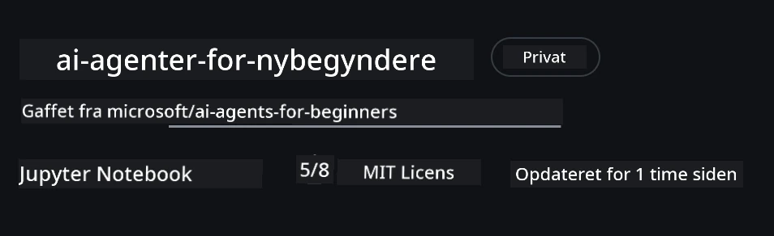
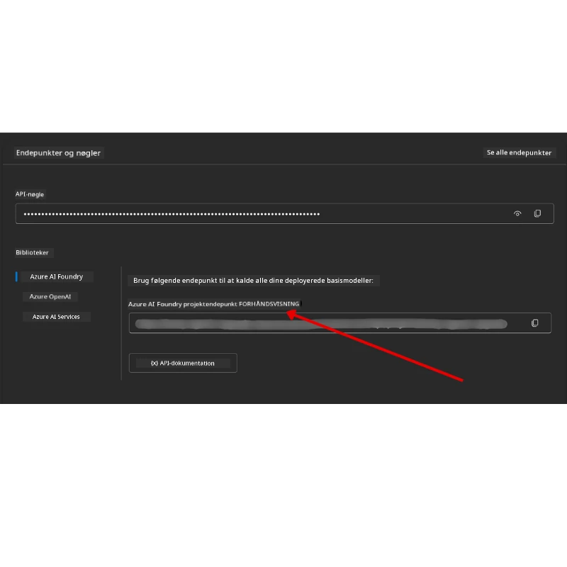

# Kursusopsætning

## Introduktion

Denne lektion dækker, hvordan du kører kodeeksemplerne i dette kursus.

## Slut dig til andre kursister og få hjælp

Før du begynder at klone dit repo, så slut dig til [AI Agents For Beginners Discord-kanalen](https://aka.ms/ai-agents/discord) for at få hjælp til opsætning, spørgsmål omkring kurset eller for at forbinde med andre kursister.

## Klon eller forgrene dette repo

For at komme i gang, venligst klon eller forgren GitHub-repositoriet. Dette vil skabe din egen version af kursusmaterialet, så du kan køre, teste og justere koden!

Dette kan gøres ved at klikke på linket til <a href="https://github.com/microsoft/ai-agents-for-beginners/fork" target="_blank">at forgrene repoen</a>

Du burde nu have din egen forgrenede version af dette kursus på følgende link:



### Shallow Clone (anbefalet til workshop / Codespaces)

  >Det fulde repository kan være stort (~3 GB), når du downloader hele historikken og alle filer. Hvis du kun deltager i workshoppen eller kun behøver nogle få lektionmapper, downloader en shallow clone (eller sparse clone) meget mindre.

#### Hurtig shallow clone – minimal historik, alle filer

Erstat `<your-username>` i nedenstående kommandoer med din fork URL (eller upstream URL, hvis du foretrækker det).

For kun at klone den seneste commit-historik (lille download):

```bash
git clone --depth 1 https://github.com/<your-username>/ai-agents-for-beginners.git
```

For at klone en specifik branch:

```bash
git clone --depth 1 --branch <branch-name> https://github.com/<your-username>/ai-agents-for-beginners.git
```

#### Delvis (sparse) clone — minimale blobs + kun udvalgte mapper

Dette bruger partial clone og sparse-checkout (kræver Git 2.25+ og anbefales at bruge moderne Git med partial clone support):

```bash
git clone --depth 1 --filter=blob:none --sparse https://github.com/<your-username>/ai-agents-for-beginners.git
```

Gå ind i repo-mappen:

```bash
cd ai-agents-for-beginners
```

Angiv derefter hvilke mapper du ønsker (eksemplet nedenfor viser to mapper):

```bash
git sparse-checkout set 00-course-setup 01-intro-to-ai-agents
```

Efter kloning og verifikation af filerne, hvis du kun behøver filerne og ønsker at frigive plads (ingen git-historik), så slet repository metadata (💀irreversibelt – du mister al Git-funktionalitet):

```bash
# zsh/bash
rm -rf .git
```

```powershell
# PowerShell
Remove-Item -Recurse -Force .git
```

#### Brug af GitHub Codespaces (anbefalet for at undgå lokale store downloads)

- Opret et nyt Codespace for dette repo via [GitHub UI](https://github.com/codespaces).  

- I terminalen i det nyligt oprettede codespace, kør en af shallow/sparse clone kommandoerne ovenfor for kun at hente de lektionmapper du har brug for ind i Codespace arbejdsområdet.
- Valgfrit: efter kloning inde i Codespaces, fjern .git for at frigive ekstra plads (se sletningskommandoerne ovenfor).
- Bemærk: Hvis du foretrækker at åbne repoen direkte i Codespaces (uden ekstra clone), vær opmærksom på at Codespaces vil konstruere devcontainer miljøet og stadig kan provisionere mere end du behøver.

#### Tips

- Udskift altid clone URL'en med din fork hvis du vil redigere/committe.
- Hvis du senere har brug for mere historik eller filer, kan du hente dem eller justere sparse-checkout til at inkludere flere mapper.

## Køre Koden

Dette kursus tilbyder en række Jupyter Notebooks, som du kan køre for at få praktisk erfaring med at bygge AI-agenter.

Kodeeksemplerne bruger **Microsoft Agent Framework (MAF)** med `FoundryChatClient`, der forbinder til **Microsoft Foundry Agent Service V2** (Responses API) gennem **Microsoft Foundry**.

Alle Python-notebooks er mærket `*-python-agent-framework.ipynb`.

## Krav

- Python 3.12+
  - **BEMÆRK**: Hvis du ikke har Python3.12 installeret, så sørg for at installere det. Opret derefter dit venv med python3.12 for at sikre at de korrekte versioner installeres fra requirements.txt filen.
  
    >Eksempel

    Opret Python venv mappe:

    ```bash
    python -m venv venv
    ```

    Aktiver derefter venv miljøet for:

    ```bash
    # zsh/bash
    source venv/bin/activate
    ```
  
    ```dos
    # Command Prompt for Windows
    venv\Scripts\activate
    ```

- .NET 10+: For kodeeksemplerne, der bruger .NET, sørg for at installere [.NET 10 SDK](https://dotnet.microsoft.com/download/dotnet/10.0) eller nyere. Tjek derefter din installerede .NET SDK version:

    ```bash
    dotnet --list-sdks
    ```

- **Azure CLI** — Påkrævet til autentifikation. Installer fra [aka.ms/installazurecli](https://aka.ms/installazurecli).
- **Azure abonnement** — For adgang til Microsoft Foundry og Microsoft Foundry Agent Service.
- **Microsoft Foundry Projekt** — Et projekt med en udrullet model (f.eks. `gpt-5-mini`). Se [Trin 1](#trin-1-opret-et-microsoft-foundry-projekt) nedenfor.

Vi har inkluderet en `requirements.txt` fil i roden af dette repository, som indeholder alle nødvendige Python-pakker for at køre kodeeksemplerne.

Du kan installere dem ved at køre følgende kommando i din terminal i roden af repositoryet:

```bash
pip install -r requirements.txt
```

Vi anbefaler at oprette et Python virtuelt miljø for at undgå konflikter og problemer.

## Opsæt VSCode

Sørg for, at du bruger den rigtige version af Python i VSCode.


## Opsæt Microsoft Foundry og Microsoft Foundry Agent Service

### Trin 1: Opret et Microsoft Foundry Projekt

Du skal bruge et Microsoft Foundry **hub** og **projekt** med en udrullet model for at køre notebooks.

1. Gå til [ai.azure.com](https://ai.azure.com) og log ind med din Azure-konto.
2. Opret en **hub** (eller brug en eksisterende). Se: [Hub ressourcer oversigt](https://learn.microsoft.com/azure/ai-foundry/concepts/ai-resources).
3. Inde i hubben, opret et **projekt**.
4. Udrul en model (f.eks. `gpt-5-mini`) fra **Models + Endpoints** → **Deploy model**.

### Trin 2: Hent dit projekt-endpoint og modeldeploymentsnavn

Fra dit projekt i Microsoft Foundry portalen:

- **Projekt-endpoint** — Gå til **Oversigt** siden og kopier endpoint URL'en.



- **Model Deployment navn** — Gå til **Models + Endpoints**, vælg din udrullede model, og noter **Deployment name** (f.eks. `gpt-5-mini`).

### Trin 3: Log ind i Azure med `az login`

De fleste notebooks autentificerer gennem din **Azure CLI login** — med `AzureCliCredential` eller `DefaultAzureCredential` (begge henter din `az login` session) fra `azure-identity` pakken — så de behøver ikke API nøgler. Nogle få lektioner og valgfrie integrationer bruger API nøgler; tjek hver lektion forudkrav for eventuelle ekstra miljøvariabler. Dette kræver, at du er logget ind via Azure CLI.

1. **Installer Azure CLI** hvis ikke allerede: [aka.ms/installazurecli](https://aka.ms/installazurecli)

2. **Log ind** ved at køre:

    ```bash
    az login
    ```

    Eller hvis du er i et fjern-/Codespace-miljø uden browser:

    ```bash
    az login --use-device-code
    ```

3. **Vælg dit abonnement** hvis du bliver bedt om det — vælg det der indeholder dit Foundry projekt.

4. **Bekræft** at du er logget ind:

    ```bash
    az account show
    ```

> **Hvorfor `az login`?** Notebooks autentificerer med `AzureCliCredential` (eller `DefaultAzureCredential`, som også henter din Azure CLI login) fra `azure-identity` pakken. Det betyder, at din Azure CLI session giver legitimationsoplysningerne — ingen API nøgler eller hemmeligheder i din `.env` fil. Dette er en [sikkerhedsbedste praksis](https://learn.microsoft.com/azure/developer/ai/keyless-connections).

### Trin 4: Opret din `.env` fil

Kopier eksempel-filen:

```bash
# zsh/bash
cp .env.example .env
```

```powershell
# PowerShell
Copy-Item .env.example .env
```

Åbn `.env` og udfyld disse to værdier:

```env
AZURE_AI_PROJECT_ENDPOINT=https://<your-project>.services.ai.azure.com/api/projects/<your-project-id>
AZURE_AI_MODEL_DEPLOYMENT_NAME=gpt-5-mini
```

| Variabel | Hvor findes den |
|----------|-----------------|
| `AZURE_AI_PROJECT_ENDPOINT` | Foundry portalen → dit projekt → **Oversigt** siden |
| `AZURE_AI_MODEL_DEPLOYMENT_NAME` | Foundry portalen → **Models + Endpoints** → navnet på din udrullede model |

Det er det for de fleste lektioner! Notebooks vil autentificere automatisk via din `az login` session.

### Trin 5: Installer Python-afhængigheder

```bash
pip install -r requirements.txt
```

Vi anbefaler at køre dette inde i det virtuelle miljø, du oprettede tidligere.

## Valgfri opsætning: Azure AI Search (Lektioner 5 og 16)

Lektion 5 (Agentic RAG) og Lektion 16 notebooks kører ud af boksen med en **in-memory knowledge base** — ingen ekstra Azure ressourcer nødvendig. Hvis du ønsker at bakke dem op med et rigtigt **Azure AI Search** indeks, så bemærk at **Lektion 16 notebogen i øjeblikket bruger nøglebaseret autentifikation**: den skifter fra in-memory søgning til Azure AI Search kun når **både** `AZURE_SEARCH_SERVICE_ENDPOINT` **og** `AZURE_SEARCH_API_KEY` er sat, og bliver ellers ved med in-memory søgning — så for at køre den mod et rigtigt indeks skal du også sætte admin-nøglen. Nøglefri autentifikation med Microsoft Entra ID (RBAC) er den anbefalede tilgang til dit eget produktionskode, og passer til `az login` flowet brugt i resten af kurset.

RBAC-trinene nedenfor gælder for opsætnings-guide eksemplerne og din egen kode. De aktiverer ikke nøglefri autentifikation i Lektion 16 notebogen; Lektion 16 kræver stadig både endpoint og admin-nøgle for at bruge Azure AI Search.

1. **Aktivér rollebaseret adgang** på din search service:

    ```bash
    az search service update --name <service-name> --resource-group <resource-group> --auth-options aadOrApiKey
    ```

2. **Tildel dig selv de nødvendige roller** (oprettelse/indlæsning af indeks og forespørgsler):

    ```bash
    az role assignment create --assignee <your-user-or-principal-id> --role "Search Service Contributor" --scope $(az search service show -g <resource-group> -n <service-name> --query id -o tsv)
    az role assignment create --assignee <your-user-or-principal-id> --role "Search Index Data Contributor" --scope $(az search service show -g <resource-group> -n <service-name> --query id -o tsv)
    ```

3. **Tilføj endpoint** til din `.env` fil:

| Variabel | Hvor findes den |
|----------|-----------------|
| `AZURE_SEARCH_SERVICE_ENDPOINT` | Azure portalen → din **Azure AI Search** ressource → **Oversigt** → URL |
| `AZURE_SEARCH_API_KEY` | Påkrævet (sammen med endpoint) for at aktivere Azure AI Search i Lektion 16 notebogen, som bruger nøglebaseret autentifikation. Azure portalen → **Indstillinger** → **Nøgler** → primær admin-nøgle |

> **Hvorfor nøglefri?** Admin-nøgler giver fuld skriveadgang til din søgetjeneste og kan lække via `.env` filer. Med RBAC bruges din `az login` identitet i stedet — samme nøglefri Entra ID mønster som kursus-notebooks bruger (via `AzureCliCredential` / `DefaultAzureCredential`). Se [Connect to Azure AI Search using roles](https://learn.microsoft.com/azure/search/search-security-rbac).

Se [Azure AI Search opsætningsguide](./AzureSearch.md) for fulde indeksoprettelseseksempler i Python og .NET.

## Ekstra opsætning for lektioner der kalder Azure OpenAI direkte (Lektioner 6 og 8)

Nogle notebooks i lektion 6 og 8 kalder **Azure OpenAI** direkte (ved brug af **Responses API**) i stedet for gennem et Microsoft Foundry projekt. Disse eksempler brugte tidligere GitHub Models, som er udfaset og ikke understøtter Responses API. Tilføj disse variabler til din `.env` fil:

| Variabel | Hvor findes den |
|----------|-----------------|
| `AZURE_OPENAI_ENDPOINT` | Azure portalen → din **Azure OpenAI** ressource → **Nøgler og Endpoint** → Endpoint (f.eks. `https://<your-resource>.openai.azure.com`) |
| `AZURE_OPENAI_DEPLOYMENT` | Navnet på din udrullede model (f.eks. `gpt-5-mini`) som understøtter Responses API |
| `AZURE_OPENAI_API_KEY` | Valgfri — kun hvis du bruger nøglebaseret autentifikation i stedet for `az login` / Entra ID |

> Responses API bruger den stabile `/openai/v1/` endpoint, så ingen `api-version` er nødvendig. Log ind med `az login` for at bruge nøglefri Entra ID autentifikation.

## Alternativ udbyder: MiniMax (OpenAI-kompatibel)

[MiniMax](https://platform.minimaxi.com/) tilbyder store kontekstmodeller (op til 204K tokens) gennem en OpenAI-kompatibel API. Da Microsoft Agent Frameworks `OpenAIChatClient` fungerer med alle OpenAI-kompatible endpoints, kan du bruge MiniMax som en plug-and-play erstatning til lektioner der bruger `OpenAIChatClient`.

Tilføj disse variabler til din `.env` fil:

| Variabel | Hvor findes den |
|----------|-----------------|
| `MINIMAX_API_KEY` | [MiniMax Platform](https://platform.minimaxi.com/) → API Nøgler |
| `MINIMAX_BASE_URL` | Brug `https://api.minimax.io/v1` (standardværdi) |
| `MINIMAX_MODEL_ID` | Navn på model til brug (f.eks. `MiniMax-M3`) |

**Eksempelmodeller**: `MiniMax-M3` (anbefalet), `MiniMax-M2.7`, `MiniMax-M2.7-highspeed` (hurtigere svar). Modelnavne og adgang kan ændre sig over tid, og adgang til en given model kan afhænge af din konto.

Kodeeksemplerne, der bruger `OpenAIChatClient` (f.eks. Lektion 14 hotelbooking workflow) vil automatisk opdage og bruge din MiniMax konfiguration, når `MINIMAX_API_KEY` er sat.


## Alternativ Udbyder: Foundry Local (Kør Modeller Lokalt)

[Foundry Local](https://foundrylocal.ai) er en letvægts runtime, der downloader, administrerer og leverer sprogmodeller **helt på din egen maskine** via en OpenAI-kompatibel API — ingen sky nødvendig.

Fordi Microsoft Agent Framework's `OpenAIChatClient` fungerer med enhver OpenAI-kompatibel endpoint, er Foundry Local et drop-in lokalt alternativ til Azure OpenAI.

**1. Installer Foundry Local**

```bash
# Windows
winget install Microsoft.FoundryLocal

# macOS
brew install foundrylocal
```

**2. Download og kør en model** (dette starter også den lokale service):

```bash
foundry model list          # se tilgængelige modeller
foundry model run phi-4-mini
```

**3. Installer Python SDK'en**, der bruges til at opdage den lokale endpoint:

```bash
pip install foundry-local-sdk
```

**4. Peg Microsoft Agent Framework mod din lokale model:**

```python
from foundry_local import FoundryLocalManager
from agent_framework.openai import OpenAIChatClient

# Downloader (hvis nødvendigt) og server modellen lokalt, derefter finder endpoint/porten.
manager = FoundryLocalManager("phi-4-mini")

chat_client = OpenAIChatClient(
    base_url=manager.endpoint,      # f.eks. http://localhost:<port>/v1
    api_key=manager.api_key,        # altid "ikke-påkrævet" for Foundry Local
    model_id=manager.get_model_info("phi-4-mini").id,
)

agent = chat_client.as_agent(
    name="LocalAgent",
    instructions="You are a helpful assistant running fully on-device.",
)
```

> **Note:** Foundry Local eksponerer en OpenAI-kompatibel **Chat Completions** endpoint. Brug den til lokal udvikling og offline scenarier. For det fulde **Responses API** funktionssæt (tilstandsholdende samtaler osv.), brug Azure OpenAI eller et Microsoft Foundry-projekt.

## Yderligere Opsætning til Lektion 8 (Bing Grounding Workflow)

Den betingede workflow-notesbog i lektion 8 bruger **Bing grounding** via Microsoft Foundry. Hvis du planlægger at køre det eksempel, tilføj denne variabel til din `.env`-fil:

| Variabel | Hvor du finder den |
|----------|-------------------|
| `BING_CONNECTION_ID` | Microsoft Foundry-portal → dit projekt → **Management** → **Connected resources** → din Bing-forbindelse → kopier forbindelses-ID'et |

## Fejlfinding

### SSL-certifikatverifikationsfejl på macOS

Hvis du bruger macOS og støder på en fejl som:

```plaintext
ssl.SSLCertVerificationError: [SSL: CERTIFICATE_VERIFY_FAILED] certificate verify failed: self-signed certificate in certificate chain
```

Dette er et kendt problem med Python på macOS, hvor systemets SSL-certifikater ikke automatisk godkendes. Prøv følgende løsninger i rækkefølge:

**Mulighed 1: Kør Python's Install Certificates-script (anbefalet)**

```bash
# Erstat 3.XX med din installerede Python-version (f.eks. 3.12 eller 3.13):
/Applications/Python\ 3.XX/Install\ Certificates.command
```

**Mulighed 2: Brug `connection_verify=False` i din notesbog (kun for GitHub Models-notesbøger)**

I Lektion 6-notesbogen (`06-building-trustworthy-agents/code_samples/06-system-message-framework.ipynb`) er en kommenteret løsning allerede inkluderet. Fjern kommentaren på `connection_verify=False`, når du støder på certifikatfejl:

```python
client = ChatCompletionsClient(
    endpoint=endpoint,
    credential=AzureKeyCredential(token),
    connection_verify=False,  # Deaktiver SSL-verifikation, hvis du støder på certifikatfejl
)
```

> **⚠️ Advarsel:** Deaktivering af SSL-verifikation (`connection_verify=False`) reducerer sikkerheden ved at springe certifikatvalidering over. Brug dette kun som en midlertidig løsning i udviklingsmiljøer. Aldrig i produktion.

**Mulighed 3: Installer og brug `truststore`**

```bash
pip install truststore
```

Tilføj derefter følgende øverst i din notesbog eller script, før du laver nogen netværkskald:

```python
import truststore
truststore.inject_into_ssl()
```

## Sidder du Fast?

Hvis du har problemer med at køre denne opsætning, hop ind i vores <a href="https://discord.gg/kzRShWzttr" target="_blank">Azure AI Community Discord</a> eller <a href="https://github.com/microsoft/ai-agents-for-beginners/issues?WT.mc_id=academic-105485-koreyst" target="_blank">opret en sag</a>.

## Næste Lektion

Du er nu klar til at køre koden for dette kursus. God fornøjelse med at lære mere om AI-agenternes verden! 

[Introduktion til AI-agenter og Agent Use Cases](../01-intro-to-ai-agents/README.md)

---

<!-- CO-OP TRANSLATOR DISCLAIMER START -->
**Ansvarsfraskrivelse**:
Dette dokument er blevet oversat ved hjælp af AI-oversættelsestjenesten [Co-op Translator](https://github.com/Azure/co-op-translator). Selvom vi bestræber os på nøjagtighed, skal du være opmærksom på, at automatiserede oversættelser kan indeholde fejl eller unøjagtigheder. Det originale dokument på dets oprindelige sprog bør betragtes som den autoritative kilde. For kritisk information anbefales professionel menneskelig oversættelse. Vi påtager os intet ansvar for misforståelser eller fejltolkninger, der opstår som følge af brugen af denne oversættelse.
<!-- CO-OP TRANSLATOR DISCLAIMER END -->