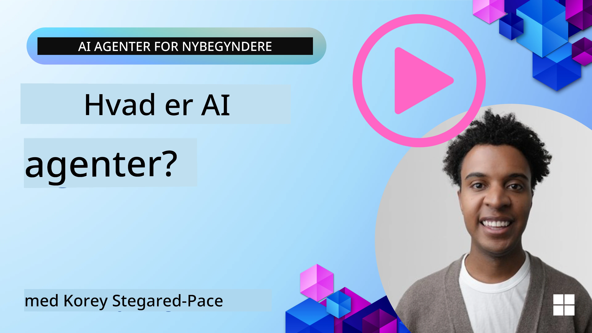
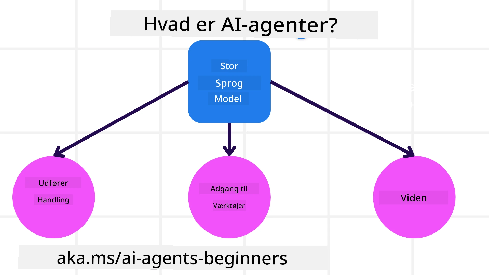
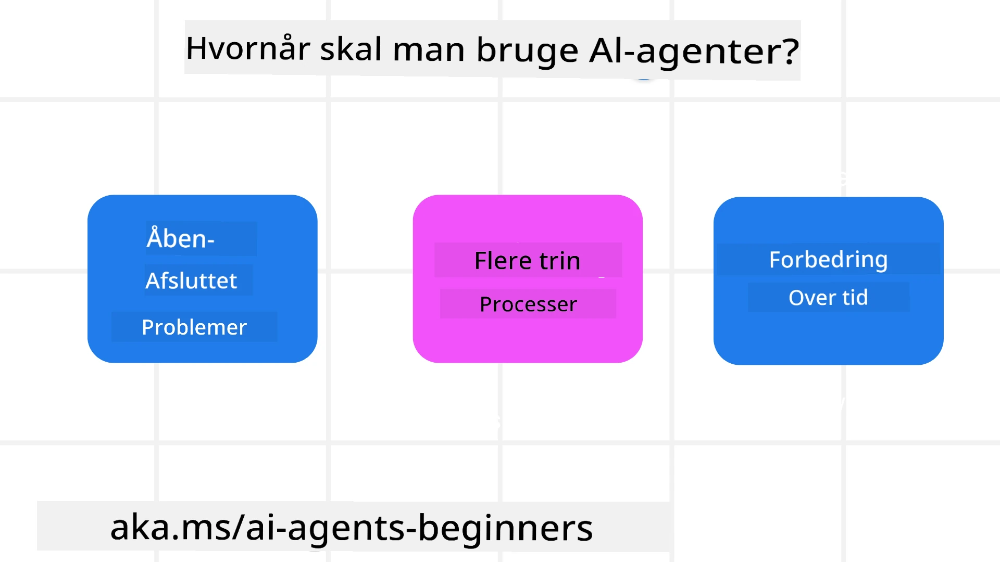

> _(Klik på billedet ovenfor for at se videoen af denne lektion)_

# Introduktion til AI-agenter og anvendelsestilfælde

Velkommen til kurset "AI Agents for Beginners"! Dette kursus giver grundlæggende viden og anvendte eksempler til opbygning af AI-agenter.

Deltag i <a href="https://discord.gg/kzRShWzttr" target="_blank">Azure AI Discord-fællesskab</a> for at møde andre kursister og udviklere af AI-agenter og stille spørgsmål om dette kursus.

For at starte dette kursus begynder vi med at få en bedre forståelse af, hvad AI-agenter er, og hvordan vi kan bruge dem i de applikationer og arbejdsgange, vi opbygger.

## Introduktion

Denne lektion dækker:

- Hvad er AI-agenter, og hvilke forskellige typer agenter findes der?
- Hvilke anvendelsestilfælde er bedst til AI-agenter, og hvordan kan de hjælpe os?
- Hvad er nogle af de grundlæggende byggeblokke, når man designer agentiske løsninger?

## Læringsmål
Efter at have gennemført denne lektion bør du kunne:

- Forstå koncepter omkring AI-agenter og hvordan de adskiller sig fra andre AI-løsninger.
- Anvende AI-agenter mest effektivt.
- Designe agentiske løsninger produktivt for både brugere og kunder.

## Definition af AI-agenter og typer af AI-agenter

### Hvad er AI-agenter?

AI-agenter er **systemer**, der gør det muligt for **Store sprogmodeller(LLMs)** at **udføre handlinger** ved at udvide deres kapaciteter ved at give LLMs **adgang til værktøjer** og **viden**.

Lad os bryde denne definition ned i mindre dele:

- **System** - Det er vigtigt at tænke på agenter ikke som blot en enkelt komponent, men som et system af mange komponenter. På det grundlæggende niveau er komponenterne i en AI-agent:
  - **Environment** - Det definerede rum, hvor AI-agenten opererer. For eksempel, hvis vi havde en rejsebookings-AI-agent, kunne miljøet være rejsebookingsystemet, som AI-agenten bruger til at fuldføre opgaver.
  - **Sensors** - Miljøer har information og giver feedback. AI-agenter bruger sensorer til at indsamle og fortolke denne information om den nuværende tilstand i miljøet. I eksemplet med rejsebookingsagenten kan rejsebookingsystemet give oplysninger såsom hoteltilgængelighed eller flypriser.
  - **Actuators** - Når AI-agenten modtager den nuværende tilstand af miljøet, bestemmer agenten for den aktuelle opgave, hvilken handling der skal udføres for at ændre miljøet. For rejsebookingsagenten kan det være at booke et tilgængeligt værelse for brugeren.

**Store sprogmodeller** - Konceptet med agenter eksisterede før skabelsen af LLMs. Fordelen ved at bygge AI-agenter med LLMs er deres evne til at fortolke menneskesprog og data. Denne evne gør det muligt for LLMs at fortolke miljøinformation og definere en plan for at ændre miljøet.

**Udføre handlinger** - Uden for AI-agent systemer er LLMs begrænset til situationer, hvor handlingen er at generere indhold eller information baseret på en brugers prompt. Inde i AI-agent systemer kan LLMs fuldføre opgaver ved at fortolke brugerens anmodning og bruge værktøjer, der er tilgængelige i deres miljø.

**Adgang til værktøjer** - Hvilke værktøjer LLM'en har adgang til, defineres af 1) det miljø, den opererer i, og 2) udvikleren af AI-agenten. For vores rejseagent-eksempel er agentens værktøjer begrænset af de operationer, der er tilgængelige i bookingsystemet, og/eller udvikleren kan begrænse agentens værktøjsadgang til fly.

**Hukommelse+Viden** - Hukommelse kan være kortvarig i konteksten af samtalen mellem brugeren og agenten. På længere sigt, udover den information, der leveres af miljøet, kan AI-agenter også hente viden fra andre systemer, tjenester, værktøjer og endda andre agenter. I rejseagent-eksemplet kunne denne viden være oplysninger om brugerens rejsepræferencer, der er placeret i en kundedatabase.

### De forskellige typer agenter

Nu hvor vi har en generel definition af AI-agenter, lad os se på nogle specifikke agenttyper og hvordan de kunne anvendes på en rejsebookings-AI-agent.

| **Agenttype**                | **Beskrivelse**                                                                                                                       | **Eksempel**                                                                                                                                                                                                                   |
| ----------------------------- | ------------------------------------------------------------------------------------------------------------------------------------- | ----------------------------------------------------------------------------------------------------------------------------------------------------------------------------------------------------------------------------- |
| **Simple refleksagenter**      | Udfører umiddelbare handlinger baseret på foruddefinerede regler.                                                                                  | Rejseagent fortolker konteksten af e-mailen og videresender rejseklager til kundeservice.                                                                                                                          |
| **Model-baserede refleksagenter** | Udfører handlinger baseret på en model af verden og ændringer i den model.                                                              | Rejseagent prioriterer ruter med betydelige prisændringer baseret på adgang til historiske prisdata.                                                                                                             |
| **Målorienterede agenter**         | Opretter planer for at nå specifikke mål ved at fortolke målet og bestemme handlinger for at nå det.                                  | Rejseagent booker en rejse ved at bestemme nødvendige rejsearrangementer (bil, offentlig transport, fly) fra den nuværende placering til destinationen.                                                                                |
| **Nyttebaserede agenter**      | Tager hensyn til præferencer og vægter kompromiser numerisk for at bestemme, hvordan mål opnås.                                               | Rejseagent maksimerer nytte ved at afveje bekvemmelighed mod pris ved booking af rejser.                                                                                                                                          |
| **Lærende agenter**           | Forbedres over tid ved at reagere på feedback og justere handlinger i overensstemmelse hermed.                                                        | Rejseagent forbedres ved at bruge kundefeedback fra efter-rejsen-undersøgelser til at foretage justeringer af fremtidige bookinger.                                                                                                               |
| **Hierarkiske agenter**       | Har flere agenter i et lagdelt system, hvor højere-niveau agenter opdeler opgaver i underopgaver for lavere-niveau agenter at udføre. | Rejseagent annullerer en rejse ved at opdele opgaven i underopgaver (for eksempel annullering af specifikke bookinger) og få lavere-niveau agenter til at fuldføre dem, som rapporterer tilbage til den højere-niveau agent.                                     |
| **Multi-agent-systemer (MAS)** | Agenter fuldfører opgaver uafhængigt, enten i samarbejde eller konkurrence.                                                           | Samarbejdende: Flere agenter booker specifikke rejsetjenester såsom hoteller, fly og underholdning. Konkurrerende: Flere agenter administrerer og konkurrerer om en delt hotelbookingskalender for at booke kunder ind på hotellet. |

## Hvornår man bruger AI-agenter

I det tidligere afsnit brugte vi rejseagent-tilfældet til at forklare, hvordan de forskellige typer agenter kan bruges i forskellige scenarier for rejsebooking. Vi vil fortsætte med at bruge denne applikation gennem kurset.

Lad os se på de typer anvendelsestilfælde, som AI-agenter er bedst egnet til:

- **Åbne problemstillinger** - tillader LLM'en at bestemme nødvendige skridt for at fuldføre en opgave, fordi det ikke altid kan være hårdkodet i en arbejdsgang.
- **Flertrinsprocesser** - opgaver, der kræver et vist kompleksitetsniveau, hvor AI-agenten skal bruge værktøjer eller information over flere omgange i stedet for enkelthentning.  
- **Forbedring over tid** - opgaver, hvor agenten kan forbedre sig over tid ved at modtage feedback fra enten sit miljø eller brugere for at levere bedre nytte.

Vi gennemgår flere overvejelser ved brug af AI-agenter i lektionen om at bygge troværdige AI-agenter.

## Grundlæggende om agentiske løsninger

### Agentudvikling

Det første skridt i designet af et AI-agent system er at definere værktøjer, handlinger og adfærd. I dette kursus fokuserer vi på at bruge **Azure AI Agent Service** til at definere vores agenter. Den tilbyder funktioner som:

- Udvalg af åbne modeller såsom OpenAI, Mistral og Llama
- Brug af licenserede data gennem leverandører som Tripadvisor
- Brug af standardiserede OpenAPI 3.0-værktøjer

### Agentiske mønstre

Kommunikation med LLMs sker gennem prompts. Givet AI-agenters semi-autonome natur er det ikke altid muligt eller nødvendigt manuelt at give LLM'en en ny prompt efter en ændring i miljøet. Vi bruger **agentiske mønstre**, der gør det muligt at give LLM'en prompts over flere trin på en mere skalerbar måde.

Dette kursus er opdelt i nogle af de nuværende populære agentiske mønstre.

### Agentiske rammer

Agentiske rammer giver udviklere mulighed for at implementere agentiske mønstre gennem kode. Disse rammer tilbyder skabeloner, plugins og værktøjer til bedre samarbejde mellem AI-agenter. Disse fordele giver muligheder for bedre observerbarhed og fejlfinding af AI-agent systemer.

I dette kursus vil vi udforske Microsoft Agent Framework (MAF) til opbygning af produktionsklare AI-agenter.

## Eksempelkode

- Python: [Agent-rammeværk](./code_samples/01-python-agent-framework.ipynb)
- .NET: [Agent-rammeværk](./code_samples/01-dotnet-agent-framework.md)

## Har du flere spørgsmål om AI-agenter?

Deltag i [Microsoft Foundry Discord](https://aka.ms/ai-agents/discord) for at mødes med andre kursister, deltage i kontortid og få besvaret dine spørgsmål om AI-agenter.

## Forrige lektion

[Kursusopsætning](../00-course-setup/README.md)

## Næste lektion

[Udforskning af agentiske rammer](../02-explore-agentic-frameworks/README.md)

---

<!-- CO-OP TRANSLATOR DISCLAIMER START -->
**Ansvarsfraskrivelse**:
Dette dokument er blevet oversat ved hjælp af AI-oversættelsestjenesten [Co-op Translator](https://github.com/Azure/co-op-translator). Selvom vi bestræber os på at være præcise, bedes du være opmærksom på, at automatiske oversættelser kan indeholde fejl eller unøjagtigheder. Det originale dokument i dets oprindelige sprog bør betragtes som den autoritative kilde. For kritiske oplysninger anbefales en professionel menneskelig oversættelse. Vi kan ikke holdes ansvarlige for eventuelle misforståelser eller fejltolkninger, der opstår som følge af brugen af denne oversættelse.
<!-- CO-OP TRANSLATOR DISCLAIMER END -->