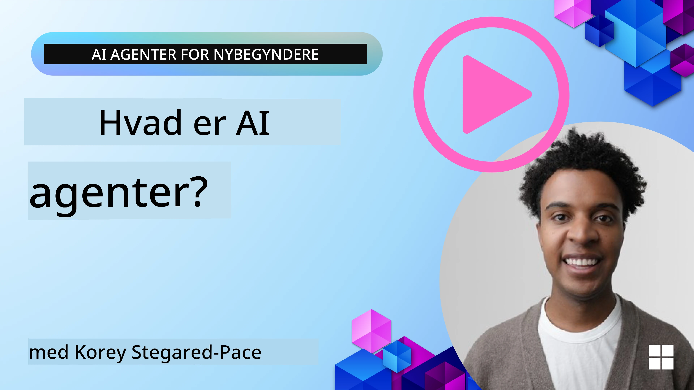
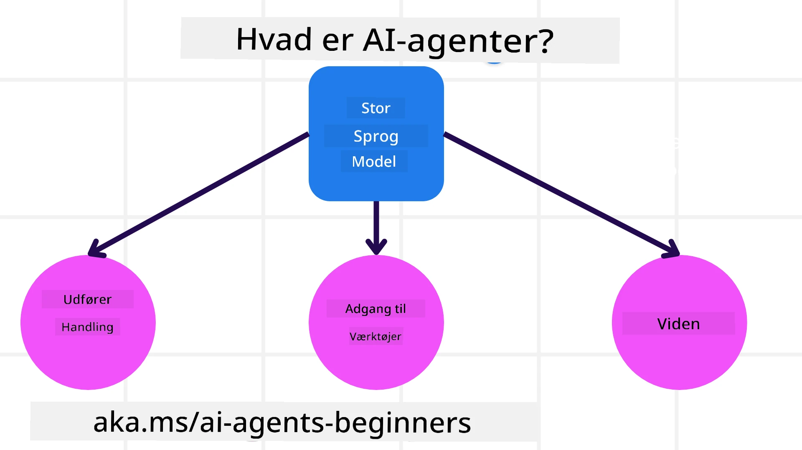
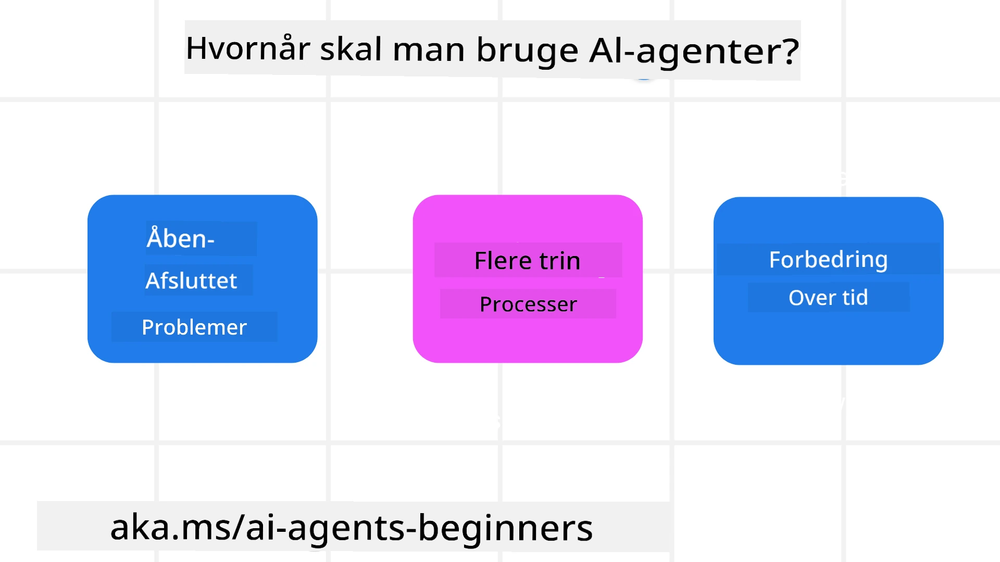

> _(Klik på billedet ovenfor for at se videoen til denne lektion)_

# Introduktion til AI-agenter og agentbrugssager

Velkommen til **AI-agenter for begyndere**-kurset! Dette kursus giver dig grundlæggende viden — og rigtigt fungerende kode — for at begynde at bygge AI-agenter fra bunden.

Kom og sig hej i <a href="https://discord.gg/kzRShWzttr" target="_blank">Azure AI Discord Community</a> — det er fyldt med lærende og AI-byggere, som gerne svarer på spørgsmål.

Før vi går i gang med at bygge, lad os sikre, at vi faktisk forstår, hvad en AI-agent *er*, og hvornår det giver mening at bruge en.

---

## Introduktion

Denne lektion dækker:

- Hvad AI-agenter er, og de forskellige typer, der findes
- Hvilke slags opgaver AI-agenter bedst egner sig til
- De centrale byggesten, du bruger, når du designer en agentløsning

## Læringsmål

Ved slutningen af denne lektion bør du kunne:

- Forklare, hvad en AI-agent er, og hvordan den adskiller sig fra en almindelig AI-løsning
- Vide, hvornår man skal anvende en AI-agent (og hvornår ikke)
- Skitsere et grundlæggende agent-løsningsdesign til et virkeligt problem

---

## Definition af AI-agenter og typer af AI-agenter

### Hvad er AI-agenter?

Her er en simpel måde at tænke på det:

> **AI-agenter er systemer, der lader store sprogmodeller (LLMs) rent faktisk *gøre ting* — ved at give dem værktøjer og viden til at handle på verden, ikke kun svare på prompts.**

Lad os uddybe det lidt:

- **System** — En AI-agent er ikke bare én ting. Det er en samling dele, som arbejder sammen. I sin kerne har enhver agent tre dele:
  - **Miljø** — Det rum, agenten arbejder i. For en rejsebookingsagent ville dette være selve bookingsystemet.
  - **Sensorer** — Hvordan agenten aflæser den aktuelle tilstand i sit miljø. Vores rejseagent kunne tjekke hoteltilgængelighed eller flypriser.
  - **Aktuatorer** — Hvordan agenten handler. Rejseagenten kunne booke et værelse, sende en bekræftelse eller annullere en reservation.

- **Store sprogmodeller** — Agenter fandtes før LLM'er, men LLM'er er det, der gør moderne agenter så kraftfulde. De kan forstå naturligt sprog, ræsonnere om kontekst og omsætte en vag brugerforespørgsel til en konkret handlingsplan.

- **Udføre handlinger** — Uden et agentsystem genererer en LLM blot tekst. I et agentsystem kan LLM faktisk *udføre* trin — søge i en database, kalde et API, sende en besked.

- **Adgang til værktøjer** — Hvilke værktøjer agenten kan bruge, afhænger af (1) miljøet den kører i, og (2) hvad udvikleren har valgt at give den. En rejseagent kan måske søge flyrejser, men ikke redigere kundedata — det handler om, hvad der er koblet til.

- **Hukommelse + viden** — Agenter kan have korttidshukommelse (den aktuelle samtale) og langtidshukommelse (en kundedatabase, tidligere interaktioner). Rejseagenten kan "huske", at du foretrækker vinduesplads.

---

### De forskellige typer AI-agenter

Ikke alle agenter er bygget på samme måde. Her er en oversigt over hovedtyperne, med en rejsebookingsagent som eksempel:

| **Agenttype** | **Hvad den gør** | **Rejseagenteksempel** |
|---|---|---|
| **Simple refleks-agenter** | Følger hårdkodede regler — ingen hukommelse, ingen planlægning. | Ser en klage-e-mail → videresender den til kundeservice. Det er det. |
| **Modelbaserede refleks-agenter** | Har en intern model af verden og opdaterer den, når tingene ændrer sig. | Holder øje med historiske flypriser og markerer ruter, der pludselig er dyre. |
| **Målorienterede agenter** | Har et mål og finder ud af, hvordan man når det trin for trin. | Booker en fuld rejse (fly, bil, hotel) fra din nuværende placering til destinationen. |
| **Nyttemaksimerende agenter** | Finder ikke bare *en* løsning — finder den *bedste* ved at afveje kompromiser. | Balancerer pris mod bekvemmelighed for at finde den rejse, der scorer højest på dine præferencer. |
| **Læringsagenter** | Bliver bedre over tid ved at lære af feedback. | Justerer fremtidige bookingforslag baseret på spørgeskemasvar efter turen. |
| **Hierarkiske agenter** | En overordnet agent opdeler arbejdet i underopgaver og delegerer til lavere niveau-agent. | En "annuller rejse"-anmodning opdeles i: annuller fly, annuller hotel, annuller biludlejning — hver håndteres af en underagent. |
| **Multi-agent systemer (MAS)** | Flere uafhængige agenter arbejder sammen (eller konkurrerer). | Samarbejdende: separate agenter håndterer hoteller, fly og underholdning. Konkurrerende: flere agenter kæmper om at fylde hotelværelser til den bedste pris. |

---

## Hvornår skal man bruge AI-agenter

Bare fordi du *kan* bruge en AI-agent, betyder det ikke altid, at du *skal*. Her er situationerne, hvor agenter virkelig udmærker sig:

- **Åbne problemer** — Når trinene til at løse et problem ikke kan forprogrammeres. Du har brug for, at LLM'en dynamisk finder vejen.
- **Flertrinsprocesser** — Opgaver, der kræver brug af værktøjer over flere omgange, ikke kun et enkelt opslag eller generering.
- **Forbedring over tid** — Når du vil have systemet til at blive klogere baseret på brugertilbagemeldinger eller miljøsignaler.

Vi vil dykke dybere ned i, hvornår (og hvornår *ikke*) man skal bruge AI-agenter i lektionen **Byg troværdige AI-agenter** senere i kurset.

---

## Grundlæggende om agentløsninger

### Agentudvikling

Det første, du gør, når du bygger en agent, er at definere *hvad den kan gøre* — dens værktøjer, handlinger og adfærd.

I dette kursus bruger vi **Azure AI Agent Service** som vores primære platform. Den understøtter:

- Modeller fra leverandører som OpenAI, Mistral og Meta (Llama)
- Licenserede data fra leverandører som Tripadvisor
- Standardiserede OpenAPI 3.0-værktøjsdefinitioner

### Agentmønstre

Du kommunikerer med LLM'er via prompts. Med agenter kan du ikke altid håndbygge hver prompt manuelt — agenten skal handle over mange trin. Her kommer **Agentmønstre** ind i billedet. De er genanvendelige strategier for prompting og orkestrering af LLM'er på en mere skalerbar og pålidelig måde.

Dette kursus er struktureret omkring de mest almindelige og nyttige agentmønstre.

### Agent-rammer

Agent-rammer giver udviklere færdige skabeloner, værktøjer og infrastruktur til at bygge agenter. De gør det nemmere at:

- Koble værktøjer og kapabiliteter sammen
- Observere, hvad agenten gør (og fejlfinde, når noget går galt)
- Samarbejde på tværs af flere agenter

I dette kursus fokuserer vi på **Microsoft Agent Framework (MAF)** til at bygge produktionsklare agenter.

---

## Kodeeksempler

Klar til at se det i praksis? Her er kodeeksemplerne til denne lektion:

- 🐍 Python: [Agent Framework](./code_samples/01-python-agent-framework.ipynb)
- 🔷 .NET: [Agent Framework](./code_samples/01-dotnet-agent-framework.md)

---

## Har du spørgsmål?

Deltag i [Microsoft Foundry Discord](https://discord.com/invite/ATgtXmAS5D) for at møde andre lærende, deltage i kontortid og få svar på dine AI-agent spørgsmål fra fællesskabet.

---

## Forrige lektion

[Opsætning af kursus](../00-course-setup/README.md)

## Næste lektion

[Udforskning af agent-rammer](../02-explore-agentic-frameworks/README.md)

---

<!-- CO-OP TRANSLATOR DISCLAIMER START -->
**Ansvarsfraskrivelse**:
Dette dokument er blevet oversat ved hjælp af AI-oversættelsestjenesten [Co-op Translator](https://github.com/Azure/co-op-translator). Selvom vi bestræber os på nøjagtighed, skal du være opmærksom på, at automatiserede oversættelser kan indeholde fejl eller unøjagtigheder. Det originale dokument på dets oprindelige sprog bør betragtes som den autoritative kilde. For kritisk information anbefales professionel menneskelig oversættelse. Vi påtager os intet ansvar for misforståelser eller fejltolkninger, der opstår som følge af brugen af denne oversættelse.
<!-- CO-OP TRANSLATOR DISCLAIMER END -->