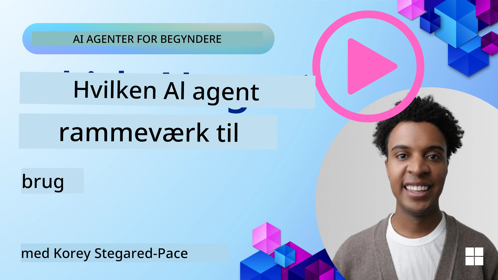

[](https://youtu.be/ODwF-EZo_O8?si=1xoy_B9RNQfrYdF7)

> _(Klik på billedet ovenfor for at se videoen til denne lektion)_

# Udforsk AI-agentrammer

AI-agentrammer er softwareplatforme designet til at forenkle oprettelse, udrulning og styring af AI-agent(er). Disse rammer giver udviklere færdigbyggede komponenter, abstraktioner og værktøjer, der strømliner udviklingen af komplekse AI-systemer.

Disse rammer hjælper udviklere med at fokusere på de unikke aspekter af deres applikationer ved at tilbyde standardiserede tilgange til almindelige udfordringer i udvikling af AI-agenter. De forbedrer skalerbarhed, tilgængelighed og effektivitet i opbygningen af AI-systemer.

## Introduktion 

Denne lektion vil dække:

- Hvad er AI-agentrammer, og hvad gør de det muligt for udviklere at opnå?
- Hvordan kan teams bruge disse til hurtigt at prototype, iterere og forbedre deres agents kapaciteter?
- Hvad er forskellene mellem rammerne og værktøjerne skabt af Microsoft (<a href="https://aka.ms/ai-agents-beginners/ai-agent-service" target="_blank">Azure AI Agent Service</a> og <a href="https://learn.microsoft.com/azure/ai-services/openai/how-to/responses" target="_blank">Microsoft Agent Framework</a>)?
- Kan jeg integrere mine eksisterende Azure-økosystemværktøjer direkte, eller har jeg brug for selvstændige løsninger?
- Hvad er Azure AI Agents service, og hvordan hjælper den mig?

## Læringsmål

Målene med denne lektion er at hjælpe dig med at forstå:

- Rollen for AI-agentrammer i AI-udvikling.
- Hvordan man udnytter AI-agentrammer til at bygge intelligente agenter.
- Centrale funktioner, som AI-agentrammer muliggør.
- Forskellene mellem Microsoft Agent Framework og Azure AI Agent Service.

## Hvad er AI-agentrammer, og hvad gør de det muligt for udviklere at gøre?

Traditionelle AI-rammer kan hjælpe dig med at integrere AI i dine apps og gøre disse apps bedre på følgende måder:

- **Personalisering**: AI kan analysere brugeradfærd og præferencer for at give personlige anbefalinger, indhold og oplevelser.
Eksempel: Streamingtjenester som Netflix bruger AI til at foreslå film og serier baseret på seerhistorik, hvilket øger brugerengagement og tilfredshed.
- **Automatisering og effektivitet**: AI kan automatisere gentagne opgaver, strømline workflows og forbedre operationel effektivitet.
Eksempel: Kundeservice-apps bruger AI-drevne chatbots til at håndtere almindelige forespørgsler, hvilket reducerer svartider og frigør menneskelige agenter til mere komplekse problemer.
- **Forbedret brugeroplevelse**: AI kan forbedre den samlede brugeroplevelse ved at tilbyde intelligente funktioner som talegenkendelse, naturlig sprogbehandling og forudsigende tekst.
Eksempel: Virtuelle assistenter som Siri og Google Assistant bruger AI til at forstå og svare på talekommandoer, hvilket gør det nemmere for brugere at interagere med deres enheder.

### Det lyder jo godt — hvorfor har vi så brug for AI Agent Framework?

AI-agentrammer repræsenterer noget mere end blot AI-rammer. De er designet til at muliggøre oprettelsen af intelligente agenter, der kan interagere med brugere, andre agenter og miljøet for at nå specifikke mål. Disse agenter kan udvise autonom adfærd, træffe beslutninger og tilpasse sig ændrende forhold. Lad os se på nogle nøglefunktioner, som AI-agentrammer muliggør:

- **Agent-samarbejde og koordinering**: Gør det muligt at oprette flere AI-agenter, der kan arbejde sammen, kommunikere og koordinere for at løse komplekse opgaver.
- **Opgaveautomatisering og -styring**: Giver mekanismer til at automatisere flertrins-workflows, delegere opgaver og dynamisk styre opgaver blandt agenter.
- **Kontextforståelse og tilpasning**: Udstyrer agenter med evnen til at forstå kontekst, tilpasse sig skiftende miljøer og træffe beslutninger baseret på realtidsinformation.

Kort sagt giver agenter dig mulighed for at gøre mere, løfte automatisering til næste niveau og skabe mere intelligente systemer, der kan tilpasse sig og lære af deres omgivelser.

## Hvordan kan man hurtigt prototype, iterere og forbedre agentens kapaciteter?

Dette er et hastigt skiftende landskab, men der er nogle ting, der er fælles på tværs af de fleste AI-agentrammer, som kan hjælpe dig med hurtigt at prototype og iterere — nemlig modulære komponenter, samarbejdsværktøjer og realtidslæring. Lad os dykke ned i disse:

- **Brug modulære komponenter**: AI-SDK'er tilbyder færdigbyggede komponenter såsom AI- og hukommelsesforbindelser, funktionskald ved hjælp af naturligt sprog eller kode-plugins, promptskabeloner og mere.
- **Udnyt samarbejdsværktøjer**: Design agenter med specifikke roller og opgaver, så de kan teste og forfine samarbejdsworkflows.
- **Lær i realtid**: Implementer feedbacksløjfer, hvor agenter lærer af interaktioner og justerer deres adfærd dynamisk.

### Brug modulære komponenter

SDK'er som Microsoft Agent Framework tilbyder færdigbyggede komponenter såsom AI-forbindelser, værktøjsdefinitioner og agentstyring.

**Hvordan teams kan bruge disse**: Teams kan hurtigt samle disse komponenter for at skabe en funktionel prototype uden at starte fra bunden, hvilket muliggør hurtig eksperimentering og iteration.

**Hvordan det fungerer i praksis**: Du kan bruge en færdigbygget parser til at udtrække information fra brugerinput, en hukommelsesmodul til at gemme og hente data og en promptgenerator til at interagere med brugere, alt sammen uden at skulle bygge disse komponenter fra bunden.

**Eksempelkode**. Lad os se på et eksempel på, hvordan du kan bruge Microsoft Agent Framework med `AzureAIProjectAgentProvider` til at få modellen til at svare på brugerinput med værktøjskald:

``` python
# Microsoft Agent Framework Python Eksempel

import asyncio
import os
from typing import Annotated

from agent_framework.azure import AzureAIProjectAgentProvider
from azure.identity import AzureCliCredential


# Definér en eksempelfunktion til værktøj for at booke rejser
def book_flight(date: str, location: str) -> str:
    """Book travel given location and date."""
    return f"Travel was booked to {location} on {date}"


async def main():
    provider = AzureAIProjectAgentProvider(credential=AzureCliCredential())
    agent = await provider.create_agent(
        name="travel_agent",
        instructions="Help the user book travel. Use the book_flight tool when ready.",
        tools=[book_flight],
    )

    response = await agent.run("I'd like to go to New York on January 1, 2025")
    print(response)
    # Eksempel output: Din flyvning til New York den 1. januar 2025 er blevet booket succesfuldt. God rejse! ✈️🗽


if __name__ == "__main__":
    asyncio.run(main())
```

Hvad du kan se fra dette eksempel er, hvordan du kan udnytte en færdigbygget parser til at udtrække nøgleoplysninger fra brugerinput, såsom afgangssted, destination og dato for en flybestillingsanmodning. Denne modulære tilgang lader dig fokusere på logikken på højt niveau.

### Udnyt samarbejdsværktøjer

Rammer som Microsoft Agent Framework letter oprettelsen af flere agenter, der kan arbejde sammen.

**Hvordan teams kan bruge disse**: Teams kan designe agenter med specifikke roller og opgaver, så de kan teste og forfine samarbejdsworkflows og forbedre den samlede systemeffektivitet.

**Hvordan det fungerer i praksis**: Du kan oprette et team af agenter, hvor hver agent har en specialiseret funktion, såsom datahentning, analyse eller beslutningstagning. Disse agenter kan kommunikere og dele information for at nå et fælles mål, såsom at besvare en brugerforespørgsel eller fuldføre en opgave.

**Eksempelkode (Microsoft Agent Framework)**:

```python
# Opretter flere agenter, der arbejder sammen ved hjælp af Microsoft Agent Framework

import os
from agent_framework.azure import AzureAIProjectAgentProvider
from azure.identity import AzureCliCredential

provider = AzureAIProjectAgentProvider(credential=AzureCliCredential())

# Data Hentnings Agent
agent_retrieve = await provider.create_agent(
    name="dataretrieval",
    instructions="Retrieve relevant data using available tools.",
    tools=[retrieve_tool],
)

# Data Analyse Agent
agent_analyze = await provider.create_agent(
    name="dataanalysis",
    instructions="Analyze the retrieved data and provide insights.",
    tools=[analyze_tool],
)

# Kør agenter i rækkefølge på en opgave
retrieval_result = await agent_retrieve.run("Retrieve sales data for Q4")
analysis_result = await agent_analyze.run(f"Analyze this data: {retrieval_result}")
print(analysis_result)
```

Hvad du ser i det foregående kodeeksempel er, hvordan du kan oprette en opgave, der involverer flere agenter, der arbejder sammen om at analysere data. Hver agent udfører en specifik funktion, og opgaven udføres ved at koordinere agenternes arbejde for at opnå det ønskede resultat. Ved at oprette dedikerede agenter med specialiserede roller kan du forbedre opgaveeffektiviteten og ydelsen.

### Lær i realtid

Avancerede rammer tilbyder kapaciteter til realtids kontekstforståelse og tilpasning.

**Hvordan teams kan bruge disse**: Teams kan implementere feedbacksløjfer, hvor agenter lærer af interaktioner og justerer deres adfærd dynamisk, hvilket fører til løbende forbedring og forfining af kapaciteter.

**Hvordan det fungerer i praksis**: Agenter kan analysere brugerfeedback, miljødata og opgaveudfald for at opdatere deres vidensbase, justere beslutningsalgoritmer og forbedre ydeevnen over tid. Denne iterative læringsproces gør det muligt for agenter at tilpasse sig skiftende forhold og brugerpræferencer og derved øge den samlede systemeffektivitet.

## Hvad er forskellene mellem Microsoft Agent Framework og Azure AI Agent Service?

Der er mange måder at sammenligne disse tilgange på, men lad os se på nogle nøgleforskelle med hensyn til design, kapaciteter og målrettede anvendelsestilfælde:

## Microsoft Agent Framework (MAF)

Microsoft Agent Framework tilbyder et strømlinet SDK til at bygge AI-agenter ved hjælp af `AzureAIProjectAgentProvider`. Det gør det muligt for udviklere at skabe agenter, der udnytter Azure OpenAI-modeller med indbygget værktøjskald, samtalestyring og enterprise-grade sikkerhed gennem Azure-identitet.

**Anvendelsestilfælde**: Bygning af produktionsklare AI-agenter med værktøjsbrug, flertrins-workflows og enterprise-integration scenarier.

Her er nogle vigtige kernekoncepter i Microsoft Agent Framework:

- **Agenter**. En agent oprettes via `AzureAIProjectAgentProvider` og konfigureres med et navn, instruktioner og værktøjer. Agenten kan:
  - **Behandle brugermeldinger** og generere svar ved hjælp af Azure OpenAI-modeller.
  - **Kalde værktøjer** automatisk baseret på samtalekonteksten.
  - **Opretholde samtalestatus** på tværs af flere interaktioner.

  Her er et kodeudsnit, der viser, hvordan man opretter en agent:

    ```python
    import os
    from agent_framework.azure import AzureAIProjectAgentProvider
    from azure.identity import AzureCliCredential

    provider = AzureAIProjectAgentProvider(credential=AzureCliCredential())
    agent = await provider.create_agent(
        name="my_agent",
        instructions="You are a helpful assistant.",
    )

    response = await agent.run("Hello, World!")
    print(response)
    ```

- **Værktøjer**. Rammen understøtter definition af værktøjer som Python-funktioner, som agenten kan påkalde automatisk. Værktøjer registreres ved oprettelsen af agenten:

    ```python
    def get_weather(location: str) -> str:
        """Get the current weather for a location."""
        return f"The weather in {location} is sunny, 72\u00b0F."

    agent = await provider.create_agent(
        name="weather_agent",
        instructions="Help users check the weather.",
        tools=[get_weather],
    )
    ```

- **Multi-agent koordinering**. Du kan oprette flere agenter med forskellige specialiseringer og koordinere deres arbejde:

    ```python
    planner = await provider.create_agent(
        name="planner",
        instructions="Break down complex tasks into steps.",
    )

    executor = await provider.create_agent(
        name="executor",
        instructions="Execute the planned steps using available tools.",
        tools=[execute_tool],
    )

    plan = await planner.run("Plan a trip to Paris")
    result = await executor.run(f"Execute this plan: {plan}")
    ```

- **Integration med Azure-identitet**. Rammen bruger `AzureCliCredential` (eller `DefaultAzureCredential`) til sikker, nøglefri autentificering, hvilket eliminerer behovet for at håndtere API-nøgler direkte.

## Azure AI Agent Service

Azure AI Agent Service er et nyere tiltag, introduceret ved Microsoft Ignite 2024. Det muliggør udvikling og udrulning af AI-agenter med mere fleksible modeller, såsom direkte kald til open-source LLM'er som Llama 3, Mistral og Cohere.

Azure AI Agent Service tilbyder stærkere enterprise-sikkerhedsmekanismer og datalagringsmetoder, hvilket gør det velegnet til enterprise-applikationer.

Det fungerer ud af boksen sammen med Microsoft Agent Framework til at bygge og udrulle agenter.

Denne service er i øjeblikket i Public Preview og understøtter Python og C# til at bygge agenter.

Ved hjælp af Azure AI Agent Service Python SDK kan vi oprette en agent med et brugerdefineret værktøj:

```python
import asyncio
from azure.identity import DefaultAzureCredential
from azure.ai.projects import AIProjectClient

# Definer værktøjsfunktioner
def get_specials() -> str:
    """Provides a list of specials from the menu."""
    return """
    Special Soup: Clam Chowder
    Special Salad: Cobb Salad
    Special Drink: Chai Tea
    """

def get_item_price(menu_item: str) -> str:
    """Provides the price of the requested menu item."""
    return "$9.99"


async def main() -> None:
    credential = DefaultAzureCredential()
    project_client = AIProjectClient.from_connection_string(
        credential=credential,
        conn_str="your-connection-string",
    )

    agent = project_client.agents.create_agent(
        model="gpt-4o-mini",
        name="Host",
        instructions="Answer questions about the menu.",
        tools=[get_specials, get_item_price],
    )

    thread = project_client.agents.create_thread()

    user_inputs = [
        "Hello",
        "What is the special soup?",
        "How much does that cost?",
        "Thank you",
    ]

    for user_input in user_inputs:
        print(f"# User: '{user_input}'")
        message = project_client.agents.create_message(
            thread_id=thread.id,
            role="user",
            content=user_input,
        )
        run = project_client.agents.create_and_process_run(
            thread_id=thread.id, agent_id=agent.id
        )
        messages = project_client.agents.list_messages(thread_id=thread.id)
        print(f"# Agent: {messages.data[0].content[0].text.value}")


if __name__ == "__main__":
    asyncio.run(main())
```

### Kernekoncepter

Azure AI Agent Service har følgende kernekoncepter:

- **Agent**. Azure AI Agent Service integrerer med Microsoft Foundry. Inden for AI Foundry fungerer en AI-agent som en "smart" microservice, der kan bruges til at besvare spørgsmål (RAG), udføre handlinger eller fuldstændig automatisere workflows. Det opnår dette ved at kombinere styrken fra generative AI-modeller med værktøjer, der gør det muligt at få adgang til og interagere med virkelige datakilder. Her er et eksempel på en agent:

    ```python
    agent = project_client.agents.create_agent(
        model="gpt-4o-mini",
        name="my-agent",
        instructions="You are helpful agent",
        tools=code_interpreter.definitions,
        tool_resources=code_interpreter.resources,
    )
    ```

    In this example, an agent is created with the model `gpt-4o-mini`, a name `my-agent`, and instructions `You are helpful agent`. The agent is equipped with tools and resources to perform code interpretation tasks.

- **Tråd og beskeder**. Tråden er et andet vigtigt koncept. Den repræsenterer en samtale eller interaktion mellem en agent og en bruger. Tråde kan bruges til at spore fremdriften i en samtale, gemme kontekstinformation og styre tilstanden af interaktionen. Her er et eksempel på en tråd:

    ```python
    thread = project_client.agents.create_thread()
    message = project_client.agents.create_message(
        thread_id=thread.id,
        role="user",
        content="Could you please create a bar chart for the operating profit using the following data and provide the file to me? Company A: $1.2 million, Company B: $2.5 million, Company C: $3.0 million, Company D: $1.8 million",
    )
    
    # Ask the agent to perform work on the thread
    run = project_client.agents.create_and_process_run(thread_id=thread.id, agent_id=agent.id)
    
    # Fetch and log all messages to see the agent's response
    messages = project_client.agents.list_messages(thread_id=thread.id)
    print(f"Messages: {messages}")
    ```

    In the previous code, a thread is created. Thereafter, a message is sent to the thread. By calling `create_and_process_run`, the agent is asked to perform work on the thread. Finally, the messages are fetched and logged to see the agent's response. The messages indicate the progress of the conversation between the user and the agent. It's also important to understand that the messages can be of different types such as text, image, or file, that is the agents work has resulted in for example an image or a text response for example. As a developer, you can then use this information to further process the response or present it to the user.

- **Integreres med Microsoft Agent Framework**. Azure AI Agent Service fungerer problemfrit med Microsoft Agent Framework, hvilket betyder, at du kan bygge agenter ved hjælp af `AzureAIProjectAgentProvider` og udrulle dem gennem Agent Service til produktionsscenarier.

**Anvendelsestilfælde**: Azure AI Agent Service er designet til enterprise-applikationer, der kræver sikker, skalerbar og fleksibel udrulning af AI-agenter.

## Hvad er forskellen mellem disse tilgange?
 
Det kan lyde som om, der er overlap, men der er nogle nøgleforskelle med hensyn til design, kapaciteter og målrettede anvendelsestilfælde:
 
- **Microsoft Agent Framework (MAF)**: Er et produktionsklart SDK til at bygge AI-agenter. Det giver et strømlinet API til at oprette agenter med værktøjskald, samtalestyring og Azure-identitetsintegration.
- **Azure AI Agent Service**: Er en platform og udrulningstjeneste i Azure Foundry for agenter. Den tilbyder indbygget forbindelse til tjenester som Azure OpenAI, Azure AI Search, Bing Search og kodeudførelse.
 
Er du stadig i tvivl om, hvilken du skal vælge?

### Anvendelsestilfælde
 
Lad os se, om vi kan hjælpe dig ved at gennemgå nogle almindelige anvendelsestilfælde:
 
> Q: Jeg bygger produktions-AI-agentapplikationer og vil hurtigt i gang
>

>A: Microsoft Agent Framework er et godt valg. Det giver et simpelt, Python-agtigt API via `AzureAIProjectAgentProvider`, som lader dig definere agenter med værktøjer og instruktioner i blot få linjer kode.

>Q: Jeg har brug for enterprise-klasse udrulning med Azure-integrationer som Search og kodeudførelse
>
> A: Azure AI Agent Service er det bedste match. Det er en platformtjeneste, der tilbyder indbyggede kapabiliteter for flere modeller, Azure AI Search, Bing Search og Azure Functions. Det gør det nemt at bygge dine agenter i Foundry-portalen og udrulle dem i stor skala.
 
> Q: Jeg er stadig forvirret, giv mig bare én mulighed
>
> A: Start med Microsoft Agent Framework for at bygge dine agenter, og brug derefter Azure AI Agent Service, når du har brug for at udrulle og skalere dem i produktion. Denne tilgang lader dig iterere hurtigt på din agentlogik, samtidig med at du har en klar vej til enterprise-udrulning.
 
Lad os opsummere de vigtigste forskelle i en tabel:

| Framework | Focus | Core Concepts | Use Cases |
| --- | --- | --- | --- |
| Microsoft Agent Framework | Streamlined agent SDK with tool calling | Agents, Tools, Azure Identity | Building AI agents, tool use, multi-step workflows |
| Azure AI Agent Service | Flexible models, enterprise security, Code generation, Tool calling | Modularity, Collaboration, Process Orchestration | Secure, scalable, and flexible AI agent deployment |

## Kan jeg integrere mine eksisterende Azure-økosystemværktøjer direkte, eller har jeg brug for separate løsninger?
Svaret er ja, du kan integrere dine eksisterende Azure-økosystemværktøjer direkte med Azure AI Agent Service, især da det er bygget til at fungere problemfrit med andre Azure-tjenester. Du kan for eksempel integrere Bing, Azure AI Search og Azure Functions. Der er også dyb integration med Microsoft Foundry.

Microsoft Agent Framework integreres også med Azure-tjenester gennem `AzureAIProjectAgentProvider` og Azure identity, så du kan kalde Azure-tjenester direkte fra dine agentværktøjer.

## Eksempelkoder

- Python: [Agent Framework](./code_samples/02-python-agent-framework.ipynb)
- .NET: [Agent Framework](./code_samples/02-dotnet-agent-framework.md)

## Har du flere spørgsmål om AI-agentrammer?

Deltag i [Microsoft Foundry Discord](https://aka.ms/ai-agents/discord) for at mødes med andre kursister, deltage i kontortimer og få besvaret dine spørgsmål om AI-agenter.

## Referencer

- <a href="https://techcommunity.microsoft.com/blog/azure-ai-services-blog/introducing-azure-ai-agent-service/4298357" target="_blank">Azure Agent Service</a>
- <a href="https://learn.microsoft.com/azure/ai-services/openai/how-to/responses" target="_blank">Microsoft Agent Framework - Azure OpenAI Responses</a>
- <a href="https://learn.microsoft.com/azure/ai-services/agents/overview" target="_blank">Azure AI Agent service</a>

## Forrige lektion

[Introduktion til AI-agenter og brugstilfælde for agenter](../01-intro-to-ai-agents/README.md)

## Næste lektion

[Forstå agentiske designmønstre](../03-agentic-design-patterns/README.md)

---

<!-- CO-OP TRANSLATOR DISCLAIMER START -->
**Ansvarsfraskrivelse**:
Dette dokument er blevet oversat ved hjælp af AI-oversættelsestjenesten [Co-op Translator](https://github.com/Azure/co-op-translator). Selvom vi bestræber os på nøjagtighed, bedes du være opmærksom på, at automatiske oversættelser kan indeholde fejl eller unøjagtigheder. Det oprindelige dokument på originalsproget bør betragtes som den autoritative kilde. For kritisk information anbefales en professionel menneskelig oversættelse. Vi påtager os intet ansvar for eventuelle misforståelser eller fejltolkninger, der måtte opstå som følge af brugen af denne oversættelse.
<!-- CO-OP TRANSLATOR DISCLAIMER END -->