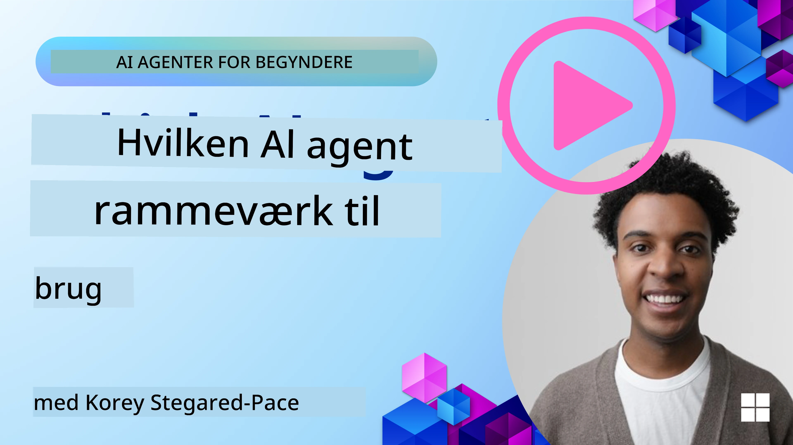

[](https://youtu.be/ODwF-EZo_O8?si=1xoy_B9RNQfrYdF7)

> _(Klik på billedet ovenfor for at se videoen af denne lektion)_

# Udforsk AI Agent Frameworks

AI agent frameworks er softwareplatforme designet til at forenkle oprettelse, implementering og styring af AI-agenter. Disse frameworks giver udviklere forudbyggede komponenter, abstraktioner og værktøjer, der strømliner udviklingen af komplekse AI-systemer.

Disse frameworks hjælper udviklere med at fokusere på de unikke aspekter af deres applikationer ved at tilbyde standardiserede tilgange til almindelige udfordringer inden for AI-agentudvikling. De forbedrer skalerbarhed, tilgængelighed og effektivitet i opbygningen af AI-systemer.

## Introduktion 

Denne lektion vil dække:

- Hvad er AI Agent Frameworks, og hvad gør de det muligt for udviklere at opnå?
- Hvordan kan teams bruge disse til hurtigt at prototype, iterere og forbedre deres agents kapaciteter?
- Hvad er forskellene mellem de frameworks og værktøjer, der er skabt af Microsoft (<a href="https://aka.ms/ai-agents-beginners/ai-agent-service" target="_blank">Microsoft Foundry Agent Service</a> og <a href="https://learn.microsoft.com/azure/ai-services/openai/how-to/responses" target="_blank">Microsoft Agent Framework</a>)?
- Kan jeg integrere mine eksisterende Azure økosystem værktøjer direkte, eller har jeg brug for selvstændige løsninger?
- Hvad er Microsoft Foundry Agent Service, og hvordan hjælper det mig?

## Læringsmål

Målet med denne lektion er at hjælpe dig med at forstå:

- AI Agent Frameworks rolle i AI-udvikling.
- Hvordan man udnytter AI Agent Frameworks til at bygge intelligente agenter.
- Nøglekapaciteter som AI Agent Frameworks muliggør.
- Forskellene mellem Microsoft Agent Framework og Microsoft Foundry Agent Service.

## Hvad er AI Agent Frameworks, og hvad gør de det muligt for udviklere at gøre?

Traditionelle AI Frameworks kan hjælpe dig med at integrere AI i dine apps og gøre disse apps bedre på følgende måder:

- **Personalisering**: AI kan analysere brugeradfærd og præferencer for at give personlige anbefalinger, indhold og oplevelser.
Eksempel: Streamingtjenester som Netflix bruger AI til at foreslå film og shows baseret på seerhistorik, hvilket øger brugerengagement og tilfredshed.
- **Automatisering og effektivitet**: AI kan automatisere gentagne opgaver, strømline arbejdsprocesser og forbedre operationel effektivitet.
Eksempel: Kundeservice-apps bruger AI-drevne chatbots til at håndtere almindelige forespørgsler, hvilket reducerer svartider og frigør menneskelige agenter til mere komplekse problemer.
- **Forbedret brugeroplevelse**: AI kan forbedre den samlede brugeroplevelse ved at tilbyde intelligente funktioner såsom stemmegenkendelse, naturlig sprogbehandling og forudsigende tekst.
Eksempel: Virtuelle assistenter som Siri og Google Assistant bruger AI til at forstå og reagere på stemmekommandoer, hvilket gør det lettere for brugere at interagere med deres enheder.

### Det lyder jo godt, men hvorfor har vi så brug for AI Agent Framework?

AI Agent frameworks repræsenterer noget mere end blot AI frameworks. De er designet til at gøre det muligt at skabe intelligente agenter, der kan interagere med brugere, andre agenter og miljøet for at nå specifikke mål. Disse agenter kan udvise autonom adfærd, træffe beslutninger og tilpasse sig skiftende betingelser. Lad os se på nogle nøglekapaciteter, som AI Agent Frameworks muliggør:

- **Agent-samarbejde og koordinering**: Muliggør oprettelse af flere AI-agenter, der kan arbejde sammen, kommunikere og koordinere for at løse komplekse opgaver.
- **Opgaveautomatisering og styring**: Tilbyder mekanismer til automatisering af flertrins-arbejdsprocesser, opgavedeling og dynamisk opgavestyring blandt agenter.
- **Kontekstuel forståelse og tilpasning**: Udstyrer agenter med evnen til at forstå kontekst, tilpasse sig skiftende miljøer og træffe beslutninger baseret på realtidsinformation.

Kort sagt gør agenter det muligt for dig at gøre mere, løfte automatisering til næste niveau og skabe mere intelligente systemer, der kan tilpasse sig og lære fra deres omgivelser.

## Hvordan kan man hurtigt prototype, iterere og forbedre agentens kapaciteter?

Dette er et hurtigt bevægende landskab, men der er nogle ting, der går igen i de fleste AI Agent Frameworks, og som kan hjælpe dig med hurtigt at prototype og iterere nemlig modulære komponenter, samarbejdsværktøjer og læring i realtid. Lad os dykke ned i disse:

- **Brug modulære komponenter**: AI SDK'er tilbyder forudbyggede komponenter såsom AI- og hukommelsesforbindelser, funktionsopkald ved hjælp af naturligt sprog eller kode-plugins, prompt-skabeloner og mere.
- **Udnyt samarbejdsværktøjer**: Design agenter med specifikke roller og opgaver, der gør det muligt for dem at teste og forbedre samarbejdsarbejdsprocesser.
- **Lær i realtid**: Implementer feedbacksløjfer, hvor agenter lærer af interaktioner og justerer deres adfærd dynamisk.

### Brug modulære komponenter

SDK'er som Microsoft Agent Framework tilbyder forudbyggede komponenter såsom AI-forbindelser, værktøjsdefinitioner og agentstyring.

**Hvordan teams kan bruge disse**: Teams kan hurtigt samle disse komponenter til at skabe en funktionel prototype uden at starte fra bunden, hvilket muliggør hurtig eksperimentering og iteration.

**Hvordan det fungerer i praksis**: Du kan bruge en forudbygget parser til at udtrække information fra brugerinput, en hukommelsesmodul til at lagre og hente data, og en promptgenerator til at interagere med brugere, alt uden at skulle bygge disse komponenter fra bunden.

**Eksempel på kode**. Lad os se på et eksempel på, hvordan du kan bruge Microsoft Agent Framework med `FoundryChatClient` til at få modellen til at reagere på brugerinput med værktøjsopkald:

``` python
# Microsoft Agent Framework Python eksempel

import asyncio
import os

from agent_framework import tool
from agent_framework.foundry import FoundryChatClient
from azure.identity import AzureCliCredential


# Definer en eksempel værktøjsfunktion til at booke rejse
@tool(approval_mode="never_require")
def book_flight(date: str, location: str) -> str:
    """Book travel given location and date."""
    return f"Travel was booked to {location} on {date}"


async def main():
    provider = FoundryChatClient(
        project_endpoint=os.environ["AZURE_AI_PROJECT_ENDPOINT"],
        model=os.environ["AZURE_AI_MODEL_DEPLOYMENT_NAME"],
        credential=AzureCliCredential(),
    )
    agent = provider.as_agent(
        name="travel_agent",
        instructions="Help the user book travel. Use the book_flight tool when ready.",
        tools=[book_flight],
    )

    response = await agent.run("I'd like to go to New York on January 1, 2025")
    print(response)
    # Eksempel output: Din flyrejse til New York den 1. januar 2025 er blevet succesfuldt booket. God rejse! ✈️🗽


if __name__ == "__main__":
    asyncio.run(main())
```

Det, du kan se fra dette eksempel, er, hvordan du kan udnytte en forudbygget parser til at udtrække nøgleinformation fra brugerinput, såsom oprindelse, destination og dato for en flybooking-forespørgsel. Denne modulære tilgang tillader dig at fokusere på den overordnede logik.

### Udnyt samarbejdsværktøjer

Frameworks som Microsoft Agent Framework faciliterer oprettelsen af flere agenter, der kan arbejde sammen.

**Hvordan teams kan bruge disse**: Teams kan designe agenter med specifikke roller og opgaver, hvilket gør det muligt at teste og forbedre samarbejdsarbejdsprocesser og øge systemets samlede effektivitet.

**Hvordan det fungerer i praksis**: Du kan oprette et team af agenter, hvor hver agent har en specialiseret funktion, såsom dataindsamling, analyse eller beslutningstagning. Disse agenter kan kommunikere og dele information for at opnå et fælles mål, såsom at besvare en brugerforespørgsel eller gennemføre en opgave.

**Eksempel på kode (Microsoft Agent Framework)**:

```python
# Opretter flere agenter, der arbejder sammen ved hjælp af Microsoft Agent Framework

import os
from agent_framework.foundry import FoundryChatClient
from azure.identity import AzureCliCredential

provider = FoundryChatClient(
    project_endpoint=os.environ["AZURE_AI_PROJECT_ENDPOINT"],
    model=os.environ["AZURE_AI_MODEL_DEPLOYMENT_NAME"],
    credential=AzureCliCredential(),
)

# Dataindsamlingsagent
agent_retrieve = provider.as_agent(
    name="dataretrieval",
    instructions="Retrieve relevant data using available tools.",
    tools=[retrieve_tool],
)

# Dataanalyseagent
agent_analyze = provider.as_agent(
    name="dataanalysis",
    instructions="Analyze the retrieved data and provide insights.",
    tools=[analyze_tool],
)

# Kør agenter i rækkefølge på en opgave
retrieval_result = await agent_retrieve.run("Retrieve sales data for Q4")
analysis_result = await agent_analyze.run(f"Analyze this data: {retrieval_result}")
print(analysis_result)
```

Det, du ser i den foregående kode, er, hvordan du kan oprette en opgave, der involverer flere agenter, der arbejder sammen om at analysere data. Hver agent udfører en specifik funktion, og opgaven udføres ved at koordinere agenterne for at opnå det ønskede resultat. Ved at skabe dedikerede agenter med specialiserede roller kan du forbedre opgaveeffektivitet og ydeevne.

### Lær i realtid

Avancerede frameworks tilbyder kapaciteter til kontekstforståelse og tilpasning i realtid.

**Hvordan teams kan bruge disse**: Teams kan implementere feedbacksløjfer, hvor agenter lærer af interaktioner og justerer deres adfærd dynamisk, hvilket fører til løbende forbedring og forfining af kapaciteter.

**Hvordan det fungerer i praksis**: Agenter kan analysere bruger feedback, miljødata og opgaveudfald for at opdatere deres vidensbase, justere beslutningstagende algoritmer og forbedre ydeevnen over tid. Denne iterative læringsproces gør det muligt for agenter at tilpasse sig skiftende forhold og brugerpræferencer, hvilket forbedrer systemets samlede effektivitet.

## Hvad er forskellene mellem Microsoft Agent Framework og Microsoft Foundry Agent Service?

Der er mange måder at sammenligne disse tilgange på, men lad os se på nogle nøgleforskelle hvad angår design, kapaciteter og målrettede brugsscenarier:

## Microsoft Agent Framework (MAF)

Microsoft Agent Framework tilbyder et strømlinet SDK til at bygge AI-agenter ved hjælp af `FoundryChatClient`. Det giver udviklere mulighed for at skabe agenter, der udnytter Azure OpenAI modeller med indbygget værktøjsopkald, samtalehåndtering og virksomhedssikkerhed gennem Azure-identitet.

**Brugsscenarier**: Opbygning af produktionsklar AI-agent med værktøjsbrug, flertrins-arbejdsprocesser og virksomhedsintegrationsscenarier.

Her er nogle vigtige grundlæggende begreber i Microsoft Agent Framework:

- **Agenter**. En agent oprettes via `FoundryChatClient` og konfigureres med navn, instruktioner og værktøjer. Agenten kan:
  - **Behandle brugerbeskeder** og generere svar ved hjælp af Azure OpenAI modeller.
  - **Kalder værktøjer** automatisk baseret på samtalekonteksten.
  - **Opretholde samtalestatus** på tværs af flere interaktioner.

  Her er et kodeeksempel, der viser, hvordan man opretter en agent:

    ```python
    import os
    from agent_framework.foundry import FoundryChatClient
    from azure.identity import AzureCliCredential

    provider = FoundryChatClient(
        project_endpoint=os.environ["AZURE_AI_PROJECT_ENDPOINT"],
        model=os.environ["AZURE_AI_MODEL_DEPLOYMENT_NAME"],
        credential=AzureCliCredential(),
    )
    agent = provider.as_agent(
        name="my_agent",
        instructions="You are a helpful assistant.",
    )

    response = await agent.run("Hello, World!")
    print(response)
    ```

- **Værktøjer**. Frameworket understøtter definition af værktøjer som Python-funktioner, som agenten kan kalde automatisk. Værktøjer registreres ved oprettelse af agenten:

    ```python
    def get_weather(location: str) -> str:
        """Get the current weather for a location."""
        return f"The weather in {location} is sunny, 72\u00b0F."

    agent = provider.as_agent(
        name="weather_agent",
        instructions="Help users check the weather.",
        tools=[get_weather],
    )
    ```

- **Mult-agent koordinering**. Du kan oprette flere agenter med forskellige specialiseringer og koordinere deres arbejde:

    ```python
    planner = provider.as_agent(
        name="planner",
        instructions="Break down complex tasks into steps.",
    )

    executor = provider.as_agent(
        name="executor",
        instructions="Execute the planned steps using available tools.",
        tools=[execute_tool],
    )

    plan = await planner.run("Plan a trip to Paris")
    result = await executor.run(f"Execute this plan: {plan}")
    ```

- **Azure Identitetsintegration**. Frameworket bruger `AzureCliCredential` (eller `DefaultAzureCredential`) for sikker, nøglefri autentificering, hvilket fjerner behovet for at håndtere API-nøgler direkte.

## Microsoft Foundry Agent Service

Microsoft Foundry Agent Service er en nyere tilføjelse, introduceret ved Microsoft Ignite 2024. Den tillader udvikling og implementering af AI-agenter med mere fleksible modeller, såsom direkte opkald til open source LLM'er som Llama 3, Mistral og Cohere.

Microsoft Foundry Agent Service tilbyder stærkere virksomhedssikkerhedsmekanismer og datalagringsmetoder, hvilket gør den velegnet til virksomhedsapplikationer. 

Den fungerer ud-af-boksen sammen med Microsoft Agent Framework til opbygning og implementering af agenter.

Denne service er i øjeblikket i offentlig preview og understøtter Python og C# til agentudvikling.

Ved at bruge Microsoft Foundry Agent Service Python SDK kan vi oprette en agent med et brugerdefineret værktøj:

```python
import asyncio
from azure.identity import DefaultAzureCredential
from azure.ai.projects import AIProjectClient

# Definer værktøjsfunktioner
def get_specials() -> str:
    """Provides a list of specials from the menu."""
    return """
    Special Soup: Clam Chowder
    Special Salad: Cobb Salad
    Special Drink: Chai Tea
    """

def get_item_price(menu_item: str) -> str:
    """Provides the price of the requested menu item."""
    return "$9.99"


async def main() -> None:
    credential = DefaultAzureCredential()
    project_client = AIProjectClient.from_connection_string(
        credential=credential,
        conn_str="your-connection-string",
    )

    agent = project_client.agents.create_agent(
        model="gpt-4o-mini",
        name="Host",
        instructions="Answer questions about the menu.",
        tools=[get_specials, get_item_price],
    )

    thread = project_client.agents.create_thread()

    user_inputs = [
        "Hello",
        "What is the special soup?",
        "How much does that cost?",
        "Thank you",
    ]

    for user_input in user_inputs:
        print(f"# User: '{user_input}'")
        message = project_client.agents.create_message(
            thread_id=thread.id,
            role="user",
            content=user_input,
        )
        run = project_client.agents.create_and_process_run(
            thread_id=thread.id, agent_id=agent.id
        )
        messages = project_client.agents.list_messages(thread_id=thread.id)
        print(f"# Agent: {messages.data[0].content[0].text.value}")


if __name__ == "__main__":
    asyncio.run(main())
```

### Grundlæggende begreber

Microsoft Foundry Agent Service har følgende grundlæggende begreber:

- **Agent**. Microsoft Foundry Agent Service integrerer med Microsoft Foundry. Inden for Microsoft Foundry fungerer en AI Agent som en "intelligent" mikrotjeneste, der kan bruges til at besvare spørgsmål (RAG), udføre handlinger eller fuldstændig automatisere arbejdsprocesser. Det opnås ved at kombinere generative AI-modellernes kraft med værktøjer, der tillader adgang til og interaktion med data fra den virkelige verden. Her er et eksempel på en agent:

    ```python
    agent = project_client.agents.create_agent(
        model="gpt-4o-mini",
        name="my-agent",
        instructions="You are helpful agent",
        tools=code_interpreter.definitions,
        tool_resources=code_interpreter.resources,
    )
    ```

    I dette eksempel oprettes en agent med modellen `gpt-4o-mini`, navnet `my-agent` og instruktionerne `You are helpful agent`. Agenten er udstyret med værktøjer og ressourcer til at udføre kodefortolkningsopgaver.

- **Tråde og beskeder**. Tråden er et andet vigtigt begreb. Den repræsenterer en samtale eller interaktion mellem en agent og en bruger. Tråde kan bruges til at spore fremskridt i en samtale, lagre kontekstinformation og styre status for interaktionen. Her er et eksempel på en tråd:

    ```python
    thread = project_client.agents.create_thread()
    message = project_client.agents.create_message(
        thread_id=thread.id,
        role="user",
        content="Could you please create a bar chart for the operating profit using the following data and provide the file to me? Company A: $1.2 million, Company B: $2.5 million, Company C: $3.0 million, Company D: $1.8 million",
    )
    
    # Bed agenten om at udføre arbejde på tråden
    run = project_client.agents.create_and_process_run(thread_id=thread.id, agent_id=agent.id)
    
    # Hent og log alle beskeder for at se agentens svar
    messages = project_client.agents.list_messages(thread_id=thread.id)
    print(f"Messages: {messages}")
    ```

    I den forrige kode oprettes en tråd. Derefter sendes en besked til tråden. Ved at kalde `create_and_process_run` bliver agenten bedt om at udføre arbejde på tråden. Endelig hentes og logges beskederne for at se agentens svar. Beskederne angiver fremskridtet i samtalen mellem bruger og agent. Det er også vigtigt at forstå, at beskeder kan være af forskellige typer såsom tekst, billede eller fil, altså at agentens arbejde har resulteret i f.eks. et billede eller et tekstsvar. Som udvikler kan du så bruge denne information til yderligere at behandle svaret eller præsentere det for brugeren.

- **Integreres med Microsoft Agent Framework**. Microsoft Foundry Agent Service fungerer sømløst sammen med Microsoft Agent Framework, hvilket betyder, at du kan bygge agenter ved hjælp af `FoundryChatClient` og implementere dem gennem Agent Service til produktionsscenarier.

**Brugsscenarier**: Microsoft Foundry Agent Service er designet til virksomhedsapplikationer, der kræver sikker, skalerbar og fleksibel implementering af AI-agenter.

## Hvad er forskellen mellem disse tilgange?
 
Det lyder som om, der er overlap, men der er nogle nøgleforskelle hvad angår design, kapaciteter og målrettede brugsscenarier:
 
- **Microsoft Agent Framework (MAF)**: Er et produktionsklart SDK til at bygge AI-agenter. Det giver en strømlinet API til at skabe agenter med værktøjsopkald, samtalehåndtering og Azure-identitetsintegration.
- **Microsoft Foundry Agent Service**: Er en platform- og implementeringstjeneste i Microsoft Foundry for agenter. Den tilbyder indbygget forbindelse til tjenester som Azure OpenAI, Azure AI Search, Bing Search og kodeeksekvering.
 
Er du stadig i tvivl om, hvilken du skal vælge?

### Brugsscenarier
 
Lad os se, om vi kan hjælpe dig ved at gennemgå nogle almindelige brugsscenarier:
 
> Q: Jeg bygger produktions-API agent-applikationer og vil hurtigt i gang
>

>A: Microsoft Agent Framework er et godt valg. Det tilbyder en simpel, pythonisk API via `FoundryChatClient`, der lader dig definere agenter med værktøjer og instruktioner i blot få kodelinjer.

>Q: Jeg har brug for implementering på virksomhedsniveau med Azure-integrationer som Search og kodeeksekvering
>
> A: Microsoft Foundry Agent Service er det bedste valg. Det er en platformtjeneste, der tilbyder indbyggede kapaciteter til flere modeller, Azure AI Search, Bing Search og Azure Functions. Det gør det nemt at bygge dine agenter i Foundry-portalen og implementere dem i stor skala.
 
> Q: Jeg er stadig forvirret, giv mig bare én mulighed
>
> A: Start med Microsoft Agent Framework til at bygge dine agenter, og brug derefter Microsoft Foundry Agent Service, når du har brug for at implementere og skalere dem i produktion. Denne tilgang lader dig hurtigt iterere over din agentlogik, mens du har en klar vej til virksomhedsintegration.
 
Lad os opsummere de vigtigste forskelle i en tabel:

| Framework | Fokus | Grundlæggende begreber | Brugsscenarier |
| --- | --- | --- | --- |
| Microsoft Agent Framework | Strømlinet agent-SDK med værktøjsopkald | Agenter, Værktøjer, Azure Identitet | Opbygning af AI-agenter, værktøjsbrug, flertrins arbejdsprocesser |
| Microsoft Foundry Agent Service | Fleksible modeller, virksomhedssikkerhed, kodegenerering, værktøjsopkald | Modularitet, Samarbejde, Procesorkestrering | Sikker, skalerbar og fleksibel implementering af AI-agenter |

## Kan jeg integrere mine eksisterende Azure økosystem værktøjer direkte, eller har jeg brug for selvstændige løsninger?


Svaret er ja, du kan integrere dine eksisterende Azure-økosystemværktøjer direkte med Microsoft Foundry Agent Service især, da det er bygget til at fungere problemfrit med andre Azure-tjenester. Du kan for eksempel integrere Bing, Azure AI Search og Azure Functions. Der er også dyb integration med Microsoft Foundry.

Microsoft Agent Framework integrerer også med Azure-tjenester gennem `FoundryChatClient` og Azure-identitet, hvilket giver dig mulighed for at kalde Azure-tjenester direkte fra dine agentværktøjer.

## Eksempelkoder

- Python: [Agent Framework (Microsoft Foundry)](./code_samples/02-python-agent-framework.ipynb)
- Python: [Agent Framework (Azure OpenAI Responses API)](./code_samples/02-python-agent-framework-azure-openai.ipynb)
- .NET: [Agent Framework](./code_samples/02-dotnet-agent-framework.md)

## Har du flere spørgsmål om AI Agent Frameworks?

Deltag i [Microsoft Foundry Discord](https://discord.com/invite/ATgtXmAS5D) for at møde andre lærende, deltage i kontortimer og få svar på dine spørgsmål om AI-agenter.

## Referencer

- <a href="https://techcommunity.microsoft.com/blog/azure-ai-services-blog/introducing-azure-ai-agent-service/4298357" target="_blank">Azure Agent Service</a>
- <a href="https://learn.microsoft.com/azure/ai-services/openai/how-to/responses" target="_blank">Microsoft Agent Framework - Azure OpenAI Responses</a>
- <a href="https://learn.microsoft.com/azure/ai-services/agents/overview" target="_blank">Microsoft Foundry Agent Service</a>

## Forrige lektion

[Introduktion til AI-agenter og agentbrugssager](../01-intro-to-ai-agents/README.md)

## Næste lektion

[Forståelse af agentiske designmønstre](../03-agentic-design-patterns/README.md)

---

<!-- CO-OP TRANSLATOR DISCLAIMER START -->
**Ansvarsfraskrivelse**:
Dette dokument er blevet oversat ved hjælp af AI-oversættelsestjenesten [Co-op Translator](https://github.com/Azure/co-op-translator). Selvom vi bestræber os på nøjagtighed, skal du være opmærksom på, at automatiserede oversættelser kan indeholde fejl eller unøjagtigheder. Det originale dokument på dets oprindelige sprog bør betragtes som den autoritative kilde. For kritisk information anbefales professionel menneskelig oversættelse. Vi påtager os intet ansvar for misforståelser eller fejltolkninger, der opstår som følge af brugen af denne oversættelse.
<!-- CO-OP TRANSLATOR DISCLAIMER END -->