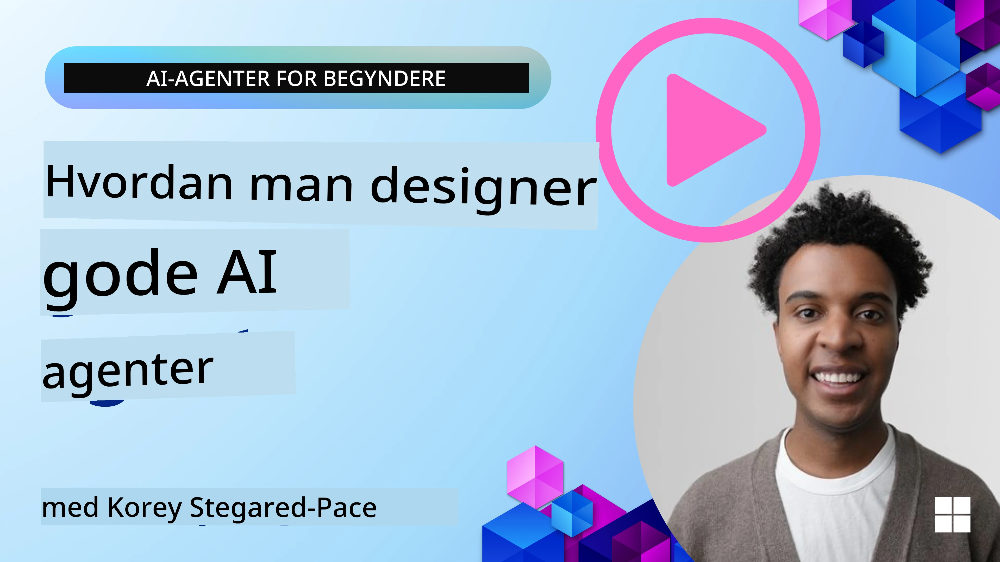
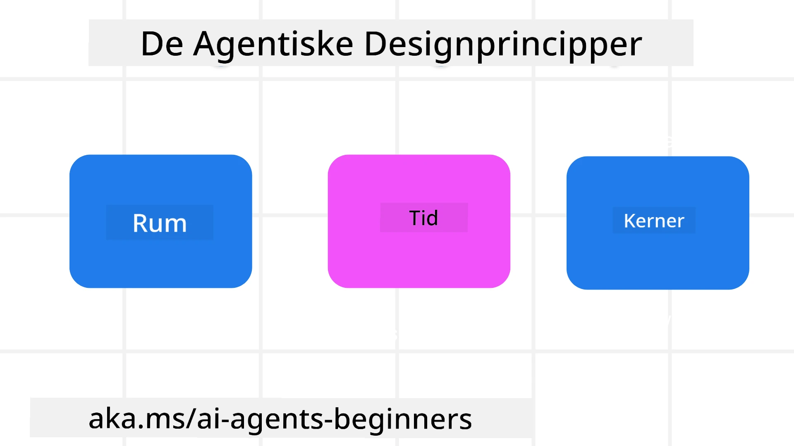

> _(Klik på billedet ovenfor for at se videoen af denne lektion)_
# Principper for AI-agentisk design

## Introduktion

Der er mange måder at tænke på opbygning af AI-agentiske systemer. Da tvetydighed er en funktion og ikke en fejl i Generativ AI design, kan det sommetider være svært for ingeniører at finde ud af, hvor de overhovedet skal starte. Vi har skabt et sæt menneskecentrerede UX-designprincipper for at gøre det muligt for udviklere at bygge kundecentrerede agentiske systemer til at løse deres forretningsbehov. Disse designprincipper er ikke en forskriftsmæssig arkitektur, men snarere et udgangspunkt for teams, der definerer og bygger agentoplevelser.

Generelt bør agenter:

- Udvide og skalere menneskelige kapaciteter (idégenerering, problemløsning, automatisering osv.)
- Udfylde videnshuller (sætte mig ind i vidensdomæner, oversættelse osv.)
- Facilitere og støtte samarbejde på de måder, vi som individer foretrækker at arbejde sammen med andre
- Gøre os til bedre versioner af os selv (f.eks. livscoach/vicevært, hjælpe os med at lære følelsesmæssig regulering og mindfulness-færdigheder, opbygge modstandskraft osv.)

## Denne lektion vil dække

- Hvad Agentic Design Principles er
- Hvilke retningslinjer der er at følge ved implementering af disse designprincipper
- Nogle eksempler på brug af designprincipperne

## Læringsmål

Efter afslutning af denne lektion vil du kunne:

1. Forklare hvad Agentic Design Principles er
2. Forklare retningslinjerne for brug af Agentic Design Principles
3. Forstå, hvordan man bygger en agent ved hjælp af Agentic Design Principles

## Agentic Design Principles

### Agent (Rum)

Dette er det miljø, hvor agenten opererer. Disse principper informerer om, hvordan vi designer agenter til at engagere sig i fysiske og digitale verdener.

- **Forbinder, ikke kollapser** – hjælper med at forbinde mennesker til andre mennesker, begivenheder og handlingsrettet viden for at muliggøre samarbejde og forbindelse.
- Agenter hjælper med at forbinde begivenheder, viden og mennesker.
- Agenter bringer mennesker tættere sammen. De er ikke designet til at erstatte eller forringe mennesker.
- **Let tilgængelig men af og til usynlig** – agenten opererer for det meste i baggrunden og giver kun et vink, når det er relevant og passende.
  - Agenten er let at finde og tilgængelig for autoriserede brugere på enhver enhed eller platform.
  - Agenten understøtter multimodale input og output (lyd, stemme, tekst osv.).
  - Agenten kan sømløst skifte mellem forgrund og baggrund; mellem proaktiv og reaktiv, afhængigt af dens opfattelse af brugerens behov.
  - Agenten kan operere i usynlig form, men dens baggrundsprocessti og samarbejde med andre agenter er gennemsigtigt og kontrollerbart for brugeren.

### Agent (Tid)

Sådan opererer agenten over tid. Disse principper informerer, hvordan vi designer agenter, der interagerer på tværs af fortid, nutid og fremtid.

- **Fortid**: Reflektere over historie, der inkluderer både tilstand og kontekst.
  - Agenten leverer mere relevante resultater baseret på analyse af rigere historiske data ud over blot begivenheder, mennesker eller tilstande.
  - Agenten skaber forbindelser fra fortidige begivenheder og reflekterer aktivt over erindring for at engagere sig i aktuelle situationer.
- **Nu**: At give et vink mere end blot at underrette.
  - Agenten indkapsler en omfattende tilgang til samspil med mennesker. Når en begivenhed sker, går agenten ud over statisk notifikation eller anden statisk formalitet. Agenten kan forenkle flow eller dynamisk generere signaler for at rette brugerens opmærksomhed på det rigtige tidspunkt.
  - Agenten leverer information baseret på kontekstuelt miljø, sociale og kulturelle ændringer og tilpasset brugerens hensigt.
  - Agentens interaktion kan være gradvis og udvikle/vokse i kompleksitet for at give brugerne mere magt på lang sigt.
- **Fremtid**: Tilpasning og udvikling.
  - Agenten tilpasser sig forskellige enheder, platforme og modaliteter.
  - Agenten tilpasser sig brugeradfærd, tilgængelighedsbehov og er frit tilpasselig.
  - Agenten formes af og udvikler sig gennem kontinuerlig brugerinteraktion.

### Agent (Kernea)

Dette er nøgleelementerne i kernen af et agentdesign.

- **Omfavn usikkerhed men etabler tillid**.
  - Et vist niveau af agentusikkerhed forventes. Usikkerhed er et nøgleelement i agentdesign.
  - Tillid og gennemsigtighed er fundamentale lag i agentdesign.
  - Mennesker har kontrol over, hvornår agenten er tændt/slukket, og agentstatus er tydeligt synlig til enhver tid.

## Retningslinjer til at implementere disse principper

Når du bruger de tidligere nævnte designprincipper, brug følgende retningslinjer:

1. **Gennemsigtighed**: Informer brugeren om, at AI er involveret, hvordan det fungerer (inklusive tidligere handlinger), og hvordan man giver feedback og ændrer systemet.
2. **Kontrol**: Gør det muligt for brugeren at tilpasse, angive præferencer og personalisere samt have kontrol over systemet og dets egenskaber (inklusive muligheden for at glemme).
3. **Konsistens**: Sigter mod konsistente, multimodale oplevelser på tværs af enheder og endepunkter. Brug velkendte UI/UX-elementer, hvor det er muligt (f.eks. mikrofonikon til stemmeinteraktion) og reducer brugerens kognitive belastning så meget som muligt (f.eks. sigt efter korte svar, visuelt hjælpemidler og 'Lær mere'-indhold).

## Hvordan man designer en rejseagent med disse principper og retningslinjer

Forestil dig, at du designer en rejseagent, her er hvordan du kan tænke på at bruge designprincipperne og retningslinjerne:

1. **Gennemsigtighed** – Lad brugeren vide, at rejseagenten er en AI-aktiveret agent. Giv nogle grundlæggende instruktioner om, hvordan man kommer i gang (f.eks. en "Hej" besked, eksempel-prompt). Dokumentér dette klart på produktsiden. Vis listen over prompts, som en bruger har brugt tidligere. Gør det klart, hvordan man giver feedback (tommel op og ned, Send feedback-knap osv.). Angiv tydeligt, hvis agenten har begrænsninger i brug eller emner.
2. **Kontrol** – Sørg for, at det er klart, hvordan brugeren kan ændre agenten, efter den er blevet oprettet med ting som System Prompt. Gør det muligt for brugeren at vælge, hvor udførlig agenten skal være, dens skrivestil og eventuelle forbehold om, hvad agenten ikke bør tale om. Tillad brugeren at se og slette alle tilknyttede filer eller data, prompts og tidligere samtaler.
3. **Konsistens** – Sørg for, at ikonerne til Del prompt, tilføj en fil eller et foto og tag en person eller ting er standard og genkendelige. Brug papirclipsikonet til at indikere filupload/deling med agenten, og et billedeikon til at indikere grafikupload.

## Eksempelkoder

- Python: [Agent Framework](./code_samples/03-python-agent-framework.ipynb)
- .NET: [Agent Framework](./code_samples/03-dotnet-agent-framework.md)

## Har du flere spørgsmål om AI-agentiske designmønstre?

Deltag i [Microsoft Foundry Discord](https://discord.com/invite/ATgtXmAS5D) for at møde andre lærende, deltage i åbningstider og få svar på dine spørgsmål om AI-agenter.

## Yderligere ressourcer

- <a href="https://openai.com" target="_blank">Praksis for styring af agentiske AI-systemer | OpenAI</a>
- <a href="https://microsoft.com" target="_blank">The HAX Toolkit Project - Microsoft Research</a>
- <a href="https://responsibleaitoolbox.ai" target="_blank">Responsible AI Toolbox</a>

## Forrige lektion

[Undersøgelse af agentiske frameworks](../02-explore-agentic-frameworks/README.md)

## Næste lektion

[Designmønster for værktøjsbrug](../04-tool-use/README.md)

---

<!-- CO-OP TRANSLATOR DISCLAIMER START -->
**Ansvarsfraskrivelse**:
Dette dokument er blevet oversat ved hjælp af AI-oversættelsestjenesten [Co-op Translator](https://github.com/Azure/co-op-translator). Selvom vi bestræber os på nøjagtighed, skal du være opmærksom på, at automatiserede oversættelser kan indeholde fejl eller unøjagtigheder. Det originale dokument på dets oprindelige sprog bør betragtes som den autoritative kilde. For kritisk information anbefales professionel menneskelig oversættelse. Vi påtager os intet ansvar for misforståelser eller fejltolkninger, der opstår som følge af brugen af denne oversættelse.
<!-- CO-OP TRANSLATOR DISCLAIMER END -->