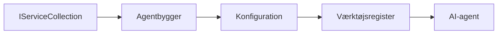

# 🎨 Agentiske Designmønstre med Azure OpenAI (Responses API) (.NET)

## 📋 Læringsmål

Dette eksempel viser virksomhedsklare designmønstre til at bygge intelligente agenter ved hjælp af Microsoft Agent Framework i .NET med Azure OpenAI (Responses API) integration. Du vil lære professionelle mønstre og arkitektoniske tilgange, der gør agenter produktionsegnede, vedligeholdelsesvenlige og skalerbare.

### Virksomhedsdesignmønstre

- 🏭 **Factory Pattern**: Standardiseret agentoprettelse med dependency injection
- 🔧 **Builder Pattern**: Flydende agentkonfiguration og opsætning
- 🧵 **Trådsikre Mønstre**: Samtidig samtalestyring
- 📋 **Repository Pattern**: Organiseret værktøjs- og kapabilitetsstyring

## 🎯 .NET-specifikke arkitektoniske fordele

### Virksomhedsfunktioner

- **Stærk Typning**: Kompileringstid validering og IntelliSense-understøttelse
- **Dependency Injection**: Indbygget DI container integration
- **Konfigurationsstyring**: IConfiguration og Options mønstre
- **Async/Await**: Førsteklasses asynkron programmeringssupport

### Produktionsegnede mønstre

- **Logging Integration**: ILogger og struktureret logningssupport
- **Sundhedstjek**: Indbygget overvågning og diagnostik
- **Konfigurationsvalidering**: Stærk typning med dataannoteringer
- **Fejlhåndtering**: Struktureret undtagelseshåndtering

## 🔧 Teknisk Arkitektur

### Kerne .NET komponenter

- **Microsoft.Extensions.AI**: Unified AI service-abstraktioner
- **Microsoft.Agents.AI**: Virksomhedsagent orkestreringsframework
- **Azure OpenAI (Responses API)**: Højtydende API klientmønstre
- **Konfigurationssystem**: appsettings.json og miljøintegration

### Designmønsterimplementering



## 🏗️ Demonstrerede Virksomhedsmønstre

### 1. **Oprettende Mønstre**

- **Agent Factory**: Centraliseret agentoprettelse med konsistent konfiguration
- **Builder Pattern**: Flydende API til kompleks agentkonfiguration
- **Singleton Pattern**: Delte ressourcer og konfigurationsstyring
- **Dependency Injection**: Løs kobling og testbarhed

### 2. **Adfærdsmønstre**

- **Strategy Pattern**: Udskiftelige værktøjsudførelsesstrategier
- **Command Pattern**: Indkapslede agentoperationer med fortryd/gentag
- **Observer Pattern**: Begivenhedsdreven agent-livscyklusstyring
- **Template Method**: Standardiserede agentudførelsesarbejdsgange

### 3. **Strukturelle Mønstre**

- **Adapter Pattern**: Azure OpenAI (Responses API) integrationslag
- **Decorator Pattern**: Forbedring af agentkapabiliteter
- **Facade Pattern**: Forenklede agentinteraktionsgrænseflader
- **Proxy Pattern**: Lazy loading og caching for ydeevne

## 📚 .NET Designprincipper

### SOLID Principper

- **Single Responsibility**: Hver komponent har ét klart formål
- **Open/Closed**: Udvidelig uden modifikation
- **Liskov Substitution**: Interface-baserede værktøjsimplementeringer
- **Interface Segregation**: Fokuserede, sammenhængende interfaces
- **Dependency Inversion**: Afhæng af abstraktioner, ikke konkret implementering

### Clean Arkitektur

- **Domænelag**: Kerne agent- og værktøjsabstraktioner
- **Applikationslag**: Agentorkestrering og arbejdsgange
- **Infrastrukturlag**: Azure OpenAI (Responses API) integration og eksterne services
- **Præsentationslag**: Brugerinteraktion og responsformatering

## 🔒 Virksomhedshensyn

### Sikkerhed

- **Credential Management**: Sikker håndtering af API-nøgler med IConfiguration
- **Inputvalidering**: Stærk typning og dataannoteringsvalidering
- **Output-sanitization**: Sikker responsbehandling og filtrering
- **Audit Logging**: Omfattende operationel sporing

### Ydeevne

- **Async Mønstre**: Ikke-blokerende I/O operationer
- **Connection Pooling**: Effektiv HTTP klientstyring
- **Caching**: Respons-caching for forbedret ydeevne
- **Ressourcestyring**: Korrekt oprydning og genbrugsmønstre

### Skalering

- **Trådsikkerhed**: Samtidig agentudførelsesunderstøttelse
- **Ressourcepuljering**: Effektiv ressourceudnyttelse
- **Load Management**: Ratebegrænsning og backpressure håndtering
- **Overvågning**: Ydeevnemålinger og sundhedstjek

## 🚀 Produktionsudrulning

- **Konfigurationsstyring**: Miljøspecifikke indstillinger
- **Logningsstrategi**: Struktureret logning med korrelations-id'er
- **Fejlhåndtering**: Global undtagelseshåndtering med korrekt genopretning
- **Overvågning**: Application Insights og ydeevnetællere
- **Testning**: Unit tests, integrationstests og belastningstestpatterns

Klar til at bygge virksomhedsklare intelligente agenter med .NET? Lad os designe noget robust! 🏢✨

## 🚀 Kom godt i gang

### Forudsætninger

- [.NET 10 SDK](https://dotnet.microsoft.com/download/dotnet/10.0) eller nyere
- Et [Azure abonnement](https://azure.microsoft.com/free/) med en Azure OpenAI-ressource og en modeludrulning
- Azure CLI'en ([Azure CLI](https://learn.microsoft.com/cli/azure/install-azure-cli)) — log ind med `az login`

### Krævede miljøvariabler

```bash
# zsh/bash
export AZURE_OPENAI_ENDPOINT=https://<your-resource>.openai.azure.com
export AZURE_OPENAI_DEPLOYMENT=gpt-4o-mini
# Log ind, så AzureCliCredential kan hente et token
az login
```

```powershell
# PowerShell
$env:AZURE_OPENAI_ENDPOINT = "https://<your-resource>.openai.azure.com"
$env:AZURE_OPENAI_DEPLOYMENT = "gpt-4o-mini"
# Log ind, så AzureCliCredential kan få et token
az login
```

### Eksempelkode

For at køre kodeeksemplet,

```bash
# zsh/bash
chmod +x ./03-dotnet-agent-framework.cs
./03-dotnet-agent-framework.cs
```

Eller brug dotnet CLI:

```bash
dotnet run ./03-dotnet-agent-framework.cs
```

Se [`03-dotnet-agent-framework.cs`](../../../../03-agentic-design-patterns/code_samples/03-dotnet-agent-framework.cs) for den komplette kode.

```csharp
#!/usr/bin/dotnet run

#:package Microsoft.Extensions.AI@10.*
#:package Microsoft.Agents.AI.OpenAI@1.*-*
#:package Azure.AI.OpenAI@2.1.0
#:package Azure.Identity@1.13.1

using System.ComponentModel;

using Microsoft.Agents.AI;
using Microsoft.Extensions.AI;

using Azure.AI.OpenAI;
using Azure.Identity;

// Tool Function: Random Destination Generator
// This static method will be available to the agent as a callable tool
// The [Description] attribute helps the AI understand when to use this function
// This demonstrates how to create custom tools for AI agents
[Description("Provides a random vacation destination.")]
static string GetRandomDestination()
{
    // List of popular vacation destinations around the world
    // The agent will randomly select from these options
    var destinations = new List<string>
    {
        "Paris, France",
        "Tokyo, Japan",
        "New York City, USA",
        "Sydney, Australia",
        "Rome, Italy",
        "Barcelona, Spain",
        "Cape Town, South Africa",
        "Rio de Janeiro, Brazil",
        "Bangkok, Thailand",
        "Vancouver, Canada"
    };

    // Generate random index and return selected destination
    // Uses System.Random for simple random selection
    var random = new Random();
    int index = random.Next(destinations.Count);
    return destinations[index];
}

// Azure OpenAI with the Responses API (stable v1 endpoint). Sign in with `az login`.
var azureEndpoint = Environment.GetEnvironmentVariable("AZURE_OPENAI_ENDPOINT")
    ?? throw new InvalidOperationException("AZURE_OPENAI_ENDPOINT is not set.");
var deployment = Environment.GetEnvironmentVariable("AZURE_OPENAI_DEPLOYMENT") ?? "gpt-4o-mini";

var azureClient = new AzureOpenAIClient(new Uri(azureEndpoint), new AzureCliCredential());

// Define Agent Identity and Comprehensive Instructions
// Agent name for identification and logging purposes
var AGENT_NAME = "TravelAgent";

// Detailed instructions that define the agent's personality, capabilities, and behavior
// This system prompt shapes how the agent responds and interacts with users
var AGENT_INSTRUCTIONS = """
You are a helpful AI Agent that can help plan vacations for customers.

Important: When users specify a destination, always plan for that location. Only suggest random destinations when the user hasn't specified a preference.

When the conversation begins, introduce yourself with this message:
"Hello! I'm your TravelAgent assistant. I can help plan vacations and suggest interesting destinations for you. Here are some things you can ask me:
1. Plan a day trip to a specific location
2. Suggest a random vacation destination
3. Find destinations with specific features (beaches, mountains, historical sites, etc.)
4. Plan an alternative trip if you don't like my first suggestion

What kind of trip would you like me to help you plan today?"

Always prioritize user preferences. If they mention a specific destination like "Bali" or "Paris," focus your planning on that location rather than suggesting alternatives.
""";

// Create AI Agent with Advanced Travel Planning Capabilities
// Get the Responses client for the deployment and create the AI agent
// Configure agent with name, detailed instructions, and available tools
// This demonstrates the .NET agent creation pattern with full configuration
AIAgent agent = azureClient
    .GetOpenAIResponseClient(deployment)
    .CreateAIAgent(
        name: AGENT_NAME,
        instructions: AGENT_INSTRUCTIONS,
        tools: [AIFunctionFactory.Create(GetRandomDestination)]
    );

// Create New Conversation Thread for Context Management
// Initialize a new conversation thread to maintain context across multiple interactions
// Threads enable the agent to remember previous exchanges and maintain conversational state
// This is essential for multi-turn conversations and contextual understanding
AgentThread thread = agent.GetNewThread();

// Execute Agent: First Travel Planning Request
// Run the agent with an initial request that will likely trigger the random destination tool
// The agent will analyze the request, use the GetRandomDestination tool, and create an itinerary
// Using the thread parameter maintains conversation context for subsequent interactions
await foreach (var update in agent.RunStreamingAsync("Plan me a day trip", thread))
{
    await Task.Delay(10);
    Console.Write(update);
}

Console.WriteLine();

// Execute Agent: Follow-up Request with Context Awareness
// Demonstrate contextual conversation by referencing the previous response
// The agent remembers the previous destination suggestion and will provide an alternative
// This showcases the power of conversation threads and contextual understanding in .NET agents
await foreach (var update in agent.RunStreamingAsync("I don't like that destination. Plan me another vacation.", thread))
{
    await Task.Delay(10);
    Console.Write(update);
}
```

---

<!-- CO-OP TRANSLATOR DISCLAIMER START -->
**Ansvarsfraskrivelse**:
Dette dokument er blevet oversat ved hjælp af AI-oversættelsestjenesten [Co-op Translator](https://github.com/Azure/co-op-translator). Selvom vi bestræber os på nøjagtighed, skal du være opmærksom på, at automatiserede oversættelser kan indeholde fejl eller unøjagtigheder. Det originale dokument på dets oprindelige sprog bør betragtes som den autoritative kilde. For kritisk information anbefales professionel menneskelig oversættelse. Vi påtager os intet ansvar for misforståelser eller fejltolkninger, der opstår som følge af brugen af denne oversættelse.
<!-- CO-OP TRANSLATOR DISCLAIMER END -->