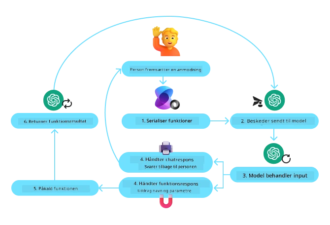
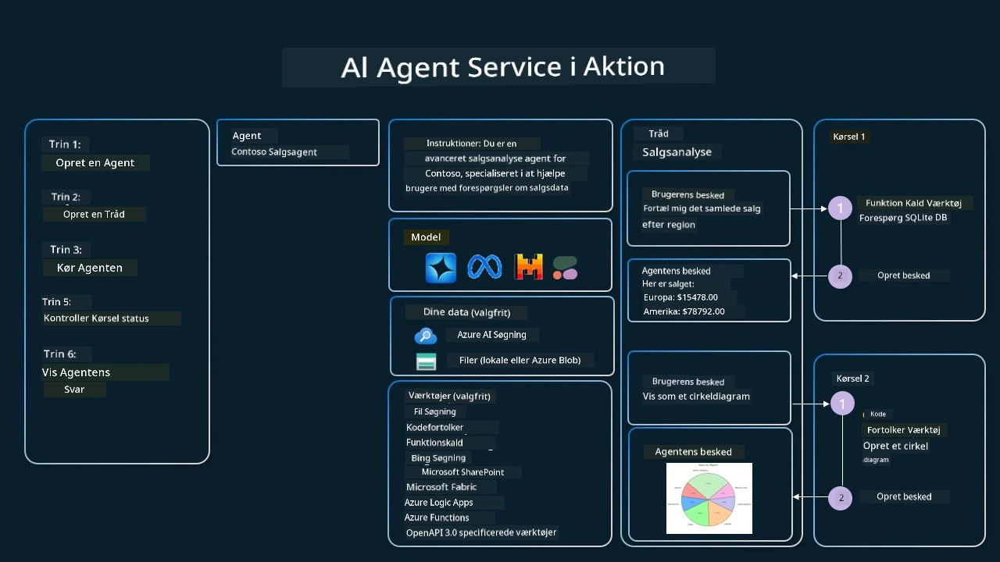

[](https://youtu.be/vieRiPRx-gI?si=cEZ8ApnT6Sus9rhn)

> _(Klik på billedet ovenfor for at se videoen af denne lektion)_

# Designmønster for brug af værktøjer

Værktøjer er interessante, fordi de giver AI-agenter mulighed for at have et bredere sæt af kapabiliteter. I stedet for at agenten kun har et begrænset sæt handlinger, den kan udføre, kan agenten nu ved at tilføje et værktøj udføre en bred vifte af handlinger. I dette kapitel vil vi se på designmønstret for brug af værktøjer, som beskriver, hvordan AI-agenter kan bruge specifikke værktøjer til at nå deres mål.

## Introduktion

I denne lektion søger vi at besvare følgende spørgsmål:

- Hvad er designmønstret for brug af værktøjer?
- Hvilke anvendelsestilfælde kan det anvendes på?
- Hvilke elementer/opbygningsblokke er nødvendige for at implementere designmønstret?
- Hvilke særlige hensyn skal der tages ved brug af designmønsteret for at bygge troværdige AI-agenter?

## Læringsmål

Efter at have gennemført denne lektion vil du kunne:

- Definere designmønstret for brug af værktøjer og dets formål.
- Identificere anvendelsestilfælde, hvor designmønstret for brug af værktøjer er relevant.
- Forstå de nøgleelementer, der er nødvendige for at implementere designmønstret.
- Genkende hensyn for at sikre troværdighed i AI-agenter, der bruger dette designmønster.

## Hvad er designmønstret for brug af værktøjer?

**Designmønstret for brug af værktøjer** fokuserer på at give LLM’er evnen til at interagere med eksterne værktøjer for at nå specifikke mål. Værktøjer er kode, som kan udføres af en agent for at udføre handlinger. Et værktøj kan være en simpel funktion som en lommeregner eller et API-kald til en tredjepartsservice som aktiekursopslag eller vejrudsigt. I konteksten af AI-agenter er værktøjer designet til at blive udført af agenter som svar på **modelgenererede funktionskald**.

## Hvilke anvendelsestilfælde kan det anvendes på?

AI-agenter kan udnytte værktøjer til at fuldføre komplekse opgaver, hente information eller træffe beslutninger. Designmønstret for brug af værktøjer anvendes ofte i scenarier, der kræver dynamisk interaktion med eksterne systemer, såsom databaser, webservices eller kodefortolkere. Denne evne er nyttig for en række forskellige anvendelser, herunder:

- **Dynamisk informationshentning:** Agenter kan spørge eksterne API’er eller databaser for at hente opdaterede data (f.eks. forespørgsler i en SQLite-database til dataanalyse, hente aktiekurser eller vejrinformation).
- **Udførelse og fortolkning af kode:** Agenter kan køre kode eller scripts for at løse matematiske problemer, generere rapporter eller udføre simuleringer.
- **Automatisering af arbejdsgange:** Automatisering af gentagende eller flertrins-arbejdsgange ved at integrere værktøjer som opgavestyringssystemer, e-mail-tjenester eller datapipelines.
- **Kundesupport:** Agenter kan interagere med CRM-systemer, ticketsystemer eller vidensbaser for at løse brugerhenvendelser.
- **Indholdsgenerering og redigering:** Agenter kan bruge værktøjer som grammatikcheckere, tekstopsummeringer eller indholdssikkerhedsvurderere til at assistere med opgaver i forbindelse med indholdsskabelse.

## Hvilke elementer/opbygningsblokke er nødvendige for at implementere designmønstret for brug af værktøjer?

Disse opbygningsblokke gør det muligt for AI-agenten at udføre et bredt spektrum af opgaver. Lad os kigge på nøgleelementerne, der er nødvendige for at implementere designmønstret for brug af værktøjer:

- **Funktions-/værktøjsskemaer**: Detaljerede definitioner af tilgængelige værktøjer, inklusive funktionsnavn, formål, krævede parametre og forventede output. Disse skemaer gør det muligt for LLM at forstå, hvilke værktøjer der er tilgængelige, og hvordan der kan konstrueres gyldige forespørgsler.

- **Logik for funktionsudførelse**: Styrer, hvordan og hvornår værktøjer kaldes baseret på brugerens intention og samtalekontekst. Dette kan inkludere planlægningsmoduler, routingmekanismer eller betingede flows, der dynamisk afgør brugen af værktøjer.

- **Beskedhåndteringssystem**: Komponenter, som styrer samtaleflow mellem brugerinput, LLM-responser, værktøjskald og værktøjsoutput.

- **Integrationsrammeværk for værktøjer**: Infrastruktur, der forbinder agenten til forskellige værktøjer, hvad enten det er simple funktioner eller komplekse eksterne services.

- **Fejlhåndtering & validering**: Mekanismer til at håndtere fejl i værktøjsudførelse, validere parametre og håndtere uventede svar.

- **State Management**: Holder styr på samtalekontekst, tidligere værktøjskald og vedvarende data for at sikre konsistens på tværs af samtaler med flere omgange.

Lad os nu se nærmere på Funktions-/værktøjskald.

### Funktions-/værktøjskald

Funktionskald er den primære måde, hvorpå vi gør det muligt for store sprogmodeller (LLM’er) at interagere med værktøjer. Du vil ofte se 'Funktion' og 'Værktøj' brugt om hinanden, fordi 'funktioner' (genanvendelige kodeblokke) er de 'værktøjer', som agenter bruger til at udføre opgaver. For at kode til en funktion kan blive udført, skal en LLM sammenligne brugerens forespørgsel med beskrivelsen af funktionerne. Til dette formål sendes et skema, der indeholder beskrivelserne af alle tilgængelige funktioner, til LLM’en. LLM’en vælger derefter den mest passende funktion til opgaven og returnerer dens navn og argumenter. Den valgte funktion bliver så kaldt, og dens svar sendes tilbage til LLM’en, som bruger informationen til at svare på brugerens forespørgsel.

For udviklere, der vil implementere funktionskald for agenter, skal du bruge:

1. En LLM-model, der understøtter funktionskald
2. Et skema, som indeholder funktionsbeskrivelser
3. Koden til hver beskrevne funktion

Lad os tage eksemplet med at få den aktuelle tid i en by til illustration:

1. **Initialiser en LLM, der understøtter funktionskald:**

    Ikke alle modeller understøtter funktionskald, så det er vigtigt at sikre, at den LLM, du bruger, gør det. <a href="https://learn.microsoft.com/azure/ai-services/openai/how-to/function-calling" target="_blank">Azure OpenAI</a> understøtter funktionskald. Vi kan starte med at initialisere Azure OpenAI klienten.

    ```python
    # Initialiser Azure OpenAI-klienten
    client = AzureOpenAI(
        azure_endpoint = os.getenv("AZURE_AI_PROJECT_ENDPOINT"), 
        api_key=os.getenv("AZURE_OPENAI_API_KEY"),  
        api_version="2024-05-01-preview"
    )
    ```

1. **Opret et funktionsskema:**

    Dernæst definerer vi et JSON-skema, som indeholder funktionsnavnet, beskrivelse af hvad funktionen gør, og navn og beskrivelser af funktionsparametrene.
    Vi sender derefter dette skema til klienten, som vi oprettede tidligere, sammen med brugerens forespørgsel om at finde tidspunktet i San Francisco. Det vigtige at bemærke er, at et **værktøjskald** er det, der returneres, **ikke** det endelige svar på spørgsmålet. Som tidligere nævnt returnerer LLM’en navnet på funktionen, den har valgt til opgaven, og de argumenter, der skal gives til den.

    ```python
    # Funktionsbeskrivelse til modellen at læse
    tools = [
        {
            "type": "function",
            "function": {
                "name": "get_current_time",
                "description": "Get the current time in a given location",
                "parameters": {
                    "type": "object",
                    "properties": {
                        "location": {
                            "type": "string",
                            "description": "The city name, e.g. San Francisco",
                        },
                    },
                    "required": ["location"],
                },
            }
        }
    ]
    ```
   
    ```python
  
    # Initial brugerbesked
    messages = [{"role": "user", "content": "What's the current time in San Francisco"}] 
  
    # Første API-opkald: Bed modellen om at bruge funktionen
      response = client.chat.completions.create(
          model=deployment_name,
          messages=messages,
          tools=tools,
          tool_choice="auto",
      )
  
      # Behandl modellens svar
      response_message = response.choices[0].message
      messages.append(response_message)
  
      print("Model's response:")  

      print(response_message)
  
    ```

    ```bash
    Model's response:
    ChatCompletionMessage(content=None, role='assistant', function_call=None, tool_calls=[ChatCompletionMessageToolCall(id='call_pOsKdUlqvdyttYB67MOj434b', function=Function(arguments='{"location":"San Francisco"}', name='get_current_time'), type='function')])
    ```
  
1. **Funktionskoden, der udfører opgaven:**

    Nu hvor LLM’en har valgt, hvilken funktion der skal køres, skal koden til at udføre opgaven implementeres og køres.
    Vi kan implementere koden til at hente den aktuelle tid i Python. Vi skal også skrive koden til at udtrække navn og argumenter fra response_message for at få det endelige resultat.

    ```python
      def get_current_time(location):
        """Get the current time for a given location"""
        print(f"get_current_time called with location: {location}")  
        location_lower = location.lower()
        
        for key, timezone in TIMEZONE_DATA.items():
            if key in location_lower:
                print(f"Timezone found for {key}")  
                current_time = datetime.now(ZoneInfo(timezone)).strftime("%I:%M %p")
                return json.dumps({
                    "location": location,
                    "current_time": current_time
                })
      
        print(f"No timezone data found for {location_lower}")  
        return json.dumps({"location": location, "current_time": "unknown"})
    ```

     ```python
     # Håndter funktionsopkald
      if response_message.tool_calls:
          for tool_call in response_message.tool_calls:
              if tool_call.function.name == "get_current_time":
     
                  function_args = json.loads(tool_call.function.arguments)
     
                  time_response = get_current_time(
                      location=function_args.get("location")
                  )
     
                  messages.append({
                      "tool_call_id": tool_call.id,
                      "role": "tool",
                      "name": "get_current_time",
                      "content": time_response,
                  })
      else:
          print("No tool calls were made by the model.")  
  
      # Anden API-opkald: Få det endelige svar fra modellen
      final_response = client.chat.completions.create(
          model=deployment_name,
          messages=messages,
      )
  
      return final_response.choices[0].message.content
     ```

     ```bash
      get_current_time called with location: San Francisco
      Timezone found for san francisco
      The current time in San Francisco is 09:24 AM.
     ```

Funktionskald er kernen i de fleste, hvis ikke alle, agentværktøjsdesign, men det kan nogle gange være udfordrende at implementere det fra bunden.
Som vi lærte i [Lektion 2](../../../02-explore-agentic-frameworks) giver agentiske frameworks os færdigbyggede opbygningsblokke til at implementere brug af værktøjer.

## Eksempler på brug af værktøjer med agentiske frameworks

Her er nogle eksempler på, hvordan du kan implementere designmønstret for brug af værktøjer ved hjælp af forskellige agentiske frameworks:

### Microsoft Agent Framework

<a href="https://learn.microsoft.com/azure/ai-services/agents/overview" target="_blank">Microsoft Agent Framework</a> er et open source AI-framework til at bygge AI-agenter. Det forenkler processen med at bruge funktionskald ved at lade dig definere værktøjer som Python-funktioner med `@tool`-dekorationen. Frameworket håndterer kommunikationen frem og tilbage mellem modellen og din kode. Det giver også adgang til færdigbyggede værktøjer som fil-søgning og kodefortolker gennem `AzureAIProjectAgentProvider`.

Følgende diagram illustrerer processen med funktionskald i Microsoft Agent Framework:



I Microsoft Agent Framework defineres værktøjer som dekorerede funktioner. Vi kan konvertere funktionen `get_current_time`, som vi så tidligere, til et værktøj ved at bruge `@tool`-dekorationen. Frameworket vil automatisk serialisere funktionen og dens parametre og skabe det skema, der sendes til LLM’en.

```python
from agent_framework import tool
from agent_framework.azure import AzureAIProjectAgentProvider
from azure.identity import AzureCliCredential

@tool
def get_current_time(location: str) -> str:
    """Get the current time for a given location"""
    ...

# Opret klienten
provider = AzureAIProjectAgentProvider(credential=AzureCliCredential())

# Opret en agent og kør med værktøjet
agent = await provider.create_agent(name="TimeAgent", instructions="Use available tools to answer questions.", tools=get_current_time)
response = await agent.run("What time is it?")
```
  
### Azure AI Agent Service

<a href="https://learn.microsoft.com/azure/ai-services/agents/overview" target="_blank">Azure AI Agent Service</a> er et nyere agentisk framework, der er designet til at give udviklere mulighed for sikkert at bygge, implementere og skalere AI-agenter af høj kvalitet og med udvidelsesmuligheder uden at skulle håndtere underliggende compute- og lagringsressourcer. Det er særligt nyttigt til virksomhedsapplikationer, da det er en fuldt administreret service med entreprisegradssikkerhed.

Sammenlignet med at udvikle direkte med LLM API’en giver Azure AI Agent Service nogle fordele, herunder:

- Automatisk værktøjskald – ingen grund til at parse et værktøjskald, kalde værktøjet og håndtere svaret; alt dette håndteres nu på serversiden
- Sikkert administrerede data – i stedet for at håndtere din egen samtalestatus kan du stole på threads til at gemme al nødvendig information
- Færdige værktøjer – Værktøjer du kan bruge til at interagere med dine datakilder, såsom Bing, Azure AI Search og Azure Functions.

Værktøjerne, der er tilgængelige i Azure AI Agent Service, kan opdeles i to kategorier:

1. Videnværktøjer:
    - <a href="https://learn.microsoft.com/azure/ai-services/agents/how-to/tools/bing-grounding?tabs=python&pivots=overview" target="_blank">Grounding med Bing Search</a>
    - <a href="https://learn.microsoft.com/azure/ai-services/agents/how-to/tools/file-search?tabs=python&pivots=overview" target="_blank">Fil-søgning</a>
    - <a href="https://learn.microsoft.com/azure/ai-services/agents/how-to/tools/azure-ai-search?tabs=azurecli%2Cpython&pivots=overview-azure-ai-search" target="_blank">Azure AI Search</a>

2. Handlingværktøjer:
    - <a href="https://learn.microsoft.com/azure/ai-services/agents/how-to/tools/function-calling?tabs=python&pivots=overview" target="_blank">Funktionskald</a>
    - <a href="https://learn.microsoft.com/azure/ai-services/agents/how-to/tools/code-interpreter?tabs=python&pivots=overview" target="_blank">Kodefortolker</a>
    - <a href="https://learn.microsoft.com/azure/ai-services/agents/how-to/tools/openapi-spec?tabs=python&pivots=overview" target="_blank">OpenAPI-definerede værktøjer</a>
    - <a href="https://learn.microsoft.com/azure/ai-services/agents/how-to/tools/azure-functions?pivots=overview" target="_blank">Azure Functions</a>

Agentservicen gør det muligt at bruge disse værktøjer samlet som et `toolset`. Den benytter også `threads`, der holder styr på historikken af beskeder fra en bestemt samtale.

Forestil dig, at du er salgsagent i et firma kaldet Contoso. Du ønsker at udvikle en samtaleagent, som kan besvare spørgsmål om dine salgsdata.

Det følgende billede illustrerer, hvordan du kunne bruge Azure AI Agent Service til at analysere dine salgsdata:



For at bruge nogle af disse værktøjer med servicen kan vi oprette en klient og definere et værktøj eller toolset. For at implementere dette praktisk kan vi bruge følgende Python-kode. LLM’en kan kigge på toolsettet og beslutte, om den skal bruge den brugeroprettede funktion `fetch_sales_data_using_sqlite_query` eller den forudbyggede kodefortolker afhængigt af brugerens forespørgsel.

```python 
import os
from azure.ai.projects import AIProjectClient
from azure.identity import DefaultAzureCredential
from fetch_sales_data_functions import fetch_sales_data_using_sqlite_query # fetch_sales_data_using_sqlite_query funktion, som kan findes i en fetch_sales_data_functions.py fil.
from azure.ai.projects.models import ToolSet, FunctionTool, CodeInterpreterTool

project_client = AIProjectClient.from_connection_string(
    credential=DefaultAzureCredential(),
    conn_str=os.environ["PROJECT_CONNECTION_STRING"],
)

# Initialiser værktøjssæt
toolset = ToolSet()

# Initialiser funktionskaldsagent med funktionen fetch_sales_data_using_sqlite_query og tilføj den til værktøjssættet
fetch_data_function = FunctionTool(fetch_sales_data_using_sqlite_query)
toolset.add(fetch_data_function)

# Initialiser Code Interpreter værktøj og tilføj det til værktøjssættet.
code_interpreter = CodeInterpreterTool()toolset.add(code_interpreter)

agent = project_client.agents.create_agent(
    model="gpt-4o-mini", name="my-agent", instructions="You are helpful agent", 
    toolset=toolset
)
```

## Hvilke særlige hensyn skal der tages ved brug af designmønstret for at bygge troværdige AI-agenter?

En almindelig bekymring ved dynamisk genereret SQL af LLM’er er sikkerhed, især risikoen for SQL-injektion eller ondsindede handlinger som sletning eller manipulation af databasen. Selvom disse bekymringer er gyldige, kan de effektivt afbødes ved korrekt konfiguration af databaseadgangstilladelser. For de fleste databaser indebærer dette, at databasen konfigureres som skrivebeskyttet. For databaser som PostgreSQL eller Azure SQL bør appen tildeles en skrivebeskyttet (SELECT) rolle.

Kørsel af appen i et sikkert miljø forbedrer yderligere beskyttelsen. I virksomhedsscenarier ekstraheres og transformeres data typisk fra operationelle systemer til en skrivebeskyttet database eller datalager med et brugervenligt skema. Denne tilgang sikrer, at data er sikre, optimeret for ydeevne og tilgængelighed, og at appen kun har begrænset, skrivebeskyttet adgang.

## Eksempelkoder

- Python: [Agent Framework](./code_samples/04-python-agent-framework.ipynb)
- .NET: [Agent Framework](./code_samples/04-dotnet-agent-framework.md)

## Har du flere spørgsmål om designmønsteret for brug af værktøjer?

Deltag i [Microsoft Foundry Discord](https://discord.com/invite/ATgtXmAS5D) for at møde andre elever, deltage i kontortimer og få svar på dine AI-agent-spørgsmål.

## Yderligere ressourcer

- <a href="https://microsoft.github.io/build-your-first-agent-with-azure-ai-agent-service-workshop/" target="_blank">Azure AI Agents Service Workshop</a>
- <a href="https://github.com/Azure-Samples/contoso-creative-writer/tree/main/docs/workshop" target="_blank">Contoso Creative Writer Multi-Agent Workshop</a>
- <a href="https://learn.microsoft.com/azure/ai-services/agents/overview" target="_blank">Oversigt over Microsoft Agent Framework</a>

## Forrige lektion

[Forståelse af agentiske designmønstre](../03-agentic-design-patterns/README.md)

## Næste lektion
[Agentic RAG](../05-agentic-rag/README.md)

---

<!-- CO-OP TRANSLATOR DISCLAIMER START -->
**Ansvarsfraskrivelse**:
Dette dokument er blevet oversat ved hjælp af AI-oversættelsestjenesten [Co-op Translator](https://github.com/Azure/co-op-translator). Selvom vi bestræber os på nøjagtighed, skal du være opmærksom på, at automatiserede oversættelser kan indeholde fejl eller unøjagtigheder. Det originale dokument på dets oprindelige sprog bør betragtes som den autoritative kilde. For kritisk information anbefales professionel menneskelig oversættelse. Vi påtager os intet ansvar for misforståelser eller fejltolkninger, der opstår som følge af brugen af denne oversættelse.
<!-- CO-OP TRANSLATOR DISCLAIMER END -->