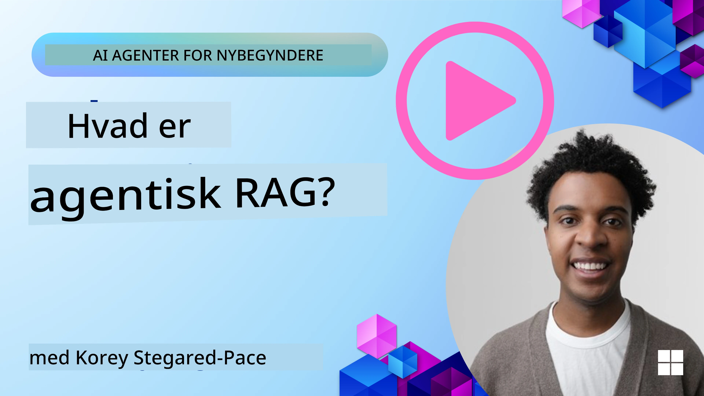
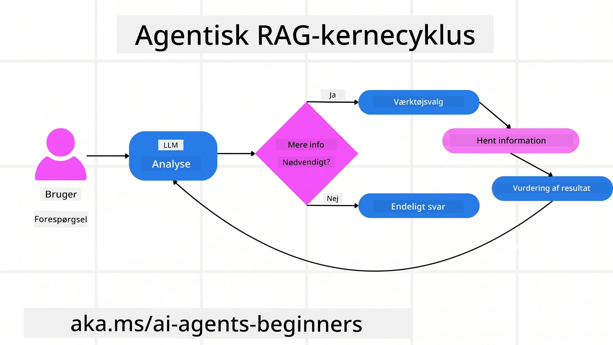
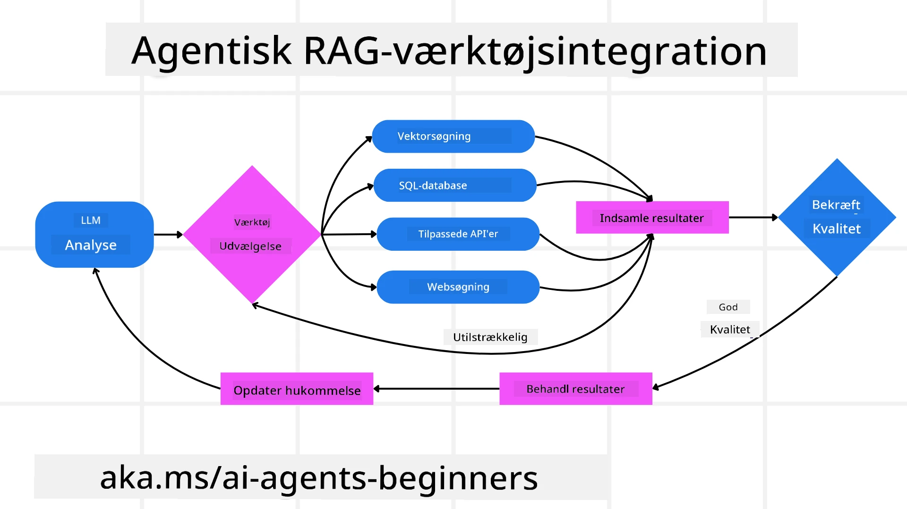
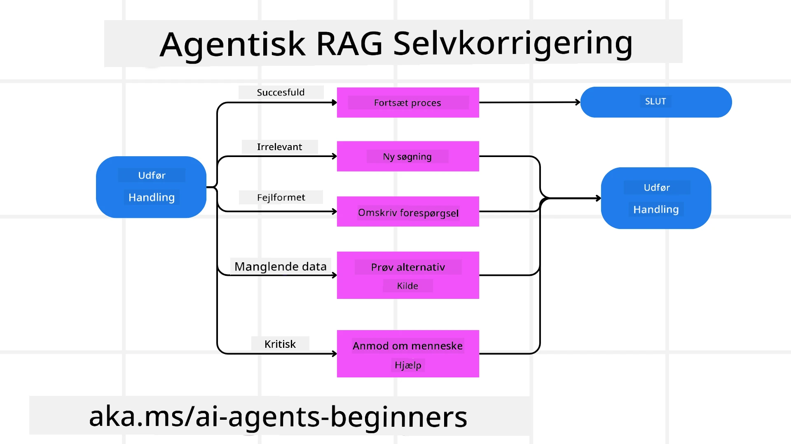
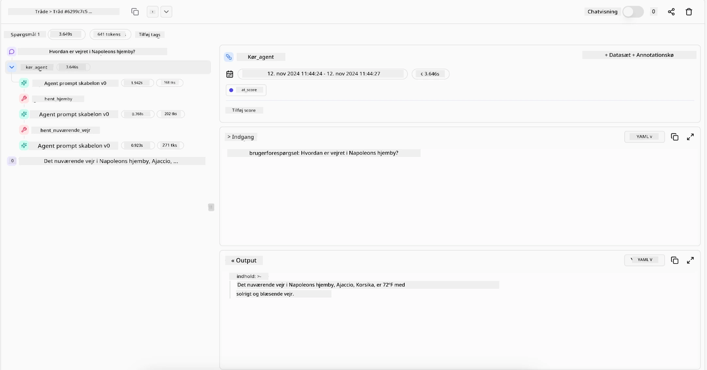

> _(Klik på billedet ovenfor for at se videoen af denne lektion)_

# Agentic RAG

Denne lektion giver en omfattende oversigt over Agentic Retrieval-Augmented Generation (Agentic RAG), en fremspirende AI-paradigme, hvor store sprogmodeller (LLMs) selvstændigt planlægger deres næste skridt, mens de henter information fra eksterne kilder. I modsætning til statiske hent-og-læs-mønstre involverer Agentic RAG iterative kald til LLM’en, afbrudt af kald til værktøjer eller funktioner og strukturerede output. Systemet evaluerer resultaterne, forfiner forespørgsler, aktiverer yderligere værktøjer efter behov og fortsætter denne cyklus, indtil der opnås en tilfredsstillende løsning.

## Introduktion

Denne lektion vil dække

- **Forstå Agentic RAG:** Lær om det fremspirende paradigme i AI, hvor store sprogmodeller (LLMs) selvstændigt planlægger deres næste skridt, mens de henter information fra eksterne datakilder.
- **Forstå Iterativ Maker-Checker Stil:** Forstå løkken af iterative kald til LLM’en, afbrudt af værktøjs- eller funktionskald og strukturerede output, designet til at forbedre korrekthed og håndtere fejlagtige forespørgsler.
- **Undersøg Praktiske Anvendelser:** Identificer scenarier, hvor Agentic RAG udmærker sig, såsom korrektheds-først miljøer, komplekse databaseinteraktioner og udvidede arbejdsflows.

## Læringsmål

Efter at have gennemført denne lektion vil du kunne/forstå:

- **Forståelse af Agentic RAG:** Lær om det fremspirende paradigme i AI, hvor store sprogmodeller (LLMs) selvstændigt planlægger deres næste skridt, mens de henter information fra eksterne datakilder.
- **Iterativ Maker-Checker Stil:** Forstå konceptet om en løkke af iterative kald til LLM’en, afbrudt af værktøjs- eller funktionskald og strukturerede output, designet til at forbedre korrekthed og håndtere fejlagtige forespørgsler.
- **At Eje Tankegangen:** Forstå systemets evne til at eje sin egen tankegang, træffe beslutninger om hvordan det skal gribe problemer an uden at være afhængigt af foruddefinerede stier.
- **Arbejdsgang:** Forstå hvordan en agentisk model uafhængigt beslutter at hente markedsrapportering om trends, identificere konkurrentdata, korrelere interne salgstal, syntetisere fund og evaluere strategien.
- **Iterative Løkker, Værktøjsintegration og Hukommelse:** Lær om systemets afhængighed af en loopet interaktionsmodel, som opretholder tilstand og hukommelse gennem trinene for at undgå gentagne løkker og træffe informerede beslutninger.
- **Håndtering af Fejltilstande og Selvkorrigering:** Udforsk systemets robuste selvkorrigerende mekanismer, inklusive iterativ gentagelse, brug af diagnostiske værktøjer og fallback til menneskelig overvågning.
- **Grænser for Agentur:** Forstå begrænsningerne i Agentic RAG med fokus på domænespecifik autonomi, infrastrukturafhængighed og respekt for sikkerhedsforanstaltninger.
- **Praktiske Anvendelsestilfælde og Værdi:** Identificer scenarier, hvor Agentic RAG udmærker sig, såsom korrektheds-først miljøer, komplekse databaseinteraktioner og udvidede arbejdsflows.
- **Styring, Transparens og Tillid:** Lær om vigtigheden af styring og transparens, herunder forklarlig tankegang, bias-kontrol og menneskelig overvågning.

## Hvad er Agentic RAG?

Agentic Retrieval-Augmented Generation (Agentic RAG) er et fremspirende AI-paradigme, hvor store sprogmodeller (LLMs) selvstændigt planlægger deres næste skridt, mens de henter information fra eksterne kilder. I modsætning til statiske hent-og-læs-mønstre involverer Agentic RAG iterative kald til LLM’en, afbrudt af kald til værktøjer eller funktioner og strukturerede output. Systemet evaluerer resultaterne, forfiner forespørgsler, aktiverer yderligere værktøjer efter behov og fortsætter denne cyklus indtil en tilfredsstillende løsning opnås. Denne iterative “maker-checker” stil forbedrer korrekthed, håndterer fejlagtige forespørgsler og sikrer resultater af høj kvalitet.

Systemet ejer aktivt sin tankegang ved at omskrive mislykkede forespørgsler, vælge forskellige hentemetoder og integrere flere værktøjer — såsom vektorsøgning i Azure AI Search, SQL-databaser eller tilpassede API’er — før det færdiggør sit svar. Den definerende kvalitet ved et agentisk system er evnen til at eje sin tankegang. Traditionelle RAG-implementeringer er afhængige af foruddefinerede stier, men et agentisk system bestemmer autonomt rækkefølgen af skridt baseret på kvaliteten af den information, det finder.

## Definition af Agentic Retrieval-Augmented Generation (Agentic RAG)

Agentic Retrieval-Augmented Generation (Agentic RAG) er et fremspirende paradigme inden for AI-udvikling, hvor LLM’er ikke blot henter information fra eksterne datakilder, men også selvstændigt planlægger deres næste skridt. I modsætning til statiske hent-og-læs-mønstre eller omhyggeligt scriptede promptsekvenser involverer Agentic RAG en løkke af iterative kald til LLM’en, afbrudt af værktøjs- eller funktionskald og strukturerede output. Ved hvert trin evaluerer systemet de opnåede resultater, beslutter om det skal forfine sine forespørgsler, aktiverer yderligere værktøjer om nødvendigt og fortsætter denne cyklus, indtil det opnår en tilfredsstillende løsning.

Denne iterative “maker-checker” arbejdsstil er designet til at forbedre korrekthed, håndtere fejlagtige forespørgsler til strukturerede databaser (f.eks. NL2SQL) og sikre afbalancerede, resultater af høj kvalitet. I stedet for udelukkende at stole på omhyggeligt designede promptkæder ejer systemet aktivt sin egen tankegang. Det kan omskrive forespørgsler der fejler, vælge forskellige hentemetoder og integrere flere værktøjer — såsom vektorsøgning i Azure AI Search, SQL-databaser eller tilpassede API’er — før det færdiggør sit svar. Dette eliminerer behovet for alt for komplekse orkestreringsrammer. I stedet kan en relativt simpel løkke af “LLM-kald → værktøjsbrug → LLM-kald → …” give sofistikerede og velbegrundede output.

## At Eje Tankegangen

Den definerende kvalitet, der gør et system “agentisk”, er dets evne til at eje sin tankegang. Traditionelle RAG-implementeringer afhænger ofte af, at mennesker foruddefinerer en sti for modellen: en tankekæde, der skitserer hvad der skal hentes og hvornår.  
Men når et system er virkelig agentisk, beslutter det internt, hvordan det skal gribe problemet an. Det udfører ikke blot et script; det bestemmer selvstændigt rækkefølgen af skridt baseret på kvaliteten af den information, det finder.  
For eksempel, hvis det bliver bedt om at skabe en produktlanceringsstrategi, er det ikke kun afhængigt af en prompt, der forklarer hele forsknings- og beslutningsarbejdsgangen. I stedet beslutter den agentiske model uafhængigt at:

1. Hente aktuelle markedsrapporteringer om trends via Bing Web Grounding  
2. Identificere relevante konkurrentdata ved hjælp af Azure AI Search.  
3. Korrelation af historiske interne salgstal ved brug af Azure SQL Database.  
4. Syntetisere resultaterne til en sammenhængende strategi orkestreret via Azure OpenAI Service.  
5. Evaluere strategien for mangler eller uoverensstemmelser og tage en ny runde af hentning, hvis nødvendigt.  
Alle disse trin — forfining af forespørgsler, valg af kilder, iterere indtil man er “tilfreds” med svaret — træffes af modellen, ikke foruddefineret af et menneske.

## Iterative Løkker, Værktøjsintegration og Hukommelse

Et agentisk system er afhængigt af en loopet interaktionsmodel:

- **Første Kald:** Brugerens mål (også kaldet brugerprompt) præsenteres for LLM’en.  
- **Værktøjskald:** Hvis modellen identificerer manglende information eller tvetydige instruktioner, vælger den et værktøj eller en hentemetode — som en forespørgsel til en vektordatabasesøgning (f.eks. Azure AI Search Hybrid-søgning i privat data) eller et struktureret SQL-kald — for at indsamle mere kontekst.  
- **Vurdering & Forfining:** Efter at have gennemgået de returnerede data, beslutter modellen om informationen er tilstrækkelig. Hvis ikke, forfiner den forespørgslen, prøver et andet værktøj eller justerer sin tilgang.  
- **Gentag Indtil Tilfreds:** Denne cyklus fortsætter, indtil modellen fastslår, at den har nok klarhed og beviser til at levere et endeligt, velbegrundet svar.  
- **Hukommelse & Tilstand:** Fordi systemet opretholder tilstand og hukommelse gennem trinnene, kan det huske tidligere forsøg og deres resultater, undgå gentagne løkker og træffe mere informerede beslutninger undervejs.

Med tiden skaber dette en følelse af udviklende forståelse, som gør modellen i stand til at navigere komplekse, flerstegsopgaver uden konstant menneskelig indgriben eller omskrivning af prompten.

## Håndtering af Fejltilstande og Selvkorrigering

Agentic RAG’s autonomi involverer også robuste selvkorrigerende mekanismer. Når systemet støder på blindgyder — såsom at hente irrelevante dokumenter eller møde fejlagtige forespørgsler — kan det:

- **Iterere og Spørge Igen:** I stedet for at returnere lavværdige svar forsøger modellen nye søgestrategier, omskriver databaseforespørgsler eller kigger på alternative datasæt.  
- **Bruge Diagnostiske Værktøjer:** Systemet kan aktivere yderligere funktioner designet til at hjælpe med at fejlfinde dets tankegange eller bekræfte korrektheden af de hentede data. Værktøjer som Azure AI Tracing vil være vigtige for at muliggøre robust observabilitet og overvågning.  
- **Fallback til Menneskelig Overvågning:** For situationer med høj risiko eller gentagne fejl kan modellen markere usikkerhed og anmode om menneskelig vejledning. Når mennesket giver korrektion, kan modellen inkorporere den læring fremadrettet.

Denne iterative og dynamiske tilgang tillader modellen at forbedre sig kontinuerligt og sikrer, at det ikke bare er et one-shot system, men et der lærer af sine fejl under en given session.

## Grænser for Agentur

På trods af sin autonomi inden for en opgave er Agentic RAG ikke analogt med Artificial General Intelligence. Dets “agentiske” evner er begrænset til de værktøjer, datakilder og politikker, som menneskelige udviklere stiller til rådighed. Det kan ikke opfinde sine egne værktøjer eller træde uden for de domænegrænser, der er sat. I stedet excellerer det i dynamisk orkestrering af de tilgængelige ressourcer.  
Nøgleforskelle fra mere avancerede AI-former inkluderer:

1. **Domænespecifik Autonomi:** Agentic RAG-systemer fokuserer på at opnå brugerdefinerede mål inden for et kendt domæne ved at bruge strategier som forespørgselsomskrivelse eller værktøjsvalg for at forbedre resultaterne.  
2. **Infrastrukturafhængighed:** Systemets kapaciteter afhænger af de værktøjer og data, udviklerne integrerer. Det kan ikke overskride disse grænser uden menneskelig indgriben.  
3. **Respekt for Sikkerhedsforanstaltninger:** Etiske retningslinjer, overholdelsesregler og forretningspolitikker forbliver yderst vigtige. Agentens frihed er altid begrænset af sikkerhedsforanstaltninger og tilsynsmekanismer (forhåbentlig?).

## Praktiske Anvendelsestilfælde og Værdi

Agentic RAG udmærker sig i scenarier, der kræver iterativ forfining og præcision:

1. **Korrektheds-først Miljøer:** Ved compliance-tjek, regulatoriske analyser eller juridisk forskning kan den agentiske model gentagne gange verificere fakta, konsultere flere kilder og omskrive forespørgsler, indtil den producerer et grundigt valideret svar.  
2. **Komplekse Databaseinteraktioner:** Når man arbejder med struktureret data, hvor forespørgsler ofte fejler eller kræver justering, kan systemet selvstændigt forfine sine forespørgsler ved hjælp af Azure SQL eller Microsoft Fabric OneLake, hvilket sikrer, at den endelige hentning stemmer overens med brugerens hensigt.  
3. **Udvidede Arbejdsflows:** Længerevarende sessioner kan udvikle sig, efterhånden som ny information dukker op. Agentic RAG kan løbende inkorporere ny data og ændre strategier, efterhånden som den lærer mere om problemområdet.

## Styring, Transparens og Tillid

Efterhånden som disse systemer bliver mere autonome i deres tankegang, er styring og transparens afgørende:

- **Forklarlig Tankegang:** Modellen kan levere en audit trail over de forespørgsler, den har lavet, de kilder den har konsulteret, og de tanketrin den har fulgt for at nå sin konklusion. Værktøjer som Azure AI Content Safety og Azure AI Tracing / GenAIOps kan hjælpe med at opretholde transparens og reducere risici.  
- **Bias-kontrol og Afbalanceret Hentning:** Udviklere kan justere hentningsstrategier for at sikre, at balancerede, repræsentative datakilder tages i betragtning, og regelmæssigt revidere output for at opdage bias eller skæve mønstre ved at bruge brugerdefinerede modeller til avancerede data science-organisationer, som anvender Azure Machine Learning.  
- **Menneskelig Overvågning og Overholdelse:** For følsomme opgaver er menneskelig gennemgang stadig væsentlig. Agentic RAG erstatter ikke menneskelig dømmekraft i beslutninger med høj risiko — det understøtter den ved at levere mere grundigt validerede muligheder.

At have værktøjer, der kan levere en klar registrering af handlinger, er afgørende. Uden dem kan fejlfinding i en flerstegsproces være meget vanskelig. Se det følgende eksempel fra Literal AI (firmaet bag Chainlit) for en Agent-kørsel:

## Konklusion

Agentic RAG repræsenterer en naturlig udvikling i den måde, AI-systemer håndterer komplekse, dataintensive opgaver på. Ved at adopterer en loopet interaktionsmodel, autonomt vælge værktøjer og forfine forespørgsler indtil et højtkvalitetsresultat opnås, bevæger systemet sig ud over statisk prompt-efterlevelse til en mere adaptiv, kontekstbevidst beslutningstager. Selvom det stadig er begrænset af menneskedefinerede infrastrukturer og etiske retningslinjer, muliggør disse agentiske kapaciteter rigere, mere dynamiske og i sidste ende mere nyttige AI-interaktioner for både virksomheder og slutbrugere.

### Har du flere spørgsmål om Agentic RAG?

Deltag i [Microsoft Foundry Discord](https://discord.com/invite/ATgtXmAS5D) for at møde andre lærende, deltage i kontortimer og få svar på dine spørgsmål om AI-agenter.

## Yderligere Ressourcer

- <a href="https://learn.microsoft.com/training/modules/use-own-data-azure-openai" target="_blank">Implementer Retrieval Augmented Generation (RAG) med Azure OpenAI Service: Lær hvordan du bruger dine egne data med Azure OpenAI Service. Denne Microsoft Learn-modul giver en omfattende guide til implementering af RAG</a>
- <a href="https://learn.microsoft.com/azure/ai-studio/concepts/evaluation-approach-gen-ai" target="_blank">Evaluering af generative AI-applikationer med Microsoft Foundry: Denne artikel dækker evaluering og sammenligning af modeller på offentligt tilgængelige datasæt, inklusive agentiske AI-applikationer og RAG-arkitekturer</a>
- <a href="https://weaviate.io/blog/what-is-agentic-rag" target="_blank">Hvad er Agentic RAG | Weaviate</a>
- <a href="https://ragaboutit.com/agentic-rag-a-complete-guide-to-agent-based-retrieval-augmented-generation/" target="_blank">Agentic RAG: En komplet guide til agentbaseret Retrieval Augmented Generation – Nyheder fra generation RAG</a>
- <a href="https://huggingface.co/learn/cookbook/agent_rag" target="_blank">Agentic RAG: turbooplad din RAG med forespørgselsreformulering og selvforespørgsel! Hugging Face Open-Source AI Cookbook</a>
- <a href="https://youtu.be/aQ4yQXeB1Ss?si=2HUqBzHoeB5tR04U" target="_blank">Tilføjelse af Agentiske Lag til RAG</a>
- <a href="https://www.youtube.com/watch?v=zeAyuLc_f3Q&t=244s" target="_blank">Fremtiden for Videnassistenter: Jerry Liu</a>
- <a href="https://www.youtube.com/watch?v=AOSjiXP1jmQ" target="_blank">Hvordan man bygger Agentiske RAG-systemer</a>
- <a href="https://ignite.microsoft.com/sessions/BRK102?source=sessions" target="_blank">Brug af Microsoft Foundry Agent Service til at skalere dine AI-agenter</a>

### Akademiske Artikler

- <a href="https://arxiv.org/abs/2303.17651" target="_blank">2303.17651 Self-Refine: Iterativ Forfining med Selv-feedback</a>
- <a href="https://arxiv.org/abs/2303.11366" target="_blank">2303.11366 Reflexion: Sproglig Agent med Verbal Forstærkningslæring</a>
- <a href="https://arxiv.org/abs/2305.11738" target="_blank">2305.11738 CRITIC: Store Sproglige Modeller Kan Selv-Korrigere med Værktøjs-Interaktiv Kritik</a>
- <a href="https://arxiv.org/abs/2501.09136" target="_blank">2501.09136 Agentic Retrieval-Augmented Generation: En Undersøgelse af Agentic RAG</a>

## Forrige Lektion

[Tool Use Design Pattern](../04-tool-use/README.md)

## Næste Lektion

[Building Trustworthy AI Agents](../06-building-trustworthy-agents/README.md)

---

<!-- CO-OP TRANSLATOR DISCLAIMER START -->
**Ansvarsfraskrivelse**:
Dette dokument er blevet oversat ved hjælp af AI-oversættelsestjenesten [Co-op Translator](https://github.com/Azure/co-op-translator). Selvom vi bestræber os på nøjagtighed, skal du være opmærksom på, at automatiserede oversættelser kan indeholde fejl eller unøjagtigheder. Det originale dokument på dets oprindelige sprog bør betragtes som den autoritative kilde. For kritisk information anbefales professionel menneskelig oversættelse. Vi påtager os intet ansvar for misforståelser eller fejltolkninger, der opstår som følge af brugen af denne oversættelse.
<!-- CO-OP TRANSLATOR DISCLAIMER END -->